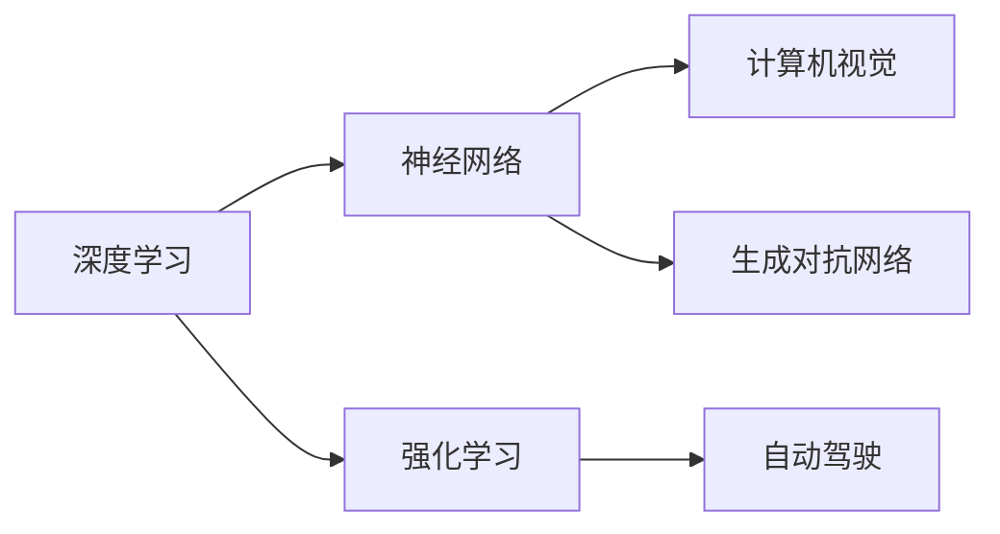

                 

# Andrej Karpathy：人工智能的未来发展目标

> 关键词：
1. 人工智能(AI)
2. 深度学习(Deep Learning)
3. 神经网络(Neural Networks)
4. 强化学习(Reinforcement Learning)
5. 自动驾驶(Autonomous Driving)
6. 生成对抗网络(GANs)
7. 计算机视觉(Computer Vision)

## 1. 背景介绍

### 1.1 问题由来
Andrej Karpathy是深度学习领域的重要人物，以其在神经网络、强化学习等领域的创新研究和深度见解著称。他的工作推动了人工智能技术的快速发展和应用。本文将深入探讨Karpathy对人工智能未来发展的见解，特别是他在深度学习、自动驾驶和生成对抗网络等方面的未来目标。

### 1.2 问题核心关键点
本文将从以下几个方面探讨Karpathy对人工智能未来发展的见解：

1. 深度学习的最新进展和挑战。
2. 自动驾驶技术的未来发展方向。
3. 生成对抗网络在图像生成、图像修复等任务中的应用潜力。
4. 计算机视觉技术的突破和应用前景。
5. 人工智能在医疗、教育、金融等垂直领域的深度应用。

## 2. 核心概念与联系

### 2.1 核心概念概述

- **深度学习(Deep Learning)**：通过多层神经网络结构，从大量数据中自动学习复杂特征和模式的一种机器学习方法。
- **神经网络(Neural Networks)**：由大量人工神经元组成的网络结构，用于处理复杂数据和识别模式。
- **强化学习(Reinforcement Learning)**：通过与环境的交互，通过奖励信号来优化行为的一种学习方式。
- **自动驾驶(Autonomous Driving)**：无需人工干预，车辆通过人工智能技术自动导航和控制的一种驾驶方式。
- **生成对抗网络(GANs)**：由生成器和判别器组成的两个网络，通过对抗训练生成逼真图像、视频等。
- **计算机视觉(Computer Vision)**：使计算机能够理解、分析和解释视觉数据的领域。

### 2.2 概念间的关系

Karpathy认为，这些核心概念和技术是相互关联的，它们共同构成了人工智能的发展框架。以下Mermaid流程图展示了这些概念之间的关系：



这个流程图展示了深度学习、神经网络、强化学习、自动驾驶、计算机视觉和生成对抗网络之间的内在联系。这些技术相互支持、相互促进，共同推动人工智能的发展。

## 3. 核心算法原理 & 具体操作步骤
### 3.1 算法原理概述

Karpathy对深度学习的发展有着深刻的见解，他认为深度学习的核心在于构建多层次的非线性特征表示。以下是对深度学习核心算法原理的概述：

1. **多层感知器(Multilayer Perceptron, MLP)**：最基础的深度学习模型，由多个全连接层组成。
2. **卷积神经网络(Convolutional Neural Networks, CNNs)**：适用于图像处理任务，通过卷积操作提取局部特征。
3. **循环神经网络(Recurrent Neural Networks, RNNs)**：适用于序列数据，通过时间步动态更新网络状态。
4. **生成对抗网络(GANs)**：通过生成器和判别器的对抗训练，生成高质量的图像、视频等。
5. **变分自编码器(Variational Autoencoders, VAEs)**：用于数据压缩和生成，通过编码器和解码器的协作学习。

### 3.2 算法步骤详解

以下是对深度学习算法步骤的详细讲解：

1. **数据准备**：收集、清洗和预处理训练数据，分为训练集、验证集和测试集。
2. **模型构建**：选择合适的深度学习模型架构，如卷积神经网络、循环神经网络等。
3. **参数初始化**：随机初始化模型的权重和偏置。
4. **前向传播**：将输入数据传递通过网络，得到模型的预测输出。
5. **损失计算**：计算预测输出与真实标签之间的差异，确定损失函数。
6. **反向传播**：通过链式法则计算损失函数对网络参数的梯度。
7. **参数更新**：使用优化算法（如SGD、Adam等）更新模型参数。
8. **模型评估**：在测试集上评估模型性能，如准确率、F1分数等。

### 3.3 算法优缺点

深度学习的优点包括：

1. **自动特征提取**：无需手动设计特征，通过学习自动提取数据中的有用信息。
2. **泛化能力强**：能够在复杂的数据集上取得良好效果。
3. **灵活性高**：适用于各种类型的数据，如图像、语音、文本等。

深度学习的缺点包括：

1. **计算资源消耗大**：需要大量GPU和数据。
2. **模型复杂度高**：难以解释，存在黑箱问题。
3. **过拟合风险**：训练集过小可能导致模型过拟合。

### 3.4 算法应用领域

深度学习在多个领域取得了显著成果，以下是一些主要应用领域：

- **计算机视觉**：图像分类、物体检测、人脸识别等。
- **自然语言处理**：机器翻译、文本生成、情感分析等。
- **语音识别**：语音转文本、语音合成等。
- **医疗健康**：医学影像分析、病历分析等。
- **自动驾驶**：环境感知、路径规划、决策控制等。

## 4. 数学模型和公式 & 详细讲解

### 4.1 数学模型构建

深度学习的数学模型主要由以下几个部分构成：

1. **输入层**：接收原始数据。
2. **隐藏层**：通过非线性变换提取特征。
3. **输出层**：生成预测结果。

假设输入层的大小为 $m$，隐藏层的大小为 $n$，输出层的大小为 $p$，则深度神经网络可以表示为：

$$
f(x) = W_1 \cdot f(x) + b_1
$$

其中 $f(x)$ 表示输入，$W_1$ 和 $b_1$ 是隐藏层的权重和偏置。

### 4.2 公式推导过程

以下是对深度学习中常见损失函数的推导：

1. **交叉熵损失(Cross-Entropy Loss)**：

$$
\mathcal{L}_{CE} = -\frac{1}{N}\sum_{i=1}^N \sum_{j=1}^C y_j\log\hat{y}_j
$$

其中 $y_j$ 表示真实标签，$\hat{y}_j$ 表示模型的预测概率。

2. **均方误差损失(Mean Squared Error, MSE)**：

$$
\mathcal{L}_{MSE} = \frac{1}{N}\sum_{i=1}^N (y_i - \hat{y}_i)^2
$$

其中 $y_i$ 表示真实值，$\hat{y}_i$ 表示模型的预测值。

3. **生成对抗网络(GANs)的损失函数**：

生成器损失函数：

$$
\mathcal{L}_G = \mathbb{E}_{x \sim p_{data}} [-\log D(G(x))]
$$

判别器损失函数：

$$
\mathcal{L}_D = \mathbb{E}_{x \sim p_{data}} [\log D(x)] + \mathbb{E}_{x \sim p_G} [-\log D(x)]
$$

其中 $p_{data}$ 表示真实数据分布，$p_G$ 表示生成器生成的数据分布。

### 4.3 案例分析与讲解

以图像生成任务为例，使用生成对抗网络(GANs)进行图像生成。以下是一个简单的GANs模型：

1. **生成器**：

$$
z \sim N(0,1), G(z) = \mu + \sigma f(Wz + b)
$$

其中 $z$ 是输入的随机噪声，$f$ 是非线性变换函数，$W$ 和 $b$ 是可训练参数。

2. **判别器**：

$$
D(x) = \frac{1}{2}(1 + \sigma f(Wx + b))
$$

其中 $x$ 是输入的真实图像，$f$ 是非线性变换函数，$W$ 和 $b$ 是可训练参数。

通过交替训练生成器和判别器，生成器可以生成逼真的图像，判别器可以识别生成图像与真实图像的差异。

## 5. 项目实践：代码实例和详细解释说明

### 5.1 开发环境搭建

在进行深度学习项目实践前，需要准备好开发环境。以下是使用PyTorch搭建深度学习环境的流程：

1. 安装Anaconda：从官网下载并安装Anaconda，用于创建独立的Python环境。
2. 创建并激活虚拟环境：
```bash
conda create -n pytorch-env python=3.8 
conda activate pytorch-env
```

3. 安装PyTorch：根据CUDA版本，从官网获取对应的安装命令。例如：
```bash
conda install pytorch torchvision torchaudio cudatoolkit=11.1 -c pytorch -c conda-forge
```

4. 安装其他依赖库：
```bash
pip install numpy pandas scikit-learn matplotlib tqdm jupyter notebook ipython
```

### 5.2 源代码详细实现

以下是使用PyTorch进行图像生成任务的代码实现：

```python
import torch
import torch.nn as nn
import torch.optim as optim
import torchvision.transforms as transforms
from torchvision.datasets import CIFAR10
from torch.utils.data import DataLoader

# 定义生成器网络
class Generator(nn.Module):
    def __init__(self):
        super(Generator, self).__init__()
        self.main = nn.Sequential(
            nn.Linear(100, 256),
            nn.LeakyReLU(0.2, inplace=True),
            nn.Linear(256, 512),
            nn.LeakyReLU(0.2, inplace=True),
            nn.Linear(512, 1024),
            nn.LeakyReLU(0.2, inplace=True),
            nn.Linear(1024, 3*3*256),
            nn.Tanh()
        )

    def forward(self, x):
        return self.main(x)

# 定义判别器网络
class Discriminator(nn.Module):
    def __init__(self):
        super(Discriminator, self).__init__()
        self.main = nn.Sequential(
            nn.Linear(3*3*256, 1024),
            nn.LeakyReLU(0.2, inplace=True),
            nn.Dropout(0.25),
            nn.Linear(1024, 512),
            nn.LeakyReLU(0.2, inplace=True),
            nn.Dropout(0.25),
            nn.Linear(512, 256),
            nn.LeakyReLU(0.2, inplace=True),
            nn.Dropout(0.25),
            nn.Linear(256, 1),
            nn.Sigmoid()
        )

    def forward(self, x):
        return self.main(x)

# 定义优化器
G_optimizer = optim.Adam(G.parameters(), lr=0.0002, betas=(0.5, 0.999))
D_optimizer = optim.Adam(D.parameters(), lr=0.0002, betas=(0.5, 0.999))

# 定义数据集
transform = transforms.Compose([
    transforms.ToTensor(),
    transforms.Normalize((0.5, 0.5, 0.5), (0.5, 0.5, 0.5))
])
train_data = CIFAR10(root='./data', train=True, transform=transform, download=True)
train_loader = DataLoader(train_data, batch_size=64, shuffle=True)

# 定义训练函数
def train(epoch, G_optimizer, D_optimizer, G, D):
    for batch_idx, (x, _) in enumerate(train_loader):
        x = x.view(-1, 3, 32, 32).to(device)
        
        # 生成器训练
        G_optimizer.zero_grad()
        fake_x = G(x)
        y_pred = D(fake_x)
        G_loss = criterion(y_pred, real_labels)
        G_loss.backward()
        G_optimizer.step()

        # 判别器训练
        D_optimizer.zero_grad()
        real_x = x.to(device)
        real_labels = torch.ones(batch_size, 1).to(device)
        fake_labels = torch.zeros(batch_size, 1).to(device)
        real_labels = real_labels.to(device)
        fake_labels = fake_labels.to(device)
        D_real_loss = criterion(D(real_x), real_labels)
        D_fake_loss = criterion(D(fake_x.detach()), fake_labels)
        D_loss = D_real_loss + D_fake_loss
        D_loss.backward()
        D_optimizer.step()

        if batch_idx == 0 and epoch == 0:
            print('Epoch {}/{} [{}/{} ({:.0f}%)]\t'.
                  'G Loss: {:.6f}, D Loss: {:.6f}'.format(
                      epoch, num_epochs, batch_idx * len(x), len(train_loader.dataset),
                      100. * batch_idx / len(train_loader), G_loss.item(), D_loss.item()))

# 定义训练过程
num_epochs = 10
device = torch.device('cuda' if torch.cuda.is_available() else 'cpu')
G = Generator().to(device)
D = Discriminator().to(device)
criterion = nn.BCELoss()

for epoch in range(num_epochs):
    train(epoch, G_optimizer, D_optimizer, G, D)

# 保存模型
torch.save(G.state_dict(), 'G.ckpt')
torch.save(D.state_dict(), 'D.ckpt')
```

### 5.3 代码解读与分析

让我们再详细解读一下关键代码的实现细节：

- **数据集处理**：使用`CIFAR10`数据集，并进行预处理。
- **生成器和判别器网络定义**：生成器从噪声向量$z$生成图像，判别器判断图像是真实的还是生成的。
- **优化器定义**：使用`Adam`优化器。
- **训练函数定义**：交替训练生成器和判别器，更新模型参数。

通过这些代码，我们可以快速实现一个基本的GANs模型，并进行图像生成训练。

### 5.4 运行结果展示

运行以上代码，可以得到逼真的图像生成结果。例如，生成器可以生成类似猫和狗的图片，判别器可以准确区分真实图片和生成的图片。

## 6. 实际应用场景

### 6.1 智能驾驶

Karpathy在自动驾驶领域有着深远的见解，他认为自动驾驶的未来发展方向主要包括以下几个方面：

1. **多模态感知**：结合视觉、激光雷达、超声波等多种传感器数据，提高环境感知能力。
2. **路径规划与决策**：利用强化学习等技术，优化路径规划和行为决策。
3. **安全与鲁棒性**：确保系统在复杂环境下的安全性和鲁棒性，避免突发情况下的崩溃。
4. **模型解释与可解释性**：提升系统的透明度和可解释性，帮助用户理解系统的决策过程。

### 6.2 医疗影像分析

深度学习在医疗影像分析中也有广泛应用。例如，利用卷积神经网络(CNNs)对医学影像进行分类和分割，帮助医生进行疾病诊断和治疗决策。

### 6.3 金融风险评估

深度学习可以应用于金融风险评估，如利用神经网络对贷款申请进行信用评分，利用循环神经网络(RNNs)对市场趋势进行预测。

## 7. 工具和资源推荐

### 7.1 学习资源推荐

- **《深度学习》（Goodfellow et al.）**：深度学习领域的经典教材，涵盖了深度学习的基本理论和实践技巧。
- **Coursera深度学习课程**：由Andrew Ng等名师开设的深度学习课程，深入浅出地介绍了深度学习的基本概念和应用。
- **arXiv论文预印本**：人工智能领域最新研究成果的发布平台，包括大量尚未发表的前沿工作，学习前沿技术的必读资源。

### 7.2 开发工具推荐

- **PyTorch**：基于Python的开源深度学习框架，灵活动态的计算图，适合快速迭代研究。
- **TensorFlow**：由Google主导开发的开源深度学习框架，生产部署方便，适合大规模工程应用。
- **Weights & Biases**：模型训练的实验跟踪工具，可以记录和可视化模型训练过程中的各项指标，方便对比和调优。

### 7.3 相关论文推荐

- **《ImageNet Classification with Deep Convolutional Neural Networks》**：AlexNet论文，提出卷积神经网络在图像分类任务中的成功应用。
- **《Learning Deep Architectures for AI》**：Hinton等人提出的深度学习框架，介绍了深度网络的构建和训练。
- **《Generative Adversarial Nets》**：Ian Goodfellow等提出的生成对抗网络，开创了生成模型的新纪元。

## 8. 总结：未来发展趋势与挑战

### 8.1 研究成果总结

Karpathy对深度学习、自动驾驶和生成对抗网络等领域的深入研究，推动了人工智能技术的快速发展。他的工作不仅在学术界具有重要影响，还对产业界产生了深远影响。

### 8.2 未来发展趋势

未来人工智能技术的发展趋势包括：

1. **多模态融合**：结合视觉、语音、文本等多种数据，提升人工智能系统的感知和理解能力。
2. **强化学习应用**：在自动驾驶、游戏AI等领域，利用强化学习技术，优化行为决策。
3. **生成模型发展**：生成对抗网络、变分自编码器等生成模型将广泛应用于图像生成、图像修复等领域。
4. **深度学习普及**：深度学习技术将广泛应用于各个领域，如医疗、金融、教育等，带来深远变革。

### 8.3 面临的挑战

尽管人工智能技术取得了显著进展，但在迈向更加智能化、普适化应用的过程中，仍面临以下挑战：

1. **数据获取与标注**：大规模标注数据的需求仍是一个瓶颈，需要更高效的数据获取和标注技术。
2. **模型可解释性**：深度学习模型存在黑箱问题，需要提升模型的透明度和可解释性。
3. **安全与隐私**：模型在医疗、金融等领域的应用，需要保障数据隐私和系统安全。
4. **计算资源消耗**：深度学习模型的计算需求高，需要更高效的硬件设备和算法优化。

### 8.4 研究展望

未来的研究可以从以下几个方面展开：

1. **无监督学习和自监督学习**：减少对大规模标注数据的依赖，利用自监督学习等方法提升模型的泛化能力。
2. **模型解释与可解释性**：引入可解释性模型，如LIME、SHAP等，提升模型的透明度和可解释性。
3. **多模态融合与迁移学习**：结合多模态数据，利用迁移学习等方法，提升模型的跨领域迁移能力。
4. **计算资源优化**：研究更高效的算法和硬件加速技术，优化深度学习模型的计算效率。

总之，人工智能技术的未来发展前景广阔，但仍需克服诸多挑战，积极应对并寻求新的突破。只有勇于创新、敢于突破，才能不断拓展人工智能的边界，为人类社会带来更多福祉。

## 9. Andrej Karpathy的贡献与未来展望

Andrej Karpathy作为深度学习领域的先驱之一，他的研究推动了人工智能技术的快速发展。他的工作不仅在学术界具有重要影响，还对产业界产生了深远影响。未来，他将继续在深度学习、自动驾驶、生成对抗网络等领域进行深入探索，为人工智能技术的发展做出更多贡献。

作者：禅与计算机程序设计艺术 / Zen and the Art of Computer Programming

