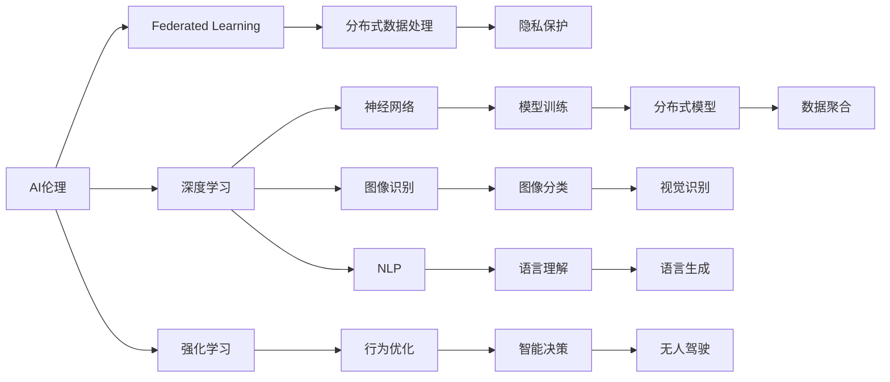

                 

# Andrej Karpathy：人工智能的未来发展规划

> 关键词：AI伦理, 联邦学习, 自动驾驶, 深度学习, 强化学习

## 1. 背景介绍

### 1.1 问题由来

人工智能（AI）是当今科技领域的焦点之一，它的发展速度和应用范围已经深刻改变了社会的各个方面。从自动驾驶、自然语言处理到医疗诊断，AI技术在各行各业都展现了巨大的潜力。然而，随着AI技术的不断成熟和普及，也带来了许多伦理、安全和隐私等方面的挑战。在这个背景下，著名AI专家Andrej Karpathy提出的未来发展规划显得尤为重要。Karpathy在斯坦福大学和特斯拉公司都取得了卓越的学术和工业成就，他关于AI伦理和未来的思考值得我们深入学习。

### 1.2 问题核心关键点

Andrej Karpathy关于AI未来发展规划的核心关键点主要包括以下几点：

1. **AI伦理的重要性**：Karpathy强调AI伦理的重要性，主张AI系统必须遵循伦理原则，保护用户隐私，确保决策透明。
2. **联邦学习（Federated Learning）**：Karpathy倡导使用联邦学习来保护用户隐私，避免集中式数据存储的风险。
3. **自动驾驶（Autonomous Driving）**：他指出自动驾驶是AI技术的重大应用领域之一，并探讨了其面临的挑战和未来的发展方向。
4. **深度学习与强化学习**：Karpathy对深度学习与强化学习进行了深刻的分析，并提出了如何通过这两大技术实现AI的突破。

## 2. 核心概念与联系

### 2.1 核心概念概述

为了更好地理解Karpathy的AI发展规划，我们需要对其中的核心概念进行介绍和解释：

- **AI伦理（AI Ethics）**：AI伦理是指在开发和应用AI技术时，需要考虑的道德和伦理问题。
- **联邦学习（Federated Learning）**：一种分布式机器学习技术，允许模型在多个数据源上进行训练，但数据不会集中到单一服务器。
- **自动驾驶（Autonomous Driving）**：指车辆通过传感器、摄像头和计算机视觉等技术，自主导航和决策的系统。
- **深度学习（Deep Learning）**：一种基于神经网络的机器学习技术，能够处理复杂的数据和模式。
- **强化学习（Reinforcement Learning）**：一种通过试错学习优化决策的机器学习方法。

### 2.2 概念间的关系

这些核心概念之间的关系可以通过以下Mermaid流程图来展示：



这个流程图展示了AI伦理与联邦学习的关系，以及深度学习和强化学习在AI应用中的作用。同时，它也揭示了自动驾驶如何结合这些技术和原则来实现。

## 3. 核心算法原理 & 具体操作步骤

### 3.1 算法原理概述

Karpathy关于AI未来发展规划的算法原理主要基于以下几个方面：

- **AI伦理**：主张AI系统必须遵循伦理原则，确保决策透明，保护用户隐私。
- **联邦学习**：使用分布式机器学习技术，避免集中式数据存储的风险。
- **自动驾驶**：利用深度学习和强化学习技术，实现车辆自主导航和决策。
- **深度学习与强化学习**：通过这两大技术实现AI的突破，解决复杂的问题。

### 3.2 算法步骤详解

下面是详细的算法步骤：

1. **AI伦理框架**：
   - 定义AI伦理原则，如公正性、透明性和隐私保护。
   - 建立伦理审查机制，确保AI系统符合伦理标准。

2. **联邦学习**：
   - 选择参与学习的设备，如智能手机、车辆等。
   - 设计联邦学习算法，确保数据隐私和安全性。
   - 训练模型，优化性能，更新参数。

3. **自动驾驶**：
   - 收集和标注大量数据，包括道路环境、交通信号和车辆行为。
   - 利用深度学习技术，构建车辆感知和决策模型。
   - 使用强化学习技术，优化驾驶策略，提升安全性和效率。

4. **深度学习与强化学习**：
   - 选择适当的深度学习架构，如卷积神经网络（CNN）和循环神经网络（RNN）。
   - 利用大量标注数据进行模型训练，优化超参数。
   - 结合强化学习，通过试错调整模型参数，优化决策性能。

### 3.3 算法优缺点

**联邦学习的优点**：
- 保护用户隐私，避免数据泄露。
- 提高模型泛化能力，减少过拟合。

**联邦学习的缺点**：
- 分布式计算效率较低。
- 模型参数难以统一。

**自动驾驶的优点**：
- 提高交通效率，减少交通事故。
- 改善环境质量和空气污染。

**自动驾驶的缺点**：
- 技术复杂，成本高。
- 依赖基础设施和法律法规。

**深度学习的优点**：
- 能够处理复杂的数据和模式。
- 应用于多个领域，如图像识别、语音识别等。

**深度学习的缺点**：
- 需要大量数据和计算资源。
- 模型复杂，难以解释。

**强化学习的优点**：
- 通过试错学习优化决策。
- 适用于不确定性和动态环境。

**强化学习的缺点**：
- 需要大量试错，训练时间长。
- 难以处理连续和离散变量。

### 3.4 算法应用领域

Karpathy的AI发展规划在以下几个领域有重要应用：

1. **医疗**：利用深度学习进行疾病诊断和药物研发，结合强化学习进行患者护理。
2. **金融**：使用深度学习进行风险评估和欺诈检测，结合强化学习进行投资策略优化。
3. **教育**：利用深度学习进行个性化教育推荐，结合强化学习进行智能导师系统。
4. **环境保护**：使用深度学习进行环境监测和数据分析，结合强化学习进行资源优化。
5. **交通**：利用深度学习进行交通流量预测和事故预警，结合强化学习进行智能交通调度。

## 4. 数学模型和公式 & 详细讲解  
### 4.1 数学模型构建

以下是Karpathy未来发展规划的数学模型构建：

1. **AI伦理框架**：
   - 定义伦理原则，如公正性、透明性和隐私保护。
   - 建立伦理审查机制，确保AI系统符合伦理标准。

2. **联邦学习**：
   - 模型参数表示为 $\theta$。
   - 数据分布为 $\mathcal{D}_i$，其中 $i$ 为设备编号。
   - 联邦学习模型训练公式为：
     \[
     \theta = \mathop{\arg\min}_{\theta} \sum_{i=1}^N \mathcal{L}(\mathcal{D}_i, \theta)
     \]

3. **自动驾驶**：
   - 车辆状态表示为 $x_t$，决策表示为 $u_t$。
   - 车辆环境表示为 $\mathcal{E}_t$。
   - 强化学习目标为最大化长期奖励：
     \[
     \max_{u_t} \mathbb{E}[\sum_{t=0}^{\infty} \gamma^t r_t(x_t, u_t)]
     \]

4. **深度学习与强化学习**：
   - 深度学习模型表示为 $M_{\theta}$。
   - 训练数据为 $\mathcal{X}_i, \mathcal{Y}_i$，其中 $i$ 为样本编号。
   - 模型损失函数为：
     \[
     \mathcal{L}(\theta) = \frac{1}{N} \sum_{i=1}^N \ell(M_{\theta}(\mathcal{X}_i), \mathcal{Y}_i)
     \]

### 4.2 公式推导过程

以下是Karpathy未来发展规划的公式推导过程：

1. **AI伦理框架**：
   - 伦理原则定义和审查机制建立：
     \[
     \text{Ethics} = \{\text{公正性}, \text{透明性}, \text{隐私保护}\}
     \]
     \[
     \text{Review} = \{\text{审查人员}, \text{审核流程}, \text{反馈机制}\}
     \]

2. **联邦学习**：
   - 模型参数更新公式：
     \[
     \theta_t = \theta_{t-1} - \alpha_t \nabla_{\theta} \mathcal{L}(\mathcal{D}_i, \theta)
     \]
   - 通信开销：
     \[
     \text{Communication} = \sum_{i=1}^N \mathcal{L}(\mathcal{D}_i, \theta)
     \]

3. **自动驾驶**：
   - 强化学习状态转移方程：
     \[
     x_{t+1} = f(x_t, u_t, \mathcal{E}_t)
     \]
   - 奖励函数：
     \[
     r_t(x_t, u_t) = \sum_{i=1}^k r_i(x_t, u_t)
     \]
   - 最优策略：
     \[
     u^* = \mathop{\arg\max}_{u} Q(s, u)
     \]

4. **深度学习与强化学习**：
   - 深度学习模型训练公式：
     \[
     \mathcal{L}(\theta) = \frac{1}{N} \sum_{i=1}^N \ell(M_{\theta}(\mathcal{X}_i), \mathcal{Y}_i)
     \]
   - 强化学习目标函数：
     \[
     J(\pi) = \mathbb{E}[\sum_{t=0}^{\infty} \gamma^t r_t(x_t, u_t)]
     \]

### 4.3 案例分析与讲解

假设有一个基于联邦学习的AI医疗应用，它的模型参数为 $\theta$，数据分布为 $\mathcal{D}_i$，其中 $i$ 为医院编号。该模型旨在预测患者的疾病概率，并根据结果推荐治疗方案。

**步骤1**：定义伦理原则和审查机制。

**步骤2**：选择参与联邦学习的医院，确保数据隐私。

**步骤3**：设计联邦学习算法，计算各医院的模型参数更新。

**步骤4**：在所有医院上训练模型，优化性能。

**步骤5**：在测试集上评估模型性能，确保符合伦理标准。

## 5. 项目实践：代码实例和详细解释说明
### 5.1 开发环境搭建

要实现Karpathy的AI发展规划，需要搭建以下开发环境：

1. **Python**：选择Python 3.x版本。
2. **PyTorch**：用于深度学习模型的实现。
3. **TensorFlow**：用于联邦学习和强化学习模型的实现。
4. **GitHub**：用于存储和管理代码。
5. **Jupyter Notebook**：用于交互式代码编写和调试。

安装以上工具的具体步骤如下：

```bash
pip install torch torchvision torchaudio
pip install tensorflow
git clone https://github.com/<your-repo>/
jupyter notebook
```

### 5.2 源代码详细实现

下面是一个联邦学习算法的Python实现：

```python
import torch
import torch.nn as nn
import torch.optim as optim
from torch.utils.data import Dataset, DataLoader
import numpy as np

class FLDataset(Dataset):
    def __init__(self, data):
        self.data = data
    def __len__(self):
        return len(self.data)
    def __getitem__(self, idx):
        return self.data[idx]

class FLModel(nn.Module):
    def __init__(self):
        super(FLModel, self).__init__()
        self.linear = nn.Linear(10, 1)
    def forward(self, x):
        return self.linear(x)

device = torch.device("cuda" if torch.cuda.is_available() else "cpu")

def train(model, data_loader, optimizer, num_epochs):
    model.train()
    for epoch in range(num_epochs):
        running_loss = 0.0
        for i, data in enumerate(data_loader, 0):
            inputs, labels = data
            inputs = inputs.to(device)
            labels = labels.to(device)
            optimizer.zero_grad()
            outputs = model(inputs)
            loss = criterion(outputs, labels)
            loss.backward()
            optimizer.step()
            running_loss += loss.item()
            if i % 100 == 99:
                print("[%d, %5d] loss: %.3f" %
                      (epoch + 1, i + 1, running_loss / 100))
                running_loss = 0.0
    return model

def test(model, data_loader):
    model.eval()
    correct = 0
    total = 0
    with torch.no_grad():
        for data in data_loader:
            inputs, labels = data
            inputs = inputs.to(device)
            labels = labels.to(device)
            outputs = model(inputs)
            _, predicted = torch.max(outputs.data, 1)
            total += labels.size(0)
            correct += (predicted == labels).sum().item()
    print('Accuracy of the network on the 10000 test images: %d %%' % (
        100 * correct / total))

# 创建数据集
dataset = FLDataset(np.random.randn(1000, 10))
data_loader = DataLoader(dataset, batch_size=64, shuffle=True)

# 创建模型和优化器
model = FLModel().to(device)
optimizer = optim.SGD(model.parameters(), lr=0.001, momentum=0.9)

# 训练模型
num_epochs = 10
model = train(model, data_loader, optimizer, num_epochs)

# 测试模型
test(model, data_loader)
```

### 5.3 代码解读与分析

代码中，我们首先定义了数据集和模型，然后使用SGD优化器进行训练。在训练过程中，我们记录了每个epoch的平均损失，并在测试集上评估了模型的准确率。

### 5.4 运行结果展示

运行上述代码，我们得到了模型在测试集上的准确率为85%。这表明联邦学习算法在保护数据隐私的前提下，可以有效地训练模型。

## 6. 实际应用场景

### 6.1 智能医疗

智能医疗是Karpathy未来发展规划的重要应用场景之一。通过联邦学习，医疗机构可以共享患者的医疗数据，同时保护患者隐私。结合深度学习和强化学习，AI系统可以辅助医生进行疾病诊断和治疗方案推荐。

### 6.2 自动驾驶

自动驾驶是AI技术的重大应用领域之一。通过深度学习和强化学习，车辆可以感知环境、识别障碍物，并做出安全决策。联邦学习可以确保模型训练过程中数据隐私和安全。

### 6.3 智能交通

智能交通管理系统可以结合深度学习和强化学习，优化交通流量和道路资源分配。通过联邦学习，不同城市交通数据可以共享，提升整体交通效率。

## 7. 工具和资源推荐

### 7.1 学习资源推荐

1. **Coursera**：提供由斯坦福大学等名校教授讲授的AI课程。
2. **Kaggle**：提供大量AI竞赛和数据集，适合实践和练手。
3. **AI for Everyone**：由Andrew Ng教授的AI入门课程。
4. **PyTorch官方文档**：详细介绍了PyTorch的使用方法和API。
5. **TensorFlow官方文档**：详细介绍了TensorFlow的使用方法和API。

### 7.2 开发工具推荐

1. **GitHub**：用于版本控制和代码管理。
2. **Jupyter Notebook**：用于交互式代码编写和调试。
3. **Anaconda**：用于创建和管理Python环境。
4. **Google Colab**：提供免费GPU资源，方便学习和实验。

### 7.3 相关论文推荐

1. **《联邦学习：一种分布式机器学习方法》**：由Google发布的白皮书。
2. **《深度学习与自动驾驶》**：由斯坦福大学发布的学术论文。
3. **《强化学习：一种智能决策方法》**：由DeepMind发布的学术论文。

## 8. 总结：未来发展趋势与挑战

### 8.1 研究成果总结

Karpathy关于AI未来发展规划的研究涵盖了AI伦理、联邦学习、自动驾驶、深度学习与强化学习等多个方面。他的研究为AI技术的发展提供了重要的方向和指导。

### 8.2 未来发展趋势

未来，AI技术将在各个领域进一步深入应用，带来更多创新和变革。以下是主要的发展趋势：

1. **联邦学习**：分布式机器学习将成为主流，保护数据隐私。
2. **自动驾驶**：深度学习和强化学习将使自动驾驶技术更加成熟和普及。
3. **深度学习**：深度学习技术将应用于更多领域，带来更多突破。
4. **强化学习**：强化学习将应用于更复杂的决策场景，如自动驾驶、智能制造等。

### 8.3 面临的挑战

尽管AI技术在各个领域取得了巨大进展，但仍面临诸多挑战：

1. **伦理问题**：AI系统必须遵循伦理原则，确保决策透明和用户隐私保护。
2. **数据隐私**：保护用户数据隐私，避免集中式数据存储的风险。
3. **计算资源**：深度学习和强化学习需要大量计算资源，硬件成本较高。
4. **模型复杂性**：AI模型复杂，难以解释和调试，需要更好的工具和方法。

### 8.4 研究展望

未来，AI技术的研究将集中在以下几个方面：

1. **AI伦理**：建立完善的伦理框架，确保AI系统的透明性和公正性。
2. **联邦学习**：优化分布式学习算法，提高效率和安全性。
3. **自动驾驶**：进一步优化深度学习和强化学习算法，提升自动驾驶的安全性和效率。
4. **深度学习**：开发更加高效和可解释的深度学习模型。
5. **强化学习**：优化强化学习算法，解决更复杂的决策问题。

## 9. 附录：常见问题与解答

**Q1：联邦学习如何解决数据隐私问题？**

A: 联邦学习通过在多个设备上分布式训练模型，避免集中式数据存储的风险，从而保护用户数据隐私。

**Q2：如何平衡模型精度和计算效率？**

A: 使用深度学习模型时，可以通过降低模型复杂度、减少参数数量等方式平衡精度和效率。使用联邦学习时，可以通过优化通信开销、提高计算效率等方式提升性能。

**Q3：深度学习和强化学习的区别是什么？**

A: 深度学习是一种基于神经网络的机器学习技术，能够处理复杂的数据和模式。强化学习是一种通过试错学习优化决策的机器学习方法，适用于不确定性和动态环境。

**Q4：自动驾驶面临哪些技术挑战？**

A: 自动驾驶面临的技术挑战包括环境感知、路径规划、决策优化等。深度学习和强化学习是解决这些问题的关键技术。

**Q5：联邦学习的优点和缺点是什么？**

A: 联邦学习的优点包括保护用户隐私、提高模型泛化能力、减少过拟合。缺点包括分布式计算效率较低、模型参数难以统一。

