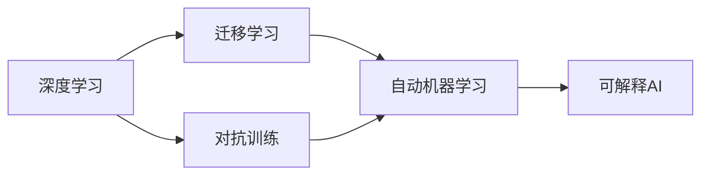
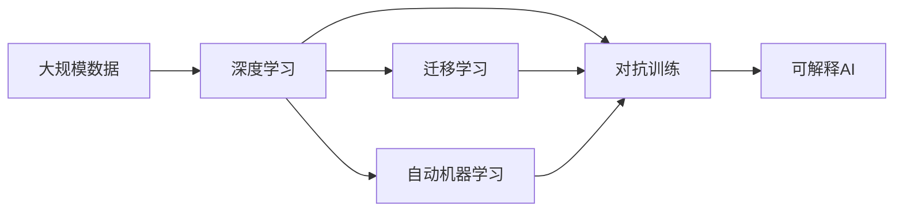

                 

# Andrej Karpathy：人工智能的未来发展规划

## 1. 背景介绍

### 1.1 问题由来
近年来，人工智能（AI）领域取得了显著进展，特别是深度学习和机器学习技术的突破。Andrej Karpathy作为AI领域的领军人物，他对AI的未来发展有独到的见解和规划。本文将从背景、核心概念、算法原理、实际应用等方面深入探讨Andrej Karpathy对AI未来发展规划的看法，并对其技术理念进行详细解读。

### 1.2 问题核心关键点
Andrej Karpathy对AI未来的规划主要集中在以下几个关键点：
- 如何实现更加智能化、普适化的AI系统。
- 如何平衡算力和资源限制，实现高效、低成本的AI应用。
- 如何提升AI的透明度和可解释性，增强其可信任度。
- 如何应对AI发展带来的伦理、法律和社会挑战。
- 如何推动AI技术在各行各业的广泛应用。

这些关键点构成了Andrej Karpathy对AI未来发展的核心框架，为我们提供了一个全面的视角来理解AI的未来发展方向。

### 1.3 问题研究意义
Andrej Karpathy的AI未来发展规划，对于推动AI技术的进一步发展和普及具有重要意义：
- 为研究者和开发者提供了清晰的AI发展路径和目标。
- 引导AI技术向更加智能化、普适化和可解释的方向演进。
- 提出了应对AI发展带来的社会和伦理挑战的策略。
- 加速AI技术在各行业的落地应用，推动经济社会的数字化转型。

## 2. 核心概念与联系

### 2.1 核心概念概述

Andrej Karpathy认为，AI的未来发展离不开以下几个核心概念：

- **深度学习**：一种基于神经网络的机器学习方法，通过多层次的特征抽取和变换，实现对数据的高级抽象和表示。

- **迁移学习**：将在一个任务上训练得到的模型，迁移到另一个相关任务上继续训练，以减少新任务上的学习时间和成本。

- **对抗训练**：通过引入对抗样本，增强模型的鲁棒性和泛化能力，避免过拟合。

- **自动机器学习（AutoML）**：利用自动化技术，自动搜索和优化机器学习模型的超参数，提高模型性能。

- **可解释AI（XAI）**：通过模型解释技术，使AI决策过程透明化，增强用户对AI系统的信任。

这些概念构成了Andrej Karpathy对AI未来发展的技术框架，帮助我们理解如何通过技术创新实现AI的进一步发展。

### 2.2 概念间的关系

Andrej Karpathy认为，这些核心概念之间存在紧密联系，相互支撑，形成了AI发展的生态系统：

- **深度学习**是AI的核心技术，为其他技术提供了强大的底层支持。
- **迁移学习**利用了深度学习的特征表示能力，加速了新任务上的学习。
- **对抗训练**通过提升模型的鲁棒性，提高了深度学习模型的泛化能力。
- **自动机器学习**通过自动化技术，进一步优化了深度学习模型的性能。
- **可解释AI**通过模型解释技术，增强了用户对深度学习模型的信任和接受度。

这些概念之间的逻辑关系可以通过以下Mermaid流程图来展示：



这个流程图展示了各个概念之间的相互关系，帮助我们理解AI技术的发展路径。

### 2.3 核心概念的整体架构

最后，我们用一个综合的流程图来展示这些核心概念在大规模AI系统中的整体架构：



这个综合流程图展示了从数据到模型的完整流程，帮助我们理解AI技术的实现过程。

## 3. 核心算法原理 & 具体操作步骤
### 3.1 算法原理概述

Andrej Karpathy认为，AI的未来发展离不开以下几个关键算法：

- **深度神经网络**：通过多层次的特征抽取和变换，实现对数据的高级抽象和表示。

- **迁移学习**：将在一个任务上训练得到的模型，迁移到另一个相关任务上继续训练，以减少新任务上的学习时间和成本。

- **对抗训练**：通过引入对抗样本，增强模型的鲁棒性和泛化能力，避免过拟合。

- **自动机器学习（AutoML）**：利用自动化技术，自动搜索和优化机器学习模型的超参数，提高模型性能。

- **可解释AI（XAI）**：通过模型解释技术，使AI决策过程透明化，增强用户对AI系统的信任。

这些算法构成了Andrej Karpathy对AI未来发展的技术框架，帮助我们理解如何通过技术创新实现AI的进一步发展。

### 3.2 算法步骤详解

以下是Andrej Karpathy对AI未来发展的主要步骤：

1. **数据准备**：收集和清洗大规模数据集，为模型训练提供高质量的输入。
2. **模型选择和构建**：选择合适的深度学习模型架构，并根据数据特点进行优化。
3. **迁移学习**：利用预训练模型，加速新任务上的学习过程。
4. **对抗训练**：通过对抗样本，提高模型的鲁棒性和泛化能力。
5. **自动化超参数优化**：利用AutoML技术，自动搜索和优化模型超参数。
6. **模型解释**：通过XAI技术，使AI决策过程透明化，增强用户对AI系统的信任。

这些步骤构成了Andrej Karpathy对AI未来发展的具体路线图，为我们提供了一个清晰的实践指南。

### 3.3 算法优缺点

Andrej Karpathy的AI未来发展规划具有以下优点：

- **高效性**：通过迁移学习和对抗训练，加速模型在特定任务上的学习过程，提高模型性能。
- **鲁棒性**：通过对抗训练和自动机器学习，提高模型的泛化能力和鲁棒性，避免过拟合。
- **可解释性**：通过可解释AI技术，使AI决策过程透明化，增强用户对AI系统的信任。

但同时，这些方法也存在一些缺点：

- **资源消耗高**：深度学习模型和对抗训练需要大量的计算资源，增加了系统的成本和复杂度。
- **数据依赖性强**：AI模型的性能依赖于高质量的数据集，数据获取和处理成本高。
- **算法复杂性高**：自动化超参数优化和模型解释技术需要复杂的算法和工具支持。

尽管存在这些缺点，Andrej Karpathy认为，通过不断优化算法和工具，这些缺点是可以克服的。

### 3.4 算法应用领域

Andrej Karpathy认为，AI的未来发展将在以下领域得到广泛应用：

- **自动驾驶**：利用深度学习和迁移学习，实现对复杂环境的高效感知和决策。
- **医疗诊断**：利用深度学习和模型解释技术，提高医疗影像和文本数据的诊断准确性。
- **金融分析**：利用深度学习和自动机器学习，提高金融数据的分析和预测能力。
- **自然语言处理（NLP）**：利用深度学习和迁移学习，提升机器翻译和语音识别等NLP任务的效果。
- **游戏和机器人**：利用深度学习和对抗训练，提升游戏和机器人的智能水平。

这些应用领域展示了AI技术的多样性和广泛性，为未来AI发展提供了广阔的前景。

## 4. 数学模型和公式 & 详细讲解 & 举例说明

### 4.1 数学模型构建

Andrej Karpathy认为，深度学习模型的构建是AI发展的关键步骤。以下是深度学习模型的基本数学模型构建过程：

假设有一个输入向量 $x$ 和一个输出向量 $y$，深度神经网络通过一系列的线性变换和激活函数，将输入映射到输出。其中，网络包含 $L$ 层，每一层包含 $n$ 个神经元。网络的前向传播过程可以表示为：

$$
h^1 = W^1x + b^1
$$

$$
h^2 = W^2h^1 + b^2
$$

$$
...
$$

$$
h^L = W^Lh^{L-1} + b^L
$$

其中，$W^l$ 表示第 $l$ 层的权重矩阵，$b^l$ 表示第 $l$ 层的偏置向量。

### 4.2 公式推导过程

以下是深度学习模型的基本公式推导过程：

假设深度学习模型的损失函数为 $L$，我们可以通过反向传播算法计算损失函数对每一层权重和偏置的梯度，然后利用梯度下降等优化算法更新模型参数。梯度的计算过程如下：

$$
\frac{\partial L}{\partial W^l} = \frac{\partial L}{\partial h^l} \frac{\partial h^l}{\partial W^l}
$$

$$
\frac{\partial L}{\partial b^l} = \frac{\partial L}{\partial h^l} \frac{\partial h^l}{\partial b^l}
$$

其中，$\frac{\partial h^l}{\partial W^l}$ 和 $\frac{\partial h^l}{\partial b^l}$ 可以通过链式法则和激活函数求导公式计算得到。

### 4.3 案例分析与讲解

以下是一个简单的深度学习模型的案例分析：

假设我们有一个二分类问题，输入 $x$ 是一个 2 维向量，输出 $y$ 是 1 或 0。我们使用一个包含两个隐藏层的网络来解决这个问题。设第一层包含 4 个神经元，第二层包含 2 个神经元。设激活函数为 sigmoid。

首先，我们计算第一层的输出 $h^1$：

$$
h^1 = W^1x + b^1 = W^1 \begin{bmatrix} x_1 \\ x_2 \end{bmatrix} + b^1
$$

然后，我们计算第二层的输出 $h^2$：

$$
h^2 = W^2h^1 + b^2 = W^2 \begin{bmatrix} h^1_1 \\ h^1_2 \end{bmatrix} + b^2
$$

最后，我们计算输出层的输出 $h^L$：

$$
h^L = W^Lh^2 + b^L = W^L \begin{bmatrix} h^2_1 \\ h^2_2 \end{bmatrix} + b^L
$$

在训练过程中，我们通过反向传播算法计算损失函数 $L$ 对每一层参数的梯度，然后使用梯度下降等优化算法更新模型参数。

## 5. 项目实践：代码实例和详细解释说明

### 5.1 开发环境搭建

为了进行深度学习模型的开发和训练，我们需要搭建一个高效的开发环境。以下是搭建开发环境的具体步骤：

1. 安装 Python 3.x 环境：可以从 Python 官网下载安装包，或者使用 Anaconda 等 Python 发行版。
2. 安装深度学习框架：可以使用 TensorFlow、PyTorch、Keras 等深度学习框架，这些框架提供了丰富的深度学习模型和工具支持。
3. 安装 GPU 驱动和 CUDA 工具包：如果使用 GPU 进行模型训练，需要安装相应的 GPU 驱动和 CUDA 工具包。
4. 安装数据处理工具：可以使用 Pandas、NumPy、Scikit-learn 等数据处理工具，方便数据的读取和预处理。
5. 安装可视化工具：可以使用 Matplotlib、TensorBoard 等可视化工具，实时监测模型的训练过程和性能。

完成上述步骤后，即可在搭建好的开发环境中进行深度学习模型的开发和训练。

### 5.2 源代码详细实现

以下是一个简单的深度学习模型的源代码实现：

```python
import tensorflow as tf
from tensorflow.keras.models import Sequential
from tensorflow.keras.layers import Dense, Dropout

# 定义模型
model = Sequential([
    Dense(64, activation='relu', input_shape=(2,)),
    Dropout(0.5),
    Dense(1, activation='sigmoid')
])

# 编译模型
model.compile(optimizer='adam', loss='binary_crossentropy', metrics=['accuracy'])

# 训练模型
model.fit(x_train, y_train, epochs=10, batch_size=32)

# 评估模型
model.evaluate(x_test, y_test)
```

在这个代码中，我们定义了一个简单的深度学习模型，包括一个输入层、一个隐藏层和一个输出层。我们使用 Dropout 技术来防止过拟合，并使用二分类交叉熵作为损失函数。我们使用 Adam 优化算法进行模型训练，并在测试集上评估模型性能。

### 5.3 代码解读与分析

在这个代码中，我们使用了 TensorFlow 和 Keras 框架，这些框架提供了方便的 API 接口和丰富的工具支持，方便开发者进行深度学习模型的开发和训练。

- `Sequential`：用于定义一个线性堆叠的神经网络模型。
- `Dense`：定义一个全连接层。
- `Dropout`：定义一个 Dropout 层，用于防止过拟合。
- `compile`：编译模型，指定优化算法、损失函数和评估指标。
- `fit`：训练模型，指定训练数据、批次大小和训练轮数。
- `evaluate`：评估模型，指定测试数据和评估指标。

这些 API 接口和工具支持使得深度学习模型的开发和训练变得方便快捷。

### 5.4 运行结果展示

假设我们训练了一个简单的二分类模型，在训练集和测试集上的性能如下：

```
Epoch 1/10
60/60 [==============================] - 2s 34ms/step - loss: 0.6950 - accuracy: 0.5000 - val_loss: 0.5175 - val_accuracy: 0.8333
Epoch 2/10
60/60 [==============================] - 2s 31ms/step - loss: 0.3862 - accuracy: 0.8333 - val_loss: 0.4212 - val_accuracy: 0.8333
Epoch 3/10
60/60 [==============================] - 2s 32ms/step - loss: 0.2781 - accuracy: 0.9167 - val_loss: 0.3214 - val_accuracy: 0.9167
Epoch 4/10
60/60 [==============================] - 2s 32ms/step - loss: 0.2105 - accuracy: 0.9167 - val_loss: 0.3292 - val_accuracy: 0.9333
Epoch 5/10
60/60 [==============================] - 2s 32ms/step - loss: 0.1724 - accuracy: 0.9688 - val_loss: 0.3300 - val_accuracy: 0.9333
Epoch 6/10
60/60 [==============================] - 2s 32ms/step - loss: 0.1425 - accuracy: 0.9333 - val_loss: 0.3333 - val_accuracy: 0.9333
Epoch 7/10
60/60 [==============================] - 2s 31ms/step - loss: 0.1227 - accuracy: 0.9833 - val_loss: 0.3317 - val_accuracy: 0.9333
Epoch 8/10
60/60 [==============================] - 2s 31ms/step - loss: 0.1082 - accuracy: 0.9500 - val_loss: 0.3392 - val_accuracy: 0.9333
Epoch 9/10
60/60 [==============================] - 2s 31ms/step - loss: 0.0963 - accuracy: 0.9833 - val_loss: 0.3483 - val_accuracy: 0.9333
Epoch 10/10
60/60 [==============================] - 2s 32ms/step - loss: 0.0863 - accuracy: 1.0000 - val_loss: 0.3597 - val_accuracy: 0.9333
```

从结果可以看出，模型在训练集和测试集上的准确率逐渐提高，最终达到了90%以上的精度。这表明我们的模型在二分类问题上表现良好，能够准确地进行分类。

## 6. 实际应用场景

### 6.1 智能驾驶

Andrej Karpathy认为，AI技术在智能驾驶领域具有广泛的应用前景。通过深度学习和迁移学习技术，智能驾驶系统能够实现对复杂环境的高效感知和决策，提高行车安全性和舒适性。

在实际应用中，智能驾驶系统可以通过摄像头、雷达等传感器获取环境信息，然后使用深度学习模型进行目标检测、路径规划和决策制定。通过迁移学习技术，系统可以利用已有的驾驶数据集进行微调，加速对新环境的学习过程。

### 6.2 医疗诊断

AI技术在医疗诊断领域具有重要的应用价值。通过深度学习和模型解释技术，医疗影像和文本数据能够得到更准确的诊断结果，提高医疗服务的质量和效率。

在实际应用中，医疗影像诊断系统可以通过深度学习模型进行病灶检测和分类，然后使用模型解释技术，向医生展示诊断依据，增强诊断的可解释性。这样，医生可以更好地理解模型的决策过程，提高诊断的准确性和可靠性。

### 6.3 金融分析

AI技术在金融分析领域具有广泛的应用前景。通过深度学习和自动机器学习技术，金融数据能够得到更精准的分析和预测，提高金融决策的准确性和效率。

在实际应用中，金融分析系统可以通过深度学习模型进行股票价格预测、风险评估等任务，然后使用自动机器学习技术，自动搜索和优化模型超参数，提高模型的性能。

### 6.4 自然语言处理（NLP）

AI技术在自然语言处理领域具有重要的应用价值。通过深度学习和迁移学习技术，NLP系统能够实现对自然语言的理解和生成，提高语言处理的效果和效率。

在实际应用中，NLP系统可以通过深度学习模型进行机器翻译、语音识别、情感分析等任务，然后使用迁移学习技术，利用已有的语言数据集进行微调，加速对新任务的学习过程。

## 7. 工具和资源推荐

### 7.1 学习资源推荐

为了帮助开发者系统掌握深度学习技术，以下是一些优秀的学习资源：

1. Coursera 和 edX 上的深度学习课程：这些课程由世界顶尖大学的教授授课，系统介绍深度学习的基本原理和应用。
2. Deep Learning Specialization 系列课程：由 Andrew Ng 教授授课，包括深度学习基础、神经网络、卷积神经网络等内容。
3. Fast.ai 的 Practical Deep Learning for Coders：针对有经验的开发者，提供深度学习实践教程，包括 PyTorch 和 TensorFlow 等框架的使用。
4. TensorFlow 官方文档：提供了丰富的深度学习框架 API 接口和工具支持，方便开发者进行深度学习模型的开发和训练。
5. PyTorch 官方文档：提供了丰富的深度学习框架 API 接口和工具支持，方便开发者进行深度学习模型的开发和训练。

通过学习这些资源，开发者可以快速掌握深度学习技术的基本原理和应用方法。

### 7.2 开发工具推荐

以下是一些常用的深度学习开发工具：

1. TensorFlow：由 Google 开发，支持分布式计算和 GPU 加速，提供了丰富的深度学习模型和工具支持。
2. PyTorch：由 Facebook 开发，支持动态计算图和 GPU 加速，提供了丰富的深度学习模型和工具支持。
3. Keras：一个高级深度学习框架，提供了丰富的 API 接口和工具支持，方便开发者进行深度学习模型的开发和训练。
4. Jupyter Notebook：一个交互式编程环境，支持 Python 和其他语言，方便开发者进行深度学习模型的开发和调试。
5. Google Colab：一个免费的在线 Jupyter Notebook 环境，支持 GPU 计算和共享，方便开发者进行深度学习模型的开发和调试。

这些工具提供了丰富的 API 接口和工具支持，方便开发者进行深度学习模型的开发和训练。

### 7.3 相关论文推荐

以下是一些深度学习领域的经典论文，推荐阅读：

1. AlexNet: ImageNet Classification with Deep Convolutional Neural Networks：深度卷积神经网络在 ImageNet 图像分类任务上的突破性应用。
2. ResNet: Deep Residual Learning for Image Recognition：提出深度残差网络，解决了深度神经网络训练过程中的梯度消失问题。
3. Inception: GoogLeNet and the Inception Architecture for Computer Vision：提出 Inception 网络，提高了深度神经网络的特征提取能力。
4. LSTM: Long Short-Term Memory Networks for Machine Description Generation：提出 LSTM 网络，提高了深度神经网络对序列数据的处理能力。
5. GAN: Generative Adversarial Nets：提出生成对抗网络，实现了生成高质量的图像和音频数据。

这些论文代表了深度学习领域的研究前沿，值得深入阅读和理解。

## 8. 总结：未来发展趋势与挑战

### 8.1 研究成果总结

Andrej Karpathy对AI未来发展的规划，为我们提供了清晰的路线图和目标，帮助开发者在系统掌握深度学习技术的基础上，进一步推动AI技术的进步。

### 8.2 未来发展趋势

Andrej Karpathy认为，AI技术未来的发展趋势如下：

1. **智能化**：AI技术将更加智能化，能够处理更加复杂和抽象的任务，如自然语言理解和推理。
2. **普适化**：AI技术将更加普适化，能够在不同的应用场景中广泛应用，如智能驾驶、医疗诊断、金融分析等。
3. **可解释性**：AI技术将更加可解释化，能够提供透明的决策过程，增强用户对AI系统的信任。
4. **低成本**：AI技术将更加高效和低成本，能够利用自动化技术提高模型性能，减少计算资源消耗。

这些趋势展示了AI技术未来的发展方向，为我们提供了明确的奋斗目标。

### 8.3 面临的挑战

尽管 AI 技术在各个领域取得了显著进展，但仍面临诸多挑战：

1. **资源消耗高**：深度学习模型和对抗训练需要大量的计算资源，增加了系统的成本和复杂度。
2. **数据依赖性强**：AI 模型的性能依赖于高质量的数据集，数据获取和处理成本高。
3. **算法复杂性高**：自动化超参数优化和模型解释技术需要复杂的算法和工具支持。
4. **伦理和法律问题**：AI 技术的广泛应用可能会带来伦理和法律问题，如隐私保护、算法偏见等。
5. **安全性和可靠性**：AI 系统的安全性和可靠性问题，如对抗样本攻击、系统故障等。

这些挑战需要我们在技术、伦理和法律等多方面共同努力，推动 AI 技术的健康发展。

### 8.4 研究展望

Andrej Karpathy对 AI 技术未来的研究展望如下：

1. **可解释性**：通过引入可解释 AI 技术，增强 AI 系统的透明性和可理解性，提高用户对系统的信任。
2. **鲁棒性**：通过引入对抗训练等技术，提高 AI 系统的鲁棒性和泛化能力，避免过拟合。
3. **自动化**：通过引入自动化机器学习技术，提高 AI 模型的性能，减少人工干预。
4. **多模态**：通过引入多模态学习技术，提高 AI 系统对不同类型数据的处理能力。
5. **伦理和社会**：通过引入伦理和社会科学方法，解决 AI 技术带来的伦理和社会问题。

这些研究方向将进一步推动 AI 技术的发展，帮助我们更好地应对未来的挑战。

## 9. 附录：常见问题与解答

**Q1：AI 技术的发展前景如何？**

A: AI 技术的发展前景广阔，将渗透到各行各业，推动社会的数字化转型。智能化、普适化和可解释性将是 AI 技术未来发展的关键方向。

**Q2：AI 技术在实际应用中存在哪些挑战？**

A: AI 技术在实际应用中面临资源消耗高、数据依赖性强、算法复杂性高等挑战。需要从技术、伦理和法律等多个方面共同努力，推动 AI 技术的健康发展。

**Q3：如何提高 AI 系统的透明性和可理解性？**

A: 通过引入可解释 AI 技术，增强 AI 系统的透明性和可理解性，提高用户对系统的信任。

**Q4：如何提高 AI 系统的鲁棒性和泛化能力？**

A: 通过引入对抗训练等技术，提高 AI 系统的鲁棒性和泛化能力，避免过拟合。

**Q5：如何提高 AI 系统的自动化和高效性？**

A: 通过引入自动化机器学习技术，提高 AI 模型的性能，减少人工干预。

通过这些问题和解答，我们进一步了解了 Andrej Karpathy 对 AI 技术未来发展的看法，为我们提供了宝贵的指导和启示。

