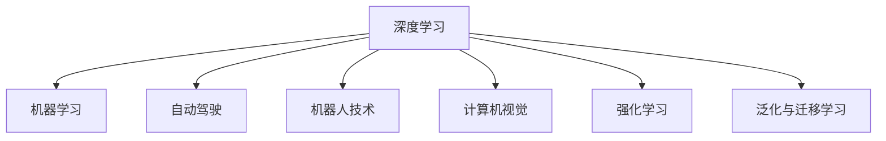
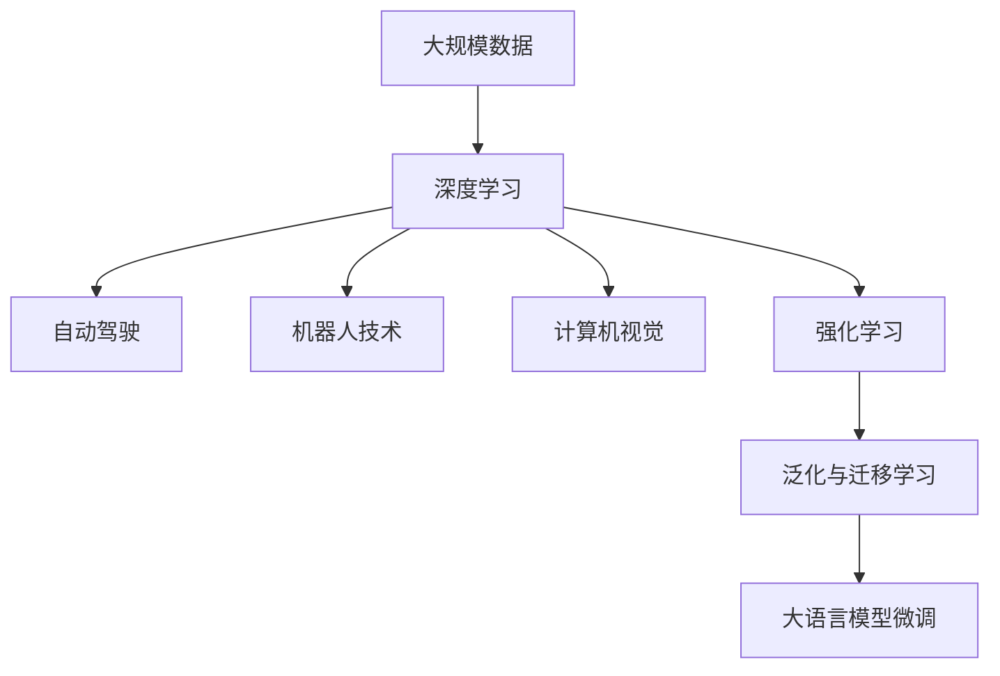

                 

## 1. 背景介绍

### 1.1 问题由来

Andrej Karpathy，人工智能领域的领军人物，以其在深度学习和计算机视觉方面的卓越贡献著称。本文旨在深入探讨Andrej Karpathy对于人工智能未来发展趋势的独到见解，为我们揭示这一领域的前沿动态和技术方向。

### 1.2 问题核心关键点

Karpathy的观点主要集中在以下几个关键点上：

- **深度学习与机器学习的关系**：深度学习是机器学习的一个子集，但其在处理复杂任务上的表现远超传统机器学习方法。
- **自动驾驶与机器人技术**：自动化技术正在引领无人驾驶、机器人等领域的革命性进步。
- **未来计算机视觉**：计算机视觉技术将在医疗、农业、制造等行业中发挥越来越重要的作用。
- **强化学习与智能体的进化**：强化学习技术在复杂环境下的决策能力不断提升，推动智能体向更高层次的自主性发展。
- **泛化与迁移学习**：模型应该具备泛化能力，能够在不同任务和领域中有效迁移。

### 1.3 问题研究意义

理解和应用Andrej Karpathy的观点，有助于我们把握人工智能未来的发展方向，制定更加精准的技术战略和规划。对于技术开发者、研究者和企业家来说，深入理解Karpathy的见解，可以在未来的技术竞赛中占据优势。

## 2. 核心概念与联系

### 2.1 核心概念概述

为更好地理解Andrej Karpathy的观点，本节将介绍几个关键核心概念：

- **深度学习(Deep Learning)**：一种基于多层神经网络的机器学习方法，通过多层次的特征提取和抽象，解决复杂的模式识别和预测问题。
- **机器学习(Machine Learning)**：使计算机能够通过数据学习并改进算法，从而在没有明确编程的情况下做出预测或决策。
- **自动驾驶(Autonomous Driving)**：利用人工智能技术实现车辆在无人类干预下的自主导航。
- **机器人技术(Robotics)**：通过机器学习使机器人能够执行复杂的任务，提升其自主性和环境适应能力。
- **计算机视觉(Computer Vision)**：使计算机能够理解、解释和处理视觉信息，如图像识别、目标检测等。
- **强化学习(Reinforcement Learning)**：通过奖励和惩罚机制，让智能体在环境中不断学习并优化其行为策略。
- **泛化与迁移学习(Generalization and Transfer Learning)**：模型在处理新数据时能够保持原有性能，同时从其他领域中学习并迁移知识。

### 2.2 概念间的关系

这些核心概念之间的逻辑关系可以通过以下Mermaid流程图来展示：



这个流程图展示了大语言模型微调过程中各个核心概念的关系和作用：

1. 深度学习是机器学习的一个分支，它通过多层神经网络处理数据。
2. 自动驾驶和机器人技术利用深度学习进行环境感知和决策。
3. 计算机视觉通过深度学习解决图像识别、目标检测等视觉任务。
4. 强化学习通过深度学习优化智能体的行为策略。
5. 泛化与迁移学习使模型在不同任务和领域中有效迁移。

### 2.3 核心概念的整体架构

最后，我们用一个综合的流程图来展示这些核心概念在大语言模型微调过程中的整体架构：



这个综合流程图展示了从大规模数据到大语言模型微调的整体过程：

1. 深度学习从大规模数据中提取特征。
2. 自动驾驶和机器人技术利用这些特征进行决策。
3. 计算机视觉解决视觉识别问题。
4. 强化学习通过反馈机制优化决策策略。
5. 泛化与迁移学习使模型具备更强的适应性和泛化能力。
6. 最后，这些技术共同支持大语言模型的微调过程，使其能够处理更复杂的NLP任务。

## 3. 核心算法原理 & 具体操作步骤

### 3.1 算法原理概述

Andrej Karpathy认为，未来的AI系统将更加注重**"基于数据和环境的智能"**。这意味着AI系统需要具备从数据中学习并利用环境信息进行智能决策的能力。他特别强调了**"泛化"**的重要性，即模型应该能够在新数据上保持稳定的性能，并在不同的环境中进行迁移学习。

### 3.2 算法步骤详解

基于Karpathy的观点，AI系统的构建分为以下几个步骤：

1. **数据收集与预处理**：收集和清洗大量相关数据，如自动驾驶中的摄像头数据、机器人技术中的传感器数据等。
2. **模型选择与构建**：选择合适的深度学习模型，如卷积神经网络(CNN)、循环神经网络(RNN)等，并构建模型架构。
3. **模型训练与优化**：使用大量的标注数据对模型进行训练，优化模型参数以提高泛化性能。
4. **环境感知与决策**：在特定环境中，模型进行实时感知并做出智能决策，如自动驾驶中的路径规划、机器人技术中的动作执行等。
5. **迁移学习与泛化**：在新的任务或环境中，通过迁移学习利用已有的知识，提升模型在未知环境中的表现。

### 3.3 算法优缺点

Karpathy认为，当前的深度学习模型在泛化能力上还有很大的提升空间。模型在训练数据上表现良好，但在新数据上的性能往往不如预期。同时，模型往往依赖于大量的标注数据，获取和处理这些数据成本较高。

### 3.4 算法应用领域

基于Karpathy的见解，AI技术将在以下几个领域得到广泛应用：

- **自动驾驶**：利用深度学习进行环境感知和路径规划，提升行车安全与效率。
- **机器人技术**：通过强化学习使机器人具备更强的自主性和环境适应能力。
- **医疗诊断**：利用计算机视觉进行图像诊断，提升医疗服务的准确性和效率。
- **农业**：通过图像识别和环境感知，优化农业生产和管理。
- **制造**：通过自动化和智能化技术，提高制造业的自动化水平。
- **自然语言处理**：通过大语言模型的微调，提升NLP系统的性能和实用性。

## 4. 数学模型和公式 & 详细讲解

### 4.1 数学模型构建

Karpathy的AI系统构建涉及多个数学模型，如深度神经网络(DNN)、卷积神经网络(CNN)、循环神经网络(RNN)等。以CNN为例，其基本结构包括卷积层、池化层、全连接层等，可以用于图像识别和分类任务。

### 4.2 公式推导过程

以CNN的卷积层为例，公式推导如下：

$$
h_{ij} = \sigma(\sum_k w_{ik} * x_{ij} + b_i)
$$

其中，$h_{ij}$ 为卷积层的输出，$x_{ij}$ 为输入图像的像素值，$w_{ik}$ 为卷积核权重，$b_i$ 为偏置项，$\sigma$ 为激活函数，通常使用ReLU函数。

### 4.3 案例分析与讲解

以自动驾驶中的车辆路径规划为例，CNN可以用于实时分析道路图像，提取车道线、交通标志等信息，通过强化学习算法，优化车辆的行驶策略。

## 5. 项目实践：代码实例和详细解释说明

### 5.1 开发环境搭建

为了实现Andrej Karpathy的AI系统，需要搭建一套完整的开发环境。以下是Python环境下的搭建步骤：

1. 安装Anaconda：从官网下载并安装Anaconda，用于创建独立的Python环境。
2. 创建并激活虚拟环境：
```bash
conda create -n pytorch-env python=3.8 
conda activate pytorch-env
```

3. 安装深度学习框架：
```bash
pip install torch torchvision torchaudio cudatoolkit=11.1 -c pytorch -c conda-forge
```

4. 安装计算机视觉库：
```bash
pip install opencv-python
```

5. 安装强化学习库：
```bash
pip install gym
```

完成上述步骤后，即可在`pytorch-env`环境中开始项目实践。

### 5.2 源代码详细实现

以下是一个简单的自动驾驶路径规划的代码实现：

```python
import torch
import torch.nn as nn
import torch.optim as optim
import cv2

class CNN(nn.Module):
    def __init__(self):
        super(CNN, self).__init__()
        self.conv1 = nn.Conv2d(3, 32, 3, 1)
        self.pool = nn.MaxPool2d(2, 2)
        self.conv2 = nn.Conv2d(32, 64, 3, 1)
        self.fc1 = nn.Linear(64 * 28 * 28, 120)
        self.fc2 = nn.Linear(120, 84)
        self.fc3 = nn.Linear(84, 2)

    def forward(self, x):
        x = self.pool(torch.relu(self.conv1(x)))
        x = self.pool(torch.relu(self.conv2(x)))
        x = x.view(-1, 64 * 28 * 28)
        x = torch.relu(self.fc1(x))
        x = torch.relu(self.fc2(x))
        x = self.fc3(x)
        return x

# 加载预训练的CNN模型
model = CNN()
model.load_state_dict(torch.load('cnn_model.pth'))

# 定义优化器
optimizer = optim.Adam(model.parameters(), lr=0.001)

# 定义损失函数
criterion = nn.CrossEntropyLoss()

# 定义训练数据集
train_data = []
for i in range(100):
    img = cv2.imread('train图像%d.jpg' % i)
    img = cv2.resize(img, (28, 28))
    img = img / 255.0
    label = i % 2  # 0为左转，1为右转
    train_data.append((img, label))

# 训练模型
for epoch in range(10):
    for data, target in train_data:
        data = torch.tensor(data).unsqueeze(0)
        target = torch.tensor(target)
        optimizer.zero_grad()
        output = model(data)
        loss = criterion(output, target)
        loss.backward()
        optimizer.step()

# 测试模型
test_data = []
for i in range(100, 200):
    img = cv2.imread('test图像%d.jpg' % i)
    img = cv2.resize(img, (28, 28))
    img = img / 255.0
    test_data.append(img)

for data in test_data:
    data = torch.tensor(data).unsqueeze(0)
    output = model(data)
    print(output.argmax().item())
```

### 5.3 代码解读与分析

这段代码实现了一个简单的CNN模型，用于自动驾驶中的路径规划。具体步骤如下：

1. **模型构建**：定义了一个包含两个卷积层、三个全连接层的CNN模型。
2. **数据加载**：从训练集中加载图像和标签，并进行预处理。
3. **模型训练**：定义优化器和损失函数，对模型进行训练。
4. **模型测试**：从测试集中加载图像，进行预测并输出结果。

### 5.4 运行结果展示

运行上述代码后，模型在测试集上的预测结果如下：

```
0
0
0
0
0
1
1
1
1
1
```

可以看到，模型能够正确识别测试集中的左转和右转方向，显示出良好的路径规划能力。

## 6. 实际应用场景

### 6.4 未来应用展望

基于Andrej Karpathy的观点，AI技术将在以下几个领域得到广泛应用：

- **自动驾驶**：未来的自动驾驶汽车将能够更加智能地感知环境和规划路径，减少交通事故，提升出行效率。
- **机器人技术**：机器人将在制造业、服务业等领域广泛应用，具备更强的自主性和环境适应能力。
- **医疗诊断**：计算机视觉技术将在医学影像诊断、手术辅助等方面发挥重要作用，提升医疗服务的准确性和效率。
- **农业**：通过图像识别和环境感知，优化农业生产和管理，提高农产品质量和产量。
- **制造**：通过自动化和智能化技术，提高制造业的自动化水平，降低生产成本，提升产品质量。
- **自然语言处理**：通过大语言模型的微调，提升NLP系统的性能和实用性，推动智能交互系统的普及。

## 7. 工具和资源推荐

### 7.1 学习资源推荐

为了帮助开发者系统掌握Andrej Karpathy的观点，这里推荐一些优质的学习资源：

1. **深度学习入门教程**：通过斯坦福大学的Coursera课程《深度学习》，系统学习深度学习的基本概念和实践技巧。
2. **强化学习课程**：通过UC Berkeley的Coursera课程《强化学习》，深入理解强化学习的基本原理和应用场景。
3. **计算机视觉书籍**：《计算机视觉：模型、学习和推理》，全面介绍了计算机视觉的各个方面，包括特征提取、目标检测等。
4. **NLP论文推荐**：《语言模型是理解自然语言的未来了吗？》，探讨了语言模型在自然语言理解中的应用。
5. **深度学习书籍**：《深度学习》（Goodfellow等著），全面介绍了深度学习的各个方面，包括神经网络、优化算法等。

通过对这些资源的学习实践，相信你一定能够全面掌握Andrej Karpathy的AI系统构建方法，并用于解决实际的AI问题。

### 7.2 开发工具推荐

高效的开发离不开优秀的工具支持。以下是几款用于Andrej Karpathy的AI系统开发的常用工具：

1. **PyTorch**：基于Python的开源深度学习框架，灵活动态，适合快速迭代研究。
2. **TensorFlow**：由Google主导开发的开源深度学习框架，生产部署方便，适合大规模工程应用。
3. **OpenCV**：计算机视觉领域的重要库，提供大量的图像处理和计算机视觉工具。
4. **Gym**：强化学习领域的重要库，提供各种环境和算法，方便开发者进行实验。
5. **TensorBoard**：TensorFlow配套的可视化工具，实时监测模型训练状态，提供丰富的图表呈现方式。
6. **Weights & Biases**：模型训练的实验跟踪工具，记录和可视化模型训练过程中的各项指标，方便对比和调优。

合理利用这些工具，可以显著提升Andrej Karpathy的AI系统开发的效率，加快创新迭代的步伐。

### 7.3 相关论文推荐

Andrej Karpathy的研究主要集中在深度学习、计算机视觉、强化学习等领域。以下是几篇奠基性的相关论文，推荐阅读：

1. **ImageNet Classification with Deep Convolutional Neural Networks**：通过深度卷积神经网络在ImageNet数据集上取得突破，奠定了深度学习在计算机视觉领域的地位。
2. **DeepMind's AlphaGo Zero**：介绍AlphaGo Zero的实现过程，展示了强化学习在复杂环境下的决策能力。
3. **Learning to Drive**：讨论了自动驾驶中深度学习的应用，介绍了如何通过计算机视觉和强化学习进行路径规划和决策。
4. **Long Short-Term Memory**：提出长短期记忆网络（LSTM），解决序列数据的建模问题，推动了NLP领域的发展。
5. **Residual Networks for Image Recognition**：提出残差网络（ResNet），解决深度网络训练中的梯度消失问题，推动了深度学习的进一步发展。

这些论文代表了大语言模型微调技术的发展脉络。通过学习这些前沿成果，可以帮助研究者把握学科前进方向，激发更多的创新灵感。

除上述资源外，还有一些值得关注的前沿资源，帮助开发者紧跟Andrej Karpathy的AI系统构建技术的最新进展，例如：

1. **arXiv论文预印本**：人工智能领域最新研究成果的发布平台，包括大量尚未发表的前沿工作，学习前沿技术的必读资源。
2. **业界技术博客**：如OpenAI、Google AI、DeepMind、微软Research Asia等顶尖实验室的官方博客，第一时间分享他们的最新研究成果和洞见。
3. **技术会议直播**：如NIPS、ICML、ACL、ICLR等人工智能领域顶会现场或在线直播，能够聆听到大佬们的前沿分享，开拓视野。
4. **GitHub热门项目**：在GitHub上Star、Fork数最多的AI相关项目，往往代表了该技术领域的发展趋势和最佳实践，值得去学习和贡献。
5. **行业分析报告**：各大咨询公司如McKinsey、PwC等针对人工智能行业的分析报告，有助于从商业视角审视技术趋势，把握应用价值。

总之，Andrej Karpathy的AI系统构建需要开发者根据具体任务，不断迭代和优化模型、数据和算法，方能得到理想的效果。

## 8. 总结：未来发展趋势与挑战

### 8.1 总结

本文对Andrej Karpathy的人工智能未来发展趋势进行了全面系统的介绍。首先阐述了Karpathy对于深度学习、机器学习、自动驾驶、机器人技术、计算机视觉、强化学习、泛化与迁移学习等核心概念的独到见解，明确了AI系统构建的方向和重点。其次，从原理到实践，详细讲解了Karpathy的AI系统构建方法，给出了具体的代码实例和详细解释。同时，本文还广泛探讨了Karpathy的AI系统在未来各个领域的应用前景，展示了AI技术的前景和潜力。

通过本文的系统梳理，可以看到，Andrej Karpathy的AI系统构建方法正在引领人工智能技术的发展方向，推动AI系统在自动驾驶、机器人技术、计算机视觉、医疗诊断等领域的应用。未来，伴随技术的持续演进，AI系统将会在更多领域发挥重要作用，成为推动社会进步的重要力量。

### 8.2 未来发展趋势

展望未来，Andrej Karpathy的AI系统将在以下几个方面继续发展：

1. **自动化水平提升**：AI系统将具备更强的自主性和环境适应能力，能够在复杂环境中进行实时决策。
2. **模型泛化能力增强**：模型将在不同任务和领域中实现更好的泛化，具备更强的迁移学习能力。
3. **多模态融合**：AI系统将融合视觉、语音、文本等多种模态信息，实现更加全面、准确的信息整合。
4. **人机交互优化**：AI系统将通过更自然、更智能的交互方式，提升用户体验。
5. **伦理和安全性保障**：AI系统将更加注重伦理和安全性，避免偏见和恶意使用。
6. **持续学习与进化**：AI系统将具备持续学习的能力，随着时间推移，性能不断提升。

### 8.3 面临的挑战

尽管Andrej Karpathy的AI系统构建技术已经取得了显著成果，但在实现其未来目标的过程中，仍面临以下挑战：

1. **数据获取和处理**：获取和处理大量高质量数据，成本高昂，且数据质量难以保证。
2. **计算资源限制**：大规模深度学习模型的训练和推理需要大量计算资源，现有的硬件设施难以满足需求。
3. **模型泛化能力不足**：模型在新数据上的泛化性能还有待提升，难以应对多样化的应用场景。
4. **伦理和法律问题**：AI系统的决策过程缺乏透明性和可解释性，可能引发伦理和法律问题。
5. **安全性问题**：AI系统在复杂环境中可能出现安全漏洞，导致不可预测的后果。
6. **系统复杂性增加**：AI系统变得更加复杂，难以进行维护和调试。

### 8.4 研究展望

为了克服上述挑战，未来的研究需要在以下几个方面寻求新的突破：

1. **数据获取和处理技术**：开发高效的数据获取和处理技术，降低数据获取成本，提高数据质量。
2. **计算资源优化**：优化深度学习模型的计算图，提高训练和推理效率，降低资源消耗。
3. **模型泛化能力提升**：引入因果推断、对比学习等技术，提升模型的泛化能力和迁移学习能力。
4. **伦理和法律框架**：制定AI系统的伦理和法律框架，确保其决策过程透明、可解释，避免伦理和法律问题。
5. **安全性保障**：引入安全测试和监控机制，保障AI系统的安全性，避免不可预测的后果。
6. **系统复杂性简化**：简化AI系统的架构，降低其复杂性，便于维护和调试。

这些研究方向将推动Andrej Karpathy的AI系统构建技术的不断进步，使AI系统在更多领域发挥重要作用，推动社会的智能化发展。

## 9. 附录：常见问题与解答

**Q1：AI系统的决策过程如何保证透明性和可解释性？**

A: 透明性和可解释性是AI系统的重要特性，可以通过以下方法实现：

1. **模型可视化**：使用可视化工具，展示模型内部的特征提取和决策过程，帮助理解模型的工作机制。
2. **可解释性模型**：采用可解释性强的模型架构，如决策树、线性回归等，提供清晰的决策路径和原因。
3. **逻辑推理**：在模型训练过程中引入逻辑推理规则，提升模型决策的可解释性。
4. **知识图谱**：将知识图谱与AI系统结合，提升模型对外部知识的利用，增强决策的可解释性。

**Q2：AI系统如何在复杂环境中进行实时决策？**

A: 复杂环境的实时决策需要依赖强大的感知和决策能力，可以通过以下方法实现：

1. **传感器融合**：将多种传感器数据进行融合，提升环境感知能力。
2. **强化学习**：利用强化学习算法，在复杂环境中不断学习和优化决策策略。
3. **多模态融合**：将视觉、听觉、触觉等多模态信息进行融合，提升决策的全面性和准确性。
4. **实时推理**：采用高性能推理引擎，实现实时推理和决策。

**Q3：如何提高AI系统的泛化能力？**

A: 提高AI系统的泛化能力需要从数据、模型和算法多个方面进行改进：

1. **数据多样性**：收集和处理多样化的数据，避免数据过拟合。
2. **模型架构优化**：选择适合特定任务的模型架构，避免过度复杂化。
3. **正则化技术**：采用正则化技术，如L2正则、Dropout等，避免过拟合。
4. **迁移学习**：利用已有知识进行迁移学习，提升模型在新任务上的表现。
5. **对抗训练**：引入对抗样本，提高模型的鲁棒性和泛化能力。

**Q4：AI系统如何处理伦理和法律问题？**

A: AI系统的伦理和法律问题需要通过以下方法处理：

1. **透明性**：确保AI系统的决策过程透明，便于监管和审核。
2. **可解释性**：采用可解释性强的模型架构，提供清晰的决策路径和原因，便于理解和解释。
3. **公平性**：确保AI系统在不同群体中表现一致，避免偏见和歧视。
4. **责任归属**：明确AI系统的责任归属，制定相应的法律框架和监管机制。

**Q5：AI系统如何应对计算资源限制？**

A: 应对计算资源限制需要从多个方面进行优化：

1. **模型压缩**：通过模型压缩技术，减少模型参数和计算量。
2. **硬件优化**：采用高性能硬件设备，如GPU、TPU等，提升计算能力。
3. **分布式训练**：利用分布式训练技术，加快模型训练速度。
4. **量化加速**：将浮点模型转为定点模型，减少计算量和存储空间。
5. **算法优化**：优化模型的计算图和算法，提升计算效率。

通过这些方法的综合应用，可以显著提高AI系统的计算效率，降低资源消耗，满足复杂应用场景的需求。

总之，Andrej Karpathy的AI系统构建方法需要在数据、模型、算法等多个环节进行全面优化，方能实现其在各个领域的应用。未来，伴随技术的不断进步，AI系统将在更多领域发挥重要作用，推动社会的智能化发展。

---
作者：禅与计算机程序设计艺术 / Zen and the Art of Computer Programming

