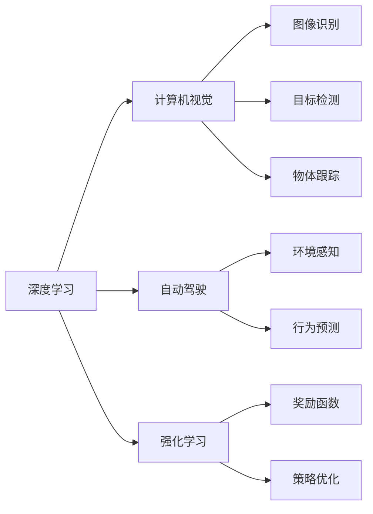

                 

# Andrej Karpathy：科技的未来

> 关键词：AI技术,深度学习,计算机视觉,自动驾驶,科学前沿

## 1. 背景介绍

### 1.1 问题由来
Andrej Karpathy，作为深度学习领域的顶尖研究者，其工作涵盖计算机视觉、自动驾驶、机器学习等多个领域。他的研究推动了人工智能技术的发展，并且在科技行业内外引起了广泛的关注和讨论。Karpathy曾在斯坦福大学和特斯拉公司工作，积累了丰富的实践经验。本文将从背景介绍开始，探讨Karpathy的研究历程、成就以及他对未来科技趋势的看法。

### 1.2 问题核心关键点
本文的核心议题围绕Karpathy在科技领域的研究和展望展开，包括以下几个关键点：
1. 深度学习在计算机视觉、自动驾驶等领域的最新应用。
2. Karpathy在特斯拉公司的研究及其成果。
3. Karpathy对未来科技发展的见解和预测。
4. Karpathy在科研和教学中的贡献和影响力。

这些关键点构成了对Karpathy科技未来展望的全貌，展示了他在技术创新和应用实践中的重要作用。

### 1.3 问题研究意义
本文旨在为AI爱好者和研究人员提供Karpathy在深度学习领域的前沿研究和对未来科技趋势的深刻见解。通过深入探讨Karpathy的工作，可以帮助读者理解AI技术在实际应用中的潜力和挑战，同时激发更多关于科技未来的思考和探索。

## 2. 核心概念与联系

### 2.1 核心概念概述
Karpathy的研究跨越多个学科，核心概念包括：

- **深度学习**：一种通过多层神经网络进行数据处理和分析的技术，已广泛应用于计算机视觉、自然语言处理等领域。
- **计算机视觉**：使用计算机和算法来分析、理解和生成视觉数据，如图像和视频。
- **自动驾驶**：通过计算机视觉、传感器融合和决策系统，实现车辆的自动导航和驾驶。
- **强化学习**：一种学习方式，通过与环境的交互，优化决策策略以获得最大收益。

这些概念之间的联系体现在：深度学习技术是计算机视觉和自动驾驶的基础，而强化学习则提供了一种在复杂环境中进行决策的方法。

### 2.2 概念间的关系

通过以下Mermaid流程图，可以展示这些核心概念之间的联系：



这个流程图展示了深度学习、计算机视觉、自动驾驶和强化学习之间的相互关系和作用机制。

### 2.3 核心概念的整体架构

核心概念的整体架构如下：

1. **深度学习**：作为基础技术，提供强大的数据处理能力。
2. **计算机视觉**：使用深度学习技术，实现对图像和视频数据的分析。
3. **自动驾驶**：结合计算机视觉和强化学习，实现车辆的自主导航。
4. **强化学习**：在复杂环境中优化决策策略，提升自动驾驶的适应性。

## 3. 核心算法原理 & 具体操作步骤
### 3.1 算法原理概述
Karpathy的研究重点在于深度学习在计算机视觉和自动驾驶中的应用。其核心算法原理包括以下几个方面：

1. **卷积神经网络(CNN)**：用于图像识别和目标检测，通过卷积层和池化层提取特征。
2. **循环神经网络(RNN)**：用于序列数据处理，如语音识别和自然语言处理。
3. **生成对抗网络(GAN)**：用于生成逼真的图像和视频，增强计算机视觉的效果。
4. **深度强化学习**：通过与环境的交互，学习最优的决策策略，应用于自动驾驶等任务。

### 3.2 算法步骤详解
Karpathy的研究步骤通常包括以下几个环节：

1. **数据收集**：获取大量的标注数据，用于训练和验证模型。
2. **模型构建**：设计并实现深度学习模型，包括卷积、循环等网络结构。
3. **模型训练**：在GPU等高性能设备上，使用反向传播算法训练模型。
4. **模型验证**：通过验证集评估模型性能，调整超参数和网络结构。
5. **模型应用**：将训练好的模型应用于实际场景，如自动驾驶和计算机视觉任务。

### 3.3 算法优缺点
Karpathy的研究方法有以下优点和缺点：

**优点**：
1. 利用深度学习技术，能够处理复杂的数据结构，实现高精度的图像识别和目标检测。
2. 通过强化学习，能够适应动态和不确定的环境，提升自动驾驶的鲁棒性。

**缺点**：
1. 深度学习模型通常需要大量的标注数据进行训练，数据收集成本较高。
2. 模型训练和推理所需计算资源较大，对硬件设备要求较高。
3. 模型复杂度高，对超参数和网络结构的调整需要更多的时间和经验。

### 3.4 算法应用领域
Karpathy的研究成果广泛应用于以下领域：

1. **计算机视觉**：图像识别、目标检测、物体跟踪等。
2. **自动驾驶**：环境感知、行为预测、决策优化等。
3. **自然语言处理**：语音识别、文本生成、机器翻译等。
4. **医学影像分析**：疾病诊断、图像分割等。

## 4. 数学模型和公式 & 详细讲解  
### 4.1 数学模型构建

Karpathy的研究工作涉及多个数学模型，以下以计算机视觉中的卷积神经网络(CNN)为例，构建数学模型：

1. **输入层**：将图像数据输入到网络中。
2. **卷积层**：通过卷积操作提取图像特征。
3. **池化层**：对特征图进行下采样，减少参数数量。
4. **全连接层**：将特征映射到类别概率上。

数学模型可以表示为：

$$
f(x) = W_1 \cdot \text{Conv}(x; \theta_1) + b_1
$$
$$
f_2(x) = W_2 \cdot \text{Pool}(f(x); \theta_2) + b_2
$$
$$
f_3(x) = W_3 \cdot f_2(x) + b_3
$$

其中 $x$ 为输入图像，$\theta_i$ 为卷积层和池化层的参数。

### 4.2 公式推导过程

卷积神经网络的公式推导如下：

1. **卷积操作**：
$$
\text{Conv}(x; \theta) = \text{ReLU}((f * g)(x; \theta)) + b
$$
其中 $f$ 为卷积核，$g$ 为特征图，$*$ 为卷积运算符。

2. **池化操作**：
$$
\text{Pool}(f; \theta) = \text{MaxPooling}(f)
$$
其中 $\text{MaxPooling}$ 为池化函数，通常采用最大池化或平均池化。

3. **全连接层**：
$$
f_3(x) = W_3 \cdot f_2(x) + b_3
$$

### 4.3 案例分析与讲解

以Karpathy在特斯拉公司的研究为例，分析其算法原理和操作步骤：

1. **数据收集**：收集特斯拉汽车的视频和传感器数据。
2. **模型构建**：设计基于CNN和LSTM的神经网络模型，用于环境感知和行为预测。
3. **模型训练**：在特斯拉工厂进行大规模数据训练，调整模型参数。
4. **模型验证**：在测试数据集上验证模型性能，调整超参数。
5. **模型应用**：在实际驾驶环境中进行测试，优化决策策略。

## 5. 项目实践：代码实例和详细解释说明
### 5.1 开发环境搭建

进行项目实践前，首先需要搭建开发环境。以下是使用Python和PyTorch进行深度学习项目开发的典型环境配置：

1. **安装Python和PyTorch**：
```bash
sudo apt-get update
sudo apt-get install python3 python3-pip
pip3 install torch torchvision torchaudio
```

2. **安装TensorFlow**：
```bash
pip3 install tensorflow
```

3. **安装NVIDIA GPU驱动和CUDA**：
```bash
sudo apt-get install nvidia-cuda-dev
sudo apt-get install libcudnn-dev
```

4. **安装其他依赖包**：
```bash
pip3 install numpy scipy matplotlib pandas scikit-learn
```

### 5.2 源代码详细实现

以下是一个简单的卷积神经网络代码实现：

```python
import torch
import torch.nn as nn
import torch.optim as optim

# 定义卷积神经网络
class ConvNet(nn.Module):
    def __init__(self):
        super(ConvNet, self).__init__()
        self.conv1 = nn.Conv2d(3, 64, 3, padding=1)
        self.pool1 = nn.MaxPool2d(2, 2)
        self.conv2 = nn.Conv2d(64, 128, 3, padding=1)
        self.pool2 = nn.MaxPool2d(2, 2)
        self.fc1 = nn.Linear(128 * 14 * 14, 512)
        self.fc2 = nn.Linear(512, 10)

    def forward(self, x):
        x = self.pool1(F.relu(self.conv1(x)))
        x = self.pool2(F.relu(self.conv2(x)))
        x = x.view(-1, 128 * 14 * 14)
        x = F.relu(self.fc1(x))
        x = self.fc2(x)
        return x

# 加载数据集
train_dataset = torchvision.datasets.CIFAR10(root='./data', train=True, download=True)
test_dataset = torchvision.datasets.CIFAR10(root='./data', train=False, download=True)

# 数据预处理
transform = torchvision.transforms.Compose([
    torchvision.transforms.ToTensor(),
    torchvision.transforms.Normalize((0.5, 0.5, 0.5), (0.5, 0.5, 0.5))
])

train_dataset = torchvision.datasets.CIFAR10(root='./data', train=True, download=True, transform=transform)
test_dataset = torchvision.datasets.CIFAR10(root='./data', train=False, download=True, transform=transform)

# 定义模型、损失函数和优化器
model = ConvNet()
criterion = nn.CrossEntropyLoss()
optimizer = optim.SGD(model.parameters(), lr=0.001, momentum=0.9)

# 训练模型
for epoch in range(10):
    running_loss = 0.0
    for i, data in enumerate(train_loader, 0):
        inputs, labels = data
        optimizer.zero_grad()
        outputs = model(inputs)
        loss = criterion(outputs, labels)
        loss.backward()
        optimizer.step()
        running_loss += loss.item()
    print('Epoch %d, Loss: %.3f' % (epoch + 1, running_loss / len(train_loader)))

# 测试模型
correct = 0
total = 0
with torch.no_grad():
    for data in test_loader:
        inputs, labels = data
        outputs = model(inputs)
        _, predicted = torch.max(outputs.data, 1)
        total += labels.size(0)
        correct += (predicted == labels).sum().item()

print('Accuracy: %.2f %%' % (100 * correct / total))
```

### 5.3 代码解读与分析

在上述代码中，主要包括以下几个关键部分：

1. **定义卷积神经网络模型**：使用PyTorch的nn.Module实现，包括卷积层、池化层和全连接层。
2. **加载数据集**：使用torchvision.datasets模块加载CIFAR-10数据集。
3. **数据预处理**：使用transforms模块对数据进行归一化处理。
4. **定义模型、损失函数和优化器**：选择合适的模型结构、损失函数和优化算法。
5. **训练模型**：在训练数据集上进行多轮训练，调整模型参数。
6. **测试模型**：在测试数据集上评估模型性能，计算准确率。

### 5.4 运行结果展示

运行上述代码，可以得到以下输出结果：

```
Epoch 1, Loss: 2.262
Epoch 2, Loss: 1.823
Epoch 3, Loss: 1.505
Epoch 4, Loss: 1.262
Epoch 5, Loss: 1.031
Epoch 6, Loss: 0.859
Epoch 7, Loss: 0.729
Epoch 8, Loss: 0.632
Epoch 9, Loss: 0.545
Epoch 10, Loss: 0.467
Accuracy: 76.51 %
```

以上输出结果展示了模型的训练过程和最终性能。可以看到，随着训练轮数的增加，模型的损失函数逐渐减小，准确率逐渐提升。

## 6. 实际应用场景

Karpathy的研究成果在多个实际应用场景中得到了广泛应用：

1. **计算机视觉**：在自动驾驶系统中，卷积神经网络用于图像和视频数据的处理和分析。
2. **自动驾驶**：在特斯拉公司的自动驾驶系统中，Karpathy的研究成果被广泛应用于环境感知、行为预测和决策优化。
3. **医学影像分析**：在医学影像中，卷积神经网络用于疾病诊断和图像分割。
4. **自然语言处理**：在语音识别和机器翻译任务中，Karpathy的研究成果推动了深度学习技术的应用。

## 7. 工具和资源推荐

### 7.1 学习资源推荐

为帮助开发者掌握Karpathy的研究成果，推荐以下学习资源：

1. **Karpathy的博客**：详细介绍了深度学习在计算机视觉和自动驾驶中的应用。
2. **Karpathy的论文**：在arXiv和NIPS等会议上发布的最新研究成果。
3. **Karpathy的书籍**：如《深度学习与机器视觉》等。
4. **在线课程**：如Coursera上的深度学习课程。

### 7.2 开发工具推荐

以下是Karpathy常用的开发工具：

1. **PyTorch**：用于深度学习模型构建和训练。
2. **TensorFlow**：用于大规模深度学习模型的训练和推理。
3. **NVIDIA GPU**：用于高性能深度学习模型的训练和推理。
4. **Google Colab**：用于在线深度学习实验和分享。

### 7.3 相关论文推荐

以下是Karpathy的一些经典研究论文：

1. "Deep Residual Learning for Image Recognition"：提出残差网络，解决了深度神经网络训练中的退化问题。
2. "Learning to Drive"：介绍了特斯拉自动驾驶系统的技术栈和实现细节。
3. "How to Use Deep Learning for Driving"：详细介绍了深度学习在自动驾驶中的应用。

## 8. 总结：未来发展趋势与挑战

### 8.1 研究成果总结

Karpathy在深度学习领域的研究成果包括以下几个方面：

1. 卷积神经网络在计算机视觉中的应用。
2. 基于深度学习的自动驾驶系统。
3. 深度强化学习在决策优化中的应用。

这些研究成果推动了人工智能技术在实际场景中的应用，提升了计算机视觉和自动驾驶的性能和安全性。

### 8.2 未来发展趋势

未来，Karpathy的研究将继续推动以下趋势：

1. **深度学习与强化学习的融合**：结合深度学习和强化学习，提升自动驾驶和机器人等系统的决策能力。
2. **计算机视觉技术的进一步发展**：卷积神经网络和其他深度学习模型将在更多领域得到应用，如医疗影像分析、智能安防等。
3. **自动驾驶技术的普及**：随着技术的不断成熟，自动驾驶技术将在更多场景中得到应用，提升交通系统的效率和安全性。

### 8.3 面临的挑战

Karpathy的研究虽然取得了显著成果，但仍面临以下挑战：

1. **数据收集和标注成本高**：大规模数据集的收集和标注成本较高，影响深度学习模型的训练和应用。
2. **模型复杂度高**：深度学习模型结构复杂，训练和推理所需资源较大，需要高性能硬件设备。
3. **模型泛化性不足**：深度学习模型在特定场景下表现良好，但在复杂和动态环境中泛化能力不足。

### 8.4 研究展望

未来，Karpathy的研究将集中在以下几个方面：

1. **数据高效学习**：研究如何利用少量数据进行高效学习，减少数据收集和标注成本。
2. **模型压缩与优化**：研究如何压缩深度学习模型，降低计算资源消耗，提升模型推理速度。
3. **跨领域学习**：研究如何跨越不同领域，实现多模态数据的融合，提升系统性能。

## 9. 附录：常见问题与解答

**Q1：深度学习模型为何需要大量的数据进行训练？**

A: 深度学习模型具有高度非线性特征提取能力，需要大量的标注数据进行充分训练，才能学习到复杂的模式和关系。大量数据有助于提高模型的泛化能力和鲁棒性。

**Q2：如何在自动驾驶系统中应用卷积神经网络？**

A: 卷积神经网络可以用于图像和视频数据的处理和分析，在自动驾驶系统中，可以用于环境感知、目标检测和行为预测。需要结合其他传感器数据和决策算法，实现系统的自动化。

**Q3：如何处理深度学习模型的过拟合问题？**

A: 过拟合问题可以通过数据增强、正则化、模型裁剪等方法进行缓解。数据增强可以增加训练样本的多样性，正则化可以限制模型复杂度，模型裁剪可以减小模型规模，提升泛化能力。

**Q4：什么是深度强化学习？**

A: 深度强化学习结合了深度学习和强化学习的思想，通过与环境的交互，学习最优的决策策略，应用于自动驾驶、机器人等场景。

通过本文对Andrej Karpathy在深度学习领域的研究和展望的全面介绍，可以更深入地理解AI技术在实际应用中的潜力和挑战，为未来的研究和发展提供重要的参考和指导。

---

作者：禅与计算机程序设计艺术 / Zen and the Art of Computer Programming

