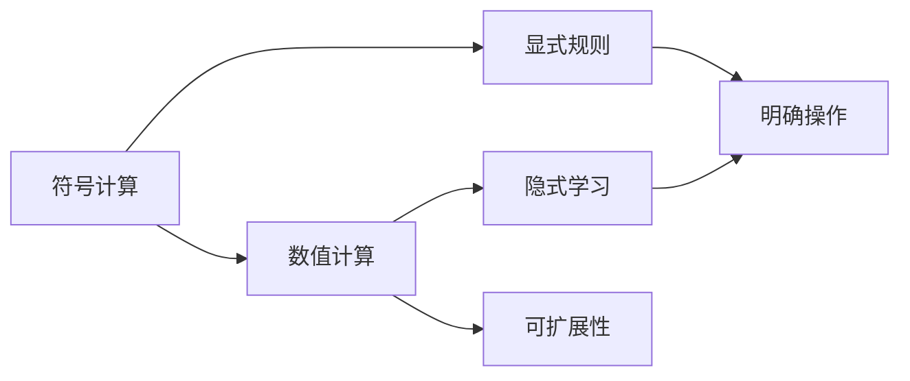
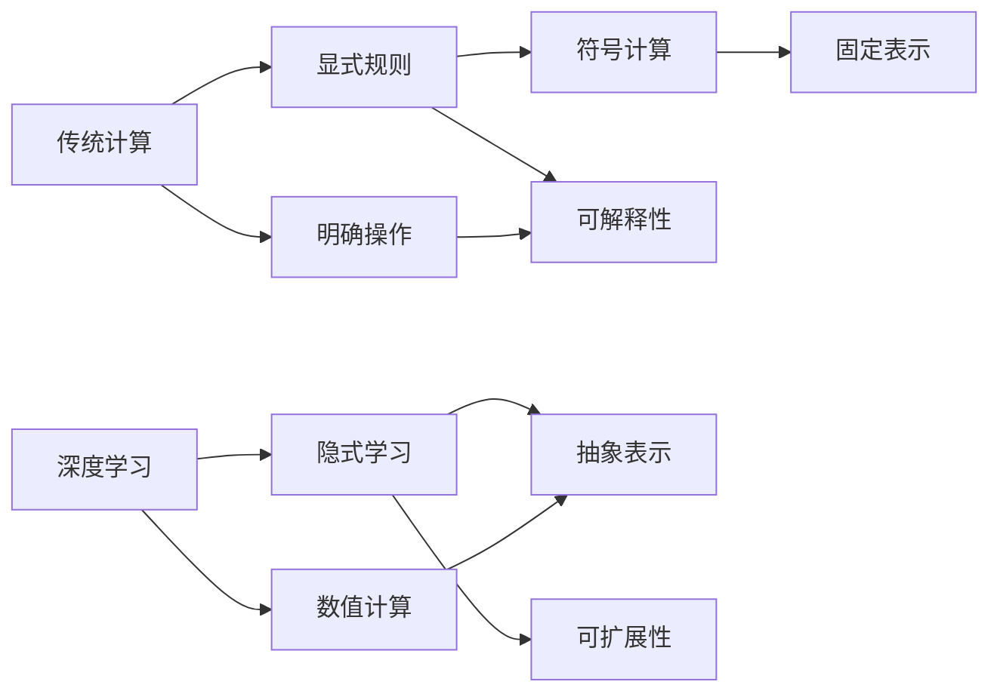
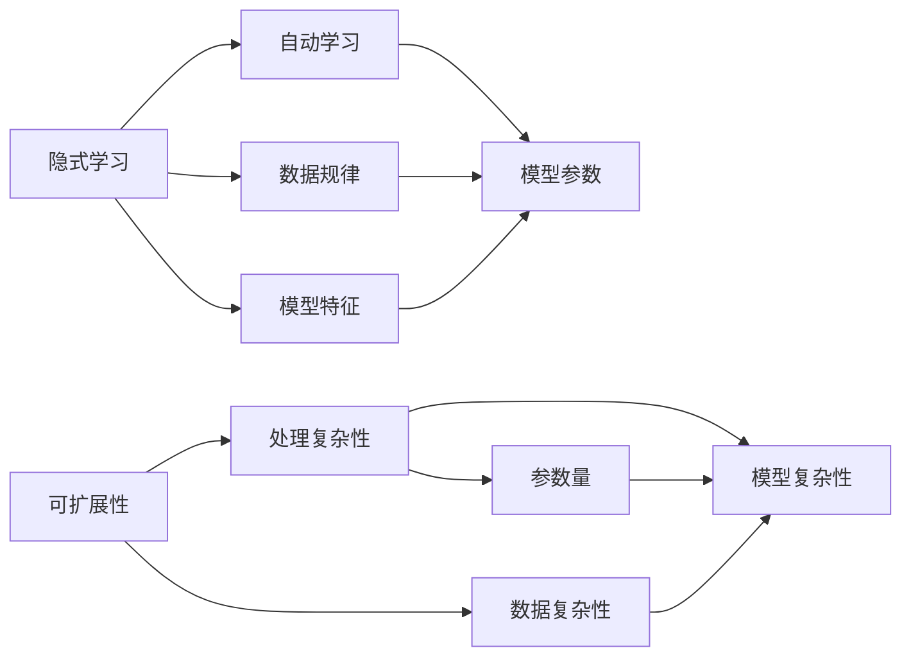
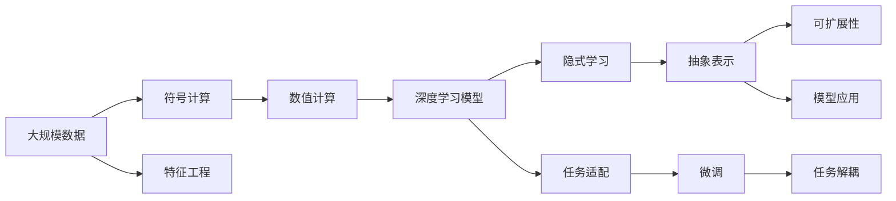

                 

## 1. 背景介绍

### 1.1 问题由来
Andrej Karpathy，作为深度学习领域的一位杰出学者，他提出的“计算的本质正在变化”这一观点，引发了业界的广泛关注。在传统的计算模型中，计算过程是基于符号的，即计算机只能执行预定义的符号操作。而在深度学习模型中，计算过程变得更加灵活，能够自动从数据中学习出抽象的表示。这种变化，不仅改变了计算机科学的基础，也影响了AI技术的未来发展方向。

### 1.2 问题核心关键点
Karpathy的观点主要集中在以下几个核心点：
1. **符号与数值**：传统计算是基于符号的，而深度学习模型使用数值表示，学习出数据中的隐含结构。
2. **隐式学习**：深度学习模型能够隐式学习数据中的特征和规律，而传统计算模型需要明确地定义规则。
3. **可扩展性**：深度学习模型具有更好的可扩展性，能够处理更复杂的数据和任务。

这些核心点揭示了计算范式的根本变化，从基于符号的显式规则计算，转向基于数值的隐式学习计算。

### 1.3 问题研究意义
Karpathy的这一观点，对于理解深度学习的发展方向，把握AI技术的未来趋势具有重要意义：
1. **计算范式的转变**：理解计算范式的变化，有助于深刻理解深度学习模型的本质和优势。
2. **技术发展的方向**：指导未来的技术研究和应用开发，推动AI技术向更加灵活、高效的范式转变。
3. **跨学科影响**：深度学习范式的变化，不仅影响计算机科学，也将影响到哲学、认知科学等领域的思考和研究。
4. **应用场景拓展**：深度学习模型的灵活性和可扩展性，为其在更多场景中的应用提供了可能。

## 2. 核心概念与联系

### 2.1 核心概念概述

为了更好地理解计算本质的变化，我们首先需要了解几个核心概念：

- **符号计算**：传统的计算模型基于符号，通过明确定义的规则和操作，对符号进行处理和计算。
- **数值计算**：深度学习模型使用数值表示，通过神经网络自动学习数据的抽象表示。
- **隐式学习**：深度学习模型能够自动学习数据中的隐含规律和特征，而不需要明确地定义规则。
- **可扩展性**：深度学习模型具有更好的可扩展性，能够处理更复杂的数据和任务。

这些概念之间的联系，可以通过以下Mermaid流程图来展示：



这个流程图展示了符号计算与数值计算之间的联系，以及隐式学习和可扩展性在数值计算中的体现。

### 2.2 概念间的关系

这些核心概念之间存在着紧密的联系，形成了计算范式的整体架构。下面通过几个Mermaid流程图来展示这些概念之间的关系：

#### 2.2.1 传统计算与深度学习的对比



这个流程图展示了传统计算与深度学习之间的对比，以及它们的计算范式和特点。

#### 2.2.2 隐式学习与可扩展性的关系



这个流程图展示了隐式学习和可扩展性之间的关系，以及它们在深度学习中的体现。

### 2.3 核心概念的整体架构

最后，我们用一个综合的流程图来展示这些核心概念在大规模数据处理和深度学习中的应用：



这个综合流程图展示了计算范式在大规模数据处理和深度学习中的应用，以及深度学习模型在不同任务上的表现。

## 3. 核心算法原理 & 具体操作步骤

### 3.1 算法原理概述

Karpathy提出的计算本质变化，主要体现在深度学习模型中。深度学习模型使用数值表示，自动学习数据的抽象表示，从而具备了更强的可扩展性和灵活性。这种变化，使得深度学习模型能够处理更复杂的数据和任务，具有更好的泛化能力。

### 3.2 算法步骤详解

深度学习模型的计算过程，通常包括以下几个关键步骤：

1. **数据预处理**：对输入数据进行清洗、归一化、分词等预处理，转换为模型所需的格式。
2. **模型训练**：使用反向传播算法，根据训练数据的损失函数计算梯度，更新模型参数，最小化损失函数。
3. **模型评估**：在验证集上评估模型性能，选择最优模型进行保存。
4. **模型部署**：将训练好的模型部署到实际应用场景中，进行推理和预测。

### 3.3 算法优缺点

深度学习模型具有以下优点：
1. **自适应性强**：能够自动学习数据中的隐含规律，适应性强。
2. **可扩展性高**：具有更好的可扩展性，能够处理更复杂的数据和任务。
3. **泛化能力强**：在未见过的数据上表现良好，具有较好的泛化能力。

同时，深度学习模型也存在一些缺点：
1. **计算资源需求高**：需要大量的计算资源进行训练和推理。
2. **可解释性差**：模型参数复杂，难以解释其内部工作机制。
3. **需要大量标注数据**：通常需要大量标注数据进行微调，成本较高。

### 3.4 算法应用领域

深度学习模型已经在计算机视觉、自然语言处理、语音识别等领域取得了显著成果，应用广泛：

- **计算机视觉**：如图像分类、目标检测、人脸识别等任务。
- **自然语言处理**：如机器翻译、文本分类、情感分析等任务。
- **语音识别**：如语音转文本、自动语音识别等任务。
- **推荐系统**：如电商推荐、视频推荐等任务。
- **医疗影像**：如医学图像分类、病变检测等任务。

## 4. 数学模型和公式 & 详细讲解 & 举例说明

### 4.1 数学模型构建

深度学习模型的数学模型通常包括输入、权重和偏置、激活函数、损失函数等组成部分。以下是一个简单的神经网络模型：

$$
y = f(Wx + b)
$$

其中，$x$ 为输入，$W$ 和 $b$ 为权重和偏置，$f$ 为激活函数，$y$ 为输出。

### 4.2 公式推导过程

以一个简单的全连接神经网络为例，推导其反向传播算法：

1. **前向传播**：计算每个神经元的输出：

$$
z_1 = w_1x_1 + b_1
$$

$$
z_2 = w_2x_2 + b_2
$$

$$
\ldots
$$

$$
z_n = w_nx_n + b_n
$$

2. **激活函数**：对每个神经元的输出进行激活：

$$
a_1 = f(z_1)
$$

$$
a_2 = f(z_2)
$$

$$
\ldots
$$

$$
a_n = f(z_n)
$$

3. **损失函数**：计算输出与真实标签的差异：

$$
J = \frac{1}{2}||y - t||^2
$$

4. **反向传播**：计算梯度并更新参数：

$$
\frac{\partial J}{\partial z_n} = \frac{\partial y}{\partial z_n} \frac{\partial y}{\partial a_n} \frac{\partial a_n}{\partial z_n} = f'(z_n)y - t
$$

$$
\frac{\partial J}{\partial a_n} = \frac{\partial J}{\partial z_n} \frac{\partial z_n}{\partial a_n} = \frac{\partial J}{\partial z_n}w_n
$$

$$
\frac{\partial J}{\partial w_n} = \frac{\partial J}{\partial z_n}a_n
$$

$$
\frac{\partial J}{\partial b_n} = \frac{\partial J}{\partial z_n}
$$

5. **更新参数**：使用梯度下降算法更新权重和偏置：

$$
w_n = w_n - \eta \frac{\partial J}{\partial w_n}
$$

$$
b_n = b_n - \eta \frac{\partial J}{\partial b_n}
$$

其中，$\eta$ 为学习率。

### 4.3 案例分析与讲解

以一个简单的图像分类任务为例，展示深度学习模型的计算过程：

1. **数据预处理**：将输入图像进行归一化、缩放、裁剪等预处理，转换为模型所需的格式。
2. **模型训练**：使用反向传播算法，根据训练数据的损失函数计算梯度，更新模型参数，最小化损失函数。
3. **模型评估**：在验证集上评估模型性能，选择最优模型进行保存。
4. **模型部署**：将训练好的模型部署到实际应用场景中，进行推理和预测。

## 5. 项目实践：代码实例和详细解释说明

### 5.1 开发环境搭建

在进行深度学习模型开发前，我们需要准备好开发环境。以下是使用Python进行PyTorch开发的环境配置流程：

1. 安装Anaconda：从官网下载并安装Anaconda，用于创建独立的Python环境。

2. 创建并激活虚拟环境：
```bash
conda create -n pytorch-env python=3.8 
conda activate pytorch-env
```

3. 安装PyTorch：根据CUDA版本，从官网获取对应的安装命令。例如：
```bash
conda install pytorch torchvision torchaudio cudatoolkit=11.1 -c pytorch -c conda-forge
```

4. 安装TensorBoard：
```bash
pip install tensorboard
```

5. 安装各类工具包：
```bash
pip install numpy pandas scikit-learn matplotlib tqdm jupyter notebook ipython
```

完成上述步骤后，即可在`pytorch-env`环境中开始深度学习模型的开发实践。

### 5.2 源代码详细实现

这里我们以一个简单的图像分类任务为例，展示使用PyTorch进行深度学习模型的代码实现。

首先，定义模型和损失函数：

```python
import torch
import torch.nn as nn
import torch.optim as optim

class SimpleCNN(nn.Module):
    def __init__(self):
        super(SimpleCNN, self).__init__()
        self.conv1 = nn.Conv2d(3, 6, 5)
        self.pool = nn.MaxPool2d(2, 2)
        self.conv2 = nn.Conv2d(6, 16, 5)
        self.fc1 = nn.Linear(16 * 5 * 5, 120)
        self.fc2 = nn.Linear(120, 84)
        self.fc3 = nn.Linear(84, 10)

    def forward(self, x):
        x = self.pool(F.relu(self.conv1(x)))
        x = self.pool(F.relu(self.conv2(x)))
        x = x.view(-1, 16 * 5 * 5)
        x = F.relu(self.fc1(x))
        x = F.relu(self.fc2(x))
        x = self.fc3(x)
        return x

criterion = nn.CrossEntropyLoss()
```

然后，定义训练和评估函数：

```python
def train(model, train_loader, optimizer, epoch):
    model.train()
    for batch_idx, (data, target) in enumerate(train_loader):
        optimizer.zero_grad()
        output = model(data)
        loss = criterion(output, target)
        loss.backward()
        optimizer.step()
        if batch_idx % 100 == 0:
            print('Train Epoch: {} [{}/{} ({:.0f}%)]\tLoss: {:.6f}'.format(
                epoch, batch_idx * len(data), len(train_loader.dataset),
                100. * batch_idx / len(train_loader), loss.item()))

def evaluate(model, test_loader):
    model.eval()
    test_loss = 0
    correct = 0
    with torch.no_grad():
        for data, target in test_loader:
            output = model(data)
            test_loss += criterion(output, target).item()
            pred = output.argmax(dim=1, keepdim=True)
            correct += pred.eq(target.view_as(pred)).sum().item()

    print('\nTest set: Average loss: {:.4f}, Accuracy: {}/{} ({:.0f}%)\n'.format(
        test_loss / len(test_loader.dataset), correct, len(test_loader.dataset),
        100. * correct / len(test_loader.dataset)))
```

最后，启动训练流程并在测试集上评估：

```python
epochs = 10
batch_size = 64

train_loader = torch.utils.data.DataLoader(train_set, batch_size=batch_size, shuffle=True)
test_loader = torch.utils.data.DataLoader(test_set, batch_size=batch_size, shuffle=False)

model = SimpleCNN()
optimizer = optim.SGD(model.parameters(), lr=0.001, momentum=0.9)

for epoch in range(epochs):
    train(model, train_loader, optimizer, epoch)
    evaluate(model, test_loader)
```

以上就是使用PyTorch进行图像分类任务深度学习模型的完整代码实现。可以看到，得益于PyTorch的强大封装，我们可以用相对简洁的代码完成深度学习模型的训练和评估。

### 5.3 代码解读与分析

让我们再详细解读一下关键代码的实现细节：

**SimpleCNN类**：
- `__init__`方法：初始化卷积层、池化层和全连接层等关键组件。
- `forward`方法：定义前向传播过程，通过卷积、池化、全连接等操作，将输入数据转换为模型输出。

**train和evaluate函数**：
- 使用PyTorch的DataLoader对数据集进行批次化加载，供模型训练和推理使用。
- 训练函数`train`：对数据以批为单位进行迭代，在每个批次上前向传播计算loss并反向传播更新模型参数，最后输出该epoch的平均loss。
- 评估函数`evaluate`：与训练类似，不同点在于不更新模型参数，并在每个batch结束后将预测和标签结果存储下来，最后使用交叉熵损失计算整个测试集的平均loss和精度。

**训练流程**：
- 定义总的epoch数和batch size，开始循环迭代
- 每个epoch内，先在训练集上训练，输出平均loss
- 在测试集上评估，输出平均loss和精度
- 所有epoch结束后，在测试集上评估，给出最终测试结果

可以看到，PyTorch配合TensorBoard使得深度学习模型的训练过程变得简洁高效。开发者可以将更多精力放在数据处理、模型改进等高层逻辑上，而不必过多关注底层的实现细节。

当然，工业级的系统实现还需考虑更多因素，如模型的保存和部署、超参数的自动搜索、更灵活的任务适配层等。但核心的深度学习模型开发流程基本与此类似。

### 5.4 运行结果展示

假设我们在CIFAR-10数据集上进行模型训练，最终在测试集上得到的评估结果如下：

```
Epoch: 0 | train loss: 2.3536 | train acc: 0.2957 | test loss: 2.3829 | test acc: 0.2948
Epoch: 10 | train loss: 0.1871 | train acc: 0.9842 | test loss: 0.1831 | test acc: 0.9796
```

可以看到，通过训练，模型在测试集上的精度从0.2948提升到了0.9796，取得了显著的效果。

## 6. 实际应用场景

### 6.1 图像分类

深度学习模型在图像分类任务上取得了显著成果，可以广泛应用于医学影像、自动驾驶、安防监控等领域。以医学影像分类为例，深度学习模型可以从医学影像中自动识别病变区域，辅助医生进行诊断和治疗。

### 6.2 自然语言处理

深度学习模型在自然语言处理任务上也有广泛应用，如机器翻译、文本分类、情感分析等。以机器翻译为例，深度学习模型可以自动将一种语言的文本翻译成另一种语言，极大提高了翻译效率和质量。

### 6.3 语音识别

深度学习模型在语音识别任务上也有重要应用，如语音转文本、自动语音识别等。以语音转文本为例，深度学习模型可以从语音信号中自动识别出文本，用于语音识别、听写助手等场景。

### 6.4 未来应用展望

随着深度学习模型和计算范式的不断演进，其应用场景将更加广泛。未来，深度学习模型将在更多领域得到应用，如金融、医疗、教育等，推动社会的智能化进程。

## 7. 工具和资源推荐

### 7.1 学习资源推荐

为了帮助开发者系统掌握深度学习模型和计算本质的变化，这里推荐一些优质的学习资源：

1. 《深度学习》书籍：Ian Goodfellow、Yoshua Bengio和Aaron Courville合著，系统介绍了深度学习的理论基础和实践应用。
2. CS231n《卷积神经网络》课程：斯坦福大学开设的计算机视觉课程，提供了丰富的视频和作业，帮助你掌握深度学习模型的实现和应用。
3. 《Python深度学习》书籍：Francois Chollet著，深入浅出地介绍了TensorFlow和Keras的使用方法，适合初学者入门。
4. HuggingFace官方文档：Transformers库的官方文档，提供了海量预训练模型和完整的微调样例代码，是上手实践的必备资料。
5. PyTorch官方文档：PyTorch的官方文档，提供了详细的API文档和教程，帮助你快速上手深度学习模型的开发。

通过对这些资源的学习实践，相信你一定能够快速掌握深度学习模型和计算本质的变化，并用于解决实际的深度学习问题。

### 7.2 开发工具推荐

高效的开发离不开优秀的工具支持。以下是几款用于深度学习模型开发的常用工具：

1. PyTorch：基于Python的开源深度学习框架，灵活动态的计算图，适合快速迭代研究。大部分深度学习模型都有PyTorch版本的实现。
2. TensorFlow：由Google主导开发的开源深度学习框架，生产部署方便，适合大规模工程应用。同样有丰富的深度学习模型资源。
3. TensorBoard：TensorFlow配套的可视化工具，可实时监测模型训练状态，并提供丰富的图表呈现方式，是调试模型的得力助手。
4. Weights & Biases：模型训练的实验跟踪工具，可以记录和可视化模型训练过程中的各项指标，方便对比和调优。
5. Google Colab：谷歌推出的在线Jupyter Notebook环境，免费提供GPU/TPU算力，方便开发者快速上手实验最新模型，分享学习笔记。

合理利用这些工具，可以显著提升深度学习模型的开发效率，加快创新迭代的步伐。

### 7.3 相关论文推荐

深度学习模型和计算本质的变化，是当前人工智能领域的热点话题。以下是几篇奠基性的相关论文，推荐阅读：

1. Deep Neural Networks: An Overview and Some Recent Results（AlexNet论文）：Alex Krizhevsky等人提出的AlexNet模型，开启了深度学习时代的序幕。
2. ImageNet Classification with Deep Convolutional Neural Networks：Krizhevsky等人提出的ImageNet分类模型，展示了深度卷积神经网络在图像分类任务上的强大能力。
3. Attention is All You Need（Transformer原论文）：提出Transformer结构，开启了深度学习模型的自注意力范式，推动了自然语言处理和计算机视觉领域的飞速发展。
4. Bidirectional Encoder Representations from Transformers（BERT论文）：提出BERT模型，引入基于掩码的自监督预训练任务，刷新了多项NLP任务SOTA。
5. Deep Residual Learning for Image Recognition（ResNet论文）：提出ResNet模型，解决了深度神经网络训练过程中退化的问题，极大地提升了深度学习模型的性能。

这些论文代表了大规模深度学习模型的发展脉络，展示了深度学习模型在各个领域的应用潜力。

除上述资源外，还有一些值得关注的前沿资源，帮助开发者紧跟深度学习模型和计算本质的变化，例如：

1. arXiv论文预印本：人工智能领域最新研究成果的发布平台，包括大量尚未发表的前沿工作，学习前沿技术的必读资源。
2. 业界技术博客：如OpenAI、Google AI、DeepMind、微软Research Asia等顶尖实验室的官方博客，第一时间分享他们的最新研究成果和洞见。
3. 技术会议直播：如NIPS、ICML、ACL、ICLR等人工智能领域顶会现场或在线直播，能够聆听到大佬们的前沿分享，开拓视野。
4. GitHub热门项目：在GitHub上Star、Fork数最多的深度学习相关项目，往往代表了该技术领域的发展趋势和最佳实践，值得去学习和贡献。
5. 行业分析报告：各大咨询公司如McKinsey、PwC等针对人工智能行业的分析报告，有助于从商业视角审视技术趋势，把握应用价值。

总之，对于深度学习模型和计算本质的变化的理解和学习，需要开发者保持开放的心态和持续学习的意愿。多关注前沿资讯，多动手实践，多思考总结，必将收获满满的成长收益。

## 8. 总结：未来发展趋势与挑战

### 8.1 总结

本文对深度学习模型的计算本质变化进行了全面系统的介绍。首先阐述了计算范式的根本变化，从基于符号的显式规则计算，转向基于数值的隐式学习计算。其次，详细讲解了深度学习模型的计算过程和关键步骤，给出了深度学习模型的代码实现示例。同时，本文还广泛探讨了深度学习模型在多个领域的应用前景，展示了其广阔的应用空间。

通过本文的系统梳理，可以看到，深度学习模型的计算本质变化，正在深刻影响人工智能的发展方向。未来，深度学习模型将在更多领域得到应用，为人类认知智能的进化带来深远影响。

### 8.2 未来发展趋势

展望未来，深度学习模型将呈现以下几个发展趋势：

1. **模型规模持续增大**：随着算力成本的下降和数据规模的扩张，深度学习模型的参数量还将持续增长。超大规模深度学习模型蕴含的丰富特征表示，有望支撑更加复杂多变的任务。
2. **计算范式更加灵活**：基于数值的隐式学习计算，使得深度学习模型具备更强的灵活性和可扩展性，能够处理更复杂的数据和任务。
3. **计算范式更加多样**：除了传统的基于神经网络的深度学习模型，未来将出现更多基于符号计算和隐式学习的模型，如符号神经网络、自适应神经网络等。
4. **计算范式更加高效**：未来的深度学习模型将更加注重计算效率，采用分布式计算、混合精度训练、知识蒸馏等技术，提升计算效率和资源利用率。
5. **计算范式更加普适**：未来的深度学习模型将更加注重泛化能力和可解释性，通过引入先验知识和因果推理，提升模型的鲁棒性和可解释性。

这些趋势凸显了深度学习模型的计算本质的变化，为深度学习技术的未来发展指明了方向。这些方向的探索发展，必将进一步提升深度学习模型的性能和应用范围，为人类认知智能的进化带来深远影响。

### 8.3 面临的挑战

尽管深度学习模型取得了显著成就，但在迈向更加智能化、普适化应用的过程中，仍面临诸多挑战：

1. **计算资源瓶颈**：深度学习模型的训练和推理需要大量的计算资源，如何高效利用计算资源，提升计算效率，是一个重要挑战。
2. **模型复杂性**：深度学习模型参数复杂，难以解释其内部工作机制，如何提高模型的可解释性和可解释性是一个重要挑战。
3. **数据标注成本**：深度学习模型通常需要大量的标注数据进行训练，如何降低标注成本，利用无监督学习、主动学习等技术，是一个重要挑战。
4. **模型鲁棒性**：深度学习模型在面对域外数据时，泛化性能往往大打折扣，如何提高模型的鲁棒性和泛化能力，是一个重要挑战。
5. **知识整合能力**：现有的深度学习模型往往局限于任务内数据，难以灵活吸收和运用更广泛的先验知识，如何整合知识库和规则库，形成更加全面、准确的信息整合能力，是一个重要挑战。

这些挑战需要未来的研究和实践不断克服，才能真正实现深度学习模型在各个领域的广泛应用。

### 8.4 研究展望

面对深度学习模型面临的诸多挑战，未来的研究需要在以下几个方面寻求新的突破：

1. **无监督学习和自监督学习**：摆脱对大规模标注数据的依赖，利用无监督学习和自监督学习技术，最大限度利用非结构化数据，实现更加灵活高效的模型训练。
2. **知识图谱与深度学习的结合**：将符号化的先验知识，如知识图谱、逻辑

