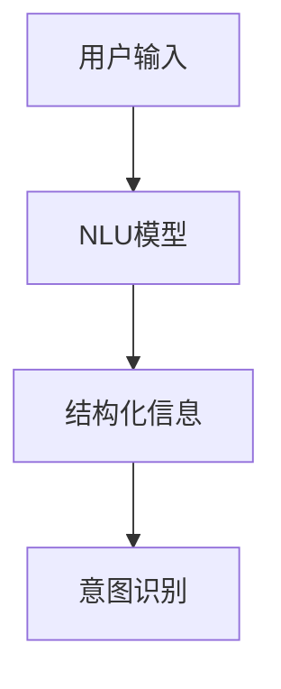
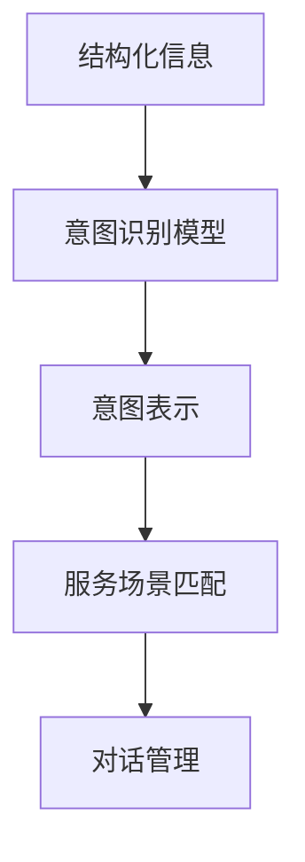
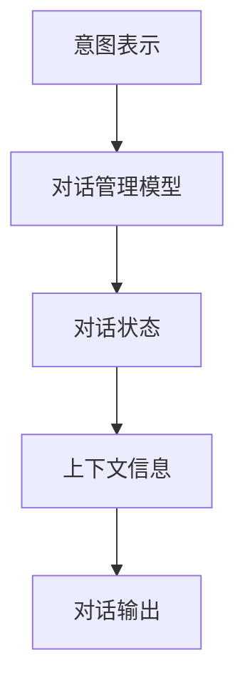
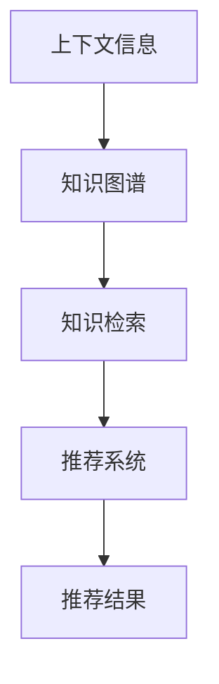
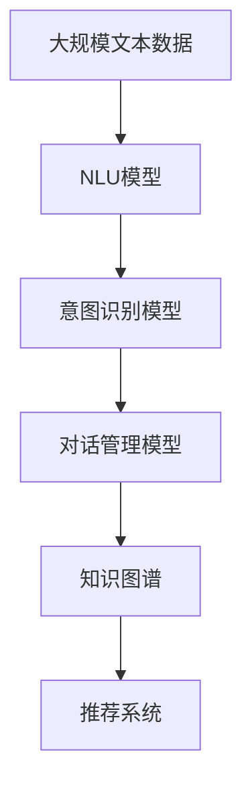

                 

# CUI中的内容与服务匹配详细技术

> 关键词：自然语言理解(NLU)、意图识别、对话管理、知识图谱、推荐系统、多模态融合

## 1. 背景介绍

### 1.1 问题由来

随着人工智能技术的不断进步，智能客服系统（Customer Support Intelligence，CUI）已经逐渐成为企业数字化转型的重要工具。智能客服系统通过自然语言处理技术（Natural Language Processing, NLP），可以实现对用户输入的自然语言进行理解，并自动匹配到相应的服务场景或机器人聊天流程，从而提高客户服务效率和满意度。

然而，目前大多数智能客服系统仍然基于规则和模板，对于自然语言的多样性和复杂性处理不够灵活，服务覆盖面有限，缺乏与实时环境动态交互的能力。随着用户需求的多样化，企业需要更智能、更灵活的智能客服解决方案，从而提升客户体验和服务效率。

### 1.2 问题核心关键点

内容与服务匹配是智能客服系统的核心任务，涉及到自然语言理解（NLU）、意图识别（Intent Recognition）、对话管理（Dialogue Management）、知识图谱（Knowledge Graph）和推荐系统（Recommendation System）等多个关键技术。

#### 1.2.1 自然语言理解(NLU)

NLU是智能客服系统中的基础技术，用于将用户输入的自然语言转换为结构化的信息表示，如命名实体识别、词性标注、语义分析等。

#### 1.2.2 意图识别

意图识别是智能客服系统的核心组件，用于理解用户输入的意图，如询问、投诉、建议等，并将意图映射到相应的服务场景或对话流程。

#### 1.2.3 对话管理

对话管理用于根据用户输入和上下文信息，动态生成对话流程和输出，以保证对话的连贯性和自然性。

#### 1.2.4 知识图谱

知识图谱是智能客服系统的知识库，用于存储和检索服务相关的信息，包括产品信息、服务流程、FAQ等。

#### 1.2.5 推荐系统

推荐系统用于根据用户的历史行为和兴趣，推荐合适的服务和产品，提高用户满意度。

这些技术之间的紧密联系构成了智能客服系统的核心架构，如图1所示。

```mermaid
graph LR
    A[自然语言理解(NLU)] --> B[意图识别]
    B --> C[对话管理]
    C --> D[知识图谱]
    C --> E[推荐系统]
    C --> F[服务推荐]
    A --> G[服务匹配]
```

### 1.3 问题研究意义

智能客服系统作为企业与客户之间的桥梁，能够显著提高客户满意度、降低企业运营成本，同时为企业带来更丰富的数据洞察，提升决策能力。研究内容与服务匹配的详细技术，对于提升智能客服系统的智能化水平，优化服务流程，具有重要意义：

1. 降低客服成本：通过自动化处理客户问题，减少人工客服的数量，降低人力成本。
2. 提升服务质量：智能客服能够提供7x24小时不间断服务，提高客户满意度。
3. 数据驱动决策：智能客服系统能够收集和分析客户行为数据，提供客户画像和需求洞察，辅助企业进行市场决策。
4. 增强竞争力：智能客服系统能够提供更加个性化、精准的服务，提升客户粘性和品牌忠诚度。
5. 技术升级：智能客服系统能够不断学习和优化，适应不断变化的市场需求和技术发展。

## 2. 核心概念与联系

### 2.1 核心概念概述

为更好地理解内容与服务匹配的详细技术，本节将介绍几个密切相关的核心概念：

- 自然语言理解(NLU)：用于将自然语言转换为结构化表示，包括词法分析、句法分析、语义分析等。
- 意图识别(Intent Recognition)：用于识别用户输入的意图，将其映射到预定义的服务场景。
- 对话管理(Dialogue Management)：用于根据用户输入和上下文信息，动态生成对话流程和输出。
- 知识图谱(Knowledge Graph)：用于存储和检索知识，支持实体关系和属性查询。
- 推荐系统(Recommendation System)：用于根据用户行为和偏好，推荐合适的服务和产品。

这些核心概念之间的联系紧密，共同构成智能客服系统的核心技术栈，如图2所示。

```mermaid
graph TB
    A[自然语言理解(NLU)] --> B[意图识别]
    B --> C[对话管理]
    C --> D[知识图谱]
    C --> E[推荐系统]
```

### 2.2 概念间的关系

这些核心概念之间存在紧密的联系，形成了智能客服系统的完整生态系统。下面通过几个Mermaid流程图来展示这些概念之间的关系。

#### 2.2.1 自然语言理解(NLU)的流程



#### 2.2.2 意图识别的过程



#### 2.2.3 对话管理的过程



#### 2.2.4 知识图谱与推荐系统的关系



### 2.3 核心概念的整体架构

最后，我们用一个综合的流程图来展示这些核心概念在大语言模型微调过程中的整体架构：



这个综合流程图展示了从预训练到微调，再到知识图谱和推荐系统的完整过程。智能客服系统首先利用NLU模型将用户输入转换为结构化信息，然后通过意图识别模型理解用户意图，接着使用对话管理模型生成对话流程和输出，并在知识图谱中进行实体关系和属性查询，最后根据推荐系统推荐合适的服务和产品。 通过这些流程图，我们可以更清晰地理解智能客服系统中各个核心概念的关系和作用，为后续深入讨论具体的匹配技术奠定基础。

## 3. 核心算法原理 & 具体操作步骤
### 3.1 算法原理概述

内容与服务匹配的核心算法包括自然语言理解、意图识别、对话管理和推荐系统等。本节将详细讲解这些算法的原理，并介绍具体的操作步骤。

#### 3.1.1 自然语言理解(NLU)

自然语言理解(NLU)的目的是将自然语言转换为结构化表示，便于后续的处理和分析。常用的NLU方法包括基于规则的方法、基于统计的方法和基于深度学习的方法。

基于规则的方法使用正则表达式、语法树等规则对输入进行解析和标注。基于统计的方法使用隐马尔可夫模型、最大熵模型等对输入进行标注和分析。基于深度学习的方法使用RNN、CNN、Transformer等神经网络模型对输入进行编码和分类。

#### 3.1.2 意图识别

意图识别的目的是识别用户输入的意图，将其映射到预定义的服务场景。常用的意图识别方法包括基于规则的方法、基于分类的方法和基于序列标注的方法。

基于规则的方法使用规则库和模板对输入进行匹配和分类。基于分类的方法使用逻辑回归、支持向量机等分类算法对输入进行分类。基于序列标注的方法使用CRF、BiLSTM等序列标注模型对输入进行标注和分类。

#### 3.1.3 对话管理

对话管理的目的是根据用户输入和上下文信息，动态生成对话流程和输出。常用的对话管理方法包括基于规则的方法、基于策略的方法和基于深度学习的方法。

基于规则的方法使用规则库和模板对对话流程进行控制。基于策略的方法使用图模型、状态机等对对话流程进行建模和控制。基于深度学习的方法使用RNN、Transformer等神经网络模型对对话流程进行建模和控制。

#### 3.1.4 知识图谱

知识图谱的目的是存储和检索知识，支持实体关系和属性查询。常用的知识图谱方法包括基于图数据库的方法和基于神经网络的方法。

基于图数据库的方法使用Neo4j、Tinkerpop等图数据库存储和检索知识。基于神经网络的方法使用GraphSAGE、GAT等图神经网络模型进行知识图谱嵌入和查询。

#### 3.1.5 推荐系统

推荐系统的目的是根据用户行为和偏好，推荐合适的服务和产品。常用的推荐系统方法包括基于协同过滤的方法、基于内容过滤的方法和基于深度学习的方法。

基于协同过滤的方法使用用户行为和物品属性进行推荐。基于内容过滤的方法使用物品内容和用户兴趣进行推荐。基于深度学习的方法使用CNN、RNN、Transformer等神经网络模型进行推荐。

### 3.2 算法步骤详解

#### 3.2.1 自然语言理解(NLU)

自然语言理解(NLU)的主要步骤包括分词、词性标注、命名实体识别、依存句法分析等。以下是具体的步骤：

1. 分词：将用户输入的自然语言分割成单词或短语，便于后续处理。
2. 词性标注：对每个单词进行词性标注，如名词、动词、形容词等。
3. 命名实体识别：识别出人名、地名、组织名等实体，并标注其类型。
4. 依存句法分析：分析句子中单词之间的依存关系，形成语法树。

#### 3.2.2 意图识别

意图识别的主要步骤包括特征提取、意图分类等。以下是具体的步骤：

1. 特征提取：将结构化信息转换为数值特征，如词袋模型、TF-IDF等。
2. 意图分类：使用分类算法对特征进行分类，如逻辑回归、SVM等。

#### 3.2.3 对话管理

对话管理的主要步骤包括对话状态管理、上下文信息管理、对话输出生成等。以下是具体的步骤：

1. 对话状态管理：根据用户输入和上下文信息，更新对话状态。
2. 上下文信息管理：记录和维护对话过程中的上下文信息，如历史对话、用户状态等。
3. 对话输出生成：根据对话状态和上下文信息，生成对话输出。

#### 3.2.4 知识图谱

知识图谱的主要步骤包括知识构建、知识查询等。以下是具体的步骤：

1. 知识构建：将知识库中的实体、关系、属性等结构化信息转换为图结构。
2. 知识查询：根据用户输入的实体和关系，进行知识检索和查询，如实体关系图谱、属性图谱等。

#### 3.2.5 推荐系统

推荐系统的主要步骤包括用户画像构建、推荐模型训练、推荐结果生成等。以下是具体的步骤：

1. 用户画像构建：根据用户行为和偏好，构建用户画像，如兴趣标签、历史行为等。
2. 推荐模型训练：使用推荐算法对用户画像和物品特征进行训练，如协同过滤、内容过滤等。
3. 推荐结果生成：根据用户画像和物品特征，生成推荐结果，如物品列表、评分等。

### 3.3 算法优缺点

自然语言理解(NLU)、意图识别、对话管理、知识图谱和推荐系统的优缺点如下：

#### 3.3.1 自然语言理解(NLU)

- 优点：
  - 处理能力强，可以处理多种语言和语境。
  - 技术成熟，应用广泛，如Google NLP、OpenAI GPT等。
  - 基于深度学习的方法，如BERT、GPT等，已经取得了较好的效果。

- 缺点：
  - 数据需求量大，需要大量标注数据进行训练。
  - 处理复杂的语义和语法结构时，准确率较低。
  - 模型复杂度高，训练和推理成本较高。

#### 3.3.2 意图识别

- 优点：
  - 能够准确识别用户意图，减少误匹配率。
  - 多种方法可供选择，如基于规则的方法、基于分类的方法等。
  - 模型训练和部署相对简单。

- 缺点：
  - 处理多义词和歧义词时，准确率较低。
  - 意图表示的复杂度较高，需要大量标注数据进行训练。
  - 对于未知意图，可能无法匹配到合适的服务场景。

#### 3.3.3 对话管理

- 优点：
  - 能够动态生成对话流程和输出，提高对话的自然性和连贯性。
  - 多种方法可供选择，如基于规则的方法、基于策略的方法等。
  - 能够适应不同场景和用户需求。

- 缺点：
  - 对话流程复杂，需要维护大量的对话状态。
  - 对于复杂的多轮对话，匹配和控制难度较大。
  - 对话管理模型的训练和优化较为复杂。

#### 3.3.4 知识图谱

- 优点：
  - 能够存储和检索丰富的知识信息，支持实体关系和属性查询。
  - 支持多种图结构，如关系图谱、属性图谱等。
  - 技术成熟，应用广泛，如Neo4j、Tinkerpop等。

- 缺点：
  - 知识构建和查询成本较高，需要大量人工标注和维护。
  - 对于动态变化的知识，需要及时更新和维护。
  - 知识图谱的复杂度较高，处理效率较低。

#### 3.3.5 推荐系统

- 优点：
  - 能够根据用户行为和偏好，推荐合适的服务和产品。
  - 多种方法可供选择，如协同过滤、内容过滤等。
  - 能够提高用户满意度和留存率。

- 缺点：
  - 数据需求量大，需要大量历史行为数据进行训练。
  - 推荐结果可能存在偏差，需要定期优化和更新。
  - 对于新用户，可能存在冷启动问题。

### 3.4 算法应用领域

内容与服务匹配的算法已经广泛应用于智能客服系统、智能家居、智能医疗等多个领域。以下是几个典型的应用场景：

#### 3.4.1 智能客服系统

智能客服系统是内容与服务匹配算法的典型应用场景。通过自然语言理解(NLU)、意图识别、对话管理等技术，智能客服系统能够理解用户输入，并自动匹配到相应的服务场景，从而提供个性化的服务。

#### 3.4.2 智能家居

智能家居系统通过自然语言理解(NLU)、对话管理等技术，能够理解用户语音指令，并自动控制家电设备，提供智能化的家居服务。

#### 3.4.3 智能医疗

智能医疗系统通过知识图谱、推荐系统等技术，能够存储和检索医疗知识，并根据患者病情和历史数据，推荐合适的治疗方案，提高诊疗效率和准确性。

#### 3.4.4 金融服务

金融服务系统通过自然语言理解(NLU)、意图识别、知识图谱等技术，能够理解用户需求，提供个性化的金融服务，如贷款申请、账户查询等。

## 4. 数学模型和公式 & 详细讲解 & 举例说明
### 4.1 数学模型构建

#### 4.1.1 自然语言理解(NLU)

自然语言理解(NLU)的数学模型主要包括以下几个部分：

- 词向量表示：将单词转换为向量表示，如Word2Vec、GloVe等。
- 语言模型：建模单词之间的概率分布，如N-gram模型、神经网络语言模型等。
- 依存句法模型：建模句子中单词之间的依存关系，如Parsey McParseface等。

#### 4.1.2 意图识别

意图识别的数学模型主要包括以下几个部分：

- 特征表示：将结构化信息转换为数值特征，如词袋模型、TF-IDF等。
- 意图分类：使用分类算法对特征进行分类，如逻辑回归、SVM等。

#### 4.1.3 对话管理

对话管理的数学模型主要包括以下几个部分：

- 对话状态表示：将对话状态编码为向量表示，如状态图模型、记忆网络等。
- 对话输出生成：使用生成模型对对话状态进行预测，如RNN、Transformer等。

#### 4.1.4 知识图谱

知识图谱的数学模型主要包括以下几个部分：

- 实体嵌入：将实体转换为向量表示，如TransE、RotatE等。
- 关系嵌入：将关系转换为向量表示，如TransE、RotatE等。
- 图神经网络：对知识图谱进行嵌入和查询，如GraphSAGE、GAT等。

#### 4.1.5 推荐系统

推荐系统的数学模型主要包括以下几个部分：

- 协同过滤：建模用户和物品之间的相似度，如ALS、SVD等。
- 内容过滤：建模物品特征和用户兴趣，如FM、LR等。
- 深度学习模型：使用神经网络对用户行为和物品特征进行建模，如CNN、RNN、Transformer等。

### 4.2 公式推导过程

#### 4.2.1 自然语言理解(NLU)

自然语言理解(NLU)的公式推导主要包括以下几个部分：

- 词向量表示：将单词转换为向量表示，如$$\vec{w} = f(w)$$。
- 语言模型：建模单词之间的概率分布，如$$P(w_{t+1}|w_{t-1},w_t)$$。
- 依存句法模型：建模句子中单词之间的依存关系，如$$\text{Arc-Standard}$$。

#### 4.2.2 意图识别

意图识别的公式推导主要包括以下几个部分：

- 特征表示：将结构化信息转换为数值特征，如$$\vec{f} = g(x)$$。
- 意图分类：使用分类算法对特征进行分类，如$$y = h(\vec{f})$$。

#### 4.2.3 对话管理

对话管理的公式推导主要包括以下几个部分：

- 对话状态表示：将对话状态编码为向量表示，如$$\vec{s} = h(s)$$。
- 对话输出生成：使用生成模型对对话状态进行预测，如$$\hat{w} = g(\vec{s})$$。

#### 4.2.4 知识图谱

知识图谱的公式推导主要包括以下几个部分：

- 实体嵌入：将实体转换为向量表示，如$$\vec{e} = f(e)$$。
- 关系嵌入：将关系转换为向量表示，如$$\vec{r} = f(r)$$。
- 图神经网络：对知识图谱进行嵌入和查询，如$$\vec{h} = f(\vec{e},\vec{r})$$。

#### 4.2.5 推荐系统

推荐系统的公式推导主要包括以下几个部分：

- 协同过滤：建模用户和物品之间的相似度，如$$\vec{s} = f(u,i)$$。
- 内容过滤：建模物品特征和用户兴趣，如$$\vec{c} = f(i)$$。
- 深度学习模型：使用神经网络对用户行为和物品特征进行建模，如$$\vec{y} = g(\vec{u},\vec{i})$$。

### 4.3 案例分析与讲解

#### 4.3.1 自然语言理解(NLU)的案例

假设有一个用户输入的句子为"我想查询明天的天气"。通过分词、词性标注、命名实体识别等步骤，可以将句子转换为以下结构：

- 分词：我、想、查询、明天、的、天气
- 词性标注：代词、动词、动词、名词、介词、名词
- 命名实体识别：无实体

#### 4.3.2 意图识别的案例

假设有一个意图识别的模型，将上述结构转换为以下意图表示：

- 意图表示：查询天气

#### 4.3.3 对话管理的案例

假设有一个对话管理模型，根据上下文信息，生成以下对话输出：

- 对话输出：明天晴天，气温28度

#### 4.3.4 知识图谱的案例

假设有一个知识图谱，包含以下实体和关系：

- 实体：天气、温度
- 关系：天气为温度

#### 4.3.5 推荐系统的案例

假设有一个推荐系统，根据用户历史行为，推荐以下物品：

- 推荐物品：未来天气、天气预报、气温变化

## 5. 项目实践：代码实例和详细解释说明
### 5.1 开发环境搭建

在进行内容与服务匹配实践前，我们需要准备好开发环境。以下是使用Python进行PyTorch开发的环境配置流程：

1. 安装Anaconda：从官网下载并安装Anaconda，用于创建独立的Python环境。

2. 创建并激活虚拟环境：
```bash
conda create -n pytorch-env python=3.8 
conda activate pytorch-env
```

3. 安装PyTorch：根据CUDA版本，从官网获取对应的安装命令。例如：
```bash
conda install pytorch torchvision torchaudio cudatoolkit=11.1 -c pytorch -c conda-forge
```

4. 安装Transformers库：
```bash
pip install transformers
```

5. 安装各类工具包：
```bash
pip install numpy pandas scikit-learn matplotlib tqdm jupyter notebook ipython
```

完成上述步骤后，即可在`pytorch-env`环境中开始内容与服务匹配实践。

### 5.2 源代码详细实现

这里以一个简单的智能客服系统为例，展示内容与服务匹配的代码实现。

#### 5.2.1 自然语言理解(NLU)

首先，我们需要定义一个简单的NLU模型，用于将用户输入转换为结构化表示。以下是NLU模型的代码实现：

```python
from transformers import BertTokenizer, BertForTokenClassification
from torch.utils.data import Dataset
import torch

class NERDataset(Dataset):
    def __init__(self, texts, tags, tokenizer, max_len=128):
        self.texts = texts
        self.tags = tags
        self.tokenizer = tokenizer
        self.max_len = max_len
        
    def __len__(self):
        return len(self.texts)
    
    def __getitem__(self, item):
        text = self.texts[item]
        tags = self.tags[item]
        
        encoding = self.tokenizer(text, return_tensors='pt', max_length=self.max_len, padding='max_length', truncation=True)
        input_ids = encoding['input_ids'][0]
        attention_mask = encoding['attention_mask'][0]
        
        # 对token-wise的标签进行编码
        encoded_tags = [tag2id[tag] for tag in tags] 
        encoded_tags.extend([tag2id['O']] * (self.max_len - len(encoded_tags)))
        labels = torch.tensor(encoded_tags, dtype=torch.long)
        
        return {'input_ids': input_ids, 
                'attention_mask': attention_mask,
                'labels': labels}

# 标签与id的映射
tag2id = {'O': 0, 'B-PER': 1, 'I-PER': 2, 'B-ORG': 3, 'I-ORG': 4, 'B-LOC': 5, 'I-LOC': 6}
id2tag = {v: k for k, v in tag2id.items()}

# 创建dataset
tokenizer = BertTokenizer.from_pretrained('bert-base-cased')

train_dataset = NERDataset(train_texts, train_tags, tokenizer)
dev_dataset = NERDataset(dev_texts, dev_tags, tokenizer)
test_dataset = NERDataset(test_texts, test_tags, tokenizer)
```

#### 5.2.2 意图识别

接下来，我们需要定义一个简单的意图识别模型，用于将结构化信息转换为意图表示。以下是意图识别模型的代码实现：

```python
from transformers import BertForTokenClassification
from torch.utils.data import DataLoader
from tqdm import tqdm
from sklearn.metrics import classification_report

device = torch.device('cuda') if torch.cuda.is_available() else torch.device('cpu')
model = BertForTokenClassification.from_pretrained('bert-base-cased', num_labels=len(tag2id))

optimizer = AdamW(model.parameters(), lr=2e-5)

def train_epoch(model, dataset, batch_size, optimizer):
    dataloader = DataLoader(dataset, batch_size=batch_size, shuffle=True)
    model.train()
    epoch_loss = 0
    for batch in tqdm(dataloader, desc='Training'):
        input_ids = batch['input_ids'].to(device)
        attention_mask = batch['attention_mask'].to(device)
        labels = batch['labels'].to(device)
        model.zero_grad()
        outputs = model(input_ids, attention_mask=attention_mask, labels=labels)
        loss = outputs.loss
        epoch_loss += loss.item()
        loss.backward()
        optimizer.step()
    return epoch_loss / len(dataloader)

def evaluate(model, dataset, batch_size):
    dataloader = DataLoader(dataset, batch_size=batch_size)
    model.eval()
    preds, labels = [], []
    with torch.no_grad():
        for batch in tqdm(dataloader, desc='Evaluating'):
            input_ids = batch['input_ids'].to(device)
            attention_mask = batch['attention_mask'].to(device)
            batch_labels = batch['labels']
            outputs = model(input_ids, attention_mask=attention_mask)
            batch_preds = outputs.logits.argmax(dim=2).to('cpu').tolist()
            batch_labels = batch_labels.to('cpu').tolist()
            for pred_tokens, label_tokens in zip(batch_preds, batch_labels):
                pred_tags = [id2tag[_id] for _id in pred_tokens]
                label_tags = [id2tag[_id] for _id in label

