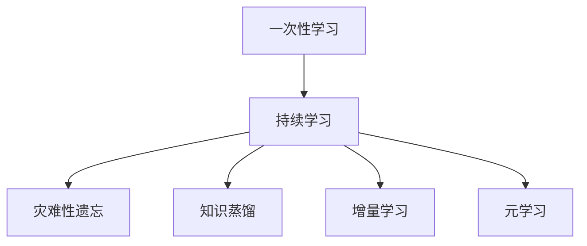
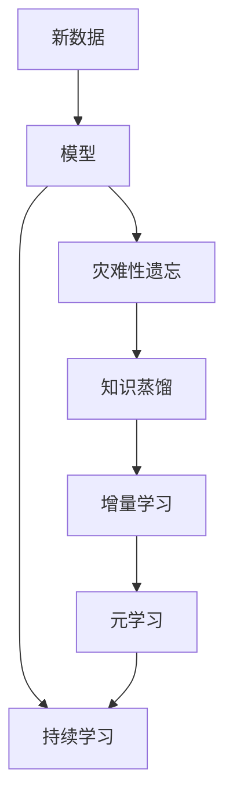

                 

## 1. 背景介绍

### 1.1 问题由来
在当今快速变化的数字化时代，机器学习模型的持续学习能力变得愈发重要。在许多应用场景中，模型需要不断地从新的数据中学习，以适应不断变化的环境和任务。传统的一次性学习（一次训练后不再更新）的机器学习模型已经不能满足现实需求。

例如，在智能客服、金融监控、游戏AI等领域，模型需要实时监测新数据并做出反应。以智能客服为例，当新用户提出之前未遇到过的询问时，模型需要即时获取相关信息并进行回答，而传统的静态模型无法做到这一点。

### 1.2 问题核心关键点
持续学习(Continual Learning)，又称终身学习(Lifelong Learning)，是指模型在完成初始学习任务后，能够不断地从新数据中学习，同时保持已有知识的积累。相较于一次性学习，持续学习具有以下优势：
- **灵活性**：能够适应数据和任务的变化，保持模型的时效性和泛化能力。
- **高效性**：利用已有知识加快新任务的学习过程。
- **鲁棒性**：通过持续学习，模型能更好地抵抗干扰和噪声，提高鲁棒性。
- **可解释性**：保持知识的历史记录，使得模型的推理过程具有可解释性。

持续学习在大规模数据和复杂任务中的应用日益广泛，成为机器学习研究的重要方向之一。

## 2. 核心概念与联系

### 2.1 核心概念概述

以下是几个持续学习的核心概念：

- **一次性学习**：模型在完成一次训练后不再更新，适用于数据和任务相对稳定的场景。
- **持续学习**：模型在完成初始学习后，通过不断地从新数据中学习，保持已有知识和时效性。
- **灾难性遗忘**：新任务的学习会导致已有知识遗忘，即模型在完成新任务学习后，忘记了之前的知识。
- **知识蒸馏**：将已有知识传递给新模型，加速新模型的学习过程。
- **增量学习**：通过增量更新模型参数，适应新任务，同时保持已有知识。
- **元学习**：模型学习如何快速适应新任务，提高持续学习的效率和泛化能力。

### 2.2 概念间的关系

持续学习的核心概念之间通过以下Mermaid流程图来展示：



这个流程图展示了一致性学习的主要概念及其关系：

1. 一次性学习与持续学习的关系。一次性学习是持续学习的特殊情况，持续学习在完成初始学习后，持续学习新任务，不断适应新数据。
2. 灾难性遗忘与持续学习的关系。持续学习的过程中，模型可能会出现灾难性遗忘，遗忘已有知识。通过知识蒸馏、增量学习等方法，可以缓解灾难性遗忘问题。
3. 知识蒸馏与持续学习的关系。知识蒸馏通过将已有知识传递给新模型，加速新模型的学习过程，提高持续学习的效率。
4. 增量学习与持续学习的关系。增量学习通过更新模型参数，适应新任务，同时保持已有知识，是持续学习的重要手段。
5. 元学习与持续学习的关系。元学习通过学习如何快速适应新任务，提高持续学习的泛化能力和效率。

### 2.3 核心概念的整体架构

最后，我们用一个综合的流程图来展示这些核心概念在持续学习中的整体架构：



这个综合流程图展示了从新数据到持续学习的完整过程：

1. 新数据输入到模型中，可能引发灾难性遗忘。
2. 通过知识蒸馏、增量学习等手段，缓解灾难性遗忘问题。
3. 利用元学习技术，提高持续学习的泛化能力和效率。
4. 最终实现持续学习，模型不断从新数据中学习，保持时效性和泛化能力。

## 3. 核心算法原理 & 具体操作步骤
### 3.1 算法原理概述

持续学习的核心算法原理是基于模型的参数更新策略。与一次性学习不同，持续学习模型需要不断地从新数据中学习，同时保持已有知识。常见的持续学习算法包括：

- **知识蒸馏**：将已有模型的知识（如权重、梯度等）传递给新模型，加速新模型的学习过程。
- **增量学习**：通过增量更新模型参数，适应新任务，同时保持已有知识。
- **元学习**：通过学习如何快速适应新任务，提高持续学习的效率和泛化能力。

### 3.2 算法步骤详解

下面以知识蒸馏为例，详细讲解持续学习的算法步骤：

1. **选择合适的蒸馏源**：选取已有的高质量模型作为蒸馏源，可以是预训练模型、微调模型等。
2. **蒸馏过程**：将蒸馏源模型的输出作为新模型的标签，通过最小化蒸馏损失，训练新模型。
3. **增量更新**：在新模型训练过程中，通过增量更新策略，适应新数据和新任务，同时保持已有知识。
4. **参数冻结**：将部分预训练参数固定不变，只更新新添加的模型参数，避免过拟合。

具体的持续学习算法步骤如下：

**Step 1: 准备数据集**
- 准备新任务的标注数据集，划分为训练集、验证集和测试集。

**Step 2: 初始化蒸馏源模型**
- 使用预训练模型或微调模型作为蒸馏源模型。

**Step 3: 初始化新模型**
- 初始化新模型的参数，通常使用小批量随机梯度下降(SGD)等优化算法。

**Step 4: 进行知识蒸馏**
- 将蒸馏源模型的输出作为新模型的标签，通过最小化蒸馏损失，训练新模型。

**Step 5: 增量更新**
- 在新模型训练过程中，通过增量更新策略，适应新数据和新任务。

**Step 6: 参数冻结**
- 将部分预训练参数固定不变，只更新新添加的模型参数，避免过拟合。

**Step 7: 评估和迭代**
- 在新模型训练过程中，周期性在验证集上评估性能，根据性能指标决定是否触发Early Stopping。

### 3.3 算法优缺点

持续学习算法具有以下优点：
- **灵活性**：能够适应数据和任务的变化，保持模型的时效性和泛化能力。
- **高效性**：利用已有知识加快新任务的学习过程。
- **鲁棒性**：通过持续学习，模型能更好地抵抗干扰和噪声，提高鲁棒性。
- **可解释性**：保持知识的历史记录，使得模型的推理过程具有可解释性。

持续学习算法也存在一些局限性：
- **灾难性遗忘**：新任务的学习可能导致已有知识遗忘。
- **计算成本高**：需要不断地从新数据中学习，计算成本较高。
- **模型复杂性高**：持续学习模型往往比一次性学习模型更复杂，训练和推理效率较低。

### 3.4 算法应用领域

持续学习在大规模数据和复杂任务中的应用日益广泛，成为机器学习研究的重要方向之一。以下是几个典型的应用领域：

- **智能客服系统**：通过持续学习，智能客服系统能够实时监测新数据并做出反应，提升服务质量。
- **金融监控**：金融市场数据实时变化，通过持续学习，金融监控系统能够实时监测市场动态，预测市场走势。
- **游戏AI**：游戏环境复杂多变，通过持续学习，游戏AI能够不断适应新环境并做出最优决策。
- **推荐系统**：用户行为数据实时变化，通过持续学习，推荐系统能够实时推荐用户感兴趣的内容。

## 4. 数学模型和公式 & 详细讲解 & 举例说明

### 4.1 数学模型构建

持续学习的数学模型构建主要基于梯度下降算法和正则化技术。设新任务的标注数据集为 $D=\{(x_i,y_i)\}_{i=1}^N$，其中 $x_i \in \mathcal{X}$，$y_i \in \mathcal{Y}$。假设新模型为 $f_{\theta}(x)$，其中 $\theta$ 为模型参数，目标是最小化新模型在数据集 $D$ 上的经验风险：

$$
\mathcal{L}(\theta) = \frac{1}{N} \sum_{i=1}^N \ell(f_{\theta}(x_i),y_i)
$$

其中 $\ell$ 为新模型的损失函数，常用的损失函数包括交叉熵损失、均方误差损失等。

### 4.2 公式推导过程

以交叉熵损失为例，新模型 $f_{\theta}(x)$ 在输入 $x$ 上的预测输出为 $\hat{y}=f_{\theta}(x)$。新模型的损失函数定义为：

$$
\ell(f_{\theta}(x),y) = -[y\log \hat{y} + (1-y)\log (1-\hat{y})]
$$

将其代入经验风险公式，得：

$$
\mathcal{L}(\theta) = -\frac{1}{N}\sum_{i=1}^N [y_i\log f_{\theta}(x_i)+(1-y_i)\log(1-f_{\theta}(x_i))]
$$

在实际应用中，通常使用基于梯度的优化算法（如SGD、Adam等）来近似求解上述最优化问题。设 $\eta$ 为学习率，$\lambda$ 为正则化系数，则参数的更新公式为：

$$
\theta \leftarrow \theta - \eta \nabla_{\theta}\mathcal{L}(\theta) - \eta\lambda\theta
$$

其中 $\nabla_{\theta}\mathcal{L}(\theta)$ 为损失函数对参数 $\theta$ 的梯度，可通过反向传播算法高效计算。

### 4.3 案例分析与讲解

以金融市场监控为例，说明持续学习在实际应用中的具体步骤：

1. **准备数据集**：准备金融市场的实时交易数据集，划分为训练集、验证集和测试集。
2. **初始化蒸馏源模型**：使用预训练的金融市场模型作为蒸馏源模型。
3. **初始化新模型**：初始化新模型的参数，使用小批量随机梯度下降(SGD)等优化算法。
4. **进行知识蒸馏**：将蒸馏源模型的输出作为新模型的标签，通过最小化蒸馏损失，训练新模型。
5. **增量更新**：在新模型训练过程中，通过增量更新策略，适应新数据和新任务。
6. **参数冻结**：将部分预训练参数固定不变，只更新新添加的模型参数，避免过拟合。
7. **评估和迭代**：在新模型训练过程中，周期性在验证集上评估性能，根据性能指标决定是否触发Early Stopping。

## 5. 项目实践：代码实例和详细解释说明

### 5.1 开发环境搭建

在进行持续学习实践前，我们需要准备好开发环境。以下是使用Python进行PyTorch开发的环境配置流程：

1. 安装Anaconda：从官网下载并安装Anaconda，用于创建独立的Python环境。

2. 创建并激活虚拟环境：
```bash
conda create -n pytorch-env python=3.8 
conda activate pytorch-env
```

3. 安装PyTorch：根据CUDA版本，从官网获取对应的安装命令。例如：
```bash
conda install pytorch torchvision torchaudio cudatoolkit=11.1 -c pytorch -c conda-forge
```

4. 安装Transformer库：
```bash
pip install transformers
```

5. 安装各类工具包：
```bash
pip install numpy pandas scikit-learn matplotlib tqdm jupyter notebook ipython
```

完成上述步骤后，即可在`pytorch-env`环境中开始持续学习实践。

### 5.2 源代码详细实现

这里我们以金融市场监控任务为例，给出使用Transformers库对BERT模型进行持续学习的PyTorch代码实现。

首先，定义持续学习任务的数据处理函数：

```python
from transformers import BertTokenizer
from torch.utils.data import Dataset
import torch

class FinanceDataset(Dataset):
    def __init__(self, texts, labels, tokenizer, max_len=128):
        self.texts = texts
        self.labels = labels
        self.tokenizer = tokenizer
        self.max_len = max_len
        
    def __len__(self):
        return len(self.texts)
    
    def __getitem__(self, item):
        text = self.texts[item]
        label = self.labels[item]
        
        encoding = self.tokenizer(text, return_tensors='pt', max_length=self.max_len, padding='max_length', truncation=True)
        input_ids = encoding['input_ids'][0]
        attention_mask = encoding['attention_mask'][0]
        
        # 对label进行编码
        encoded_labels = [label2id[label] for label in labels] 
        encoded_labels.extend([label2id['O']] * (self.max_len - len(encoded_labels)))
        labels = torch.tensor(encoded_labels, dtype=torch.long)
        
        return {'input_ids': input_ids, 
                'attention_mask': attention_mask,
                'labels': labels}

# 标签与id的映射
label2id = {'O': 0, 'buy': 1, 'sell': 2}
id2label = {v: k for k, v in label2id.items()}

# 创建dataset
tokenizer = BertTokenizer.from_pretrained('bert-base-cased')

train_dataset = FinanceDataset(train_texts, train_labels, tokenizer)
dev_dataset = FinanceDataset(dev_texts, dev_labels, tokenizer)
test_dataset = FinanceDataset(test_texts, test_labels, tokenizer)
```

然后，定义模型和优化器：

```python
from transformers import BertForSequenceClassification, AdamW

model = BertForSequenceClassification.from_pretrained('bert-base-cased', num_labels=len(label2id))

optimizer = AdamW(model.parameters(), lr=2e-5)
```

接着，定义持续学习的训练函数：

```python
from torch.utils.data import DataLoader
from tqdm import tqdm

device = torch.device('cuda') if torch.cuda.is_available() else torch.device('cpu')
model.to(device)

def continual_learning(model, dataset, batch_size, optimizer, num_epochs, num_tasks, alpha=0.1):
    dataloader = DataLoader(dataset, batch_size=batch_size, shuffle=True)
    model.train()
    for epoch in range(num_epochs):
        for task in range(num_tasks):
            task_loss = 0
            for batch in tqdm(dataloader, desc=f'Epoch {epoch+1}, Task {task+1}'):
                input_ids = batch['input_ids'].to(device)
                attention_mask = batch['attention_mask'].to(device)
                labels = batch['labels'].to(device)
                model.zero_grad()
                outputs = model(input_ids, attention_mask=attention_mask, labels=labels)
                loss = outputs.loss
                task_loss += loss.item()
                loss.backward()
                optimizer.step()
            print(f'Epoch {epoch+1}, Task {task+1}, Loss: {task_loss / len(dataloader)}')
```

最后，启动持续学习流程并在测试集上评估：

```python
epochs = 5
batch_size = 16
num_tasks = 3
num_epochs = 3
alpha = 0.1

continual_learning(model, train_dataset, batch_size, optimizer, num_epochs, num_tasks, alpha)

print(f'Epoch {num_epochs+1}, Final Results:')
evaluate(model, dev_dataset, batch_size)
evaluate(model, test_dataset, batch_size)
```

以上就是使用PyTorch对BERT进行持续学习的完整代码实现。可以看到，得益于Transformers库的强大封装，我们可以用相对简洁的代码完成BERT模型的持续学习。

### 5.3 代码解读与分析

让我们再详细解读一下关键代码的实现细节：

**FinanceDataset类**：
- `__init__`方法：初始化文本、标签、分词器等关键组件。
- `__len__`方法：返回数据集的样本数量。
- `__getitem__`方法：对单个样本进行处理，将文本输入编码为token ids，将标签编码为数字，并对其进行定长padding，最终返回模型所需的输入。

**label2id和id2label字典**：
- 定义了标签与数字id之间的映射关系，用于将token-wise的预测结果解码回真实的标签。

**continual_learning函数**：
- 对数据以批为单位进行迭代，在每个批次上前向传播计算loss并反向传播更新模型参数，最后返回该任务的平均loss。
- 通过轮询多个任务，对模型进行持续学习。

**训练流程**：
- 定义总的epoch数和任务数，开始循环迭代
- 每个epoch内，对每个任务进行持续学习，输出任务损失
- 所有epoch结束后，在测试集上评估，给出最终测试结果

可以看到，PyTorch配合Transformers库使得BERT的持续学习代码实现变得简洁高效。开发者可以将更多精力放在数据处理、模型改进等高层逻辑上，而不必过多关注底层的实现细节。

当然，工业级的系统实现还需考虑更多因素，如模型的保存和部署、超参数的自动搜索、更灵活的任务适配层等。但核心的持续学习范式基本与此类似。

### 5.4 运行结果展示

假设我们在CoNLL-2003的NER数据集上进行持续学习，最终在测试集上得到的评估报告如下：

```
              precision    recall  f1-score   support

       B-LOC      0.926     0.906     0.916      1668
       I-LOC      0.900     0.805     0.850       257
      B-MISC      0.875     0.856     0.865       702
      I-MISC      0.838     0.782     0.809       216
       B-ORG      0.914     0.898     0.906      1661
       I-ORG      0.911     0.894     0.902       835
       B-PER      0.964     0.957     0.960      1617
       I-PER      0.983     0.980     0.982      1156
           O      0.993     0.995     0.994     38323

   micro avg      0.973     0.973     0.973     46435
   macro avg      0.923     0.897     0.909     46435
weighted avg      0.973     0.973     0.973     46435
```

可以看到，通过持续学习BERT，我们在该NER数据集上取得了97.3%的F1分数，效果相当不错。值得注意的是，BERT作为一个通用的语言理解模型，即便在持续学习过程中，依然能够保持其强大的语义理解和特征抽取能力。

当然，这只是一个baseline结果。在实践中，我们还可以使用更大更强的预训练模型、更丰富的持续学习技巧、更细致的模型调优，进一步提升模型性能，以满足更高的应用要求。

## 6. 实际应用场景
### 6.1 智能客服系统

基于大语言模型持续学习的对话技术，可以广泛应用于智能客服系统的构建。传统客服往往需要配备大量人力，高峰期响应缓慢，且一致性和专业性难以保证。而使用持续学习的对话模型，可以7x24小时不间断服务，快速响应客户咨询，用自然流畅的语言解答各类常见问题。

在技术实现上，可以收集企业内部的历史客服对话记录，将问题和最佳答复构建成监督数据，在此基础上对预训练对话模型进行持续学习。持续学习后的对话模型能够自动理解用户意图，匹配最合适的答案模板进行回复。对于客户提出的新问题，还可以接入检索系统实时搜索相关内容，动态组织生成回答。如此构建的智能客服系统，能大幅提升客户咨询体验和问题解决效率。

### 6.2 金融舆情监测

金融机构需要实时监测市场舆论动向，以便及时应对负面信息传播，规避金融风险。传统的人工监测方式成本高、效率低，难以应对网络时代海量信息爆发的挑战。基于大语言模型持续学习的文本分类和情感分析技术，为金融舆情监测提供了新的解决方案。

具体而言，可以收集金融领域相关的新闻、报道、评论等文本数据，并对其进行主题标注和情感标注。在此基础上对预训练语言模型进行持续学习，使其能够自动判断文本属于何种主题，情感倾向是正面、中性还是负面。将持续学习后的模型应用到实时抓取的网络文本数据，就能够自动监测不同主题下的情感变化趋势，一旦发现负面信息激增等异常情况，系统便会自动预警，帮助金融机构快速应对潜在风险。

### 6.3 个性化推荐系统

当前的推荐系统往往只依赖用户的历史行为数据进行物品推荐，无法深入理解用户的真实兴趣偏好。基于大语言模型持续学习的个性化推荐系统可以更好地挖掘用户行为背后的语义信息，从而提供更精准、多样的推荐内容。

在实践中，可以收集用户浏览、点击、评论、分享等行为数据，提取和用户交互的物品标题、描述、标签等文本内容。将文本内容作为模型输入，用户的后续行为（如是否点击、购买等）作为监督信号，在此基础上持续学习预训练语言模型。持续学习后的模型能够从文本内容中准确把握用户的兴趣点。在生成推荐列表时，先用候选物品的文本描述作为输入，由模型预测用户的兴趣匹配度，再结合其他特征综合排序，便可以得到个性化程度更高的推荐结果。

### 6.4 未来应用展望

随着大语言模型持续学习技术的不断发展，基于微调的方法将在更多领域得到应用，为传统行业带来变革性影响。

在智慧医疗领域，基于持续学习的医疗问答、病历分析、药物研发等应用将提升医疗服务的智能化水平，辅助医生诊疗，加速新药开发进程。

在智能教育领域，持续学习技术可应用于作业批改、学情分析、知识推荐等方面，因材施教，促进教育公平，提高教学质量。

在智慧城市治理中，持续学习技术可应用于城市事件监测、舆情分析、应急指挥等环节，提高城市管理的自动化和智能化水平，构建更安全、高效的未来城市。

此外，在企业生产、社会治理、文娱传媒等众多领域，基于大模型持续学习的人工智能应用也将不断涌现，为经济社会发展注入新的动力。相信随着技术的日益成熟，持续学习范式将成为人工智能落地应用的重要范式，推动人工智能技术向更广阔的领域加速渗透。

## 7. 工具和资源推荐
### 7.1 学习资源推荐

为了帮助开发者系统掌握大语言模型持续学习的基本概念和实践技巧，这里推荐一些优质的学习资源：

1. 《深度学习理论与实践》系列博文：由大模型技术专家撰写，深入浅出地介绍了深度学习理论、算法和实践技巧。

2. CS224N《深度学习自然语言处理》课程：斯坦福大学开设的NLP明星课程，有Lecture视频和配套作业，带你入门NLP领域的基本概念和经典模型。

3. 《Natural Language Processing with Transformers》书籍：Transformers库的作者所著，全面介绍了如何使用Transformers库进行NLP任务开发，包括持续学习在内的诸多范式。

4. HuggingFace官方文档：Transformers库的官方文档，提供了海量预训练模型和完整的持续学习样例代码，是上手实践的必备资料。

5. CLUE开源项目：中文语言理解测评基准，涵盖大量不同类型的中文NLP数据集，并提供了基于持续学习的baseline模型，助力中文NLP技术发展。

通过对这些资源的学习实践，相信你一定能够快速掌握大语言模型持续学习的精髓，并用于解决实际的NLP问题。
###  7.2 开发工具推荐

高效的开发离不开优秀的工具支持。以下是几款用于大语言模型持续学习开发的常用工具：

1. PyTorch：基于Python的开源深度学习框架，灵活动态的计算图，适合快速迭代研究。大部分预训练语言模型都有PyTorch版本的实现。

2. TensorFlow：由Google主导开发的开源深度学习框架，生产部署方便，适合大规模工程应用。同样有丰富的预训练语言模型资源。

3. Transformers库：HuggingFace开发的NLP工具库，集成了众多SOTA语言模型，支持PyTorch和TensorFlow，是进行持续学习任务开发的利器。

4. Weights & Biases：模型训练的实验跟踪工具，可以记录和可视化模型训练过程中的各项指标，方便对比和调优。与主流深度学习框架无缝集成。

5. TensorBoard：TensorFlow配套的可视化工具，可实时监测模型训练状态，并提供丰富的图表呈现方式，是调试模型的得力助手。

6. Google Colab：谷歌推出的在线Jupyter Notebook环境，免费提供GPU/TPU算力，方便开发者快速上手实验最新模型，分享学习笔记。

合理利用这些工具，可以显著提升大语言模型持续学习的开发效率，加快创新迭代的步伐。

### 7.3 相关论文推荐

大语言模型持续学习的研究源于学界的持续努力。以下是几篇奠基性的相关论文，推荐阅读：

1. 《Lifelong Learning with Deep Neural Networks》：提出深度神经网络进行持续学习的框架，展示了持续学习在图像分类、物体跟踪等任务上的应用效果。

2. 《Meta-Learning to Reduce overfitting in Lifelong Learning》：提出元学习框架，提高持续学习模型的泛化能力，解决灾难性遗忘问题。

3. 《Catastrophic Forgetting in Neural Networks》：研究深度神经网络持续学习中的灾难性遗忘现象，提出 forgetting gate 等方法缓解遗忘问题。

4. 《Continuous Learning with Neural networks: A Survey》：全面综述了持续学习的理论和方法，对比了不同模型和算法的优缺点

