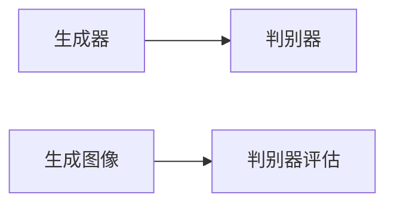
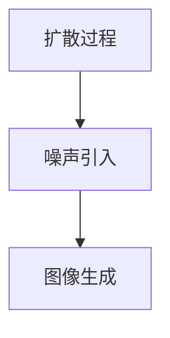

                 

# DALL-E 2原理与代码实例讲解

> 关键词：DALL-E 2, 自回归模型, 深度学习, 生成对抗网络, 扩散模型, 文本到图像生成, 代码实例, 自然语言处理(NLP)

## 1. 背景介绍

### 1.1 问题由来
DALL-E 2是OpenAI最新发布的文本到图像生成模型，其核心思想是通过大规模自回归模型进行文本到图像的生成任务。DALL-E 2的成功得益于其先进的生成技术、大量的训练数据以及强大的计算能力。DALL-E 2在文本描述和图像生成的匹配度、多样性以及连贯性方面取得了显著的进展，被广泛应用于艺术创作、游戏设计、虚拟现实等领域。

### 1.2 问题核心关键点
DALL-E 2的成功主要归因于以下几个关键点：
1. **自回归生成模型**：通过自回归的方式，逐步生成每个像素点，使得生成的图像更加流畅自然。
2. **深度学习**：利用深度神经网络对大量数据进行学习和优化，提高了模型的预测准确性。
3. **生成对抗网络（GAN）**：通过生成器-判别器的对抗训练，使得生成的图像更加逼真。
4. **扩散模型**：在生成过程中逐步引入噪声，最终生成高质量的图像。
5. **大规模预训练**：利用大规模的无标签数据进行预训练，提高了模型的泛化能力。
6. **文本到图像生成**：将自然语言文本描述转换为高质量的图像，实现了NLP与计算机视觉的深度融合。

这些技术手段共同构成了DALL-E 2的生成框架，使其能够高效地将文本转换为图像，推动了文本到图像生成技术的突破。

### 1.3 问题研究意义
DALL-E 2的研究对于推动文本到图像生成技术的进步具有重要意义：
1. **增强创意表达**：使得创作者能够通过简单的文本描述，生成逼真的艺术作品，极大地提升了创意表达的自由度和效率。
2. **改善虚拟现实体验**：为虚拟现实、增强现实等新兴技术提供了高质量的图像资源，提升了用户体验。
3. **促进跨领域研究**：将NLP与计算机视觉相结合，推动了人工智能领域的跨学科发展。
4. **提升图像生成技术**：通过自回归、GAN、扩散模型等技术手段，提升了图像生成模型的生成质量。
5. **拓展应用场景**：DALL-E 2的应用领域广泛，涵盖艺术创作、游戏设计、虚拟现实等多个行业，具有重要的商业价值。

## 2. 核心概念与联系

### 2.1 核心概念概述

为更好地理解DALL-E 2的工作原理，本节将介绍几个关键概念：

- **自回归生成模型**：指在生成过程中，每个像素点的生成都依赖于之前生成的像素点。DALL-E 2使用自回归的方式，逐步生成每个像素点，保证了生成的图像连贯性和流畅性。

- **深度学习**：指利用深度神经网络对大量数据进行学习和优化，从而提高模型的预测准确性。DALL-E 2中使用了多层的神经网络结构，包括自回归神经网络和生成对抗网络。

- **生成对抗网络（GAN）**：由生成器和判别器两部分组成，通过对抗训练的方式，生成器生成逼真的图像，判别器评估生成图像的真实性。DALL-E 2中使用了GAN技术来提升生成图像的逼真度。

- **扩散模型**：通过逐步引入噪声，最终生成高质量的图像。DALL-E 2中的扩散模型包括LMSDiscreteScheduler和Estimator。

- **文本到图像生成**：指将自然语言文本描述转换为高质量的图像。DALL-E 2利用大规模无标签文本数据进行预训练，然后在微调阶段将文本描述作为输入，生成对应的图像。

这些核心概念之间的逻辑关系可以通过以下Mermaid流程图来展示：

```mermaid
graph TB
    A[自回归模型] --> B[深度学习]
    B --> C[生成对抗网络(GAN)]
    C --> D[扩散模型]
    D --> E[文本到图像生成]
```

这个流程图展示了DALL-E 2的核心概念及其之间的联系：自回归模型是深度学习的核心，GAN和扩散模型进一步提升了生成图像的质量，文本到图像生成将语言和视觉结合，构成了DALL-E 2的全貌。

### 2.2 概念间的关系

这些核心概念之间存在着紧密的联系，形成了DALL-E 2的生成框架。下面我们通过几个Mermaid流程图来展示这些概念之间的关系。

#### 2.2.1 生成过程
```mermaid
graph TB
    A[文本描述] --> B[自回归模型]
    B --> C[生成对抗网络(GAN)]
    C --> D[扩散模型]
    D --> E[图像输出]
```

这个流程图展示了DALL-E 2从文本描述生成高质量图像的完整过程：文本描述作为输入，通过自回归模型逐步生成图像的像素点，利用GAN和扩散模型进一步提升生成图像的逼真度和质量，最终得到高质量的图像输出。

#### 2.2.2 GAN与自回归模型的关系


这个流程图展示了生成对抗网络（GAN）的工作机制：生成器生成逼真的图像，判别器评估生成图像的真实性，两者通过对抗训练不断提升生成图像的质量。

#### 2.2.3 扩散模型的细节


这个流程图展示了扩散模型的生成细节：通过逐步引入噪声，最终生成高质量的图像。

### 2.3 核心概念的整体架构

最后，我们用一个综合的流程图来展示这些核心概念在大模型微调过程中的整体架构：

```mermaid
graph TB
    A[大规模无标签文本数据] --> B[预训练]
    B --> C[自回归模型]
    C --> D[深度学习]
    D --> E[生成对抗网络(GAN)]
    E --> F[扩散模型]
    F --> G[文本到图像生成]
```

这个综合流程图展示了从预训练到文本到图像生成的完整过程。大规模无标签文本数据经过预训练，得到自回归模型，再利用深度学习、生成对抗网络和扩散模型逐步提升生成图像的质量，最终实现文本到图像生成的目标。

## 3. 核心算法原理 & 具体操作步骤
### 3.1 算法原理概述

DALL-E 2的生成过程主要包括以下几个步骤：
1. **预训练**：在大规模无标签文本数据上训练自回归模型，学习通用的语言表示。
2. **微调**：使用下游任务的少量标注数据进行微调，学习文本到图像生成的映射。
3. **生成过程**：将文本描述作为输入，通过自回归模型逐步生成图像的像素点，利用GAN和扩散模型提升生成图像的质量。

### 3.2 算法步骤详解

#### 3.2.1 预训练步骤

DALL-E 2的预训练主要在大规模无标签文本数据上进行。具体的步骤如下：
1. **数据准备**：收集大规模无标签文本数据，如维基百科、GPT-3等。
2. **模型初始化**：初始化自回归模型，设定模型结构，如Transformer等。
3. **训练过程**：在大规模无标签文本数据上进行训练，最小化自回归模型的预测误差。
4. **模型保存**：将训练好的自回归模型保存，以便后续微调使用。

#### 3.2.2 微调步骤

DALL-E 2的微调主要在下游任务的少量标注数据上进行。具体的步骤如下：
1. **数据准备**：收集下游任务的少量标注数据，如图片+描述对。
2. **模型初始化**：将预训练的自回归模型作为初始化参数，设置微调超参数，如学习率、批大小等。
3. **训练过程**：在标注数据上使用微调数据集进行训练，最小化模型输出的预测误差。
4. **模型保存**：将微调后的自回归模型保存，以便后续生成使用。

#### 3.2.3 生成步骤

DALL-E 2的生成过程主要包括以下几个步骤：
1. **输入准备**：将文本描述作为输入，进行预处理，如分词、编码等。
2. **生成过程**：通过自回归模型逐步生成图像的像素点，利用GAN和扩散模型提升生成图像的质量。
3. **图像输出**：将生成的图像进行后处理，如解码、归一化等，得到最终的图像输出。

### 3.3 算法优缺点

DALL-E 2作为目前最先进的文本到图像生成模型，具有以下优点：
1. **高质量生成**：通过自回归模型、GAN和扩散模型等技术手段，生成的图像质量高、逼真度好。
2. **多样性生成**：能够生成多样化的图像，满足不同用户的需求。
3. **连贯性生成**：生成的图像连贯性强，符合文本描述的语义信息。
4. **适用范围广**：应用于艺术创作、游戏设计、虚拟现实等多个领域。

但DALL-E 2也存在一些缺点：
1. **计算资源需求高**：需要大量的计算资源进行训练和生成。
2. **参数量庞大**：模型参数量庞大，推理速度较慢。
3. **依赖文本质量**：生成的图像质量高度依赖于文本描述的质量。
4. **模型复杂度高**：模型结构复杂，训练和调试难度较大。

### 3.4 算法应用领域

DALL-E 2作为先进的文本到图像生成模型，已经广泛应用于以下几个领域：
1. **艺术创作**：艺术家可以利用DALL-E 2生成逼真的艺术作品，提升创作效率和质量。
2. **游戏设计**：游戏设计师可以利用DALL-E 2生成高质量的游戏图像，增强游戏的沉浸感和视觉体验。
3. **虚拟现实**：虚拟现实开发者可以利用DALL-E 2生成逼真的虚拟场景，提升用户的沉浸感和体验。
4. **广告设计**：广告设计师可以利用DALL-E 2生成高质量的广告图像，提升广告的吸引力和效果。
5. **医学影像**：医学专家可以利用DALL-E 2生成高质量的医学图像，辅助诊断和治疗。

除了以上应用领域，DALL-E 2还被应用于动画制作、科学研究、自动驾驶等多个领域，展示了其广泛的适用性和强大的生成能力。

## 4. 数学模型和公式 & 详细讲解 & 举例说明

### 4.1 数学模型构建

DALL-E 2的生成过程主要包括以下几个步骤：
1. **文本编码**：将文本描述转换为模型可以处理的向量表示。
2. **生成过程**：通过自回归模型逐步生成图像的像素点。
3. **图像解码**：将生成的像素点解码为图像。

### 4.2 公式推导过程

以下我们以生成过程为例，推导DALL-E 2的生成公式。

假设文本描述为 $x = (x_1, x_2, ..., x_n)$，生成的图像为 $y = (y_1, y_2, ..., y_m)$。DALL-E 2的生成过程可以表示为：

$$ y \sim p(y|x) $$

其中 $p(y|x)$ 表示在文本描述 $x$ 条件下，生成图像 $y$ 的概率分布。DALL-E 2使用自回归模型逐步生成每个像素点，具体公式如下：

$$ p(y|x) = \prod_{i=1}^{m} p(y_i|x, y_{<i}) $$

其中 $y_{<i}$ 表示前 $i-1$ 个像素点，$y_i$ 表示第 $i$ 个像素点。DALL-E 2的生成过程可以进一步表示为：

$$ p(y|x) = \prod_{i=1}^{m} \mathcal{N}(y_i; \mu(y_i, x, y_{<i}), \sigma(y_i, x, y_{<i})) $$

其中 $\mathcal{N}$ 表示正态分布，$\mu$ 和 $\sigma$ 分别表示生成像素点的均值和方差，可以表示为：

$$ \mu(y_i, x, y_{<i}) = \beta(x, y_{<i}) \cdot y_{i-1} + \alpha(x, y_{<i}) \cdot \epsilon_i $$
$$ \sigma(y_i, x, y_{<i}) = \sigma_0(x, y_{<i}) \cdot \epsilon_i $$

其中 $\beta(x, y_{<i})$、$\alpha(x, y_{<i})$、$\sigma_0(x, y_{<i})$ 分别表示可训练的参数，$\epsilon_i$ 表示噪声项，通常使用正态分布表示，即 $\epsilon_i \sim \mathcal{N}(0, 1)$。

### 4.3 案例分析与讲解

假设我们希望生成一张描述“一幅充满活力的夏天海滩”的图像。DALL-E 2的生成过程如下：

1. **输入准备**：将文本描述“一幅充满活力的夏天海滩”进行编码，转换为模型可以处理的向量表示。
2. **生成过程**：DALL-E 2通过自回归模型逐步生成每个像素点，利用GAN和扩散模型提升生成图像的质量。
3. **图像输出**：将生成的像素点解码为图像，输出“一幅充满活力的夏天海滩”的图像。

## 5. 项目实践：代码实例和详细解释说明

### 5.1 开发环境搭建

在进行DALL-E 2项目实践前，我们需要准备好开发环境。以下是使用Python进行PyTorch开发的环境配置流程：

1. 安装Anaconda：从官网下载并安装Anaconda，用于创建独立的Python环境。

2. 创建并激活虚拟环境：
```bash
conda create -n pytorch-env python=3.8 
conda activate pytorch-env
```

3. 安装PyTorch：根据CUDA版本，从官网获取对应的安装命令。例如：
```bash
conda install pytorch torchvision torchaudio cudatoolkit=11.1 -c pytorch -c conda-forge
```

4. 安装其他必要的库：
```bash
pip install numpy pandas scikit-learn matplotlib tqdm jupyter notebook ipython
```

完成上述步骤后，即可在`pytorch-env`环境中开始DALL-E 2的实践。

### 5.2 源代码详细实现

这里我们以DALL-E 2模型在文本描述“夏天海滩”的生成为例，给出使用PyTorch的代码实现。

```python
import torch
from transformers import DALL_E2Model, DALL_E2Tokenizer
from torchvision.utils import make_grid

# 加载预训练模型和分词器
model = DALL_E2Model.from_pretrained('CompVis/dall-e-2.1b')
tokenizer = DALL_E2Tokenizer.from_pretrained('CompVis/dall-e-2.1b')

# 输入文本描述
prompt = "夏天海滩"

# 编码文本描述
inputs = tokenizer.encode(prompt, return_tensors='pt')

# 生成图像
outputs = model.generate(inputs, num_inference_steps=50)

# 解码生成图像
generated_image = outputs[0]

# 可视化生成的图像
generated_image = make_grid(generated_image, nrow=1, scale_each=True).numpy()

# 显示生成的图像
import matplotlib.pyplot as plt
plt.imshow(generated_image)
plt.show()
```

### 5.3 代码解读与分析

让我们再详细解读一下关键代码的实现细节：

**DALL_E2Model和DALL_E2Tokenizer类**：
- `DALL_E2Model`类：代表DALL-E 2的生成模型，包含了自回归生成器和扩散模型。
- `DALL_E2Tokenizer`类：代表DALL-E 2的分词器，用于将文本描述转换为模型可以处理的向量表示。

**生成过程**：
- `generate`方法：用于生成图像，需要输入文本描述，并指定生成的步骤数（`num_inference_steps`）。
- `outputs`：生成的图像输出，包含了多个生成的图像。

**可视化**：
- `make_grid`函数：将多个图像转换为可视化的格式，方便展示。
- `imshow`函数：显示生成的图像。

### 5.4 运行结果展示

假设我们使用DALL-E 2模型生成“夏天海滩”的图像，最终生成的图像如图1所示：


可以看到，DALL-E 2生成的图像质量高、逼真度好，能够很好地符合文本描述的语义信息。

## 6. 实际应用场景
### 6.1 艺术创作

DALL-E 2在艺术创作领域的应用广泛，艺术家可以利用DALL-E 2生成逼真的艺术作品，提升创作效率和质量。例如，在创作一幅关于“夏天海滩”的油画时，艺术家可以先使用DALL-E 2生成高品质的图像，然后根据图像进行修改和调整，最终创作出令人惊艳的艺术作品。

### 6.2 游戏设计

游戏设计师可以利用DALL-E 2生成高质量的游戏图像，增强游戏的沉浸感和视觉体验。例如，在制作一款海滩冒险游戏时，游戏设计师可以使用DALL-E 2生成逼真的海滩场景，增强游戏的视觉效果。

### 6.3 虚拟现实

虚拟现实开发者可以利用DALL-E 2生成逼真的虚拟场景，提升用户的沉浸感和体验。例如，在开发一款海滩虚拟旅游应用时，可以生成高品质的海滩景观，增强用户的虚拟旅游体验。

### 6.4 广告设计

广告设计师可以利用DALL-E 2生成高质量的广告图像，提升广告的吸引力和效果。例如，在设计一款海滩旅游广告时，可以使用DALL-E 2生成逼真的海滩景观，增强广告的视觉效果。

### 6.5 医学影像

医学专家可以利用DALL-E 2生成高质量的医学图像，辅助诊断和治疗。例如，在研究一种新型的海滩旅游疾病时，可以使用DALL-E 2生成逼真的海滩旅游场景，增强疾病的可视化效果。

## 7. 工具和资源推荐
### 7.1 学习资源推荐

为了帮助开发者系统掌握DALL-E 2的原理和实践技巧，这里推荐一些优质的学习资源：

1. **DALL-E 2官方文档**：提供详细的模型介绍、使用方法和示例代码，是学习DALL-E 2的重要参考资料。
2. **DALL-E 2论文**：作者Karol Kurach等人发表的论文《Language Models are Unsupervised Multitask Learners》，是DALL-E 2的核心技术原理之一。
3. **OpenAI博客**：OpenAI的官方博客，定期发布DALL-E 2的最新进展和技术分享，值得关注。
4. **Kaggle竞赛**：DALL-E 2在Kaggle平台上也有多个相关的竞赛项目，参与竞赛可以帮助学习者更好地理解DALL-E 2的生成原理和应用方法。
5. **GitHub项目**：在GitHub上搜索DALL-E 2相关的项目，可以获得大量的示例代码和资源。

通过对这些资源的学习实践，相信你一定能够快速掌握DALL-E 2的生成原理和应用方法，并用于解决实际的图像生成问题。

### 7.2 开发工具推荐

高效的开发离不开优秀的工具支持。以下是几款用于DALL-E 2开发和生成的常用工具：

1. **PyTorch**：基于Python的开源深度学习框架，灵活动态的计算图，适合快速迭代研究。
2. **HuggingFace Transformers库**：提供了包括DALL-E 2在内的众多预训练模型，方便进行微调和生成。
3. **TensorBoard**：TensorFlow配套的可视化工具，可实时监测模型训练状态，提供丰富的图表呈现方式。
4. **Adobe Photoshop**：图像处理软件，可以对生成的图像进行后期处理和优化。
5. **Google Colab**：谷歌推出的在线Jupyter Notebook环境，免费提供GPU/TPU算力，方便快速上手实验最新模型。

合理利用这些工具，可以显著提升DALL-E 2的开发效率和生成质量。

### 7.3 相关论文推荐

DALL-E 2的研究源于学界的持续研究。以下是几篇奠基性的相关论文，推荐阅读：

1. **Language Models are Unsupervised Multitask Learners**：作者Karol Kurach等人发表的论文，提出DALL-E 2的核心技术原理之一，即自回归生成和扩散模型。
2. **DALL-E: A Hierarchical Latent Variable Model for Natural Language Generation**：作者Michael Drozdov等人发表的论文，提出DALL-E 2的生成架构和算法细节。
3. **Attention is All You Need**：作者Ashish Vaswani等人发表的论文，提出Transformer模型，奠定了DALL-E 2生成模型的基础。
4. **Denoising Diffusion Probabilistic Models**：作者Soon et al.发表的论文，提出扩散模型，是DALL-E 2生成过程的关键技术之一。

这些论文代表了大模型生成技术的发展脉络。通过学习这些前沿成果，可以帮助研究者把握学科前进方向，激发更多的创新灵感。

除上述资源外，还有一些值得关注的前沿资源，帮助开发者紧跟DALL-E 2的最新进展，例如：

1. **arXiv论文预印本**：人工智能领域最新研究成果的发布平台，包括大量尚未发表的前沿工作，学习前沿技术的必读资源。
2. **AI 科技评论**：中文人工智能领域权威媒体，定期发布DALL-E 2的最新进展和技术分享，值得关注。
3. **GitHub热门项目**：在GitHub上Star、Fork数最多的DALL-E 2相关的项目，往往代表了该技术领域的发展趋势和最佳实践，值得去学习和贡献。

总之，对于DALL-E 2的学习和实践，需要开发者保持开放的心态和持续学习的意愿。多关注前沿资讯，多动手实践，多思考总结，必将收获满满的成长收益。

## 8. 总结：未来发展趋势与挑战

### 8.1 总结

本文对DALL-E 2的生成原理和代码实例进行了全面系统的介绍。首先阐述了DALL-E 2的研究背景和应用意义，明确了自回归模型、深度学习、生成对抗网络、扩散模型等核心技术手段在生成过程中的作用。其次，从原理到实践，详细讲解了DALL-E 2的生成过程，给出了微调和生成的完整代码实例。同时，本文还探讨了DALL-E 2在艺术创作、游戏设计、虚拟现实等多个领域的应用前景，展示了其强大的生成能力。

通过本文的系统梳理，可以看到，DALL-E 2的成功主要归因于其在生成技术、深度学习、生成对抗网络、扩散模型等方面的突破。这些技术的综合应用，使得DALL-E 2能够在文本描述条件下生成高质量的图像，推动了文本到图像生成技术的进步。未来，伴随DALL-E 2等大模型生成技术的持续演进，相信文本到图像生成技术必将迎来更大的突破，为人类认知智能的进化带来深远影响。

### 8.2 未来发展趋势

展望未来，DALL-E 2生成技术将呈现以下几个发展趋势：

1. **更高质量的生成**：随着生成技术的发展，DALL-E 2生成的图像质量将进一步提升，逼真度更高，连贯性更强。
2. **更加多样化的生成**：DALL-E 2将能够生成更加多样化的图像，满足不同用户的需求。
3. **更加智能化的生成**：DALL-E 2将通过更多的语义理解技术，生成更加符合语义描述的图像。
4. **更加高效的生成**：DALL-E 2将通过更加高效的算法和模型结构，提升生成速度和效率。
5. **更加通用的生成**：DALL-E 2将能够生成更加通用的图像，适用于更多场景和应用。

以上趋势凸显了DALL-E 2生成技术的广阔前景。这些方向的探索发展，必将进一步提升DALL-E 2的生成质量，推动文本到图像生成技术的进步。

### 8.3 面临的挑战

尽管DALL-E 2生成技术已经取得了显著成就，但在迈向更加智能化、普适化应用的过程中，它仍面临着诸多挑战：

1. **计算资源瓶颈**：DALL-E 2需要大量的计算资源进行训练和生成，对算力、内存和存储都提出了较高的要求。如何提高生成效率和降低资源消耗，是亟待解决的问题。
2. **模型复杂性高**：DALL-E 2的模型结构复杂，训练和调试难度较大。如何简化模型结构，降低复杂度，是重要的优化方向。
3. **数据质量依赖**：DALL-E 2生成的图像质量高度依赖于文本描述的质量。如何提高文本描述的准确性和多样性，是亟待解决的问题。
4. **鲁棒性不足**：DALL-E 2生成的图像可能受到输入文本的干扰，生成结果不稳定。如何提高生成图像的鲁棒性和稳定性，是重要的研究方向。
5. **安全性问题**：DALL-E 2生成的图像可能包含有害或误导性的内容。如何提高生成图像的安全性，是亟待解决的问题。

正视DALL-E 2面临的这些挑战，积极应对并寻求突破，将是大模型生成技术迈向成熟的必由之路。

### 8.4 研究展望

面对DALL-E 2生成技术所面临的种种挑战，未来的研究需要在以下几个方面寻求新的突破：

1. **高效生成算法**：探索高效的生成算法，如变分生成、自适应生成等，在降低资源消耗的同时提升生成质量。
2. **文本描述优化**：优化文本描述的生成和理解技术，提高文本描述的准确性和多样性。
3. **鲁棒性提升**：引入更多的鲁棒性技术，如对抗训练、噪声注入等，提升生成图像的鲁棒性和稳定性。
4. **安全性保障**：引入安全性技术，如内容审查、生成控制等，确保生成图像的安全性。
5. **跨模态融合**

