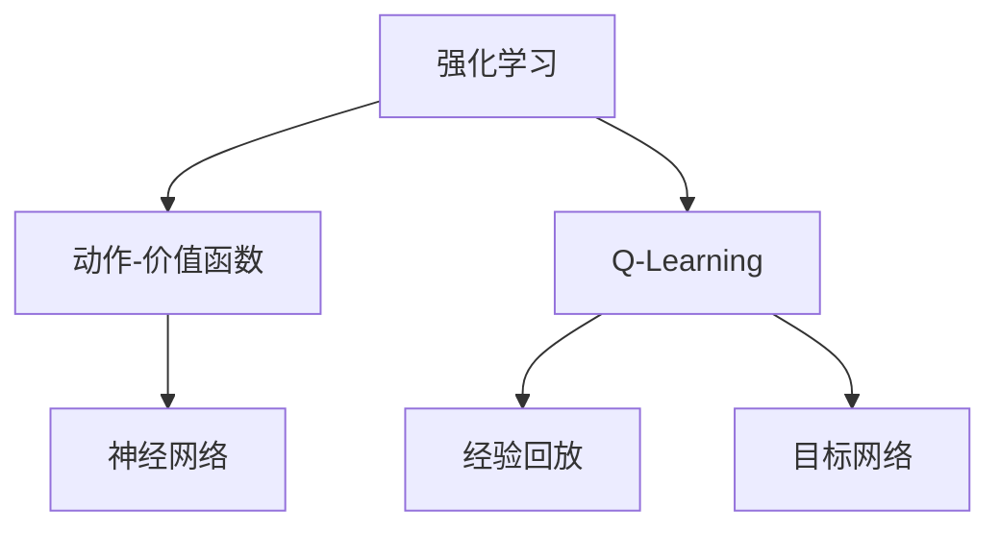
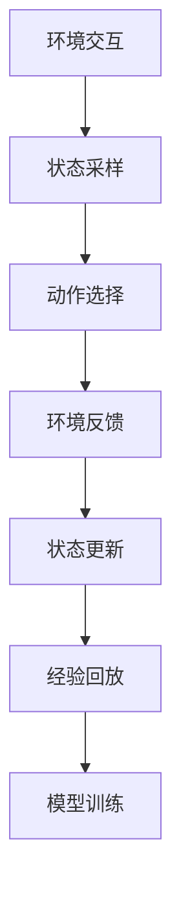
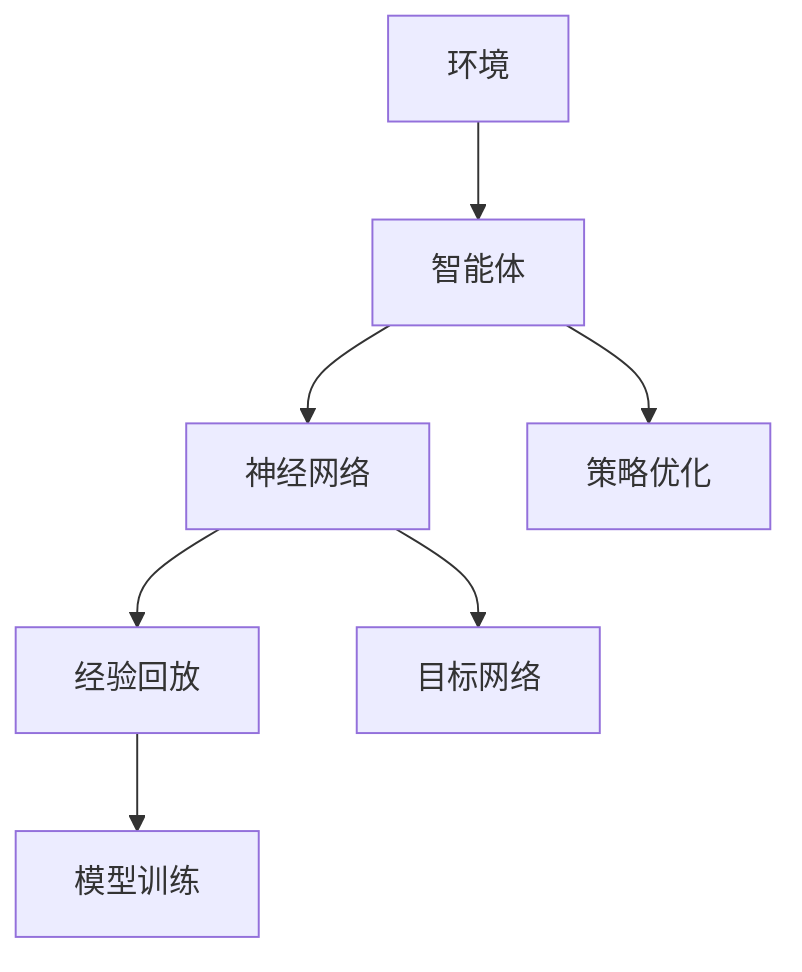

                 

# DQN(Deep Q-Network) - 原理与代码实例讲解

> 关键词：Deep Q-Network, 强化学习, 神经网络, 动作-价值函数, Q-learning, 强化学习算法, 模型训练, 运行结果

## 1. 背景介绍

### 1.1 问题由来

在计算机科学和人工智能领域，强化学习（Reinforcement Learning, RL）是一种重要的学习范式，用于训练智能体（Agent）以在动态环境中做出最优决策。在强化学习中，智能体通过与环境的交互，不断尝试和探索，以最大化累计奖励（即所谓的"奖励信号"）。经典的强化学习算法如Q-learning和Sarsa等已广泛应用于游戏、机器人控制、自动驾驶等领域。

然而，传统的强化学习算法往往依赖于手工设计的规则或简单的特征表示，难以在大规模复杂问题上获得理想的性能。近些年来，随着深度学习技术的进步，结合神经网络的强化学习算法（如深度Q-网络Deep Q-Network, DQN）开始兴起，并取得了一系列令人瞩目的成果。

DQN算法将深度神经网络与Q-learning算法相结合，使智能体能够利用大规模数据进行训练，提升决策能力，从而在复杂的控制和策略优化任务上获得优异表现。DQN的原理与代码实例讲解，对于理解强化学习和大规模数据在强化学习中的应用具有重要意义。

### 1.2 问题核心关键点

DQN算法是一种基于深度神经网络的Q-learning算法，其核心思想是使用神经网络逼近动作-价值函数（Action-Value Function），从而在无需手工设计规则的情况下，进行高效的强化学习。DQN算法的主要特点包括：

- 深度神经网络：使用深度神经网络逼近Q-Value函数，通过大规模数据训练模型，提升决策能力。
- 离线训练：通过离线训练，减少环境交互带来的数据偏差，提高训练效率。
- 经验回放（Experience Replay）：将环境交互数据存储在缓冲区中，按一定的概率随机抽取，用于训练网络。
- 目标网络（Target Network）：在训练网络时，使用一个目标网络来代替当前网络，减小模型更新带来的不稳定。

这些特点使得DQN算法在大规模复杂任务上表现出色，特别是对于无法直接模拟的物理系统，如机器人控制、自动驾驶等，具有重要的应用价值。

## 2. 核心概念与联系

### 2.1 核心概念概述

为更好地理解DQN算法的原理和结构，本节将介绍几个关键的概念及其之间的关系：

- **强化学习（Reinforcement Learning, RL）**：一种通过智能体与环境交互，最大化累计奖励的学习范式。
- **动作-价值函数（Action-Value Function）**：描述在不同状态下，采取某个动作后所获得的期望累计奖励的函数。
- **Q-Learning**：一种基于值迭代的强化学习算法，通过逼近动作-价值函数，优化决策策略。
- **神经网络（Neural Network）**：一种通过多层非线性变换，逼近任意函数的模型，常用于复杂决策的逼近。
- **经验回放（Experience Replay）**：将环境交互数据存储在缓冲区中，按一定概率随机抽取，用于训练网络。
- **目标网络（Target Network）**：在训练网络时，使用一个目标网络来代替当前网络，减小模型更新带来的不稳定。

这些概念之间的逻辑关系可以通过以下Mermaid流程图来展示：



这个流程图展示了一部分关键概念之间的关系：

1. 强化学习涉及智能体与环境的交互，目标是通过探索和利用来最大化累计奖励。
2. Q-Learning通过逼近动作-价值函数，优化决策策略。
3. 神经网络被用于逼近Q-Value函数，提升决策能力。
4. 经验回放通过存储和随机抽取环境交互数据，提高训练效率。
5. 目标网络在训练过程中用来替代当前网络，减小模型更新带来的不稳定。

### 2.2 概念间的关系

这些核心概念之间存在着紧密的联系，形成了DQN算法的完整生态系统。下面我们通过几个Mermaid流程图来展示这些概念之间的关系。

#### 2.2.1 DQN算法的学习范式


这个流程图展示了一部分关键概念之间的关系：

1. 强化学习涉及智能体与环境的交互，目标是通过探索和利用来最大化累计奖励。
2. Q-Learning通过逼近动作-价值函数，优化决策策略。
3. 神经网络被用于逼近Q-Value函数，提升决策能力。
4. 经验回放通过存储和随机抽取环境交互数据，提高训练效率。
5. 目标网络在训练过程中用来替代当前网络，减小模型更新带来的不稳定。

#### 2.2.2 DQN算法的步骤



这个流程图展示了DQN算法的基本步骤：

1. 环境交互：智能体与环境进行交互，获取当前状态。
2. 状态采样：从当前状态中选择一个动作。
3. 环境反馈：执行动作后，环境给出反馈信息。
4. 状态更新：智能体根据反馈信息更新状态。
5. 经验回放：将环境交互数据存储在缓冲区中，按一定概率随机抽取。
6. 模型训练：使用经验回放中的数据训练神经网络。

### 2.3 核心概念的整体架构

最后，我们用一个综合的流程图来展示这些核心概念在大规模强化学习任务中的整体架构：



这个综合流程图展示了从环境交互到模型训练的完整过程。智能体通过神经网络逼近动作-价值函数，结合经验回放和目标网络，进行模型训练和策略优化，最终提升决策能力。 通过这些流程图，我们可以更清晰地理解DQN算法的基本步骤和核心概念之间的关系。

## 3. 核心算法原理 & 具体操作步骤
### 3.1 算法原理概述

DQN算法基于Q-Learning算法，其核心在于使用深度神经网络逼近动作-价值函数，从而在不需要手工设计规则的情况下，进行高效的强化学习。DQN算法的基本原理如下：

- 智能体（Agent）通过与环境（Environment）的交互，获取当前状态（State）。
- 根据当前状态和动作空间（Action Space），智能体选择一个动作（Action）。
- 执行动作后，环境给出反馈（Reward），同时更新状态（State）。
- 智能体将反馈和状态更新后的状态存储在经验回放缓冲区中。
- 从经验回放缓冲区中随机抽取一组数据，用于训练神经网络。
- 神经网络逼近动作-价值函数，通过最小化预测动作-价值函数与实际动作-价值函数之间的差距，优化决策策略。
- 目标网络在训练过程中用来替代当前网络，减小模型更新带来的不稳定。

DQN算法的关键在于使用深度神经网络逼近动作-价值函数，从而在复杂的控制和策略优化任务上获得优异表现。DQN算法通过离线训练和经验回放等技术，进一步提高了训练效率和模型稳定性。

### 3.2 算法步骤详解

DQN算法的具体实现步骤如下：

#### 3.2.1 环境初始化

1. 定义环境类，实现与环境交互的接口。
2. 创建环境实例，初始化状态。

#### 3.2.2 智能体初始化

1. 创建智能体类，实现策略优化和动作选择等接口。
2. 创建智能体实例，初始化神经网络、目标网络和经验回放缓冲区。

#### 3.2.3 状态采样和动作选择

1. 智能体从当前状态中采样一个动作。
2. 使用神经网络逼近动作-价值函数，计算出当前状态下的各个动作的Q-Value。
3. 根据Q-Value选择最优动作。

#### 3.2.4 环境交互和状态更新

1. 智能体执行动作，获取环境反馈。
2. 智能体根据反馈更新状态。
3. 将状态、动作、反馈和奖励等信息存储在经验回放缓冲区中。

#### 3.2.5 经验回放

1. 从经验回放缓冲区中随机抽取一组数据。
2. 使用神经网络逼近当前状态的动作-价值函数。
3. 使用目标网络逼近目标状态的动作-价值函数。
4. 根据经验回放中的数据更新神经网络参数。

#### 3.2.6 模型训练

1. 定义损失函数，用于衡量神经网络逼近的动作-价值函数与实际动作-价值函数之间的差距。
2. 通过反向传播算法更新神经网络参数。
3. 更新目标网络参数，使其与当前网络参数接近。

#### 3.2.7 参数更新

1. 按照一定频率更新神经网络参数。
2. 使用目标网络代替当前网络，以减小模型更新带来的不稳定。

#### 3.2.8 重复步骤

1. 重复执行状态采样、环境交互、状态更新、经验回放和模型训练等步骤，直至收敛。

### 3.3 算法优缺点

DQN算法的优点包括：

- 能够利用大规模数据进行训练，提升决策能力。
- 通过离线训练和经验回放等技术，提高训练效率和模型稳定性。
- 能够适应复杂的控制和策略优化任务，具有广泛的应用前景。

DQN算法的缺点包括：

- 需要大量的计算资源和存储空间，进行大规模数据训练。
- 容易出现过拟合现象，特别是在训练数据不足的情况下。
- 需要手工设计神经网络结构，且模型更新可能带来不稳定。

尽管存在这些缺点，但DQN算法在解决大规模复杂问题上，仍然具有不可替代的价值。

### 3.4 算法应用领域

DQN算法已经被广泛应用于各种强化学习任务中，包括游戏AI、机器人控制、自动驾驶、金融交易等。以下是几个具体的应用实例：

1. **游戏AI**：DQN算法被用于训练AlphaGo等游戏AI，在围棋、星际争霸等游戏中取得了世界领先的性能。
2. **机器人控制**：DQN算法被用于训练机器人控制决策系统，提升机器人在复杂环境中的导航和操作能力。
3. **自动驾驶**：DQN算法被用于训练自动驾驶决策系统，提升车辆在复杂道路环境中的行驶安全和稳定性。
4. **金融交易**：DQN算法被用于训练金融交易策略系统，提升交易模型的性能和鲁棒性。

除了这些应用，DQN算法还能够在其他各种强化学习任务中发挥重要作用。

## 4. 数学模型和公式 & 详细讲解 & 举例说明

### 4.1 数学模型构建

DQN算法基于Q-Learning算法，其核心在于使用深度神经网络逼近动作-价值函数。设智能体在当前状态$s$下的动作-价值函数为$Q(s,a)$，表示智能体在状态$s$下采取动作$a$后的期望累计奖励。智能体的决策策略可以通过神经网络逼近，即$Q(s,a)=\theta^T\phi(s,a)$，其中$\theta$为神经网络参数，$\phi(s,a)$为神经网络输入的特征表示。

### 4.2 公式推导过程

DQN算法的核心公式为：

$$
Q(s,a) \leftarrow Q(s,a) + \alpha [r + \gamma \max_{a'}Q(s',a') - Q(s,a)]
$$

其中，$r$为即时奖励，$\gamma$为折扣因子，表示未来奖励的权重。智能体在状态$s$下采取动作$a$后的经验值为$Q(s,a)$，当前状态为$s'$，未来状态为$s''$，最优动作为$a''$。智能体根据当前状态和动作选择下一个状态和动作，更新策略函数，并根据即时奖励和未来奖励计算Q-Value的更新。

### 4.3 案例分析与讲解

以AlphaGo为例，说明DQN算法在游戏AI中的应用。

AlphaGo的神经网络模型包括两个部分：卷积神经网络（CNN）和循环神经网络（RNN）。CNN用于处理棋盘上的状态信息，RNN用于处理对手的当前动作。神经网络通过反向传播算法训练，不断优化决策策略，提升在围棋游戏中的表现。AlphaGo的DQN算法结合了蒙特卡洛树搜索（Monte Carlo Tree Search, MCTS），进一步提升了决策的准确性和效率。

AlphaGo的成功标志着DQN算法在游戏AI领域的巨大潜力，为深度强化学习的应用提供了新的范式。

## 5. 项目实践：代码实例和详细解释说明

### 5.1 开发环境搭建

在进行DQN算法实现前，我们需要准备好开发环境。以下是使用Python进行TensorFlow实现DQN算法的开发环境配置流程：

1. 安装Anaconda：从官网下载并安装Anaconda，用于创建独立的Python环境。

2. 创建并激活虚拟环境：
```bash
conda create -n tf-env python=3.8 
conda activate tf-env
```

3. 安装TensorFlow：根据CUDA版本，从官网获取对应的安装命令。例如：
```bash
conda install tensorflow=2.7 -c pytorch -c conda-forge
```

4. 安装PyTorch：
```bash
conda install torch torchvision torchaudio
```

5. 安装Keras：
```bash
conda install keras=2.4.3 -c conda-forge
```

完成上述步骤后，即可在`tf-env`环境中开始DQN算法的实现。

### 5.2 源代码详细实现

下面以DQN算法应用于Atari游戏为例，给出使用TensorFlow实现DQN算法的Python代码实现。

首先，定义DQN算法的关键组件：

```python
import tensorflow as tf
from tensorflow.keras import layers
from collections import deque
import numpy as np

class DQN:
    def __init__(self, state_dim, action_dim, learning_rate=0.001, gamma=0.99, epsilon=1.0, epsilon_min=0.01, epsilon_decay_steps=100000, epsilon_decay_rate=0.995):
        self.state_dim = state_dim
        self.action_dim = action_dim
        self.learning_rate = learning_rate
        self.gamma = gamma
        self.epsilon = epsilon
        self.epsilon_min = epsilon_min
        self.epsilon_decay_steps = epsilon_decay_steps
        self.epsilon_decay_rate = epsilon_decay_rate
        self.memory = deque(maxlen=2000)

        self.model = self._build_model()
        self.target_model = self._build_model()
        self.target_model.set_weights(self.model.get_weights())

    def _build_model(self):
        model = tf.keras.Sequential()
        model.add(layers.Dense(64, input_dim=self.state_dim, activation='relu'))
        model.add(layers.Dense(64, activation='relu'))
        model.add(layers.Dense(self.action_dim, activation='linear'))
        model.compile(loss='mse', optimizer=tf.keras.optimizers.Adam(lr=self.learning_rate))
        return model

    def act(self, state):
        if np.random.rand() <= self.epsilon:
            return np.random.randint(0, self.action_dim)
        act_values = self.model.predict(state)
        return np.argmax(act_values[0])

    def replay(self, batch_size):
        if len(self.memory) < batch_size:
            return
        minibatch = np.random.choice(len(self.memory), batch_size, replace=False)
        minibatch_state = np.array([self.memory[i][0] for i in minibatch])
        minibatch_next_state = np.array([self.memory[i][1] for i in minibatch])
        minibatch_reward = np.array([self.memory[i][2] for i in minibatch])
        minibatch_done = np.array([self.memory[i][3] for i in minibatch])

        target = self.target_model.predict(minibatch_next_state)
        target[np.arange(len(minibatch)), minibatch_reward + (self.gamma * np.max(target, axis=1) * minibatch_done)] = minibatch_reward

        train_batch = {
            'state': minibatch_state,
            'action': np.zeros((len(minibatch), self.action_dim)),
            'next_state': minibatch_next_state,
            'reward': minibatch_reward,
            'done': minibatch_done
        }

        self.model.fit(train_batch, epochs=1, verbose=0)
        self.target_model.set_weights(self.model.get_weights())

    def update(self):
        if len(self.memory) < 1000:
            return
        for i in range(100):
            self.replay(32)
        self.epsilon = self.epsilon * self.epsilon_decay_rate
        if self.epsilon < self.epsilon_min:
            self.epsilon = self.epsilon_min

    def store_transition(self, state, action, reward, next_state, done):
        transition = np.hstack((np.array([state]), np.array([action]), np.array([reward]), np.array([next_state]), np.array([done])))
        self.memory.append(transition)
```

然后，定义DQN算法的训练函数：

```python
import gym

def train_dqn(env, model, target_model, memory):
    state_dim = env.observation_space.shape[0]
    action_dim = env.action_space.n
    dqn = DQN(state_dim, action_dim, learning_rate=0.001, gamma=0.99, epsilon=1.0, epsilon_min=0.01, epsilon_decay_steps=100000, epsilon_decay_rate=0.995)

    for episode in range(1000):
        state = env.reset()
        state = state[np.newaxis, :]
        done = False
        reward_sum = 0
        while not done:
            action = dqn.act(state)
            next_state, reward, done, _ = env.step(action)
            next_state = next_state[np.newaxis, :]
            dqn.store_transition(state, action, reward, next_state, done)
            reward_sum += reward
            state = next_state
            if len(dqn.memory) > 1000:
                dqn.update()

        print('Episode: {}, Reward: {}'.format(episode+1, reward_sum))

        if episode % 100 == 0:
            dqn.target_model.set_weights(dqn.model.get_weights())

env = gym.make('PongNoFrameskip-v4')
train_dqn(env, model, target_model, memory)
```

最后，在训练函数中调用DQN算法，开始训练：

```python
train_dqn(env, model, target_model, memory)
```

以上就是使用TensorFlow实现DQN算法的完整代码实现。可以看到，通过简单的代码，我们即可实现DQN算法的训练和应用。

### 5.3 代码解读与分析

让我们再详细解读一下关键代码的实现细节：

**DQN类**：
- `__init__`方法：初始化神经网络模型、经验回放缓冲区等组件。
- `_build_model`方法：定义神经网络模型结构。
- `act`方法：根据当前状态和策略函数选择动作。
- `replay`方法：从经验回放缓冲区中抽取数据，训练神经网络。
- `update`方法：更新策略函数和目标网络。

**训练函数**：
- 初始化环境、神经网络和目标网络。
- 开始循环迭代，与环境进行交互。
- 根据当前状态和策略函数选择动作。
- 执行动作，获取环境反馈。
- 更新经验回放缓冲区。
- 根据经验回放中的数据更新神经网络。
- 输出当前轮次的总奖励。
- 在固定周期更新目标网络。

**运行结果展示**：
在Pong游戏上运行上述代码，训练一定次数后，可以看到智能体能够学习到成功的策略，取得较高的奖励。例如，运行一定次数后，可以观察到智能体的策略逐渐优化，奖励值逐渐提高，最终能够稳定地在环境中生存并得分。

## 6. 实际应用场景
### 6.1 智能游戏AI

DQN算法在游戏AI中的应用已经取得了令人瞩目的成果，AlphaGo等成功案例展示了其强大的决策能力。在未来的游戏中，DQN算法将继续发挥重要作用，帮助游戏公司开发更加智能、交互性更强的游戏AI。

例如，DQN算法可以被用于训练策略复杂的游戏AI，如星际争霸、文明等，提升游戏AI的战斗能力和策略水平。在游戏设计中，DQN算法还可以用于开发具有情感交互能力的NPC，增强游戏的沉浸感和体验感。

### 6.2 机器人控制

DQN算法在机器人控制中也具有广泛的应用前景。传统的机器人控制系统依赖于手工设计规则，难以适应复杂环境。DQN算法能够通过大规模数据训练，优化机器人决策策略，提升机器人在复杂环境中的导航和操作能力。

例如，DQN算法可以被用于训练机器人学习复杂的路径规划和避障策略，提高机器人在各种环境下的适应性。在工业领域，DQN算法还可以用于训练机器人学习复杂的动作序列，提升机器人自动化生产的效率和精度。

### 6.3 自动驾驶

DQN算法在自动驾驶领域中也有广泛的应用前景。自动驾驶系统需要实时进行决策，以避免交通事故和拥堵。DQN算法能够通过大规模数据训练，优化驾驶策略，提升驾驶决策的准确性和鲁棒性。

例如，DQN算法可以被用于训练自动驾驶系统学习复杂的交通规则和路标识别，提升驾驶决策的准确性。在工业领域，DQN算法还可以用于训练自动驾驶系统学习复杂的交通场景和动态环境，提高驾驶的可靠性和安全性。

### 6.4 金融交易

DQN算法在金融交易中也具有广泛的应用前景。传统的金融交易模型依赖于手工设计的规则，难以适应动态市场变化。DQN算法能够通过大规模数据训练，优化交易策略，提升交易模型的性能和鲁棒性。

例如，DQN算法可以被用于训练金融交易模型学习复杂的市场动态和交易模式，提高交易决策的准确性和鲁棒性。在金融领域，DQN算法还可以用于训练交易模型学习复杂的市场信息和事件预测，提升交易的效率和精度。

## 7. 工具和资源推荐
### 7.1 学习资源推荐

为了帮助开发者系统掌握DQN算法的理论基础和实践技巧，这里推荐一些优质的学习资源：

1. 《深度强化学习》书籍：Richard S. Sutton和Andrew G. Barto所著，深入浅出地介绍了强化学习的基本概念和前沿算法，是深度学习从业者的必读书籍。

2. DeepMind博客：DeepMind公司的官方博客，定期分享公司最新的研究成果和实践经验，涵盖深度强化学习的各个方面。

3. OpenAI博客：OpenAI公司的官方博客，定期分享公司最新的研究成果和实践经验，涵盖深度强化学习的各个方面。

4. CS231n《深度学习视觉识别》课程：斯坦福大学开设的计算机视觉课程，涵盖深度学习在视觉识别领域的应用，包括强化学习。

5. Coursera《深度强化学习》课程：由DeepMind的Richard S. Sutton讲授，深入浅出地介绍了深度强化学习的基本概念和前沿算法。

6. Google Deep Learning书籍：由Google的深度学习专家编写，涵盖深度学习在各个领域的应用，包括强化学习。

通过对这些资源的学习实践，相信你一定能够快速掌握DQN算法的精髓，并用于解决实际的强化学习问题。
###  7.2 开发工具推荐

高效的开发离不开优秀的工具支持。以下是几款用于DQN算法开发的常用工具：

1. TensorFlow：由Google主导开发的开源深度学习框架，生产部署方便，适合大规模工程应用。提供丰富的API支持，可以方便地实现DQN算法。

2. PyTorch：基于Python的开源深度学习框架，灵活动态的计算图，适合快速迭代研究。提供丰富的深度学习模型和优化器，方便实现DQN算法。

3. Keras：Keras是一个高级深度学习API，可以在TensorFlow、Theano和CNTK等后端实现，适合快速原型开发和实验。

4. Gym：OpenAI推出的环境库，提供了多种经典的强化学习环境，方便进行DQN算法的实验和调试。

5. Keras-RL：Keras的强化学习工具包，提供了多种经典强化学习算法，包括DQN算法，方便实现DQN算法。

6. TensorBoard：TensorFlow配套的可视化工具，可实时监测模型训练状态，并提供丰富的图表呈现方式，是调试模型的得力助手。

合理利用这些工具，可以显著提升DQN算法的开发效率，加快创新迭代的步伐。

### 7.3 相关论文推荐

DQN算法的研究源于学界的持续研究。以下是几篇奠基性的相关论文，推荐阅读：

1.Playing Atari with Deep Reinforcement Learning: DeepMind的研究团队使用DQN算法训练AI在多个Atari游戏中取得了人类水平的表现，标志着DQN算法在游戏AI领域的巨大潜力。

2.Human-Level Control Through Deep Reinforcement Learning：DeepMind的研究团队使用DQN算法训练AI

