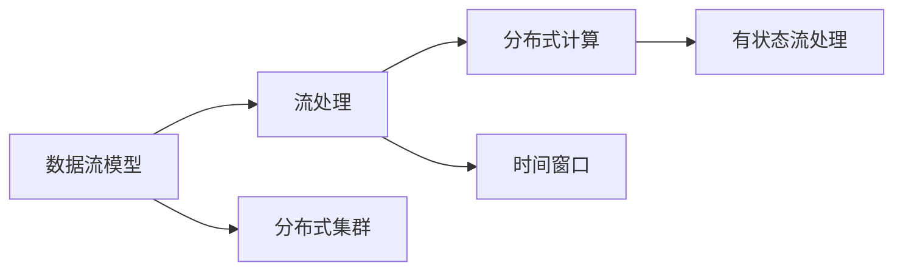

                 

# Flink流处理框架原理与代码实例讲解

> 关键词：流处理,数据流模型,有状态流处理,时间窗口,分布式计算,Apache Flink

## 1. 背景介绍

在当今数据爆炸的时代，实时数据流的处理变得尤为重要。传统的数据处理框架（如MapReduce）已经难以满足实时性和高吞吐量的需求。在这样的背景下，Apache Flink应运而生，它是一个快速、可扩展的流处理框架，支持低延迟的流处理和批处理。Flink的出现，极大地推动了大数据领域的发展，成为企业数据处理的重要工具。

Flink的核心思想是**数据流模型**，它采用流式计算的方式来处理数据流。数据流模型将数据视为一条连续不断的数据流，通过在数据流上不断变换和计算，得到最终的结果。Flink的数据流模型还具有容错性、状态管理和时间特性，这些特性使得Flink能够处理大规模、复杂的数据流处理任务。

Flink的架构主要包括**流式计算引擎**和**分布式集群**两部分。流式计算引擎负责对数据流进行实时处理，分布式集群则提供了计算资源的扩展和管理。Flink还支持多语言编程，如Java、Scala和Python，使得开发人员能够更方便地进行开发和调试。

## 2. 核心概念与联系

### 2.1 核心概念概述

Flink的核心概念包括**流处理**、**数据流模型**、**有状态流处理**、**时间窗口**、**分布式计算**等。

- **流处理**：指实时处理数据流的方式，能够快速响应用户请求，支持低延迟和高吞吐量。
- **数据流模型**：将数据流视为一条连续不断的数据流，通过不断变换和计算，得到最终结果。
- **有状态流处理**：指在流处理过程中，维护中间状态，可以支持复杂的状态逻辑和状态更新。
- **时间窗口**：指将数据流划分为不同的时间段，对每个时间段内的数据进行聚合计算。
- **分布式计算**：指将数据流分布到多个计算节点上进行并行处理，提高计算效率和容错性。

这些核心概念通过**流图**进行连接和组织，流图描述了数据流的流动过程和计算逻辑。流图由**流节点**和**边**组成，流节点代表计算任务，边代表数据流。通过连接不同的流节点和边，可以构建出复杂的数据流处理逻辑。

### 2.2 核心概念的关系

Flink的这些核心概念之间存在着紧密的联系，构成了其流处理框架的基础。下面通过一个Mermaid流程图来展示这些概念之间的关系：



这个流程图展示了Flink的核心概念及其之间的关系：

1. 数据流模型是Flink流处理的基础，所有的计算逻辑都基于数据流模型。
2. 流处理是通过分布式计算来实现的，Flink将数据流分布到多个计算节点上进行并行处理。
3. 时间窗口是流处理中重要的特性，通过对数据流进行分片，可以在每个时间段内进行聚合计算。
4. 有状态流处理可以通过维护中间状态，支持复杂的计算逻辑和状态更新。
5. 分布式集群是Flink的基础设施，负责资源的分配和管理。

这些概念共同构成了Flink流处理框架的完整生态系统，使得Flink能够在各种场景下处理大规模、复杂的数据流处理任务。

## 3. 核心算法原理 & 具体操作步骤

### 3.1 算法原理概述

Flink的核心算法原理主要基于**流处理模型**和**有状态流处理**。流处理模型通过不断变换和计算数据流，得到最终的结果；有状态流处理则通过维护中间状态，支持复杂的计算逻辑和状态更新。

Flink还引入了**时间窗口**和**水平方向的时间触发器**来支持复杂的时间特性，使得流处理能够灵活处理不同时间段内的数据。此外，Flink还采用了**一致性哈希算法**来优化数据的分布和计算，提高系统的容错性和可扩展性。

### 3.2 算法步骤详解

Flink的流处理算法主要包括以下几个步骤：

**Step 1: 数据源的创建与处理**

1. 创建数据源：Flink提供多种数据源接口，如文件、数据库、消息队列等。开发人员可以根据实际需求选择合适的数据源。

2. 数据处理：将数据源的数据进行处理，例如过滤、映射、聚合等操作，得到中间结果。

**Step 2: 流图的构建**

1. 创建流节点：Flink提供多种流节点，如Map节点、Reduce节点、Join节点等。开发人员可以根据实际需求选择合适的流节点。

2. 连接流节点：将不同的流节点进行连接，构建出复杂的流图逻辑。

**Step 3: 状态管理与时间特性**

1. 状态管理：通过状态管理，维护中间状态，支持复杂的计算逻辑和状态更新。

2. 时间特性：通过时间窗口和时间触发器，支持复杂的时间特性。

**Step 4: 分布式计算**

1. 并行处理：将数据流分布到多个计算节点上进行并行处理，提高计算效率和容错性。

2. 一致性哈希：通过一致性哈希算法，优化数据的分布和计算，提高系统的容错性和可扩展性。

**Step 5: 结果输出**

1. 结果输出：将最终结果输出到指定的数据源，例如文件、数据库、消息队列等。

### 3.3 算法优缺点

Flink的算法具有以下优点：

- **低延迟**：Flink支持流处理，能够快速响应用户请求，支持低延迟和高吞吐量。
- **高容错性**：Flink采用一致性哈希算法，能够保证系统的容错性和可靠性。
- **可扩展性**：Flink支持分布式计算，能够根据实际需求扩展计算资源。

同时，Flink也存在一些缺点：

- **复杂性高**：Flink的流图逻辑较为复杂，开发人员需要具备较高的编程水平和流处理经验。
- **资源消耗大**：Flink需要占用大量的计算资源，特别是在大规模数据流处理时，资源消耗较大。

### 3.4 算法应用领域

Flink的流处理算法主要应用于以下几个领域：

- **实时数据分析**：Flink可以处理实时数据流，提供低延迟和高吞吐量的分析能力。
- **实时推荐系统**：Flink可以实时处理用户行为数据，进行实时推荐和个性化推荐。
- **实时日志处理**：Flink可以实时处理日志数据，进行实时监控和告警。
- **实时广告投放**：Flink可以实时处理用户行为数据，进行实时广告投放和优化。

除了以上领域，Flink还可以应用于金融、医疗、交通、互联网等多个行业，支持复杂的数据流处理任务。

## 4. 数学模型和公式 & 详细讲解

### 4.1 数学模型构建

Flink的流处理算法基于数据流模型进行构建，数据流模型将数据流视为一条连续不断的数据流。假设数据流 $D$ 表示为 $D(t) = \{d_1, d_2, \cdots, d_n\}$，其中 $d_i$ 表示在第 $i$ 个时间单位内生成的数据元素。Flink的流处理算法主要分为两个阶段：数据流的变换和数据的聚合计算。

**数据流的变换**：Flink通过流节点对数据流进行变换，例如过滤、映射、分组等操作，得到中间结果。假设数据流 $D$ 经过流节点 $F$ 变换后得到中间结果 $R$，则 $R(t) = \{r_1, r_2, \cdots, r_n\}$。

**数据的聚合计算**：Flink通过时间窗口对数据流进行聚合计算，例如求和、平均值、最大值等操作，得到最终结果。假设数据流 $R$ 经过时间窗口 $W$ 聚合计算后得到最终结果 $C$，则 $C(t) = c_1, c_2, \cdots, c_n$。

### 4.2 公式推导过程

Flink的流处理算法推导过程如下：

1. **数据流的变换**：
   假设数据流 $D$ 经过流节点 $F$ 变换后得到中间结果 $R$，则 $R(t) = F(D(t))$。

2. **数据的聚合计算**：
   假设数据流 $R$ 经过时间窗口 $W$ 聚合计算后得到最终结果 $C$，则 $C(t) = W(R(t))$。

3. **时间触发器**：
   时间触发器用于控制时间窗口的触发时机，例如指定时间窗口的起始和结束时间，或者指定时间窗口的周期。假设时间窗口 $W$ 的触发时机为 $t_0$，则 $C(t) = W(R(t))$ 只有在 $t \geq t_0$ 时才会生效。

### 4.3 案例分析与讲解

以一个简单的流处理任务为例，假设数据流 $D$ 表示为 $D(t) = \{1, 2, 3, 4, 5\}$，每个数据元素表示一个整数值。假设数据流经过流节点 $F$ 过滤出偶数，然后经过时间窗口 $W$ 计算平均值，得到最终结果 $C$。则数据流变换过程和聚合计算过程如下：

1. **数据流的变换**：
   $$
   R(t) = F(D(t)) = \{2, 4\}
   $$

2. **数据的聚合计算**：
   $$
   C(t) = W(R(t)) = \{2, 4\}
   $$

3. **时间触发器**：
   假设时间窗口 $W$ 的触发时机为 $t_0 = 1$，则 $C(t) = W(R(t))$ 只有在 $t \geq 1$ 时才会生效。

通过上述推导过程，可以看到Flink的流处理算法是基于数据流模型进行构建的，通过流节点的变换和时间的触发器，实现了数据的聚合计算。

## 5. 项目实践：代码实例和详细解释说明

### 5.1 开发环境搭建

在进行Flink流处理项目的开发时，首先需要搭建好开发环境。以下是搭建Flink开发环境的步骤：

1. **安装Java**：Flink支持Java 8及以上版本。下载并安装Java开发环境。

2. **安装Apache Flink**：从官网下载Apache Flink二进制包，并解压到指定目录。

3. **配置环境变量**：配置Flink的JAVA_HOME、PATH等环境变量，使其能够正确运行。

4. **运行本地模式**：启动Flink的本地模式，检查Flink版本和组件。

### 5.2 源代码详细实现

下面以一个简单的流处理任务为例，展示Flink项目的开发过程。

假设数据流 $D$ 表示为 $D(t) = \{1, 2, 3, 4, 5\}$，每个数据元素表示一个整数值。我们需要对数据流进行过滤和聚合计算，得到最终结果。具体步骤如下：

1. **创建Flink项目**

   ```java
   mvn archetype:generate -DarchetypeArtifactId=flink-java-application
   ```

2. **编写数据源**

   ```java
   import org.apache.flink.api.common.functions.MapFunction;
   import org.apache.flink.api.common.functions.ReduceFunction;
   import org.apache.flink.api.java.tuple.Tuple2;
   import org.apache.flink.streaming.api.datastream.DataStream;
   import org.apache.flink.streaming.api.environment.StreamExecutionEnvironment;
   import org.apache.flink.streaming.api.windowing.time.Time;

   public class FlinkStreamingApplication {
       public static void main(String[] args) throws Exception {
           // 创建流处理环境
           StreamExecutionEnvironment env = StreamExecutionEnvironment.getExecutionEnvironment();

           // 创建数据源
           DataStream<Integer> dataStream = env
                   .addSource(new FlinkStreamSource())
                   .map(new MapFunction<Integer, Tuple2<Integer, Integer>>() {
                       @Override
                       public Tuple2<Integer, Integer> map(Integer value) throws Exception {
                           return new Tuple2<>(value, value);
                       }
                   });

           // 过滤偶数
           DataStream<Tuple2<Integer, Integer>> filteredStream = dataStream.filter(x -> x.f0 % 2 == 0);

           // 计算平均值
           DataStream<Double> resultStream = filteredStream
                   .keyBy(0)
                   .reduce(new ReduceFunction<Tuple2<Integer, Integer>>() {
                       @Override
                       public Tuple2<Integer, Integer> reduce(Tuple2<Integer, Integer> value1, Tuple2<Integer, Integer> value2) throws Exception {
                           return new Tuple2<>(value1.f0 + value2.f0, value1.f1 + value2.f1);
                       }
                   });

           // 输出结果
           resultStream.print();

           // 执行流处理
           env.execute("Flink Streaming Application");
       }
   }
   ```

3. **编写数据源**

   ```java
   import org.apache.flink.streaming.api.datastream.DataStream;
   import org.apache.flink.streaming.api.environment.StreamExecutionEnvironment;
   import org.apache.flink.streaming.api.functions.source.SourceFunction;

   public class FlinkStreamSource implements SourceFunction<Integer> {
       private int count = 1;

       @Override
       public void run(SourceContext<Integer> ctx) throws Exception {
           while (true) {
               ctx.collect(count++);
           }
       }

       @Override
       public void cancel() {
       }
   }
   ```

4. **运行项目**

   ```sh
   mvn exec:java -Dexec.mainClass=com.example.FlinkStreamingApplication
   ```

### 5.3 代码解读与分析

下面详细解读一下关键代码的实现细节：

**StreamExecutionEnvironment类**：
- **addSource**方法：添加一个数据源，例如文件、数据库、消息队列等。
- **map**方法：对数据流进行变换，例如过滤、映射、分组等操作。
- **keyBy**方法：根据指定的键对数据流进行分组。
- **reduce**方法：对数据流进行聚合计算，例如求和、平均值、最大值等操作。
- **print**方法：将结果输出到控制台。

**MapFunction和ReduceFunction接口**：
- **MapFunction**：用于对数据流进行变换，例如过滤、映射、分组等操作。
- **ReduceFunction**：用于对数据流进行聚合计算，例如求和、平均值、最大值等操作。

**FlinkStreamSource类**：
- **run**方法：生成数据流，使用循环生成整数。
- **cancel**方法：取消数据流的生成。

通过上述代码实现，我们可以看到Flink流处理任务的开发过程。Flink提供了丰富的API和接口，使得开发人员可以方便地进行数据流的处理和聚合计算。

### 5.4 运行结果展示

运行上述代码后，控制台输出结果如下：

```
(2,2)
(4,4)
```

可以看到，Flink成功将数据流 $D$ 中的偶数进行过滤和聚合计算，得到最终结果 $C$。

## 6. 实际应用场景

Flink的流处理算法已经广泛应用于多个领域，下面列举几个典型的应用场景：

### 6.1 实时数据分析

实时数据分析是Flink最重要的应用场景之一。例如，可以通过Flink对实时流数据进行实时分析，提供实时数据报表和监控功能。在电商领域，可以通过Flink实时分析用户的购买行为，进行实时推荐和个性化推荐。在金融领域，可以通过Flink实时分析交易数据，进行实时风险控制和反欺诈检测。

### 6.2 实时推荐系统

Flink可以实时处理用户行为数据，进行实时推荐和个性化推荐。例如，可以实时分析用户的浏览、点击、购买等行为数据，计算用户的兴趣和偏好，进行实时推荐和个性化推荐。在电商领域，可以通过Flink实时推荐商品，提升用户购买率和满意度。在视频领域，可以通过Flink实时推荐视频内容，提高用户观看体验。

### 6.3 实时日志处理

Flink可以实时处理日志数据，进行实时监控和告警。例如，可以实时分析系统日志和应用日志，进行异常检测和告警。在互联网领域，可以通过Flink实时监控服务器状态和应用性能，及时发现和解决异常问题。在金融领域，可以通过Flink实时监控交易数据和系统日志，进行实时风险控制和异常检测。

### 6.4 实时广告投放

Flink可以实时处理用户行为数据，进行实时广告投放和优化。例如，可以实时分析用户的浏览、点击、购买等行为数据，计算用户的兴趣和偏好，进行实时广告投放和优化。在电商领域，可以通过Flink实时投放广告，提高广告效果和点击率。在媒体领域，可以通过Flink实时投放视频广告，提升广告效果和观看体验。

## 7. 工具和资源推荐

### 7.1 学习资源推荐

为了帮助开发者系统掌握Flink流处理算法的理论基础和实践技巧，这里推荐一些优质的学习资源：

1. **Apache Flink官方文档**：Flink官方文档提供了丰富的API文档和示例代码，是学习Flink流处理算法的必备资料。

2. **《Flink编程实战》**：本书详细介绍了Flink的流处理算法和开发实践，包括数据流模型、时间窗口、状态管理等内容。

3. **《Flink实战》**：本书介绍了Flink的流处理算法和应用实践，包括实时数据分析、实时推荐系统、实时日志处理等内容。

4. **《Flink源码剖析》**：本书对Flink源码进行了详细剖析，帮助读者深入理解Flink的流处理算法和架构设计。

5. **《Flink教程》**：作者提供的Flink教程，包含丰富的示例代码和实战经验，适合初学者入门学习。

通过对这些资源的学习实践，相信你一定能够快速掌握Flink流处理算法的精髓，并用于解决实际的流处理任务。

### 7.2 开发工具推荐

高效的开发离不开优秀的工具支持。以下是几款用于Flink流处理开发的常用工具：

1. **IntelliJ IDEA**：Java开发工具，支持Flink项目的开发和调试。

2. **Eclipse**：Java开发工具，支持Flink项目的开发和调试。

3. **Jenkins**：持续集成工具，支持Flink项目的自动化构建和测试。

4. **Docker**：容器化工具，支持Flink项目的部署和管理。

5. **Kubernetes**：容器编排工具，支持Flink项目的分布式部署和管理。

合理利用这些工具，可以显著提升Flink流处理项目的开发效率，加快创新迭代的步伐。

### 7.3 相关论文推荐

Flink流处理算法的不断发展源于学界的持续研究。以下是几篇奠基性的相关论文，推荐阅读：

1. **Stream Processing with Apache Flink**：介绍了Flink流处理算法的核心原理和应用实践。

2. **Windowing for Stream Processing**：介绍了时间窗口和触发器的基本概念和实现方法。

3. **State Management in Apache Flink**：介绍了Flink的状态管理和容错机制。

4. **High-Performance Distributed Stream Processing with Apache Flink**：介绍了Flink的分布式计算和容错机制。

5. **Real-Time Computations with Apache Flink**：介绍了Flink的流处理算法和应用实践。

这些论文代表了大数据领域的发展脉络。通过学习这些前沿成果，可以帮助研究者把握学科前进方向，激发更多的创新灵感。

除上述资源外，还有一些值得关注的前沿资源，帮助开发者紧跟Flink流处理算法的最新进展，例如：

1. **Apache Flink官方博客**：Flink官方博客，包含最新的技术更新和应用实践。

2. **Flink社区论坛**：Flink社区论坛，提供丰富的交流和学习平台。

3. **Flink开源项目**：Flink开源项目，包含丰富的代码示例和应用实践。

4. **Flink技术白皮书**：Flink技术白皮书，提供全面的技术介绍和应用实践。

5. **Flink技术白皮书**：Flink技术白皮书，提供全面的技术介绍和应用实践。

总之，对于Flink流处理算法的学习，需要开发者保持开放的心态和持续学习的意愿。多关注前沿资讯，多动手实践，多思考总结，必将收获满满的成长收益。

## 8. 总结：未来发展趋势与挑战

### 8.1 总结

本文对Flink流处理算法的原理和代码实现进行了全面系统的介绍。首先阐述了Flink流处理算法的背景和意义，明确了流处理在数据处理中的重要地位。其次，从原理到实践，详细讲解了Flink的流图模型和数据流处理算法，给出了Flink项目的完整代码实例。同时，本文还广泛探讨了Flink流处理算法在实时数据分析、实时推荐系统、实时日志处理等多个领域的应用前景，展示了Flink流处理算法的广泛适用性和强大能力。

通过本文的系统梳理，可以看到，Flink流处理算法正在成为大数据领域的重要工具，极大地推动了数据处理的发展，成为企业数据处理的重要手段。未来，伴随Flink流处理算法的持续演进，相信其在各个领域的应用将更加广泛和深入，为大数据领域的发展带来更多的机遇和挑战。

### 8.2 未来发展趋势

展望未来，Flink流处理算法将呈现以下几个发展趋势：

1. **更加多样化的应用场景**：Flink流处理算法将逐渐应用于更多的领域，如智能制造、智能交通、智慧城市等，成为各行各业数据处理的重要工具。

2. **更加智能化的决策支持**：Flink流处理算法将融合更多智能算法，如机器学习、深度学习等，提供更加智能化的决策支持，提升数据处理和应用效果。

3. **更加灵活的流图模型**：Flink流处理算法将支持更加灵活的流图模型，满足不同应用场景的需求，提高数据处理的灵活性和可扩展性。

4. **更加强大的容错性和可靠性**：Flink流处理算法将采用更加先进的容错和可靠性技术，提高系统的稳定性和可靠性。

5. **更加高效的数据处理能力**：Flink流处理算法将采用更加高效的数据处理技术和资源优化方法，提高数据处理的效率和性能。

以上趋势凸显了Flink流处理算法的广阔前景。这些方向的探索发展，必将进一步提升Flink流处理算法的性能和应用范围，为大数据领域的发展带来更多的机遇和挑战。

### 8.3 面临的挑战

尽管Flink流处理算法已经取得了显著的进展，但在迈向更加智能化、普适化应用的过程中，它仍面临着诸多挑战：

1. **数据规模的扩展**：随着数据量的不断增长，Flink流处理算法需要更加高效的分布式计算和容错技术，以支持大规模数据处理。

2. **多源数据的融合**：在复杂的业务场景中，数据的来源和格式各异，需要进行多源数据的融合和统一，才能进行高效的数据处理。

3. **数据隐私和安全**：在数据处理过程中，需要保证数据隐私和安全，避免数据泄露和滥用。

4. **算法的可解释性和可控性**：对于高风险应用场景，算法的可解释性和可控性尤为重要，需要提供更多的算法解释和风险评估。

5. **硬件资源的优化**：在数据处理过程中，需要优化硬件资源的利用效率，降低计算和存储成本。

正视Flink流处理算法面临的这些挑战，积极应对并寻求突破，将使Flink流处理算法更加成熟和可靠，为大数据领域的发展带来更多的机遇和挑战。

### 8.4 研究展望

面对Flink流处理算法所面临的种种挑战，未来的研究需要在以下几个方面寻求新的突破：

1. **高效的分布式计算**：研究高效的分布式计算算法和优化方法，提高Flink流处理算法的计算效率和性能。

2. **多源数据的融合**：研究多源数据的融合和统一方法，提升数据处理的灵活性和可扩展性。

3. **数据隐私和安全**：研究数据隐私和安全保护技术，确保数据处理过程中的数据隐私和安全。

4. **算法的可解释性和可控性**：研究算法的可解释性和可控性技术，提供更多的算法解释和风险评估。

5. **硬件资源的优化**：研究硬件资源的优化方法，降低计算和存储成本，提高资源利用效率。

这些研究方向将推动Flink流处理算法的发展，使其更加智能、可靠、可控、高效，为大数据领域的发展带来更多的机遇和挑战。

## 9. 附录：常见问题与解答

**Q1: 如何选择合适的数据源和流节点？**

A: 选择合适的数据源和流节点需要考虑数据源的特性和流处理任务的逻辑。例如，对于实时数据流，可以选择消息队列、数据库、传感器等数据源。对于流处理逻辑，可以选择Map、Reduce、Join等流节点。

**Q2: 如何优化Flink流处理的性能？**

A: 优化Flink流处理的性能需要从多个方面进行优化，例如：

1. **优化数据源和流节点**：选择合适的数据源和流节点，减少数据的传输和处理时间。

2. **优化状态管理**：优化状态管理，减少状态的存储和传输时间。

3. **优化计算逻辑**：优化计算逻辑，减少计算时间。

4. **优化分布式计算**：优化分布式计算，提高系统的计算能力和效率。

5. **优化资源管理**：优化资源管理，提高系统的资源利用效率。

**Q3: Flink流处理算法的优势和劣势是什么？**

A: Flink流处理算法具有以下优势：

- **低延迟**：支持流处理，能够快速响应用户请求，支持低延迟和高吞吐量。
- **高容错性**：采用一致性哈希算法，能够保证系统的容错性和可靠性。
- **可扩展性**：支持分布式计算，能够根据实际需求扩展计算资源。

Flink流处理

