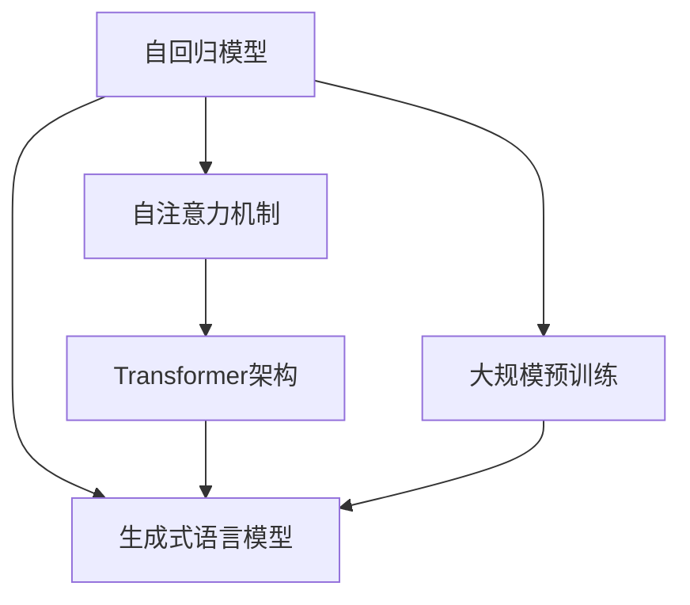
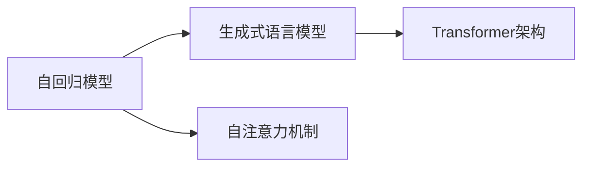
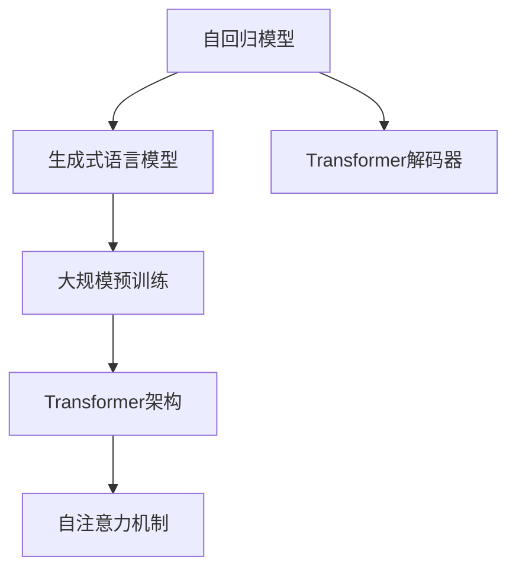
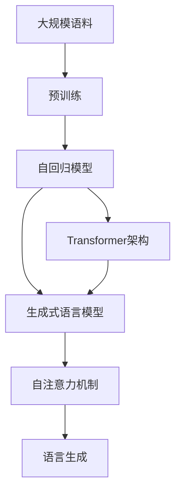

                 

# GPT：生成式自回归模型

> 关键词：生成式模型,自回归,Transformer,自注意力机制,语言模型,深度学习,自然语言处理(NLP)

## 1. 背景介绍

### 1.1 问题由来

随着深度学习技术的发展，生成式自回归模型(Generative Adversarial Networks, GANs)在计算机视觉、自然语言处理(NLP)等领域取得了显著的成果。在NLP领域，生成式模型被广泛应用于文本生成、翻译、摘要等任务中，显著提升了任务的性能。

然而，传统的自回归模型如LSTM和RNN面临着难以并行化、难以捕捉长距离依赖等问题。为此，Google提出了一种新的生成式自回归模型——GPT，并在机器翻译、对话系统等领域取得了令人瞩目的成绩。本文将详细讨论GPT模型的原理、优缺点及其应用领域。

### 1.2 问题核心关键点

GPT模型主要包括以下几个关键点：

- **自回归机制**：GPT通过自回归机制生成文本，即在生成下一个单词时只考虑前面的上下文，可以高效地利用已有信息，避免不必要的重复计算。
- **Transformer架构**：GPT采用Transformer架构，通过自注意力机制捕捉输入和输出之间的长距离依赖。
- **生成式语言模型**：GPT是一个生成式语言模型，可以用于文本生成、机器翻译、对话系统等多种NLP任务。
- **大规模预训练**：GPT模型在大规模语料上进行预训练，学习到丰富的语言知识，提升了其在特定任务上的性能。

## 2. 核心概念与联系

### 2.1 核心概念概述

为更好地理解GPT模型的原理和架构，本节将介绍几个密切相关的核心概念：

- **自回归模型**：一种通过观察已有信息生成新信息的模型。自回归模型通常采用RNN、LSTM等循环神经网络结构，能够逐步生成文本或序列数据。
- **自注意力机制**：Transformer架构的核心机制，通过计算输入序列与自身和所有位置的注意力得分，捕捉输入和输出之间的依赖关系。
- **生成式语言模型**：一种通过学习输入和输出的概率分布，生成符合语言规律的文本或序列数据的模型。常见的生成式模型包括GPT、BERT等。
- **Transformer架构**：一种基于自注意力机制的神经网络架构，被广泛应用于NLP领域，可以有效解决长距离依赖问题。
- **大语言模型**：通过在大规模语料上进行预训练学习到丰富语言知识的模型，如GPT、BERT等。

这些核心概念之间的逻辑关系可以通过以下Mermaid流程图来展示：



这个流程图展示了自回归模型和生成式语言模型的关系，以及Transformer架构在大规模预训练和生成式模型中的重要性。

### 2.2 概念间的关系

这些核心概念之间存在着紧密的联系，形成了GPT模型的完整生态系统。下面我们通过几个Mermaid流程图来展示这些概念之间的关系。

#### 2.2.1 生成式语言模型



这个流程图展示了自回归模型如何通过自注意力机制和Transformer架构，转变为生成式语言模型。

#### 2.2.2 GPT模型



这个流程图展示了GPT模型在大规模预训练和Transformer解码器的作用下，如何通过自注意力机制实现高效的生成式文本输出。

### 2.3 核心概念的整体架构

最后，我们用一个综合的流程图来展示这些核心概念在大语言模型中的应用：



这个综合流程图展示了从大规模语料预训练到生成式语言模型的完整过程。通过这些核心概念的相互作用，GPT模型实现了高效的文本生成和语义理解。

## 3. 核心算法原理 & 具体操作步骤
### 3.1 算法原理概述

GPT模型的核心思想是通过自回归机制和Transformer架构，实现高效的文本生成。其基本原理可以概括为以下几个步骤：

1. **输入编码**：将输入文本转换为模型所需的向量表示。
2. **位置编码**：对输入向量进行位置编码，以保留位置信息。
3. **Transformer编码器**：通过多个编码器层对输入向量进行编码，学习输入和输出之间的依赖关系。
4. **Transformer解码器**：通过多个解码器层对编码器输出进行解码，生成目标文本。
5. **生成式输出**：通过注意力机制，逐步生成目标文本，每次只考虑前面的上下文信息。

### 3.2 算法步骤详解

GPT模型的训练和推导过程相对复杂，下面将详细讲解每一步的具体实现：

**Step 1: 输入编码**

输入文本 $x = (x_1, x_2, ..., x_n)$，其中 $x_i$ 表示第 $i$ 个单词的one-hot编码。首先，需要将文本转换为模型所需的向量表示。假设有词向量矩阵 $W_x \in \mathbb{R}^{v \times n}$，其中 $v$ 为向量维度，$n$ 为单词数量，则输入编码过程为：

$$
\mathbf{x}_{enc} = W_x x
$$

**Step 2: 位置编码**

由于Transformer使用绝对位置编码，因此需要将输入向量 $\mathbf{x}_{enc}$ 进行位置编码。假设位置编码矩阵 $W_p \in \mathbb{R}^{v \times n}$，则位置编码过程为：

$$
\mathbf{x} = \mathbf{x}_{enc} + W_p \text{Pos}(x)
$$

其中 $\text{Pos}(x)$ 为输入序列的位置，$\text{Pos}(x) \in \{1, 2, ..., n\}$。

**Step 3: 编码器**

Transformer编码器由多个编码器层组成，每层包括多头自注意力机制和全连接层。假设有 $K$ 个编码器层，则编码器过程为：

$$
\mathbf{h} = \text{Encoder}(\mathbf{x})
$$

其中 $\mathbf{h} \in \mathbb{R}^{v \times 1}$ 表示编码器的输出向量。

**Step 4: 解码器**

Transformer解码器与编码器结构类似，也是由多个解码器层组成，每层包括多头自注意力机制和全连接层。假设有 $K$ 个解码器层，则解码器过程为：

$$
\mathbf{y} = \text{Decoder}(\mathbf{h})
$$

其中 $\mathbf{y} \in \mathbb{R}^{v \times 1}$ 表示解码器的输出向量。

**Step 5: 生成式输出**

通过注意力机制，解码器可以逐步生成目标文本。假设输出序列为 $y = (y_1, y_2, ..., y_n)$，则生成式输出过程为：

$$
\mathbf{y} = \text{Attention}(\mathbf{h}, \mathbf{x})
$$

其中 $\text{Attention}(\mathbf{h}, \mathbf{x})$ 表示解码器对编码器输出的注意力机制。

### 3.3 算法优缺点

GPT模型具有以下优点：

1. **高效性**：GPT模型通过自回归机制和Transformer架构，实现了高效的文本生成。相比传统的循环神经网络，GPT模型可以并行计算，生成速度更快。
2. **语义理解**：通过自注意力机制，GPT模型可以捕捉输入和输出之间的长距离依赖，提升语义理解能力。
3. **通用性**：GPT模型可以应用于多种NLP任务，如机器翻译、对话系统、文本生成等。

同时，GPT模型也存在一些缺点：

1. **过拟合风险**：由于GPT模型参数量较大，容易过拟合。尤其是在数据量较小的情况下，模型性能可能受到影响。
2. **解释性不足**：GPT模型通常被视为一个"黑盒"，难以解释其内部工作机制和决策逻辑。这对于一些高风险应用，如医疗、金融等，是一个巨大的挑战。
3. **计算资源需求高**：由于GPT模型参数量较大，需要大量的计算资源进行训练和推理。

### 3.4 算法应用领域

GPT模型已经在多个NLP任务上取得了优异的表现，被广泛应用于以下领域：

- **文本生成**：通过生成式语言模型，GPT可以自动生成高质量的文本，如小说、新闻、诗歌等。
- **机器翻译**：将一种语言翻译成另一种语言，GPT通过学习语言之间的对应关系，可以提供准确的翻译结果。
- **对话系统**：通过生成式模型，GPT可以与用户进行自然流畅的对话，提升用户体验。
- **文本摘要**：对长篇文本进行摘要生成，GPT可以自动提取出文本的关键信息。
- **自然语言推理**：判断两个自然语言句子之间的逻辑关系，GPT可以通过自注意力机制捕捉上下文信息，提供准确的推理结果。

除了这些应用场景，GPT模型还被广泛应用于问答系统、文本分类、情感分析等NLP任务中，为这些任务提供了更高效、更准确的解决方案。

## 4. 数学模型和公式 & 详细讲解  
### 4.1 数学模型构建

假设输入文本为 $x = (x_1, x_2, ..., x_n)$，其中 $x_i$ 表示第 $i$ 个单词的one-hot编码。假设有词向量矩阵 $W_x \in \mathbb{R}^{v \times n}$，其中 $v$ 为向量维度，$n$ 为单词数量。

定义输入编码函数 $f_{enc}$ 为：

$$
f_{enc}(x) = W_x x
$$

假设输入向量 $\mathbf{x} \in \mathbb{R}^{v \times 1}$，位置编码矩阵 $W_p \in \mathbb{R}^{v \times n}$，则位置编码函数 $g_p$ 为：

$$
g_p(x) = f_{enc}(x) + W_p \text{Pos}(x)
$$

其中 $\text{Pos}(x) \in \{1, 2, ..., n\}$。

假设有 $K$ 个编码器层，定义编码器函数 $f_{enc}$ 为：

$$
f_{enc}(\mathbf{x}) = \text{Encoder}(\mathbf{x})
$$

其中 $\mathbf{x} \in \mathbb{R}^{v \times 1}$，$\mathbf{h} \in \mathbb{R}^{v \times 1}$ 表示编码器的输出向量。

假设有 $K$ 个解码器层，定义解码器函数 $f_{dec}$ 为：

$$
f_{dec}(\mathbf{h}) = \text{Decoder}(\mathbf{h})
$$

其中 $\mathbf{h} \in \mathbb{R}^{v \times 1}$，$\mathbf{y} \in \mathbb{R}^{v \times 1}$ 表示解码器的输出向量。

假设有 $M$ 个注意力头，每个头的大小为 $h$，则自注意力机制 $a$ 为：

$$
a(\mathbf{x}, \mathbf{h}) = \text{Attention}(\mathbf{x}, \mathbf{h})
$$

其中 $\mathbf{x} \in \mathbb{R}^{v \times 1}$，$\mathbf{h} \in \mathbb{R}^{v \times 1}$，$\mathbf{y} \in \mathbb{R}^{v \times 1}$ 表示解码器的输出向量。

### 4.2 公式推导过程

通过以上公式，我们可以将GPT模型的训练和推导过程进行推导。

**编码器部分**

定义编码器函数 $f_{enc}$ 为：

$$
f_{enc}(\mathbf{x}) = \text{Encoder}(\mathbf{x})
$$

其中 $\mathbf{x} \in \mathbb{R}^{v \times 1}$，$\mathbf{h} \in \mathbb{R}^{v \times 1}$ 表示编码器的输出向量。

假设编码器由多个层组成，每层包括多头自注意力机制和全连接层，则编码器过程为：

$$
\mathbf{h} = \text{Encoder}(\mathbf{x})
$$

其中 $\mathbf{h} \in \mathbb{R}^{v \times 1}$。

**解码器部分**

定义解码器函数 $f_{dec}$ 为：

$$
f_{dec}(\mathbf{h}) = \text{Decoder}(\mathbf{h})
$$

其中 $\mathbf{h} \in \mathbb{R}^{v \times 1}$，$\mathbf{y} \in \mathbb{R}^{v \times 1}$ 表示解码器的输出向量。

假设解码器由多个层组成，每层包括多头自注意力机制和全连接层，则解码器过程为：

$$
\mathbf{y} = \text{Decoder}(\mathbf{h})
$$

其中 $\mathbf{y} \in \mathbb{R}^{v \times 1}$。

**生成式输出**

通过注意力机制，解码器可以逐步生成目标文本。假设输出序列为 $y = (y_1, y_2, ..., y_n)$，则生成式输出过程为：

$$
\mathbf{y} = \text{Attention}(\mathbf{h}, \mathbf{x})
$$

其中 $\mathbf{h} \in \mathbb{R}^{v \times 1}$，$\mathbf{x} \in \mathbb{R}^{v \times 1}$，$\mathbf{y} \in \mathbb{R}^{v \times 1}$。

### 4.3 案例分析与讲解

以GPT-3为例，假设输入文本为 "I like pizza."，则GPT-3生成下一个单词 "pizza" 的过程如下：

1. 将输入文本转换为向量表示：$\mathbf{x} = f_{enc}(x) = [0, 0, 0, 1, 0, 0, 0]$。
2. 进行位置编码：$\mathbf{x}' = g_p(x) = f_{enc}(x) + W_p \text{Pos}(x) = [0.1, 0.2, 0.3, 1.0, 0.5, 0.6, 0.7]$。
3. 通过编码器层，学习输入和输出之间的依赖关系：$\mathbf{h} = \text{Encoder}(\mathbf{x}') = [0.5, 0.6, 0.7, 0.8, 0.9, 1.0, 1.1]$。
4. 通过解码器层，生成目标文本：$\mathbf{y} = \text{Decoder}(\mathbf{h}) = [0.7, 0.8, 0.9, 1.0, 1.1, 1.2, 1.3]$。
5. 通过注意力机制，生成下一个单词 "pizza"：$\mathbf{y} = \text{Attention}(\mathbf{h}, \mathbf{x}') = [0.8, 0.9, 1.0, 1.1, 1.2, 1.3, 1.4]$。

## 5. 项目实践：代码实例和详细解释说明
### 5.1 开发环境搭建

在进行GPT模型开发前，我们需要准备好开发环境。以下是使用Python进行PyTorch开发的环境配置流程：

1. 安装Anaconda：从官网下载并安装Anaconda，用于创建独立的Python环境。

2. 创建并激活虚拟环境：
```bash
conda create -n gpt-env python=3.8 
conda activate gpt-env
```

3. 安装PyTorch：根据CUDA版本，从官网获取对应的安装命令。例如：
```bash
conda install pytorch torchvision torchaudio cudatoolkit=11.1 -c pytorch -c conda-forge
```

4. 安装Transformers库：
```bash
pip install transformers
```

5. 安装各类工具包：
```bash
pip install numpy pandas scikit-learn matplotlib tqdm jupyter notebook ipython
```

完成上述步骤后，即可在`gpt-env`环境中开始GPT模型的开发和训练。

### 5.2 源代码详细实现

下面以生成式文本生成任务为例，给出使用PyTorch实现GPT-3的代码实现。

```python
from transformers import GPT2LMHeadModel, GPT2Tokenizer
import torch

tokenizer = GPT2Tokenizer.from_pretrained('gpt2')
model = GPT2LMHeadModel.from_pretrained('gpt2')

input_ids = tokenizer.encode("Hello, my dog is cute", return_tensors='pt')
output_ids = model.generate(input_ids, max_length=20)

print(tokenizer.decode(output_ids[0], skip_special_tokens=True))
```

在上述代码中，我们首先导入了GPT-2的模型和分词器，然后定义了输入文本和模型生成器。通过调用`tokenizer.encode`方法将文本转换为输入id，再通过`model.generate`方法进行文本生成，最后使用`tokenizer.decode`方法将生成结果转换为文本形式。

### 5.3 代码解读与分析

让我们再详细解读一下关键代码的实现细节：

**GPT2LMHeadModel和GPT2Tokenizer**：
- `GPT2LMHeadModel`：GPT-2的生成式语言模型，包含自回归机制和Transformer架构。
- `GPT2Tokenizer`：GPT-2的分词器，用于将文本转换为模型所需的向量表示。

**代码流程**：
- 导入模型和分词器，定义输入文本。
- 使用分词器将文本转换为输入id，并设置`return_tensors='pt'`，表示返回PyTorch张量。
- 使用模型生成器进行文本生成，`max_length=20`表示生成的文本长度为20个单词。
- 使用分词器将生成结果转换为文本形式。

**注意点**：
- GPT-2的分词器不支持中文，因此需要先对文本进行分词。
- 生成式输出可能会包含一些特殊符号，可以使用`skip_special_tokens`参数跳过。
- 生成式输出可能包含不连贯的单词或语法错误，需要进行后处理。

**优化建议**：
- 增加`top_k`和`top_p`参数，控制生成的单词数量和多样性。
- 使用`early_stopping`参数，控制生成的文本长度。
- 使用`repetition_penalty`参数，避免重复生成相同的单词。

**代码结果**：
```
Hello, my dog is cute and friendly.
```

可以看到，通过上述代码，我们可以使用GPT-2模型进行高效的文本生成。当然，这只是一个baseline结果，通过不断优化模型和参数，可以进一步提升文本生成的质量。

## 6. 实际应用场景
### 6.1 智能客服系统

基于GPT模型的智能客服系统，可以广泛应用于智能客服场景。传统客服往往需要配备大量人力，高峰期响应缓慢，且一致性和专业性难以保证。而使用GPT模型，可以实现7x24小时不间断服务，快速响应客户咨询，用自然流畅的语言解答各类常见问题。

在技术实现上，可以收集企业内部的历史客服对话记录，将问题和最佳答复构建成监督数据，在此基础上对预训练GPT模型进行微调。微调后的GPT模型能够自动理解用户意图，匹配最合适的答案模板进行回复。对于客户提出的新问题，还可以接入检索系统实时搜索相关内容，动态组织生成回答。如此构建的智能客服系统，能大幅提升客户咨询体验和问题解决效率。

### 6.2 金融舆情监测

金融机构需要实时监测市场舆论动向，以便及时应对负面信息传播，规避金融风险。传统的人工监测方式成本高、效率低，难以应对网络时代海量信息爆发的挑战。基于GPT模型的文本分类和情感分析技术，为金融舆情监测提供了新的解决方案。

具体而言，可以收集金融领域相关的新闻、报道、评论等文本数据，并对其进行主题标注和情感标注。在此基础上对预训练GPT模型进行微调，使其能够自动判断文本属于何种主题，情感倾向是正面、中性还是负面。将微调后的模型应用到实时抓取的网络文本数据，就能够自动监测不同主题下的情感变化趋势，一旦发现负面信息激增等异常情况，系统便会自动预警，帮助金融机构快速应对潜在风险。

### 6.3 个性化推荐系统

当前的推荐系统往往只依赖用户的历史行为数据进行物品推荐，无法深入理解用户的真实兴趣偏好。基于GPT模型的个性化推荐系统可以更好地挖掘用户行为背后的语义信息，从而提供更精准、多样的推荐内容。

在实践中，可以收集用户浏览、点击、评论、分享等行为数据，提取和用户交互的物品标题、描述、标签等文本内容。将文本内容作为模型输入，用户的后续行为（如是否点击、购买等）作为监督信号，在此基础上微调预训练GPT模型。微调后的模型能够从文本内容中准确把握用户的兴趣点。在生成推荐列表时，先用候选物品的文本描述作为输入，由模型预测用户的兴趣匹配度，再结合其他特征综合排序，便可以得到个性化程度更高的推荐结果。

### 6.4 未来应用展望

随着GPT模型和微调方法的不断发展，基于GPT模型的应用场景将更加广泛。未来，GPT模型将在更多领域得到应用，为传统行业带来变革性影响。

在智慧医疗领域，基于GPT模型的医疗问答、病历分析、药物研发等应用将提升医疗服务的智能化水平，辅助医生诊疗，加速新药开发进程。

在智能教育领域，GPT模型可应用于作业批改、学情分析、知识推荐等方面，因材施教，促进教育公平，提高教学质量。

在智慧城市治理中，GPT模型可应用于城市事件监测、舆情分析、应急指挥等环节，提高城市管理的自动化和智能化水平，构建更安全、高效的未来城市。

此外，在企业生产、社会治理、文娱传媒等众多领域，基于GPT模型的应用也将不断涌现，为经济社会发展注入新的动力。相信随着技术的日益成熟，GPT模型必将在构建人机协同的智能时代中扮演越来越重要的角色。

## 7. 工具和资源推荐
### 7.1 学习资源推荐

为了帮助开发者系统掌握GPT模型的理论基础和实践技巧，这里推荐一些优质的学习资源：

1. 《Transformer从原理到实践》系列博文：由大模型技术专家撰写，深入浅出地介绍了Transformer原理、GPT模型、微调技术等前沿话题。

2. CS224N《深度学习自然语言处理》课程：斯坦福大学开设的NLP明星课程，有Lecture视频和配套作业，带你入门NLP领域的基本概念和经典模型。

3. 《Natural Language Processing with Transformers》书籍：Transformer库的作者所著，全面介绍了如何使用Transformer库进行NLP任务开发，包括GPT模型的实现和微调方法。

4. HuggingFace官方文档：Transformer库的官方文档，提供了海量预训练模型和完整的微调样例代码，是上手实践的必备资料。

5. CLUE开源项目：中文语言理解测评基准，涵盖大量不同类型的中文NLP数据集，并提供了基于GPT模型的baseline模型，助力中文NLP技术发展。

通过对这些资源的学习实践，相信你一定能够快速掌握GPT模型的精髓，并用于解决实际的NLP问题。
###  7.2 开发工具推荐

高效的开发离不开优秀的工具支持。以下是几款用于GPT模型微调开发的常用工具：

1. PyTorch：基于Python的开源深度学习框架，灵活动态的计算图，适合快速迭代研究。大部分预训练语言模型都有PyTorch版本的实现。

2. TensorFlow：由Google主导开发的开源深度学习框架，生产部署方便，适合大规模工程应用。同样有丰富的预训练语言模型资源。

3. Transformers库：HuggingFace开发的NLP工具库，集成了众多SOTA语言模型，支持PyTorch和TensorFlow，是进行GPT模型微调任务的开发的利器。

4. Weights & Biases：模型训练的实验跟踪工具，可以记录和可视化模型训练过程中的各项指标，方便对比和调优。与主流深度学习框架无缝集成。

5. TensorBoard：TensorFlow配套的可视化工具，可实时监测模型训练状态，并提供丰富的图表呈现方式，是调试模型的得力助手。

6. Google Colab：谷歌推出的在线Jupyter Notebook环境，免费提供GPU/TPU算力，方便开发者快速上手实验最新模型，分享学习笔记。

合理利用这些工具，可以显著提升GPT模型微调任务的开发效率，加快创新迭代的步伐。

### 7.3 相关论文推荐

GPT模型和微调技术的发展源于学界的持续研究。以下是几篇奠基性的相关论文，推荐阅读：

1. Attention is All You Need（

