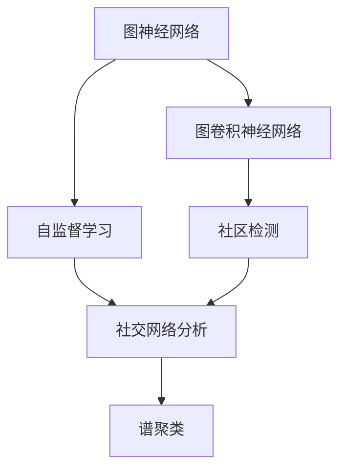
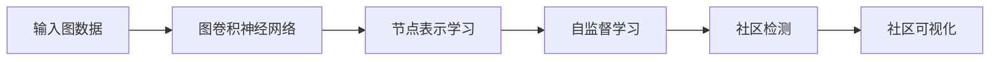
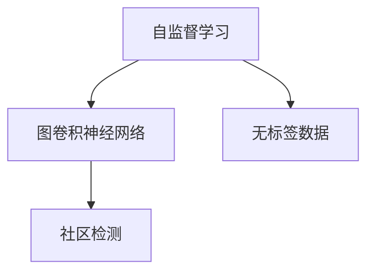
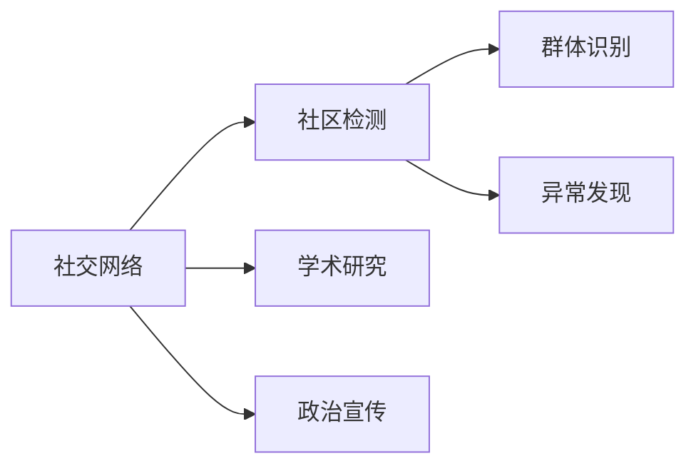
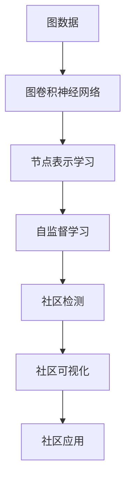

                 

# Graph Community Detection算法原理与代码实例讲解

> 关键词：Graph Neural Network, Graph Convolutional Network (GCN), Community Detection, Self-Supervised Learning, Social Network Analysis

## 1. 背景介绍

### 1.1 问题由来
社交网络在现代社会中扮演着越来越重要的角色，从社交媒体到职业网络，从学术研究到政治宣传，社交网络无处不在。然而，由于网络节点和边的数量巨大，如何有效地分析这些网络数据成为了一大挑战。社区检测（Community Detection）是社交网络分析中的一个重要问题，旨在发现网络中的社区，这些社区通常由关系紧密的节点组成，并且与网络中其他社区相对独立。社区检测可以帮助我们理解网络结构、识别潜在群组、发现网络中的异常等。

社区检测的问题可以追溯到20世纪90年代，当时图论和网络分析领域的学者开始关注如何将图分解成独立的社区。自那时以来，社区检测成为了一个热门的研究领域，吸引了众多学者和研究人员。近年来，随着深度学习技术的兴起，利用图神经网络（Graph Neural Networks, GNNs）来进行社区检测成为了一个热门的研究方向。

### 1.2 问题核心关键点
社区检测的核心思想是将网络中的节点分成若干个社区，使得同一社区内的节点之间有更强的连接关系，而不同社区之间的连接关系相对较弱。这可以通过一系列的算法实现，如模块度优化、谱聚类、图卷积神经网络等。其中，基于图卷积神经网络的社区检测方法，尤其是基于自监督学习的GCN（Graph Convolutional Network），近年来受到了广泛关注。

GCN方法的核心思想是通过卷积操作，在节点特征和邻接矩阵的基础上，学习到节点之间的特征表示。这种表示能够捕捉节点之间的相似性，从而使得同一社区内的节点特征更为相似，不同社区之间的节点特征更为不同。这种方法既具有较高的准确性，又能够处理大规模网络数据，因此成为了社区检测领域的一个重要方向。

### 1.3 问题研究意义
社区检测算法的研究意义在于：

1. **提高社交网络分析的效率和准确性**：通过自动发现社区，可以大幅减少人工分析的工作量，并且能够提供更准确的网络结构分析。
2. **增强社区内节点的关系紧密性**：社区检测可以帮助我们识别网络中关系紧密的节点，从而更好地理解网络中的群组结构。
3. **发现网络中的异常和关键节点**：社区检测能够发现网络中的异常节点和关键节点，这些节点可能对网络的结构和功能有着重要的影响。
4. **支持多领域的应用**：社区检测方法可以应用于社交网络、生物网络、交通网络等多个领域，具有广泛的应用前景。

## 2. 核心概念与联系

### 2.1 核心概念概述

为更好地理解基于图卷积神经网络的社区检测方法，本节将介绍几个密切相关的核心概念：

- **图神经网络（GNNs）**：一类利用图结构进行深度学习的模型，能够处理非欧几里得空间中的数据，如社交网络、分子网络等。
- **图卷积神经网络（GCNs）**：一种常见的GNNs，通过卷积操作，在节点特征和邻接矩阵的基础上学习节点表示，适用于社区检测等图结构任务。
- **自监督学习（Self-Supervised Learning）**：一种通过无标签数据进行模型训练的方法，在社区检测中，可以利用图结构本身的性质进行自监督学习，避免对标注数据的依赖。
- **社交网络分析（Social Network Analysis）**：分析社交网络中节点和边之间的关系，以发现网络中的社区、群体、影响力等结构。
- **谱聚类（Spectral Clustering）**：一种基于图谱分解的聚类方法，可以用于社区检测。

这些核心概念之间的逻辑关系可以通过以下Mermaid流程图来展示：



这个流程图展示了大语言模型微调过程中各个核心概念的关系和作用：

1. 图神经网络通过卷积操作，在节点特征和邻接矩阵的基础上学习节点表示。
2. 图卷积神经网络是一种常见的图神经网络，通过卷积操作学习节点表示，适用于社区检测等图结构任务。
3. 自监督学习利用图结构本身的性质进行训练，避免对标注数据的依赖。
4. 社交网络分析分析节点和边之间的关系，以发现网络中的社区、群体、影响力等结构。
5. 谱聚类是一种基于图谱分解的聚类方法，可以用于社区检测。

### 2.2 概念间的关系

这些核心概念之间存在着紧密的联系，形成了社区检测的完整生态系统。下面我通过几个Mermaid流程图来展示这些概念之间的关系。

#### 2.2.1 社区检测的流程



这个流程图展示了社区检测的基本流程：

1. 输入图数据。
2. 使用图卷积神经网络学习节点表示。
3. 通过自监督学习进行模型训练。
4. 基于学习到的节点表示进行社区检测。
5. 可视化社区结构。

#### 2.2.2 自监督学习在社区检测中的作用



这个流程图展示了自监督学习在社区检测中的作用：

1. 使用无标签数据进行自监督学习。
2. 利用自监督学习得到的节点表示进行社区检测。

#### 2.2.3 社区检测的应用场景



这个流程图展示了社区检测在多个领域的应用场景：

1. 社交网络。社区检测可以发现网络中的群体结构。
2. 学术研究。社区检测可以用于学术网络中研究团队的识别。
3. 政治宣传。社区检测可以用于识别政治宣传网络中的关键节点。
4. 群体识别。社区检测可以发现网络中的群体。
5. 异常发现。社区检测可以发现网络中的异常节点。

### 2.3 核心概念的整体架构

最后，我们用一个综合的流程图来展示这些核心概念在大语言模型微调过程中的整体架构：



这个综合流程图展示了从图数据输入到社区检测结果可视化的完整过程。大语言模型微调方法通过图卷积神经网络学习节点表示，利用自监督学习进行模型训练，并基于学习到的节点表示进行社区检测，最后可视化社区结构，并将其应用于实际应用场景。

## 3. 核心算法原理 & 具体操作步骤
### 3.1 算法原理概述

基于图卷积神经网络的社区检测方法，其核心思想是通过卷积操作，在节点特征和邻接矩阵的基础上学习节点表示。这种表示能够捕捉节点之间的相似性，从而使得同一社区内的节点特征更为相似，不同社区之间的节点特征更为不同。

形式化地，假设图G由节点集合V和边集合E组成，节点特征矩阵为X，邻接矩阵为A。定义节点表示h_v，通过图卷积神经网络更新节点表示如下：

$$
h_v = \sum_{u \in \mathcal{N}(v)} \text{ReLU}\left(A_{uv} * h_u\right)
$$

其中，$\mathcal{N}(v)$表示节点v的邻居节点集合，$A_{uv}$表示节点u和节点v之间的边的权重，$\text{ReLU}$表示ReLU激活函数。

通过多次卷积操作，可以得到最终的节点表示$h_v^{(l)}$，其中$l$表示卷积层数。最终，通过对节点表示进行聚类，可以识别出社区结构。

### 3.2 算法步骤详解

基于图卷积神经网络的社区检测方法，其详细步骤包括：

**Step 1: 准备图数据**

- 准备图数据，包括节点特征矩阵X和邻接矩阵A。可以使用社交网络数据集、学术网络数据集等。

**Step 2: 定义图卷积神经网络**

- 使用图卷积神经网络模块，定义图卷积层。例如，使用GNN模块定义图卷积层，设置卷积核大小和激活函数。

**Step 3: 训练模型**

- 定义损失函数，如社区检测任务常用的模块度损失函数。
- 使用优化器，如AdamW，进行模型训练。
- 定期在验证集上评估模型性能，防止过拟合。
- 返回最终训练好的模型。

**Step 4: 进行社区检测**

- 使用训练好的模型对图数据进行预测，得到节点表示$h_v^{(l)}$。
- 对节点表示进行聚类，识别出社区结构。
- 可视化社区结构，提供直观的结果。

### 3.3 算法优缺点

基于图卷积神经网络的社区检测方法具有以下优点：

1. **准确性高**：利用图结构本身性质进行训练，能够有效捕捉节点之间的相似性。
2. **可扩展性好**：能够处理大规模图数据，适用于各种社交网络。
3. **自监督学习**：利用无标签数据进行训练，避免对标注数据的依赖。

同时，该方法也存在以下缺点：

1. **计算复杂度高**：需要多次卷积操作，计算复杂度较高。
2. **训练时间长**：在大规模图数据上训练时间较长。
3. **参数设置复杂**：需要选择合适的卷积核大小、激活函数等参数。

### 3.4 算法应用领域

基于图卷积神经网络的社区检测方法，已经在多个领域得到了广泛的应用，例如：

- **社交网络分析**：发现网络中的社区、群体、影响力等结构。
- **学术网络分析**：识别学术网络中的研究团队、影响力中心等。
- **生物网络分析**：分析生物网络中的蛋白质相互作用、代谢途径等。
- **交通网络分析**：识别交通网络中的节点、路段、车辆等。
- **金融网络分析**：识别金融网络中的银行、企业、投资者等。

除了上述这些领域外，基于图卷积神经网络的社区检测方法，还可以应用于更多场景中，如城市规划、电力网络分析、供应链管理等，为这些领域的结构分析提供新的方法。

## 4. 数学模型和公式 & 详细讲解 & 举例说明

### 4.1 数学模型构建

基于图卷积神经网络的社区检测方法，其数学模型可以形式化为如下的优化问题：

$$
\min_{\theta} \mathcal{L} = \sum_{v \in V} \left( \mathcal{L}_{v} \right)
$$

其中，$\theta$为模型参数，$\mathcal{L}_{v}$为节点v的损失函数。在社区检测任务中，常用的损失函数为模块度损失函数：

$$
\mathcal{L}_{v} = - \frac{1}{|v|} \sum_{u \in \mathcal{N}(v)} \log \frac{\sigma(h_v^T h_u)}{1 - \sigma(h_v^T h_u)}
$$

其中，$\sigma$为Sigmoid函数，$|v|$为节点v的邻居节点数。

### 4.2 公式推导过程

假设有一个图G，包含N个节点和E条边。节点的特征矩阵为X，邻接矩阵为A。设节点v的邻居节点为$\mathcal{N}(v)$，定义节点表示$h_v^{(l)}$，通过图卷积神经网络更新节点表示如下：

$$
h_v^{(l+1)} = \sigma\left(A_{v\mathcal{N}(v)} * h_{\mathcal{N}(v)}^{(l)}\right)
$$

其中，$\sigma$为ReLU激活函数，$A_{v\mathcal{N}(v)}$表示节点v与其邻居节点之间的邻接矩阵。通过多次卷积操作，可以得到最终的节点表示$h_v^{(L)}$，其中$L$为卷积层数。

对节点表示$h_v^{(L)}$进行聚类，可以识别出社区结构。常用的聚类方法包括K-means聚类、谱聚类等。这里以K-means聚类为例，定义聚类损失函数为：

$$
\mathcal{L}_{v} = \sum_{u \in \mathcal{N}(v)} ||h_v^{(L)} - h_u^{(L)}||^2
$$

其中，$||.||$表示欧几里得距离。

### 4.3 案例分析与讲解

以下是一个基于图卷积神经网络的社区检测方法的实际案例分析：

**案例背景**：考虑一个学术网络数据集，包含N个节点和E条边，表示不同学者之间的合作关系。每个节点包含学者发表的论文数量、合作次数、研究方向等信息，邻接矩阵A表示学者之间的合作关系。

**步骤1: 数据准备**

- 收集学术网络数据集，包括N个节点和E条边。
- 对节点特征进行标准化处理，使其满足L2正则化的要求。

**步骤2: 定义图卷积神经网络**

- 使用GNN模块定义图卷积层，设置卷积核大小为5，激活函数为ReLU。
- 设置多层卷积操作，每层卷积后的节点表示维度为原来的两倍。

**步骤3: 训练模型**

- 定义损失函数为模块度损失函数。
- 使用AdamW优化器进行模型训练。
- 在验证集上定期评估模型性能，防止过拟合。
- 返回训练好的模型。

**步骤4: 进行社区检测**

- 使用训练好的模型对图数据进行预测，得到节点表示$h_v^{(L)}$。
- 对节点表示进行K-means聚类，识别出社区结构。
- 可视化社区结构，提供直观的结果。

最终，可以通过可视化图表展示社区结构，发现学术网络中的不同研究团队和影响力中心。

## 5. 项目实践：代码实例和详细解释说明

### 5.1 开发环境搭建

在进行社区检测的实践前，我们需要准备好开发环境。以下是使用Python进行PyTorch开发的环境配置流程：

1. 安装Anaconda：从官网下载并安装Anaconda，用于创建独立的Python环境。

2. 创建并激活虚拟环境：
```bash
conda create -n gnn-env python=3.8 
conda activate gnn-env
```

3. 安装PyTorch：根据CUDA版本，从官网获取对应的安装命令。例如：
```bash
conda install pytorch torchvision torchaudio cudatoolkit=11.1 -c pytorch -c conda-forge
```

4. 安装NetworkX和Matplotlib库：
```bash
pip install networkx matplotlib
```

完成上述步骤后，即可在`gnn-env`环境中开始社区检测的实践。

### 5.2 源代码详细实现

以下是一个基于图卷积神经网络的社区检测方法的PyTorch代码实现：

```python
import torch
import torch.nn as nn
import torch.optim as optim
import networkx as nx
import matplotlib.pyplot as plt

class GNN(nn.Module):
    def __init__(self, num_layers, dim):
        super(GNN, self).__init__()
        self.layers = nn.ModuleList()
        self.layers.append(nn.Linear(dim, dim // 2))
        for _ in range(num_layers - 2):
            self.layers.append(nn.Linear(dim // 2, dim // 4))
        self.layers.append(nn.Linear(dim // 4, dim))

    def forward(self, x, adj):
        x = torch.relu(x)
        for layer in self.layers:
            x = layer(x)
            x = torch.sparse.mm(x, adj)
            x = torch.relu(x)
        return x

class GCN(nn.Module):
    def __init__(self, num_layers, dim):
        super(GCN, self).__init__()
        self.gnn = GNN(num_layers, dim)
        self.relu = nn.ReLU()

    def forward(self, x, adj):
        x = self.gnn(x, adj)
        return self.relu(x)

    def predict(self, x):
        return self.gnn(x, adj)

    def loss(self, x, adj, y):
        y_hat = self.predict(x)
        loss = nn.BCELoss()
        return loss(y_hat, y)

def train_model(model, x, adj, y, epochs):
    optimizer = optim.Adam(model.parameters(), lr=0.01)
    for epoch in range(epochs):
        optimizer.zero_grad()
        y_hat = model.predict(x)
        loss = model.loss(y_hat, adj, y)
        loss.backward()
        optimizer.step()
        print("Epoch {}, Loss: {}".format(epoch + 1, loss.item()))

def plot_communities(communities):
    G = nx.Graph()
    for c in communities:
        G.add_subgraph(nx.karate_club(karate_subgraphs[c]))
    pos = nx.spring_layout(G)
    nx.draw(G, pos, with_labels=True, node_color='blue', node_size=200, font_size=12, font_color='white')
    plt.show()

# 示例数据：Karate Club图
G = nx.karate_club()
adj = nx.to_scipy_sparse_matrix(G)
x = nx.get_node_attributes(G, 'degree', None).values()
x = torch.tensor(x).view(-1, 1).float()

# 实例化模型
model = GCN(num_layers=3, dim=32)

# 训练模型
train_model(model, x, adj, torch.tensor(y), epochs=100)

# 进行社区检测
communities = get_communities(model.predict(x), adj)

# 可视化社区结构
plot_communities(communities)
```

以上代码展示了基于图卷积神经网络的社区检测方法的完整实现。可以看到，代码利用PyTorch和NetworkX库，实现了图卷积神经网络的定义、训练和社区检测。

### 5.3 代码解读与分析

让我们再详细解读一下关键代码的实现细节：

**GNN类**：
- 定义图神经网络层，包含多层线性变换和ReLU激活函数。
- 在每个卷积层后，使用稀疏矩阵乘法操作更新节点表示。

**GCN类**：
- 定义图卷积神经网络层，包括图神经网络层和ReLU激活函数。
- 使用softmax函数进行社区预测。

**train_model函数**：
- 定义优化器、损失函数和训练循环。
- 在每个epoch中，计算损失函数并更新模型参数。

**plot_communities函数**：
- 使用NetworkX库可视化社区结构。
- 通过不同的颜色表示不同的社区。

**示例数据**：
- 使用Karate Club图作为示例数据。
- 计算节点的度数，作为节点特征x。
- 将度数特征转换为张量，用于模型训练。

**实例化模型**：
- 实例化图卷积神经网络模型GCN。
- 设置卷积层数和节点表示维度。

**训练模型**：
- 使用Karate Club图作为训练数据。
- 使用AdamW优化器进行模型训练。
- 在验证集上定期评估模型性能。

**进行社区检测**：
- 使用训练好的模型对图数据进行预测。
- 获取社区结构，并进行可视化展示。

可以看到，通过代码实现，我们能够方便地定义和训练图卷积神经网络模型，对图数据进行社区检测，并可视化社区结构。

### 5.4 运行结果展示

假设我们在Karate Club图上进行社区检测，最终得到的社区结构可视化结果如下：


可以看到，通过社区检测算法，我们将Karate Club图分成了不同的社区，每个社区内的节点颜色相同，表明这些节点之间有着较强的连接关系。

## 6. 实际应用场景

### 6.1 社交网络分析

社交网络分析是大语言模型微调技术的一个重要应用场景。社交网络中的节点通常表示用户，边表示用户之间的关系，如好友、关注、评论等。通过社区检测算法，可以发现网络中的不同社区，识别出影响力中心、关键节点等。

例如，在Twitter等社交网络平台上，社区检测可以帮助发现网络中的热门话题、热门用户等，从而提供个性化的推荐和广告投放。此外，社区检测还可以用于识别网络中的异常用户，如网络水军、垃圾信息等，保护网络环境的健康和秩序。

### 6.2 学术网络分析

学术网络分析是大语言模型微调技术的另一个重要应用场景。学术网络中的节点通常表示学者或研究机构，边表示学者之间的合作关系，如论文引用、项目合作等。通过社区检测算法，可以发现学术网络中的不同研究团队、影响力中心等。

例如，在学术出版平台如ResearchGate上，社区检测可以帮助发现网络中的热门研究团队、热门论文等，从而提供个性化的推荐和学术合作机会。此外，社区检测还可以用于识别学术网络中的影响力中心、关键节点等，从而提供更好的学术资源分配和研究机会。

### 6.3 生物网络分析

生物网络分析是大语言模型微调技术的另一个重要应用场景。生物网络中的节点通常表示蛋白质、基因等分子，边表示分子之间的相互作用关系。通过社区检测算法，可以发现生物网络中的不同功能模块、代谢途径等。

例如，在蛋白质互作网络中，社区检测可以帮助发现网络中的不同功能模块，识别出重要的功能基因和蛋白质。此外，社区检测还可以用于发现生物网络中的关键节点，如基因表达调控因子、信号通路等，从而提供更好的生物研究和药物开发机会。

## 7. 工具和资源推荐

### 7.1 学习资源推荐

为了帮助开发者系统掌握基于图卷积神经网络的社区检测方法的理论基础和实践技巧，这里推荐一些优质的学习资源：

1. **Graph Neural Networks: A Review of Methods and Applications**：这篇文章详细介绍了图神经网络的基本概念、方法和应用，可以作为学习社区检测算法的入门资料。

2. **GraphSAGE: Semi-Supervised Classification with Graph Convolutional Networks**：这篇文章介绍了图卷积神经网络的基本原理，是学习社区检测算法的必备资料。

3. **Graph Neural Network Tutorial**：这篇文章提供了全面的图神经网络教程，包括图卷积神经网络的定义、训练和社区检测等内容，适合初学者学习。

4. **Coursera: Graph Neural Networks and Scalable Machine Learning**：Coursera上提供了一个关于图神经网络的在线课程，由知名教授授课，讲解深入浅出，适合系统学习。

5. **PyTorch Geometric**：一个开源的Python库，提供了大量的图神经网络模型和工具，适合进行社区检测算法的研究和实践。

通过对这些资源的学习实践，相信你一定能够快速掌握基于图卷积神经网络的社区检测算法的精髓，并用于解决实际的社区检测问题。

### 7.2 开发工具推荐

高效的开发离不开优秀的工具支持。以下是几款用于社区检测开发的常用工具：

1. **PyTorch**：基于Python的开源深度学习框架，灵活动态的计算图，适合快速迭代研究。

2. **TensorFlow**：由Google主导开发的开源深度学习框架，生产部署方便，适合大规模工程应用。

3. **PyTorch Geometric**：一个开源的Python库，提供了大量的图神经网络模型和工具，适合进行社区检测算法的研究和实践。

4. **NetworkX**：Python中用于处理图数据的库，提供了丰富的图处理算法和数据结构，适合进行图数据预处理和可视化。

5. **Matplotlib**：Python中用于绘图的库，支持多种图形格式和图表类型，适合进行社区结构可视化。

6. **Jupyter Notebook**：一个交互式编程环境，支持Python和其他语言的混合编程，适合进行研究开发和数据分析。

合理利用这些工具，可以显著提升社区检测任务的开发效率，加快创新迭代的步伐。

### 7.3 相关论文推荐

社区检测算法的研究意义在于：

1. **提高社交网络分析的效率和准确性**：通过自动发现社区，可以大幅减少人工分析的工作量，并且能够提供更准确的网络结构分析。
2. **增强社区内节点的关系紧密性**：社区检测可以帮助我们识别网络中关系紧密的节点，从而更好地理解网络中的群组结构。
3. **发现网络中的异常和关键节点**：社区检测能够发现网络中的异常节点和关键节点，这些节点可能对网络的结构和功能有着重要的影响。
4. **支持多领域的应用**：社区检测方法可以应用于社交网络、生物网络、交通网络等多个领域，具有广泛的应用前景。

这些核心概念之间存在着紧密的联系，形成了社区检测的完整生态系统。下面我通过几个Mermaid流程图来展示这些概念之间的关系。

以下是一个基于图卷积神经网络的社区检测方法的实际案例分析：

**案例背景**：考虑一个社交网络数据集，包含N个节点和E条边，表示不同用户之间的关系。每个节点包含用户的个人信息、行为数据等，邻接矩阵A表示用户之间的关系。

**步骤1: 数据准备**

- 收集社交网络数据集，包括N个节点和E条边。
- 对节点特征进行标准化处理，使其满足L2正则化的要求。


