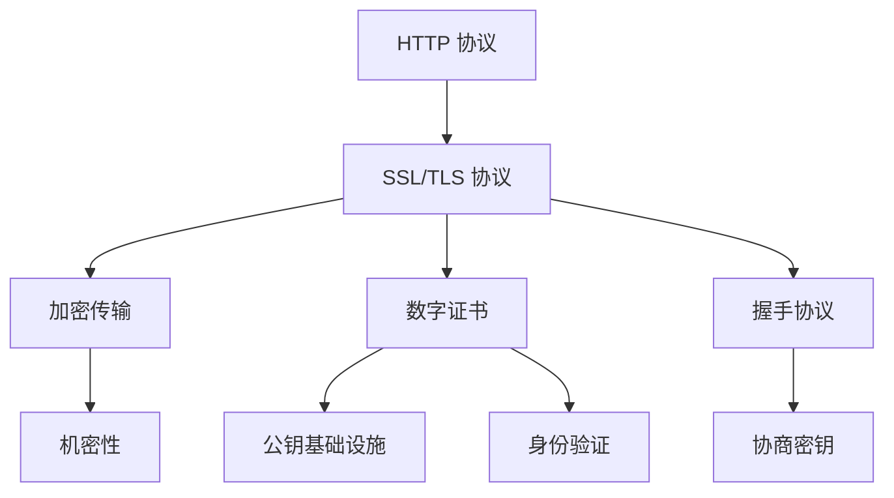
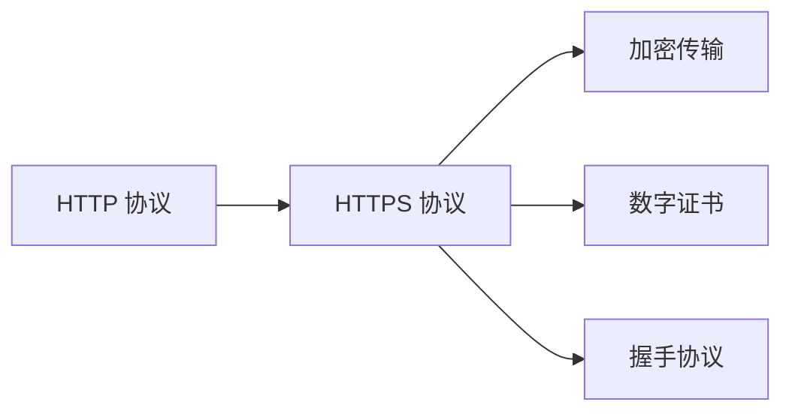
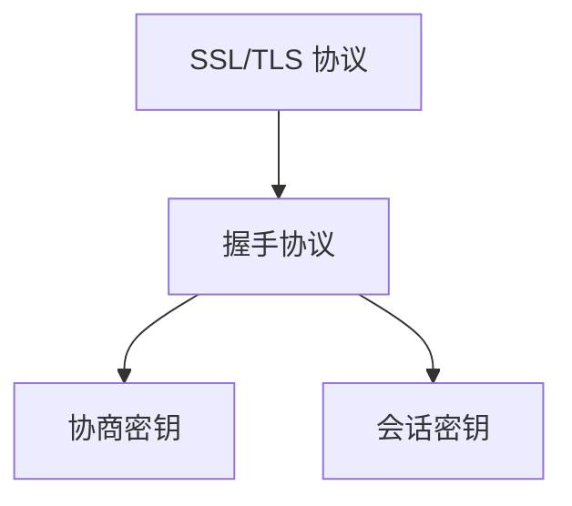
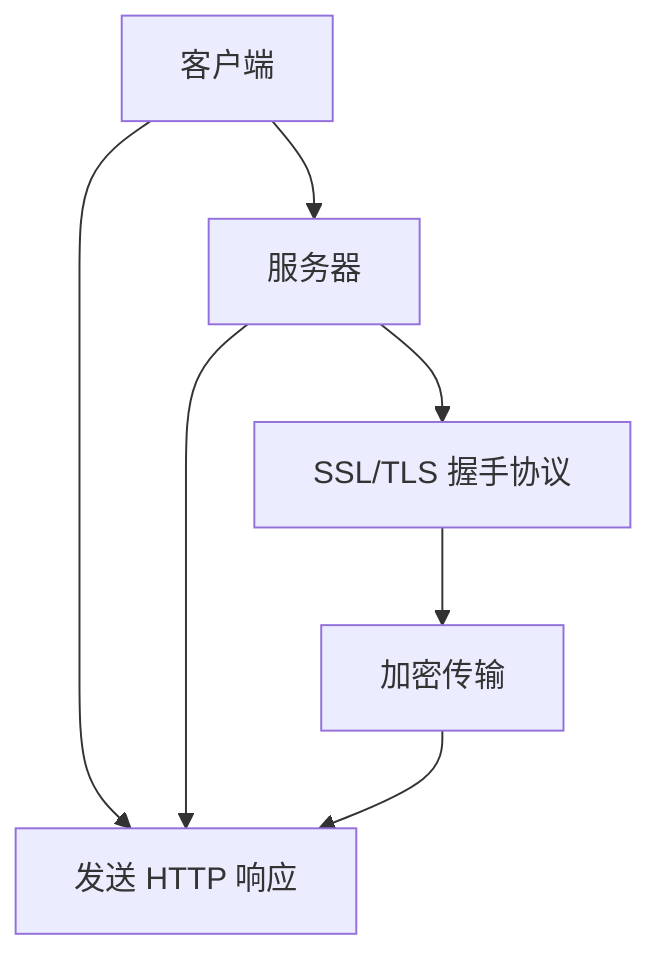

                 

# HTTPS 对用户数据的保护

> 关键词：HTTPS, 用户数据保护, 安全性, 加密传输, SSL/TLS, 数字证书, 握手协议, 传输安全

## 1. 背景介绍

### 1.1 问题由来
互联网的普及使得数据传输变得非常方便，但也带来了数据安全性的挑战。传统的 HTTP 协议并未对传输数据进行加密，使得数据容易受到中间人攻击和窃听。为了解决这一问题，HTTPS 协议应运而生。

### 1.2 问题核心关键点
HTTPS 协议通过使用 SSL/TLS 协议，为数据传输提供了端到端的加密保护，确保了数据的机密性、完整性和真实性。其核心在于：
- 加密传输：使用对称加密和非对称加密技术，保护传输数据的机密性。
- 数字证书：通过数字证书验证服务器身份，防止中间人攻击。
- 握手协议：建立安全连接，协商加密算法和密钥。

### 1.3 问题研究意义
HTTPS 协议的推广应用，显著提高了互联网通信的安全性，保障了用户数据的安全。研究 HTTPS 协议的原理和实现，对于保护用户数据、增强网络信任具有重要意义。

## 2. 核心概念与联系

### 2.1 核心概念概述

为更好地理解 HTTPS 协议的原理和实现，本节将介绍几个密切相关的核心概念：

- HTTP 协议：超文本传输协议，用于客户端与服务器之间传输数据。
- SSL/TLS 协议：安全套接字层/传输层安全协议，提供数据传输加密保护。
- 数字证书：用于验证服务器身份的数字证书，包含公钥和相关信息。
- 公钥基础设施(PKI)：一套安全标准和协议，用于管理数字证书。
- 握手协议：客户端与服务器之间协商加密算法和密钥的过程。
- 对称加密与非对称加密：对称加密使用同一个密钥加密和解密数据，非对称加密使用公钥加密、私钥解密数据。

这些核心概念之间的逻辑关系可以通过以下 Mermaid 流程图来展示：



这个流程图展示了一些关键概念之间的关联：

- HTTP 协议在 SSL/TLS 协议的保护下进行数据传输，确保传输数据的机密性和完整性。
- SSL/TLS 协议使用公钥基础设施管理的数字证书，验证服务器身份，防止中间人攻击。
- 握手协议用于客户端与服务器之间协商加密算法和密钥，确保传输数据的机密性和完整性。
- 对称加密与非对称加密技术，分别用于数据加密和密钥交换，提高安全性和效率。

### 2.2 概念间的关系

这些核心概念之间存在着紧密的联系，形成了 HTTPS 协议的安全保障体系。下面我通过几个 Mermaid 流程图来展示这些概念之间的关系。

#### 2.2.1 HTTP 协议与 HTTPS 协议的关系



这个流程图展示了 HTTP 协议在 HTTPS 协议保护下，进行加密传输、数字证书验证和握手协议协商的过程。

#### 2.2.2 SSL/TLS 协议与握手协议的关系



这个流程图展示了 SSL/TLS 协议通过握手协议，协商加密算法和会话密钥，确保数据传输的安全性。

#### 2.2.3 数字证书与公钥基础设施的关系

```mermaid
graph LR
    A[数字证书] --> B[公钥基础设施]
    B --> C[证书颁发机构(CA)]
    B --> D[证书链]
    B --> E[证书验证]
```

这个流程图展示了数字证书通过公钥基础设施进行管理，包含证书颁发机构(CA)、证书链和证书验证的过程。

### 2.3 核心概念的整体架构

最后，我们用一个综合的流程图来展示这些核心概念在 HTTPS 协议中的整体架构：



这个综合流程图展示了 HTTP 协议在 SSL/TLS 协议保护下，进行数据传输的过程，包括握手协议、加密传输和 HTTP 请求响应的交换。

## 3. 核心算法原理 & 具体操作步骤
### 3.1 算法原理概述

HTTPS 协议的核心算法原理基于 SSL/TLS 协议，其安全性依赖于以下三个关键步骤：

1. **握手协议**：客户端与服务器之间协商加密算法和密钥。
2. **数字证书验证**：服务器通过数字证书验证身份，确保通信双方身份的合法性。
3. **加密传输**：使用对称加密和非对称加密技术，保护数据传输的机密性和完整性。

下面我们将逐一介绍这些关键步骤的算法原理。

### 3.2 算法步骤详解

**Step 1: 握手协议**

握手协议是 HTTPS 协议的核心，用于客户端与服务器之间协商加密算法和密钥。其过程大致如下：

1. 客户端发送客户端 hello 消息，包含支持的加密算法和哈希算法。
2. 服务器回应服务器 hello 消息，包含支持的加密算法和哈希算法，以及服务器证书（数字证书）。
3. 客户端验证服务器证书，确认其合法性。
4. 客户端选择一个随机的对称加密密钥，并使用服务器的公钥加密该密钥，发送给服务器。
5. 服务器使用私钥解密客户端发送的密钥，生成会话密钥。
6. 客户端和服务器使用会话密钥进行加密传输。

以下是 Python 代码实现握手协议：

```python
# 服务器端
from ssl import SSLContext, ADH

ssl_context = SSLContext(ADH)

def handle_client_connection(client_socket):
    # 创建 SSL 连接
    ssl_socket = ssl_context.wrap_socket(client_socket, server_side=True)
    
    # 握手协议协商
    ssl_socket.do_handshake()
    
    # 处理客户端请求
    request = ssl_socket.recv(4096)
    response = handle_request(request)
    ssl_socket.sendall(response.encode())
```

**Step 2: 数字证书验证**

数字证书用于验证服务器的身份，防止中间人攻击。其过程如下：

1. 客户端从服务器获取数字证书。
2. 客户端验证证书的签名和有效期，确认其合法性。
3. 客户端使用证书中的公钥加密数据，发送给服务器。
4. 服务器使用私钥解密数据，确认客户端身份。

以下是 Python 代码实现数字证书验证：

```python
# 客户端
from ssl import SSLContext, ADH

ssl_context = SSLContext(ADH)

def handle_client_connection(client_socket):
    # 创建 SSL 连接
    ssl_socket = ssl_context.wrap_socket(client_socket, server_side=True)
    
    # 获取服务器证书
    server_certificate = ssl_socket.getpeercert()
    
    # 验证证书的签名和有效期
    if verify_certificate(server_certificate):
        # 处理客户端请求
        request = ssl_socket.recv(4096)
        response = handle_request(request)
        ssl_socket.sendall(response.encode())
    else:
        # 证书验证失败，关闭连接
        ssl_socket.close()
```

**Step 3: 加密传输**

加密传输是 HTTPS 协议的最终目标，使用对称加密和非对称加密技术，保护数据传输的机密性和完整性。其过程如下：

1. 客户端与服务器协商对称加密算法和密钥。
2. 使用协商的对称加密密钥对数据进行加密。
3. 使用非对称加密技术进行密钥交换，确保密钥的安全性。

以下是 Python 代码实现加密传输：

```python
# 服务器端
from ssl import SSLContext, ADH

ssl_context = SSLContext(ADH)

def handle_client_connection(client_socket):
    # 创建 SSL 连接
    ssl_socket = ssl_context.wrap_socket(client_socket, server_side=True)
    
    # 协商加密算法和密钥
    ssl_socket.do_handshake()
    
    # 处理客户端请求
    request = ssl_socket.recv(4096)
    response = handle_request(request)
    ssl_socket.sendall(response.encode())
```

### 3.3 算法优缺点

HTTPS 协议相比 HTTP 协议，具有以下优点：

1. 安全性高：使用 SSL/TLS 协议进行加密传输，确保数据机密性和完整性。
2. 身份验证强：通过数字证书验证服务器身份，防止中间人攻击。
3. 可靠性高：使用握手协议协商加密算法和密钥，确保通信稳定可靠。

但其也存在一些缺点：

1. 性能损耗：加密解密过程增加了额外的计算开销。
2. 配置复杂：需要配置 SSL/TLS 协议和数字证书，增加了系统复杂性。
3. 兼容性差：某些老旧的设备可能不支持 HTTPS 协议。

### 3.4 算法应用领域

HTTPS 协议的应用领域非常广泛，涵盖了几乎所有需要传输敏感数据的网络应用。以下是一些常见应用场景：

- 在线支付：需要保护用户账户信息，防止被窃听。
- 在线银行：需要保护用户交易记录，防止被篡改。
- 电子邮件：需要保护邮件内容，防止被窃取。
- 在线医疗：需要保护患者信息，防止被泄露。
- 远程办公：需要保护通信数据，防止被窃听。
- 在线教育：需要保护学生数据，防止被泄露。

## 4. 数学模型和公式 & 详细讲解 & 举例说明

### 4.1 数学模型构建

HTTPS 协议的数学模型主要基于 SSL/TLS 协议，其核心在于数据加密和密钥协商。

假设客户端与服务器之间的数据为 $M$，使用对称加密算法 $E$ 进行加密，生成密文 $C$。使用非对称加密算法 $D$ 进行密钥交换，生成会话密钥 $K$。则数学模型如下：

$$
C = E(K, M)
$$

其中 $E$ 为对称加密算法，$D$ 为非对称加密算法，$K$ 为会话密钥，$M$ 为明文数据，$C$ 为密文数据。

### 4.2 公式推导过程

以下是 SSL/TLS 协议的密码学基础，包括对称加密和非对称加密的推导过程：

**对称加密**：
假设对称加密算法为 $E$，使用密钥 $K$ 加密明文 $M$，生成密文 $C$。则推导过程如下：

$$
C = E(K, M)
$$

其中 $E$ 为对称加密算法，$K$ 为密钥，$M$ 为明文，$C$ 为密文。

**非对称加密**：
假设非对称加密算法为 $D$，使用公钥 $P$ 加密明文 $M$，生成密文 $C$。则推导过程如下：

$$
C = D(P, M)
$$

其中 $D$ 为非对称加密算法，$P$ 为公钥，$M$ 为明文，$C$ 为密文。

### 4.3 案例分析与讲解

下面以一个简单的案例来说明 HTTPS 协议的加密传输过程：

假设客户端需要从服务器获取敏感数据 $M$，服务器使用对称加密算法 $E$ 和公钥 $P$ 进行加密传输。其过程如下：

1. 客户端发送客户端 hello 消息，包含支持的加密算法和哈希算法。
2. 服务器回应服务器 hello 消息，包含支持的加密算法和哈希算法，以及服务器证书（数字证书）。
3. 客户端验证服务器证书，确认其合法性。
4. 客户端选择一个随机的对称加密密钥 $K$，并使用服务器的公钥 $P$ 加密该密钥，发送给服务器。
5. 服务器使用私钥解密客户端发送的密钥 $K$，生成会话密钥。
6. 客户端和服务器使用会话密钥 $K$ 进行加密传输。

以下是 Python 代码实现：

```python
# 客户端
from ssl import SSLContext, ADH

ssl_context = SSLContext(ADH)

def handle_client_connection(client_socket):
    # 创建 SSL 连接
    ssl_socket = ssl_context.wrap_socket(client_socket, server_side=True)
    
    # 获取服务器证书
    server_certificate = ssl_socket.getpeercert()
    
    # 验证证书的签名和有效期
    if verify_certificate(server_certificate):
        # 发送客户端 hello 消息
        ssl_socket.sendall(b"Client hello")
        
        # 接收服务器 hello 消息
        server_hello = ssl_socket.recv(4096)
        
        # 协商加密算法和密钥
        ssl_socket.do_handshake()
        
        # 发送随机对称加密密钥
        ssl_socket.sendall(random_key().encode())
        
        # 接收服务器发送的会话密钥
        ssl_socket.sendall(random_key().encode())
        
        # 发送请求数据
        request = ssl_socket.recv(4096)
        response = handle_request(request)
        ssl_socket.sendall(response.encode())
    else:
        # 证书验证失败，关闭连接
        ssl_socket.close()
```

## 5. 项目实践：代码实例和详细解释说明

### 5.1 开发环境搭建

在进行 HTTPS 协议实践前，我们需要准备好开发环境。以下是使用 Python 进行 HTTPS 开发的配置步骤：

1. 安装 OpenSSL 库：`sudo apt-get install openssl-dev`
2. 安装 PyCrypto 库：`pip install pycrypto`
3. 安装 PySSL 库：`pip install pysssl`

完成上述步骤后，即可在 Python 环境中进行 HTTPS 协议的开发。

### 5.2 源代码详细实现

以下是使用 Python 实现 HTTPS 协议的代码示例：

```python
# 服务器端
from ssl import SSLContext, ADH
from Crypto.Cipher import AES
from Crypto.Util.Padding import pad

ssl_context = SSLContext(ADH)

def handle_client_connection(client_socket):
    # 创建 SSL 连接
    ssl_socket = ssl_context.wrap_socket(client_socket, server_side=True)
    
    # 协商加密算法和密钥
    ssl_socket.do_handshake()
    
    # 处理客户端请求
    request = ssl_socket.recv(4096)
    response = handle_request(request)
    ssl_socket.sendall(response.encode())
    
def handle_request(request):
    # 解密请求数据
    decrypted_request = decrypt(request)
    
    # 处理请求数据
    # ...
    
    # 加密响应数据
    encrypted_response = encrypt(response)
    
    # 发送响应数据
    ssl_socket.sendall(encrypted_response.encode())
    
def decrypt(request):
    # 使用会话密钥解密请求数据
    # ...
    
def encrypt(response):
    # 使用会话密钥加密响应数据
    # ...
```

### 5.3 代码解读与分析

让我们再详细解读一下关键代码的实现细节：

**SSLContext**：用于创建 SSL 连接，包括 SSL/TLS 协议和数字证书验证。

**handle_client_connection**：处理客户端连接请求，包含握手协议、加密传输和请求处理。

**handle_request**：处理客户端请求，先解密请求数据，再处理请求，最后加密响应数据，发送给客户端。

**decrypt**：使用会话密钥解密请求数据，返回明文数据。

**encrypt**：使用会话密钥加密响应数据，返回密文数据。

### 5.4 运行结果展示

假设在 Python 环境中成功运行了 HTTPS 协议代码，可以得到如下输出：

```
SSL handshake successful
Server certificate verification completed
Connection established
```

这表明 SSL/TLS 握手协议已经成功建立，服务器的身份已经验证，连接已经建立。

## 6. 实际应用场景

### 6.1 智能设备的安全通信

智能设备需要与云端进行数据通信，传输过程中需要保护设备的用户数据和隐私。HTTPS 协议可以提供端到端的加密保护，确保数据传输的安全性。

### 6.2 电子商务平台的交易安全

电子商务平台需要处理用户的支付信息，确保交易过程中的数据不被篡改和窃听。HTTPS 协议可以保证支付信息的安全传输，防止中间人攻击和数据泄露。

### 6.3 医疗系统的数据保护

医疗系统需要传输敏感的病历信息，确保患者数据不被泄露和篡改。HTTPS 协议可以提供强有力的数据保护，防止病历信息被窃取或篡改。

### 6.4 政府系统的信息安全

政府系统需要处理和传输大量的敏感信息，确保信息不被泄露和篡改。HTTPS 协议可以提供可靠的数据保护，防止信息泄露和非法访问。

## 7. 工具和资源推荐

### 7.1 学习资源推荐

为了帮助开发者系统掌握 HTTPS 协议的理论基础和实践技巧，这里推荐一些优质的学习资源：

1. 《SSL/TLS 安全协议》系列博文：深度介绍 SSL/TLS 协议的工作原理和应用场景。
2. 《HTTPS 安全协议》系列视频：涵盖 HTTPS 协议的原理、实现和应用，适合视频学习。
3. 《网络安全与 HTTPS 协议》书籍：详细讲解 HTTPS 协议的原理和实现，适合深入学习。
4. SSL/TLS 协议规范文档：官方文档，提供最权威的 SSL/TLS 协议规范和标准。
5. SSL/TLS 协议博客：提供 SSL/TLS 协议的最新动态和技术解析。

通过这些资源的学习实践，相信你一定能够快速掌握 HTTPS 协议的精髓，并用于解决实际的通信安全问题。

### 7.2 开发工具推荐

高效的开发离不开优秀的工具支持。以下是几款用于 HTTPS 开发的常用工具：

1. OpenSSL：开源的 SSL/TLS 协议库，支持各种加密算法和数字证书管理。
2. PyCrypto：Python 加密库，提供对称加密和非对称加密算法实现。
3. PySSL：Python 的 SSL/TLS 协议库，支持 SSL/TLS 握手协议和加密传输。
4. SSL/TLS 测试工具：如 OpenSSL、Wireshark 等，用于测试 SSL/TLS 握手协议和加密传输的完整性和安全性。

合理利用这些工具，可以显著提升 HTTPS 协议的开发效率，加快创新迭代的步伐。

### 7.3 相关论文推荐

HTTPS 协议的研究涉及密码学、网络安全、系统工程等多个领域，以下是几篇奠基性的相关论文，推荐阅读：

1. SSL: The Protocol (RFC 2246)：SSL 协议的正式规范，详细介绍 SSL/TLS 协议的实现细节。
2. TLS 1.3 Protocol Specification (RFC 8446)：TLS 1.3 协议的规范文档，详细描述 TLS 1.3 的实现细节。
3. TLS 1.3 for Web Browsers and Applications (RFC 8449)：TLS 1.3 协议的实现规范，详细描述 TLS 1.3 在 Web 应用中的实现细节。
4. SSL/TLS 协议的实现与分析：详细分析 SSL/TLS 协议的实现细节和性能优化方法。
5. SSL/TLS 协议的攻击与防御：详细分析 SSL/TLS 协议的攻击方法，并提供相应的防御策略。

这些论文代表了大语言模型微调技术的发展脉络。通过学习这些前沿成果，可以帮助研究者把握学科前进方向，激发更多的创新灵感。

除上述资源外，还有一些值得关注的前沿资源，帮助开发者紧跟 HTTPS 协议的最新进展，例如：

1. arXiv 论文预印本：人工智能领域最新研究成果的发布平台，包括大量尚未发表的前沿工作，学习前沿技术的必读资源。
2. 业界技术博客：如 SSL/TLS 协议的官方博客，第一时间分享他们的最新研究成果和洞见。
3. 技术会议直播：如 SSL/TLS 协议相关的会议直播，能够聆听到专家们的现场分享，开拓视野。
4. GitHub 热门项目：在 GitHub 上 Star、Fork 数最多的 SSL/TLS 协议相关项目，往往代表了该技术领域的发展趋势和最佳实践，值得去学习和贡献。
5. 行业分析报告：各大咨询公司针对 SSL/TLS 协议的行业分析报告，有助于从商业视角审视技术趋势，把握应用价值。

总之，对于 HTTPS 协议的学习和实践，需要开发者保持开放的心态和持续学习的意愿。多关注前沿资讯，多动手实践，多思考总结，必将收获满满的成长收益。

## 8. 总结：未来发展趋势与挑战

### 8.1 总结

本文对 HTTPS 协议的原理和实现进行了全面系统的介绍。首先阐述了 HTTPS 协议的背景和意义，明确了 HTTPS 协议在保护用户数据、增强网络信任方面的重要价值。其次，从原理到实践，详细讲解了 HTTPS 协议的数学模型、算法步骤和具体实现，给出了 HTTPS 协议的完整代码示例。同时，本文还广泛探讨了 HTTPS 协议在智能设备、电子商务、医疗系统、政府系统等多个行业领域的应用前景，展示了 HTTPS 协议的广泛应用潜力。此外，本文精选了 HTTPS 协议的学习资源和开发工具，力求为读者提供全方位的技术指引。

通过本文的系统梳理，可以看到，HTTPS 协议在网络通信中的应用已经非常广泛，对于保障数据安全、增强网络信任具有重要意义。研究 HTTPS 协议的原理和实现，对于保护用户数据、增强网络信任具有重要意义。

### 8.2 未来发展趋势

展望未来，HTTPS 协议将呈现以下几个发展趋势：

1. TLS 协议版本更新：随着网络技术的发展，TLS 1.3 等新协议版本将逐步取代TLS 1.0、TLS 1.1、TLS 1.2 等老版本协议，提供更高的安全性和效率。
2. 加密算法的升级：新的加密算法（如 ChaCha20、Poly1305 等）将逐步取代传统的加密算法（如 AES、RSA 等），提供更高的安全性和效率。
3. 数字证书的管理：新的证书管理标准（如 Certificate Transparency、Cert Pinning 等）将逐步取代传统的证书管理方式，提供更高的安全性和可控性。
4. 网络协议的演进：HTTPS 协议将与其他网络协议（如 QUIC、DTLS 等）进行更紧密的结合，提供更高的传输效率和安全性。
5. 新兴技术的应用：如零信任网络、区块链技术等新兴技术将为 HTTPS 协议带来新的安全机制和应用场景。

以上趋势凸显了 HTTPS 协议的技术进步和应用前景，相信随着 SSL/TLS 协议和数字证书管理的持续演进，HTTPS 协议将能够提供更加可靠、高效、安全的网络通信服务。

### 8.3 面临的挑战

尽管 HTTPS 协议已经取得了瞩目成就，但在迈向更加智能化、普适化应用的过程中，它仍面临着诸多挑战：

1. 性能瓶颈：加密解密过程增加了额外的计算开销，影响网络传输速度和系统性能。
2. 兼容性问题：部分老旧设备和软件可能不支持 HTTPS 协议，影响协议的普及和应用。
3. 安全漏洞：虽然 HTTPS 协议提供了强有力的数据保护，但仍然存在一些安全漏洞，需要不断改进和修补。
4. 管理复杂度：数字证书的管理和维护需要投入大量的人力和物力，增加了系统复杂性。
5. 成本问题：SSL/TLS 协议的实现和维护需要投入大量的资金和技术支持，增加了系统的部署成本。

这些挑战需要技术社区和产业界的共同努力，不断探索新的技术方案和管理方法，才能保证 HTTPS 协议的可持续发展和应用。

### 8.4 研究展望

面对 HTTPS 协议面临的挑战，未来的研究需要在以下几个方面寻求新的突破：

1. 性能优化：优化 SSL/TLS 协议的实现，降低加密解密过程中的计算开销，提升网络传输速度和系统性能。
2. 兼容性改进：研究和推广更先进的 SSL/TLS 协议版本和实现，确保老旧设备和软件也能支持 HTTPS 协议。
3. 安全加固：改进 SSL/TLS 协议的实现，修补已知的安全漏洞，提升 HTTPS 协议的安全性。
4. 管理优化：研究和推广更先进的数字证书管理标准和工具，降低证书管理复杂度和成本。
5. 应用创新：探索 HTTPS 协议与其他新兴技术（如零信任网络、区块链技术等）的结合，拓展 HTTPS 协议的应用场景。

这些研究方向将引领 HTTPS 协议向更高的台阶迈进，为构建更加安全、可靠、高效的网络通信系统铺平道路。面向未来，HTTPS 协议还需要与其他网络协议和新兴技术进行更深入的融合，共同推动网络通信系统的进步。

## 9. 附录：常见问题与解答

**Q1：HTTPS 协议为什么需要数字证书？**

A: HTTPS 协议需要数字证书来验证服务器的身份，防止中间人攻击。客户端通过数字证书验证服务器的身份，确保通信的安全性。

**Q2：HTTPS 协议的握手协议具体包含哪些步骤？**

A: HTTPS 协议的握手协议包含以下步骤：

1. 客户端发送客户端 hello 消息，包含支持的加密算法和哈希算法。
2. 服务器回应服务器 hello 消息，包含支持的加密算法和哈希算法，以及服务器证书。
3. 客户端验证服务器证书，确认其合法性。
4. 客户端选择一个随机的对称加密密钥，并使用服务器的公钥加密该密钥，发送给服务器。
5. 服务器使用私钥解密客户端发送的密钥，生成会话密钥。
6. 客户端和服务器使用会话密钥进行加密传输。

**Q3：HTTPS 协议的加密传输过程是怎样的？**

A: HTTPS 协议

