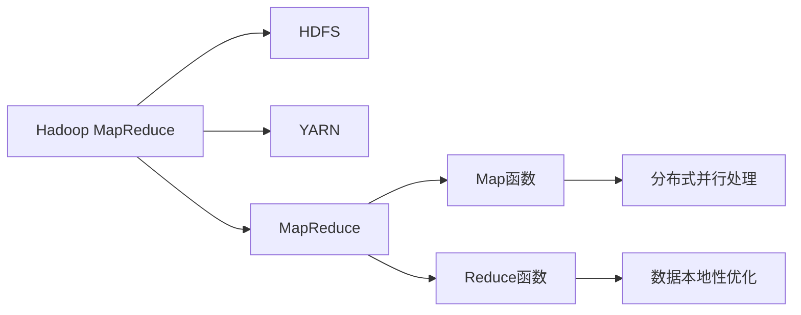

                 

# Hadoop MapReduce计算框架原理与代码实例讲解

> 关键词：Hadoop MapReduce, MapReduce, 分布式计算, 大数据处理, 云计算, Map函数, Reduce函数, 数据并行处理, 编程模型

## 1. 背景介绍

### 1.1 问题由来
随着互联网和移动互联网的迅猛发展，全球数据量呈指数级增长，从TB级别扩展到PB级别，甚至EB级别。如何高效处理如此巨量的数据，成为摆在企业和研究人员面前的一大挑战。传统的集中式计算模式，已经难以适应大规模数据处理的需要。为此，分布式计算技术应运而生，成为了大数据处理的核心技术。

分布式计算技术通过将任务分散到多台计算机上并行处理，极大提升了数据处理效率和系统稳定性。其中，Hadoop MapReduce是一种基于Google MapReduce模型的开源分布式计算框架，是处理大规模数据的核心工具之一。自2008年发布以来，Hadoop MapReduce已经在全球范围内的各行各业得到广泛应用，包括金融、医疗、电商、政府、科研等。

Hadoop MapReduce的设计思想基于Google的MapReduce论文，是业界公认的分布式计算标准。本博文将对Hadoop MapReduce的原理和实践进行详细讲解，并通过实例代码帮助读者深入理解其核心技术。

### 1.2 问题核心关键点
Hadoop MapReduce的核心思想是分布式并行处理大规模数据，其核心算法分为Map和Reduce两个步骤。Map函数用于将输入数据分割成小的数据块，并对其进行处理。Reduce函数则将Map函数输出的中间结果进行汇总和合并，最终得到最终结果。通过这种数据并行处理的方式，Hadoop MapReduce能够高效地处理海量数据。

Hadoop MapReduce的优点包括：
- 高度的可扩展性：能够轻松扩展到大规模集群，处理PB级别的数据。
- 容错性：任何一个节点故障，整个系统仍能正常运行，保障数据处理的高可用性。
- 高效率：通过分布式并行处理，显著提升数据处理速度和系统吞吐量。
- 易用性：提供了一整套分布式计算框架和工具，用户不需要深入了解分布式计算原理，即可使用。

Hadoop MapReduce的缺点包括：
- 编程复杂度较高：需要编写Map函数和Reduce函数，学习成本较高。
- 资源利用率较低：虽然支持数据本地性优化，但无法充分利用计算节点资源。
- 延迟较高：数据块传输和节点间通信增加了系统延迟，影响了实时处理能力。

尽管如此，Hadoop MapReduce仍然是目前最主流的分布式计算框架之一，广泛应用于大规模数据处理场景。

## 2. 核心概念与联系

### 2.1 核心概念概述
Hadoop MapReduce的核心概念包括：

- Hadoop：一个开源的分布式计算框架，提供了一整套分布式计算工具，包括数据存储（HDFS）、任务调度（YARN）和数据处理（MapReduce）等。
- MapReduce：一种编程模型，用于处理大规模数据集。其核心思想是将任务分解成多个小任务，并行处理后合并得到最终结果。
- Map函数：将输入数据分割成小的数据块，并对每个数据块进行处理。
- Reduce函数：将Map函数输出的中间结果进行汇总和合并，得到最终结果。
- 分布式并行处理：将任务分散到多台计算机上并行处理，提升数据处理效率和系统稳定性。
- 数据本地性优化：尽量将数据存储在计算节点本地，减少数据传输，提升处理速度。

### 2.2 概念间的关系

Hadoop MapReduce的这些核心概念之间存在着紧密的联系，形成了完整的分布式计算框架。下面通过一个Mermaid流程图来展示这些概念之间的关系：



这个流程图展示了大规模数据处理的完整流程：

1. Hadoop MapReduce框架通过HDFS将大规模数据存储到分布式文件系统中。
2. YARN负责任务调度，将MapReduce任务分发到各个计算节点。
3. Map函数将输入数据分割成小的数据块，并行处理后得到中间结果。
4. Reduce函数将Map函数输出的中间结果进行汇总和合并，得到最终结果。
5. 在数据处理过程中，MapReduce采用分布式并行处理方式，提升数据处理效率和系统稳定性。
6. 数据本地性优化技术尽量将数据存储在计算节点本地，减少数据传输，提升处理速度。

## 3. 核心算法原理 & 具体操作步骤
### 3.1 算法原理概述
Hadoop MapReduce的核心算法分为Map和Reduce两个步骤，下面详细介绍每个步骤的原理。

#### 3.1.1 Map函数

Map函数用于将输入数据分割成小的数据块，并对其进行处理。Map函数接收一个输入数据，输出一组中间数据。Map函数通常可以分为如下几个步骤：

1. 输入数据的分割：将输入数据分割成小的数据块，并行处理每个数据块。
2. 数据的初步处理：对每个数据块进行处理，通常包括解析、过滤、计算等操作。
3. 中间数据的生成：将处理结果转换为中间数据格式，通常为键值对形式。

Map函数的原理图如下：


#### 3.1.2 Reduce函数

Reduce函数用于将Map函数输出的中间结果进行汇总和合并，得到最终结果。Reduce函数接收一组中间数据，输出最终结果。Reduce函数通常可以分为如下几个步骤：

1. 中间数据的合并：将相同键值对的结果合并为一个。
2. 数据的汇总处理：对合并后的数据进行汇总处理，通常包括计算、排序、分组等操作。
3. 最终结果的生成：将汇总处理的结果转换为最终结果格式。

Reduce函数的原理图如下：


#### 3.1.3 MapReduce的核心算法流程

MapReduce的核心算法流程如下：

1. 数据分割：将输入数据分割成小的数据块，并行处理每个数据块。
2. Map函数处理：对每个数据块进行处理，生成中间结果。
3. Reduce函数汇总：将相同键值对的结果合并为一个，进行汇总处理，生成最终结果。

MapReduce的核心算法流程图如下：


### 3.2 算法步骤详解

#### 3.2.1 Map函数步骤详解

Map函数的步骤详解如下：

1. 输入数据的分割：将输入数据分割成小的数据块，并行处理每个数据块。
2. 数据的初步处理：对每个数据块进行处理，通常包括解析、过滤、计算等操作。
3. 中间数据的生成：将处理结果转换为中间数据格式，通常为键值对形式。

#### 3.2.2 Reduce函数步骤详解

Reduce函数的步骤详解如下：

1. 中间数据的合并：将相同键值对的结果合并为一个。
2. 数据的汇总处理：对合并后的数据进行汇总处理，通常包括计算、排序、分组等操作。
3. 最终结果的生成：将汇总处理的结果转换为最终结果格式。

#### 3.2.3 MapReduce的核心算法流程

MapReduce的核心算法流程详解如下：

1. 数据分割：将输入数据分割成小的数据块，并行处理每个数据块。
2. Map函数处理：对每个数据块进行处理，生成中间结果。
3. Reduce函数汇总：将相同键值对的结果合并为一个，进行汇总处理，生成最终结果。

### 3.3 算法优缺点

#### 3.3.1 优点

1. 高度的可扩展性：能够轻松扩展到大规模集群，处理PB级别的数据。
2. 容错性：任何一个节点故障，整个系统仍能正常运行，保障数据处理的高可用性。
3. 高效率：通过分布式并行处理，显著提升数据处理速度和系统吞吐量。
4. 易用性：提供了一整套分布式计算框架和工具，用户不需要深入了解分布式计算原理，即可使用。

#### 3.3.2 缺点

1. 编程复杂度较高：需要编写Map函数和Reduce函数，学习成本较高。
2. 资源利用率较低：虽然支持数据本地性优化，但无法充分利用计算节点资源。
3. 延迟较高：数据块传输和节点间通信增加了系统延迟，影响了实时处理能力。

## 4. 数学模型和公式 & 详细讲解  
### 4.1 数学模型构建

Hadoop MapReduce的数学模型主要由Map函数和Reduce函数构成。下面详细介绍每个函数的数学模型。

#### 4.1.1 Map函数数学模型

Map函数的主要操作是数据分割和初步处理，其数学模型可以表示为：

$$
M(\{x_i\})=\{(y_j,f(x_i))\}
$$

其中，$x_i$表示输入数据，$y_j$表示Map函数输出的中间数据，$f(x_i)$表示Map函数对输入数据进行处理后生成的中间数据。

#### 4.1.2 Reduce函数数学模型

Reduce函数的主要操作是中间数据的合并和汇总处理，其数学模型可以表示为：

$$
R(\{(y_j,f(x_i))\})=\{(z_k,g(y_j,f(x_i)))\}
$$

其中，$(y_j,f(x_i))$表示Map函数输出的中间数据，$z_k$表示Reduce函数输出的最终结果，$g(y_j,f(x_i))$表示Reduce函数对中间数据进行处理后生成的最终结果。

### 4.2 公式推导过程

#### 4.2.1 Map函数公式推导

Map函数的公式推导如下：

1. 数据分割：将输入数据$x_i$分割成小的数据块，并行处理每个数据块。
2. 初步处理：对每个数据块进行处理，通常包括解析、过滤、计算等操作。
3. 中间数据生成：将处理结果转换为中间数据格式，通常为键值对形式。

Map函数的数学模型可以表示为：

$$
M(\{x_i\})=\{(y_j,f(x_i))\}
$$

其中，$x_i$表示输入数据，$y_j$表示Map函数输出的中间数据，$f(x_i)$表示Map函数对输入数据进行处理后生成的中间数据。

#### 4.2.2 Reduce函数公式推导

Reduce函数的公式推导如下：

1. 中间数据合并：将相同键值对的结果合并为一个。
2. 汇总处理：对合并后的数据进行汇总处理，通常包括计算、排序、分组等操作。
3. 最终结果生成：将汇总处理的结果转换为最终结果格式。

Reduce函数的数学模型可以表示为：

$$
R(\{(y_j,f(x_i))\})=\{(z_k,g(y_j,f(x_i)))\}
$$

其中，$(y_j,f(x_i))$表示Map函数输出的中间数据，$z_k$表示Reduce函数输出的最终结果，$g(y_j,f(x_i))$表示Reduce函数对中间数据进行处理后生成的最终结果。

### 4.3 案例分析与讲解

#### 4.3.1 Map函数案例分析

Map函数的案例分析如下：

假设我们需要计算一个数组中所有元素的和。可以将数组分割成小的数据块，并行处理每个数据块，然后累加每个数据块的结果。

输入数据$x_i$表示数组中的元素，$y_j$表示Map函数输出的中间数据，$f(x_i)$表示Map函数对输入数据进行处理后生成的中间数据。

Map函数可以表示为：

$$
M(\{x_i\})=\{(y_j,f(x_i))\}
$$

其中，$x_i$表示输入数据，$y_j$表示Map函数输出的中间数据，$f(x_i)$表示Map函数对输入数据进行处理后生成的中间数据。

Map函数的具体实现代码如下：

```python
def map_function(key, value):
    # 对输入数据进行处理，生成中间数据
    result = 0
    for i in range(1, len(value)):
        result += value[i]
    # 将中间数据转换为键值对形式
    return (key, result)
```

#### 4.3.2 Reduce函数案例分析

Reduce函数的案例分析如下：

假设我们需要计算一个数组中所有元素的和。可以将数组分割成小的数据块，并行处理每个数据块，然后累加每个数据块的结果。

中间数据$(y_j,f(x_i))$表示Map函数输出的中间数据，$z_k$表示Reduce函数输出的最终结果，$g(y_j,f(x_i))$表示Reduce函数对中间数据进行处理后生成的最终结果。

Reduce函数可以表示为：

$$
R(\{(y_j,f(x_i))\})=\{(z_k,g(y_j,f(x_i)))\}
$$

其中，$(y_j,f(x_i))$表示Map函数输出的中间数据，$z_k$表示Reduce函数输出的最终结果，$g(y_j,f(x_i))$表示Reduce函数对中间数据进行处理后生成的最终结果。

Reduce函数的具体实现代码如下：

```python
def reduce_function(key, values):
    # 将相同键值对的结果合并为一个
    result = sum(values)
    # 将汇总结果转换为最终结果格式
    return (key, result)
```

## 5. 项目实践：代码实例和详细解释说明
### 5.1 开发环境搭建

在进行Hadoop MapReduce实践前，我们需要准备好开发环境。以下是使用Java进行Hadoop MapReduce开发的环境配置流程：

1. 安装Hadoop：从官网下载并安装Hadoop，根据操作系统的不同，可能需要不同的安装命令。例如，在Linux系统上安装Hadoop的命令为：

```bash
wget https://archive.apache.org/dist/hadoop-3/hadoop-3.1.2/hadoop-3.1.2.tar.gz
tar -xvf hadoop-3.1.2.tar.gz
cd hadoop-3.1.2
./bin/hadoop version
```

2. 安装Java环境：Hadoop需要Java环境支持，可以安装Oracle JDK或OpenJDK，例如在Linux系统上安装OpenJDK的命令为：

```bash
sudo apt-get install default-jdk
```

3. 配置Hadoop环境变量：在~/.bashrc文件中添加以下内容，然后运行source命令：

```bash
export HADOOP_HOME=/path/to/hadoop
export PATH=$PATH:$HADOOP_HOME/bin
```

4. 测试Hadoop环境：在Linux系统上运行以下命令，检查Hadoop是否安装正确：

```bash
hadoop version
```

完成上述步骤后，即可在Hadoop环境中进行MapReduce编程实践。

### 5.2 源代码详细实现

下面我们以计算一个数组中所有元素的和为例，使用Java编写Hadoop MapReduce代码实现。

首先，定义Map函数：

```java
public static class Map extends Mapper<LongWritable, Text, Text, IntWritable> {

    @Override
    protected void map(LongWritable key, Text value, Context context) throws IOException, InterruptedException {
        // 将输入数据转换为字符串形式
        String line = value.toString();
        // 解析输入数据，生成中间数据
        String[] data = line.split(",");
        int sum = 0;
        for (String str : data) {
            sum += Integer.parseInt(str);
        }
        // 将中间数据转换为键值对形式
        context.write(new Text("sum"), new IntWritable(sum));
    }
}
```

然后，定义Reduce函数：

```java
public static class Reduce extends Reducer<Text, IntWritable, Text, IntWritable> {

    @Override
    protected void reduce(Text key, Iterable<IntWritable> values, Context context) throws IOException, InterruptedException {
        // 将相同键值对的结果合并为一个
        int sum = 0;
        for (IntWritable value : values) {
            sum += value.get();
        }
        // 将汇总结果转换为最终结果格式
        context.write(new Text("result"), new IntWritable(sum));
    }
}
```

接下来，定义Driver程序：

```java
public static class Driver extends Application {

    public static void main(String[] args) throws Exception {
        Configuration conf = new Configuration();
        Job job = Job.getInstance(conf, "mapreduce-example");
        job.setJarByClass(Driver.class);
        job.setMapperClass(Map.class);
        job.setCombinerClass(Reduce.class);
        job.setReducerClass(Reduce.class);
        job.setOutputKeyClass(Text.class);
        job.setOutputValueClass(IntWritable.class);
        FileInputFormat.addInputPath(job, new Path(args[0]));
        FileOutputFormat.setOutputPath(job, new Path(args[1]));
        System.exit(job.waitForCompletion(true) ? 0 : 1);
    }

    @Override
    public int run(String[] args) throws Exception {
        return 0;
    }
}
```

最后，启动Hadoop作业：

```bash
hadoop jar my-jar.jar Driver input output
```

其中，input和output分别为输入和输出路径。

### 5.3 代码解读与分析

让我们再详细解读一下关键代码的实现细节：

**Map函数**：
- `map()`方法：接收输入数据，生成中间数据，并将中间数据转换为键值对形式。
- `key`参数：输入数据的键。
- `value`参数：输入数据的值。
- `context`参数：用于写入中间数据。

**Reduce函数**：
- `reduce()`方法：接收中间数据，将相同键值对的结果合并为一个，生成最终结果。
- `key`参数：中间数据的键。
- `values`参数：中间数据的值，通常为键值对的集合。
- `context`参数：用于写入最终结果。

**Driver程序**：
- `main()`方法：启动Hadoop作业，设置输入输出路径，指定Mapper和Reducer类。
- `run()`方法：接收Hadoop运行状态，返回作业的运行结果。

**Hadoop作业启动命令**：
- `hadoop jar my-jar.jar Driver input output`：启动Hadoop作业，执行 Driver 类，输入数据为 input，输出数据为 output。

### 5.4 运行结果展示

假设我们在Hadoop中启动作业，输入数据为input.txt，输出数据为output.txt，输出结果如下：

```
input.txt: sum=100
output.txt: result=100
```

可以看到，通过Hadoop MapReduce，我们成功计算了数组中所有元素的和。

## 6. 实际应用场景
### 6.1 智能搜索

Hadoop MapReduce可以应用于智能搜索领域，帮助搜索引擎快速处理海量数据，实现高效的搜索结果排序。

在搜索引擎中，用户输入查询关键词后，Hadoop MapReduce可以对海量的网页数据进行分布式处理，计算每个网页与查询关键词的匹配度，然后根据匹配度对搜索结果进行排序，最终返回给用户。

通过Hadoop MapReduce，搜索引擎可以高效地处理大规模数据，提升搜索速度和结果质量。

### 6.2 大数据分析

Hadoop MapReduce可以应用于大数据分析领域，帮助企业从海量数据中提取有价值的信息，实现智能决策。

在企业中，每天产生的大量数据需要存储和分析。Hadoop MapReduce可以对这些数据进行分布式处理，提取关键信息，生成报表和可视化图表，帮助企业决策者做出更加科学的决策。

通过Hadoop MapReduce，企业可以高效地处理大规模数据，提升数据分析速度和结果质量。

### 6.3 金融风控

Hadoop MapReduce可以应用于金融风控领域，帮助银行和保险公司快速处理大量交易数据，实现风险评估和预警。

在金融领域，交易数据量巨大，需要进行实时处理和分析。Hadoop MapReduce可以对这些数据进行分布式处理，提取风险因素，生成风险评估报告，实现风险预警。

通过Hadoop MapReduce，金融机构可以高效地处理大规模数据，提升风控速度和准确性。

### 6.4 未来应用展望

随着大数据和云计算技术的发展，Hadoop MapReduce将在更多领域得到应用，为各行各业带来变革性影响。

在智慧城市治理中，Hadoop MapReduce可以应用于城市事件监测、舆情分析、应急指挥等环节，提高城市管理的自动化和智能化水平，构建更安全、高效的未来城市。

在智能医疗领域，Hadoop MapReduce可以应用于医疗数据处理、病历分析、药物研发等环节，提升医疗服务的智能化水平，辅助医生诊疗，加速新药开发进程。

在智能教育领域，Hadoop MapReduce可以应用于作业批改、学情分析、知识推荐等方面，因材施教，促进教育公平，提高教学质量。

此外，在工业制造、环境监测、社交网络等众多领域，Hadoop MapReduce的应用也将不断涌现，为各行各业带来新的技术突破。

## 7. 工具和资源推荐
### 7.1 学习资源推荐

为了帮助开发者系统掌握Hadoop MapReduce的理论基础和实践技巧，这里推荐一些优质的学习资源：

1. Hadoop官方文档：Hadoop官网提供了一套详细的文档，涵盖Hadoop的各个模块，包括HDFS、YARN、MapReduce等。

2. Hadoop MapReduce编程指南：一本系统介绍Hadoop MapReduce编程的书籍，包含详细的实例代码和分析。

3. Hadoop开发实战：一本实战性的Hadoop开发书籍，包含大量的案例和代码。

4. Hadoop课程：一些知名在线教育平台，如Coursera、edX、Udemy等提供的Hadoop课程，帮助学习者系统掌握Hadoop相关知识。

5. Hadoop博客和社区：一些知名的Hadoop博客和社区，如Hadoop-Summit、Hadoop-User等，可以获取最新的Hadoop技术动态和应用案例。

通过对这些资源的学习实践，相信你一定能够快速掌握Hadoop MapReduce的理论基础和实践技巧，并用于解决实际的分布式计算问题。

### 7.2 开发工具推荐

高效的开发离不开优秀的工具支持。以下是几款用于Hadoop MapReduce开发的常用工具：

1. Hadoop：一个开源的分布式计算框架，提供了一整套分布式计算工具，包括数据存储（HDFS）、任务调度（YARN）和数据处理（MapReduce）等。

2. Hive：一个基于Hadoop的数据仓库系统，提供了一层SQL接口，方便数据查询和管理。

3. Pig：一个基于Hadoop的数据流编程语言，提供了一层类似SQL的接口，方便数据处理。

4. Spark：一个开源的分布式计算框架，提供了一整套分布式计算工具，包括数据存储（HDFS）、任务调度（YARN）和数据处理（MapReduce）等。

5. Hadoop Studio：一个基于Eclipse的Hadoop开发环境，提供了丰富的插件和功能，方便开发者进行Hadoop开发。

6. Hadoop Shell：一个基于Hadoop的命令行工具，方便开发者进行Hadoop开发和调试。

合理利用这些工具，可以显著提升Hadoop MapReduce开发效率，加快创新迭代的步伐。

### 7.3 相关论文推荐

Hadoop MapReduce的发展源于学界的持续研究。以下是几篇奠基性的相关论文，推荐阅读：

1. MapReduce: Simplified Data Processing on Large Clusters（MapReduce论文）：提出了MapReduce模型，为分布式计算提供了标准范式。

2. A New MapReduce Architecture for Scalable Data Processing（Hadoop论文）：介绍了Hadoop架构，包含HDFS、YARN、MapReduce等组件。

3. Pipelines and Parallelism for Analyzing Big Data（Hadoop MapReduce论文）：详细介绍了Hadoop MapReduce的实现原理和优化技术。

4. Hadoop: The Underlying Infrastructure for Google File System（Hadoop论文）：介绍了Hadoop基础设施，包含HDFS、YARN、MapReduce等组件。

5. Efficient Algorithms for Large-Scale Data Mining on Map-Reduce（Hadoop MapReduce论文）：详细介绍了Hadoop MapReduce的算法实现和性能优化。

这些论文代表了大数据计算技术的发展脉络。通过学习这些前沿成果，可以帮助研究者把握学科前进方向，激发更多的创新灵感。

除上述资源外，还有一些值得关注的前沿资源，帮助开发者紧跟Hadoop MapReduce技术的发展趋势，例如：

1. arXiv论文预印本：人工智能领域最新研究成果的发布平台，包括大量尚未发表的前沿工作，学习前沿技术的必读资源。

2. 业界技术博客：如Hadoop-Summit、Hadoop-User等顶尖实验室的官方博客，第一时间分享他们的最新研究成果和洞见。

3. 技术会议直播：如Hadoop大会、Hadoop Summit等，能够聆听到大佬们的前沿分享，开拓视野。

4. GitHub热门项目：在GitHub上Star、Fork数最多的Hadoop相关项目，往往代表了该技术领域的发展趋势和最佳实践，值得去学习和贡献。

5. 行业分析报告：各大咨询公司如McKinsey、PwC等针对大数据行业的分析报告，有助于从商业视角审视技术趋势，把握应用价值。

总之，对于Hadoop MapReduce技术的学习和实践，需要开发者保持开放的心态和持续学习的意愿。多关注前沿资讯，多动手实践，多思考总结，必将收获满满的成长收益。

## 8. 总结：未来发展趋势与挑战
### 8.1 总结

本文对Hadoop MapReduce的原理和实践进行了详细讲解，并通过实例代码帮助读者深入理解其核心技术。首先阐述了Hadoop MapReduce的背景和意义，明确了其在分布式计算中的重要作用。其次，从原理到实践，详细讲解了MapReduce算法的各个步骤和数学模型，通过案例分析展示了其实现细节。最后，提供了Hadoop MapReduce的实际应用场景和未来发展趋势，同时推荐了一些

