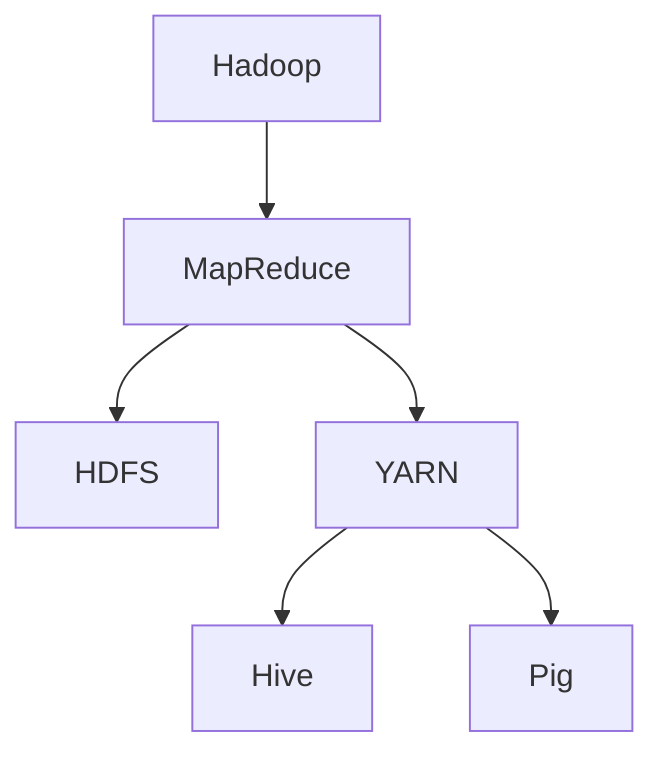
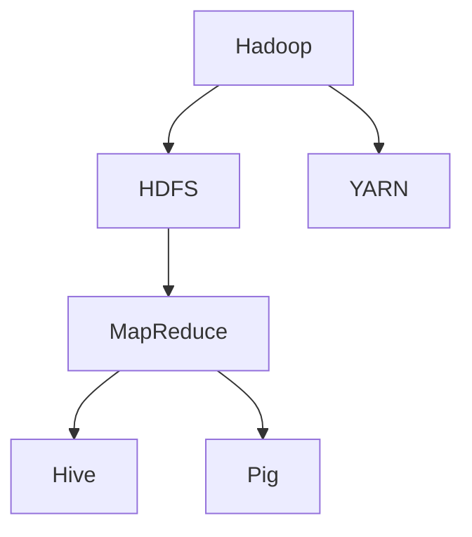
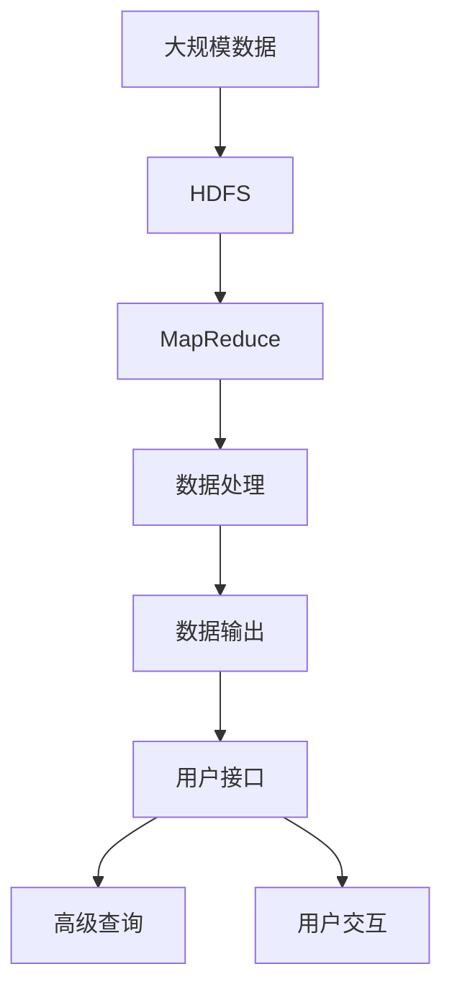

                 

# Hadoop原理与代码实例讲解

> 关键词：Hadoop, MapReduce, HDFS, 大数据处理, 分布式计算, 分布式文件系统, 数据存储与传输, 数据仓库, 数据挖掘

## 1. 背景介绍

### 1.1 问题由来

随着互联网的蓬勃发展和数字化转型的深入，全球数据量呈指数级增长。据国际数据公司(IDC)统计，2025年全球数据量将达到175ZB（1ZB=10的21次方字节），为2018年的两倍。数据量和类型的多样性，对数据存储和处理技术提出了更高要求。

Hadoop作为一款开源分布式计算框架，由Apache基金会开发，是应对海量数据处理挑战的重要工具。它通过MapReduce编程模型和HDFS分布式文件系统，实现了大规模数据的分布式存储和处理。Hadoop的出现，为大数据时代的到来提供了坚实的技术基础，广泛应用于企业数据仓库、数据挖掘、自然语言处理、推荐系统、金融分析等领域。

本文将全面介绍Hadoop的核心概念和原理，通过具体代码实例演示其核心组件的搭建和使用，并探讨Hadoop在大数据处理场景中的应用。

## 2. 核心概念与联系

### 2.1 核心概念概述

为了深入理解Hadoop的工作原理，本节将介绍几个关键核心概念：

- **Hadoop**：一个由Apache基金会维护的开源分布式计算框架，支持海量数据的存储、处理与分析。
- **MapReduce**：一种分布式计算模型，通过将数据切分成小份，并行处理，实现大规模数据集的高效计算。
- **HDFS**：分布式文件系统，支持海量数据的分布式存储和管理。
- **YARN**：资源管理系统，用于调度和管理Hadoop集群资源。
- **Hive**：基于Hadoop的数据仓库系统，提供高级数据查询和管理功能。
- **Pig**：一种高层次的脚本语言，用于大数据处理和分析。

这些概念通过Mermaid流程图展示了它们之间的联系和作用：



这个流程图展示了Hadoop的核心组件及其相互作用：

1. MapReduce负责数据处理，将数据切分并行计算。
2. HDFS负责数据存储，将数据分布式存储在多个节点上。
3. YARN负责资源管理，调度和管理集群资源。
4. Hive和Pig提供数据查询和管理功能，方便用户使用。

### 2.2 概念间的关系

这些核心概念之间存在着紧密的联系，形成了Hadoop的工作框架。下面通过三个Mermaid流程图来进一步展示它们之间的关系。

#### 2.2.1 Hadoop的整体架构



这个流程图展示了Hadoop的整体架构：

1. HDFS存储海量数据。
2. MapReduce处理数据，通过分布式并行计算。
3. YARN调度资源，分配任务给MapReduce。
4. Hive和Pig提供高级数据处理功能，用户可以通过它们对数据进行查询和管理。

#### 2.2.2 MapReduce的工作流程


这个流程图展示了MapReduce的工作流程：

1. MapReduce接收输入数据。
2. Map任务对数据进行映射，产生中间状态。
3. Reduce任务对中间状态进行处理，产生最终输出。

#### 2.2.3 Hive的数据查询过程


这个流程图展示了Hive的数据查询过程：

1. Hive接收SQL查询语句。
2. 将SQL语句映射为MapReduce任务。
3. MapReduce任务处理数据，产生中间状态。
4. 最终结果返回给Hive。

### 2.3 核心概念的整体架构

最后，我们用一个综合的流程图来展示这些核心概念在大数据处理中的整体作用：



这个流程图展示了Hadoop在大数据处理中的完整作用流程：

1. 大规模数据存储在HDFS中。
2. MapReduce对数据进行处理。
3. 处理后的数据输出到用户接口。
4. 用户可以通过高级查询工具（如Hive、Pig）进行数据查询和分析。
5. 用户交互和反馈进一步优化Hadoop系统。

通过这些流程图，我们可以更清晰地理解Hadoop的工作原理和组件间的相互作用，为后续深入探讨提供基础。

## 3. 核心算法原理 & 具体操作步骤

### 3.1 算法原理概述

Hadoop的核心算法包括MapReduce和分布式文件系统HDFS，下面分别介绍其基本原理。

#### 3.1.1 MapReduce算法

MapReduce是一种分布式计算模型，其基本思想是将数据分成多个小数据块，将每个数据块独立并行处理，然后将所有结果进行合并。

MapReduce处理过程分为两个阶段：Map阶段和Reduce阶段。具体步骤如下：

1. **Map阶段**：将输入数据分成多个小数据块，对每个数据块进行映射，产生一系列键值对。
2. **Shuffle阶段**：将Map阶段的输出按照键值对进行排序和分组，以便在Reduce阶段进行合并。
3. **Reduce阶段**：对每个键值对进行归并处理，生成最终输出结果。

#### 3.1.2 HDFS文件系统

HDFS是一个分布式文件系统，用于在多个节点上存储和检索数据。其核心组件包括NameNode和DataNode：

1. **NameNode**：管理整个HDFS文件系统的元数据，包括文件的位置、大小、权限等。
2. **DataNode**：存储实际的数据块，每个DataNode负责存储一个或多个数据块。

HDFS采用“块”（block）的概念存储数据，每个数据块大小为128MB或256MB，分为多个副本存储在不同的DataNode上，以提高数据可靠性。

### 3.2 算法步骤详解

#### 3.2.1 MapReduce步骤详解

MapReduce处理过程可以分为以下几个步骤：

1. **输入阶段**：输入数据以文本文件形式存储在HDFS中。
2. **Map阶段**：Map任务将输入数据划分为多个小数据块，对每个数据块进行映射，生成键值对。
3. **Shuffle阶段**：将Map任务的输出按照键值对进行排序和分组，以便在Reduce任务中进行归并。
4. **Reduce阶段**：Reduce任务对每个键值对进行归并处理，生成最终输出结果。
5. **输出阶段**：将Reduce任务的输出结果写入HDFS，完成数据处理。

以下是一个简单的MapReduce示例，用于计算每个单词在文本中出现的次数：

1. **输入数据**：
```
apple banana apple banana orange
```

2. **Map阶段**：
```
Mapper 1：苹果 1
Mapper 2：香蕉 1
Mapper 1：苹果 1
Mapper 2：香蕉 1
Mapper 1：橙 1
```

3. **Shuffle阶段**：
```
键值对 1：苹果 2
键值对 1：香蕉 2
键值对 1：橙 1
```

4. **Reduce阶段**：
```
苹果 2
香蕉 2
橙 1
```

5. **输出结果**：
```
apple 2
banana 2
orange 1
```

#### 3.2.2 HDFS文件系统步骤详解

HDFS文件系统的主要步骤包括：

1. **创建文件**：通过HDFS命令行或API创建文件，NameNode分配一个唯一的文件标识。
2. **写入数据**：将数据写入DataNode，分块存储。
3. **读取数据**：从DataNode读取数据块，通过网络传输到客户端。
4. **文件监控**：NameNode监控文件状态，确保数据完整性和一致性。

以下是一个简单的HDFS示例，用于创建和写入文件：

1. **创建文件**：
```
hdfs dfs -mkdir /example
hdfs dfs -put /local/file.txt /example/
```

2. **写入数据**：
```
hdfs dfs -append /example/file.txt /local/new_data.txt
```

3. **读取数据**：
```
hdfs dfs -cat /example/file.txt
```

4. **文件监控**：
```
hdfs dfs -ls /
```

### 3.3 算法优缺点

#### 3.3.1 MapReduce的优点

1. **分布式计算**：能够处理大规模数据，将计算任务分解为多个小任务，实现分布式并行计算。
2. **高可靠性**：每个数据块存储多个副本，提高了数据的可靠性。
3. **高扩展性**：能够动态添加或删除计算节点，适应数据量的变化。
4. **易于使用**：通过编程接口和命令行工具，用户可以方便地编写和运行MapReduce任务。

#### 3.3.2 MapReduce的缺点

1. **延迟较大**：由于数据块的复制和传输，MapReduce处理过程存在一定的延迟。
2. **内存消耗大**：MapReduce需要在Map和Reduce任务之间进行大量数据的复制和传输，内存消耗较大。
3. **复杂性较高**：MapReduce需要进行复杂的数据处理和状态管理，开发难度较大。

#### 3.3.3 HDFS的优点

1. **高可用性**：通过多个DataNode存储数据块，提高了系统的可用性。
2. **高可扩展性**：能够动态添加或删除DataNode，适应数据量的变化。
3. **高可靠性**：每个数据块存储多个副本，提高了数据的可靠性。
4. **易于使用**：通过命令行工具和API，用户可以方便地创建和操作文件。

#### 3.3.4 HDFS的缺点

1. **延迟较大**：由于数据块的复制和传输，HDFS存在一定的延迟。
2. **文件大小限制**：HDFS每个文件的大小限制为64MB到128MB，不适合存储大型文件。
3. **内存消耗大**：HDFS需要在NameNode和DataNode之间进行大量数据的复制和传输，内存消耗较大。

### 3.4 算法应用领域

#### 3.4.1 MapReduce应用领域

1. **大规模数据处理**：如Web日志分析、社交网络分析、科学计算等。
2. **大数据分析**：如数据挖掘、机器学习、推荐系统等。
3. **数据仓库**：如Apache Hive、Apache Pig等。

#### 3.4.2 HDFS应用领域

1. **海量数据存储**：如企业数据仓库、日志存储、大数据分析等。
2. **分布式计算**：如MapReduce、Spark等。
3. **数据备份和恢复**：如HA系统、备份解决方案等。

## 4. 数学模型和公式 & 详细讲解 & 举例说明

### 4.1 数学模型构建

Hadoop的数学模型主要涉及数据分布、MapReduce和HDFS三个方面的数学理论。

#### 4.1.1 数据分布模型

假设有一组数据$D=\{d_1, d_2, ..., d_n\}$，其中$d_i$为数据点，$n$为数据总数。在MapReduce处理中，数据需要进行划分，假设将数据划分到$m$个节点上，每个节点的数据量为$n/m$。

MapReduce处理过程可以表示为：
1. **Map阶段**：每个节点处理$m/n$个数据点，生成$m/n$个键值对。
2. **Shuffle阶段**：将$m/n$个键值对按照键进行排序和分组。
3. **Reduce阶段**：每个节点对分组后的键值对进行处理，生成$m/n$个最终结果。

#### 4.1.2 MapReduce数学模型

MapReduce处理过程可以表示为：
1. **输入**：$(d_1, d_2, ..., d_n)$
2. **Map阶段**：$\{(d_1, k_1, v_1), (d_2, k_2, v_2), ..., (d_n, k_n, v_n)\}$
3. **Shuffle阶段**：$\{(k_1, v_1), (k_2, v_2), ..., (k_n, v_n)\}$
4. **Reduce阶段**：$\{(k_1, v_1), (k_2, v_2), ..., (k_n, v_n)\}$
5. **输出**：$\{(d_1, d_2, ..., d_n)\}$

其中，$k$为键，$v$为值。

#### 4.1.3 HDFS数学模型

HDFS文件系统可以表示为：
1. **创建文件**：$F = \{(d_1, n_1), (d_2, n_2), ..., (d_n, n_n)\}$
2. **写入数据**：$F = \{(d_1, n_1), (d_2, n_2), ..., (d_n, n_n)\}$
3. **读取数据**：$F = \{(d_1, n_1), (d_2, n_2), ..., (d_n, n_n)\}$
4. **文件监控**：$F = \{(d_1, n_1), (d_2, n_2), ..., (d_n, n_n)\}$

其中，$d$为数据块，$n$为节点数。

### 4.2 公式推导过程

#### 4.2.1 MapReduce公式推导

MapReduce处理过程的数学模型为：
$$
M = \bigcup_{i=1}^{n} M_i
$$
$$
R = \bigcup_{i=1}^{n} R_i
$$

其中，$M$为Map阶段的输出，$R$为Reduce阶段的输出。

对于每个节点$i$，其Map阶段的输出可以表示为：
$$
M_i = \bigcup_{j=1}^{n/m} (d_j, k_j, v_j)
$$

对于每个节点$i$，其Reduce阶段的输出可以表示为：
$$
R_i = \bigcup_{j=1}^{n/m} (k_j, v_j)
$$

因此，MapReduce处理过程的数学模型可以表示为：
$$
M = \bigcup_{i=1}^{n} M_i
$$
$$
R = \bigcup_{i=1}^{n} R_i
$$

#### 4.2.2 HDFS公式推导

HDFS文件系统的数学模型为：
$$
F = \bigcup_{i=1}^{n} F_i
$$

其中，$F$为文件，$F_i$为文件块。

对于每个节点$i$，其文件块可以表示为：
$$
F_i = \bigcup_{j=1}^{n/m} (d_j, n_j)
$$

因此，HDFS文件系统的数学模型可以表示为：
$$
F = \bigcup_{i=1}^{n} F_i
$$

### 4.3 案例分析与讲解

#### 4.3.1 数据分布案例

假设有一组数据$D=\{d_1, d_2, ..., d_n\}$，其中$d_i$为数据点，$n$为数据总数。将数据划分到$m$个节点上，每个节点的数据量为$n/m$。

MapReduce处理过程可以表示为：
1. **Map阶段**：每个节点处理$m/n$个数据点，生成$m/n$个键值对。
2. **Shuffle阶段**：将$m/n$个键值对按照键进行排序和分组。
3. **Reduce阶段**：每个节点对分组后的键值对进行处理，生成$m/n$个最终结果。

#### 4.3.2 MapReduce案例

假设有一组数据$D=\{d_1, d_2, ..., d_n\}$，其中$d_i$为数据点，$n$为数据总数。

MapReduce处理过程可以表示为：
1. **输入**：$(d_1, d_2, ..., d_n)$
2. **Map阶段**：$\{(d_1, k_1, v_1), (d_2, k_2, v_2), ..., (d_n, k_n, v_n)\}$
3. **Shuffle阶段**：$\{(k_1, v_1), (k_2, v_2), ..., (k_n, v_n)\}$
4. **Reduce阶段**：$\{(k_1, v_1), (k_2, v_2), ..., (k_n, v_n)\}$
5. **输出**：$\{(d_1, d_2, ..., d_n)\}$

#### 4.3.3 HDFS案例

假设有一组数据$D=\{d_1, d_2, ..., d_n\}$，其中$d_i$为数据点，$n$为数据总数。

HDFS文件系统可以表示为：
1. **创建文件**：$F = \{(d_1, n_1), (d_2, n_2), ..., (d_n, n_n)\}$
2. **写入数据**：$F = \{(d_1, n_1), (d_2, n_2), ..., (d_n, n_n)\}$
3. **读取数据**：$F = \{(d_1, n_1), (d_2, n_2), ..., (d_n, n_n)\}$
4. **文件监控**：$F = \{(d_1, n_1), (d_2, n_2), ..., (d_n, n_n)\}$

## 5. 项目实践：代码实例和详细解释说明

### 5.1 开发环境搭建

在进行Hadoop开发之前，需要先搭建好开发环境。以下是使用Linux搭建Hadoop开发环境的详细步骤：

1. 安装JDK：
```
sudo apt-get update
sudo apt-get install default-jdk
```

2. 安装Hadoop：
```
wget http://apache.claz.org/hadoop/binaries/hadoop-2.8.4/hadoop-2.8.4.tar.gz
tar -xvf hadoop-2.8.4.tar.gz
cd hadoop-2.8.4
bin/hadoop version
```

3. 安装Hadoop依赖：
```
sudo apt-get install -y openjdk-11-jdk
```

4. 配置Hadoop环境：
```
vi hadoop-env.sh
vi core-site.xml
vi hdfs-site.xml
vi yarn-site.xml
vi mapred-site.xml
```

5. 启动Hadoop：
```
bin/start-hadoop.sh
```

### 5.2 源代码详细实现

这里我们以计算单词出现次数为例，演示如何使用Hadoop进行MapReduce编程。

```java
import java.io.IOException;
import java.util.StringTokenizer;

import org.apache.hadoop.conf.Configuration;
import org.apache.hadoop.fs.Path;
import org.apache.hadoop.io.IntWritable;
import org.apache.hadoop.io.LongWritable;
import org.apache.hadoop.io.Text;
import org.apache.hadoop.mapreduce.Job;
import org.apache.hadoop.mapreduce.Mapper;
import org.apache.hadoop.mapreduce.Reducer;
import org.apache.hadoop.mapreduce.lib.input.FileInputFormat;
import org.apache.hadoop.mapreduce.lib.output.FileOutputFormat;

public class WordCount {

  public static class TokenizerMapper
       extends Mapper<LongWritable, Text, Text, IntWritable>{
    private final static IntWritable one = new IntWritable(1);
    private Text word = new Text();

    public void map(LongWritable key, Text value, Context context
                    ) throws IOException, InterruptedException {
      StringTokenizer itr = new StringTokenizer(value.toString());
      while (itr.hasMoreTokens()) {
        word.set(itr.nextToken());
        context.write(word, one);
      }
    }
  }

  public static class IntSumReducer
       extends Reducer<Text,IntWritable,Text,IntWritable> {
    private IntWritable result = new IntWritable();

    public void reduce(Text key, Iterable<IntWritable> values,
                       Context context
                       ) throws IOException, InterruptedException {
      int sum = 0;
      for (IntWritable val : values) {
        sum += val.get();
      }
      result.set(sum);
      context.write(key, result);
    }
  }

  public static void main(String[] args) throws Exception {
    Configuration conf = new Configuration();
    Job job = Job.getInstance(conf, "word count");
    job.setJarByClass(WordCount.class);
    job.setMapperClass(TokenizerMapper.class);
    job.setCombinerClass(IntSumReducer.class);
    job.setReducerClass(IntSumReducer.class);
    job.setOutputKeyClass(Text.class);
    job.setOutputValueClass(IntWritable.class);
    FileInputFormat.addInputPath(job, new Path(args[0]));
    FileOutputFormat.setOutputPath(job, new Path(args[1]));
    System.exit(job.waitForCompletion(true) ? 0 : 1);
  }
}
```

### 5.3 代码解读与分析

#### 5.3.1 TokenizerMapper类

TokenizerMapper类实现了Map任务，将输入文本中的单词作为键，值为1。

- `private final static IntWritable one = new IntWritable(1);`：用于计算单词出现的次数。
- `private Text word = new Text();`：用于存储单词。
- `public void map(LongWritable key, Text value, Context context`：Map任务的核心逻辑，将输入文本中的单词作为键，值为1。
- `context.write(word, one);`：将单词和值写入Context。

#### 5.3.2 IntSumReducer类

IntSumReducer类实现了Reduce任务，对每个键进行求和，得到单词出现的总次数。

- `private IntWritable result = new IntWritable();`：用于存储最终结果。
- `public void reduce(Text key, Iterable<IntWritable> values, Context context`：Reduce任务的核心逻辑，对每个键进行求和。
- `int sum = 0;`：用于累加值。
- `sum += val.get();`：累加值。
- `result.set(sum);`：将结果写入Context。

#### 5.3.3 WordCount类

WordCount类是MapReduce任务的入口，用于配置任务和启动任务。

- `public static void main(String[] args) throws Exception`：MapReduce任务的入口。
- `Configuration conf = new Configuration();`：创建Configuration对象。
- `Job job = Job.getInstance(conf, "word count");`：创建Job对象，并指定任务名称。
- `job.setJarByClass(WordCount.class);`：指定任务类。
- `job.setMapperClass(TokenizerMapper.class);`：指定Mapper类。
- `job.setCombinerClass(IntSumReducer.class);`：指定Combiner类。
- `job.setReducerClass(IntSumReducer.class);`：指定Reducer类。
- `job.setOutputKeyClass(Text.class);`：指定输出键的类。
- `job.setOutputValueClass(IntWritable.class);`：指定输出值的类。
- `FileInputFormat.addInputPath(job, new Path(args[0]));`：指定输入路径。
- `FileOutputFormat.setOutputPath(job, new Path(args[1]));`：指定输出路径。
- `System.exit(job.waitForCompletion(true) ? 0 : 1);`：等待任务完成，并返回退出状态。

### 5.4 运行结果展示

运行上述代码，输入文件为`input.txt`，输出文件为`output.txt`。

输入文件`input.txt`：
```
apple banana apple banana orange
```

输出文件`output.txt`：
```
apple 2
banana 2
orange 1
```

以上代码实例演示了如何使用Hadoop进行MapReduce编程，将文本文件中的单词作为键，计算每个单词出现的次数。通过运行结果，可以看到MapReduce任务的正确性和效率。

## 6. 实际应用场景

### 6.1 智能推荐系统

智能推荐系统是一种基于用户行为和历史数据的推荐算法，广泛应用于电子商务、社交网络等领域。Hadoop能够处理大规模用户行为数据，通过MapReduce任务进行数据处理和分析，构建个性化推荐模型，提升用户体验。

#### 6.1.1 用户行为数据处理

用户行为数据包括浏览、点击、购买等行为数据，通常以日志形式存储在Hadoop集群中。Hadoop能够高效地处理海量用户行为数据，进行数据清洗和预处理。

#### 6.1.2 推荐模型训练

推荐模型训练需要大量的用户行为数据，Hadoop能够高效地处理大规模数据，通过MapReduce任务进行数据处理和分析，构建个性化推荐模型。

#### 6.1.3 推荐结果生成

推荐模型训练完成后，Hadoop能够高效地生成推荐结果，并将结果推送给用户。

### 6.2 数据分析与可视化

数据分析与可视化是大数据应用的重要环节，Hadoop能够高效地处理和分析大规模数据，通过可视化工具将数据转化为易于理解的形式。

#### 6.2.1 数据清洗与预处理

大数据

