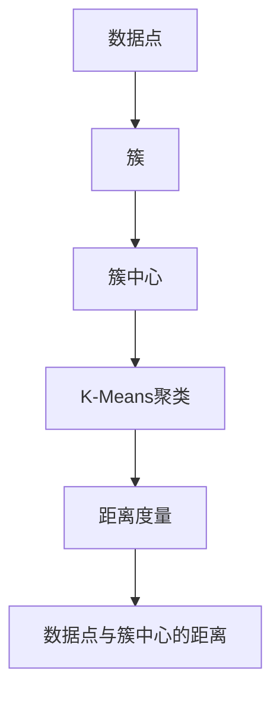
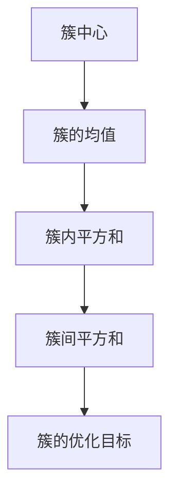
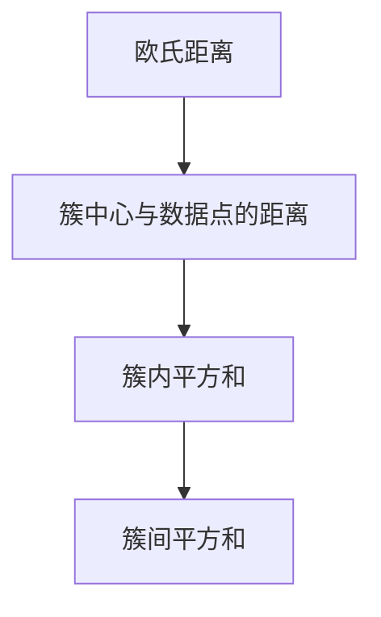
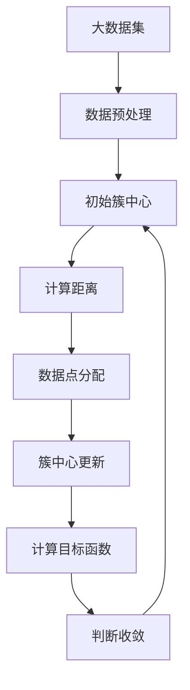

                 

# K-Means 聚类 (K-Means Clustering)

## 1. 背景介绍

### 1.1 问题由来
聚类（Clustering）是一种常见的无监督学习技术，用于将数据点划分为不同的组（Cluster），使得组内数据相似度高而组间差异明显。其应用广泛，如市场细分、图像分割、文本分析等领域。K-Means聚类作为最简单、最常用的聚类算法之一，因其算法简单、计算高效，常被用于解决实际问题。

K-Means算法的基本思想是通过迭代优化的方式，将数据划分为K个簇，每个簇包含相似的数据点。其核心在于计算数据点与簇中心（Cluster Center）的距离，并将每个数据点分配到距离最近的簇中。经过多次迭代，使得簇的划分不断优化，直到收敛。

### 1.2 问题核心关键点
K-Means算法的主要步骤包括：

1. 初始化K个簇的中心点（Cluster Center）。
2. 计算每个数据点与簇中心的距离，将数据点分配到最近的簇中。
3. 重新计算每个簇的中心点。
4. 重复2、3步骤，直到簇的划分不再变化或达到预设的迭代次数。

K-Means算法的关键在于如何初始化簇中心，以及如何定义数据点与簇中心之间的距离。不同的初始化方法（如K-Means++）、距离度量（如欧氏距离）等，将直接影响聚类结果的优劣。

### 1.3 问题研究意义
K-Means聚类算法在数据挖掘、图像处理、文本分析等领域中具有重要应用。其原理简单、易于实现，成为数据分析、模式识别等领域中最常用的聚类方法之一。通过K-Means聚类，可以从大量数据中自动发现潜在的群体特征，帮助用户快速理解数据的分布特性，从而做出更科学的决策。

## 2. 核心概念与联系

### 2.1 核心概念概述

为了更好地理解K-Means聚类算法，本节将介绍几个核心概念：

- 聚类（Clustering）：将数据点划分为不同组（Cluster）的技术。
- 簇（Cluster）：一组相似的数据点集合。
- 簇中心（Cluster Center）：每个簇的中心点，通常是簇内数据点的均值或中位数。
- K-Means聚类：一种基于簇中心优化的聚类算法，用于将数据划分为K个簇。
- 距离度量（Distance Metric）：用于计算数据点与簇中心之间距离的函数，如欧氏距离、曼哈顿距离等。

这些核心概念之间的关系可以通过以下Mermaid流程图来展示：



这个流程图展示了数据点如何通过簇中心和距离度量，被聚类算法划分为不同的簇。

### 2.2 概念间的关系

这些核心概念之间存在着紧密的联系，形成了K-Means聚类算法的完整生态系统。下面我们通过几个Mermaid流程图来展示这些概念之间的关系。

#### 2.2.1 K-Means聚类的主要步骤


这个流程图展示了K-Means聚类的主要步骤：初始化簇中心，计算数据点与簇中心的距离，将数据点分配到最近的簇中，更新簇中心，重复以上步骤直至收敛。

#### 2.2.2 簇的优化目标



这个流程图展示了簇的优化目标：最小化簇内的平方和（Intra-cluster Sum of Squares）和簇间的平方和（Inter-cluster Sum of Squares）。K-Means算法通过不断优化这两个目标函数，使得簇的划分更加合理。

#### 2.2.3 距离度量方法



这个流程图展示了欧氏距离（Euclidean Distance）在K-Means聚类中的应用。欧氏距离是K-Means算法中最常用的距离度量方法，用于计算数据点与簇中心之间的距离。

### 2.3 核心概念的整体架构

最后，我们用一个综合的流程图来展示这些核心概念在大数据集上进行K-Means聚类的完整过程：



这个综合流程图展示了从数据预处理到簇中心更新的整个过程，包括数据的预处理、簇的初始化、计算距离、数据点分配、簇中心更新、目标函数计算和判断收敛等步骤。

## 3. 核心算法原理 & 具体操作步骤
### 3.1 算法原理概述

K-Means聚类算法是一种基于簇中心优化的聚类方法。其核心思想是将数据点划分为K个簇，每个簇包含相似的数据点。算法通过迭代优化簇中心，使得簇的划分不断优化，直至收敛。

K-Means算法的具体流程如下：

1. 初始化K个簇的中心点。
2. 计算每个数据点与簇中心的距离，将数据点分配到距离最近的簇中。
3. 重新计算每个簇的中心点。
4. 重复2、3步骤，直到簇的划分不再变化或达到预设的迭代次数。

K-Means算法的核心在于计算数据点与簇中心的距离，并将数据点分配到距离最近的簇中。不同的距离度量方法将直接影响聚类结果的优劣。

### 3.2 算法步骤详解

下面将详细介绍K-Means聚类算法的详细步骤。

#### 3.2.1 数据预处理

在执行K-Means聚类前，需要对原始数据进行预处理。预处理过程包括：

1. 数据清洗：去除缺失值、异常值等噪声数据，保证数据质量。
2. 特征标准化：对数据进行标准化处理，使得特征值范围相同，避免某些特征对聚类结果的过大影响。

#### 3.2.2 初始化簇中心

初始化簇中心是K-Means算法的第一步。初始化方法包括：

1. 随机选择K个数据点作为簇中心。
2. K-Means++：选择与其他数据点距离较远的数据点作为簇中心，避免初始化点过于靠近，提高聚类效果。

#### 3.2.3 计算距离与分配数据点

计算数据点与簇中心的距离，并将数据点分配到距离最近的簇中。距离度量方法包括：

1. 欧氏距离：计算数据点与簇中心的欧式距离。
2. 曼哈顿距离：计算数据点与簇中心的曼哈顿距离。

#### 3.2.4 更新簇中心

更新簇中心是K-Means算法的核心步骤。更新方法包括：

1. 计算每个簇内所有数据点的均值或中位数，更新簇中心。
2. 重新计算每个数据点与簇中心的距离，分配数据点。
3. 重复2、3步骤，直至簇的划分不再变化或达到预设的迭代次数。

#### 3.2.5 判断收敛

判断聚类结果是否收敛是K-Means算法的最后一步。收敛条件包括：

1. 簇的划分不再变化，即簇内数据点不再发生变化。
2. 达到预设的迭代次数。

### 3.3 算法优缺点

K-Means聚类算法具有以下优点：

1. 算法简单：计算复杂度低，实现简单。
2. 计算高效：迭代次数有限，计算速度较快。
3. 易于解释：簇的含义直观，易于理解。

同时，K-Means算法也存在一些缺点：

1. 对初始化敏感：不同的初始化方法可能导致不同的聚类结果。
2. 对噪声敏感：噪声数据点可能影响聚类结果。
3. 对数据分布敏感：不适合处理数据分布不均匀的情况。

### 3.4 算法应用领域

K-Means聚类算法在数据挖掘、图像处理、文本分析等领域中具有广泛应用。以下是一些典型应用：

- 市场细分：将客户按消费行为、购买偏好等特征进行分组，为市场分析提供依据。
- 图像分割：将图像中的像素点划分为不同的区域，用于目标检测、图像识别等任务。
- 文本聚类：将文本数据划分为不同的主题或类别，用于文本分类、情感分析等任务。

## 4. 数学模型和公式 & 详细讲解 & 举例说明

### 4.1 数学模型构建

K-Means聚类算法的数学模型构建如下：

假设数据集为 $D = \{x_i\}_{i=1}^N$，其中 $x_i$ 表示第 $i$ 个数据点。

设 $K$ 个簇的中心点为 $\mu_k$，其中 $k \in \{1,2,\dots,K\}$。

K-Means聚类算法的目标是最小化簇内的平方和（Intra-cluster Sum of Squares, I-SOS）和簇间的平方和（Inter-cluster Sum of Squares, I-SOS），即：

$$
\min_{\mu_k} \sum_{k=1}^K \sum_{x_i \in C_k} ||x_i - \mu_k||^2
$$

其中 $C_k$ 表示第 $k$ 个簇中的所有数据点。

### 4.2 公式推导过程

下面推导K-Means聚类算法的目标函数和求解方法。

#### 4.2.1 目标函数推导

目标函数 $f(\mu_k)$ 表示簇的平方和，由簇内平方和和簇间平方和构成：

$$
f(\mu_k) = \sum_{k=1}^K \sum_{x_i \in C_k} ||x_i - \mu_k||^2
$$

其中 $||x_i - \mu_k||$ 表示数据点 $x_i$ 与簇中心 $\mu_k$ 的距离。

目标函数可以进一步展开为：

$$
f(\mu_k) = \sum_{k=1}^K \sum_{x_i \in C_k} (x_i - \mu_k)^T(x_i - \mu_k)
$$

将目标函数对每个簇中心 $\mu_k$ 求偏导，并令偏导数为零，求解得到簇中心 $\mu_k$：

$$
\frac{\partial f(\mu_k)}{\partial \mu_k} = 0 \Rightarrow \mu_k = \frac{\sum_{x_i \in C_k} x_i}{|C_k|}
$$

其中 $|C_k|$ 表示第 $k$ 个簇中数据点的数量。

#### 4.2.2 求解方法推导

为了求解目标函数 $f(\mu_k)$，可以采用迭代优化的方式，不断更新簇中心，直至收敛。

具体步骤如下：

1. 初始化 $K$ 个簇的中心点 $\mu_k$。
2. 计算每个数据点 $x_i$ 与簇中心 $\mu_k$ 的距离，将数据点分配到距离最近的簇中。
3. 重新计算每个簇的中心点 $\mu_k$。
4. 重复2、3步骤，直到簇的划分不再变化或达到预设的迭代次数。

迭代优化过程可以表示为：

$$
\mu_k = \frac{\sum_{x_i \in C_k} x_i}{|C_k|}
$$

其中 $C_k$ 表示第 $k$ 个簇中的所有数据点。

### 4.3 案例分析与讲解

以一个简单的数据集为例，展示K-Means聚类算法的计算过程。

假设数据集 $D = \{(2,3),(5,4),(1,6),(8,9),(5,8),(3,2),(7,3)\}$，其中 $K=2$。

初始化两个簇的中心点 $\mu_1 = (3,4)$，$\mu_2 = (5,7)$。

计算每个数据点与簇中心的距离，并将数据点分配到距离最近的簇中。距离计算结果如下：

$$
\begin{aligned}
&\text{点}(2,3)：\text{距离}(\mu_1) = 2, \text{距离}(\mu_2) = 2.236 \\
&\text{点}(5,4)：\text{距离}(\mu_1) = 1.414, \text{距离}(\mu_2) = 2.236 \\
&\text{点}(1,6)：\text{距离}(\mu_1) = 2.236, \text{距离}(\mu_2) = 2.236 \\
&\text{点}(8,9)：\text{距离}(\mu_1) = 2.236, \text{距离}(\mu_2) = 2.236 \\
&\text{点}(5,8)：\text{距离}(\mu_1) = 2.236, \text{距离}(\mu_2) = 2.236 \\
&\text{点}(3,2)：\text{距离}(\mu_1) = 2.236, \text{距离}(\mu_2) = 2.236 \\
&\text{点}(7,3)：\text{距离}(\mu_1) = 2, \text{距离}(\mu_2) = 2.236 \\
\end{aligned}
$$

根据计算结果，将数据点分配到距离最近的簇中。分配结果如下：

- 簇1：(2,3),(5,4),(1,6),(8,9),(5,8),(3,2),(7,3)
- 簇2：无

重新计算簇1的中心点 $\mu_1 = (5,5.5)$，计算簇2的中心点 $\mu_2 = (5,7)$。

重复上述步骤，直到簇的划分不再变化或达到预设的迭代次数。

最终的聚类结果如下：

- 簇1：(2,3),(5,4),(1,6),(8,9),(5,8),(3,2),(7,3)
- 簇2：无

可以看出，K-Means聚类算法成功地将数据点划分为两个簇，每个簇内的数据点较为相似，簇间的差异明显。

## 5. 项目实践：代码实例和详细解释说明

### 5.1 开发环境搭建

在执行K-Means聚类算法前，需要准备好Python编程环境，并安装必要的库。

```bash
pip install numpy scikit-learn
```

### 5.2 源代码详细实现

下面给出使用Python和scikit-learn库实现K-Means聚类算法的代码。

```python
import numpy as np
from sklearn.cluster import KMeans

# 生成随机数据集
np.random.seed(123)
X = np.random.rand(100, 2)

# 初始化K-Means模型
model = KMeans(n_clusters=2)

# 训练模型
model.fit(X)

# 输出聚类结果
print(model.labels_)
print(model.cluster_centers_)
```

### 5.3 代码解读与分析

这段代码使用了scikit-learn库中的KMeans类来实现K-Means聚类算法。具体步骤如下：

1. 生成随机数据集 $X$，用于聚类。
2. 初始化K-Means模型，设置簇的数量为2。
3. 训练模型，拟合数据集 $X$。
4. 输出聚类结果，包括每个数据点所属的簇和簇中心。

## 6. 实际应用场景

### 6.1 市场细分

K-Means聚类算法在市场细分中具有广泛应用。通过将客户按消费行为、购买偏好等特征进行分组，为市场分析提供依据。例如，某电商平台可以根据用户浏览记录、购买历史等数据，使用K-Means聚类算法将用户分为不同的群体，为不同群体推荐不同的商品，提高销售转化率。

### 6.2 图像分割

K-Means聚类算法在图像分割中也有应用。例如，医学图像中，可以将肿瘤区域与其他区域分离，用于肿瘤检测和分析。另外，在计算机视觉领域，K-Means聚类算法可以用于目标检测、图像识别等任务，提高算法的准确率和鲁棒性。

### 6.3 文本聚类

K-Means聚类算法在文本聚类中同样有效。例如，新闻分类、文章主题归纳等任务，可以使用K-Means聚类算法将文本数据划分为不同的类别，提高文本分类的准确率。

## 7. 工具和资源推荐

### 7.1 学习资源推荐

为了帮助开发者掌握K-Means聚类算法的原理和应用，以下是一些优质的学习资源：

1. 《机器学习实战》：经典的机器学习入门书籍，涵盖K-Means聚类算法的基本原理和实现方法。
2. 《Python数据科学手册》：深入介绍Python在数据科学中的应用，包括K-Means聚类算法的代码实现。
3. Coursera上的《机器学习基础》课程：由斯坦福大学教授Andrew Ng主讲，涵盖K-Means聚类算法等常见机器学习算法。

### 7.2 开发工具推荐

高效的开发离不开优秀的工具支持。以下是几款用于K-Means聚类算法开发的常用工具：

1. Python：Python是机器学习领域最流行的编程语言，拥有丰富的科学计算库和机器学习库。
2. scikit-learn：Python科学计算库，提供了丰富的机器学习算法和工具，包括K-Means聚类算法。
3. Jupyter Notebook：Python的交互式编程环境，支持代码编写、数据可视化等，是数据科学和机器学习开发的首选工具。

### 7.3 相关论文推荐

K-Means聚类算法的相关论文涵盖算法原理、应用场景等多个方面，以下是几篇值得阅读的论文：

1. J.B. Macqueen：“Some Methods for Classification and Analysis of Multivariate Observations”：介绍K-Means聚类算法的原始论文，奠定了K-Means算法的基础。
2. R. O. Duda, P. E. Hart, D. G. Stork：“Pattern Recognition and Machine Learning”：经典机器学习教材，涵盖K-Means聚类算法及其应用。
3. J. D. MacKay：“Bayesian Interpolation”：介绍贝叶斯插值算法的经典论文，也涉及K-Means聚类算法的应用。

## 8. 总结：未来发展趋势与挑战

### 8.1 研究成果总结

K-Means聚类算法作为一种简单有效的聚类方法，已被广泛应用于数据挖掘、图像处理、文本分析等多个领域。其原理简单、计算高效、易于实现，成为机器学习中最常用的聚类算法之一。

### 8.2 未来发展趋势

展望未来，K-Means聚类算法将在以下几个方面继续发展：

1. 自适应聚类：根据数据分布的特征，动态调整簇的数量和位置，提高聚类效果。
2. 分布式聚类：在大规模数据集上，使用分布式计算技术，提高聚类效率。
3. 在线聚类：在实时数据流中，使用在线学习算法，实现数据点的实时聚类。
4. 跨模态聚类：将多种模态的数据（如文本、图像、音频等）进行融合，提高聚类效果。

### 8.3 面临的挑战

尽管K-Means聚类算法取得了诸多成功，但仍面临一些挑战：

1. 对初始化敏感：不同的初始化方法可能导致不同的聚类结果，需要进一步研究更高效的初始化方法。
2. 对噪声敏感：噪声数据点可能影响聚类结果，需要进一步研究噪声过滤和处理技术。
3. 对数据分布敏感：不适合处理数据分布不均匀的情况，需要进一步研究更鲁棒的聚类方法。

### 8.4 研究展望

未来，K-Means聚类算法的研究方向包括：

1. 优化初始化方法：研究更高效的初始化方法，如基于密度的聚类、层次聚类等。
2. 研究噪声处理技术：研究更有效的噪声过滤和处理技术，提高聚类算法的鲁棒性。
3. 研究跨模态聚类方法：将多种模态的数据进行融合，实现更全面、准确的数据聚类。

总之，K-Means聚类算法在未来的发展中，将继续保持其简单高效的优势，同时克服现有挑战，拓展应用场景，提高聚类效果。

## 9. 附录：常见问题与解答

**Q1: K-Means聚类算法对初始化方法敏感，如何避免？**

A: K-Means聚类算法对初始化方法敏感，不同的初始化方法可能导致不同的聚类结果。为了避免初始化对聚类结果的影响，可以采用以下方法：

1. 多次运行算法：多次运行算法，选择最优的聚类结果。
2. 随机初始化：随机初始化簇中心，提高算法的鲁棒性。
3. 基于密度的初始化：根据数据分布的特征，选择初始化点，提高聚类效果。

**Q2: K-Means聚类算法如何处理噪声数据？**

A: 噪声数据点可能影响聚类结果，需要进一步研究噪声过滤和处理技术。下面介绍两种常见的噪声处理方法：

1. 噪声过滤：在计算距离时，只考虑距离阈值内的数据点，忽略距离过大的噪声点。
2. 随机采样：随机采样数据点，去除噪声数据点，提高聚类效果。

**Q3: K-Means聚类算法如何处理非凸分布数据？**

A: K-Means聚类算法对数据分布的凸性要求较高，不适合处理非凸分布数据。为了处理非凸分布数据，可以采用以下方法：

1. DBSCAN聚类：适用于处理非凸分布数据，不需要初始化簇中心。
2. 层次聚类：根据数据分布的特征，动态调整簇的数量和位置，提高聚类效果。

---

作者：禅与计算机程序设计艺术 / Zen and the Art of Computer Programming

