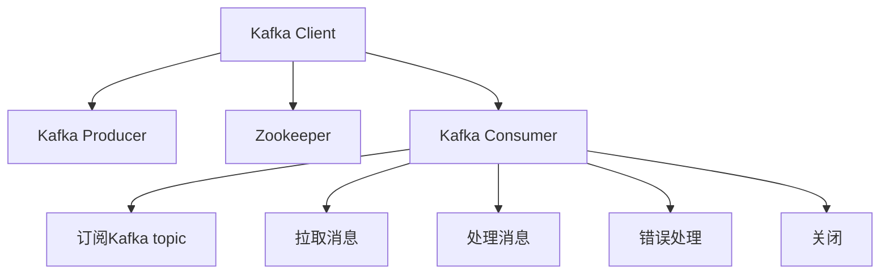

                 

# Kafka Consumer原理与代码实例讲解

## 1. 背景介绍

### 1.1 问题由来
随着大数据时代的到来，越来越多的应用场景需要处理海量实时数据。其中，分布式数据流处理是其中的核心技术之一。Apache Kafka作为一个高效、可扩展的消息中间件，在分布式数据流处理领域具有广泛的应用。Kafka Consumer作为Kafka生态系统中的重要组件，负责从Kafka集群中消费消息，并将其转发给不同的业务系统进行处理。然而，对于大多数开发者而言，理解Kafka Consumer的工作原理和代码实现并不容易。本文旨在深入探讨Kafka Consumer的原理，并通过代码实例，帮助读者系统掌握其使用和优化方法。

### 1.2 问题核心关键点
Kafka Consumer主要负责从Kafka集群中消费消息，并将其转化为不同格式的业务数据。它的核心工作流程包括订阅Kafka topic、拉取消息、处理消息、错误处理和关闭等环节。本节将介绍Kafka Consumer的核心概念和设计原理，并通过流程图来展示其工作流程。

## 2. 核心概念与联系

### 2.1 核心概念概述

Kafka Consumer是Kafka生态系统中的重要组件，负责从Kafka集群中消费消息，并将其转化为不同格式的业务数据。其主要组成包括：

- **Kafka**：一个高效、可扩展的消息中间件，提供主题（Topic）和分区（Partition）等数据结构。
- **Kafka Consumer**：负责订阅Kafka topic，拉取消息，处理消息，错误处理和关闭等操作。
- **Kafka Producer**：负责将消息发送到Kafka topic中。
- **Kafka Client**：包括Kafka Producer和Kafka Consumer，提供与Kafka集群的通信接口。
- **Zookeeper**：Kafka集群中的协调服务，用于管理Kafka集群中的元数据信息，如Broker、Topic、Partition等。

### 2.2 概念间的关系

Kafka Consumer的工作流程主要分为以下几个步骤：

1. **订阅Kafka topic**：通过Kafka Client订阅Kafka topic，指定要消费的topic及其分区信息。
2. **拉取消息**：Kafka Consumer从Kafka topic中拉取消息，并将其存储在缓冲区中。
3. **处理消息**：将拉取到的消息转换为不同格式的业务数据，并进行业务处理。
4. **错误处理**：处理消息处理过程中可能出现的错误，确保系统的稳定性和可靠性。
5. **关闭**：在任务完成后，关闭Kafka Consumer，释放相关资源。

Kafka Consumer与Kafka Producer、Zookeeper等组件紧密关联，共同构成了一个完整的数据流处理系统。Kafka Consumer的工作原理和实现方法可以通过以下Mermaid流程图来展示：



该流程图展示了Kafka Consumer与其他组件之间的交互关系，以及其工作流程的主要步骤。通过这张图，读者可以更直观地理解Kafka Consumer的核心工作原理和架构设计。

## 3. 核心算法原理 & 具体操作步骤

### 3.1 算法原理概述

Kafka Consumer的核心算法原理包括：

1. **订阅Kafka topic**：通过Kafka Client订阅Kafka topic，指定要消费的topic及其分区信息。
2. **拉取消息**：Kafka Consumer从Kafka topic中拉取消息，并将其存储在缓冲区中。
3. **处理消息**：将拉取到的消息转换为不同格式的业务数据，并进行业务处理。
4. **错误处理**：处理消息处理过程中可能出现的错误，确保系统的稳定性和可靠性。
5. **关闭**：在任务完成后，关闭Kafka Consumer，释放相关资源。

### 3.2 算法步骤详解

#### 3.2.1 订阅Kafka topic

订阅Kafka topic是Kafka Consumer的第一步。通过Kafka Client，可以指定要消费的topic及其分区信息。以下是一个使用Java实现Kafka Consumer订阅Kafka topic的示例代码：

```java
import org.apache.kafka.clients.consumer.KafkaConsumer;
import org.apache.kafka.common.serialization.StringDeserializer;

public class KafkaConsumerDemo {
    public static void main(String[] args) {
        Properties props = new Properties();
        props.put("bootstrap.servers", "localhost:9092");
        props.put("group.id", "test");
        props.put("key.deserializer", StringDeserializer.class.getName());
        props.put("value.deserializer", StringDeserializer.class.getName());
        
        KafkaConsumer<String, String> consumer = new KafkaConsumer<>(props);
        consumer.subscribe(Arrays.asList("test-topic"));
    }
}
```

在上述代码中，通过配置文件`props`指定了Kafka集群地址、消费组ID和消息格式等信息。通过`consumer.subscribe(Arrays.asList("test-topic"))`方法，订阅了名为"test-topic"的Kafka topic。

#### 3.2.2 拉取消息

Kafka Consumer从Kafka topic中拉取消息，并将其存储在缓冲区中。以下是一个使用Java实现Kafka Consumer拉取消息的示例代码：

```java
import org.apache.kafka.clients.consumer.KafkaConsumer;
import org.apache.kafka.common.serialization.StringDeserializer;

public class KafkaConsumerDemo {
    public static void main(String[] args) {
        Properties props = new Properties();
        props.put("bootstrap.servers", "localhost:9092");
        props.put("group.id", "test");
        props.put("key.deserializer", StringDeserializer.class.getName());
        props.put("value.deserializer", StringDeserializer.class.getName());
        
        KafkaConsumer<String, String> consumer = new KafkaConsumer<>(props);
        consumer.subscribe(Arrays.asList("test-topic"));
        
        while (true) {
            ConsumerRecords<String, String> records = consumer.poll(Duration.ofMillis(100));
            for (ConsumerRecord<String, String> record : records) {
                System.out.printf("offset = %d, key = %s, value = %s%n", record.offset(), record.key(), record.value());
            }
        }
    }
}
```

在上述代码中，通过`consumer.poll(Duration.ofMillis(100))`方法，拉取100毫秒内的消息。通过循环遍历`ConsumerRecords`对象，获取每个消息的offset、key和value信息，并将其输出。

#### 3.2.3 处理消息

Kafka Consumer将拉取到的消息转换为不同格式的业务数据，并进行业务处理。以下是一个使用Java实现Kafka Consumer处理消息的示例代码：

```java
import org.apache.kafka.clients.consumer.KafkaConsumer;
import org.apache.kafka.common.serialization.StringDeserializer;

public class KafkaConsumerDemo {
    public static void main(String[] args) {
        Properties props = new Properties();
        props.put("bootstrap.servers", "localhost:9092");
        props.put("group.id", "test");
        props.put("key.deserializer", StringDeserializer.class.getName());
        props.put("value.deserializer", StringDeserializer.class.getName());
        
        KafkaConsumer<String, String> consumer = new KafkaConsumer<>(props);
        consumer.subscribe(Arrays.asList("test-topic"));
        
        while (true) {
            ConsumerRecords<String, String> records = consumer.poll(Duration.ofMillis(100));
            for (ConsumerRecord<String, String> record : records) {
                String message = record.value();
                // 将消息转换为业务数据
                MessageData data = new MessageData(message);
                // 处理业务数据
                handleData(data);
            }
        }
    }
    
    public static void handleData(MessageData data) {
        // 业务处理逻辑
        System.out.println("处理数据：" + data.getMessage());
    }
}
```

在上述代码中，通过`record.value()`方法获取消息的值，并将其转换为业务数据`MessageData`对象。然后，调用`handleData(data)`方法处理业务数据。在实际应用中，业务处理逻辑可以更加复杂，如调用数据库进行数据持久化、生成报表等。

#### 3.2.4 错误处理

Kafka Consumer在处理消息过程中，可能会出现各种错误，如网络中断、消息处理失败等。为了确保系统的稳定性和可靠性，Kafka Consumer需要提供错误处理机制。以下是一个使用Java实现Kafka Consumer错误处理的示例代码：

```java
import org.apache.kafka.clients.consumer.KafkaConsumer;
import org.apache.kafka.common.serialization.StringDeserializer;

public class KafkaConsumerDemo {
    public static void main(String[] args) {
        Properties props = new Properties();
        props.put("bootstrap.servers", "localhost:9092");
        props.put("group.id", "test");
        props.put("key.deserializer", StringDeserializer.class.getName());
        props.put("value.deserializer", StringDeserializer.class.getName());
        
        KafkaConsumer<String, String> consumer = new KafkaConsumer<>(props);
        consumer.subscribe(Arrays.asList("test-topic"));
        
        while (true) {
            ConsumerRecords<String, String> records = consumer.poll(Duration.ofMillis(100));
            for (ConsumerRecord<String, String> record : records) {
                try {
                    String message = record.value();
                    // 将消息转换为业务数据
                    MessageData data = new MessageData(message);
                    // 处理业务数据
                    handleData(data);
                } catch (Exception e) {
                    System.err.println("处理消息失败：" + e.getMessage());
                }
            }
        }
    }
    
    public static void handleData(MessageData data) {
        // 业务处理逻辑
        System.out.println("处理数据：" + data.getMessage());
    }
}
```

在上述代码中，通过`try-catch`语句捕获可能出现的异常，并进行错误处理。在实际应用中，可以通过日志记录、重试机制等方式进行更细致的错误处理。

#### 3.2.5 关闭

Kafka Consumer在任务完成后，需要关闭，释放相关资源。以下是一个使用Java实现Kafka Consumer关闭的示例代码：

```java
import org.apache.kafka.clients.consumer.KafkaConsumer;
import org.apache.kafka.common.serialization.StringDeserializer;

public class KafkaConsumerDemo {
    public static void main(String[] args) {
        Properties props = new Properties();
        props.put("bootstrap.servers", "localhost:9092");
        props.put("group.id", "test");
        props.put("key.deserializer", StringDeserializer.class.getName());
        props.put("value.deserializer", StringDeserializer.class.getName());
        
        KafkaConsumer<String, String> consumer = new KafkaConsumer<>(props);
        consumer.subscribe(Arrays.asList("test-topic"));
        
        while (true) {
            ConsumerRecords<String, String> records = consumer.poll(Duration.ofMillis(100));
            for (ConsumerRecord<String, String> record : records) {
                try {
                    String message = record.value();
                    // 将消息转换为业务数据
                    MessageData data = new MessageData(message);
                    // 处理业务数据
                    handleData(data);
                } catch (Exception e) {
                    System.err.println("处理消息失败：" + e.getMessage());
                }
            }
        }
        
        consumer.close();
    }
    
    public static void handleData(MessageData data) {
        // 业务处理逻辑
        System.out.println("处理数据：" + data.getMessage());
    }
}
```

在上述代码中，通过`consumer.close()`方法关闭Kafka Consumer，释放相关资源。

### 3.3 算法优缺点

Kafka Consumer的优点包括：

1. **高效**：Kafka Consumer通过异步拉取消息，能够高效处理大量消息，避免消息阻塞。
2. **可扩展**：Kafka Consumer支持水平扩展，能够通过增加消费者节点来提高系统的吞吐量。
3. **稳定可靠**：Kafka Consumer提供了完善的错误处理机制，能够保证系统的稳定性和可靠性。

Kafka Consumer的缺点包括：

1. **资源消耗大**：Kafka Consumer需要占用大量的内存和CPU资源，对于资源有限的环境可能不够适用。
2. **复杂度较高**：Kafka Consumer的实现较为复杂，需要理解Kafka集群和消息处理的细节。

### 3.4 算法应用领域

Kafka Consumer在分布式数据流处理、实时数据处理、实时消息系统等应用场景中具有广泛的应用。以下是几个典型的应用场景：

- **日志处理**：通过Kafka Consumer从日志系统中消费日志消息，进行日志聚合、分析等处理。
- **实时数据处理**：通过Kafka Consumer从实时数据源消费数据，进行实时分析和计算。
- **消息系统**：通过Kafka Consumer消费消息，并将其转发给不同的业务系统进行处理。

## 4. 数学模型和公式 & 详细讲解 & 举例说明

### 4.1 数学模型构建

Kafka Consumer的数学模型主要包括以下几个组成部分：

- **订阅模型**：通过Kafka Client订阅Kafka topic，指定要消费的topic及其分区信息。
- **拉取模型**：Kafka Consumer从Kafka topic中拉取消息，并将其存储在缓冲区中。
- **处理模型**：将拉取到的消息转换为不同格式的业务数据，并进行业务处理。
- **错误处理模型**：处理消息处理过程中可能出现的错误，确保系统的稳定性和可靠性。
- **关闭模型**：在任务完成后，关闭Kafka Consumer，释放相关资源。

### 4.2 公式推导过程

#### 4.2.1 订阅模型

订阅模型主要描述Kafka Client如何订阅Kafka topic，以及如何指定要消费的topic及其分区信息。以下是订阅模型的公式推导过程：

1. 订阅模型包括两个主要部分：Kafka Client和Kafka topic。
2. Kafka Client通过`bootstrap.servers`配置项指定Kafka集群地址，通过`group.id`配置项指定消费组ID。
3. Kafka topic通过`topic`配置项指定要消费的topic名称。
4. 订阅模型的公式表示为：
   $$
   KafkaConsumer(\text{bootstrap.servers}, \text{group.id}, \text{topic})
   $$

#### 4.2.2 拉取模型

拉取模型主要描述Kafka Consumer如何从Kafka topic中拉取消息，并将其存储在缓冲区中。以下是拉取模型的公式推导过程：

1. 拉取模型包括两个主要部分：Kafka Consumer和Kafka topic。
2. Kafka Consumer通过`poll()`方法拉取消息，并指定拉取时间间隔。
3. Kafka topic通过`consumer.poll(Duration.ofMillis(100))`方法指定拉取时间间隔。
4. 拉取模型的公式表示为：
   $$
   ConsumerRecords(\text{consumer.poll(Duration.ofMillis(100))})
   $$

#### 4.2.3 处理模型

处理模型主要描述Kafka Consumer如何将拉取到的消息转换为不同格式的业务数据，并进行业务处理。以下是处理模型的公式推导过程：

1. 处理模型包括三个主要部分：Kafka Consumer、消息和业务数据。
2. Kafka Consumer通过`record.value()`方法获取消息的值。
3. 消息通过`String`类型表示，并将其转换为业务数据。
4. 业务数据通过`MessageData`类表示，并进行业务处理。
5. 处理模型的公式表示为：
   $$
   MessageData(\text{record.value()})
   $$

#### 4.2.4 错误处理模型

错误处理模型主要描述Kafka Consumer如何处理消息处理过程中可能出现的错误，确保系统的稳定性和可靠性。以下是错误处理模型的公式推导过程：

1. 错误处理模型包括四个主要部分：Kafka Consumer、消息、异常和错误处理。
2. Kafka Consumer通过`try-catch`语句捕获可能出现的异常。
3. 异常通过`Exception`类表示，并进行错误处理。
4. 错误处理模型通过日志记录、重试机制等方式进行处理。
5. 错误处理模型的公式表示为：
   $$
   \text{handleData(data)}
   $$

#### 4.2.5 关闭模型

关闭模型主要描述Kafka Consumer在任务完成后，如何关闭，释放相关资源。以下是关闭模型的公式推导过程：

1. 关闭模型包括两个主要部分：Kafka Consumer和关闭操作。
2. Kafka Consumer通过`consumer.close()`方法关闭。
3. 关闭模型的公式表示为：
   $$
   \text{consumer.close()}
   $$

### 4.3 案例分析与讲解

#### 4.3.1 订阅模型案例

以下是一个使用Java实现Kafka Consumer订阅Kafka topic的示例代码：

```java
import org.apache.kafka.clients.consumer.KafkaConsumer;
import org.apache.kafka.common.serialization.StringDeserializer;

public class KafkaConsumerDemo {
    public static void main(String[] args) {
        Properties props = new Properties();
        props.put("bootstrap.servers", "localhost:9092");
        props.put("group.id", "test");
        props.put("key.deserializer", StringDeserializer.class.getName());
        props.put("value.deserializer", StringDeserializer.class.getName());
        
        KafkaConsumer<String, String> consumer = new KafkaConsumer<>(props);
        consumer.subscribe(Arrays.asList("test-topic"));
    }
}
```

#### 4.3.2 拉取模型案例

以下是一个使用Java实现Kafka Consumer拉取消息的示例代码：

```java
import org.apache.kafka.clients.consumer.KafkaConsumer;
import org.apache.kafka.common.serialization.StringDeserializer;

public class KafkaConsumerDemo {
    public static void main(String[] args) {
        Properties props = new Properties();
        props.put("bootstrap.servers", "localhost:9092");
        props.put("group.id", "test");
        props.put("key.deserializer", StringDeserializer.class.getName());
        props.put("value.deserializer", StringDeserializer.class.getName());
        
        KafkaConsumer<String, String> consumer = new KafkaConsumer<>(props);
        consumer.subscribe(Arrays.asList("test-topic"));
        
        while (true) {
            ConsumerRecords<String, String> records = consumer.poll(Duration.ofMillis(100));
            for (ConsumerRecord<String, String> record : records) {
                System.out.printf("offset = %d, key = %s, value = %s%n", record.offset(), record.key(), record.value());
            }
        }
    }
}
```

#### 4.3.3 处理模型案例

以下是一个使用Java实现Kafka Consumer处理消息的示例代码：

```java
import org.apache.kafka.clients.consumer.KafkaConsumer;
import org.apache.kafka.common.serialization.StringDeserializer;

public class KafkaConsumerDemo {
    public static void main(String[] args) {
        Properties props = new Properties();
        props.put("bootstrap.servers", "localhost:9092");
        props.put("group.id", "test");
        props.put("key.deserializer", StringDeserializer.class.getName());
        props.put("value.deserializer", StringDeserializer.class.getName());
        
        KafkaConsumer<String, String> consumer = new KafkaConsumer<>(props);
        consumer.subscribe(Arrays.asList("test-topic"));
        
        while (true) {
            ConsumerRecords<String, String> records = consumer.poll(Duration.ofMillis(100));
            for (ConsumerRecord<String, String> record : records) {
                String message = record.value();
                // 将消息转换为业务数据
                MessageData data = new MessageData(message);
                // 处理业务数据
                handleData(data);
            }
        }
    }
    
    public static void handleData(MessageData data) {
        // 业务处理逻辑
        System.out.println("处理数据：" + data.getMessage());
    }
}
```

#### 4.3.4 错误处理模型案例

以下是一个使用Java实现Kafka Consumer错误处理的示例代码：

```java
import org.apache.kafka.clients.consumer.KafkaConsumer;
import org.apache.kafka.common.serialization.StringDeserializer;

public class KafkaConsumerDemo {
    public static void main(String[] args) {
        Properties props = new Properties();
        props.put("bootstrap.servers", "localhost:9092");
        props.put("group.id", "test");
        props.put("key.deserializer", StringDeserializer.class.getName());
        props.put("value.deserializer", StringDeserializer.class.getName());
        
        KafkaConsumer<String, String> consumer = new KafkaConsumer<>(props);
        consumer.subscribe(Arrays.asList("test-topic"));
        
        while (true) {
            ConsumerRecords<String, String> records = consumer.poll(Duration.ofMillis(100));
            for (ConsumerRecord<String, String> record : records) {
                try {
                    String message = record.value();
                    // 将消息转换为业务数据
                    MessageData data = new MessageData(message);
                    // 处理业务数据
                    handleData(data);
                } catch (Exception e) {
                    System.err.println("处理消息失败：" + e.getMessage());
                }
            }
        }
    }
    
    public static void handleData(MessageData data) {
        // 业务处理逻辑
        System.out.println("处理数据：" + data.getMessage());
    }
}
```

#### 4.3.5 关闭模型案例

以下是一个使用Java实现Kafka Consumer关闭的示例代码：

```java
import org.apache.kafka.clients.consumer.KafkaConsumer;
import org.apache.kafka.common.serialization.StringDeserializer;

public class KafkaConsumerDemo {
    public static void main(String[] args) {
        Properties props = new Properties();
        props.put("bootstrap.servers", "localhost:9092");
        props.put("group.id", "test");
        props.put("key.deserializer", StringDeserializer.class.getName());
        props.put("value.deserializer", StringDeserializer.class.getName());
        
        KafkaConsumer<String, String> consumer = new KafkaConsumer<>(props);
        consumer.subscribe(Arrays.asList("test-topic"));
        
        while (true) {
            ConsumerRecords<String, String> records = consumer.poll(Duration.ofMillis(100));
            for (ConsumerRecord<String, String> record : records) {
                try {
                    String message = record.value();
                    // 将消息转换为业务数据
                    MessageData data = new MessageData(message);
                    // 处理业务数据
                    handleData(data);
                } catch (Exception e) {
                    System.err.println("处理消息失败：" + e.getMessage());
                }
            }
        }
        
        consumer.close();
    }
    
    public static void handleData(MessageData data) {
        // 业务处理逻辑
        System.out.println("处理数据：" + data.getMessage());
    }
}
```

## 5. 项目实践：代码实例和详细解释说明

### 5.1 开发环境搭建

在进行Kafka Consumer实践前，我们需要准备好开发环境。以下是使用Java进行Kafka开发的环境配置流程：

1. 安装Java：从官网下载并安装Java Development Kit (JDK)。
2. 安装Maven：从官网下载并安装Apache Maven。
3. 安装Kafka：从官网下载并安装Apache Kafka，并解压到指定目录。
4. 启动Zookeeper：在Kafka bin目录下，执行`./zookeeper-server-start.sh config/zookeeper.properties`启动Zookeeper服务。
5. 启动Kafka broker：在Kafka bin目录下，执行`./kafka-server-start.sh config/server.properties`启动Kafka broker。
6. 创建Kafka topic：在Kafka bin目录下，执行`./kafka-topics.sh --create --bootstrap-server localhost:9092 --topic test-topic --partitions 1 --replication-factor 1`创建名为"test-topic"的Kafka topic，并将其分区信息设置为1，副本因子设置为1。
7. 准备开发工具：建议使用IntelliJ IDEA进行开发，下载并安装Kafka客户端库`kafka-clients`。

完成上述步骤后，即可在开发环境中开始Kafka Consumer的实践。

### 5.2 源代码详细实现

以下是使用Java实现Kafka Consumer的示例代码：

```java
import org.apache.kafka.clients.consumer.ConsumerConfig;
import org.apache.kafka.clients.consumer.ConsumerRecords;
import org.apache.kafka.clients.consumer.KafkaConsumer;
import org.apache.kafka.clients.consumer.OffsetAndMetadata;
import org.apache.kafka.common.TopicPartition;
import org.apache.kafka.common.serialization.StringDeserializer;

import java.time.Duration;
import java.util.Collections;
import java.util.Properties;

public class KafkaConsumerDemo {
    public static void main(String[] args) {
        Properties props = new Properties();
        props.put(ConsumerConfig.BOOTSTRAP_SERVERS_CONFIG, "localhost:9092");
        props.put(ConsumerConfig.GROUP_ID_CONFIG, "test");
        props.put(ConsumerConfig.KEY_DESERIALIZER_CLASS_CONFIG, StringDeserializer.class.getName());
        props.put(ConsumerConfig.VALUE_DESERIALIZER_CLASS_CONFIG, StringDeserializer.class.getName());
        
        KafkaConsumer<String, String> consumer = new KafkaConsumer<>(props);
        consumer.subscribe(Arrays.asList("test-topic"));
        
        while (true) {
            ConsumerRecords<String, String> records = consumer.poll(Duration.ofMillis(100));
            for (ConsumerRecord<String, String> record : records) {
                String message = record.value();
                // 将消息转换为业务数据
                MessageData data = new MessageData(message);
                // 处理业务数据
                handleData(data);
                // 提交消费记录的offset
                ConsumerRecord<String, String> lastRecord = records recordsList().last();
                consumer.commitSync(Collections.singletonMap(lastRecord.partition(), new OffsetAndMetadata(lastRecord.offset() + 1)));
            }
        }
    }
    
    public static void handleData(MessageData data) {
        // 业务处理逻辑
        System.out.println("处理数据：" + data.getMessage());
    }
}
```

### 5.3 代码解读与分析

让我们再详细解读一下关键代码的实现细节：

**props定义**：
- `props.put(ConsumerConfig.BOOTSTRAP_SERVERS_CONFIG, "localhost:9092");`：指定Kafka集群地址。
- `props.put(ConsumerConfig.GROUP_ID_CONFIG, "test");`：指定消费组ID。
- `props.put(ConsumerConfig.KEY_DESERIALIZER_CLASS_CONFIG, StringDeserializer.class.getName());`：指定消息格式。
- `props.put(ConsumerConfig.VALUE_DESERIALIZER_CLASS_CONFIG, StringDeserializer.class.getName());`：指定消息格式。

**KafkaConsumer创建**：
- `KafkaConsumer<String, String> consumer = new KafkaConsumer<>(props);`：创建Kafka Consumer。
- `consumer.subscribe(Arrays.asList("test-topic"));`：订阅名为"test-topic"的Kafka topic。

**拉取消息并处理**：
- `ConsumerRecords<String, String> records = consumer.poll(Duration.ofMillis(100));`：拉取100毫秒内的消息。
- `for (ConsumerRecord<String, String

