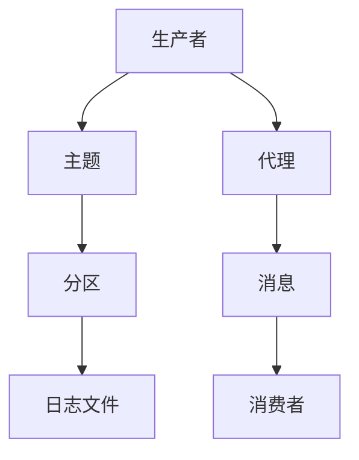
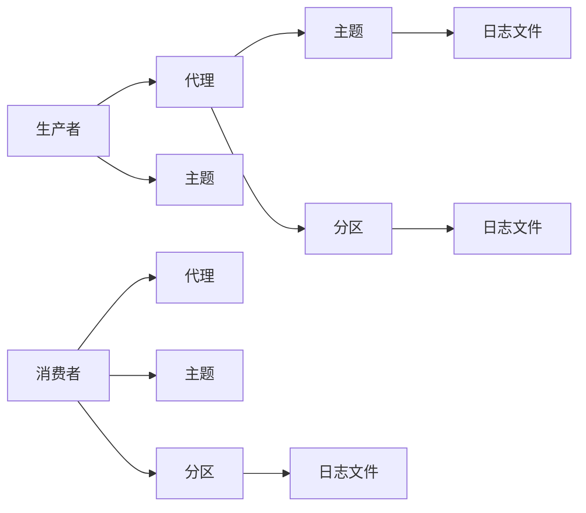

                 

# Kafka原理与代码实例讲解

## 1. 背景介绍

### 1.1 问题由来

Kafka作为一个高效、可靠、分布式的消息中间件，被广泛应用于各种大规模、高吞吐量的数据流处理场景中。无论是实时数据流传输、日志收集、批处理、流式计算还是事件驱动架构，Kafka都展示了其强大的能力和灵活性。然而，Kafka的复杂性和庞大的代码库，使得很多开发者难以深入理解其内部机制，也无法快速高效地使用其丰富的功能。

为了帮助广大开发者深入理解Kafka的原理，快速上手使用，本文将从Kafka的基本概念入手，逐步深入探讨其核心算法原理，并以代码实例的形式，详细讲解Kafka的构建和应用。文章将涵盖Kafka的基本架构、核心组件、消息处理机制、数据存储与复制、生产者与消费者交互、集群管理与故障恢复、安全与隐私保护等方面的内容。

### 1.2 问题核心关键点

Kafka的核心概念包括生产者（Producer）、消费者（Consumer）、代理（Broker）、主题（Topic）、分区（Partition）和消息（Message）。Kafka的消息流数据模型是其区别于其他消息中间件的关键特征。Kafka的消息模型基于发布-订阅模式，生产者将消息发布到指定主题，消费者则订阅该主题，接收其中的消息。分区（Partition）是将一个大主题分成多个小分区（也称为分区副本），用于负载均衡和冗余备份。每个分区内部维护一个有序的消息队列，消费者可以按照特定顺序读取消息。

Kafka的核心目标是为用户提供高吞吐量、低延迟、可靠的数据流传输服务，其主要优势包括：

- 可扩展性：Kafka集群可以水平扩展，支持海量数据流处理。
- 可靠性：Kafka的消息持久化存储、副本机制和数据复制策略，确保了数据的可靠性和持久性。
- 高性能：Kafka采用异步通信、批量发送、消息压缩等技术，大幅提升了数据流传输效率。
- 容错性：Kafka集群具备自愈合能力，能够在节点故障、网络故障等异常情况下，保证数据流的高可用性。

## 2. 核心概念与联系

### 2.1 核心概念概述

为了更好地理解Kafka的工作原理，本节将介绍几个核心概念及其之间的联系。

#### 2.1.1 生产者（Producer）

生产者是向Kafka集群发送消息的客户端。每个生产者对应一个或多个主题，可以批量发送消息。生产者可以将消息直接写入Kafka分区，也可以将消息缓存到缓冲区中，待缓冲区满后再批量发送。

#### 2.1.2 消费者（Consumer）

消费者是从Kafka集群中读取消息的客户端。消费者可以选择订阅一个或多个主题，并且可以并行读取多个分区的消息。消费者从分区中读取消息时，可以指定消息的偏移量，从而保证消息的顺序性。

#### 2.1.3 代理（Broker）

代理是Kafka集群的核心组件，负责接收、存储和转发消息。每个代理维护多个分区，一个分区对应一个有序的消息队列。代理通过心跳机制维护集群状态，通过数据复制机制实现数据冗余。

#### 2.1.4 主题（Topic）

主题是Kafka集群中用于存储消息的容器，可以看作是一个逻辑上的数据流通道。每个主题可以包含多个分区，每个分区用于存储有序的消息队列。

#### 2.1.5 分区（Partition）

分区是Kafka中用于负载均衡和冗余备份的概念，一个主题可以包含多个分区。分区可以存储有序的消息队列，消费者可以按照特定顺序读取消息。每个分区对应一个日志文件（Log File）。

#### 2.1.6 消息（Message）

消息是Kafka集群中传输的基本单位，包含一个键（Key）、一个值（Value）、一个时间戳（Timestamp）和一个可选的元数据（Metadata）。消息在Kafka集群中传输时，会被按照分区和主题进行路由。

这些核心概念通过发布-订阅模式、分区机制和消息模型，共同构成了Kafka的消息流处理框架。下面通过一个简单的Mermaid流程图来展示Kafka的工作流程。



### 2.2 概念间的关系

Kafka的核心概念通过相互配合，实现了一个高效、可靠、分布式的消息流处理系统。下面通过一个更详细的Mermaid流程图来展示Kafka的工作原理。



这个流程图展示了Kafka的消息流处理过程：

1. 生产者将消息发送给代理。
2. 代理接收消息，并将其路由到指定主题。
3. 代理将消息存储到指定分区的日志文件中。
4. 消费者从代理接收消息，并将其解析为消息。
5. 消费者按照消息的偏移量从日志文件中读取消息。
6. 多个分区可以同时存储消息，提高集群的数据处理能力。

通过这些核心概念的相互配合，Kafka实现了高效、可靠、分布式的消息流处理。接下来，我们将深入探讨Kafka的核心算法原理，以便更好地理解其内部机制和应用场景。

## 3. 核心算法原理 & 具体操作步骤

### 3.1 算法原理概述

Kafka的核心算法包括数据复制、日志压缩、消息存储和传输优化等。下面将逐一介绍这些核心算法原理。

#### 3.1.1 数据复制

Kafka的消息持久化存储通过数据复制机制实现，每个分区对应多个副本，用于提高数据冗余和容错性。Kafka支持同步复制（In-Sync Replicas, ISR）和异步复制。同步复制要求所有副本都成功写入消息后，生产者才能认为消息成功写入。异步复制则允许生产者发送消息后即认为消息成功写入。

Kafka的数据复制机制包括：

- 领导者（Leader）：每个分区只有一个领导者，负责接收生产者的消息和处理消费者的读取请求。
- 同步副本（ISR）：领导者副本以外的副本称为同步副本，同步副本与领导者副本保持同步。
- 非同步副本（Non-ISR）：非同步副本与领导者副本保持异步复制关系。

#### 3.1.2 日志压缩

Kafka支持消息的压缩存储，通过压缩可以减少存储需求和传输带宽。Kafka支持四种消息压缩算法：Gzip、Snappy、LZ4和Zstd。Kafka的日志文件（Log File）在写入时会被压缩，读出时会被解压缩，从而降低存储和传输的资源消耗。

#### 3.1.3 消息存储

Kafka的消息存储在每个分区的日志文件中，日志文件以小文件形式存储，可以支持海量数据的持久化存储。每个日志文件包含多个消息记录，每个消息记录包含键、值、时间戳和元数据。Kafka支持追加日志文件的机制，使得消息记录可以在文件末尾追加，从而减少写操作的开销。

#### 3.1.4 消息传输优化

Kafka的消息传输优化包括批量发送和批量接收机制。批量发送机制将多个消息记录打包成一个批次发送，减少网络传输开销。批量接收机制将多个消息记录打包成一个批次接收，提高消息处理的效率。

### 3.2 算法步骤详解

#### 3.2.1 生产者与代理的交互

生产者将消息发送给代理的过程包括：

1. 生产者连接代理，获取代理的元数据。
2. 生产者选择目标分区，将消息提交到分区的领导者副本。
3. 领导者副本接收消息，并同步到同步副本。
4. 生产者接收到消息发送确认。

#### 3.2.2 代理与消费者的交互

消费者从代理接收消息的过程包括：

1. 消费者连接代理，获取代理的元数据。
2. 消费者订阅目标主题，并选择目标分区。
3. 代理将消息从分区的领导者副本发送到消费者的缓冲区。
4. 消费者从缓冲区中读取消息，并解析消息。

#### 3.2.3 数据复制机制

Kafka的数据复制机制包括：

1. 领导者选举：在分区启动时，随机选择一个领导者副本。
2. 同步副本管理：领导者副本将消息同步到同步副本，同步副本通过心跳机制与领导者副本保持联系。
3. 非同步副本管理：非同步副本与领导者副本保持异步复制关系，同步副本可以异步同步到非同步副本。

#### 3.2.4 日志压缩机制

Kafka的日志压缩机制包括：

1. 压缩算法选择：根据日志文件的大小和网络传输带宽选择合适的压缩算法。
2. 压缩和解压缩：在日志文件写入时进行压缩，读取时进行解压缩。
3. 压缩度控制：根据日志文件的大小和系统负载控制压缩度，以平衡压缩效果和性能开销。

#### 3.2.5 消息存储机制

Kafka的消息存储机制包括：

1. 日志文件创建：在分区启动时创建日志文件。
2. 消息记录写入：在日志文件中写入消息记录。
3. 追加写入机制：将消息记录追加到日志文件末尾，减少写操作的开销。

### 3.3 算法优缺点

Kafka的核心算法具有以下优点：

1. 高可靠性：数据复制和日志冗余机制确保了数据的可靠性和持久性。
2. 高性能：批量发送和批量接收机制，压缩算法和追加写入机制大幅提升了数据流传输效率。
3. 可扩展性：分区的负载均衡机制和数据复制机制支持水平扩展，支持海量数据流处理。
4. 自愈合能力：Kafka具备自愈合能力，能够在节点故障、网络故障等异常情况下，保证数据流的高可用性。

Kafka的核心算法也存在以下缺点：

1. 复杂性高：Kafka的内部机制复杂，难以快速上手。
2. 配置繁琐：Kafka的配置参数较多，配置不当可能导致系统性能下降。
3. 内存占用高：Kafka的内存占用较高，需要较大的硬件资源支持。
4. 性能瓶颈：Kafka在高并发场景下可能会遇到性能瓶颈，需要合理配置参数和优化架构。

### 3.4 算法应用领域

Kafka的核心算法广泛应用于各种大规模、高吞吐量的数据流处理场景中，包括：

1. 实时数据流传输：Kafka可以处理海量实时数据流，支持高吞吐量、低延迟的数据传输。
2. 日志收集：Kafka可以高效地收集和存储大量日志数据，支持日志查询和分析。
3. 流式计算：Kafka可以与Spark、Flink等流式计算框架结合，实现复杂的数据流处理和分析。
4. 事件驱动架构：Kafka可以作为事件驱动架构的基础，实现异步通信和事件驱动的业务逻辑。
5. 流数据监控：Kafka可以用于实时流数据的监控和告警，支持异常检测和告警触发。
6. 分布式事务：Kafka可以实现分布式事务处理，支持跨分区的数据一致性和事务处理。

## 4. 数学模型和公式 & 详细讲解 & 举例说明

### 4.1 数学模型构建

Kafka的消息流模型基于发布-订阅模式，可以形式化表示为：

- 生产者（Producer）：将消息 $M$ 发布到主题 $T$ 的分区 $P$。
- 代理（Broker）：接收生产者的消息，并将消息存储到分区 $P$ 的日志文件 $L$ 中。
- 消费者（Consumer）：订阅主题 $T$ 的分区 $P$，从日志文件 $L$ 中读取消息 $M$。

消息 $M$ 的形式化表示为：

$$
M = (K, V, T, P, T_s, M_t, M_o)
$$

其中：
- $K$ 为键，用于唯一标识消息。
- $V$ 为值，为消息的实际内容。
- $T$ 为主题，消息所属的容器。
- $P$ 为分区，消息所属的有序队列。
- $T_s$ 为时间戳，消息的生成时间。
- $M_t$ 为元数据，包含消息的其他属性。
- $M_o$ 为偏移量，消息在日志文件中的位置。

### 4.2 公式推导过程

Kafka的消息存储机制可以形式化表示为：

$$
L = \bigcup_{P \in T} \bigcup_{T \in P} \bigcup_{M \in P_T} \{M\}
$$

其中：
- $L$ 为日志文件，存储所有消息的集合。
- $P$ 为分区，每个分区对应一个有序消息队列。
- $T$ 为主题，每个主题对应多个分区。
- $M$ 为消息，每个消息包含键、值、时间戳和其他元数据。

Kafka的消息传输机制可以形式化表示为：

$$
T_x = \bigcup_{P \in T} \bigcup_{M \in P_x} \{M\}
$$

其中：
- $T_x$ 为消费者订阅的消息集合，包含所有被消费者读取的消息。
- $P_x$ 为消费者订阅的分区，每个分区包含一定数量的消息记录。

### 4.3 案例分析与讲解

#### 4.3.1 生产者-代理交互案例

假设有一个生产者 $P$，它需要将消息 $M$ 发送给代理 $B$ 的主题 $T$ 的分区 $P$。生产者 $P$ 连接代理 $B$，并获取代理的元数据。生产者 $P$ 选择目标分区 $P$，将消息 $M$ 提交到分区的领导者副本。领导者副本 $B_L$ 接收消息 $M$，并同步到同步副本。生产者 $P$ 接收到消息发送确认。

#### 4.3.2 代理-消费者交互案例

假设有一个消费者 $C$，它需要订阅主题 $T$ 的分区 $P$，并读取消息 $M$。消费者 $C$ 连接代理 $B$，并获取代理的元数据。消费者 $C$ 订阅目标主题 $T$ 的分区 $P$。代理 $B$ 将消息 $M$ 从分区的领导者副本 $B_L$ 发送到消费者的缓冲区 $C_B$。消费者 $C$ 从缓冲区 $C_B$ 中读取消息 $M$，并解析消息。

## 5. 项目实践：代码实例和详细解释说明

### 5.1 开发环境搭建

在进行Kafka的开发实践前，我们需要准备好开发环境。以下是使用Python进行Kafka开发的环境配置流程：

1. 安装Kafka：从官网下载Kafka的最新二进制包，并解压到指定目录。
2. 安装依赖库：
```bash
pip install kafka-python
```
3. 配置Kafka环境：创建Kafka配置文件，设置Kafka服务器的地址、端口、主题等参数。
```bash
mkdir ~/kafka
cat <<EOF > ~/kafka/config.properties
broker.list=localhost:9092
EOF
```
4. 启动Kafka服务器：
```bash
bin/kafka-server-start.sh config/server.properties
```
5. 创建Kafka主题：
```bash
bin/kafka-topics.sh --create --bootstrap-server localhost:9092 --topic test --partitions 1 --replication-factor 1
```
6. 启动Kafka控制台：
```bash
bin/kafka-console-consumer.sh --bootstrap-server localhost:9092 --topic test --from-beginning --timeout-ms 3000
```

### 5.2 源代码详细实现

下面我们以Kafka生产者-消费者消息传输为例，给出使用Kafka的PyTorch代码实现。

```python
from kafka import KafkaProducer, KafkaConsumer

# 创建Kafka生产者
producer = KafkaProducer(bootstrap_servers='localhost:9092', value_serializer=str.encode)
producer.send('test', b'Hello, Kafka!')
producer.flush()
producer.close()

# 创建Kafka消费者
consumer = KafkaConsumer('test', bootstrap_servers='localhost:9092')
for message in consumer:
    print('Received message: %s' % message.value.decode())
```

### 5.3 代码解读与分析

让我们再详细解读一下关键代码的实现细节：

**Kafka生产者**：
- 创建Kafka生产者对象 `KafkaProducer`，指定Kafka服务器地址和消息序列化方法。
- 使用 `send` 方法发送消息到指定的主题和分区。
- 使用 `flush` 方法确保消息被发送到Kafka集群。
- 使用 `close` 方法关闭生产者对象。

**Kafka消费者**：
- 创建Kafka消费者对象 `KafkaConsumer`，指定Kafka服务器地址、主题和消费者组。
- 使用 `for` 循环从Kafka集群中读取消息。
- 解析消息内容，并打印输出。

通过上述代码，我们可以将Python程序与Kafka集群无缝集成，实现Kafka生产者和消费者的消息传输功能。

### 5.4 运行结果展示

假设我们在Kafka主题 `test` 中发送了一条消息，运行上述代码后，可以在Kafka控制台看到输出结果：

```
Received message: Hello, Kafka!
```

可以看到，通过Kafka的生产者和消费者，我们成功地实现了消息的传输和接收，验证了Kafka的基本功能。

## 6. 实际应用场景

### 6.1 实时数据流传输

Kafka被广泛应用于实时数据流传输场景，例如：

1. 实时日志收集：将应用程序的日志数据实时收集到Kafka集群，供日志分析和监控系统使用。
2. 实时流处理：将实时流数据通过Kafka传输到流处理框架（如Spark Streaming、Apache Flink）中进行处理和分析。
3. 实时消息推送：将实时消息推送到移动应用、Web应用或其他客户端，支持推送通知和实时消息。

### 6.2 日志收集

Kafka可以高效地收集和存储大量日志数据，支持日志查询和分析。例如：

1. 日志集中存储：将各应用程序的日志数据集中存储到Kafka集群，方便集中管理和查询。
2. 日志聚合分析：通过Kafka将日志数据传输到日志聚合工具（如Elasticsearch、Logstash）中进行聚合和分析，支持基于时间、关键字等维度的查询。
3. 日志告警：通过Kafka将日志数据实时传输到日志告警系统，支持基于规则的异常检测和告警触发。

### 6.3 流式计算

Kafka可以与Spark、Flink等流式计算框架结合，实现复杂的数据流处理和分析。例如：

1. 实时流处理：将实时流数据通过Kafka传输到Spark Streaming或Apache Flink中进行处理和分析，支持高吞吐量的数据流处理。
2. 流式数据聚合：通过Kafka将流数据传输到数据聚合工具（如Storm）中进行聚合和分析，支持实时的流数据聚合。
3. 流式数据计算：通过Kafka将流数据传输到流计算框架中进行复杂的数据计算和分析，支持复杂的数据处理逻辑。

### 6.4 未来应用展望

随着Kafka的不断演进，其应用场景还将进一步扩展。未来，Kafka将具备以下发展趋势：

1. 流式数据实时处理：支持更高的吞吐量和更低延迟的流式数据处理。
2. 流数据存储：支持流数据的持久化存储和快速查询。
3. 流数据监控：支持实时的流数据监控和告警。
4. 流数据治理：支持流数据的治理和数据质量管理。
5. 流数据安全：支持流数据的加密和隐私保护。

这些趋势将使得Kafka更加适应各种大规模、高吞吐量的数据流处理场景，为各行各业提供更加高效、可靠的数据流处理解决方案。

## 7. 工具和资源推荐

### 7.1 学习资源推荐

为了帮助开发者深入理解Kafka的原理和应用，这里推荐一些优质的学习资源：

1. Kafka官方文档：Kafka的官方文档详细介绍了Kafka的核心概念、架构、配置、API等，是学习Kafka的必备资料。
2. Kafka源码解析：通过阅读Kafka的源码，可以深入理解Kafka的内部机制和工作原理。
3. Kafka架构设计：Kafka的架构设计非常巧妙，学习Kafka的架构设计思路，有助于提升开发者的系统设计能力。
4. Kafka分布式系统：Kafka是一个分布式系统，学习Kafka的分布式设计思路，有助于提升开发者的分布式系统设计能力。

通过对这些资源的学习，相信你一定能够快速掌握Kafka的原理和应用，并将其应用于实际开发中。

### 7.2 开发工具推荐

高效的开发离不开优秀的工具支持。以下是几款用于Kafka开发的工具：

1. Kafka Manager：Kafka Manager是一个Kafka管理工具，支持Kafka集群监控、主题管理、消息统计等。
2. Kafka Streams：Kafka Streams是Kafka提供的流式处理API，支持高吞吐量的流式数据处理。
3. Kafka Connect：Kafka Connect是Kafka提供的数据连接器API，支持各种数据源和数据目标的连接。
4. Confluent Platform：Confluent Platform是一个基于Kafka的完整数据平台，提供了一站式的Kafka解决方案。

合理利用这些工具，可以显著提升Kafka开发和使用的效率，加速Kafka在实际应用中的落地。

### 7.3 相关论文推荐

Kafka的核心算法和架构设计得益于诸多学术研究和工程实践。以下是几篇奠基性的相关论文，推荐阅读：

1. "Kafka: The Real-Time Distributed Message Queue"：Apache Kafka的论文，详细介绍了Kafka的核心算法和架构设计。
2. "A Scalable Open Source Stream Processing System"：Kafka Streams的论文，介绍了流式处理的基本概念和实现原理。
3. "Design and Implementation of a Fault Tolerant Stream Processing System"：Kafka的论文，介绍了Kafka的故障恢复机制和容错设计。
4. "High Throughput, Low Latency, Real-Time Data Processing Platform"：Kafka的论文，介绍了Kafka的性能优化和可扩展性设计。
5. "A Fault Tolerant Reliable Platform for High Throughput, Real-time Data Processing"：Kafka的论文，介绍了Kafka的数据复制和可靠性设计。

这些论文代表了大数据流处理领域的最新研究成果，有助于深入理解Kafka的核心算法和架构设计。

## 8. 总结：未来发展趋势与挑战

### 8.1 研究成果总结

本文详细介绍了Kafka的核心算法和应用场景，并结合代码实例讲解了Kafka的构建和应用。Kafka作为一个高效、可靠、分布式的消息中间件，已经被广泛应用于各种大规模、高吞吐量的数据流处理场景中。Kafka的核心算法包括数据复制、日志压缩、消息存储和传输优化等，具有高可靠性、高性能、可扩展性和自愈合能力。

### 8.2 未来发展趋势

展望未来，Kafka的发展趋势包括：

1. 流式数据实时处理：支持更高的吞吐量和更低延迟的流式数据处理。
2. 流数据存储：支持流数据的持久化存储和快速查询。
3. 流数据监控：支持实时的流数据监控和告警。
4. 流数据治理：支持流数据的治理和数据质量管理。
5. 流数据安全：支持流数据的加密和隐私保护。

### 8.3 面临的挑战

尽管Kafka已经取得了显著的进展，但在迈向更加智能化、普适化应用的过程中，仍面临诸多挑战：

1. 复杂性高：Kafka的内部机制复杂，难以快速上手。
2. 配置繁琐：Kafka的配置参数较多，配置不当可能导致系统性能下降。
3. 内存占用高：Kafka的内存占用较高，需要较大的硬件资源支持。
4. 性能瓶颈：Kafka在高并发场景下可能会遇到性能瓶颈，需要合理配置参数和优化架构。

### 8.4 研究展望

面对Kafka所面临的挑战，未来的研究需要在以下几个方面寻求新的突破：

1. 简化Kafka的配置和管理，降低学习门槛，提升易用性。
2. 优化Kafka的性能和资源利用率，提升在高并发场景下的处理能力。
3. 增强Kafka的安全性和隐私保护，支持数据加密和匿名化处理。
4. 支持Kafka的分布式治理和管理，提升系统的可运维性和稳定性。
5. 支持Kafka的分布式计算和分析，支持复杂的数据处理逻辑。

这些研究方向将推动Kafka不断进步，满足更广泛的应用需求，成为大数据流处理领域的核心组件。总之，Kafka技术将继续引领数据流处理的发展，为各行各业提供高效、可靠、可扩展的数据流处理解决方案。

## 9. 附录：常见问题与解答

**Q1：Kafka与RabbitMQ有何区别？**

A: Kafka和RabbitMQ都是消息中间件，但它们的定位和使用场景有所不同。

Kafka强调高吞吐量、低延迟、可扩展性和高可靠性，适用于需要高效处理大规模数据流的应用场景，如实时数据流传输、日志收集、流式计算等。Kafka的消息流模型基于发布-订阅模式，支持高吞吐量的数据传输和存储。

RabbitMQ则强调简单性、灵活性和易用性，适用于各种类型的消息传递应用，如发布-订阅、请求-响应、分布式事务等。RabbitMQ的消息模型基于消息队列，支持多协议的消息传递和多种

