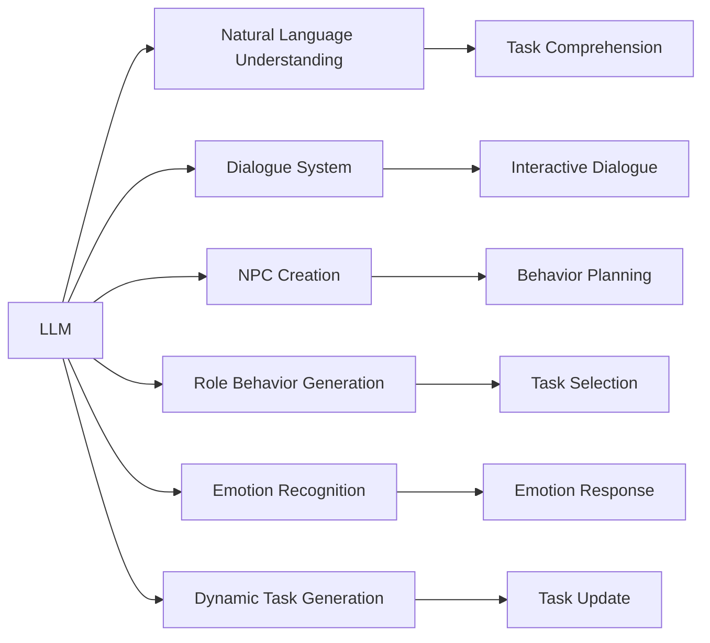
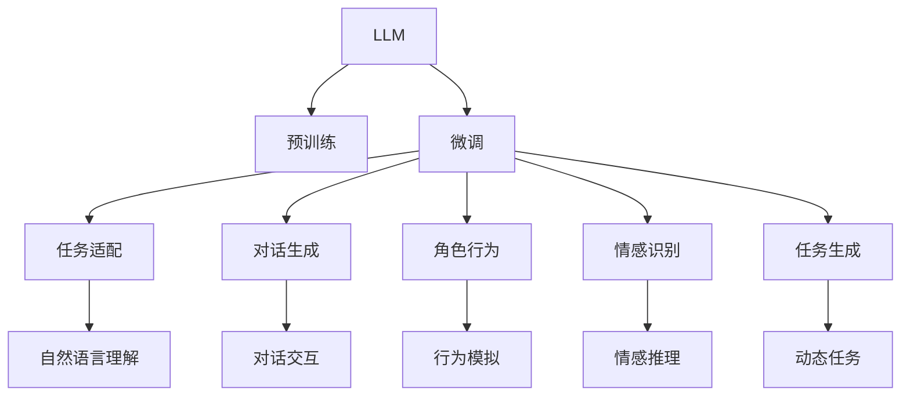
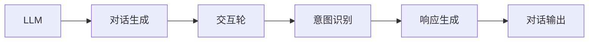
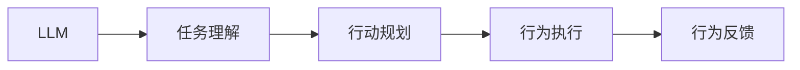
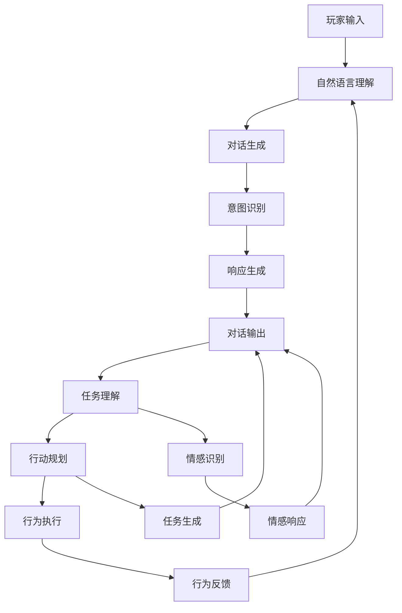

                 

# LLM在游戏开发中的应用：创造智能NPC

> 关键词：
- 大语言模型(LLM)
- 自然语言处理(NLP)
- 人工智能(AI)
- NPC创建
- 游戏智能
- 自然语言理解
- 对话系统
- 角色行为

## 1. 背景介绍

### 1.1 问题由来
随着人工智能技术的迅猛发展，大语言模型(LLM)在自然语言处理(NLP)领域展现出了强大的能力。特别是在游戏领域，将LLM应用于创造智能非玩家角色(NPC)，可以极大提升游戏交互性和沉浸感，带来全新的游戏体验。本节将对LLM在游戏开发中的核心应用进行全面介绍。

### 1.2 问题核心关键点
LLM在游戏开发中的核心应用包括：
1. **自然语言理解**：使NPC能够理解玩家输入的指令和情境，作出合理回应。
2. **对话系统**：构建基于LLM的对话系统，使NPC能够自然流畅地与玩家交流。
3. **角色行为生成**：通过LLM生成NPC的行动计划，使其行为更符合游戏设定。
4. **情感识别**：识别NPC与玩家的情感状态，实现情感动态交互。
5. **动态任务生成**：根据游戏进程和玩家行为，动态生成NPC任务，增加游戏变数。

### 1.3 问题研究意义
将LLM应用于游戏开发，可以实现以下目标：
- 提升游戏互动性：使NPC更加智能化、个性化，增加玩家沉浸感。
- 降低开发成本：通过LLM生成大量任务和对话内容，减少人工编写工作量。
- 增加游戏可玩性：通过动态生成任务和对话，使游戏内容更加丰富多样。
- 推动游戏AI发展：LLM的应用促进了游戏AI技术的进步，带动整个游戏行业的发展。

## 2. 核心概念与联系

### 2.1 核心概念概述

为更好地理解LLM在游戏开发中的应用，本节将介绍几个密切相关的核心概念：

- **大语言模型(LLM)**：以自回归(如GPT)或自编码(如BERT)模型为代表的大规模预训练语言模型。通过在大规模无标签文本语料上进行预训练，学习通用的语言表示，具备强大的语言理解和生成能力。

- **自然语言处理(NLP)**：涉及文本数据的处理、分析、理解、生成等技术，旨在实现人与计算机之间更加自然的语言交互。

- **人工智能(AI)**：利用算法和大数据处理能力，使计算机具备模拟人类智能的决策、感知和认知能力。

- **NPC创建**：在游戏开发中，创建智能的NPC角色，使其能够与玩家进行互动和游戏决策。

- **对话系统**：构建能够自然地处理玩家输入，生成合理回应的对话系统。

- **角色行为生成**：根据游戏规则和玩家行为，生成NPC的具体行为和任务。

- **情感识别**：通过NLP技术识别和理解NPC与玩家之间的情感状态。

- **动态任务生成**：根据游戏进程和玩家行为，动态生成NPC任务和对话内容。

这些概念之间的逻辑关系可以通过以下Mermaid流程图来展示：



这个流程图展示了LLM在游戏开发中的核心概念及其之间的关系：

1. LLM通过预训练获得了通用语言表示能力。
2. 通过自然语言理解(B)，NPC可以理解玩家的指令和情境。
3. 通过对话系统(C)，NPC能够自然流畅地与玩家交流。
4. 通过角色行为生成(E)，NPC能够根据游戏规则和玩家行为生成具体行动。
5. 通过情感识别(F)，NPC能够识别和回应用户情感。
6. 通过动态任务生成(G)，NPC能够根据游戏进程和玩家行为生成新任务。

这些概念共同构成了LLM在游戏开发中的应用框架，使其在游戏场景中发挥强大的语言理解和生成能力。

### 2.2 概念间的关系

这些核心概念之间存在着紧密的联系，形成了LLM在游戏开发中的完整生态系统。下面我通过几个Mermaid流程图来展示这些概念之间的关系。

#### 2.2.1 LLM在游戏开发中的应用框架



这个流程图展示了LLM在游戏开发中的应用框架。

1. LLM首先通过预训练获得基础能力。
2. 在微调(C)过程中，根据游戏特定需求进行调整。
3. 通过任务适配(D)，NPC能够理解游戏规则和玩家指令。
4. 通过对话生成(E)，NPC能够自然流畅地与玩家交流。
5. 通过角色行为(F)，NPC能够生成具体行动。
6. 通过情感识别(G)，NPC能够识别和回应用户情感。
7. 通过动态任务生成(H)，NPC能够生成新任务。

#### 2.2.2 对话系统的构建



这个流程图展示了基于LLM的对话系统的构建过程。

1. LLM通过预训练获得语言理解能力。
2. 对话生成(B)：将玩家输入转换为自然语言处理任务。
3. 交互轮(C)：与玩家进行多轮对话。
4. 意图识别(D)：识别玩家意图。
5. 响应生成(E)：生成合适的回应。
6. 对话输出(F)：将回应输出给玩家。

#### 2.2.3 角色行为生成



这个流程图展示了基于LLM的角色行为生成过程。

1. LLM通过预训练获得语言理解能力。
2. 任务理解(B)：识别游戏任务和玩家行为。
3. 行动规划(C)：生成行动计划。
4. 行为执行(D)：执行行动。
5. 行为反馈(E)：根据反馈调整行动。

### 2.3 核心概念的整体架构

最后，我们用一个综合的流程图来展示这些核心概念在大语言模型游戏开发中的应用架构：



这个综合流程图展示了从玩家输入到任务生成的完整过程。

1. 玩家输入(A)：玩家通过交互界面输入指令和情境。
2. 自然语言理解(B)：将玩家输入转换为游戏逻辑可理解的形式。
3. 对话生成(C)：与玩家进行多轮对话，理解玩家意图。
4. 意图识别(D)：识别玩家意图。
5. 响应生成(E)：生成合适的回应。
6. 对话输出(F)：将回应输出给玩家。
7. 任务理解(G)：识别游戏任务和玩家行为。
8. 行动规划(H)：生成行动计划。
9. 行为执行(I)：执行行动。
10. 行为反馈(J)：根据反馈调整行动。
11. 情感识别(K)：识别情感状态。
12. 情感响应(L)：回应用户情感。
13. 任务生成(M)：根据游戏进程和玩家行为生成新任务。

## 3. 核心算法原理 & 具体操作步骤

### 3.1 算法原理概述

将LLM应用于游戏开发，本质上是一个自然语言处理(NLP)任务，旨在使NPC能够理解和生成自然语言。核心思想是：将预训练的LLM模型作为基础，通过微调等技术，使其能够适应游戏特定的自然语言处理需求。

形式化地，假设预训练语言模型为 $M_{\theta}$，其中 $\theta$ 为预训练得到的模型参数。给定游戏对话数据集 $D=\{(x_i,y_i)\}_{i=1}^N$，其中 $x_i$ 为玩家输入，$y_i$ 为NPC的回应。微调的目标是找到新的模型参数 $\hat{\theta}$，使得：

$$
\hat{\theta}=\mathop{\arg\min}_{\theta} \mathcal{L}(M_{\theta},D)
$$

其中 $\mathcal{L}$ 为针对对话任务设计的损失函数，用于衡量模型预测输出与真实标签之间的差异。常见的损失函数包括交叉熵损失、均方误差损失等。

通过梯度下降等优化算法，微调过程不断更新模型参数 $\theta$，最小化损失函数 $\mathcal{L}$，使得模型输出逼近真实标签。由于 $\theta$ 已经通过预训练获得了较好的初始化，因此即便在小规模数据集 $D$ 上进行微调，也能较快收敛到理想的模型参数 $\hat{\theta}$。

### 3.2 算法步骤详解

基于LLM的游戏开发微调一般包括以下几个关键步骤：

**Step 1: 准备预训练模型和数据集**
- 选择合适的预训练语言模型 $M_{\theta}$ 作为初始化参数，如 GPT、BERT等。
- 准备游戏对话数据集 $D$，划分为训练集、验证集和测试集。一般要求对话数据与预训练数据的分布不要差异过大。

**Step 2: 添加任务适配层**
- 根据游戏对话任务类型，在预训练模型顶层设计合适的输出层和损失函数。
- 对于分类任务，通常在顶层添加线性分类器和交叉熵损失函数。
- 对于生成任务，通常使用语言模型的解码器输出概率分布，并以负对数似然为损失函数。

**Step 3: 设置微调超参数**
- 选择合适的优化算法及其参数，如 AdamW、SGD 等，设置学习率、批大小、迭代轮数等。
- 设置正则化技术及强度，包括权重衰减、Dropout、Early Stopping 等。
- 确定冻结预训练参数的策略，如仅微调顶层，或全部参数都参与微调。

**Step 4: 执行梯度训练**
- 将训练集数据分批次输入模型，前向传播计算损失函数。
- 反向传播计算参数梯度，根据设定的优化算法和学习率更新模型参数。
- 周期性在验证集上评估模型性能，根据性能指标决定是否触发 Early Stopping。
- 重复上述步骤直到满足预设的迭代轮数或 Early Stopping 条件。

**Step 5: 测试和部署**
- 在测试集上评估微调后模型 $M_{\hat{\theta}}$ 的性能，对比微调前后的精度提升。
- 使用微调后的模型对新样本进行推理预测，集成到实际的应用系统中。
- 持续收集新的对话数据，定期重新微调模型，以适应数据分布的变化。

以上是基于监督学习的大语言模型微调游戏开发的一般流程。在实际应用中，还需要针对具体游戏对话任务的特点，对微调过程的各个环节进行优化设计，如改进训练目标函数，引入更多的正则化技术，搜索最优的超参数组合等，以进一步提升模型性能。

### 3.3 算法优缺点

基于LLM的游戏开发微调方法具有以下优点：
1. 简单高效。只需准备少量对话数据，即可对预训练模型进行快速适配，获得较大的性能提升。
2. 通用适用。适用于各种游戏对话任务，设计简单的任务适配层即可实现微调。
3. 参数高效。利用参数高效微调技术，在固定大部分预训练参数的情况下，仍可取得不错的提升。
4. 效果显著。在学术界和工业界的诸多游戏对话任务上，基于微调的方法已经刷新了最先进的性能指标。

同时，该方法也存在一定的局限性：
1. 依赖对话数据。微调的效果很大程度上取决于对话数据的质量和数量，获取高质量对话数据的成本较高。
2. 迁移能力有限。当目标游戏对话任务与预训练对话任务的分布差异较大时，微调的性能提升有限。
3. 负面效果传递。预训练模型的固有偏见、有害信息等，可能通过微调传递到游戏对话任务，造成负面影响。
4. 可解释性不足。微调模型的决策过程通常缺乏可解释性，难以对其推理逻辑进行分析和调试。

尽管存在这些局限性，但就目前而言，基于监督学习的微调方法仍是大语言模型应用于游戏开发的主流范式。未来相关研究的重点在于如何进一步降低微调对对话数据的依赖，提高模型的少样本学习和跨领域迁移能力，同时兼顾可解释性和伦理安全性等因素。

### 3.4 算法应用领域

基于大语言模型微调的方法在游戏对话开发中已经得到了广泛的应用，覆盖了几乎所有常见任务，例如：

- **NPC对话**：使NPC能够自然流畅地与玩家交流。
- **任务理解**：使NPC能够理解玩家输入的指令和情境。
- **行为生成**：使NPC能够根据游戏规则和玩家行为生成具体行动。
- **情感交互**：使NPC能够识别和回应用户情感。
- **动态任务**：根据游戏进程和玩家行为生成新任务。

除了上述这些经典任务外，大语言模型微调还被创新性地应用到更多场景中，如可控文本生成、常识推理、代码生成、数据增强等，为游戏对话技术带来了全新的突破。随着预训练模型和微调方法的不断进步，相信游戏对话技术将在更广阔的应用领域大放异彩。

## 4. 数学模型和公式 & 详细讲解  
### 4.1 数学模型构建

本节将使用数学语言对基于LLM的游戏对话微调过程进行更加严格的刻画。

记预训练语言模型为 $M_{\theta}$，其中 $\theta$ 为预训练得到的模型参数。假设游戏对话任务的数据集为 $D=\{(x_i,y_i)\}_{i=1}^N$，其中 $x_i$ 为玩家输入，$y_i$ 为NPC的回应。

定义模型 $M_{\theta}$ 在数据样本 $(x,y)$ 上的损失函数为 $\ell(M_{\theta}(x),y)$，则在数据集 $D$ 上的经验风险为：

$$
\mathcal{L}(\theta) = \frac{1}{N} \sum_{i=1}^N \ell(M_{\theta}(x_i),y_i)
$$

微调的优化目标是最小化经验风险，即找到最优参数：

$$
\theta^* = \mathop{\arg\min}_{\theta} \mathcal{L}(\theta)
$$

在实践中，我们通常使用基于梯度的优化算法（如SGD、Adam等）来近似求解上述最优化问题。设 $\eta$ 为学习率，$\lambda$ 为正则化系数，则参数的更新公式为：

$$
\theta \leftarrow \theta - \eta \nabla_{\theta}\mathcal{L}(\theta) - \eta\lambda\theta
$$

其中 $\nabla_{\theta}\mathcal{L}(\theta)$ 为损失函数对参数 $\theta$ 的梯度，可通过反向传播算法高效计算。

### 4.2 公式推导过程

以下我们以二分类任务为例，推导交叉熵损失函数及其梯度的计算公式。

假设模型 $M_{\theta}$ 在输入 $x$ 上的输出为 $\hat{y}=M_{\theta}(x) \in [0,1]$，表示NPC回应的概率。真实标签 $y \in \{0,1\}$。则二分类交叉熵损失函数定义为：

$$
\ell(M_{\theta}(x),y) = -[y\log \hat{y} + (1-y)\log (1-\hat{y})]
$$

将其代入经验风险公式，得：

$$
\mathcal{L}(\theta) = -\frac{1}{N}\sum_{i=1}^N [y_i\log M_{\theta}(x_i)+(1-y_i)\log(1-M_{\theta}(x_i))]
$$

根据链式法则，损失函数对参数 $\theta_k$ 的梯度为：

$$
\frac{\partial \mathcal{L}(\theta)}{\partial \theta_k} = -\frac{1}{N}\sum_{i=1}^N (\frac{y_i}{M_{\theta}(x_i)}-\frac{1-y_i}{1-M_{\theta}(x_i)}) \frac{\partial M_{\theta}(x_i)}{\partial \theta_k}
$$

其中 $\frac{\partial M_{\theta}(x_i)}{\partial \theta_k}$ 可进一步递归展开，利用自动微分技术完成计算。

在得到损失函数的梯度后，即可带入参数更新公式，完成模型的迭代优化。重复上述过程直至收敛，最终得到适应游戏对话任务的最优模型参数 $\theta^*$。

## 5. 项目实践：代码实例和详细解释说明
### 5.1 开发环境搭建

在进行游戏对话微调实践前，我们需要准备好开发环境。以下是使用Python进行PyTorch开发的环境配置流程：

1. 安装Anaconda：从官网下载并安装Anaconda，用于创建独立的Python环境。

2. 创建并激活虚拟环境：
```bash
conda create -n pytorch-env python=3.8 
conda activate pytorch-env
```

3. 安装PyTorch：根据CUDA版本，从官网获取对应的安装命令。例如：
```bash
conda install pytorch torchvision torchaudio cudatoolkit=11.1 -c pytorch -c conda-forge
```

4. 安装Transformers库：
```bash
pip install transformers
```

5. 安装各类工具包：
```bash
pip install numpy pandas scikit-learn matplotlib tqdm jupyter notebook ipython
```

完成上述步骤后，即可在`pytorch-env`环境中开始微调实践。

### 5.2 源代码详细实现

下面我们以角色行为生成任务为例，给出使用Transformers库对BERT模型进行微调的PyTorch代码实现。

首先，定义角色行为生成任务的数据处理函数：

```python
from transformers import BertTokenizer
from torch.utils.data import Dataset
import torch

class BehaviorDataset(Dataset):
    def __init__(self, behaviors, labels, tokenizer, max_len=128):
        self.behaviors = behaviors
        self.labels = labels
        self.tokenizer = tokenizer
        self.max_len = max_len
        
    def __len__(self):
        return len(self.behaviors)
    
    def __getitem__(self, item):
        behavior = self.behaviors[item]
        label = self.labels[item]
        
        encoding = self.tokenizer(behavior, return_tensors='pt', max_length=self.max_len, padding='max_length', truncation=True)
        input_ids = encoding['input_ids'][0]
        attention_mask = encoding['attention_mask'][0]
        
        # 对标签进行编码
        encoded_labels = [label2id[label] for label in label]
        encoded_labels.extend([label2id['None']] * (self.max_len - len(encoded_labels)))
        labels = torch.tensor(encoded_labels, dtype=torch.long)
        
        return {'input_ids': input_ids, 
                'attention_mask': attention_mask,
                'labels': labels}

# 标签与id的映射
label2id = {'Action1': 0, 'Action2': 1, 'Action3': 2, 'Action4': 3, 'None': 4}
id2label = {v: k for k, v in label2id.items()}

# 创建dataset
tokenizer = BertTokenizer.from_pretrained('bert-base-cased')

train_dataset = BehaviorDataset(train_behaviors, train_labels, tokenizer)
dev_dataset = BehaviorDataset(dev_behaviors, dev_labels, tokenizer)
test_dataset = BehaviorDataset(test_behaviors, test_labels, tokenizer)
```

然后，定义模型和优化器：

```python
from transformers import BertForTokenClassification, AdamW

model = BertForTokenClassification.from_pretrained('bert-base-cased', num_labels=len(label2id))

optimizer = AdamW(model.parameters(), lr=2e-5)
```

接着，定义训练和评估函数：

```python
from torch.utils.data import DataLoader
from tqdm import tqdm
from sklearn.metrics import classification_report

device = torch.device('cuda') if torch.cuda.is_available() else torch.device('cpu')
model.to(device)

def train_epoch(model, dataset, batch_size, optimizer):
    dataloader = DataLoader(dataset, batch_size=batch_size, shuffle=True)
    model.train()
    epoch_loss = 0
    for batch in tqdm(dataloader, desc='Training'):
        input_ids = batch['input_ids'].to(device)
        attention_mask = batch['attention_mask'].to(device)
        labels = batch['labels'].to(device)
        model.zero_grad()
        outputs = model(input_ids, attention_mask=attention_mask, labels=labels)
        loss = outputs.loss
        epoch_loss += loss.item()
        loss.backward()
        optimizer.step()
    return epoch_loss / len(dataloader)

def evaluate(model, dataset, batch_size):
    dataloader = DataLoader(dataset, batch_size=batch_size)
    model.eval()
    preds, labels = [], []
    with torch.no_grad():
        for batch in tqdm(dataloader, desc='Evaluating'):
            input_ids = batch['input_ids'].to(device)
            attention_mask = batch['attention_mask'].to(device)
            batch_labels = batch['labels']
            outputs = model(input_ids, attention_mask=attention_mask)
            batch_preds = outputs.logits.argmax(dim=2).to('cpu').tolist()
            batch_labels = batch_labels.to('cpu').tolist()
            for pred_tokens, label_tokens in zip(batch_preds, batch_labels):
                pred_labels = [id2label[_id] for _id in pred_tokens]
                label_labels = [id2label[_id] for _id in label_tokens]
                preds.append(pred_labels[:len(label_labels)])
                labels.append(label_labels)
                
    print(classification_report(labels, preds))
```

最后，启动训练流程并在测试集上评估：

```python
epochs = 5
batch_size = 16

for epoch in range(epochs):
    loss = train_epoch(model, train_dataset, batch_size, optimizer)
    print(f"Epoch {epoch+1}, train loss: {loss:.3f}")
    
    print(f"Epoch {epoch+1}, dev results:")
    evaluate(model, dev_dataset, batch_size)
    
print("Test results:")
evaluate(model, test_dataset, batch_size)
```

以上就是使用PyTorch对BERT进行角色行为生成任务微调的完整代码实现。可以看到，得益于Transformers库的强大封装，我们可以用相对简洁的代码完成BERT模型的加载和微调。

### 5.3 代码解读与分析

让我们再详细解读一下关键代码的实现细节：

**BehaviorDataset类**：
- `__init__`方法：初始化行为数据、标签、分词器等关键组件。
- `__len__`方法：返回数据集的样本数量。
- `__getitem__`方法：对单个样本进行处理，将行为输入编码为token ids，将标签编码为数字，并对其进行定长padding，最终返回模型所需的输入。

**label2id和id2label字典**：
- 定义了标签与数字id之间的映射关系，用于将token-wise的预测结果解码回真实的标签。

**训练和评估函数**：
- 使用PyTorch的DataLoader对数据集进行批次化加载，供模型训练和推理使用。
- 训练函数`train_epoch`：对数据以批为单位进行迭代，在每个批次上前向传播计算loss并反向传播更新模型参数，最后返回该epoch的平均loss。
- 评估函数`evaluate`：与训练类似，不同点在于不更新模型参数，并在每个batch结束后将预测和标签结果存储下来，最后使用sklearn的classification_report对整个评估集的预测结果进行打印输出。

**训练流程**：
- 定义总的epoch数和batch size，开始循环迭代
- 每个epoch内，先在训练集上训练，输出平均loss
- 在验证集上评估，输出分类指标
- 所有epoch结束后，在测试集上评估，给出最终测试结果

可以看到，PyTorch配合Transformers库使得BERT微调的角色行为生成任务代码实现变得简洁高效。开发者可以将更多精力放在数据处理、模型改进等高层逻辑上，而不必过多关注底层的实现细节。

当然，工业级的系统实现还需考虑更多因素，如模型的保存和部署、超参数的自动搜索、更灵活的任务适配层等。但核心的微调范式基本与此类似。

### 5.4 

