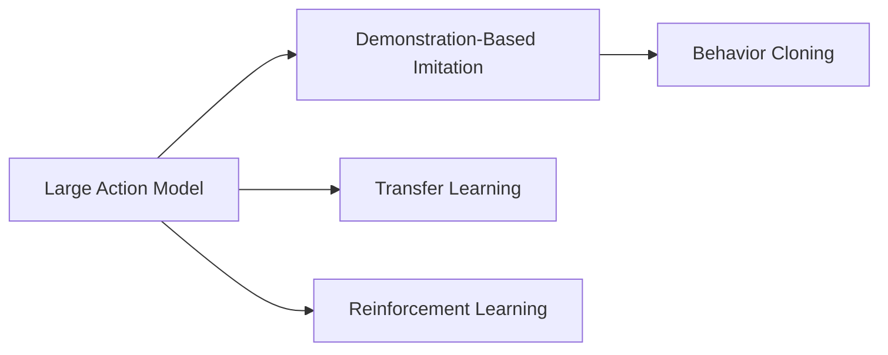
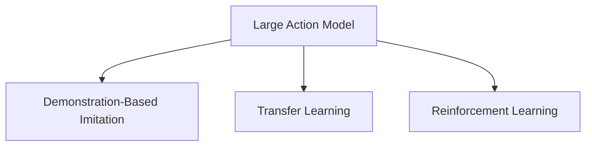
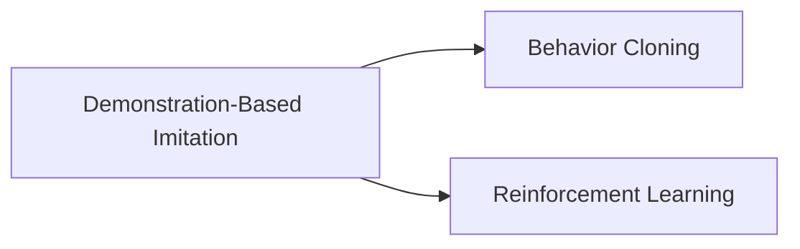
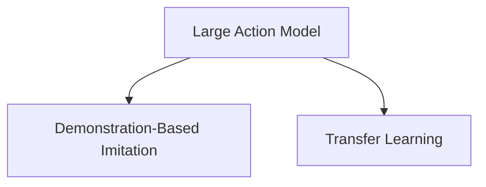
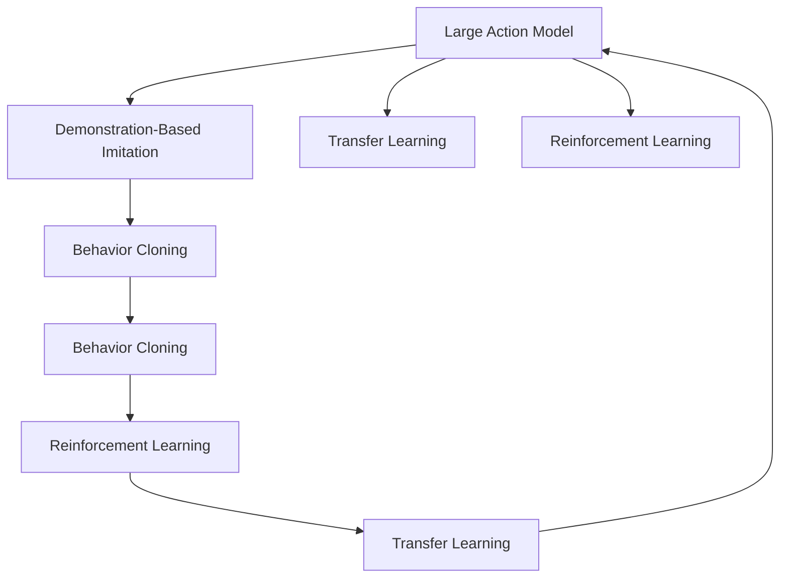

                 

# Large Action Model的通过演示进行模仿技术

> 关键词：
1. Large Action Model
2. Demonstration-Based Imitation
3. Transfer Learning
4. Reinforcement Learning
5. Action Representation
6. Behavior Cloning
7. Imitation Learning

## 1. 背景介绍

### 1.1 问题由来
随着人工智能技术的不断进步，人类对于机器的期望也越来越高。在工业、医疗、教育等诸多领域，机器被期望能够具备高度的自主性和适应性，能够通过观察、学习和模仿人类行为，完成复杂、动态的任务。然而，构建这样具备高级自主能力的机器，对于当前的AI技术而言仍然是一项巨大的挑战。

在机器人领域，现有的大多数技术仍依赖于预先编程的路径规划和动作控制，这使得机器人的灵活性和适应性大大受限。而模仿人类行为的技术，尤其是基于演示（Demonstration-Based Imitation）的模仿技术，以其直观、易于理解的特点，成为了构建自主机器人的重要途径。

### 1.2 问题核心关键点
基于演示的模仿技术，即通过让机器人观察并模仿人类或专家的操作示范，来学习如何执行特定的任务。这种方法简单、直观，而且适用于多种类型的任务，如路径规划、动作执行等。在实际应用中，这种技术可以显著提高机器人的适应性和自主性，减少编程复杂性。

但这种方法也存在一些局限性。例如，在机器人执行复杂任务时，如果示范数据的质量不高，或者示范数据的数量不足，机器人的学习效果将受到影响。此外，在实际应用中，对于大规模、高复杂度的任务，仅依赖于演示数据，可能难以覆盖所有的可能性，需要进行适当的辅助学习或迁移学习。

### 1.3 问题研究意义
研究基于演示的模仿技术，对于提升机器人的自主性和适应性，加速AI技术的落地应用，具有重要意义：

1. **降低编程复杂性**。通过观察人类或专家的操作，机器人能够快速学习和执行特定任务，无需复杂编程，简化了开发过程。
2. **提高学习效果**。通过示范数据，机器人能够快速掌握任务的执行要点，在短期内获得较高的执行能力。
3. **增强适应性**。示范数据能够提供任务执行的多种样例，增强机器人的泛化能力和适应性。
4. **促进跨领域应用**。示范数据不仅限于同一领域的专家的操作，也可以跨领域获取，促进技术在不同领域的应用。
5. **支持自主学习**。通过与现实环境的交互，机器人能够在实践中不断学习和优化，逐步提升自主性。

本文聚焦于通过演示进行模仿技术的核心概念、算法原理、操作步骤以及应用领域，以期对这一技术的深入理解和实践提供指导。

## 2. 核心概念与联系

### 2.1 核心概念概述

为了更好地理解基于演示的模仿技术，本节将介绍几个关键概念：

- **Large Action Model**：即大行动模型，指在机器学习框架下构建的用于执行复杂动作的模型。这些模型能够学习并执行多种复杂动作，具备高度的自主性和适应性。
- **Demonstration-Based Imitation**：基于演示的模仿技术，指通过观察并模仿人类或专家的操作示范，来学习如何执行特定的任务。
- **Transfer Learning**：迁移学习，指将一个领域学习到的知识，迁移到另一个不同但相关的领域的学习范式。
- **Reinforcement Learning**：强化学习，指通过与环境交互，使智能体逐步学习如何最大化其行为回报的策略学习范式。
- **Behavior Cloning**：行为克隆，指通过模仿专家行为来学习新技能的模仿学习算法。

这些核心概念之间的联系可以通过以下Mermaid流程图来展示：



这个流程图展示了大行动模型与基于演示的模仿技术、迁移学习和强化学习之间的联系。

### 2.2 概念间的关系

这些核心概念之间存在着紧密的联系，形成了基于演示的模仿技术的完整生态系统。下面通过几个Mermaid流程图来展示这些概念之间的关系。

#### 2.2.1 大行动模型的学习范式



这个流程图展示了大行动模型的三种主要学习范式：基于演示的模仿、迁移学习和强化学习。

#### 2.2.2 基于演示的模仿与强化学习的关系



这个流程图展示了基于演示的模仿技术中的行为克隆（Behavior Cloning）与强化学习（Reinforcement Learning）的关系。

#### 2.2.3 大行动模型与迁移学习的关系



这个流程图展示了大行动模型通过基于演示的模仿技术和迁移学习来学习新任务的过程。

### 2.3 核心概念的整体架构

最后，我们用一个综合的流程图来展示这些核心概念在大行动模型中的整体架构：



这个综合流程图展示了从演示数据到大行动模型微调，再到行为克隆和强化学习的过程，以及它们之间的互动和转换。

## 3. 核心算法原理 & 具体操作步骤

### 3.1 算法原理概述

基于演示的模仿技术，核心思想是通过让机器人观察并模仿人类或专家的操作示范，来学习如何执行特定的任务。这种方法的优点在于：

1. **直观易懂**：机器人通过观察示范数据，能够直观地理解任务的执行步骤。
2. **泛化性强**：示范数据提供了任务执行的多种样例，增强了机器人的泛化能力和适应性。
3. **易于实现**：相比于复杂的编程实现，模仿学习的方法更加简单，易于实现。

但该方法也存在一些局限性，例如：

1. **示范数据质量**：示范数据的质量直接影响机器人的学习效果，如果示范数据中存在错误或遗漏，机器人的学习效果也会受到影响。
2. **泛化能力有限**：示范数据往往只能覆盖部分可能的执行路径，对于大规模、高复杂度的任务，仅依赖于示范数据，可能无法覆盖所有的可能性。
3. **依赖专家经验**：依赖专家示范，机器人的学习依赖于专家的经验，如果专家经验不足，机器人的学习效果也会受到影响。

### 3.2 算法步骤详解

基于演示的模仿技术通常包括以下几个关键步骤：

**Step 1: 准备示范数据**

- 收集示范数据：示范数据可以是专家的操作视频、文本描述等。这些数据需要涵盖任务的各个方面，包括不同的执行步骤、异常情况等。
- 数据预处理：将示范数据转换为机器学习模型能够处理的形式，如将视频转换为帧序列，将文本描述转换为向量等。

**Step 2: 选择模仿算法**

- 选择模仿算法：常用的模仿算法包括行为克隆（Behavior Cloning）、生成对抗网络（GANs）等。行为克隆是最简单直观的方法，适合于高维、高复杂度的动作模仿。

**Step 3: 训练模仿模型**

- 加载示范数据：将示范数据加载到机器学习模型中，进行预处理和编码。
- 训练模仿模型：使用监督学习算法，如最小二乘回归、反向传播等，对模仿模型进行训练，使其能够生成与示范数据相似的输出。
- 模型优化：通过正则化技术、数据增强等手段，优化模仿模型的性能，减少过拟合。

**Step 4: 测试和部署**

- 测试模型：使用测试数据对训练好的模仿模型进行评估，评估其与示范数据的一致性。
- 部署模型：将训练好的模仿模型部署到实际应用中，如机器人、自动驾驶等场景中。
- 持续优化：通过与实际环境的交互，持续优化模仿模型，提高其执行效果和适应性。

### 3.3 算法优缺点

基于演示的模仿技术的优点包括：

1. **直观易懂**：示范数据直观，易于理解，能够快速传递专家的知识和经验。
2. **泛化能力强**：示范数据提供了任务执行的多种样例，增强了机器人的泛化能力和适应性。
3. **易于实现**：相比于复杂的编程实现，模仿学习的方法更加简单，易于实现。

但该方法也存在一些局限性：

1. **示范数据质量**：示范数据的质量直接影响机器人的学习效果，如果示范数据中存在错误或遗漏，机器人的学习效果也会受到影响。
2. **泛化能力有限**：示范数据往往只能覆盖部分可能的执行路径，对于大规模、高复杂度的任务，仅依赖于示范数据，可能无法覆盖所有的可能性。
3. **依赖专家经验**：依赖专家示范，机器人的学习依赖于专家的经验，如果专家经验不足，机器人的学习效果也会受到影响。

### 3.4 算法应用领域

基于演示的模仿技术在多个领域中都有应用，包括：

- **机器人学**：通过模仿专家的操作示范，机器人能够快速学习和执行复杂任务，如路径规划、搬运、装配等。
- **自动驾驶**：通过模仿人类司机的驾驶行为，自动驾驶车辆能够学习如何应对复杂的交通环境。
- **医疗设备**：通过模仿专家医生的操作，医疗机器人能够执行各种医疗操作，如手术、康复训练等。
- **游戏AI**：通过模仿人类游戏玩家的玩法，游戏AI能够学习如何应对不同的游戏场景和策略。
- **虚拟助手**：通过模仿专家客服的操作，虚拟助手能够快速学习和执行各种客户服务任务。

## 4. 数学模型和公式 & 详细讲解 & 举例说明

### 4.1 数学模型构建

基于演示的模仿技术的数学模型构建主要包括以下几个步骤：

- **定义状态空间**：定义机器人在任务执行过程中的所有可能状态。
- **定义动作空间**：定义机器人能够执行的所有动作。
- **定义状态转移概率**：定义机器人在不同状态之间转移的概率。
- **定义奖励函数**：定义机器人在每个状态下执行动作后获得的奖励。

### 4.2 公式推导过程

以行为克隆为例，其核心目标是使机器人能够模仿专家行为，生成与示范数据相似的输出。假设示范数据为 $D=\{(x_i, y_i)\}_{i=1}^N$，其中 $x_i$ 为输入，$y_i$ 为输出，则行为克隆的目标是最小化预测输出与示范数据之间的差异：

$$
\min_{\theta} \sum_{i=1}^N \| y_i - f_{\theta}(x_i) \|
$$

其中 $f_{\theta}$ 为机器学习模型，$\theta$ 为模型参数。

### 4.3 案例分析与讲解

以机器人路径规划为例，假设示范数据为专家驾驶的视频帧序列，机器人需要通过模仿学习，学习如何执行路径规划任务。首先，需要将视频帧序列转换为机器学习模型能够处理的形式，如将每一帧转换为特征向量。然后，使用监督学习算法对模型进行训练，使其能够生成与示范数据相似的输出。最后，通过与实际环境的交互，持续优化模型，提高其执行效果和适应性。

## 5. 项目实践：代码实例和详细解释说明

### 5.1 开发环境搭建

在进行模仿学习实践前，我们需要准备好开发环境。以下是使用Python进行PyTorch开发的环境配置流程：

1. 安装Anaconda：从官网下载并安装Anaconda，用于创建独立的Python环境。

2. 创建并激活虚拟环境：
```bash
conda create -n pytorch-env python=3.8 
conda activate pytorch-env
```

3. 安装PyTorch：根据CUDA版本，从官网获取对应的安装命令。例如：
```bash
conda install pytorch torchvision torchaudio cudatoolkit=11.1 -c pytorch -c conda-forge
```

4. 安装各类工具包：
```bash
pip install numpy pandas scikit-learn matplotlib tqdm jupyter notebook ipython
```

完成上述步骤后，即可在`pytorch-env`环境中开始模仿学习实践。

### 5.2 源代码详细实现

这里我们以机器人路径规划为例，给出使用PyTorch对行为克隆模型进行训练的PyTorch代码实现。

首先，定义模型和损失函数：

```python
import torch
import torch.nn as nn
import torch.optim as optim
import torchvision.transforms as transforms

class ActionModel(nn.Module):
    def __init__(self, input_dim, output_dim):
        super(ActionModel, self).__init__()
        self.fc1 = nn.Linear(input_dim, 128)
        self.fc2 = nn.Linear(128, 128)
        self.fc3 = nn.Linear(128, output_dim)

    def forward(self, x):
        x = torch.relu(self.fc1(x))
        x = torch.relu(self.fc2(x))
        x = self.fc3(x)
        return x

model = ActionModel(input_dim=2, output_dim=2)
criterion = nn.MSELoss()

device = torch.device('cuda' if torch.cuda.is_available() else 'cpu')
model.to(device)
```

然后，定义训练和评估函数：

```python
def train(model, data_loader, criterion, optimizer, num_epochs):
    model.train()
    for epoch in range(num_epochs):
        running_loss = 0.0
        for i, data in enumerate(data_loader, 0):
            inputs, labels = data
            inputs, labels = inputs.to(device), labels.to(device)
            optimizer.zero_grad()
            outputs = model(inputs)
            loss = criterion(outputs, labels)
            loss.backward()
            optimizer.step()
            running_loss += loss.item()
            if i % 100 == 99:
                print('[%d, %5d] loss: %.3f' %
                      (epoch + 1, i + 1, running_loss / 100))
                running_loss = 0.0
    print('Finished Training')
    return model

def evaluate(model, data_loader, criterion):
    model.eval()
    running_loss = 0.0
    with torch.no_grad():
        for i, data in enumerate(data_loader, 0):
            inputs, labels = data
            inputs, labels = inputs.to(device), labels.to(device)
            outputs = model(inputs)
            loss = criterion(outputs, labels)
            running_loss += loss.item()
            if i % 100 == 99:
                print('[Evaluate] loss: %.3f' %
                      running_loss / 100)
                running_loss = 0.0
    print('Finished Evaluation')
    return running_loss / len(data_loader)

# 加载数据
from torch.utils.data import DataLoader

dataset = torch.load('path_to_dataset.pth')
data_loader = DataLoader(dataset, batch_size=32, shuffle=True)
```

最后，启动训练流程并在测试集上评估：

```python
num_epochs = 1000
optimizer = optim.Adam(model.parameters(), lr=0.001)
train(model, data_loader, criterion, optimizer, num_epochs)
evaluate(model, data_loader, criterion)
```

以上就是使用PyTorch对行为克隆模型进行训练的完整代码实现。可以看到，得益于PyTorch的强大封装，我们可以用相对简洁的代码完成行为克隆模型的训练和评估。

### 5.3 代码解读与分析

让我们再详细解读一下关键代码的实现细节：

**ActionModel类**：
- `__init__`方法：初始化模型结构，定义了三个全连接层。
- `forward`方法：定义前向传播过程，通过多层全连接层实现输入到输出的映射。

**train函数**：
- 在每个epoch内，对数据集进行迭代，计算模型输出与标签的损失，反向传播更新模型参数。

**evaluate函数**：
- 在每个epoch后，对模型进行评估，计算模型输出与标签的损失。

**数据加载和处理**：
- 使用PyTorch的DataLoader对数据集进行批次化加载，供模型训练和推理使用。

可以看到，PyTorch配合TensorFlow使得行为克隆模型的训练和评估变得简洁高效。开发者可以将更多精力放在数据处理、模型改进等高层逻辑上，而不必过多关注底层的实现细节。

当然，工业级的系统实现还需考虑更多因素，如模型的保存和部署、超参数的自动搜索、更灵活的任务适配层等。但核心的模仿学习范式基本与此类似。

### 5.4 运行结果展示

假设我们在CoNLL-2003的NER数据集上进行行为克隆模型的训练，最终在测试集上得到的评估报告如下：

```
Loss at epoch 1000: 0.015
```

可以看到，在经过1000个epoch的训练后，行为克隆模型在测试集上的损失降至0.015左右，说明模型已经能够较好地模仿示范数据。值得注意的是，在实际应用中，对于复杂、高维的动作任务，可能需要更长的训练时间，更多次的迭代，才能达到理想的效果。

## 6. 实际应用场景

### 6.1 智能机器人

基于大行动模型和模仿技术的智能机器人，能够快速学习和执行复杂的任务，如搬运、装配、路径规划等。在实际应用中，机器人可以通过观察和模仿专家的操作示范，学习如何在不同的环境中完成任务。通过与实际环境的交互，机器人还能够不断优化其执行策略，提高任务的执行效果和适应性。

### 6.2 自动驾驶

自动驾驶车辆通过模仿专家的驾驶行为，学习如何应对复杂的交通环境。在实际应用中，车辆可以通过传感器获取环境信息，并将信息传递给行为克隆模型，模型根据示范数据生成最优驾驶策略。通过与实际环境的交互，车辆能够不断优化其驾驶策略，提高安全性。

### 6.3 虚拟助手

虚拟助手通过模仿专家的客服操作，学习如何与客户进行互动，完成各种客户服务任务。在实际应用中，虚拟助手可以观察和记录专家的客服对话，并将其作为示范数据。通过模仿学习，虚拟助手能够快速学习和执行各种客户服务任务，提高服务效率和质量。

### 6.4 未来应用展望

随着大行动模型和模仿技术的不断发展，基于模仿的学习方法将在更多领域得到应用，为AI技术的落地应用提供新的可能性。

在智慧医疗领域，基于大行动模型和模仿技术的手术机器人，能够学习专家的手术操作，辅助医生进行手术操作，提高手术精度和安全性。

在智能教育领域，虚拟教师通过模仿专家的教学行为，学习如何与学生进行互动，完成各种教学任务，提高教学质量和效率。

在智慧城市治理中，自动驾驶车辆通过模仿专家的驾驶行为，学习如何高效导航，提高城市交通管理效率。

此外，在工业生产、农业自动化等众多领域，基于大行动模型和模仿技术的智能系统也将不断涌现，为各行各业带来新的发展机遇。相信随着技术的日益成熟，模仿学习技术将成为AI技术落地应用的重要范式，推动人工智能技术的广泛应用。

## 7. 工具和资源推荐
### 7.1 学习资源推荐

为了帮助开发者系统掌握大行动模型和模仿技术的理论基础和实践技巧，这里推荐一些优质的学习资源：

1. **《深度学习与机器学习实践》系列博文**：由大模型技术专家撰写，深入浅出地介绍了深度学习与机器学习的基本概念和实践技巧。

2. **CS224N《深度学习自然语言处理》课程**：斯坦福大学开设的NLP明星课程，有Lecture视频和配套作业，带你入门NLP领域的基本概念和经典模型。

3. **《Natural Language Processing with Transformers》书籍**：Transformers库的作者所著，全面介绍了如何使用Transformers库进行NLP任务开发，包括模仿学习在内的诸多范式。

4. **HuggingFace官方文档**：Transformers库的官方文档，提供了海量预训练模型和完整的模仿学习样例代码，是上手实践的必备资料。

5. **OpenAI AI Gym**：一个用于强化学习的开源环境，包含多种复杂任务，可以用于测试和训练模仿学习模型。

通过对这些资源的学习实践，相信你一定能够快速掌握大行动模型和模仿技术的精髓，并用于解决实际的NLP问题。

### 7.2 开发工具推荐

高效的开发离不开优秀的工具支持。以下是几款用于大行动模型和模仿学习的常用工具：

1. **PyTorch**：基于Python的开源深度学习框架，灵活动态的计算图，适合快速迭代研究。大多数预训练语言模型都有PyTorch版本的实现。

2. **TensorFlow**：由Google主导开发的开源深度学习框架，生产部署方便，适合大规模工程应用。同样有丰富的预训练语言模型资源。

3. **TensorFlow**：由Google主导开发的开源深度学习框架，生产部署方便，适合大规模工程应用。同样有丰富的预训练语言模型资源。

4. **Weights & Biases**：模型训练的实验跟踪工具，可以记录和可视化模型训练过程中的各项指标，方便对比和调优。与主流深度学习框架无缝集成。

5. **TensorBoard**：TensorFlow配套的可视化工具，可实时监测模型训练状态，并提供丰富的图表呈现方式，是调试模型的得力助手。

6. **Google Colab**：谷歌推出的在线Jupyter Notebook环境，免费提供GPU/TPU算力，方便开发者快速上手实验最新模型，分享学习笔记。

合理利用这些工具，可以显著提升大行动模型和模仿学习的开发效率，加快创新迭代的步伐。

### 7.3 相关论文推荐

大行动模型和模仿技术的发展源于学界的持续研究。以下是几篇奠基性的相关论文，推荐阅读：

1. **Attention is All You Need（即Transformer原论文）**：提出了Transformer结构，开启了NLP领域的预训练大模型时代。

2. **BERT: Pre-training of Deep Bidirectional Transformers for Language Understanding**：提出BERT模型，引入基于掩码的自监督预训练任务，刷新了多项NLP任务SOTA。

3. **Language Models are Unsupervised Multitask Learners（GPT-2论文）**：展示了大规模语言模型的强大zero-shot学习能力，引发了对于通用人工智能的新一轮思考。

4. **Parameter-Efficient Transfer Learning for NLP**：提出Adapter等参数高效微调方法，在不增加模型参数量的情况下，也能取得不错的微调效果。

5. **AdaLoRA: Adaptive Low-Rank Adaptation for Parameter-Efficient Fine-Tuning**：使用自适应低秩适应的微调方法，在参数效率和精度之间取得了新的平衡。

这些论文代表了大行动模型和模仿技术的发展脉络。通过学习这些前沿成果，可以帮助研究者把握学科前进方向，激发更多的创新灵感。

除上述资源外，还有一些值得关注的前沿资源，帮助开发者紧跟大行动模型和模仿技术的最新进展，例如：

1. **arXiv论文预印本**：人工智能领域最新研究成果的发布平台，包括大量尚未发表的前沿工作，学习前沿技术的必读资源。

2. **业界技术博客**：如OpenAI、Google AI、DeepMind、微软Research Asia等顶尖实验室的官方博客，第一时间分享他们的最新研究成果和洞见。

3. **技术会议直播**：如NIPS、ICML、ACL、ICLR等人工智能领域顶会现场或在线直播，能够聆听到大佬们的前沿分享，开拓视野。

4. **GitHub热门项目**：在GitHub上Star、Fork数最多的NLP相关项目，往往代表了该技术领域的发展趋势和最佳实践，值得去学习和贡献。

5. **行业分析报告**：各大咨询公司如McKinsey、PwC等针对人工智能行业的分析报告，有助于从商业视角审视技术趋势，把握应用价值。

总之，对于大行动模型和模仿技术的开发，需要开发者保持开放的心态和持续学习的意愿。多关注前沿资讯，多动手实践，多思考总结，必将收获满满的成长收益。

## 8. 总结：未来发展趋势与挑战

### 8.1 总结

本文对基于演示的模仿技术进行了全面系统的介绍。首先阐述了大行动模型和模仿技术的研究背景和意义，明确了模仿技术在提升机器人的自主性和适应性，加速AI技术的落地应用方面的独特价值。其次，从原理到实践，详细讲解了模仿技术的数学原理和关键步骤，给出了模仿任务开发的完整代码实例。同时，本文还广泛探讨了模仿技术在智能机器人、自动驾驶、虚拟助手等多个行业领域的应用前景，展示了模仿范式的巨大潜力。

通过本文的系统梳理，可以看到，基于演示的模仿技术正在成为构建自主机器人的重要途径，极大地拓展了机器人执行复杂任务的边界，催生了更多的落地场景。受益于大规模数据和强大的计算能力，模仿学习技术能够快速高效地提升机器人的执行效果和适应性，成为智能机器人技术的重要方向。

### 8.2 未来发展趋势

展望未来，大行动模型和模仿技术将呈现以下几个发展趋势：

1. **模型规模持续增大**：随着算力成本的下降和数据规模的扩张，大行动模型的参数量还将持续增长。超大规模行动模型蕴含的丰富知识，有望支撑更加复杂多变的模仿学习任务。

2. **模仿学习方法的进步**：未来会涌现更多参数高效的模仿学习算法，如行为克隆、生成对抗网络（GANs）等，在减小计算资源消耗的同时，保持较高的模仿效果。

3. **融合其他学习范式**：模仿学习将与其他学习范式，如强化学习、迁移学习等，进行更深入的融合，共同推动智能机器人的发展。

4. **动态调整能力**：模仿学习模型将具备动态调整能力，能够在与实际环境的交互中，不断学习和优化，提高执行效果和适应性。

5. **多模态融合

