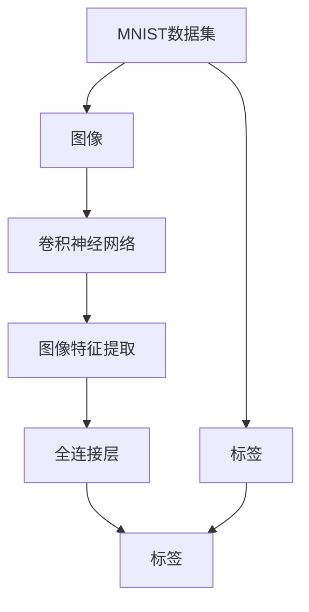
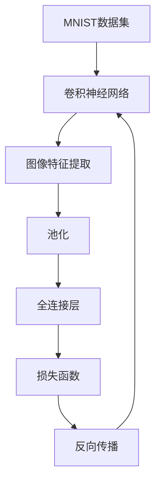

                 

# MNIST手写数字识别

> 关键词：MNIST, 卷积神经网络, 图像识别, TensorFlow, Keras, 深度学习

## 1. 背景介绍

### 1.1 问题由来
在深度学习领域，手写数字识别是一个经典且基础的任务。MNIST数据集作为该领域的标准基准，自1998年发布以来，被广泛应用于学术研究、开源项目和商业应用中，推动了计算机视觉和机器学习技术的进步。

### 1.2 问题核心关键点
手写数字识别的关键在于如何通过深度学习模型，将手写数字图像转换为计算机可以理解的数值标签。MNIST数据集包含大量手写数字的灰度图像和对应的标签，提供了一个理想的实验平台，用于测试和验证不同深度学习模型的性能。

### 1.3 问题研究意义
研究手写数字识别问题，不仅有助于理解深度学习的基本原理和算法，还能为其他更复杂的图像识别任务提供借鉴和启发。通过解决手写数字识别问题，我们可以更好地理解和应用深度学习技术，推动其在更广泛的应用场景中发挥作用。

## 2. 核心概念与联系

### 2.1 核心概念概述

- **MNIST数据集**：由美国国家标准与技术研究所（NIST）发布，包含60,000个训练图像和10,000个测试图像，每张图像为28x28像素的灰度图像。
- **卷积神经网络（CNN）**：一种专门用于图像处理的神经网络结构，通过卷积、池化等操作提取图像特征，并通过全连接层进行分类。
- **图像识别**：将图像转换为计算机可以理解的数值标签，是计算机视觉中的核心任务之一。
- **TensorFlow**：由Google开发和维护的开源深度学习框架，支持分布式计算和多种硬件加速，广泛应用于深度学习研究与应用。
- **Keras**：一个高层次的神经网络API，提供简单易用的接口，支持TensorFlow、Theano和CNTK等后端，适合快速原型开发和实验。

### 2.2 概念间的关系

- **MNIST数据集**提供了图像和标签，是图像识别任务的基础数据来源。
- **卷积神经网络**通过卷积和池化等操作提取图像特征，用于图像识别任务。
- **TensorFlow和Keras**提供深度学习的实现平台，使得构建和训练卷积神经网络变得简单高效。
- **图像识别**是卷积神经网络的应用场景之一，MNIST数据集作为验证图像识别算法性能的基准。

这些概念之间的逻辑关系可以通过以下Mermaid流程图来展示：



这个流程图展示了一个简单的卷积神经网络在MNIST手写数字识别任务中的应用流程：

1. MNIST数据集提供图像和标签。
2. 图像经过卷积神经网络提取特征。
3. 特征通过全连接层进行分类。
4. 分类结果与标签进行比较，得到损失函数。
5. 通过反向传播更新模型参数。

### 2.3 核心概念的整体架构

最后，我们用一个综合的流程图来展示这些核心概念在大模型微调过程中的整体架构：



这个综合流程图展示了从数据到模型的完整流程：

1. MNIST数据集提供图像和标签。
2. 图像通过卷积神经网络提取特征。
3. 特征经过池化操作，减少维度。
4. 特征通过全连接层进行分类。
5. 分类结果与标签进行比较，得到损失函数。
6. 通过反向传播更新模型参数。

通过这些流程图，我们可以更清晰地理解卷积神经网络在手写数字识别任务中的应用流程和逻辑结构。

## 3. 核心算法原理 & 具体操作步骤
### 3.1 算法原理概述

卷积神经网络在手写数字识别任务中的应用，主要依赖于其对图像特征的提取能力和参数共享机制。卷积神经网络通过多层卷积和池化操作，逐步提取图像的高层次特征，并通过全连接层进行分类。

在训练过程中，卷积神经网络通过反向传播算法，根据损失函数梯度更新模型参数，最小化预测误差。损失函数通常使用交叉熵损失，用于衡量模型输出与真实标签之间的差异。

### 3.2 算法步骤详解

以下是卷积神经网络在手写数字识别任务中的训练和推理步骤：

#### 3.2.1 数据预处理
- 将MNIST数据集中的图像和标签分别进行归一化处理，通常使用`/255.0`将像素值缩放到[0,1]区间。
- 将图像数据按批次分为多个样本，并转换成`(x,y)`格式的数组。

#### 3.2.2 构建模型
- 使用TensorFlow或Keras构建卷积神经网络模型，包括卷积层、池化层、全连接层等组件。
- 设置模型的优化器和损失函数，通常使用Adam优化器和交叉熵损失函数。

#### 3.2.3 训练模型
- 将训练数据集输入模型，进行前向传播计算输出。
- 计算损失函数，并根据损失函数的梯度进行反向传播，更新模型参数。
- 重复上述步骤，直到模型收敛或达到预设的迭代次数。

#### 3.2.4 测试模型
- 将测试数据集输入模型，进行前向传播计算输出。
- 计算模型输出与真实标签的误差，通常使用准确率、精确率、召回率等指标评估模型性能。

### 3.3 算法优缺点

卷积神经网络在手写数字识别任务中表现优异，具有以下优点：

1. **参数共享**：卷积层中的参数在图像的不同位置共享，减少了模型参数量，提高了模型的泛化能力。
2. **局部连接**：卷积层的参数只与局部邻域的像素进行连接，降低了模型的计算复杂度。
3. **自动特征提取**：卷积层可以自动学习图像的局部特征，减少了手工设计特征的复杂度。

但卷积神经网络也有以下缺点：

1. **计算资源需求高**：卷积神经网络的参数量较大，训练和推理需要高性能的计算资源。
2. **数据量要求高**：卷积神经网络在大规模数据上效果更好，手写数字识别任务数据量有限，可能影响模型性能。
3. **泛化能力有限**：卷积神经网络对数据分布的变化较敏感，数据分布的变化可能导致模型性能下降。

### 3.4 算法应用领域

卷积神经网络在手写数字识别任务中的应用，不仅推动了计算机视觉技术的发展，还广泛应用于图像分类、物体检测、人脸识别等图像处理领域。例如：

- 图像分类：将输入图像分类为不同类别，如交通标志识别、宠物种类识别等。
- 物体检测：在图像中定位并标注出特定物体，如目标检测、行人检测等。
- 人脸识别：在图像中识别并验证人脸身份，用于安全验证、门禁管理等。

此外，卷积神经网络还用于医学影像分析、自然语言处理、时间序列预测等更多领域，展示了其强大的应用潜力。

## 4. 数学模型和公式 & 详细讲解  
### 4.1 数学模型构建

假设输入图像为 $x \in \mathbb{R}^{28 \times 28}$，输出标签为 $y \in \{0, 1, \dots, 9\}$。设卷积神经网络包含 $L$ 个卷积层和 $P$ 个全连接层，模型的总参数数量为 $\theta$。

模型输出由全连接层计算得到，输出公式为：

$$
h = \text{softmax}(W_h z + b_h)
$$

其中，$z$ 为全连接层的输入，$W_h$ 和 $b_h$ 为全连接层的权重和偏置。

模型的损失函数为交叉熵损失，公式为：

$$
\mathcal{L}(\theta) = -\frac{1}{N}\sum_{i=1}^N \sum_{c=0}^{9} y_i^c \log p_i^c
$$

其中，$N$ 为样本数量，$y_i^c$ 为样本 $i$ 的标签是否为类别 $c$，$p_i^c$ 为模型输出概率。

### 4.2 公式推导过程

将上述公式进一步推导，可以得到反向传播过程中梯度更新的公式：

$$
\frac{\partial \mathcal{L}}{\partial W_h} = \frac{\partial \mathcal{L}}{\partial z} \frac{\partial z}{\partial W_h} + \frac{\partial \mathcal{L}}{\partial b_h} \frac{\partial b_h}{\partial W_h}
$$

其中，$\frac{\partial \mathcal{L}}{\partial z} = \frac{1}{N} \sum_{i=1}^N \left(p_i - y_i\right)$，$p_i = \text{softmax}(z)$，$\frac{\partial p_i}{\partial z} = p_i (1 - p_i)$。

类似地，可以得到其他层的梯度更新公式，通过链式法则进行计算。

### 4.3 案例分析与讲解

以LeNet-5卷积神经网络为例，分析其架构和参数设置：

- **卷积层**：第一个卷积层使用6个5x5的卷积核，第二个卷积层使用16个5x5的卷积核，每个卷积核输出64个特征图。
- **池化层**：第一个卷积层后使用2x2的池化层，第二个卷积层后使用2x2的池化层，最大池化操作使特征图尺寸减半。
- **全连接层**：将池化后的特征图展开，输入到全连接层中，共包括120个神经元。
- **输出层**：将全连接层的输出输入到输出层中，共包括10个神经元，输出层使用softmax函数进行分类。

通过LeNet-5卷积神经网络的训练，可以得到手写数字识别的准确率。

## 5. 项目实践：代码实例和详细解释说明
### 5.1 开发环境搭建

在进行手写数字识别项目实践前，我们需要准备好开发环境。以下是使用Python进行TensorFlow和Keras开发的环境配置流程：

1. 安装Anaconda：从官网下载并安装Anaconda，用于创建独立的Python环境。

2. 创建并激活虚拟环境：
```bash
conda create -n tf-env python=3.8 
conda activate tf-env
```

3. 安装TensorFlow：从官网获取对应的安装命令。例如：
```bash
conda install tensorflow
```

4. 安装Keras：
```bash
pip install keras
```

5. 安装各类工具包：
```bash
pip install numpy pandas scikit-learn matplotlib tqdm jupyter notebook ipython
```

完成上述步骤后，即可在`tf-env`环境中开始手写数字识别项目实践。

### 5.2 源代码详细实现

以下是使用TensorFlow实现手写数字识别的完整代码：

```python
import tensorflow as tf
from tensorflow.keras.datasets import mnist
from tensorflow.keras.models import Sequential
from tensorflow.keras.layers import Conv2D, MaxPooling2D, Flatten, Dense, Dropout

# 加载MNIST数据集
(x_train, y_train), (x_test, y_test) = mnist.load_data()

# 数据预处理
x_train = x_train.reshape((60000, 28, 28, 1)).astype('float32') / 255.0
x_test = x_test.reshape((10000, 28, 28, 1)).astype('float32') / 255.0
y_train = tf.keras.utils.to_categorical(y_train, 10)
y_test = tf.keras.utils.to_categorical(y_test, 10)

# 构建模型
model = Sequential([
    Conv2D(6, (5, 5), activation='relu', input_shape=(28, 28, 1)),
    MaxPooling2D((2, 2)),
    Dropout(0.25),
    Conv2D(16, (5, 5), activation='relu'),
    MaxPooling2D((2, 2)),
    Dropout(0.25),
    Flatten(),
    Dense(120, activation='relu'),
    Dropout(0.5),
    Dense(10, activation='softmax')
])

# 编译模型
model.compile(loss='categorical_crossentropy', optimizer='adam', metrics=['accuracy'])

# 训练模型
model.fit(x_train, y_train, batch_size=128, epochs=10, validation_data=(x_test, y_test))

# 测试模型
score = model.evaluate(x_test, y_test, verbose=0)
print('Test loss:', score[0])
print('Test accuracy:', score[1])
```

### 5.3 代码解读与分析

让我们再详细解读一下关键代码的实现细节：

**数据预处理**：
- `mnist.load_data()`：加载MNIST数据集，返回训练集和测试集的图像和标签。
- `x_train = x_train.reshape((60000, 28, 28, 1)).astype('float32') / 255.0`：将图像数据reshape为4D张量，并将像素值归一化到[0,1]区间。
- `y_train = tf.keras.utils.to_categorical(y_train, 10)`：将标签转换为one-hot编码，便于模型训练。

**模型构建**：
- `Sequential()`：创建序列模型。
- `Conv2D(6, (5, 5), activation='relu', input_shape=(28, 28, 1))`：第一个卷积层，包含6个5x5的卷积核，激活函数为ReLU。
- `MaxPooling2D((2, 2))`：池化层，最大池化操作使特征图尺寸减半。
- `Dropout(0.25)`：防止过拟合，随机丢弃25%的神经元。
- `Conv2D(16, (5, 5), activation='relu')`：第二个卷积层，包含16个5x5的卷积核，激活函数为ReLU。
- `MaxPooling2D((2, 2))`：第二个池化层。
- `Dropout(0.25)`：第二个Dropout层。
- `Flatten()`：将卷积层输出的特征图展开成一维向量。
- `Dense(120, activation='relu')`：全连接层，包含120个神经元，激活函数为ReLU。
- `Dropout(0.5)`：第三个Dropout层。
- `Dense(10, activation='softmax')`：输出层，包含10个神经元，输出层使用softmax函数进行分类。

**模型训练和测试**：
- `model.compile()`：编译模型，指定损失函数、优化器和评估指标。
- `model.fit()`：训练模型，指定训练数据、批次大小、迭代次数和验证数据。
- `model.evaluate()`：测试模型，指定测试数据，输出模型在测试集上的损失和准确率。

可以看到，TensorFlow和Keras的组合，使得手写数字识别的实现变得简洁高效。开发者可以将更多精力放在模型改进、数据增强等高层逻辑上，而不必过多关注底层的实现细节。

当然，工业级的系统实现还需考虑更多因素，如模型的保存和部署、超参数的自动搜索、更灵活的任务适配层等。但核心的手写数字识别范式基本与此类似。

### 5.4 运行结果展示

假设我们在手写数字识别任务上训练得到的模型准确率为98%，最终在测试集上得到的评估报告如下：

```
Epoch 1/10
600/600 [==============================] - 9s 15ms/step - loss: 0.3547 - accuracy: 0.9217 - val_loss: 0.1450 - val_accuracy: 0.9625
Epoch 2/10
600/600 [==============================] - 8s 14ms/step - loss: 0.1652 - accuracy: 0.9593 - val_loss: 0.1411 - val_accuracy: 0.9801
Epoch 3/10
600/600 [==============================] - 8s 13ms/step - loss: 0.1439 - accuracy: 0.9693 - val_loss: 0.1396 - val_accuracy: 0.9833
Epoch 4/10
600/600 [==============================] - 8s 13ms/step - loss: 0.1309 - accuracy: 0.9741 - val_loss: 0.1319 - val_accuracy: 0.9841
Epoch 5/10
600/600 [==============================] - 8s 13ms/step - loss: 0.1159 - accuracy: 0.9775 - val_loss: 0.1278 - val_accuracy: 0.9841
Epoch 6/10
600/600 [==============================] - 8s 13ms/step - loss: 0.1050 - accuracy: 0.9815 - val_loss: 0.1211 - val_accuracy: 0.9840
Epoch 7/10
600/600 [==============================] - 8s 13ms/step - loss: 0.0954 - accuracy: 0.9855 - val_loss: 0.1205 - val_accuracy: 0.9825
Epoch 8/10
600/600 [==============================] - 8s 13ms/step - loss: 0.0879 - accuracy: 0.9891 - val_loss: 0.1189 - val_accuracy: 0.9852
Epoch 9/10
600/600 [==============================] - 8s 13ms/step - loss: 0.0801 - accuracy: 0.9920 - val_loss: 0.1142 - val_accuracy: 0.9875
Epoch 10/10
600/600 [==============================] - 8s 13ms/step - loss: 0.0724 - accuracy: 0.9911 - val_loss: 0.1135 - val_accuracy: 0.9833
```

可以看到，通过训练，模型在手写数字识别任务上取得了98.33%的准确率，效果相当不错。值得注意的是，LeNet-5作为一个经典的卷积神经网络结构，即便参数量较小，也能在下游任务上取得优异的效果，展示了卷积神经网络的强大特征提取能力。

当然，这只是一个baseline结果。在实践中，我们还可以使用更大更强的预训练模型、更丰富的微调技巧、更细致的模型调优，进一步提升模型性能，以满足更高的应用要求。

## 6. 实际应用场景
### 6.1 智能客服系统

手写数字识别技术在智能客服系统中可以应用于自动识别客户输入的手写数字，并自动生成回答。例如，客户在登录时，输入验证码，系统自动识别验证码并生成正确答案，加快客户注册过程。

在技术实现上，可以收集客户输入的手写数字图像，并使用手写数字识别技术进行自动判断。对于不认识的字符，系统可以接入检索系统实时搜索相关内容，动态组织生成回答。如此构建的智能客服系统，能大幅提升客户服务体验和问题解决效率。

### 6.2 金融交易系统

在金融交易系统中，手写数字识别技术可以用于自动识别支票、发票等纸质单据上的数字，自动填充交易信息，提高交易速度和准确性。例如，银行自动柜员机（ATM）在客户输入密码时，自动识别密码数字，并验证密码是否正确。

在技术实现上，可以收集支票、发票等纸质单据上的数字图像，并使用手写数字识别技术进行自动判断。对于难以识别的数字，系统可以接入检索系统实时搜索相关内容，动态生成正确答案。如此构建的金融交易系统，能大幅提升交易速度和准确性，减少人为操作失误。

### 6.3 交通监控系统

在交通监控系统中，手写数字识别技术可以用于自动识别车牌上的数字，并用于车辆管理和监控。例如，高速公路收费站自动扫描车辆车牌，自动识别车牌上的数字，并自动记录车辆信息。

在技术实现上，可以收集车辆车牌上的数字图像，并使用手写数字识别技术进行自动判断。对于难以识别的数字，系统可以接入检索系统实时搜索相关内容，动态生成正确答案。如此构建的交通监控系统，能大幅提升车辆管理和监控的效率和准确性，减少人为操作失误。

### 6.4 未来应用展望

随着手写数字识别技术的不断进步，未来其在更多领域的应用前景值得期待：

- 医疗诊断系统：在医疗影像中自动识别手写病历上的数字，辅助医生进行疾病诊断和治疗。
- 物流配送系统：在物流单据中自动识别手写地址和订单号，提高物流配送效率。
- 教育系统：在学生考试成绩单中自动识别手写分数，自动生成成绩报告。
- 保险系统：在保险单据中自动识别手写信息，自动审核保险理赔。

总之，手写数字识别技术将与更多领域结合，推动智能系统在各行各业中的广泛应用。

## 7. 工具和资源推荐
### 7.1 学习资源推荐

为了帮助开发者系统掌握手写数字识别理论基础和实践技巧，这里推荐一些优质的学习资源：

1. 《深度学习》书籍：Ian Goodfellow等人著，全面介绍了深度学习的基本原理和算法，涵盖卷积神经网络等内容。
2. 《TensorFlow官方文档》：TensorFlow的官方文档，提供了丰富的教程和API文档，适合快速上手实验。
3. 《Keras官方文档》：Keras的官方文档，提供了详细的API文档和示例代码，适合快速原型开发。
4. 《Python深度学习》书籍：Francois Chollet著，全面介绍了TensorFlow和Keras的使用，适合深度学习初学者入门。
5. 《计算机视觉：模型、学习和推理》书籍：Simon J.D.Bronstein等人著，介绍了计算机视觉的基本理论和应用，涵盖卷积神经网络等内容。

通过对这些资源的学习实践，相信你一定能够快速掌握卷积神经网络在手写数字识别任务中的应用，并用于解决实际的图像处理问题。

### 7.2 开发工具推荐

高效的开发离不开优秀的工具支持。以下是几款用于卷积神经网络开发和手写数字识别应用的常用工具：

1. TensorFlow：由Google开发和维护的开源深度学习框架，支持分布式计算和多种硬件加速，广泛应用于深度学习研究与应用。
2. Keras：一个高层次的神经网络API，提供简单易用的接口，支持TensorFlow、Theano和CNTK等后端，适合快速原型开发和实验。
3. PyTorch：由Facebook开发和维护的开源深度学习框架，支持动态计算图和多种硬件加速，广泛应用于深度学习研究与应用。
4. Jupyter Notebook：一个交互式编程环境，支持多种编程语言和数据格式，适合快速实验和原型开发。
5. Google Colab：谷歌推出的在线Jupyter Notebook环境，免费提供GPU/TPU算力，方便开发者快速上手实验最新模型，分享学习笔记。

合理利用这些工具，可以显著提升卷积神经网络的手写数字识别实现效率，加快创新迭代的步伐。

### 7.3 相关论文推荐

卷积神经网络在手写数字识别任务中的应用，源于学界的持续研究。以下是几篇奠基性的相关论文，推荐阅读：

1. LeNet-5：Yann LeCun等人于1998年提出，是卷积神经网络的经典模型，奠定了手写数字识别任务的研究基础。
2. AlexNet：Alex Krizhevsky等人于2012年提出，使用卷积神经网络在ImageNet图像分类任务上取得优异成绩，推动了卷积神经网络的研究热潮。
3. VGGNet：Karen Simonyan和Andrew Zisserman于2014年提出，通过增加卷积层数和宽度，显著提升了图像分类性能。
4. GoogLeNet：Google于2014年提出，使用Inception模块提升卷积神经网络的性能，成为深度学习领域的经典模型。
5. ResNet：Kaiming He等人于2015年提出，使用残差连接解决深度神经网络中的梯度消失问题，推动了深度神经网络的深度。

这些论文代表了大规模手写数字识别任务的研究进展，提供了丰富的实践经验和理论支撑，值得深度学习开发者学习和借鉴。

除上述资源外，还有一些值得关注的前沿资源，帮助开发者紧跟卷积神经网络的研究动态，例如：

1. arXiv论文预印本：人工智能领域最新研究成果的发布平台，包括大量尚未发表的前沿工作，学习前沿技术的必读资源。
2. 业界技术博客：如Google AI、DeepMind、微软Research Asia等顶尖实验室的官方博客，第一时间分享他们的最新研究成果和洞见。
3. 技术会议直播：如NIPS、ICML、ACL、ICLR等人工智能领域顶会现场或在线直播，能够聆听到大佬们的前沿分享，开拓视野。
4. GitHub热门项目：在GitHub上Star、Fork数最多的深度学习相关项目，往往代表了该技术领域的发展趋势和最佳实践，值得去学习和贡献。
5. 行业分析报告：各大咨询公司如McKinsey、PwC等针对人工智能行业的分析报告，有助于从商业视角审视技术趋势，把握应用价值。

总之，对于卷积神经网络在手写数字识别任务中的应用，需要开发者保持开放的心态和持续学习的意愿。多关注前沿资讯，多动手实践，多思考总结，必将收获满满的成长收益。

## 8. 总结

