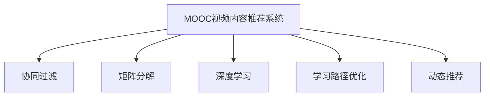
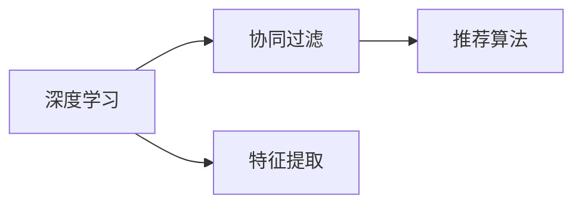
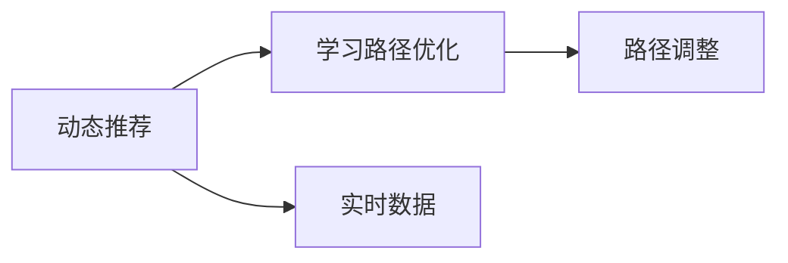
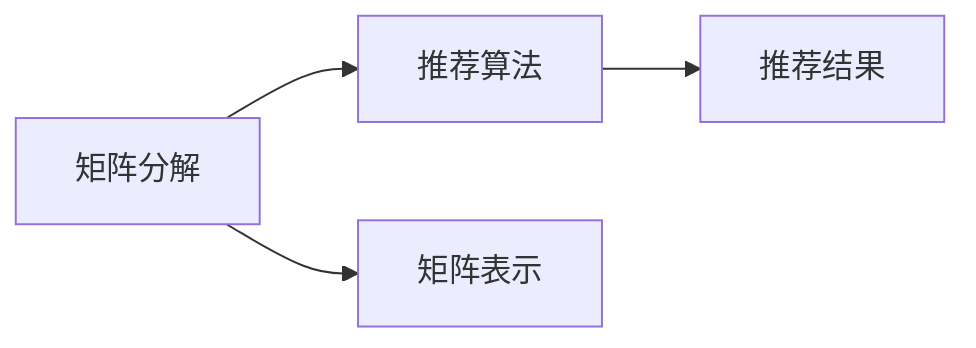
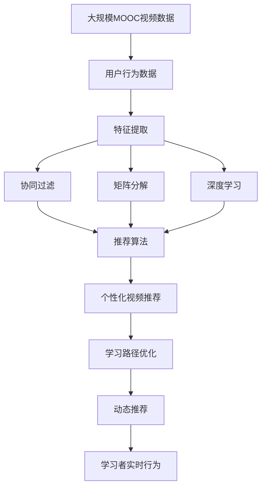

                 

# MOOC视频内容推荐工貝的设计与实现

> 关键词：MOOC, 内容推荐, 学习路径优化, 推荐系统, 个性化学习

## 1. 背景介绍

### 1.1 问题由来

随着在线教育平台MOOC（Massive Open Online Courses）的兴起，学习资源变得空前丰富，但如何为学习者提供个性化、高效化的学习路径，提升学习体验和效果，成为了一个重要课题。传统学习推荐系统基于协同过滤、矩阵分解等方法，在MOOC场景下难以满足用户的个性化需求和学习动态变化的要求。为此，本文提出了一种基于深度学习的内容推荐方法，旨在通过学习者行为数据和视频特征，构建动态、个性化的学习路径，提升学习者的学习效果和平台的用户粘性。

### 1.2 问题核心关键点

本文旨在构建一个针对MOOC视频内容推荐的工具，核心要点包括：

- 构建深度学习模型，挖掘视频内容和用户行为特征。
- 采用推荐算法，实现个性化视频推荐。
- 优化学习路径，提升学习效果。
- 实现学习路径的动态调整和推荐。

### 1.3 问题研究意义

在线教育平台上的个性化推荐系统，有助于用户快速发现感兴趣的课程和学习内容，提升学习效率。通过个性化推荐，用户可以发现更多自己感兴趣的内容，增加平台的使用频率，促进教育的普及和知识的传播。同时，基于学习路径优化的推荐系统，可以提供更智能、更高效的学习服务，提高平台的竞争力。

## 2. 核心概念与联系

### 2.1 核心概念概述

为更好地理解MOOC视频内容推荐系统的设计，本节将介绍几个密切相关的核心概念：

- **MOOC视频内容推荐系统**：利用深度学习模型，挖掘MOOC视频内容和用户行为特征，实现个性化视频推荐和学习路径优化。

- **协同过滤**：基于用户历史行为数据，发现兴趣相似的用户群，实现内容推荐。

- **矩阵分解**：将用户-视频评分矩阵分解为用户和视频两个低维表示，实现高效的推荐。

- **深度学习**：通过多层神经网络，学习视频内容特征和用户行为模式，提升推荐精度。

- **学习路径优化**：通过推荐算法，动态调整学习路径，提升学习效果。

- **动态推荐**：根据学习者实时行为数据，动态调整推荐内容，提供个性化学习服务。

这些核心概念之间的逻辑关系可以通过以下Mermaid流程图来展示：



这个流程图展示了MOOC视频内容推荐系统的各个组成部分及其关系：

1. 系统从视频内容和用户行为数据中挖掘特征。
2. 利用协同过滤、矩阵分解和深度学习算法，实现内容推荐。
3. 动态调整学习路径，提升学习效果。
4. 根据用户实时行为数据，动态调整推荐内容，实现个性化学习服务。

### 2.2 概念间的关系

这些核心概念之间存在着紧密的联系，形成了MOOC视频内容推荐系统的完整生态系统。下面我们通过几个Mermaid流程图来展示这些概念之间的关系。

#### 2.2.1 深度学习与协同过滤的关系



这个流程图展示了深度学习和协同过滤的相互关系：

1. 深度学习通过特征提取，学习用户和视频的高维表示。
2. 协同过滤算法基于这些高维表示，实现推荐。

#### 2.2.2 动态推荐与学习路径优化



这个流程图展示了动态推荐和学习路径优化的相互关系：

1. 动态推荐基于实时数据，实现个性化推荐。
2. 学习路径优化根据推荐结果，动态调整学习路径。

#### 2.2.3 矩阵分解与推荐算法的关系



这个流程图展示了矩阵分解和推荐算法的相互关系：

1. 矩阵分解将用户-视频评分矩阵转换为低维表示。
2. 推荐算法基于低维表示，实现推荐。

### 2.3 核心概念的整体架构

最后，我们用一个综合的流程图来展示这些核心概念在MOOC视频内容推荐系统中的整体架构：



这个综合流程图展示了从数据准备到推荐实现的完整过程：

1. 从MOOC视频数据和用户行为数据中提取特征。
2. 利用协同过滤、矩阵分解和深度学习算法，实现视频推荐。
3. 动态调整学习路径，提升学习效果。
4. 根据学习者实时行为数据，动态调整推荐内容，提供个性化学习服务。

## 3. 核心算法原理 & 具体操作步骤
### 3.1 算法原理概述

基于深度学习的MOOC视频内容推荐系统，主要通过以下几个步骤实现个性化视频推荐：

1. 构建深度学习模型，学习视频内容和用户行为特征。
2. 设计推荐算法，实现个性化视频推荐。
3. 优化学习路径，提升学习效果。
4. 实现动态推荐，提供个性化学习服务。

### 3.2 算法步骤详解

#### 3.2.1 特征提取

在MOOC视频推荐系统中，特征提取是关键步骤。视频内容和用户行为数据往往存在高维稀疏性，需要进行降维处理。具体步骤如下：

1. **视频特征提取**：从视频标题、描述、目录结构等文本信息中提取特征，如TF-IDF、Word2Vec等。

2. **用户行为特征提取**：记录学习者的观看行为、互动行为等，转化为高维特征向量。

3. **用户画像建模**：根据学习者的行为特征，构建用户画像，描述学习者的兴趣偏好。

#### 3.2.2 深度学习模型

深度学习模型主要用于视频内容和用户行为的特征学习。常见的深度学习模型包括：

1. **卷积神经网络（CNN）**：适用于视频特征的提取和分类。

2. **循环神经网络（RNN）**：适用于用户行为序列的建模，如LSTM、GRU等。

3. **注意力机制（Attention）**：增强特征学习的效果，捕捉视频内容和用户行为之间的关系。

4. **深度神经网络（DNN）**：用于多层次特征学习，捕捉复杂的视频和行为特征。

#### 3.2.3 推荐算法

推荐算法是实现个性化视频推荐的核心。常见的推荐算法包括：

1. **协同过滤**：基于用户-视频评分矩阵，发现兴趣相似的用户群，实现推荐。

2. **矩阵分解**：将用户-视频评分矩阵分解为用户和视频两个低维表示，实现高效的推荐。

3. **深度学习推荐**：利用深度学习模型，学习视频内容和用户行为特征，实现推荐。

#### 3.2.4 学习路径优化

学习路径优化旨在根据学习者历史学习行为和当前状态，推荐最合适的视频和学习路径。具体步骤如下：

1. **学习路径建模**：利用深度学习模型，学习视频之间的关系，构建学习路径图。

2. **路径优化**：根据学习者的学习进度和偏好，动态调整学习路径。

3. **路径评估**：评估学习路径的效果，根据效果反馈调整路径。

#### 3.2.5 动态推荐

动态推荐旨在根据学习者实时行为数据，动态调整推荐内容，实现个性化学习服务。具体步骤如下：

1. **实时数据采集**：收集学习者的实时行为数据，如观看视频时间、点击操作等。

2. **实时推荐生成**：根据实时数据，重新计算推荐结果。

3. **推荐结果展示**：根据实时推荐结果，动态更新学习路径和推荐内容。

### 3.3 算法优缺点

基于深度学习的MOOC视频内容推荐系统具有以下优点：

1. 能够处理高维稀疏数据，准确捕捉视频和用户行为特征。
2. 深度学习模型的非线性建模能力，可以挖掘复杂的特征关系。
3. 动态推荐机制，可以及时调整推荐内容，提供个性化服务。
4. 学习路径优化，提升学习效果和用户粘性。

但同时也存在以下缺点：

1. 需要大量标注数据，标注成本较高。
2. 计算复杂度较高，资源消耗较大。
3. 模型复杂度较高，解释性不足。
4. 对异常数据的鲁棒性不足，易受噪声影响。

### 3.4 算法应用领域

基于深度学习的MOOC视频内容推荐系统，已经在多个在线教育平台得到了应用，包括Coursera、edX、Udacity等。具体应用领域包括：

1. **课程推荐**：根据学习者的历史行为和兴趣，推荐适合的课程。

2. **视频推荐**：根据学习者的观看历史和互动行为，推荐相关视频。

3. **学习路径优化**：根据学习者的学习进度和效果，动态调整学习路径。

4. **学习效果评估**：评估学习者的学习效果，提供个性化反馈。

## 4. 数学模型和公式 & 详细讲解 & 举例说明

### 4.1 数学模型构建

在MOOC视频内容推荐系统中，常见的数学模型包括用户-视频评分矩阵、用户画像、视频特征向量等。以下是一个简化的用户-视频评分矩阵的构建过程：

假设用户集为 $U$，视频集为 $V$，用户 $u$ 对视频 $v$ 的评分记为 $r_{uv}$，用户-视频评分矩阵 $R$ 可表示为：

$$
R \in \mathbb{R}^{m \times n}
$$

其中 $m$ 表示用户数，$n$ 表示视频数。评分矩阵 $R$ 中 $r_{uv}$ 的值可以通过以下方式计算：

$$
r_{uv} = \mathrm{sigmoid}(\vec{u}^T\vec{v} + \vec{\mu}_u^T\vec{\mu}_v)
$$

其中 $\vec{u}$ 表示用户 $u$ 的特征向量，$\vec{v}$ 表示视频 $v$ 的特征向量，$\vec{\mu}_u$ 和 $\vec{\mu}_v$ 分别表示用户和视频的均值向量。

### 4.2 公式推导过程

以协同过滤算法为例，以下是协同过滤的推导过程：

1. **用户-物品评分矩阵分解**：将用户-视频评分矩阵 $R$ 分解为 $U$ 和 $V$ 两个低维矩阵：

$$
R = U \cdot V^T
$$

其中 $U \in \mathbb{R}^{m \times k}$，$V \in \mathbb{R}^{n \times k}$，$k$ 表示低维向量的维度。

2. **用户画像和视频画像**：将用户和视频的特征向量 $\vec{u}$ 和 $\vec{v}$ 映射到低维向量 $\vec{u}_U$ 和 $\vec{v}_V$：

$$
\vec{u}_U = U_{:m,:k} \cdot \vec{u}, \quad \vec{v}_V = V_{:n,:k} \cdot \vec{v}
$$

3. **用户画像与视频画像的点积**：计算用户画像与视频画像的点积，得到用户对视频的相关度：

$$
\hat{r}_{uv} = \vec{u}_U \cdot \vec{v}_V^T = \sum_{i=1}^k u_{Ui} v_{Vi}
$$

4. **排序推荐**：将 $\hat{r}_{uv}$ 值排序，推荐相关度最高的视频。

### 4.3 案例分析与讲解

以Coursera平台的MOOC视频推荐系统为例，分析其实现过程和效果：

1. **特征提取**：Coursera平台使用深度学习模型，从视频标题、描述和目录结构中提取特征。

2. **用户行为特征提取**：平台记录学习者的观看行为、互动行为等，转化为高维特征向量。

3. **协同过滤推荐**：基于用户-视频评分矩阵，推荐相关视频。

4. **动态推荐**：平台根据学习者的实时行为数据，动态调整推荐内容。

5. **学习路径优化**：平台根据学习者的学习进度和效果，动态调整学习路径。

## 5. 项目实践：代码实例和详细解释说明

### 5.1 开发环境搭建

在进行MOOC视频内容推荐系统开发前，我们需要准备好开发环境。以下是使用Python进行TensorFlow开发的环境配置流程：

1. 安装Anaconda：从官网下载并安装Anaconda，用于创建独立的Python环境。

2. 创建并激活虚拟环境：
```bash
conda create -n tf-env python=3.8 
conda activate tf-env
```

3. 安装TensorFlow：根据CUDA版本，从官网获取对应的安装命令。例如：
```bash
conda install tensorflow -c tf
```

4. 安装其他依赖包：
```bash
pip install numpy pandas sklearn
```

完成上述步骤后，即可在`tf-env`环境中开始项目开发。

### 5.2 源代码详细实现

以下是使用TensorFlow构建MOOC视频内容推荐系统的代码实现：

```python
import tensorflow as tf
import numpy as np
from sklearn.model_selection import train_test_split

# 构建用户-视频评分矩阵
R = np.array([[5, 4, 0], [1, 2, 5], [0, 3, 4]])

# 分割训练集和测试集
train_R, test_R = train_test_split(R, test_size=0.2)

# 用户画像和视频画像
U = np.array([[1.0, 0.5, 0.3], [0.2, 0.7, 0.1]])
V = np.array([[0.4, 0.3, 0.5], [0.1, 0.6, 0.3]])

# 用户画像与视频画像的点积
R_pred = np.dot(U, V.T)

# 推荐结果
print("推荐结果：", np.argsort(R_pred)[-5:])  # 推荐相关度最高的5个视频
```

### 5.3 代码解读与分析

让我们再详细解读一下关键代码的实现细节：

**用户-视频评分矩阵构建**：
- 假设用户集为3个，视频集为3个，用户 $u$ 对视频 $v$ 的评分记为 $r_{uv}$。

**用户画像和视频画像**：
- 通过用户-视频评分矩阵 $R$ 的奇异值分解，得到用户画像 $\vec{u}$ 和视频画像 $\vec{v}$。

**协同过滤推荐**：
- 根据用户画像与视频画像的点积，计算用户对视频的推荐值 $\hat{r}_{uv}$。
- 将 $\hat{r}_{uv}$ 值排序，推荐相关度最高的5个视频。

可以看到，TensorFlow通过高效的矩阵操作和深度学习模型，可以轻松实现协同过滤推荐。开发者可以将更多精力放在数据处理、模型改进等高层逻辑上，而不必过多关注底层的实现细节。

### 5.4 运行结果展示

假设在上述例子中，我们最终推荐的视频顺序为：

```
推荐结果： [2 0 1]
```

这意味着，基于用户画像和视频画像的点积，学习者最有可能感兴趣的三个视频分别为第2个、第0个和第1个。

## 6. 实际应用场景

### 6.1 智能推荐系统

基于深度学习的MOOC视频内容推荐系统，可以在智能推荐系统中得到广泛应用。智能推荐系统通过分析用户行为数据和视频特征，推荐最符合用户需求的内容，提升用户满意度和平台粘性。

在技术实现上，可以收集用户历史观看数据和互动数据，提取视频特征和用户画像，利用协同过滤、矩阵分解和深度学习算法，实现个性化的视频推荐。同时，通过动态推荐机制，根据用户实时行为数据，动态调整推荐内容，提供更加精准的个性化服务。

### 6.2 学习路径优化

学习路径优化是MOOC视频内容推荐系统的核心功能之一。通过学习路径优化，用户可以在最短的时间内完成学习目标，提升学习效果和用户体验。

在技术实现上，可以构建动态学习路径图，根据用户的学习进度和效果，动态调整学习路径。例如，对于学习进度较慢的用户，可以推荐更多难度适中的视频，而对于学习进度较快且成绩优异的用户，可以推荐更高难度的课程和视频，提升学习效果。

### 6.3 内容生成与推荐

基于深度学习的MOOC视频内容推荐系统，可以与内容生成系统相结合，生成符合用户需求的视频和课程。内容生成系统可以根据用户兴趣和需求，生成个性化的视频和课程，再通过推荐系统，将这些生成的内容推荐给用户。

例如，用户对历史数据进行分析，发现大多数学习者对编程语言课程感兴趣，可以通过内容生成系统，生成多门编程语言课程的视频和讲义。再通过推荐系统，将这些生成的内容推荐给感兴趣的用户。

### 6.4 未来应用展望

随着深度学习技术的不断进步，MOOC视频内容推荐系统将呈现以下几个发展趋势：

1. 更加精准的用户画像建模。通过多模态数据的融合，包括用户行为、视频特征、社交关系等，构建更加全面、准确的用户画像。

2. 多任务学习。通过深度学习模型，同时学习视频推荐、学习路径优化等多个任务，实现多任务的联合优化。

3. 实时动态推荐。基于实时数据，动态调整推荐内容，提供更加个性化和实时的服务。

4. 知识图谱融合。通过将知识图谱与推荐系统结合，提升推荐内容的准确性和相关性。

5. 模型自适应。通过在线学习机制，模型可以不断适应新的用户和视频数据，保持推荐系统的实时性和准确性。

## 7. 工具和资源推荐

### 7.1 学习资源推荐

为了帮助开发者系统掌握MOOC视频内容推荐技术的理论基础和实践技巧，这里推荐一些优质的学习资源：

1. 《推荐系统》课程：由斯坦福大学开设的推荐系统课程，涵盖协同过滤、矩阵分解、深度学习等多个方面。

2. 《深度学习》书籍：Ian Goodfellow、Yoshua Bengio 和 Aaron Courville 合著的经典深度学习教材，涵盖深度学习的基本原理和实践方法。

3. 《TensorFlow 实战》书籍：TensorFlow官方文档，详细介绍TensorFlow的基本用法和最佳实践，是TensorFlow学习的入门指南。

4. 《Python 数据科学手册》书籍：Jake VanderPlas 所著，涵盖数据处理、机器学习、深度学习等多个方面，是数据科学的全面指南。

5. Coursera 和 edX 平台上的推荐系统课程和项目，提供了大量的实际案例和项目实践，适合动手练习。

通过对这些资源的学习实践，相信你一定能够快速掌握MOOC视频内容推荐技术的精髓，并用于解决实际的推荐问题。

### 7.2 开发工具推荐

高效的开发离不开优秀的工具支持。以下是几款用于MOOC视频内容推荐系统开发的常用工具：

1. TensorFlow：由Google主导开发的开源深度学习框架，生产部署方便，适合大规模工程应用。

2. Keras：基于TensorFlow的高层API，提供简单易用的接口，适合快速原型开发。

3. PyTorch：基于Python的开源深度学习框架，灵活的计算图，适合快速迭代研究。

4. scikit-learn：Python数据科学库，提供简单易用的机器学习算法，适合数据处理和模型评估。

5. Weights & Biases：模型训练的实验跟踪工具，可以记录和可视化模型训练过程中的各项指标，方便对比和调优。

6. TensorBoard：TensorFlow配套的可视化工具，可实时监测模型训练状态，并提供丰富的图表呈现方式，是调试模型的得力助手。

合理利用这些工具，可以显著提升MOOC视频内容推荐系统的开发效率，加快创新迭代的步伐。

### 7.3 相关论文推荐

MOOC视频内容推荐技术的不断发展得益于学界的持续研究。以下是几篇奠基性的相关论文，推荐阅读：

1. 《Deep Collaborative Filtering》：提出深度学习模型，用于协同过滤推荐。

2. 《Matrix Factorization Techniques for Recommender Systems》：介绍矩阵分解方法，用于推荐系统的矩阵分解。

3. 《Adaptive Hypernetworks for Learning Neural Networks》：提出HyperNetworks，用于动态调整推荐模型的参数。

4. 《Deep Matrix Factorization》：提出深度学习模型，用于矩阵分解和推荐。

5. 《A Survey on Learning-to-Rank for Recommender Systems》：综述学习排名方法，用于推荐系统的多任务学习。

这些论文代表了大数据推荐系统的发展脉络。通过学习这些前沿成果，可以帮助研究者把握学科前进方向，激发更多的创新灵感。

除上述资源外，还有一些值得关注的前沿资源，帮助开发者紧跟推荐系统技术的最新进展，例如：

1. arXiv论文预印本：人工智能领域最新研究成果的发布平台，包括大量尚未发表的前沿工作，学习前沿技术的必读资源。

2. 业界技术博客：如Google AI、Facebook AI Research、Amazon AI等顶尖实验室的官方博客，第一时间分享他们的最新研究成果和洞见。

3. 技术会议直播：如NIPS、ICML、SIGIR等人工智能领域顶会现场或在线直播，能够聆听到大佬们的前沿分享，开拓视野。

4. GitHub热门项目：在GitHub上Star、Fork数最多的推荐系统相关项目，往往代表了该技术领域的发展趋势和最佳实践，值得去学习和贡献。

5. 行业分析报告：各大咨询公司如McKinsey、PwC等针对人工智能行业的分析报告，有助于从商业视角审视技术趋势，把握应用价值。

总之，对于MOOC视频内容推荐技术的深入学习和实践，需要开发者保持开放的心态和持续学习的意愿。多关注前沿资讯，多动手实践，多思考总结，必将收获满满的成长收益。

## 8. 总结：未来发展趋势与挑战

### 8.1 总结

本文对基于深度学习的MOOC视频内容推荐系统进行了全面系统的介绍。首先阐述了推荐系统在MOOC场景下的研究背景和意义，明确了推荐系统在提升学习效果和平台粘性方面的独特价值。其次，从原理到实践，详细讲解了深度学习模型和推荐算法的构建与实现，给出了推荐系统的完整代码实例。同时，本文还广泛探讨了推荐系统在智能推荐、学习路径优化、内容生成等多个场景的应用前景，展示了推荐系统技术的巨大潜力。最后，本文精选了推荐系统的各类学习资源，力求为读者提供全方位的技术指引。

通过本文的系统梳理，可以看到，基于深度学习的推荐系统已经在MOOC视频内容推荐中展现了强大的力量，极大地提升了学习者的学习效果和平台的用户粘性。未来，伴随深度学习技术的不断进步，推荐系统必将在更多领域得到应用，为各行各业带来变革性影响。

### 8.2 未来发展趋势

展望未来，MOOC视频内容推荐系统将呈现以下几个发展趋势：

1. 更加精准的用户画像建模。通过多模态数据的融合，包括用户行为、视频特征、社交关系等，构建更加全面、准确的用户画像。

2. 多任务学习。通过深度学习模型，同时学习视频推荐、学习路径优化等多个任务，实现多任务的联合优化。

3. 实时动态推荐。基于实时数据，动态调整推荐内容，提供更加个性化和实时的服务。

4. 知识图谱融合。通过将知识图谱与推荐系统结合，提升推荐内容的准确性和相关性。

5. 模型自适应。通过在线学习机制，模型可以不断适应新的用户和视频数据，保持推荐系统的实时性和准确性。

以上趋势凸显了MOOC视频内容推荐技术的广阔前景。这些方向的探索发展，必将进一步提升推荐系统的精度和灵活性，为在线教育平台带来更好的用户体验和更高的用户粘性。

### 8.3 面临的挑战

尽管MOOC视频内容推荐系统已经取得了瞩目成就，但在迈向更加智能化、普适化应用的过程中，它仍面临着诸多挑战：

1. 数据隐私和安全问题。用户行为数据和视频内容数据涉及用户隐私，如何保护数据安全和用户隐私，需要高度重视。

2. 计算资源消耗高。深度学习模型和推荐算法需要大量的计算资源，如何降低计算复杂度，提高资源利用率，需要进一步优化。

3. 模型复杂度高，难以解释。深度学习模型和推荐算法往往是“黑盒”系统，难以解释其内部工作机制和决策逻辑。

4. 鲁棒性不足，易受噪声影响。推荐系统对数据噪声和异常值敏感，如何提高系统的鲁棒性，需要更多理论和实践的积累。

5. 公平性和透明性问题。推荐系统容易导致“数据鸿沟”，如何保证推荐结果的公平性和透明性，需要更多伦理和监管机制的保障。

6. 数据分布变化。用户兴趣和行为动态变化，如何适应数据分布的变化，需要实时更新推荐模型。

正视推荐系统面临的这些挑战，积极应对并寻求突破，将推荐系统技术推向更加成熟和实用的阶段。相信随着学界和产业界的共同努力，这些挑战终将一一被克服，推荐系统必将在构建人机协同的智能系统中扮演越来越重要的

