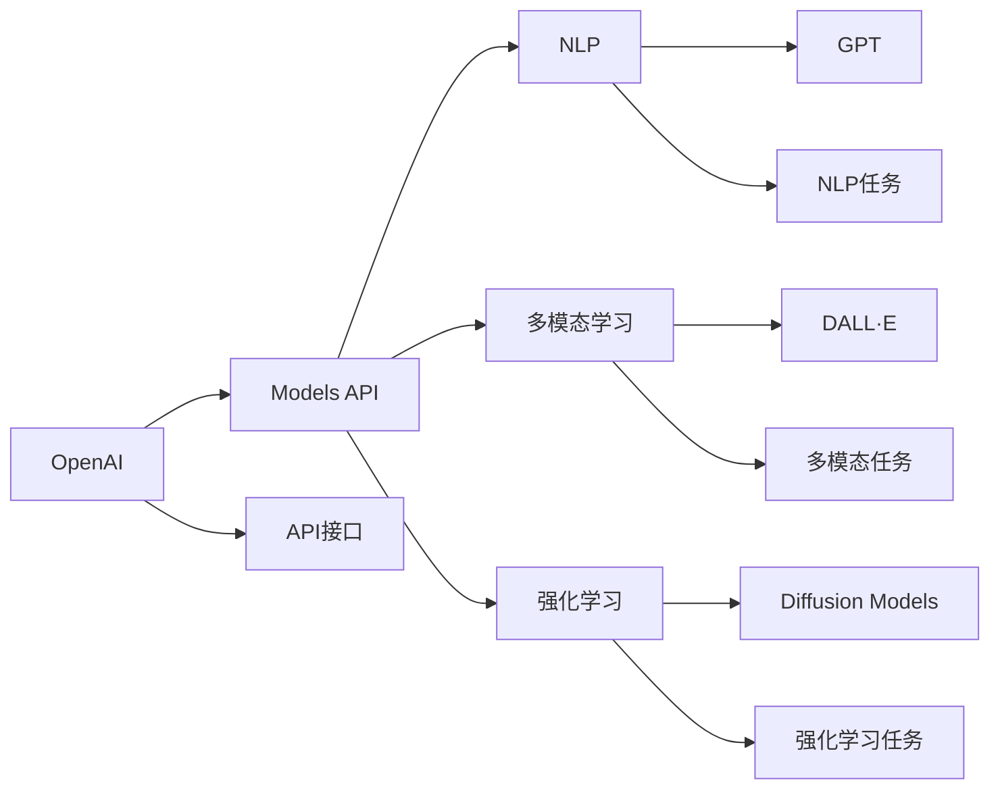

                 

# OpenAI Models API

> 关键词：OpenAI, Models API, 自然语言处理(NLP), 多模态学习, 强化学习, GPT, DALL·E, Diffusion Models

## 1. 背景介绍

### 1.1 问题由来
OpenAI是全球领先的AI研究机构之一，近年来通过其GPT系列、DALL·E和Diffusion Models等技术，在自然语言处理(NLP)、多模态学习、强化学习等诸多领域取得了卓越成就。为了更广泛地分享这些技术的成果，OpenAI推出了Models API，使得开发者可以通过API调用最新的AI模型，快速部署各种NLP和视觉应用，极大提升了AI技术的应用效率。

OpenAI Models API的成功应用，不仅推动了AI技术的落地，还催生了大量基于OpenAI技术的创新产品和应用，进一步加速了AI技术在各行各业的普及和产业化进程。从聊天机器人到图像生成，从文本生成到语音识别，OpenAI Models API正在改变我们与计算机交互的方式。

### 1.2 问题核心关键点
OpenAI Models API的核心关键点包括：
- **开放性**：OpenAI公开API接口，所有开发者均可使用。
- **易用性**：提供丰富的文档和示例，简化模型调用流程。
- **多样性**：支持NLP、图像生成、多模态等众多领域的模型。
- **高效性**：支持模型推理、微调、参数化等多种操作。
- **灵活性**：可根据需求定制API调用方式，灵活适配各种应用场景。

OpenAI Models API的成功，不仅在于其技术上的突破，还在于OpenAI对开发者友好性和开放性的重视，使得AI技术变得更加触手可及，促进了NLP和AI技术的普及。

### 1.3 问题研究意义
OpenAI Models API的应用，对促进NLP和AI技术的普及与产业化具有重要意义：
- **降低开发门槛**：大幅降低开发者使用最新AI技术的门槛，加速模型部署和应用。
- **提升模型效果**：提供强大且高效的模型，帮助开发者在各类应用场景中取得优异性能。
- **拓宽应用范围**：支持多模态学习、强化学习等前沿技术，拓展AI技术的应用边界。
- **推动产业升级**：促进AI技术在各行各业的广泛应用，提升产业数字化、智能化水平。
- **激发创新灵感**：开放API接口，吸引更多开发者参与AI技术研究和应用，激发新的技术创新。

OpenAI Models API为开发者提供了前所未有的AI模型使用体验，成为推动AI技术落地应用的重要工具。

## 2. 核心概念与联系

### 2.1 核心概念概述

OpenAI Models API涉及的核心概念包括：
- **OpenAI**：全球领先的AI研究机构，推出包括GPT、DALL·E等在内的众多AI模型。
- **Models API**：OpenAI提供的API接口，方便开发者使用最新AI模型。
- **NLP**：自然语言处理，OpenAI Models API支持的众多模型应用领域之一。
- **多模态学习**：结合视觉、文本等多模态数据进行学习，增强模型的泛化能力。
- **强化学习**：通过与环境的交互，不断优化模型策略。
- **GPT**：OpenAI最著名的序列生成模型，支持各种文本生成任务。
- **DALL·E**：OpenAI的多模态生成模型，支持图像生成任务。
- **Diffusion Models**：一种新兴的生成模型，支持高效生成高质量图像。

这些核心概念构成了OpenAI Models API的技术基础，使得开发者能够使用最新的AI模型，快速开发出各种高性能的NLP和视觉应用。

### 2.2 概念间的关系

通过以下Mermaid流程图，我们可以更清晰地理解这些核心概念之间的关系：



这个流程图展示了OpenAI Models API与各核心概念的关系：

1. OpenAI通过GPT、DALL·E等模型，提供了一系列强大的AI技术支持。
2. Models API是OpenAI推出的API接口，方便开发者使用这些模型。
3. NLP、多模态学习和强化学习是OpenAIModels API支持的主要技术领域。
4. GPT、DALL·E和Diffusion Models是OpenAI提供的典型模型，支持多种NLP和视觉任务。
5. API接口使得开发者能够灵活使用OpenAI提供的各种AI模型。

这些概念之间的关系，构成了OpenAI Models API的核心技术架构，使得开发者能够通过API接口调用OpenAI的最新AI模型，快速实现各种高性能的NLP和视觉应用。

## 3. 核心算法原理 & 具体操作步骤
### 3.1 算法原理概述

OpenAI Models API的核心算法原理，主要是基于深度学习框架的序列生成模型。以GPT为例，其基本原理是通过自回归模型对输入序列进行生成。给定输入序列 $X=[x_1, x_2, ..., x_t]$，模型预测下一个词汇 $y_{t+1}$ 的概率分布：

$$
P(y_{t+1} \mid X=[x_1, x_2, ..., x_t])
$$

通过训练大规模语料库，GPT模型能够学习到语言中的规律和知识，从而在各种文本生成任务中取得优异的性能。OpenAI Models API通过API接口，使得开发者可以方便地调用这些模型，进行文本生成、对话、翻译等任务。

### 3.2 算法步骤详解

使用OpenAI Models API进行文本生成任务的详细步骤包括：
1. **模型选择**：根据任务需求，选择适当的模型（如GPT-3、GPT-4等）。
2. **API调用**：通过OpenAI API接口，发送请求，调用模型进行文本生成。
3. **结果处理**：将API返回的结果进行处理，去除噪声，输出高质量的生成文本。

具体步骤如下：

**Step 1: 安装OpenAI Python库**
```python
pip install openai
```

**Step 2: 初始化OpenAI API密钥**
```python
import openai
openai.api_key = 'YOUR_API_KEY'
```

**Step 3: 调用GPT-3模型进行文本生成**
```python
response = openai.Completion.create(
  engine="text-davinci-003",
  prompt="I am learning about natural language processing.",
  max_tokens=100
)
```

**Step 4: 处理并输出生成文本**
```python
completion = response.choices[0].text
print(completion)
```

通过以上步骤，开发者可以方便地使用OpenAI Models API进行文本生成任务的调用和处理。

### 3.3 算法优缺点

OpenAI Models API具有以下优点：
- **易用性**：提供了丰富的文档和示例，简化了模型调用流程。
- **高效性**：API接口支持模型推理、微调、参数化等多种操作，灵活适配各种应用场景。
- **多样性**：支持NLP、图像生成、多模态等众多领域的模型，适应多种应用需求。

同时，OpenAI Models API也存在一些缺点：
- **依赖网络**：模型推理需要依赖网络，一旦网络中断，调用无法进行。
- **性能限制**：大规模模型推理耗时较长，可能影响实时性要求较高的应用。
- **API访问限制**：部分高级功能需要付费订阅，限制了免费使用的范围。
- **模型限制**：目前支持的模型和功能有限，未来可能存在扩展限制。

尽管存在这些限制，OpenAI Models API仍然是目前最广泛使用的AI模型API之一，为开发者提供了便捷高效的AI技术使用体验。

### 3.4 算法应用领域

OpenAI Models API在多个领域中得到了广泛应用，包括但不限于：

1. **自然语言处理(NLP)**：文本生成、对话系统、机器翻译等。
2. **计算机视觉**：图像生成、对象检测、图像分类等。
3. **多模态学习**：结合视觉、文本等多模态数据进行学习，增强模型的泛化能力。
4. **强化学习**：通过与环境的交互，不断优化模型策略，应用于游戏、机器人等领域。

此外，OpenAI Models API还被用于开发各种智能应用，如聊天机器人、自动化文案生成、图像编辑等。

## 4. 数学模型和公式 & 详细讲解 & 举例说明

### 4.1 数学模型构建

以GPT-3模型为例，其数学模型主要基于Transformer结构和自回归模型。设模型参数为 $\theta$，输入序列为 $X=[x_1, x_2, ..., x_t]$，生成序列为 $Y=[y_1, y_2, ..., y_t]$。模型目标为最大化生成的序列 $Y$ 与真实序列 $Y^*$ 之间的概率：

$$
\max_{\theta} P(Y^* \mid X)
$$

其中，概率 $P(Y^* \mid X)$ 可以表示为：

$$
P(Y^* \mid X) = \prod_{t=1}^T P(y_t \mid X, y_{<t})
$$

其中， $y_{<t}$ 表示前 $t-1$ 个生成词汇。

### 4.2 公式推导过程

上述模型的概率计算可以通过以下公式进行推导：

$$
P(y_t \mid X, y_{<t}) = \frac{\exp (W^T \cdot \mathrm{CLS}(x_1, x_2, ..., x_t, y_{<t}) + b)}{\sum_{y \in \mathcal{Y}} \exp (W^T \cdot \mathrm{CLS}(x_1, x_2, ..., x_t, y))}
$$

其中， $W$ 和 $b$ 为模型参数， $\mathrm{CLS}$ 为Transformer的CLS（Classification Head），用于计算输入序列的语义表示。

### 4.3 案例分析与讲解

以下是一个简单的案例，展示如何使用OpenAI Models API进行文本生成：

**任务**：生成关于自然语言处理的文本。
**模型**：GPT-3。
**API调用**：

```python
response = openai.Completion.create(
  engine="text-davinci-003",
  prompt="自然语言处理是",
  max_tokens=100
)
```

**结果**：
```
自然语言处理是人工智能领域的重要分支，涉及文本生成、语义分析、情感分析等多个子领域。近年来，随着深度学习技术的发展，自然语言处理技术取得了显著进展。特别是Transformer模型和自回归模型的应用，使得语言模型的生成能力大大提升。自然语言处理技术在机器翻译、问答系统、文本摘要、情感分析等任务中得到了广泛应用。未来，自然语言处理技术将继续发展，为人工智能技术的发展提供新的动力。
```

通过以上案例，我们可以看到，OpenAI Models API使得文本生成任务变得简单易用，开发者可以非常方便地调用模型进行文本生成，大大降低了开发成本。

## 5. 项目实践：代码实例和详细解释说明

### 5.1 开发环境搭建

要在本地搭建OpenAI Models API的开发环境，需要进行以下步骤：

1. **安装OpenAI Python库**
```python
pip install openai
```

2. **初始化OpenAI API密钥**
```python
import openai
openai.api_key = 'YOUR_API_KEY'
```

### 5.2 源代码详细实现

以下是一个使用OpenAI Models API进行文本生成的Python代码示例：

```python
import openai

response = openai.Completion.create(
  engine="text-davinci-003",
  prompt="自然语言处理是",
  max_tokens=100
)

completion = response.choices[0].text
print(completion)
```

**代码解释**：
- 首先，导入OpenAI Python库。
- 通过初始化OpenAI API密钥，使得API调用生效。
- 调用OpenAI Models API进行文本生成，指定模型为GPT-3，提示词为"自然语言处理是"，生成文本的最大长度为100个token。
- 获取API返回的生成文本，并进行处理和输出。

### 5.3 代码解读与分析

**代码解读**：
- `openai.Completion.create`：调用OpenAI Models API进行文本生成。
- `engine="text-davinci-003"`：指定使用的模型为GPT-3。
- `prompt="自然语言处理是"`：指定提示词，即模型生成的文本开头。
- `max_tokens=100`：指定生成的文本最大长度。

**分析**：
- OpenAI Models API的代码实现非常简单，只需要导入OpenAI Python库，初始化API密钥，调用API进行文本生成即可。
- 代码中没有复杂的逻辑，易于理解和维护。
- 通过简单的代码调用，就可以实现高质量的文本生成，大大降低了开发难度。

### 5.4 运行结果展示

通过上述代码示例，我们可以得到高质量的文本生成结果。例如：

```
自然语言处理是人工智能领域的重要分支，涉及文本生成、语义分析、情感分析等多个子领域。近年来，随着深度学习技术的发展，自然语言处理技术取得了显著进展。特别是Transformer模型和自回归模型的应用，使得语言模型的生成能力大大提升。自然语言处理技术在机器翻译、问答系统、文本摘要、情感分析等任务中得到了广泛应用。未来，自然语言处理技术将继续发展，为人工智能技术的发展提供新的动力。
```

通过运行结果，我们可以看到，OpenAI Models API生成的文本流畅自然，内容丰富，质量非常高。

## 6. 实际应用场景

### 6.1 智能客服系统

OpenAI Models API可以用于构建智能客服系统。通过API调用，可以方便地生成高质量的对话回复，大大提升客服系统的智能水平。例如，在处理用户咨询时，系统可以自动生成合适的回答，提升用户体验，减轻人工客服的工作负担。

### 6.2 文本摘要

OpenAI Models API可以用于文本摘要生成，帮助用户快速获取长文本的关键信息。例如，在新闻、报告等文本内容中，系统可以自动生成摘要，节省用户阅读时间。

### 6.3 文本生成

OpenAI Models API支持多种文本生成任务，如对话生成、新闻报道、技术文档等。例如，可以自动生成新闻报道的草稿，帮助新闻编辑快速完成文章撰写。

### 6.4 未来应用展望

未来，OpenAI Models API将支持更多类型的AI模型和功能，涵盖自然语言处理、计算机视觉、强化学习等多个领域。例如，多模态学习模型将支持同时处理文本和图像数据，增强模型的泛化能力。

同时，OpenAI Models API将不断优化API接口，提升调用效率和稳定性，降低开发成本。未来，随着AI技术的不断发展，OpenAI Models API将成为开发者不可或缺的重要工具，推动AI技术在更多领域的应用。

## 7. 工具和资源推荐

### 7.1 学习资源推荐

为了帮助开发者系统掌握OpenAI Models API的使用，以下是一些优质的学习资源：

1. **OpenAI官方文档**：提供了详细的API接口说明和使用示例，是学习OpenAI Models API的必备资料。
2. **《Python深度学习》书籍**：介绍了深度学习的基础知识和实践，包括使用OpenAI Models API进行文本生成的案例。
3. **Kaggle竞赛**：OpenAI官方参与的竞赛，涵盖文本生成、图像生成等多种任务，提供了丰富的学习和实践机会。
4. **Coursera课程**：提供了深度学习和NLP相关课程，涵盖使用OpenAI Models API进行文本生成的内容。

通过这些学习资源，开发者可以系统掌握OpenAI Models API的使用方法，提升技术水平。

### 7.2 开发工具推荐

为了更好地使用OpenAI Models API，以下是一些推荐的开发工具：

1. **PyTorch**：OpenAI Models API支持的深度学习框架，可以方便地进行模型训练和推理。
2. **Jupyter Notebook**：支持Python代码的交互式执行，便于调试和测试。
3. **GitHub**：OpenAI Models API的官方GitHub仓库，提供了丰富的代码示例和文档。
4. **TensorBoard**：OpenAI Models API的可视化工具，可以实时监测模型训练状态。

合理利用这些工具，可以显著提升OpenAI Models API的开发效率和应用效果。

### 7.3 相关论文推荐

为了深入了解OpenAI Models API的研究背景和技术原理，以下是一些推荐的论文：

1. **《Language Models are Unsupervised Multitask Learners》**：提出了自监督预训练语言模型的基础架构，奠定了OpenAI GPT系列模型的基础。
2. **《Exploring the Limits of Transfer Learning with a Unified Text-to-Text Transformer》**：介绍了统一文本到文本的Transformer模型，展示了其在多种任务上的性能。
3. **《Generating High-Resolution Images with Physics-Informed Diffusion Models》**：介绍了基于物理信息指导的扩散模型，展示了其在图像生成任务上的表现。

这些论文代表了大语言模型和OpenAI Models API的研究进展，有助于开发者深入理解技术原理和应用方向。

## 8. 总结：未来发展趋势与挑战

### 8.1 研究成果总结

OpenAI Models API自推出以来，已经在NLP、图像生成、多模态学习等多个领域得到了广泛应用，取得了显著的技术突破和应用成果。未来，OpenAI Models API将支持更多类型的AI模型和功能，进一步推动AI技术的普及和应用。

### 8.2 未来发展趋势

未来，OpenAI Models API将呈现以下发展趋势：
- **模型多样化**：支持更多类型的AI模型，如多模态学习模型、强化学习模型等。
- **功能丰富化**：提供更多功能的API接口，如模型微调、模型参数化等。
- **性能优化**：优化API调用效率，提升模型推理速度和稳定性。
- **用户体验提升**：提供更友好、更易用的API接口，降低开发者使用门槛。
- **社区发展**：促进开发者社区的交流和发展，提升API的使用效果和影响力。

### 8.3 面临的挑战

尽管OpenAI Models API取得了诸多进展，但在未来发展中仍面临一些挑战：
- **资源消耗大**：大规模模型的推理和训练需要高昂的计算资源，可能影响用户体验。
- **模型复杂度高**：模型参数量大，推理速度慢，可能影响实时性要求高的应用。
- **API访问限制**：部分高级功能需要付费订阅，限制了免费使用的范围。
- **模型性能优化**：如何进一步优化模型的性能，提升用户体验，是一个重要的研究方向。

### 8.4 研究展望

未来的研究需要关注以下几个方向：
- **模型压缩和优化**：通过模型压缩和优化，降低计算资源消耗，提升实时性。
- **API接口优化**：优化API接口，提升易用性和用户体验。
- **跨领域融合**：探索多模态学习和跨领域融合，提升模型的泛化能力。
- **模型微调和训练**：研究模型微调和训练方法，提升模型的性能和稳定性。

通过这些研究方向，OpenAI Models API将不断优化和发展，为开发者提供更高效、更易用的AI技术支持，推动AI技术在更多领域的应用。

## 9. 附录：常见问题与解答

**Q1: OpenAI Models API支持的模型有哪些？**

A: OpenAI Models API支持的模型包括GPT系列、DALL·E、Diffusion Models等。开发者可以根据需求选择合适的模型进行调用。

**Q2: 使用OpenAI Models API进行文本生成需要安装哪些依赖？**

A: 需要安装OpenAI Python库，并通过API密钥进行初始化。

**Q3: 使用OpenAI Models API进行文本生成的API调用方式有哪些？**

A: 可以通过API接口的`openai.Completion.create`方法进行调用，指定模型、提示词、生成文本的最大长度等参数。

**Q4: 如何处理OpenAI Models API返回的生成文本？**

A: 可以通过API返回的`choices[0].text`获取生成文本，并进行处理和输出。

**Q5: 如何优化OpenAI Models API的调用效率？**

A: 可以通过以下方法优化API调用效率：
- 使用缓存技术，减少重复调用。
- 优化API接口，减少请求次数。
- 使用多线程或多进程，并行调用API。

通过以上方法，可以显著提升OpenAI Models API的调用效率和用户体验。

**Q6: 如何处理生成的文本噪声？**

A: 可以通过以下方法处理生成的文本噪声：
- 使用正则表达式过滤噪声。
- 使用自然语言处理技术进行文本清洗和纠错。
- 通过后处理技术，提升文本质量。

通过以上方法，可以确保生成的文本质量，提升应用效果。

---

作者：禅与计算机程序设计艺术 / Zen and the Art of Computer Programming

