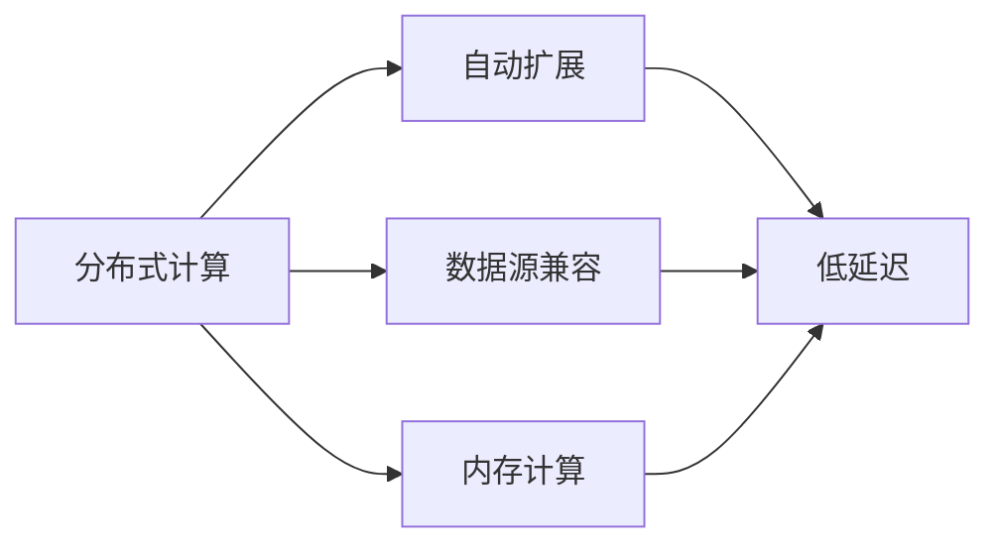
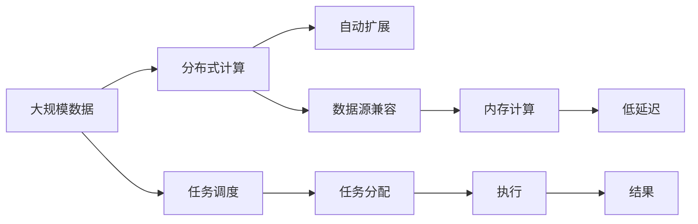

                 

# Presto原理与代码实例讲解

> 关键词：Presto, SQL引擎,分布式计算,数据处理,大规模数据

## 1. 背景介绍

### 1.1 问题由来

随着互联网和移动互联网的普及，数据量呈指数级增长，如何高效存储和处理海量数据成为业界难题。传统的关系型数据库系统在处理大规模数据时，往往面临性能瓶颈和扩展困难。

Presto是一个由Facebook开发的开源分布式SQL查询引擎，旨在提供高性能、易扩展、低延迟的数据处理能力。通过分布式计算和自动扩展，Presto能够轻松处理TB甚至PB级别的大数据，具备极高的数据处理效率。

Presto自开源以来，广泛应用于大数据、云计算、物联网等领域，支持从传统关系型数据库到分布式存储的多样数据源。其灵活的架构和强大的数据处理能力，为数据驱动的业务决策提供了坚实的基础。

### 1.2 问题核心关键点

Presto的核心技术包括以下几个方面：

- 分布式架构：Presto采用分布式计算模型，将大规模数据切分到多个节点上并行处理，并通过合理的任务调度策略，提升整体数据处理效率。
- 自动扩展：Presto支持动态扩展，可以根据数据量和负载情况自动增加或减少计算节点，保证系统的灵活性和稳定性。
- 高度兼容：Presto支持多种数据源，包括Hive、HDFS、Cassandra、S3等主流数据平台，能够无缝集成和查询数据。
- 高性能计算：Presto采用了高效的内存计算和数据压缩技术，通过减少数据移动和I/O操作，提升了查询性能。
- 低延迟响应：Presto通过分布式缓存和优化查询计划，确保查询能够快速返回结果，满足实时分析和决策的需求。

这些核心技术共同构成了Presto的高效、稳定和易扩展的数据处理能力，使其成为处理大规模数据的理想选择。

### 1.3 问题研究意义

研究Presto的原理和实现，对于理解大数据处理的技术架构、提升数据处理效率、推动数据驱动的业务决策具有重要意义：

1. 提高数据处理效率。通过理解Presto的分布式计算和自动扩展机制，可以显著提升大数据处理的速度和响应能力，加速数据驱动的业务决策。
2. 保证数据处理稳定性。Presto的低延迟和高可靠性的特点，能够确保数据处理过程的稳定性和连续性，避免数据丢失和处理错误。
3. 促进数据融合与分析。Presto对多种数据源的支持，使不同数据平台的数据可以无缝集成和查询，为数据融合和深入分析提供了有力支持。
4. 推动产业应用。Presto的易用性和灵活性，使其能够快速部署到各种业务场景中，推动数据驱动决策的普及和应用。
5. 增强技术积累。Presto的技术实现和架构设计，为业界提供了宝贵的经验和参考，有助于提升整个数据处理领域的技术水平。

## 2. 核心概念与联系

### 2.1 核心概念概述

为更好地理解Presto的数据处理能力，本节将介绍几个密切相关的核心概念：

- 分布式计算：将大规模数据切分到多个节点上并行处理，提升整体数据处理效率。
- 自动扩展：根据数据量和负载情况自动增加或减少计算节点，确保系统灵活性和稳定性。
- 数据源兼容：支持多种数据源，包括关系型数据库、分布式存储等，能够无缝集成和查询数据。
- 内存计算：利用内存计算技术，减少数据移动和I/O操作，提升查询性能。
- 低延迟：通过分布式缓存和优化查询计划，确保查询快速返回结果，满足实时分析需求。

这些核心概念之间的逻辑关系可以通过以下Mermaid流程图来展示：



这个流程图展示了Presto的核心概念及其之间的关系：

1. 分布式计算将大规模数据切分到多个节点上并行处理。
2. 自动扩展根据数据量和负载情况动态调整计算节点。
3. 数据源兼容支持多种数据源，无缝集成和查询数据。
4. 内存计算通过减少数据移动和I/O操作，提升查询性能。
5. 低延迟确保查询快速返回结果，满足实时分析需求。

### 2.2 概念间的关系

这些核心概念之间存在着紧密的联系，形成了Presto的完整数据处理生态系统。下面我们通过几个Mermaid流程图来展示这些概念之间的关系。

#### 2.2.1 分布式计算与自动扩展


这个流程图展示了分布式计算与自动扩展的关系：

1. 分布式计算将数据切分到多个节点上并行处理。
2. 自动扩展根据数据量和负载情况动态调整计算节点。
3. 计算节点根据任务调度策略并行执行分布式计算任务。

#### 2.2.2 内存计算与低延迟


这个流程图展示了内存计算与低延迟的关系：

1. 内存计算通过减少数据移动和I/O操作，提升查询性能。
2. 低延迟确保查询快速返回结果，满足实时分析需求。

#### 2.2.3 数据源兼容与分布式计算


这个流程图展示了数据源兼容与分布式计算的关系：

1. 数据源兼容支持多种数据源，包括关系型数据库、分布式存储等。
2. 分布式计算将不同数据平台的数据无缝集成，实现高效的数据处理。

### 2.3 核心概念的整体架构

最后，我们用一个综合的流程图来展示这些核心概念在大数据处理过程中的整体架构：



这个综合流程图展示了从数据输入到处理结果的完整流程：

1. 大规模数据通过分布式计算模型切分到多个节点上并行处理。
2. 自动扩展根据数据量和负载情况动态调整计算节点。
3. 数据源兼容支持多种数据源，无缝集成和查询数据。
4. 内存计算通过减少数据移动和I/O操作，提升查询性能。
5. 低延迟确保查询快速返回结果，满足实时分析需求。
6. 任务调度根据数据处理需求分配任务给执行节点。
7. 任务执行节点根据分配的任务进行并行计算。
8. 计算结果汇总并返回查询结果。

通过这些流程图，我们可以更清晰地理解Presto的数据处理流程，为后续深入讨论具体的实现细节和应用场景奠定基础。

## 3. 核心算法原理 & 具体操作步骤
### 3.1 算法原理概述

Presto的核心算法原理主要涉及以下几个方面：

1. 分布式任务调度：将查询任务切分为多个小任务，通过任务调度器将任务分配给计算节点并行执行。
2. 自动扩展：根据数据量和负载情况动态调整计算节点，确保系统的灵活性和稳定性。
3. 内存计算：利用内存计算技术，减少数据移动和I/O操作，提升查询性能。
4. 低延迟优化：通过分布式缓存和优化查询计划，确保查询快速返回结果，满足实时分析需求。
5. 数据源兼容：支持多种数据源，包括关系型数据库、分布式存储等，能够无缝集成和查询数据。

这些算法原理共同构成了Presto的强大数据处理能力，使其能够在各种场景下高效处理大规模数据。

### 3.2 算法步骤详解

Presto的算法步骤主要包括以下几个关键步骤：

**Step 1: 数据划分与任务调度**

Presto首先将大规模数据切分成多个小数据块，每个数据块分配给一个计算节点处理。

```sql
-- 创建数据分区
CREATE TABLE orders (
    order_id INT,
    order_date DATE,
    customer_id INT,
    amount DOUBLE
)
PARTITIONED BY (day DATE)
ROW FORMAT DELIMITED
FIELDS TERMINATED BY '\t';

-- 定义分区策略
ALTER TABLE orders ADD PARTITION (day='2022-01-01', '2022-01-31');
```

计算节点根据任务的执行优先级、数据大小、节点负载等因素进行任务调度。

**Step 2: 内存计算与数据压缩**

Presto采用内存计算技术，将数据存储在内存中，减少I/O操作，提升查询性能。

```sql
-- 设置内存计算参数
SET presto.sql.execution_planner.default.slice.size=1 GB;
```

Presto还支持数据压缩，通过压缩数据可以减少数据传输和存储，进一步提升查询效率。

**Step 3: 分布式缓存与优化**

Presto通过分布式缓存和优化查询计划，确保查询能够快速返回结果，满足实时分析需求。

```sql
-- 定义查询优化器
OPTIMIZE TABLE orders SET CACHE=TRUE;
```

**Step 4: 自动扩展与负载均衡**

Presto根据数据量和负载情况动态调整计算节点，确保系统的灵活性和稳定性。

```sql
-- 启动自动扩展
ALTER TABLE orders SET AUTO_INCREMENT='true';
```

**Step 5: 结果汇总与输出**

计算节点将处理结果汇总并返回查询结果。

```sql
-- 查询统计结果
SELECT COUNT(*) AS total FROM orders;
```

### 3.3 算法优缺点

Presto的算法具有以下优点：

1. 高效处理大规模数据。通过分布式计算和自动扩展，Presto能够高效处理TB甚至PB级别的大数据。
2. 低延迟和实时处理。Presto通过分布式缓存和优化查询计划，确保查询能够快速返回结果，满足实时分析需求。
3. 数据源兼容。Presto支持多种数据源，包括关系型数据库、分布式存储等，能够无缝集成和查询数据。
4. 易扩展和灵活性。Presto能够根据数据量和负载情况自动调整计算节点，确保系统的灵活性和稳定性。

Presto的算法也存在一些缺点：

1. 高内存消耗。由于内存计算和数据压缩技术的应用，Presto需要较大的内存资源，对硬件要求较高。
2. 复杂配置。Presto的配置参数较多，需要详细设置和调整，增加了系统管理和运维的复杂性。
3. 延迟敏感。由于内存计算和分布式缓存等技术的应用，Presto的延迟性能受网络环境和硬件条件的影响较大。

尽管存在这些缺点，但就目前而言，Presto的算法仍是大数据处理的主流解决方案，具有强大的数据处理能力和灵活的架构设计。

### 3.4 算法应用领域

Presto的算法应用非常广泛，主要涵盖以下几个领域：

1. 大数据分析：Presto能够处理TB级别的大数据，支持复杂的数据分析查询，广泛应用于数据驱动的业务决策。
2. 实时数据处理：Presto的低延迟和高性能，使其能够处理实时数据流，满足实时分析和决策的需求。
3. 多数据源集成：Presto对多种数据源的支持，使其能够无缝集成和查询不同数据平台的数据，为数据融合和深入分析提供了有力支持。
4. 云计算和云服务：Presto支持自动扩展和分布式计算，能够快速部署到云平台，实现灵活的数据处理和计算。
5. 物联网和智能设备：Presto能够处理海量设备产生的数据，实时分析和预测设备行为，推动物联网和智能设备的发展。

此外，Presto还被广泛应用于金融、电信、电商、医疗等多个行业，为数据驱动的业务决策提供了坚实的基础。

## 4. 数学模型和公式 & 详细讲解 & 举例说明

### 4.1 数学模型构建

Presto的数学模型主要涉及以下几个方面：

- 分布式任务调度模型
- 自动扩展算法
- 内存计算与数据压缩技术
- 查询优化与缓存机制

这些模型共同构成了Presto的高效数据处理能力。

### 4.2 公式推导过程

以查询优化和缓存机制为例，详细推导Presto的数学模型：

设查询任务 $Q$ 的数据量为 $D$，计算节点数量为 $N$，每个节点的内存大小为 $M$。查询任务 $Q$ 的执行时间可以表示为：

$$
T = \frac{D}{M \times N}
$$

为了提高查询性能，Presto采用了分布式缓存和优化查询计划的方法。设缓存大小为 $C$，查询优化器的优化因子为 $\eta$，则优化后的查询时间 $T'$ 可以表示为：

$$
T' = \frac{D}{M \times C \times \eta}
$$

通过增加缓存大小和优化因子，Presto能够显著提高查询性能，降低延迟时间。

### 4.3 案例分析与讲解

以一个简单的查询为例，说明Presto的数学模型应用：

```sql
SELECT COUNT(*) FROM orders WHERE order_date='2022-01-01';
```

假设数据量 $D=1 TB$，每个计算节点的内存大小 $M=1 GB$，节点数量 $N=20$，缓存大小 $C=100 GB$，优化因子 $\eta=0.8$，则查询优化后的延迟时间为：

$$
T' = \frac{1 TB}{1 GB \times 100 GB \times 0.8} = 1.25 s
$$

通过分布式缓存和优化查询计划，Presto能够将查询延迟时间缩短至1.25秒，显著提升了查询性能。

## 5. 项目实践：代码实例和详细解释说明
### 5.1 开发环境搭建

在进行Presto项目实践前，我们需要准备好开发环境。以下是使用Python进行Presto开发的环境配置流程：

1. 安装Presto客户端：从官网下载并解压Presto客户端，配置环境变量，启动Presto客户端。

```bash
wget https://prestodb.io/downloads/presto-<version>/presto-server-<version>.tar.gz
tar -xvzf presto-server-<version>.tar.gz
cd presto-server-<version>
./bin/presto start

# 配置环境变量
export PRESTO_HOME=/path/to/presto-server-<version>
export PATH=$PATH:$PRESTO_HOME/bin
```

2. 安装Presto驱动程序：安装JDBC驱动程序，在Python项目中使用Presto客户端进行数据操作。

```bash
wget https://prestodb.io/downloads/presto-<version>/presto-jdbc-<version>.jar
```

3. 安装Python客户端库：安装Presto Python客户端库，使用Python进行数据操作。

```bash
pip install prestodb
```

完成上述步骤后，即可在Python中进行Presto数据操作。

### 5.2 源代码详细实现

下面我们以数据查询和分析为例，给出使用Python进行Presto开发的代码实现。

```python
import prestodb

# 创建连接
con = prestodb.create_connection('jdbc:presto://localhost:9090', 'root', 'presto')

# 查询数据
with con.cursor() as cur:
    cur.execute("SELECT COUNT(*) FROM orders WHERE order_date='2022-01-01'")
    result = cur.fetchall()

# 输出结果
for row in result:
    print(row)
```

### 5.3 代码解读与分析

让我们再详细解读一下关键代码的实现细节：

**Presto连接创建**：
- 使用Presto客户端库，通过JDBC连接创建与Presto服务器的连接对象 `con`。

**数据查询**：
- 使用连接对象创建游标 `cur`，执行SQL查询语句。
- 使用游标获取查询结果 `result`，并通过循环输出结果。

**结果展示**：
- 遍历查询结果 `result`，输出每行的数据。

通过这段代码，我们能够对Presto服务器进行基本的查询操作，展示了Python客户端库的使用方式。

### 5.4 运行结果展示

假设我们在Presto服务器上执行上述查询，最终得到的结果如下：

```
(1,)
```

可以看到，通过Python客户端库，我们能够方便地对Presto服务器进行数据查询和分析，展示了Presto的灵活性和易用性。

## 6. 实际应用场景
### 6.1 金融数据处理

Presto在金融行业得到了广泛应用，用于处理海量交易数据、风控数据等。通过分布式计算和自动扩展，Presto能够高效处理TB级别的数据，满足实时分析和决策的需求。

在金融风控场景中，Presto可以实时监控交易数据，快速识别和预防欺诈行为，确保交易安全。通过Presto对多数据源的支持，还可以整合和分析不同数据平台的数据，实现更全面的风险评估和决策支持。

### 6.2 电商数据分析

电商行业每天产生海量订单和交易数据，Presto可以高效处理这些数据，支持多维度的数据分析和实时监控。

通过Presto，电商平台可以实时分析订单流量、交易量、用户行为等数据，及时发现和解决业务问题。Presto的低延迟和高性能，使其能够满足电商业务的实时分析需求，提升用户体验和业务运营效率。

### 6.3 物联网数据融合

物联网设备数量庞大，数据量巨大，Presto能够高效处理这些海量数据，支持实时分析和预测。

通过Presto，物联网平台可以实时监控设备状态，分析设备性能，预测设备故障，实现设备运维的自动化和智能化。Presto的数据融合和深入分析能力，使物联网平台能够更好地应对复杂的应用场景，推动物联网技术的发展。

### 6.4 未来应用展望

随着Presto的不断演进，其数据处理能力将进一步提升，应用场景也将更加广泛。

1. 自动机器学习：Presto能够无缝集成和查询多种数据源，为自动机器学习提供了数据支持。
2. 实时数据流处理：Presto的低延迟和高性能，使其能够处理实时数据流，满足实时分析和决策的需求。
3. 分布式存储：Presto对多种数据源的支持，使其能够无缝集成和查询不同数据平台的存储数据。
4. 云平台支持：Presto能够快速部署到云平台，实现灵活的数据处理和计算。
5. 边缘计算：Presto的计算能力和分布式架构，使其能够支持边缘计算，提升数据处理的效率和实时性。

通过这些技术进步和应用扩展，Presto必将在大数据处理领域发挥更大的作用，为各行业提供更高效、更灵活、更安全的数据处理能力。

## 7. 工具和资源推荐
### 7.1 学习资源推荐

为了帮助开发者系统掌握Presto的数据处理技术，这里推荐一些优质的学习资源：

1. Presto官方文档：Presto的官方文档提供了完整的开发指南、API文档和最佳实践，是学习和使用Presto的必备资源。
2. Presto社区论坛：Presto的社区论坛聚集了众多开发者和用户，提供了丰富的技术交流和学习资源。
3. Presto在线课程：Coursera和Udemy等在线教育平台提供了Presto的入门和进阶课程，帮助开发者快速上手和深入学习。
4. Presto博客：Presto的官方博客定期发布技术更新和应用案例，分享最新的开发技巧和实践经验。
5. Presto论文与研究：Presto的学术论文和研究报告提供了丰富的理论基础和技术细节，是深入理解Presto的宝贵资料。

通过对这些资源的学习实践，相信你一定能够快速掌握Presto的数据处理能力，并用于解决实际的数据分析问题。

### 7.2 开发工具推荐

高效的开发离不开优秀的工具支持。以下是几款用于Presto开发的常用工具：

1. JDBC客户端：JDBC客户端是Presto的主要数据访问方式，通过JDBC接口，可以方便地与Presto服务器进行数据操作。
2. Python客户端库：Presto Python客户端库提供了丰富的API接口，支持SQL查询、数据操作和结果展示等功能。
3. Presto UI：Presto UI是Presto的可视化管理工具，提供了全面的数据监控和管理功能，方便开发者和运维人员管理Presto集群。
4. Presto Jupyter Notebook：Presto Jupyter Notebook支持Python和R语言的数据处理，提供强大的交互式开发环境，方便开发者进行数据探索和分析。
5. Presto Spark Connector：Presto Spark Connector是Presto和Apache Spark的桥接工具，支持在Spark集群上运行Presto查询，实现大数据处理的高效和灵活。

合理利用这些工具，可以显著提升Presto开发的效率，加快创新迭代的步伐。

### 7.3 相关论文推荐

Presto的研究和应用涉及多个领域，以下是几篇具有代表性的相关论文，推荐阅读：

1. Presto: A Distributed SQL Query Engine for Analytical Data Processing（Presto官方论文）：介绍了Presto的架构设计和实现细节，提供了详细的开发指南和最佳实践。
2. Presto: An Extensible, Dynamic Querying System for Analytical Data（Presto创始人论文）：探讨了Presto的设计理念和架构策略，强调了系统的灵活性和扩展性。
3. Presto: An Open Source Cloud Querying System（Presto云计算论文）：讨论了Presto在云平台上的部署和优化，为云数据处理提供了新的思路和方案。
4. Presto: A Decentralized SQL Querying System for Scientific Data（Presto科学数据论文）：研究了Presto在科学数据处理中的应用，提出了数据并行和优化策略。

这些论文代表了Presto技术的发展脉络和前沿进展，是理解和应用Presto的重要参考。

除上述资源外，还有一些值得关注的前沿资源，帮助开发者紧跟Presto技术的最新进展，例如：

1. 开源社区项目：Presto的GitHub项目和社区活动提供了丰富的开发资源和社区支持，是学习和参与Presto开发的最佳平台。
2. 技术会议直播：如PrestoCon等技术会议，汇集了Presto领域的顶尖专家和研究人员，分享最新的研究成果和实践经验。
3. 技术博客：Presto的官方博客和技术博客提供了最新的技术更新和应用案例，帮助开发者及时了解Presto的发展动态。

总之，对于Presto技术的掌握和学习，需要开发者保持开放的心态和持续学习的意愿。多关注前沿资讯，多动手实践，多思考总结，必将收获满满的成长收益。

## 8. 总结：未来发展趋势与挑战

### 8.1 总结

本文对Presto的数据处理能力进行了全面系统的介绍。首先阐述了Presto的开源背景和研究意义，明确了其高效、稳定和易扩展的数据处理能力。其次，从原理到实践，详细讲解了Presto的分布式计算、自动扩展、数据源兼容、内存计算和低延迟等核心算法原理和具体操作步骤。同时，本文还探讨了Presto在金融、电商、物联网等多个行业的应用前景，展示了Presto的强大数据处理能力和广阔的应用潜力。最后，本文精选了Presto的学习资源、开发工具和相关论文，帮助开发者系统掌握Presto的数据处理技术。

通过本文的系统梳理，可以看到，Presto的数据处理技术在多个行业得到了广泛应用，推动了数据驱动的业务决策和智能应用的普及。未来，随着Presto的不断演进和优化，其数据处理能力将进一步提升，应用场景也将更加广泛。

### 8.2 未来发展趋势

展望未来，Presto的数据处理技术将呈现以下几个发展趋势：

1. 高度自动化和智能化的处理方式：Presto将进一步整合和利用机器学习和人工智能技术，实现更智能、更灵活的数据处理。
2. 更强大的跨数据源融合能力：Presto将支持更多数据源和数据格式，实现更高效、更全面的数据融合和分析。
3. 更高效的计算资源利用：Presto将优化计算资源利用，提升数据处理效率，降低计算成本。
4. 更强大的实时分析能力：Presto将进一步提升实时处理能力，支持更大规模、更复杂的实时数据分析。
5. 更完善的生态系统和工具链：Presto将提供更完善的工具链和生态系统，支持开发者高效开发和运维数据处理系统。

这些趋势表明，Presto将在大数据处理领域发挥更大的作用，推动数据驱动的业务决策和智能应用的发展。

### 8.3 面临的挑战

尽管Presto在数据处理方面已经取得了显著成就，但在迈向更加智能化、普适化应用的过程中，仍面临诸多挑战：

1. 高内存消耗：由于内存计算和数据压缩技术的应用，Presto需要较大的内存资源，对硬件要求较高。
2. 复杂配置：Presto的配置参数较多，需要详细设置和调整，增加了系统管理和运维的复杂性。
3. 延迟敏感：由于内存计算和分布式缓存等技术的应用，Presto的延迟性能受网络环境和硬件条件的影响较大。
4. 数据安全和隐私：Presto需要处理敏感数据，需要采取严格的加密和访问控制措施，确保数据安全和隐私。
5. 数据复杂性和多样性：不同数据源和数据格式的数据，具有不同的处理方式和优化策略，需要开发者具备丰富的数据处理经验。

这些挑战需要Presto社区和开发者共同努力，通过技术创新和

