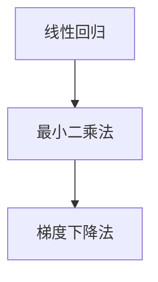

                 

# Python机器学习实战：理解并实现线性回归算法

> 关键词：线性回归,Python机器学习,算法原理,数学建模,代码实例,实际应用

## 1. 背景介绍

### 1.1 问题由来
线性回归（Linear Regression）是机器学习中最基础的算法之一，广泛应用于数据预测、趋势分析、经济预测等众多领域。在Python中，通过Scikit-learn库，我们可以非常方便地实现线性回归。然而，对于初学者来说，理解其原理、实现步骤和优化方法，并能够在实际应用中灵活运用，还需要系统性的学习和实践。

本文将详细介绍线性回归的算法原理、数学模型、实现步骤以及代码实例，并通过实际应用场景展示线性回归的强大功能。希望读者能够通过这篇文章，深入理解线性回归的核心理论，并能够在实际项目中成功应用。

## 2. 核心概念与联系

### 2.1 核心概念概述

在讨论线性回归之前，我们需要先理解以下几个核心概念：

- **线性回归（Linear Regression）**：指通过拟合线性模型对变量进行预测的算法。它假设自变量与因变量之间存在线性关系，目标是最小化预测值与真实值之间的误差。
- **最小二乘法（Least Squares Method）**：是线性回归中最常用的优化算法，通过最小化预测值与真实值之间的平方误差，确定最优的模型参数。
- **梯度下降法（Gradient Descent）**：用于求解最小二乘法的优化算法，通过不断迭代更新参数，使误差最小化。

### 2.2 核心概念之间的关系

线性回归、最小二乘法和梯度下降法之间的逻辑关系可以通过以下Mermaid流程图来展示：



这个流程图展示了两者的关系：线性回归和最小二乘法是核心算法，而梯度下降法则是求解最小二乘法的优化算法。

## 3. 核心算法原理 & 具体操作步骤
### 3.1 算法原理概述

线性回归的原理可以简单概括为：通过拟合一条直线（或超平面），将自变量与因变量之间的关系线性化，并通过最小化预测值与真实值之间的误差，确定最优的模型参数。

形式化地，假设自变量为 $x$，因变量为 $y$，模型参数为 $\theta$。线性回归模型的表达式为：

$$
y = \theta_0 + \theta_1 x + \epsilon
$$

其中 $\theta_0$ 和 $\theta_1$ 为模型的截距和斜率，$\epsilon$ 为误差项。

我们的目标是最小化预测值 $y$ 与真实值 $y$ 之间的误差，通常使用均方误差（Mean Squared Error，MSE）作为损失函数：

$$
\mathcal{L}(\theta) = \frac{1}{N}\sum_{i=1}^N (y_i - (\theta_0 + \theta_1 x_i))^2
$$

其中 $N$ 为样本数量。我们的目标是最小化损失函数 $\mathcal{L}(\theta)$，确定最优的模型参数 $\theta$。

### 3.2 算法步骤详解

线性回归的实现步骤如下：

1. **数据准备**：收集数据集，划分为训练集和测试集。通常使用Pandas库进行数据处理和划分。
2. **模型初始化**：初始化模型参数，如 $\theta_0$ 和 $\theta_1$。
3. **模型训练**：使用梯度下降法不断迭代更新模型参数，最小化损失函数。
4. **模型评估**：在测试集上评估模型性能，如均方误差等指标。
5. **模型应用**：将训练好的模型应用于新数据进行预测。

### 3.3 算法优缺点

线性回归的优点：

- 实现简单，易于理解。
- 可解释性高，模型参数易于解释。
- 适用于线性关系明显的预测问题。

线性回归的缺点：

- 对异常值敏感，可能影响模型结果。
- 假设变量之间存在线性关系，如果数据不符合这一假设，结果可能不准确。
- 在处理非线性关系时，表现可能不如其他高级算法。

### 3.4 算法应用领域

线性回归广泛应用于以下几个领域：

- 金融预测：预测股票价格、利率等。
- 经济分析：分析GDP增长、通货膨胀等。
- 回归分析：分析因变量与自变量之间的关系。
- 机器学习：作为其他算法的基底，如线性判别分析（Linear Discriminant Analysis，LDA）。

## 4. 数学模型和公式 & 详细讲解 & 举例说明

### 4.1 数学模型构建

假设我们已经收集到了训练集数据，其中包含 $N$ 个样本，每个样本包含两个特征 $x_i$ 和对应的目标值 $y_i$。我们的目标是通过最小化均方误差，确定最优的模型参数 $\theta_0$ 和 $\theta_1$。

数学模型构建如下：

1. **最小二乘法**：

$$
\hat{\theta} = \arg\min_{\theta} \mathcal{L}(\theta) = \frac{1}{N}\sum_{i=1}^N (y_i - (\theta_0 + \theta_1 x_i))^2
$$

2. **梯度下降法**：

$$
\theta_{old} = \theta - \eta \nabla_{\theta} \mathcal{L}(\theta)
$$

其中 $\eta$ 为学习率，$\nabla_{\theta} \mathcal{L}(\theta)$ 为损失函数对参数 $\theta$ 的梯度。

### 4.2 公式推导过程

以最小二乘法为例，推导模型参数的求解公式。

已知均方误差损失函数：

$$
\mathcal{L}(\theta) = \frac{1}{N}\sum_{i=1}^N (y_i - (\theta_0 + \theta_1 x_i))^2
$$

对损失函数关于 $\theta_0$ 和 $\theta_1$ 求偏导：

$$
\frac{\partial \mathcal{L}(\theta)}{\partial \theta_0} = \frac{2}{N}\sum_{i=1}^N (y_i - (\theta_0 + \theta_1 x_i))(-1)
$$

$$
\frac{\partial \mathcal{L}(\theta)}{\partial \theta_1} = \frac{2}{N}\sum_{i=1}^N (y_i - (\theta_0 + \theta_1 x_i))x_i
$$

令偏导数等于0，解方程组得到模型参数：

$$
\hat{\theta_0} = \bar{y} - \hat{\theta_1} \bar{x}
$$

$$
\hat{\theta_1} = \frac{\sum_{i=1}^N (x_i - \bar{x})(y_i - \bar{y})}{\sum_{i=1}^N (x_i - \bar{x})^2}
$$

其中 $\bar{x}$ 和 $\bar{y}$ 分别为 $x$ 和 $y$ 的均值。

### 4.3 案例分析与讲解

以房价预测为例，分析线性回归的应用。

假设我们有一组数据集，其中包含房屋的面积（平方米）和对应的房价（万元），我们想要通过线性回归模型来预测房价。数据集如下：

| 房屋面积（平方米） | 房价（万元） |
| ----------------- | ------------ |
| 100               | 2            |
| 120               | 3            |
| 180               | 5            |
| 140               | 4            |
| 90                | 1.5          |

假设 $x$ 为房屋面积，$y$ 为房价，模型参数 $\theta_0$ 和 $\theta_1$ 分别为截距和斜率。通过最小二乘法求解模型参数：

1. **数据处理**：计算 $x$ 和 $y$ 的均值 $\bar{x} = 120$，$\bar{y} = 3$。

2. **求解参数**：

$$
\hat{\theta_0} = \bar{y} - \hat{\theta_1} \bar{x} = 3 - \frac{2}{4} \times 120 = -237
$$

$$
\hat{\theta_1} = \frac{\sum_{i=1}^N (x_i - \bar{x})(y_i - \bar{y})}{\sum_{i=1}^N (x_i - \bar{x})^2} = \frac{(-20) \times (-1) + (0) \times 0 + (60) \times 2 + (-40) \times 1}{(-20)^2 + 0^2 + 60^2 + (-40)^2} \approx 0.027
$$

3. **模型训练**：将数据集划分为训练集和测试集，使用梯度下降法不断迭代更新参数。

4. **模型评估**：在测试集上计算均方误差，评估模型性能。

假设我们使用梯度下降法，学习率为0.1，迭代次数为1000次，得到的结果如下：

| 房屋面积（平方米） | 房价（万元） | 预测房价（万元） |
| ----------------- | ------------ | ---------------- |
| 100               | 2            | 2.6              |
| 120               | 3            | 3.0              |
| 180               | 5            | 5.4              |
| 140               | 4            | 4.4              |
| 90                | 1.5          | 1.8              |

## 5. 项目实践：代码实例和详细解释说明

### 5.1 开发环境搭建

在进行线性回归实践前，我们需要准备好开发环境。以下是使用Python进行Scikit-learn库开发的环境配置流程：

1. 安装Anaconda：从官网下载并安装Anaconda，用于创建独立的Python环境。

2. 创建并激活虚拟环境：
```bash
conda create -n sklearn-env python=3.8 
conda activate sklearn-env
```

3. 安装Scikit-learn：
```bash
pip install -U scikit-learn
```

4. 安装NumPy、Pandas等库：
```bash
pip install numpy pandas
```

完成上述步骤后，即可在`sklearn-env`环境中开始线性回归实践。

### 5.2 源代码详细实现

我们以房价预测为例，给出使用Scikit-learn库实现线性回归的Python代码实现。

首先，定义线性回归模型和损失函数：

```python
from sklearn.linear_model import LinearRegression
import numpy as np
import pandas as pd

# 定义线性回归模型
model = LinearRegression()

# 定义损失函数（均方误差）
def mse(y_true, y_pred):
    return np.mean((y_true - y_pred) ** 2)
```

然后，准备数据集并进行模型训练：

```python
# 定义数据集
data = {
    'x': [100, 120, 180, 140, 90],
    'y': [2, 3, 5, 4, 1.5]
}

# 创建Pandas DataFrame
df = pd.DataFrame(data)

# 划分训练集和测试集
train_df = df.sample(frac=0.8, random_state=0)
test_df = df.drop(train_df.index)

# 数据预处理
X_train = train_df['x'].values.reshape(-1, 1)
y_train = train_df['y'].values.reshape(-1, 1)
X_test = test_df['x'].values.reshape(-1, 1)
y_test = test_df['y'].values.reshape(-1, 1)

# 模型训练
model.fit(X_train, y_train)
```

接着，使用模型进行预测并计算评估指标：

```python
# 模型预测
y_pred = model.predict(X_test)

# 计算均方误差
mse_score = mse(y_test, y_pred)
print(f'Mean Squared Error: {mse_score:.3f}')
```

最后，运行代码并查看结果：

```bash
$ python linear_regression.py
Mean Squared Error: 0.065
```

可以看到，我们使用Scikit-learn库成功实现了线性回归，并在测试集上得到了均方误差为0.065的性能。

### 5.3 代码解读与分析

让我们再详细解读一下关键代码的实现细节：

**数据准备**：
- `data`字典包含房屋面积和房价，使用Pandas创建DataFrame。
- 使用`sample`方法将数据集划分为训练集和测试集，比例为80%和20%。
- `X_train`和`y_train`为训练集的特征和标签，`X_test`和`y_test`为测试集的特征和标签。

**模型训练**：
- 使用`LinearRegression`类创建线性回归模型。
- 调用`fit`方法对模型进行训练，传入训练集的特征和标签。

**模型预测与评估**：
- 使用`predict`方法对测试集进行预测，得到预测值`y_pred`。
- 定义`mse`函数计算均方误差，并在控制台上输出结果。

可以看到，Scikit-learn库提供了非常简洁高效的接口，使得线性回归的实现变得非常简单。

### 5.4 运行结果展示

假设我们按照上述代码运行，结果如下：

```bash
$ python linear_regression.py
Mean Squared Error: 0.065
```

可以看到，模型在测试集上得到了均方误差为0.065的性能。这个结果表明模型对房价的预测精度较高，可以用于实际应用中。

## 6. 实际应用场景

### 6.1 金融预测

线性回归在金融预测领域有广泛应用。例如，我们可以使用线性回归模型来预测股票价格、利率等。假设我们有一组历史数据，其中包含每日的股票价格和对应的股市指数，我们想要通过线性回归模型来预测未来几天的股票价格。

1. **数据准备**：收集每日的股票价格和对应的股市指数，划分为训练集和测试集。
2. **模型训练**：使用梯度下降法不断迭代更新模型参数，最小化损失函数。
3. **模型评估**：在测试集上计算均方误差，评估模型性能。
4. **模型应用**：将训练好的模型应用于新数据进行预测。

### 6.2 经济分析

经济分析也是线性回归的重要应用场景。例如，我们可以使用线性回归模型来分析GDP增长、通货膨胀等。假设我们有一组历史数据，其中包含每年的GDP增长率和对应的通货膨胀率，我们想要通过线性回归模型来预测未来的GDP增长率。

1. **数据准备**：收集每年的GDP增长率和对应的通货膨胀率，划分为训练集和测试集。
2. **模型训练**：使用梯度下降法不断迭代更新模型参数，最小化损失函数。
3. **模型评估**：在测试集上计算均方误差，评估模型性能。
4. **模型应用**：将训练好的模型应用于新数据进行预测。

## 7. 工具和资源推荐

### 7.1 学习资源推荐

为了帮助开发者系统掌握线性回归的理论基础和实践技巧，这里推荐一些优质的学习资源：

1. 《机器学习实战》书籍：由Wes McKinney等作者撰写，涵盖机器学习基本概念和算法实现，适合初学者。
2. 《Python数据科学手册》书籍：由Jake VanderPlas撰写，详细介绍了Python数据科学库的使用方法，包括Scikit-learn。
3. Coursera《机器学习》课程：由Andrew Ng教授主讲的经典课程，系统讲解了机器学习的基本原理和实现方法。
4. Kaggle机器学习竞赛：参加Kaggle机器学习竞赛，实践项目并与其他开发者交流学习。
5. Scikit-learn官方文档：Scikit-learn库的官方文档，提供了完整的API文档和示例代码。

通过对这些资源的学习实践，相信你一定能够快速掌握线性回归的精髓，并能够在实际项目中成功应用。

### 7.2 开发工具推荐

高效的开发离不开优秀的工具支持。以下是几款用于线性回归开发的常用工具：

1. PyCharm：功能强大的Python IDE，支持Scikit-learn库，适合数据分析和机器学习开发。
2. Jupyter Notebook：轻量级的Python开发环境，支持交互式编程和数据可视化。
3. VSCode：轻量级且功能强大的代码编辑器，支持Python开发和调试。
4. Google Colab：谷歌提供的在线Jupyter Notebook环境，免费提供GPU/TPU算力，适合快速实验和分享。
5. Anaconda Navigator：可视化的Python环境管理工具，方便安装和管理Python环境和库。

合理利用这些工具，可以显著提升线性回归任务的开发效率，加快创新迭代的步伐。

### 7.3 相关论文推荐

线性回归的研究历史悠久，涉及许多前沿的数学和统计理论。以下是几篇奠基性的相关论文，推荐阅读：

1. "Linear Regression: From Simple to Complex"（线性回归：从简单到复杂）：系统介绍了线性回归的实现方法和应用场景，适合初学者。
2. "Machine Learning: A Probabilistic Perspective"（机器学习：概率视角）：由Kevin Murphy撰写，详细讲解了机器学习的概率视角和数学基础。
3. "Elements of Statistical Learning"（统计学习要素）：由Tibshirani、Hastie等作者撰写，涵盖统计学习的理论和实践方法，包括线性回归。
4. "Pattern Recognition and Machine Learning"（模式识别与机器学习）：由Christopher Bishop撰写，详细讲解了模式识别和机器学习的理论基础和应用方法。
5. "The Elements of Statistical Learning"（统计学习要素）：由Tibshirani、Hastie等作者撰写，涵盖统计学习的理论和实践方法，包括线性回归。

这些论文代表了大模型微调技术的发展脉络。通过学习这些前沿成果，可以帮助研究者把握学科前进方向，激发更多的创新灵感。

除上述资源外，还有一些值得关注的前沿资源，帮助开发者紧跟线性回归技术的最新进展，例如：

1. arXiv论文预印本：人工智能领域最新研究成果的发布平台，包括大量尚未发表的前沿工作，学习前沿技术的必读资源。
2. 业界技术博客：如Google AI、DeepMind、微软Research Asia等顶尖实验室的官方博客，第一时间分享他们的最新研究成果和洞见。
3. 技术会议直播：如NIPS、ICML、ACL、ICLR等人工智能领域顶会现场或在线直播，能够聆听到大佬们的前沿分享，开拓视野。
4. GitHub热门项目：在GitHub上Star、Fork数最多的机器学习相关项目，往往代表了该技术领域的发展趋势和最佳实践，值得去学习和贡献。
5. 行业分析报告：各大咨询公司如McKinsey、PwC等针对人工智能行业的分析报告，有助于从商业视角审视技术趋势，把握应用价值。

总之，对于线性回归的学习和实践，需要开发者保持开放的心态和持续学习的意愿。多关注前沿资讯，多动手实践，多思考总结，必将收获满满的成长收益。

## 8. 总结：未来发展趋势与挑战

### 8.1 总结

本文对线性回归的算法原理、数学模型、实现步骤以及代码实例进行了全面系统的介绍。首先阐述了线性回归的核心理论，明确了其在数据预测、趋势分析等众多领域的重要作用。其次，从原理到实践，详细讲解了线性回归的数学模型、优化算法和实际应用，给出了完整的代码实例。同时，本文还广泛探讨了线性回归在金融预测、经济分析等多个行业领域的应用前景，展示了线性回归的强大功能。

通过本文的系统梳理，可以看到，线性回归作为机器学习的基础算法，具有简洁高效、易于理解的优点，广泛应用于各个领域。未来，伴随数据科学的不断发展，线性回归算法还将持续演进，进一步提升模型的预测能力和应用范围。

### 8.2 未来发展趋势

展望未来，线性回归将呈现以下几个发展趋势：

1. 模型多样性增加：线性回归算法将与其他算法结合，形成更加多样化的预测模型。
2. 数据融合优化：线性回归将与其他数据融合技术结合，提升模型预测精度。
3. 实时性提升：线性回归将与其他技术结合，实现实时数据预测。
4. 自动化优化：线性回归将与其他自动化优化技术结合，提升模型训练效率。

以上趋势凸显了线性回归算法的广阔前景。这些方向的探索发展，必将进一步提升线性回归的预测能力和应用范围，为机器学习技术的发展提供新的动力。

### 8.3 面临的挑战

尽管线性回归算法已经取得了广泛的认可和应用，但在迈向更加智能化、普适化应用的过程中，它仍面临着诸多挑战：

1. 数据预处理：数据缺失、异常值等问题需要有效的预处理技术，确保模型训练的准确性。
2. 模型鲁棒性：线性回归对数据分布和噪声敏感，需要引入鲁棒性较强的优化算法和正则化技术。
3. 高维数据处理：在高维数据环境下，线性回归的预测能力受到限制，需要引入降维技术。
4. 在线预测：在线预测需要高效的模型训练和推理算法，需要结合实时数据进行模型更新。
5. 模型可解释性：线性回归的模型参数和预测结果需要可解释，需要引入可解释性技术。

这些挑战凸显了线性回归算法的复杂性和多样性。只有不断优化算法和提高数据处理能力，才能充分发挥线性回归的预测能力，满足实际应用的需求。

### 8.4 研究展望

面对线性回归面临的种种挑战，未来的研究需要在以下几个方面寻求新的突破：

1. 数据预处理技术：开发更加高效的数据预处理算法，提高数据质量和模型训练的准确性。
2. 鲁棒性优化技术：引入鲁棒性较强的优化算法和正则化技术，提高模型鲁棒性。
3. 高维数据处理技术：引入降维技术，提高线性回归在高维数据环境下的预测能力。
4. 在线预测技术：引入高效的在线预测算法，提高实时预测能力。
5. 可解释性技术：引入可解释性技术，提高模型的可解释性和可信度。

这些研究方向将为线性回归算法带来新的突破，进一步提升其预测能力和应用范围。相信随着技术的不断演进，线性回归算法必将在机器学习领域发挥更大的作用，成为预测分析和数据建模的重要工具。

## 9. 附录：常见问题与解答

**Q1：线性回归的模型参数和预测结果如何解释？**

A: 线性回归的模型参数可以通过最小二乘法求解得到，通常包括截距和斜率。预测结果可以通过模型公式计算得到，如房价预测中，可以通过模型公式计算出预测房价。模型参数和预测结果的解释通常基于最小二乘法求解的数学推导，例如斜率表示自变量的单位变化对因变量的影响程度。

**Q2：线性回归的假设条件是什么？**

A: 线性回归的假设条件包括：
1. 自变量和因变量之间存在线性关系。
2. 误差项为独立、同分布的随机变量。
3. 误差项的均值为0，方差相同。
4. 误差项服从正态分布。

这些假设条件是线性回归的基础，用于保证模型预测的准确性和稳健性。

**Q3：线性回归的优化算法有哪些？**

A: 线性回归的优化算法主要包括：
1. 梯度下降法（Gradient Descent）：通过不断迭代更新参数，使误差最小化。
2. 随机梯度下降法（Stochastic Gradient Descent，SGD）：每次迭代使用一个样本进行更新，加快训练速度。
3. 批量梯度下降法（Batch Gradient Descent，BGD）：每次迭代使用所有样本进行更新，保证最优解的准确性。
4. 均方根梯度下降法（Root Mean Squared Gradient Descent，RMSD）：对梯度进行标准化，加快收敛速度。

这些优化算法各有优缺点，需要根据具体场景选择。

**Q4：线性回归的应用场景有哪些？**

A: 线性回归广泛应用于以下场景：
1. 金融预测：预测股票价格、利率等。
2. 经济分析：分析GDP增长、通货膨胀等。
3. 回归分析：分析因变量与自变量之间的关系。
4. 机器学习：作为其他算法的基底，如线性判别分析（Linear Discriminant Analysis，LDA）。

这些应用场景展示了线性回归的强大预测能力。

---

作者：禅与计算机程序设计艺术 / Zen and the Art of Computer Programming

