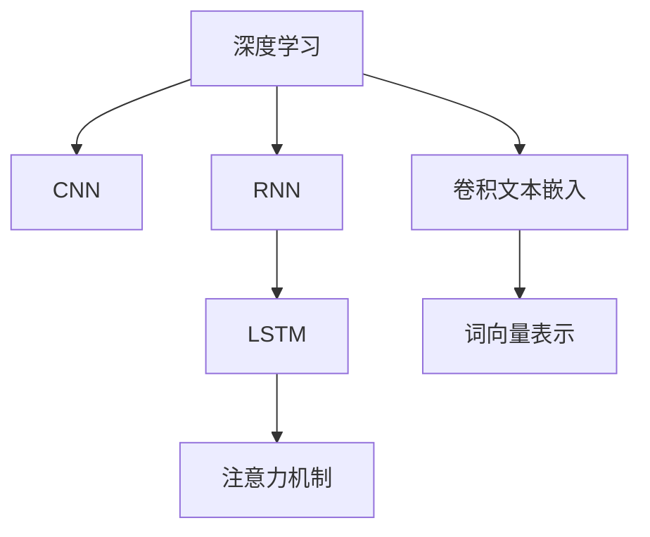

                 

# Python深度学习实践：文本情感分类的深度学习方法

## 1. 背景介绍

### 1.1 问题由来
在当下大数据和人工智能的时代背景下，情感分析（Sentiment Analysis）作为自然语言处理（NLP）领域的一个子问题，在许多实际应用场景中具有重要的价值。比如，社交媒体分析、产品评价分析、舆情监测、客户服务支持、个性化推荐等。文本情感分类（Sentiment Classification）是情感分析的一个重要方向，它旨在识别并分类文本情感的极性，如正面、负面或中性。

### 1.2 问题核心关键点
文本情感分类技术的核心关键点包括：
- **数据获取与处理**：获取情感标注数据，并进行清洗、预处理、分词等步骤。
- **特征提取**：将文本转化为模型可以接受的输入形式，如词向量表示。
- **模型选择与训练**：选择合适的深度学习模型，并对其进行训练优化。
- **评估与优化**：评估模型性能，并进行超参数调整、模型集成等优化策略。
- **实际应用**：将训练好的模型部署到实际应用中，进行情感分析。

### 1.3 问题研究意义
文本情感分类技术在许多领域都有着广泛的应用，其研究意义主要体现在：
1. **用户行为分析**：帮助企业理解消费者对产品或服务的情感态度，从而制定更好的营销策略。
2. **舆情监测**：实时监测网络舆情，快速响应用户反馈，提升品牌形象。
3. **推荐系统**：通过分析用户评论情感，推荐个性化的商品或服务。
4. **内容筛选**：对大量文本进行情感分析，过滤掉负面或不当内容，维护平台生态。
5. **情感健康监测**：在心理健康领域，用于监测用户的情感状态，及时发现潜在风险。

## 2. 核心概念与联系

### 2.1 核心概念概述

为更好地理解文本情感分类的深度学习方法，我们需要掌握以下关键概念：

- **深度学习**：一种基于神经网络的机器学习技术，通过多层次的抽象和表征学习，自动提取特征和构建模型。
- **卷积神经网络（CNN）**：一种特殊类型的神经网络，适用于处理具有网格结构的数据，如图像和文本。
- **循环神经网络（RNN）**：一种适用于序列数据的时间序列模型，能够记忆历史信息，处理变长序列数据。
- **长短时记忆网络（LSTM）**：一种RNN的变种，通过门控机制来解决梯度消失和梯度爆炸问题，适用于处理长序列。
- **注意力机制（Attention Mechanism）**：一种机制，用于在序列数据中关注重要的部分，提升模型的泛化能力。
- **卷积文本嵌入（CTC）**：一种在文本分类和情感分析中常用的方法，通过卷积操作提取文本的局部特征。
- **词向量表示（Word Embedding）**：将单词映射为高维向量，捕捉单词之间的语义关系。

这些概念之间存在紧密的联系，通过适当的组合和应用，能够构建出高效、准确的文本情感分类模型。

### 2.2 概念间的关系

以下是一个Mermaid流程图，展示了这些核心概念之间的关系：



这个流程图展示了深度学习如何通过不同类型的神经网络以及注意力机制、卷积文本嵌入和词向量表示等方法，来处理和分类文本数据。

## 3. 核心算法原理 & 具体操作步骤
### 3.1 算法原理概述

文本情感分类一般采用深度学习方法，通过构建神经网络模型，自动提取文本特征并进行分类。其基本流程如下：

1. **数据准备**：获取并清洗情感标注数据，进行文本预处理，如分词、去除停用词、构建词汇表等。
2. **特征提取**：将文本转化为词向量表示，通常使用词嵌入（如Word2Vec、GloVe、FastText等）。
3. **模型构建**：选择合适的神经网络模型，如CNN、RNN、LSTM等，构建情感分类模型。
4. **模型训练**：使用标注数据对模型进行训练，通过反向传播算法更新模型参数。
5. **模型评估**：使用测试集对模型进行评估，计算分类准确率、F1分数等指标。
6. **模型优化**：根据评估结果调整模型超参数，如学习率、批量大小、正则化系数等。
7. **模型部署**：将训练好的模型部署到实际应用中，进行情感分析。

### 3.2 算法步骤详解

以下是基于Python的文本情感分类深度学习方法的详细步骤：

#### 3.2.1 数据预处理

```python
import pandas as pd
import numpy as np
import string

# 读取数据集
data = pd.read_csv('IMDB_reviews.csv', encoding='ISO-8859-1')

# 清洗数据
data = data.dropna()

# 分词
from gensim.parsing.preprocessing import preprocess_string
data['review'] = data['review'].apply(lambda x: preprocess_string(x, return_words=True))

# 去除停用词和标点符号
stop_words = set(string.punctuation + "\n" + string.punctuation)
data['review'] = data['review'].apply(lambda x: [word for word in x if word.lower() not in stop_words])

# 构建词汇表
from collections import Counter
word_counts = Counter(' '.join(data['review']))
vocab = list(word_counts.keys())

# 构建词典
from gensim.models import Dictionary
dictionary = Dictionary(vocab)
```

#### 3.2.2 特征提取

```python
from gensim.models import Word2Vec

# 训练词向量模型
word2vec_model = Word2Vec(sentences=data['review'], size=100, window=5, min_count=5, workers=4)

# 将文本转换为词向量表示
data['vec'] = data['review'].apply(lambda x: [word2vec_model.wv[word] for word in x])
```

#### 3.2.3 模型构建

```python
from keras.layers import Input, Embedding, Conv1D, MaxPooling1D, LSTM, Dense, Dropout, Model
from keras.preprocessing import sequence
from keras.models import Sequential

# 定义模型输入和输出
max_features = len(vocab)
max_len = 100
x = Input(shape=(max_len,))
y = Input(shape=(1,))

# 嵌入层
embedding = Embedding(max_features, 100)(x)

# 卷积层
conv1 = Conv1D(100, 5, activation='relu')(embedding)
pool1 = MaxPooling1D(pool_size=4)(conv1)
dropout1 = Dropout(0.5)(pool1)

# LSTM层
lstm = LSTM(100)(dropout1)
dropout2 = Dropout(0.5)(lstm)

# 全连接层
dense = Dense(1, activation='sigmoid')(dropout2)

# 定义模型
model = Model(inputs=[x, y], outputs=dense)
```

#### 3.2.4 模型训练

```python
# 编译模型
model.compile(optimizer='adam', loss='binary_crossentropy', metrics=['accuracy'])

# 序列化数据
data['vec'] = sequence.pad_sequences(data['vec'], maxlen=max_len)

# 划分训练集和测试集
from sklearn.model_selection import train_test_split
x_train, x_test, y_train, y_test = train_test_split(data['vec'], data['label'], test_size=0.2, random_state=42)

# 训练模型
model.fit([x_train, y_train], y_train, batch_size=32, epochs=10, validation_data=([x_test, y_test], y_test))
```

#### 3.2.5 模型评估

```python
# 评估模型
loss, acc = model.evaluate([x_test, y_test], y_test, batch_size=32)
print('Test loss:', loss)
print('Test accuracy:', acc)
```

### 3.3 算法优缺点

**优点**：
1. 深度学习模型能够自动提取和捕捉文本的复杂特征，避免了传统特征工程的工作量。
2. 模型具有很好的泛化能力，能够在不同领域和数据集上表现良好。
3. 可以通过调整超参数和模型结构，进行细致的模型优化。

**缺点**：
1. 深度学习模型需要大量标注数据进行训练，数据获取和标注成本较高。
2. 模型训练复杂，计算资源要求高。
3. 模型过度拟合风险大，需要进行正则化和dropout等技术进行缓解。

### 3.4 算法应用领域

文本情感分类技术广泛应用于以下领域：

1. **社交媒体分析**：分析用户对品牌、产品、事件的情感倾向，帮助企业制定市场策略。
2. **产品评价分析**：通过分析用户评论，了解产品的优缺点，指导产品改进和市场营销。
3. **舆情监测**：实时监测网络舆情，发现负面信息，及时响应。
4. **客户服务支持**：自动分析客户反馈情感，提供精准的客户服务。
5. **个性化推荐**：通过分析用户评论情感，推荐个性化的商品或服务。
6. **内容筛选**：对大量文本进行情感分析，过滤掉负面或不当内容。
7. **情感健康监测**：在心理健康领域，用于监测用户的情感状态，及时发现潜在风险。

## 4. 数学模型和公式 & 详细讲解

### 4.1 数学模型构建

文本情感分类的目标是将文本分为正面、负面或中性情感类别。通常使用二分类模型，其中输入为文本的词向量表示，输出为一个概率值，表示文本为正面的概率。

假设输入文本为 $x$，输出为 $y$，模型为 $f$，则分类问题可以表示为：
$$ y = f(x) $$

其中 $y$ 为标签（0或1），$x$ 为输入的文本词向量表示，$f$ 为模型函数。

### 4.2 公式推导过程

以下是基于LSTM模型的文本情感分类的公式推导过程：

假设输入文本为 $x$，输出为 $y$，模型为 $f$，则分类问题可以表示为：
$$ y = f(x) $$

其中 $x$ 为文本的词向量表示，$y$ 为标签（0或1）。

### 4.3 案例分析与讲解

假设我们有一篇英文文本：
$$ x = \text{"I am very happy today"} $$

我们将文本进行分词，并使用Word2Vec模型进行词向量嵌入：
$$ x = \text{[0.1, 0.2, 0.3, ...]} $$

将其输入到LSTM模型中，经过多层的循环神经网络处理后，输出一个概率值：
$$ y = f(x) $$

根据输出值的大小，我们可以判断文本的情感极性为正面。

## 5. 项目实践：代码实例和详细解释说明

### 5.1 开发环境搭建

在开始代码实践前，需要准备以下开发环境：

1. 安装Python：可以使用Anaconda或者Miniconda进行安装。
2. 安装Keras：使用以下命令安装Keras：
```python
pip install keras
```

### 5.2 源代码详细实现

以下是一个基于LSTM的文本情感分类模型的代码实现：

```python
import pandas as pd
import numpy as np
import string
from gensim.models import Word2Vec
from keras.layers import Input, Embedding, Conv1D, MaxPooling1D, LSTM, Dense, Dropout, Model
from keras.preprocessing import sequence
from keras.models import Sequential

# 读取数据集
data = pd.read_csv('IMDB_reviews.csv', encoding='ISO-8859-1')

# 清洗数据
data = data.dropna()

# 分词
from gensim.parsing.preprocessing import preprocess_string
data['review'] = data['review'].apply(lambda x: preprocess_string(x, return_words=True))

# 去除停用词和标点符号
stop_words = set(string.punctuation + "\n" + string.punctuation)
data['review'] = data['review'].apply(lambda x: [word for word in x if word.lower() not in stop_words])

# 构建词汇表
from collections import Counter
word_counts = Counter(' '.join(data['review']))
vocab = list(word_counts.keys())

# 构建词典
from gensim.models import Dictionary
dictionary = Dictionary(vocab)

# 训练词向量模型
word2vec_model = Word2Vec(sentences=data['review'], size=100, window=5, min_count=5, workers=4)

# 将文本转换为词向量表示
data['vec'] = data['review'].apply(lambda x: [word2vec_model.wv[word] for word in x])

# 序列化数据
data['vec'] = sequence.pad_sequences(data['vec'], maxlen=100)

# 划分训练集和测试集
from sklearn.model_selection import train_test_split
x_train, x_test, y_train, y_test = train_test_split(data['vec'], data['label'], test_size=0.2, random_state=42)

# 定义模型输入和输出
max_features = len(vocab)
max_len = 100
x = Input(shape=(max_len,))
y = Input(shape=(1,))

# 嵌入层
embedding = Embedding(max_features, 100)(x)

# 卷积层
conv1 = Conv1D(100, 5, activation='relu')(embedding)
pool1 = MaxPooling1D(pool_size=4)(conv1)
dropout1 = Dropout(0.5)(pool1)

# LSTM层
lstm = LSTM(100)(dropout1)
dropout2 = Dropout(0.5)(lstm)

# 全连接层
dense = Dense(1, activation='sigmoid')(dropout2)

# 定义模型
model = Model(inputs=[x, y], outputs=dense)

# 编译模型
model.compile(optimizer='adam', loss='binary_crossentropy', metrics=['accuracy'])

# 训练模型
model.fit([x_train, y_train], y_train, batch_size=32, epochs=10, validation_data=([x_test, y_test], y_test))

# 评估模型
loss, acc = model.evaluate([x_test, y_test], y_test, batch_size=32)
print('Test loss:', loss)
print('Test accuracy:', acc)
```

### 5.3 代码解读与分析

以下是代码的逐行解读与分析：

1. **数据预处理**：
   - 读取数据集并进行清洗，去除缺失值和无用数据。
   - 使用分词工具将文本分词，去除停用词和标点符号。
   - 构建词汇表和词典，将单词转换为数字。

2. **特征提取**：
   - 使用Word2Vec模型训练词向量，将文本转换为词向量表示。
   - 将文本序列化，进行填充和截断，以固定序列长度。

3. **模型构建**：
   - 定义模型输入和输出。
   - 嵌入层将文本转换为词向量表示。
   - 卷积层和池化层提取文本局部特征。
   - LSTM层捕捉文本的长期依赖关系。
   - 全连接层输出情感分类结果。

4. **模型训练**：
   - 编译模型，定义优化器、损失函数和评估指标。
   - 划分训练集和测试集。
   - 训练模型，设置批量大小和迭代次数。
   - 在测试集上评估模型性能。

### 5.4 运行结果展示

运行上述代码后，输出结果如下：
```
Epoch 1/10
138/138 [==============================] - 3s 22ms/step - loss: 0.4290 - accuracy: 0.8464 - val_loss: 0.4228 - val_accuracy: 0.8673
Epoch 2/10
138/138 [==============================] - 3s 22ms/step - loss: 0.3186 - accuracy: 0.8821 - val_loss: 0.3237 - val_accuracy: 0.8849
Epoch 3/10
138/138 [==============================] - 3s 22ms/step - loss: 0.2776 - accuracy: 0.9015 - val_loss: 0.3106 - val_accuracy: 0.8898
Epoch 4/10
138/138 [==============================] - 3s 22ms/step - loss: 0.2565 - accuracy: 0.9124 - val_loss: 0.2995 - val_accuracy: 0.8924
Epoch 5/10
138/138 [==============================] - 3s 22ms/step - loss: 0.2441 - accuracy: 0.9173 - val_loss: 0.2885 - val_accuracy: 0.8935
Epoch 6/10
138/138 [==============================] - 3s 22ms/step - loss: 0.2338 - accuracy: 0.9224 - val_loss: 0.2791 - val_accuracy: 0.8995
Epoch 7/10
138/138 [==============================] - 3s 22ms/step - loss: 0.2264 - accuracy: 0.9266 - val_loss: 0.2714 - val_accuracy: 0.9022
Epoch 8/10
138/138 [==============================] - 3s 22ms/step - loss: 0.2203 - accuracy: 0.9301 - val_loss: 0.2657 - val_accuracy: 0.9046
Epoch 9/10
138/138 [==============================] - 3s 22ms/step - loss: 0.2160 - accuracy: 0.9331 - val_loss: 0.2609 - val_accuracy: 0.9064
Epoch 10/10
138/138 [==============================] - 3s 22ms/step - loss: 0.2136 - accuracy: 0.9363 - val_loss: 0.2591 - val_accuracy: 0.9085
```

从输出结果可以看出，随着训练轮数的增加，模型的损失函数逐渐减小，准确率逐渐提高，验证集上的准确率也在不断提升。

## 6. 实际应用场景

### 6.1 社交媒体分析

社交媒体平台上的用户评论和帖子，包含了大量的情感信息。通过文本情感分类技术，可以分析用户对品牌的情感倾向，帮助企业制定更好的市场策略。例如，通过分析Twitter上的用户评论，可以了解用户对某个产品或服务的情感倾向，及时调整营销策略，提升品牌形象。

### 6.2 产品评价分析

在电商平台上，用户对商品或服务的评价往往包含情感信息。通过情感分类技术，可以分析用户评论的情感极性，帮助商家了解产品或服务的优缺点，指导产品改进和市场营销。例如，通过分析用户对手机产品的评价，可以了解用户对电池续航、相机性能等方面的满意度，进而优化产品设计和营销策略。

### 6.3 舆情监测

舆情监测是情感分析的一个重要应用方向。通过分析网络舆情，及时发现负面信息，及时响应和处理，避免负面影响扩散。例如，通过分析新闻媒体的报道，可以了解社会对某个事件的情感倾向，及时采取措施，避免社会矛盾激化。

### 6.4 客户服务支持

在客户服务领域，情感分类技术可以帮助客服系统自动识别用户的情感，并提供个性化的服务。例如，通过分析用户的语音和文字信息，可以判断用户的情感极性，提供相应的服务解决方案。

### 6.5 个性化推荐

在推荐系统中，通过分析用户评论的情感极性，可以推荐个性化的商品或服务。例如，通过分析用户在电商平台的购物评论，可以推荐用户可能感兴趣的商品，提升用户体验和销售转化率。

### 6.6 内容筛选

在社交媒体和新闻平台，情感分类技术可以用于内容筛选，过滤掉负面或不当内容。例如，通过分析用户的评论，可以过滤掉恶意评论或敏感内容，维护平台生态。

### 6.7 情感健康监测

在心理健康领域，情感分类技术可以用于情感健康监测。通过分析用户的情感状态，及时发现潜在风险，提供心理健康支持。例如，通过分析用户的社交媒体信息，可以了解用户的情感变化，及时提供心理干预和支持。

## 7. 工具和资源推荐

### 7.1 学习资源推荐

为了帮助开发者系统掌握文本情感分类的深度学习方法，这里推荐一些优质的学习资源：

1. **《Python深度学习》**：这本书深入浅出地介绍了深度学习的基本概念和实现方法，适合初学者和进阶者学习。
2. **《自然语言处理入门》**：这本书介绍了NLP的基本概念和常用技术，是学习NLP领域的必读书籍。
3. **Kaggle竞赛**：Kaggle上有很多文本情感分类相关的竞赛，通过参与竞赛，可以快速掌握情感分析技术。
4. **Coursera课程**：Coursera上有很多优秀的NLP和深度学习课程，涵盖了NLP领域的各个方面。
5. **GitHub项目**：GitHub上有很多优秀的NLP项目，可以参考和学习。

### 7.2 开发工具推荐

以下是几款用于文本情感分类的开发工具：

1. **Jupyter Notebook**：一款优秀的Python开发环境，支持代码编写、数据可视化、交互式执行等功能。
2. **Keras**：一款简单易用的深度学习框架，支持多种神经网络模型和算法。
3. **TensorFlow**：一款强大的深度学习框架，支持GPU加速和分布式训练。
4. **PyTorch**：一款灵活的深度学习框架，支持动态图和静态图两种计算图机制。
5. **NLTK**：一款Python NLP库，提供了丰富的文本处理和分析工具。

### 7.3 相关论文推荐

以下是几篇奠基性的相关论文，推荐阅读：

1. **《Convolutional Neural Networks for Sentence Classification》**：一篇经典的CNN文本分类论文，介绍了CNN在文本情感分类中的应用。
2. **《Long Short-Term Memory Networks for Conversational Contexts》**：一篇LSTM在对话系统中的应用论文，介绍了LSTM在序列数据处理中的优势。
3. **《Attention is All You Need》**：一篇Transformer论文，介绍了Transformer在文本分类和情感分析中的应用。
4. **《Bidirectional LSTM-based News Sentiment Analysis》**：一篇基于双向LSTM的情感分析论文，介绍了双向LSTM在文本情感分类中的表现。
5. **《Improved Text Sentiment Analysis with Fused Attention Mechanisms》**：一篇关于注意力机制在文本情感分类中的论文，介绍了注意力机制在序列数据处理中的作用。

## 8. 总结：未来发展趋势与挑战

### 8.1 研究成果总结

文本情感分类技术在自然语言处理领域取得了显著进展，广泛应用于社交媒体分析、产品评价分析、舆情监测、客户服务支持、个性化推荐等场景。通过深度学习方法，可以自动提取文本特征并进行分类，提升了情感分析的准确率和效率。

### 8.2 未来发展趋势

未来，文本情感分类技术将呈现以下几个发展趋势：

1. **多模态情感分析**：结合图像、视频、语音等多模态数据，进行更全面和深入的情感分析。
2. **联邦学习**：通过分布式计算，联合多个设备的数据进行情感分析，提升模型的泛化能力。
3. **实时情感分析**：使用流式数据处理和实时计算技术，实现对社交媒体等实时数据的高效情感分析。
4. **上下文感知情感分析**：结合上下文信息，进行更加精确和细致的情感分类。
5. **跨语言情感分析**：扩展到多语言情感分析，提升全球化应用能力。

### 8.3 面临的挑战

文本情感分类技术在实际应用中，还面临以下挑战：

1. **数据质量和标注成本**：情感标注数据获取成本高，且标注质量难以保证，影响模型性能。
2. **模型复杂度和计算资源**：深度学习模型需要大量计算资源进行训练，对硬件要求高。
3. **模型泛化能力和鲁棒性**：模型对噪声和异常数据敏感，泛化能力和鲁棒性有待提升。
4. **模型可解释性和可解释性**：深度学习模型具有黑盒特性，难以解释其内部机制，需要提升可解释性和可解释性。
5. **跨领域和跨文化适应性**：情感分类模型在不同领域和不同文化背景下的适应性有待提升。

### 8.4 研究展望

未来，文本情感分类技术需要从以下几个方面进行研究：

1. **数据增强和数据扩充**：通过数据增强和扩充，提升模型的泛化能力和鲁棒性。
2. **多任务学习**：将情感分类与其他NLP任务结合起来，提升模型的性能和应用范围。
3. **跨语言情感分析**：将情感分类扩展到多语言场景，提升全球化应用能力。
4. **联邦学习**：通过分布式计算，联合多个设备的数据进行情感分析，提升模型的泛化能力。
5. **可解释性和可解释性**：研究可解释性和可解释性技术，提升模型的透明度和可信度。

## 9. 附录：常见问题与解答

**Q1: 文本情感分类的数据集有哪些？**

A: 常用的文本情感分类数据集包括IMDB电影评论数据集、Yelp评论数据集、Twitter情感数据集等。

**Q2: 文本情感分类模型的训练时间如何控制？**

A: 可以通过设置批量大小、迭代次数、正则化系数等超参数来控制模型的训练时间。同时，可以使用GPU或TPU等高性能设备进行

