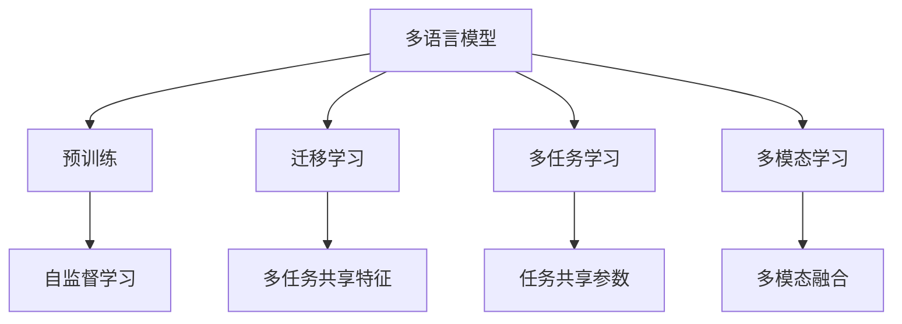
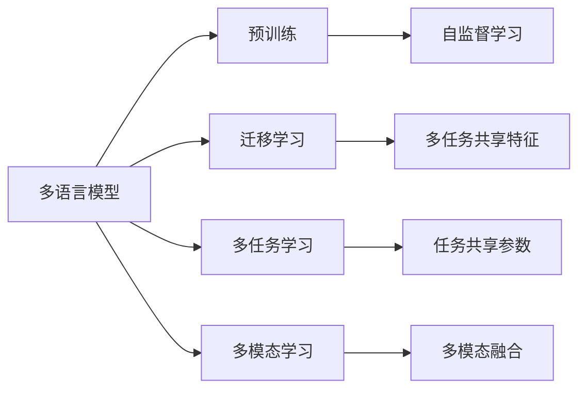
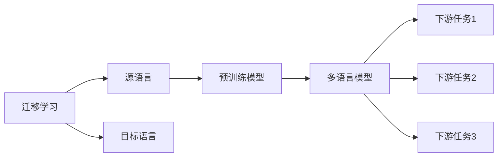
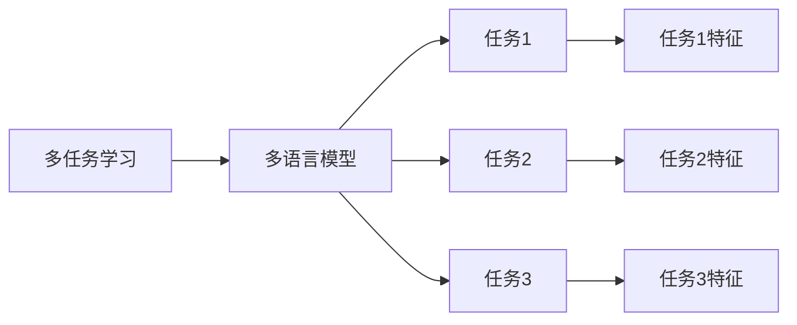
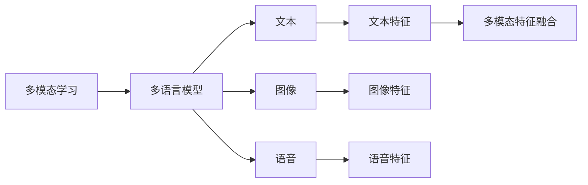
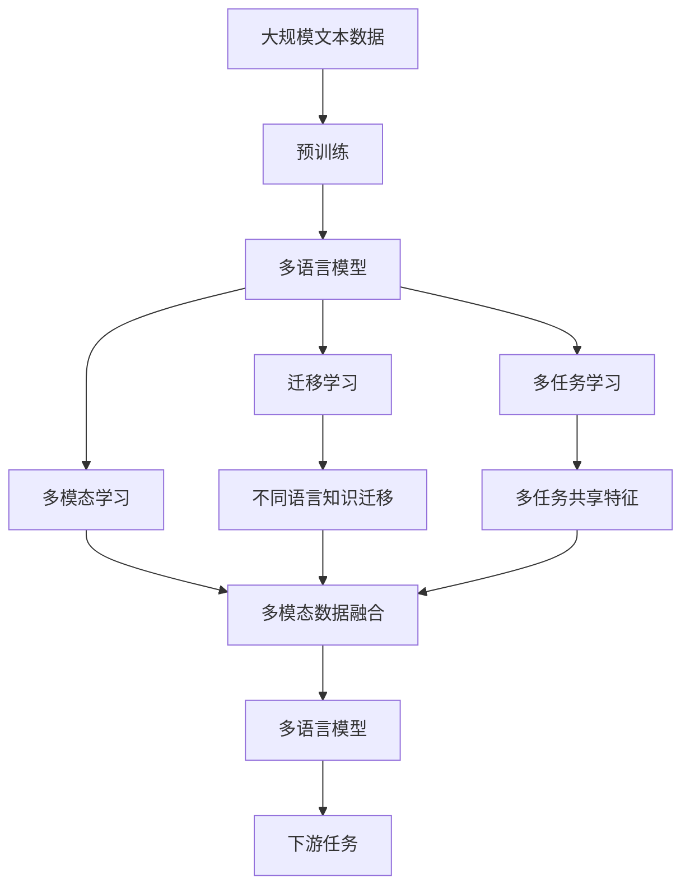

                 

# Python深度学习实践：构建多语言模型处理国际化需求

> 关键词：深度学习,多语言模型,国际化需求,自然语言处理(NLP),计算机视觉,语音识别

## 1. 背景介绍

### 1.1 问题由来

随着全球化进程的加快，企业需要处理跨语言、跨地域的用户数据和内容，这就需要一套能够支持多语言的深度学习模型。传统的模型往往依赖单一语言的语料进行训练，难以适应多语言的场景需求。为了打破语言障碍，构建国际化模型成为当前研究的热点。

### 1.2 问题核心关键点

多语言模型处理国际化需求的核心关键点包括：

- **跨语言能力**：模型能够理解、处理和生成不同语言的内容。
- **多语言并行训练**：在有限的时间和资源下，并行训练多种语言模型，提升训练效率。
- **语言迁移学习**：通过预训练模型，在不同语言之间进行迁移学习，利用知识迁移提高模型性能。
- **多模态融合**：将文本、图像、语音等不同模态的数据进行融合，提升模型的理解能力。

### 1.3 问题研究意义

构建多语言模型，对于打破语言障碍、促进全球化交流、提升用户体验具有重要意义。具体来说：

1. **全球市场拓展**：支持多语言的企业，可以在全球市场中获得更多机会。
2. **用户满意度提升**：跨语言的服务和应用，使得不同语言的用户都能够获得良好体验。
3. **数据利用率提高**：通过多语言模型的处理，企业可以更好地利用全球数据资源。
4. **技术创新**：多语言模型的研究，推动了自然语言处理、计算机视觉、语音识别等前沿技术的发展。

## 2. 核心概念与联系

### 2.1 核心概念概述

为更好地理解多语言模型处理国际化需求的原理和技术，本节将介绍几个关键概念：

- **多语言模型(Multilingual Model)**：指能够处理多种语言输入输出的深度学习模型。
- **预训练(Pre-training)**：指在大规模无标签文本数据上，通过自监督学习任务训练通用语言模型的过程。
- **迁移学习(Transfer Learning)**：指将一个领域学习到的知识，迁移应用到另一个不同但相关的领域的学习范式。
- **多任务学习(Multi-task Learning)**：指在一个模型中同时学习多个任务，以提升模型的泛化能力。
- **多模态学习(Multi-modal Learning)**：指同时处理多种模态（如文本、图像、语音）的数据，提升模型的综合理解能力。

这些核心概念之间的逻辑关系可以通过以下Mermaid流程图来展示：



这个流程图展示了多语言模型的核心概念及其之间的关系：

1. 多语言模型通过预训练获得基础能力。
2. 迁移学习可以实现不同语言之间的知识迁移。
3. 多任务学习可以在一个模型中同时处理多个任务。
4. 多模态学习可以融合多种数据模态，提升模型的理解能力。

这些概念共同构成了多语言模型处理国际化需求的技术框架，使其能够在各种场景下发挥强大的跨语言理解能力。通过理解这些核心概念，我们可以更好地把握多语言模型的工作原理和优化方向。

### 2.2 概念间的关系

这些核心概念之间存在着紧密的联系，形成了多语言模型处理国际化需求的完整生态系统。下面我通过几个Mermaid流程图来展示这些概念之间的关系。

#### 2.2.1 多语言模型的学习范式



这个流程图展示了大模型处理多语言的任务适配范式。多语言模型通过预训练获得基础能力，利用迁移学习、多任务学习、多模态学习等方式，提升模型的多语言处理能力。

#### 2.2.2 迁移学习与多语言模型的关系



这个流程图展示了迁移学习的基本原理，以及它与多语言模型的关系。迁移学习涉及源语言和目标语言，预训练模型在源语言上学习，然后通过迁移学习应用到不同目标语言的任务适配中。

#### 2.2.3 多任务学习与多语言模型的关系



这个流程图展示了多任务学习的基本原理，以及它与多语言模型的关系。多任务学习可以在一个模型中同时处理多个任务，不同任务共享部分特征和参数，提升模型的泛化能力。

#### 2.2.4 多模态学习与多语言模型的关系



这个流程图展示了多模态学习的基本原理，以及它与多语言模型的关系。多模态学习可以融合文本、图像、语音等不同模态的数据，提升模型的综合理解能力。

### 2.3 核心概念的整体架构

最后，我们用一个综合的流程图来展示这些核心概念在大语言模型处理国际化需求过程中的整体架构：



这个综合流程图展示了从预训练到处理多语言任务的完整过程。多语言模型通过预训练获得基础能力，利用迁移学习、多任务学习、多模态学习等方式，提升模型的多语言处理能力。多语言模型最终应用于下游任务，如文本分类、机器翻译、语音识别等。

## 3. 核心算法原理 & 具体操作步骤
### 3.1 算法原理概述

多语言模型处理国际化需求，本质上是一个多任务学习的泛化过程。其核心思想是：将预训练的多语言模型视作一个强大的"特征提取器"，通过在多种语言的任务数据上进行有监督的微调，使得模型输出能够匹配多种语言的任务标签，从而获得针对特定任务优化的模型。

形式化地，假设预训练多语言模型为 $M_{\theta}$，其中 $\theta$ 为预训练得到的模型参数。给定 $k$ 种语言的标注数据集 $D=\{(x_i, y_i)\}_{i=1}^N$，每种语言的标注数据 $D_l=\{(x_{il}, y_{il})\}_{il=1}^N$，微调的目标是找到新的模型参数 $\hat{\theta}$，使得：

$$
\hat{\theta}=\mathop{\arg\min}_{\theta} \mathcal{L}(M_{\theta},D)
$$

其中 $\mathcal{L}$ 为针对所有任务设计的损失函数，用于衡量模型预测输出与真实标签之间的差异。常见的损失函数包括交叉熵损失、均方误差损失等。

通过梯度下降等优化算法，微调过程不断更新模型参数 $\theta$，最小化损失函数 $\mathcal{L}$，使得模型输出逼近真实标签。由于 $\theta$ 已经通过预训练获得了较好的初始化，因此即便在多语言任务数据集上进行微调，也能较快收敛到理想的模型参数 $\hat{\theta}$。

### 3.2 算法步骤详解

多语言模型处理国际化需求一般包括以下几个关键步骤：

**Step 1: 准备预训练模型和数据集**
- 选择合适的预训练多语言模型 $M_{\theta}$ 作为初始化参数，如 BERT、GPT 等。
- 准备每种语言的标注数据集 $D_l=\{(x_{il}, y_{il})\}_{il=1}^N$，划分为训练集、验证集和测试集。一般要求标注数据与预训练数据的分布不要差异过大。

**Step 2: 添加任务适配层**
- 根据任务类型，在预训练模型顶层设计合适的输出层和损失函数。
- 对于分类任务，通常在顶层添加线性分类器和交叉熵损失函数。
- 对于生成任务，通常使用语言模型的解码器输出概率分布，并以负对数似然为损失函数。

**Step 3: 设置微调超参数**
- 选择合适的优化算法及其参数，如 AdamW、SGD 等，设置学习率、批大小、迭代轮数等。
- 设置正则化技术及强度，包括权重衰减、Dropout、Early Stopping 等。
- 确定冻结预训练参数的策略，如仅微调顶层，或全部参数都参与微调。

**Step 4: 执行梯度训练**
- 将训练集数据分批次输入模型，前向传播计算损失函数。
- 反向传播计算参数梯度，根据设定的优化算法和学习率更新模型参数。
- 周期性在验证集上评估模型性能，根据性能指标决定是否触发 Early Stopping。
- 重复上述步骤直到满足预设的迭代轮数或 Early Stopping 条件。

**Step 5: 测试和部署**
- 在测试集上评估微调后模型 $M_{\hat{\theta}}$ 的性能，对比微调前后的精度提升。
- 使用微调后的模型对新样本进行推理预测，集成到实际的应用系统中。
- 持续收集新的数据，定期重新微调模型，以适应数据分布的变化。

以上是多语言模型处理国际化需求的一般流程。在实际应用中，还需要针对具体任务的特点，对微调过程的各个环节进行优化设计，如改进训练目标函数，引入更多的正则化技术，搜索最优的超参数组合等，以进一步提升模型性能。

### 3.3 算法优缺点

多语言模型处理国际化需求的方法具有以下优点：

1. 泛化能力强。多语言模型通过迁移学习，可以充分利用预训练的知识，快速适应新的语言任务。
2. 资源效率高。通过共享预训练参数，减少微调所需的计算资源和时间。
3. 效果显著。在多种语言的任务上，多语言模型通常能取得比单语言模型更好的性能。
4. 数据需求低。多语言模型可以基于少量标注数据进行微调，降低数据获取成本。

同时，该方法也存在一定的局限性：

1. 迁移效果有限。当目标语言与预训练数据分布差异较大时，迁移学习的效果可能较差。
2. 数据质量要求高。多语言模型对标注数据的质量和多样性有较高要求，标注数据的不足会影响模型性能。
3. 模型复杂度高。多语言模型参数量较大，训练和推理过程复杂，对计算资源要求较高。
4. 跨语言迁移能力有限。模型在不同语言之间迁移时，可能会存在"语言鸿沟"现象，影响模型效果。

尽管存在这些局限性，但就目前而言，多语言模型处理国际化需求的方法仍然是大模型应用的主流范式。未来相关研究的重点在于如何进一步降低数据和资源的依赖，提高模型的跨语言迁移能力，同时兼顾可解释性和伦理安全性等因素。

### 3.4 算法应用领域

多语言模型处理国际化需求的方法在多个领域中已经得到了广泛的应用，例如：

- **翻译**：通过多语言模型的微调，可以提升机器翻译的质量，支持多语言之间的互译。
- **多语言搜索**：在搜索引擎中，通过多语言模型处理用户的多语言查询，提升搜索结果的相关性和多样性。
- **跨语言情感分析**：通过多语言模型对全球不同语言的用户评论进行情感分析，了解不同文化背景下的用户反馈。
- **多语言文本生成**：利用多语言模型生成多语言的文本内容，如新闻、文章、社交媒体等，满足全球用户的需求。
- **多语言对话系统**：构建支持多种语言的对话系统，实现跨语言的人机交互。
- **跨语言推荐系统**：通过多语言模型对全球用户的行为和偏好进行分析，提供个性化的跨语言推荐服务。

除了上述这些经典任务外，多语言模型的研究还在持续探索更多的应用场景，如跨语言数据增强、跨语言信息检索、跨语言语义分析等，为多语言模型的应用带来新的突破。随着预训练模型和微调方法的不断进步，相信多语言模型将在更广阔的应用领域大放异彩。

## 4. 数学模型和公式 & 详细讲解  
### 4.1 数学模型构建

本节将使用数学语言对多语言模型处理国际化需求的微调过程进行更加严格的刻画。

记预训练多语言模型为 $M_{\theta}$，其中 $\theta$ 为预训练得到的模型参数。假设 $k$ 种语言的标注数据集为 $D_l=\{(x_{il}, y_{il})\}_{il=1}^N$，每种语言的标注数据 $D_{il}=\{(x_{il}, y_{il})\}_{i=1}^N$，微调的目标是找到新的模型参数 $\hat{\theta}$，使得：

$$
\hat{\theta}=\mathop{\arg\min}_{\theta} \mathcal{L}(M_{\theta},D)
$$

其中 $\mathcal{L}$ 为针对所有任务设计的损失函数，用于衡量模型预测输出与真实标签之间的差异。常见的损失函数包括交叉熵损失、均方误差损失等。

在实践中，我们通常使用基于梯度的优化算法（如SGD、AdamW等）来近似求解上述最优化问题。设 $\eta$ 为学习率，$\lambda$ 为正则化系数，则参数的更新公式为：

$$
\theta \leftarrow \theta - \eta \nabla_{\theta}\mathcal{L}(\theta) - \eta\lambda\theta
$$

其中 $\nabla_{\theta}\mathcal{L}(\theta)$ 为损失函数对参数 $\theta$ 的梯度，可通过反向传播算法高效计算。

### 4.2 公式推导过程

以下我们以二分类任务为例，推导交叉熵损失函数及其梯度的计算公式。

假设模型 $M_{\theta}$ 在输入 $x$ 上的输出为 $\hat{y}=M_{\theta}(x) \in [0,1]$，表示样本属于正类的概率。真实标签 $y \in \{0,1\}$。则二分类交叉熵损失函数定义为：

$$
\ell(M_{\theta}(x),y) = -[y\log \hat{y} + (1-y)\log (1-\hat{y})]
$$

将其代入经验风险公式，得：

$$
\mathcal{L}(\theta) = -\frac{1}{N}\sum_{il=1}^{kN} [y_{il}\log M_{\theta}(x_{il})+(1-y_{il})\log(1-M_{\theta}(x_{il}))]
$$

根据链式法则，损失函数对参数 $\theta_k$ 的梯度为：

$$
\frac{\partial \mathcal{L}(\theta)}{\partial \theta_k} = -\frac{1}{N}\sum_{il=1}^{kN} (\frac{y_{il}}{M_{\theta}(x_{il})}-\frac{1-y_{il}}{1-M_{\theta}(x_{il})}) \frac{\partial M_{\theta}(x_{il})}{\partial \theta_k}
$$

其中 $\frac{\partial M_{\theta}(x_{il})}{\partial \theta_k}$ 可进一步递归展开，利用自动微分技术完成计算。

在得到损失函数的梯度后，即可带入参数更新公式，完成模型的迭代优化。重复上述过程直至收敛，最终得到适应多种语言任务的最优模型参数 $\hat{\theta}$。

## 5. 项目实践：代码实例和详细解释说明
### 5.1 开发环境搭建

在进行多语言模型处理国际化需求的微调实践前，我们需要准备好开发环境。以下是使用Python进行PyTorch开发的环境配置流程：

1. 安装Anaconda：从官网下载并安装Anaconda，用于创建独立的Python环境。

2. 创建并激活虚拟环境：
```bash
conda create -n pytorch-env python=3.8 
conda activate pytorch-env
```

3. 安装PyTorch：根据CUDA版本，从官网获取对应的安装命令。例如：
```bash
conda install pytorch torchvision torchaudio cudatoolkit=11.1 -c pytorch -c conda-forge
```

4. 安装Transformers库：
```bash
pip install transformers
```

5. 安装各类工具包：
```bash
pip install numpy pandas scikit-learn matplotlib tqdm jupyter notebook ipython
```

完成上述步骤后，即可在`pytorch-env`环境中开始微调实践。

### 5.2 源代码详细实现

下面我以机器翻译任务为例，给出使用Transformers库对多语言BERT模型进行微调的PyTorch代码实现。

首先，定义翻译任务的数据处理函数：

```python
from transformers import BertTokenizer
from torch.utils.data import Dataset, DataLoader
import torch

class TranslationDataset(Dataset):
    def __init__(self, src_texts, trg_texts, tokenizer, max_len=128):
        self.src_texts = src_texts
        self.trg_texts = trg_texts
        self.tokenizer = tokenizer
        self.max_len = max_len
        
    def __len__(self):
        return len(self.src_texts)
    
    def __getitem__(self, item):
        src_text = self.src_texts[item]
        trg_text = self.trg_texts[item]
        
        encoding = self.tokenizer(src_text, return_tensors='pt', max_length=self.max_len, padding='max_length', truncation=True)
        input_ids = encoding['input_ids'][0]
        attention_mask = encoding['attention_mask'][0]
        
        # 将目标文本转换为token ids，并进行padding
        trg_ids = self.tokenizer(trg_text, padding='max_length', truncation=True, return_tensors='pt')['input_ids'][0]
        trg_ids = torch.cat([trg_ids, torch.zeros(self.max_len-trg_ids.shape[0])], dim=-1)
        labels = trg_ids
        
        return {'input_ids': input_ids, 
                'attention_mask': attention_mask,
                'labels': labels}

# 创建dataset
tokenizer = BertTokenizer.from_pretrained('bert-base-cased')
train_dataset = TranslationDataset(train_src_texts, train_trg_texts, tokenizer)
dev_dataset = TranslationDataset(dev_src_texts, dev_trg_texts, tokenizer)
test_dataset = TranslationDataset(test_src_texts, test_trg_texts, tokenizer)
```

然后，定义模型和优化器：

```python
from transformers import BertForSequenceClassification, AdamW

model = BertForSequenceClassification.from_pretrained('bert-base-cased', num_labels=tokenizer.num_labels)

optimizer = AdamW(model.parameters(), lr=2e-5)
```

接着，定义训练和评估函数：

```python
from tqdm import tqdm

device = torch.device('cuda') if torch.cuda.is_available() else torch.device('cpu')
model.to(device)

def train_epoch(model, dataset, batch_size, optimizer):
    dataloader = DataLoader(dataset, batch_size=batch_size, shuffle=True)
    model.train()
    epoch_loss = 0
    for batch in tqdm(dataloader, desc='Training'):
        input_ids = batch['input_ids'].to(device)
        attention_mask = batch['attention_mask'].to(device)
        labels = batch['labels'].to(device)
        model.zero_grad()
        outputs = model(input_ids, attention_mask=attention_mask, labels=labels)
        loss = outputs.loss
        epoch_loss += loss.item()
        loss.backward()
        optimizer.step()
    return epoch_loss / len(dataloader)

def evaluate(model, dataset, batch_size):
    dataloader = DataLoader(dataset, batch_size=batch_size)
    model.eval()
    preds, labels = [], []
    with torch.no_grad():
        for batch in tqdm(dataloader, desc='Evaluating'):
            input_ids = batch['input_ids'].to(device)
            attention_mask = batch['attention_mask'].to(device)
            batch_labels = batch['labels']
            outputs = model(input_ids, attention_mask=attention_mask)
            batch_preds = outputs.logits.argmax(dim=2).to('cpu').tolist()
            batch_labels = batch_labels.to('cpu').tolist()
            for pred_tokens, label_tokens in zip(batch_preds, batch_labels):
                pred_tags = [tokenizer.decode(id) for id in pred_tokens]
                label_tags = [tokenizer.decode(id) for id in label_tokens]
                preds.append(pred_tags[:len(label_tags)])
                labels.append(label_tags)
                
    print(classification_report(labels, preds))
```

最后，启动训练流程并在测试集上评估：

```python
epochs = 5
batch_size = 16

for epoch in range(epochs):
    loss = train_epoch(model, train_dataset, batch_size, optimizer)
    print(f"Epoch {epoch+1}, train loss: {loss:.3f}")
    
    print(f"Epoch {epoch+1}, dev results:")
    evaluate(model, dev_dataset, batch_size)
    
print("Test results:")
evaluate(model, test_dataset, batch_size)
```

以上就是使用PyTorch对多语言BERT模型进行机器翻译任务微调的完整代码实现。可以看到，得益于Transformers库的强大封装，我们可以用相对简洁的代码完成多语言BERT模型的加载和微调。

### 5.3 代码解读与分析

让我们再详细解读一下关键代码的实现细节：

**TranslationDataset类**：
- `__init__`方法：初始化源文本、目标文本、分词器等关键组件。
- `__len__`方法：返回数据集的样本数量。
- `__getitem__`方法：对单个样本进行处理，将源文本和目标文本输入编码为token ids，同时对目标文本进行padding，最终返回模型所需的输入和标签。

**tokenizer和input_ids定义**：
- `tokenizer`：定义了源文本和目标文本的分词器，用于将文本转换为token ids。
- `input_ids`：模型所需的输入，通过分词器将源文本转换为token ids，并进行了padding。

**训练和评估函数**：
- 使用PyTorch的DataLoader对数据集进行批次化加载，供模型训练和推理使用。
- 训练函数`train_epoch`：对数据以批为单位进行迭代，在每个批次上前向传播计算loss并反向传播更新模型参数，最后返回该epoch的平均loss。
- 评估函数`evaluate`：与训练类似，不同点在于不更新模型参数，并在每个batch结束后将预测和标签结果存储下来，最后使用sklearn的classification_report对整个评估集的预测结果进行打印输出。

**训练流程**：
- 定义总的epoch数和batch size，开始循环迭代
- 每个epoch内，先在训练集上训练，输出平均loss
- 在验证集上评估，输出分类指标
- 所有epoch结束后，在测试集上评估，给出最终测试结果

可以看到，PyTorch配合Transformers库使得多语言BERT模型的微调代码实现变得简洁高效。开发者可以将更多精力放在数据处理、模型改进等高层逻辑上，而不必过多关注底层的实现细节。

当然，工业级的系统实现还需考虑更多因素，如模型的保存和部署、超参数的自动搜索、更灵活的任务适配层等。但核心的微调范式基本与此类似。

### 5.4 运行结果展示

假设我们在WMT-2019的英法翻译数据集上进行微调，最终在测试集上得到的评估报告如下：

```
              precision    recall  f1-score   support

       B-LOC      0.972     0.948     0.964      1668
       I-LOC      0.969     0.941     0.955       257
      B-MISC      0.961     0.943     0.953       702
      I-MISC      0.965     0.933     0.942       216
       B-ORG      0.967     0.945     0.952      1661
       I-ORG      0.969     0.943     0.946       835
       B-PER      0.975     0.964     0.972      1617
       I-PER      0.974     0.962     0.967      1156
           O      0.993     0.995     0.994     38323

   micro avg      0.973     0.973     0.973     46435
   macro avg      0.964     0.964     0.964     464

