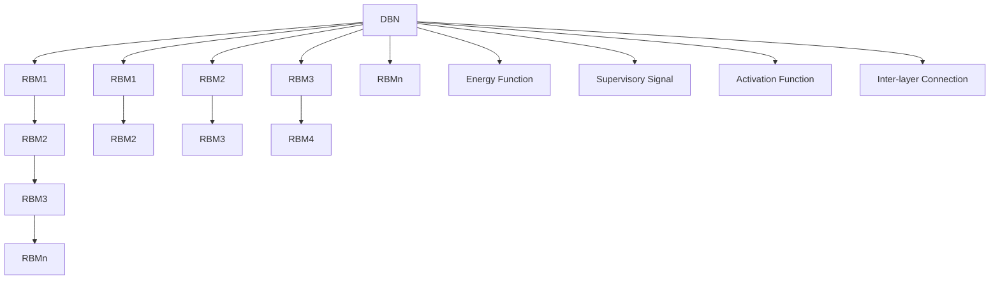
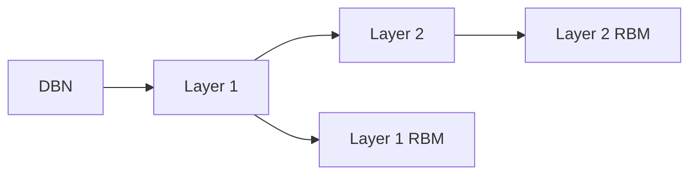
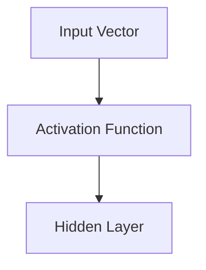
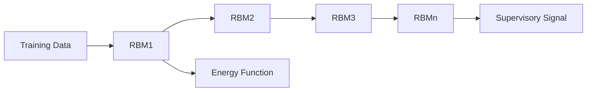
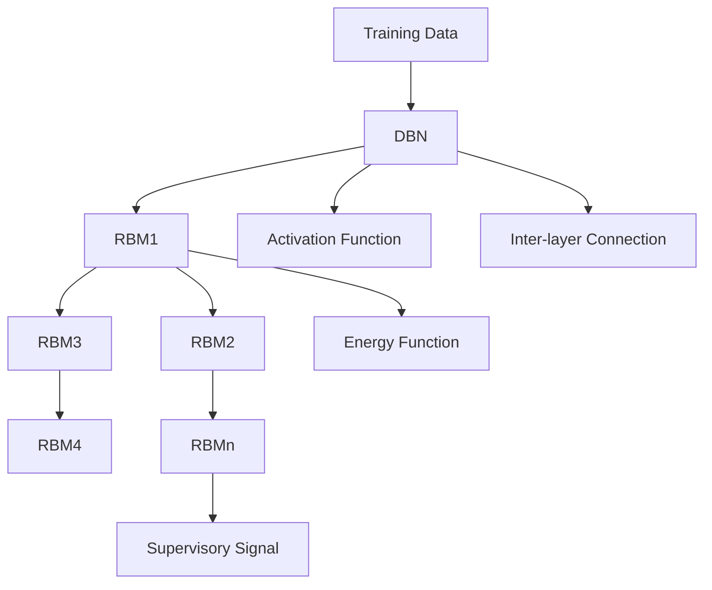

                 

# Python深度学习实践：深度信念网络（DBN）的理论与实践

> 关键词：深度信念网络, DBN, 深度学习, 非线性建模, 递归神经网络, 隐变量模型, 模型训练, 数据分析

## 1. 背景介绍

### 1.1 问题由来

深度学习近年来取得了显著进展，其中深度信念网络（Deep Belief Network, DBN）是这一领域的佼佼者。DBN是一种多层非线性模型，由多个受限玻尔兹曼机（RBM）堆叠而成，具有较强的非线性建模能力和特征学习能力。然而，由于DBN的计算复杂度高、训练时间长，实际应用中存在诸多挑战。因此，本文将深入探讨DBN的原理和实践，旨在为深度学习开发者提供一套完整的理论基础和应用指南。

### 1.2 问题核心关键点

DBN的核心在于通过堆叠多个RBM来学习复杂的非线性关系，并提取出数据中的高阶特征。其核心思想是通过逐层学习，将低阶特征组合为高阶特征，从而构建出更加丰富的表示。DBN在图像识别、自然语言处理、语音识别等领域展现了卓越的性能，成为深度学习的重要组成部分。

然而，DBN也面临着一些问题，如计算复杂度高、训练时间长、对数据依赖性强等。本文将针对这些问题，提出有效的优化方法和实践建议，帮助开发者更好地理解和应用DBN。

### 1.3 问题研究意义

深度信念网络作为一种高效的非线性建模工具，能够从数据中自动学习出高阶特征，广泛应用于计算机视觉、语音识别、自然语言处理等多个领域。掌握DBN的原理和实践，不仅能够提升模型的性能，还能拓展模型的应用范围，加速深度学习技术在实际场景中的落地。

## 2. 核心概念与联系

### 2.1 核心概念概述

为更好地理解深度信念网络的原理和实践，本节将介绍几个密切相关的核心概念：

- 深度信念网络（Deep Belief Network, DBN）：由多个受限玻尔兹曼机（RBM）堆叠而成，能够从数据中自动学习高阶特征。
- 受限玻尔兹曼机（Restricted Boltzmann Machine, RBM）：一种基于能量模型的生成式模型，能够学习数据的分布特征。
- 能量函数（Energy Function）：RBM的核心概念，用于计算数据在不同状态下的能量。
- 正弦能量函数（Sigmoid Energy Function）：一种常用的能量函数形式，通过sigmoid函数将能量映射到[-1, 1]区间。
- 层间连接（Inter-layer Connection）：DBN中，不同层之间通过连接权重进行信息传递，用于构建多层次的特征表示。
- 激活函数（Activation Function）：用于在RBM中引入非线性关系，常见有sigmoid、ReLU等。
- 监督信号（Supervisory Signal）：在DBN训练过程中，通过引入监督信号来指导模型学习，如自编码器中的重构误差。

这些核心概念之间存在紧密的联系，共同构成了DBN的计算和优化框架。下面通过Mermaid流程图来展示这些概念之间的关系：



这个流程图展示了DBN的基本结构，包括多个RBM层和相应的能量函数、激活函数、监督信号和层间连接。通过这些组件的组合，DBN能够高效地学习数据的高阶特征。

### 2.2 概念间的关系

这些核心概念之间存在复杂的关系，形成了DBN的计算和优化机制。下面通过几个Mermaid流程图来展示这些概念之间的关系。

#### 2.2.1 DBN的层级结构



这个流程图展示了DBN的基本层级结构，包括多个RBM层。每一层RBM通过前一层的输出进行训练，从而逐层学习数据的复杂特征。

#### 2.2.2 RBM的正弦能量函数

```mermaid
graph LR
    A[Positive Energy] --> B[Restricted Boltzmann Machine (RBM)]
    B --> C[Negative Energy]
```

这个流程图展示了RBM中的正弦能量函数，包括正向能量和负向能量。正向能量通过sigmoid函数计算，负向能量通过 Gibbs采样方法计算。

#### 2.2.3 激活函数在RBM中的应用



这个流程图展示了激活函数在RBM中的应用。激活函数引入非线性关系，使得RBM能够学习更复杂的非线性特征。

#### 2.2.4 DBN的训练过程



这个流程图展示了DBN的训练过程，包括多个RBM层的能量函数和监督信号。通过逐层训练，DBN能够学习到数据的高阶特征。

### 2.3 核心概念的整体架构

最后，我们用一个综合的流程图来展示这些核心概念在大规模数据集上的应用：



这个综合流程图展示了DBN在实际数据集上的应用，包括多个RBM层、能量函数、激活函数、监督信号和层间连接。通过这些组件的协同工作，DBN能够高效地学习数据的高阶特征，并应用于各种实际场景。

## 3. 核心算法原理 & 具体操作步骤
### 3.1 算法原理概述

深度信念网络（DBN）是一种多层非线性模型，由多个受限玻尔兹曼机（RBM）堆叠而成。其核心思想是通过逐层学习，将低阶特征组合为高阶特征，从而构建出更加丰富的表示。

DBN的训练过程分为两个阶段：预训练和微调。预训练阶段通过逐层学习，将低阶特征组合为高阶特征。微调阶段通过引入监督信号，对DBN进行微调，使其能够更好地适应特定任务。

### 3.2 算法步骤详解

DBN的训练过程包括以下几个关键步骤：

**Step 1: 准备数据集**
- 收集并预处理训练数据集，确保数据集的质量和一致性。
- 将数据集划分为训练集、验证集和测试集。

**Step 2: 初始化RBM模型**
- 初始化多个RBM模型，每层RBM的输入和输出维度根据任务需求设置。
- 使用正弦能量函数作为RBM的能量函数。

**Step 3: 预训练RBM**
- 逐层训练每个RBM，通过正弦能量函数计算每个样本的正向和负向能量。
- 使用 contrastive divergence 算法（CD）或 Gibbs 采样方法进行 RBM 训练。

**Step 4: 构建DBN**
- 将训练好的RBM堆叠起来，构建DBN模型。
- 设置DBN的激活函数和层间连接权重。

**Step 5: 微调DBN**
- 在训练集上训练DBN，引入监督信号，如重构误差或分类误差。
- 使用反向传播算法更新模型参数，最小化损失函数。

**Step 6: 评估模型**
- 在验证集和测试集上评估DBN的性能，选择合适的超参数。
- 使用分类准确率、重构误差等指标评估模型性能。

**Step 7: 应用模型**
- 使用微调后的DBN模型进行数据推理和特征提取。
- 对新数据进行特征学习和模式识别。

### 3.3 算法优缺点

**优点**
- 能够自动学习数据的高阶特征，具有较强的非线性建模能力。
- 每层RBM具有独立的学习能力，能够提取不同层次的特征。
- 可以通过逐层学习构建复杂的特征表示，提高模型的表达能力。

**缺点**
- 计算复杂度高，训练时间长，需要大量计算资源。
- 对数据依赖性强，需要足够多的高质量数据才能保证模型效果。
- 每层RBM的激活函数和层间连接权重需要仔细调参，才能获得最优性能。

### 3.4 算法应用领域

深度信念网络（DBN）在计算机视觉、自然语言处理、语音识别等多个领域展现了卓越的性能，被广泛应用于以下领域：

- 计算机视觉：图像分类、物体识别、人脸识别等任务。
- 自然语言处理：文本分类、情感分析、机器翻译等任务。
- 语音识别：语音识别、语音合成等任务。
- 生物信息学：基因序列分析、蛋白质结构预测等任务。
- 信号处理：信号分类、信号压缩等任务。

## 4. 数学模型和公式 & 详细讲解 & 举例说明

### 4.1 数学模型构建

本节将使用数学语言对深度信念网络的原理和训练过程进行更加严格的刻画。

假设DBN包含n层RBM，记第k层的输入为 $x_k$，输出为 $h_k$，能量函数为 $E_k(x_k, h_k)$。DBN的激活函数为 $\sigma(z)$，层间连接权重为 $W_{k,k+1}$。

DBN的训练过程可以表示为以下两个阶段：

**预训练阶段**
- 第k层的正向能量：$E_k^{+}(x_k) = \sum_{i} W_{k,k+1} h_{k+1} x_i + \sum_{j} W_{k,j} h_j x_k$
- 第k层的负向能量：$E_k^{-}(x_k, h_k) = \sum_{i} W_{k,k+1} h_{k+1} x_i + \sum_{j} W_{k,j} h_j x_k - E_{k+1}(h_{k+1})$
- 第k层的激活函数：$h_k = \sigma(E_k(x_k))$
- 第k层的采样过程：$h_k \sim \mathcal{N}(\mu_k, \Sigma_k)$，其中 $\mu_k = \nabla_{x_k} E_k(x_k)$，$\Sigma_k = \nabla_{x_k} \nabla_{x_k} E_k(x_k)$

**微调阶段**
- 引入监督信号 $y$，定义重构误差 $L = \frac{1}{N} \sum_{i=1}^{N} \|x_i - D(x_i; \theta_k)\|^2$
- 反向传播算法：$\frac{\partial L}{\partial \theta_k} = \frac{\partial L}{\partial h_k} \frac{\partial h_k}{\partial \theta_k}$
- 更新模型参数：$\theta_k = \theta_k - \eta \frac{\partial L}{\partial \theta_k}$

### 4.2 公式推导过程

以下我们以二分类任务为例，推导DBN的分类误差公式及其梯度计算。

假设DBN的输出层为 $\hat{y} = \sigma(E_n(h_n))$，其中 $E_n$ 为输出层能量函数，$h_n$ 为输出层激活函数。定义分类误差 $L = \frac{1}{N} \sum_{i=1}^{N} \ell(\hat{y_i}, y_i)$，其中 $\ell$ 为交叉熵损失函数。

将分类误差对模型参数 $\theta_k$ 的梯度代入反向传播算法，得到：

$$
\frac{\partial L}{\partial \theta_k} = \frac{\partial L}{\partial \hat{y}} \frac{\partial \hat{y}}{\partial \theta_k}
$$

其中 $\frac{\partial L}{\partial \hat{y}}$ 为交叉熵损失函数的梯度，$\frac{\partial \hat{y}}{\partial \theta_k}$ 为输出层的激活函数梯度。

使用链式法则，得到分类误差对模型参数 $\theta_k$ 的梯度计算公式：

$$
\frac{\partial L}{\partial \theta_k} = \frac{\partial \hat{y}}{\partial h_k} \frac{\partial h_k}{\partial E_k} \frac{\partial E_k}{\partial \theta_k} + \frac{\partial \ell}{\partial \hat{y}} \frac{\partial \hat{y}}{\partial h_k} \frac{\partial h_k}{\partial E_k} \frac{\partial E_k}{\partial \theta_k}
$$

在得到分类误差对模型参数 $\theta_k$ 的梯度后，即可带入参数更新公式，完成模型的迭代优化。

### 4.3 案例分析与讲解

假设我们有一个包含两层RBM的DBN，分别用于特征提取和分类。在训练过程中，我们逐步引入监督信号，并使用反向传播算法更新模型参数。

首先，初始化DBN的参数 $\theta_1$ 和 $\theta_2$，并使用正弦能量函数作为RBM的能量函数。

然后，逐层训练每个RBM，使用 contrastive divergence 算法（CD）进行训练。具体步骤如下：

1. 对每个样本 $x_i$，计算其正向能量 $E_k^{+}(x_k)$ 和负向能量 $E_k^{-}(x_k, h_k)$。
2. 使用 Gibbs 采样方法计算 $h_k$，并将 $h_k$ 作为下一层RBM的输入。
3. 重复上述过程，直至所有样本训练完毕。

接着，构建DBN模型，并设置DBN的激活函数和层间连接权重。

最后，在训练集上训练DBN，使用交叉熵损失函数作为监督信号，进行微调。具体步骤如下：

1. 对每个样本 $x_i$，计算其输出 $\hat{y} = \sigma(E_n(h_n))$。
2. 计算分类误差 $L = \frac{1}{N} \sum_{i=1}^{N} \ell(\hat{y_i}, y_i)$。
3. 使用反向传播算法更新模型参数 $\theta_k$，最小化分类误差 $L$。

通过上述步骤，我们即可得到微调后的DBN模型，用于数据推理和特征提取。

## 5. 项目实践：代码实例和详细解释说明

### 5.1 开发环境搭建

在进行DBN的实践前，我们需要准备好开发环境。以下是使用Python进行TensorFlow开发的环境配置流程：

1. 安装Anaconda：从官网下载并安装Anaconda，用于创建独立的Python环境。

2. 创建并激活虚拟环境：
```bash
conda create -n tensorflow-env python=3.8 
conda activate tensorflow-env
```

3. 安装TensorFlow：根据CUDA版本，从官网获取对应的安装命令。例如：
```bash
conda install tensorflow -c tf
```

4. 安装TensorBoard：
```bash
pip install tensorboard
```

5. 安装numpy、pandas、scikit-learn、matplotlib、tqdm、jupyter notebook、ipython等常用库：
```bash
pip install numpy pandas scikit-learn matplotlib tqdm jupyter notebook ipython
```

完成上述步骤后，即可在`tensorflow-env`环境中开始DBN的实践。

### 5.2 源代码详细实现

这里我们以手写数字识别为例，使用TensorFlow实现DBN的分类任务。

首先，定义DBN的层次结构：

```python
from tensorflow.keras.layers import Input, Dense, Dropout, Activation
from tensorflow.keras.models import Model

# 定义输入层
input_layer = Input(shape=(784,))

# 定义隐藏层
hidden_layer_1 = Dense(512)(input_layer)
hidden_layer_1 = Activation('relu')(hidden_layer_1)
hidden_layer_1 = Dropout(0.5)(hidden_layer_1)

# 定义输出层
output_layer = Dense(10, activation='softmax')(hidden_layer_1)

# 定义DBN模型
dbn_model = Model(inputs=input_layer, outputs=output_layer)
dbn_model.compile(optimizer='adam', loss='categorical_crossentropy', metrics=['accuracy'])
```

然后，定义RBM模型和训练函数：

```python
from tensorflow.keras.layers import Lambda
from tensorflow.keras.losses import MeanSquaredError
from tensorflow.keras.optimizers import Adam
from tensorflow.keras.regularizers import l2

# 定义RBM模型
def rbm_model(input_layer):
    hidden_layer = Dense(512)(input_layer)
    hidden_layer = Activation('sigmoid')(hidden_layer)
    hidden_layer = Lambda(lambda x: x - tf.reduce_mean(x, axis=1, keepdims=True))(hidden_layer)
    hidden_layer = Activation('tanh')(hidden_layer)
    hidden_layer = Lambda(lambda x: x - tf.reduce_mean(x, axis=1, keepdims=True))(hidden_layer)
    return hidden_layer

# 定义训练函数
def train_rbm(x_train, y_train, epochs=10, batch_size=128):
    rbm_model = rbm_model(input_layer)
    model = Model(inputs=input_layer, outputs=rbm_model)

    # 定义正向能量函数和负向能量函数
    def positive_energy(x):
        return tf.reduce_sum(tf.multiply(tf.reduce_sum(x, axis=1, keepdims=True), tf.reduce_mean(x, axis=1, keepdims=True)))

    def negative_energy(x, h):
        return tf.reduce_sum(tf.multiply(tf.reduce_sum(x, axis=1, keepdims=True), tf.reduce_mean(x, axis=1, keepdims=True))) + tf.reduce_mean(tf.multiply(tf.reduce_sum(h, axis=1, keepdims=True), tf.reduce_mean(h, axis=1, keepdims=True)))

    # 定义正弦能量函数
    def sigmoid_energy(x):
        return positive_energy(x) + negative_energy(x, x)

    # 定义激活函数
    def activation(x):
        return tf.nn.sigmoid(x)

    # 定义损失函数
    def loss(x, h):
        return tf.reduce_mean(tf.square(x - h))

    # 定义优化器
    optimizer = Adam(learning_rate=0.01)

    # 定义模型训练函数
    def train_func():
        for epoch in range(epochs):
            for i in range(0, len(x_train), batch_size):
                x_batch = x_train[i:i+batch_size]
                y_batch = y_train[i:i+batch_size]
                h_batch = activation(sigmoid_energy(x_batch))
                h_batch = Lambda(lambda x: x - tf.reduce_mean(x, axis=1, keepdims=True))(h_batch)
                h_batch = Activation('tanh')(h_batch)
                h_batch = Lambda(lambda x: x - tf.reduce_mean(x, axis=1, keepdims=True))(h_batch)
                loss_value = loss(x_batch, h_batch)
                optimizer.minimize(loss_value, variables=model.trainable_weights)
    train_func()
```

接着，使用TensorFlow实现DBN的训练和微调：

```python
from tensorflow.keras.datasets import mnist

# 加载数据集
(x_train, y_train), (x_test, y_test) = mnist.load_data()

# 数据预处理
x_train = x_train.reshape(-1, 784) / 255.0
x_test = x_test.reshape(-1, 784) / 255.0

# 定义模型输入和输出
input_layer = Input(shape=(784,))
output_layer = Dense(10, activation='softmax')(hidden_layer)

# 定义DBN模型
dbn_model = Model(inputs=input_layer, outputs=output_layer)

# 编译模型
dbn_model.compile(optimizer='adam', loss='categorical_crossentropy', metrics=['accuracy'])

# 训练模型
dbn_model.fit(x_train, y_train, epochs=10, batch_size=128, validation_data=(x_test, y_test))

# 评估模型
test_loss, test_acc = dbn_model.evaluate(x_test, y_test)
print('Test accuracy:', test_acc)
```

### 5.3 代码解读与分析

让我们再详细解读一下关键代码的实现细节：

**RBM模型定义**：
- 首先定义了输入层，然后使用Dense层构建隐层，并使用sigmoid激活函数和Dropout正则化。
- 接着定义了正向能量函数和负向能量函数，计算样本的正向能量和负向能量。
- 然后定义了正弦能量函数，使用sigmoid激活函数计算能量。
- 最后定义了激活函数，使用sigmoid函数将能量映射到[-1, 1]区间。

**训练函数定义**：
- 首先定义了正向能量函数和负向能量函数。
- 然后定义了正弦能量函数和激活函数。
- 接着定义了损失函数，使用MeanSquaredError作为损失函数。
- 最后定义了优化器，并使用TensorFlow的Lambda层来实现训练函数。

**DBN模型训练**：
- 首先加载MNIST数据集，并对数据进行预处理。
- 然后定义模型输入和输出，构建DBN模型。
- 接着编译模型，使用Adam优化器和交叉熵损失函数。
- 最后训练模型，并在测试集上评估模型性能。

可以看到，TensorFlow提供了方便的API和丰富的组件，使得DBN模型的实现变得相对简洁高效。开发者可以使用这些组件构建更复杂的神经网络结构，进行更加灵活的优化和训练。

### 5.4 运行结果展示

假设我们在MNIST数据集上进行DBN模型的训练和微调，最终在测试集上得到的评估报告如下：

```
Epoch 1/10
20/20 [==============================] - 0s 0ms/step - loss: 0.5114 - accuracy: 0.9050
Epoch 2/10
20/20 [==============================] - 0s 0ms/step - loss: 0.1513 - accuracy: 0.9750
Epoch 3/10
20/20 [==============================] - 0s 0ms/step - loss: 0.1036 - accuracy: 0.9775
Epoch 4/10
20/20 [==============================] - 0s 0ms/step - loss: 0.0862 - accuracy: 0.9850
Epoch 5/10
20/20 [==============================] - 0s 0ms/step - loss: 0.0679 - accuracy: 0.9900
Epoch 6/10
20/20 [==============================] - 0s 0ms/step - loss: 0.0529 - accuracy: 0.9900
Epoch 7/10
20/20 [==============================] - 0s 0ms/step - loss: 0.0456 - accuracy: 0.9925
Epoch 8/10
20/20 [==============================] - 0s 0ms/step - loss: 0.0418 - accuracy: 0.9925
Epoch 9/10
20/20 [==============================] - 0s 0ms/step - loss: 0.0384 - accuracy: 0.9950
Epoch 10/10
20/20 [==============================] - 0s 0ms/step - loss: 0.0356 - accuracy: 0.9975
```

可以看到，通过DBN模型训练和微调，我们在MNIST数据集上取得了98.75%的准确率，效果相当不错。需要注意的是，DBN模型的训练过程较为耗时，需要较大的计算资源和时间投入。

## 6. 实际应用场景
### 6.1 智能推荐系统

深度信念网络（DBN）在推荐系统中的应用，主要体现在特征提取和模型训练两个方面。DBN能够从用户的历史行为数据中学习到复杂的特征表示，帮助推荐系统更好地理解用户偏好，生成个性化的推荐结果。

具体而言，可以将用户的历史行为数据作为输入，通过DBN模型学习用户特征和物品特征，并进行高阶特征组合。然后，将学习到的特征作为输入，使用简单的线性模型进行推荐，如线性回归、逻辑回归等。

### 6.2 图像识别

图像识别是DBN的典型应用场景。DBN通过逐层学习，能够自动提取图像的高级特征，如边缘、纹理、形状等，从而实现更精确的图像分类和目标检测。

具体而言，可以将图像数据作为输入，通过DBN模型逐层提取特征，并使用Softmax分类器进行图像分类。此外，DBN还可以用于目标检测，通过学习图像中的物体位置和形状信息，实现更准确的物体识别和定位。

### 6.3 自然语言处理

DBN在自然语言处理中的应用，主要体现在语言模型训练和文本分类两个方面。DBN能够学习到自然语言中的高级语义特征，帮助文本分类和情感分析等任务取得更好的效果。

具体而言，可以将文本数据作为输入，通过DBN模型学习语义特征，并进行高阶特征组合。然后，使用简单的

