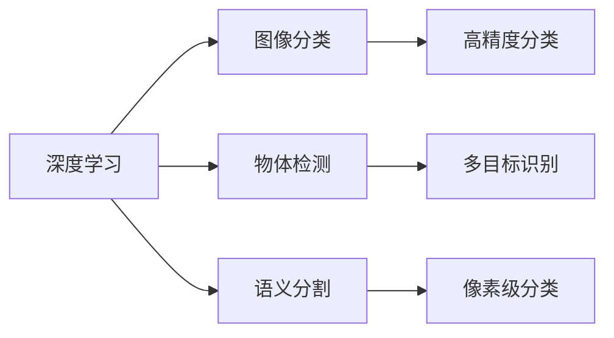
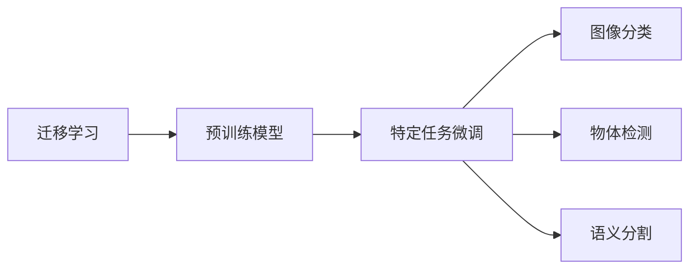

                 

# Python深度学习实践：深度学习与计算机视觉的结合

> 关键词：深度学习,计算机视觉,Python,图像处理,卷积神经网络,迁移学习,应用案例

## 1. 背景介绍

### 1.1 问题由来
近年来，深度学习技术在计算机视觉领域的迅猛发展，极大地推动了图像识别、物体检测、语义分割等视觉任务的进步。Python作为深度学习的主流编程语言，凭借其易用性、丰富的第三方库以及强大的社区支持，成为深度学习开发的首选平台。

深度学习与计算机视觉的结合，不仅提升了图像处理和识别的精度，还拓展了计算机视觉的应用场景，如自动驾驶、医疗影像分析、视频内容理解等。本文将从理论到实践，深入探讨深度学习在计算机视觉中的应用，并通过Python编程语言实现多个经典案例，帮助读者掌握深度学习与计算机视觉结合的技术和实践方法。

### 1.2 问题核心关键点
深度学习与计算机视觉结合的核心在于利用深度神经网络强大的特征学习能力，对图像数据进行自动化的特征提取和模式识别。常用的深度神经网络包括卷积神经网络（Convolutional Neural Networks, CNNs）、循环神经网络（Recurrent Neural Networks, RNNs）、生成对抗网络（Generative Adversarial Networks, GANs）等。其中，卷积神经网络以其在图像处理任务上的出色表现，成为深度学习在计算机视觉中应用最广泛的技术。

本文重点介绍卷积神经网络（CNNs）在图像处理中的应用，包括但不限于图像分类、物体检测、语义分割等任务。同时，还涵盖了基于迁移学习的计算机视觉应用，以及利用Python实现深度学习模型的常见流程和技术要点。

### 1.3 问题研究意义
深度学习与计算机视觉的结合，不仅推动了视觉技术的发展，还为诸多行业带来了革命性的变革。例如：

- 自动驾驶：通过深度学习模型实现图像和视频内容的理解，辅助汽车进行自动驾驶决策。
- 医疗影像分析：利用深度学习模型自动识别和标注医学影像中的病变区域，提升疾病诊断的准确率。
- 视频内容理解：通过深度学习模型提取和分析视频帧中的关键信息，用于视频内容生成、摘要、搜索等应用。

本文旨在通过深入的理论分析与实践案例，帮助读者理解深度学习与计算机视觉结合的精髓，掌握Python在深度学习项目中的应用，为从事计算机视觉研发的工程师和研究人员提供参考。

## 2. 核心概念与联系

### 2.1 核心概念概述

为更好地理解深度学习在计算机视觉中的应用，本节将介绍几个密切相关的核心概念：

- 深度学习（Deep Learning）：指通过构建深层神经网络模型，对输入数据进行自动化的特征学习，从而实现对复杂模式和关系的识别和分类。
- 卷积神经网络（Convolutional Neural Networks, CNNs）：一种专用于图像处理的深度神经网络，通过卷积、池化等操作，提取图像的局部特征，实现图像分类、物体检测等任务。
- 迁移学习（Transfer Learning）：指将在大规模数据集上预训练的模型，迁移到特定任务上进行微调，以减少训练时间和标注成本。
- 图像处理（Image Processing）：指对图像数据进行一系列操作，如滤波、分割、增强等，以改善图像质量或提取有用的信息。
- 目标检测（Object Detection）：指识别图像中不同类别的对象，并标出它们的位置，如YOLO、Faster R-CNN等方法。
- 语义分割（Semantic Segmentation）：指将图像中的每个像素分配到特定的类别中，如FCN、U-Net等方法。

这些核心概念之间的逻辑关系可以通过以下Mermaid流程图来展示：

```mermaid
graph TB
    A[深度学习] --> B[卷积神经网络(CNNs)]
    B --> C[图像处理]
    B --> D[目标检测]
    B --> E[语义分割]
    C --> F[滤波]
    C --> G[分割]
    C --> H[增强]
    D --> I[对象识别]
    D --> J[边界框]
    E --> K[像素分类]
    E --> L[区域聚合]
    A --> M[迁移学习]
    M --> B
    B --> N[微调]
    N --> O[图像分类]
    N --> P[物体检测]
    N --> Q[语义分割]
```

这个流程图展示了深度学习与计算机视觉结合的主要概念及其之间的关系：

1. 深度学习通过构建神经网络模型，实现对图像特征的自动学习。
2. 卷积神经网络（CNNs）是深度学习在图像处理中最常用的模型，通过卷积和池化操作提取局部特征。
3. 图像处理包含一系列预处理操作，如滤波、分割、增强等，提升图像质量或提取特征。
4. 目标检测识别并标出图像中的对象，而语义分割将每个像素分配到特定类别中。
5. 迁移学习利用预训练模型，减少特定任务上的训练成本。
6. 微调是指将预训练模型迁移到特定任务上进行优化。

### 2.2 概念间的关系

这些核心概念之间存在着紧密的联系，形成了深度学习在计算机视觉中的完整应用框架。下面我通过几个Mermaid流程图来展示这些概念之间的关系。

#### 2.2.1 深度学习与计算机视觉的应用链



这个流程图展示了深度学习在计算机视觉中的应用链：

1. 深度学习通过构建神经网络，实现图像分类、物体检测、语义分割等任务。
2. 图像分类、物体检测和语义分割分别对应高精度分类、多目标识别和像素级分类。

#### 2.2.2 迁移学习与微调的关系



这个流程图展示了迁移学习与微调的基本过程：

1. 迁移学习通过在大规模数据集上预训练模型，减少特定任务上的训练成本。
2. 微调是指将预训练模型迁移到特定任务上进行优化。
3. 微调后的模型可以用于图像分类、物体检测、语义分割等任务。

#### 2.2.3 卷积神经网络(CNNs)与迁移学习的关系

```mermaid
graph TB
    A[卷积神经网络(CNNs)] --> B[迁移学习]
    B --> C[预训练模型]
    C --> D[微调]
    D --> E[特定任务]
```

这个流程图展示了卷积神经网络与迁移学习的关系：

1. 卷积神经网络是深度学习在图像处理中最常用的模型。
2. 迁移学习通过在大规模数据集上预训练卷积神经网络，减少特定任务上的训练成本。
3. 微调是指将预训练的卷积神经网络迁移到特定任务上进行优化。

### 2.3 核心概念的整体架构

最后，我们用一个综合的流程图来展示这些核心概念在大语言模型微调过程中的整体架构：

```mermaid
graph TB
    A[大规模图像数据] --> B[深度学习]
    B --> C[卷积神经网络(CNNs)]
    C --> D[图像处理]
    C --> E[目标检测]
    C --> F[语义分割]
    A --> G[迁移学习]
    G --> C
    G --> H[微调]
    H --> I[特定任务]
```

这个综合流程图展示了从预训练到微调，再到特定任务应用的过程：

1. 深度学习通过构建神经网络模型，对大规模图像数据进行自动化的特征学习。
2. 卷积神经网络（CNNs）是深度学习在图像处理中最常用的模型。
3. 图像处理包含一系列预处理操作，如滤波、分割、增强等，提升图像质量或提取特征。
4. 目标检测和语义分割分别对应图像中的对象识别和像素级分类。
5. 迁移学习利用预训练模型，减少特定任务上的训练成本。
6. 微调是指将预训练模型迁移到特定任务上进行优化。
7. 微调后的模型可以用于各种图像处理任务。

通过这些流程图，我们可以更清晰地理解深度学习与计算机视觉结合的核心概念及其关系，为后续深入讨论具体的深度学习应用提供基础。

## 3. 核心算法原理 & 具体操作步骤
### 3.1 算法原理概述

深度学习在计算机视觉中的应用，主要基于卷积神经网络（CNNs）的强大特征学习能力。CNNs通过卷积、池化、非线性激活等操作，自动从图像数据中提取高级特征，并进行模式识别和分类。以下是对CNNs在图像处理任务中的基本原理概述：

1. 卷积层（Convolutional Layer）：通过滑动卷积核对输入图像进行卷积操作，提取局部特征。卷积核的参数需要在大规模数据集上预训练。
2. 池化层（Pooling Layer）：对卷积层的输出进行下采样，减小特征图的尺寸，提高计算效率。常用的池化操作包括最大池化、平均池化等。
3. 全连接层（Fully Connected Layer）：将池化层的输出展开成向量，进行分类或回归。
4. 激活函数（Activation Function）：如ReLU、Sigmoid、Tanh等，引入非线性因素，增强模型的表达能力。
5. Dropout：在训练过程中随机丢弃部分神经元，防止过拟合。
6. Batch Normalization：对每一批次的数据进行标准化，加速模型收敛。
7. 优化算法（Optimization Algorithm）：如SGD、Adam等，通过梯度下降等方法更新模型参数。

### 3.2 算法步骤详解

以下是对深度学习在计算机视觉中应用的详细操作步骤：

**Step 1: 准备数据集**
- 收集并标注大规模图像数据集，如CIFAR-10、ImageNet等。
- 将数据集分为训练集、验证集和测试集，保持各集之间数据分布的一致性。

**Step 2: 设计模型架构**
- 选择适合的卷积神经网络（CNNs）架构，如LeNet、AlexNet、VGGNet、ResNet、InceptionNet等。
- 确定网络层数、每层的卷积核大小、步长、池化大小、激活函数等。
- 设计合适的损失函数，如交叉熵损失、均方误差损失等。

**Step 3: 训练模型**
- 使用GPU或TPU等高性能计算设备，加速模型训练。
- 选择合适的优化器及其参数，如Adam、SGD等。
- 设置合适的学习率、批大小、迭代轮数等超参数。
- 使用Dropout、Batch Normalization等技术，防止过拟合。
- 在验证集上监测模型性能，避免过拟合。
- 当模型性能达到预期时，保存模型权重，进行下一步。

**Step 4: 评估模型**
- 使用测试集对模型进行评估，计算准确率、召回率、F1分数等指标。
- 对比模型在不同任务上的表现，找出优势和不足。
- 根据评估结果，调整模型架构或超参数，进行进一步训练。

**Step 5: 模型应用**
- 将训练好的模型应用到特定任务上，如图像分类、物体检测、语义分割等。
- 根据应用场景，选择合适的任务适配层，如分类头、边界框回归头等。
- 使用微调技术，进一步优化模型性能。

### 3.3 算法优缺点

深度学习在计算机视觉中的应用，具有以下优点：

1. 自动特征学习：深度学习模型能够自动学习图像中的高级特征，无需手动设计特征提取器。
2. 高精度：通过多层卷积和池化操作，深度学习模型能够从图像中提取出复杂的模式和关系，提升分类和检测的精度。
3. 可扩展性：卷积神经网络（CNNs）结构简单，可扩展性强，适用于各种计算机视觉任务。
4. 迁移学习：通过在大规模数据集上预训练模型，能够降低特定任务上的训练成本，加速模型开发。

同时，该方法也存在以下缺点：

1. 计算资源消耗大：深度学习模型通常需要大量的计算资源，如GPU、TPU等。
2. 训练时间较长：深度学习模型需要大量的训练数据和计算时间，训练过程较为耗时。
3. 模型可解释性不足：深度学习模型通常被称为"黑盒"系统，难以解释其内部工作机制和决策逻辑。
4. 过拟合风险高：深度学习模型容易过拟合，尤其是数据量较小的情况下。

尽管存在这些局限性，但深度学习在计算机视觉中的应用已经取得了显著的成果，成为了计算机视觉研究的主流方向。未来相关研究的重点在于如何进一步优化模型架构、降低计算资源消耗、提高模型可解释性和鲁棒性。

### 3.4 算法应用领域

深度学习在计算机视觉中的应用已经覆盖了多个领域，如：

- 图像分类：将图像分为不同类别，如CIFAR-10、ImageNet等。
- 物体检测：识别图像中不同类别的对象，并标出它们的位置，如YOLO、Faster R-CNN等。
- 语义分割：将图像中的每个像素分配到特定的类别中，如FCN、U-Net等。
- 目标跟踪：在视频序列中跟踪目标对象的位置，如光流法、深度学习法等。
- 图像生成：生成逼真、多样化的图像，如GANs、VAEs等。
- 图像修复：修复损坏、缺失的图像，如图像去噪、超分辨率等。

除了上述这些经典任务外，深度学习在计算机视觉中的应用还在不断拓展，如医学影像分析、自动驾驶、视频内容理解等，为计算机视觉技术的发展提供了新的方向。

## 4. 数学模型和公式 & 详细讲解 & 举例说明

### 4.1 数学模型构建

在深度学习中，数学模型通常用于描述神经网络的结构和训练过程。以下是一个典型的卷积神经网络（CNNs）的数学模型，用于图像分类任务：

**输入**：$x$，表示输入图像的像素值，$n_{in}$ 表示输入通道数。

**卷积层**：使用 $n_{in}$ 个大小为 $n_{f}$ 的卷积核，对输入图像进行卷积操作，得到 $n_{f}$ 个特征图 $h$。

$$
h = \sigma(\sum_{i=1}^{n_{f}} w_i \ast x + b_i)
$$

其中，$\sigma$ 表示激活函数，$w_i$ 和 $b_i$ 表示第 $i$ 个卷积核的权重和偏置。

**池化层**：对特征图 $h$ 进行池化操作，减小特征图的尺寸，提高计算效率。常用的池化操作包括最大池化和平均池化。

$$
p = \frac{1}{k} \sum_{i=1}^{k} h_{i,i}
$$

其中，$k$ 表示池化窗口的大小。

**全连接层**：将池化层的输出展开成向量，进行分类或回归。

$$
y = W \cdot p + b
$$

其中，$W$ 和 $b$ 表示全连接层的权重和偏置。

**损失函数**：常用的损失函数包括交叉熵损失、均方误差损失等。

$$
L(y, y') = -\frac{1}{N} \sum_{i=1}^{N} \sum_{j=1}^{C} y_i^{(j)} \log y'_i^{(j)}
$$

其中，$y$ 表示模型的预测输出，$y'$ 表示真实标签，$C$ 表示类别数。

### 4.2 公式推导过程

下面以图像分类任务为例，详细推导卷积神经网络（CNNs）的基本公式。

**卷积层公式推导**：

$$
h_{i,j} = \sum_{k=0}^{n_{f}-1} \sum_{i'=0}^{k-1} w_k \cdot x_{i'-i, j-k+1}
$$

其中，$x_{i'-i, j-k+1}$ 表示输入图像在位置 $(i', j')$ 的像素值，$w_k$ 表示第 $k$ 个卷积核。

**池化层公式推导**：

$$
p_{i,j} = \frac{1}{k^2} \sum_{m=0}^{k-1} \sum_{n=0}^{k-1} h_{i+m, j+n}
$$

其中，$h_{i+m, j+n}$ 表示特征图在位置 $(i', j')$ 的值。

**全连接层公式推导**：

$$
y = W \cdot p + b
$$

其中，$W$ 和 $b$ 表示全连接层的权重和偏置。

**损失函数公式推导**：

$$
L(y, y') = -\frac{1}{N} \sum_{i=1}^{N} \sum_{j=1}^{C} y_i^{(j)} \log y'_i^{(j)}
$$

其中，$y$ 表示模型的预测输出，$y'$ 表示真实标签，$C$ 表示类别数。

### 4.3 案例分析与讲解

下面以图像分类任务为例，展示卷积神经网络（CNNs）在实际应用中的具体实现。

**案例一：CIFAR-10分类**

CIFAR-10是一个包含10个类别的图像分类任务，共6万张32x32的彩色图像。以下是使用PyTorch实现CIFAR-10分类的示例代码：

```python
import torch
import torch.nn as nn
import torchvision.transforms as transforms
import torchvision.datasets as datasets
import torchvision.models as models

# 数据预处理
transform = transforms.Compose([
    transforms.Resize(32),
    transforms.ToTensor(),
    transforms.Normalize(mean=[0.5, 0.5, 0.5], std=[0.5, 0.5, 0.5])
])

# 加载CIFAR-10数据集
trainset = datasets.CIFAR10(root='./data', train=True, download=True, transform=transform)
trainloader = torch.utils.data.DataLoader(trainset, batch_size=64, shuffle=True)

testset = datasets.CIFAR10(root='./data', train=False, download=True, transform=transform)
testloader = torch.utils.data.DataLoader(testset, batch_size=64, shuffle=False)

# 定义模型架构
model = models.resnet18()

# 定义损失函数和优化器
criterion = nn.CrossEntropyLoss()
optimizer = torch.optim.Adam(model.parameters(), lr=0.001)

# 训练模型
for epoch in range(10):
    running_loss = 0.0
    for i, data in enumerate(trainloader, 0):
        inputs, labels = data
        optimizer.zero_grad()
        outputs = model(inputs)
        loss = criterion(outputs, labels)
        loss.backward()
        optimizer.step()
        running_loss += loss.item()
    print(f'Epoch {epoch+1}, Loss: {running_loss/len(trainloader):.4f}')

# 评估模型
correct = 0
total = 0
with torch.no_grad():
    for data in testloader:
        inputs, labels = data
        outputs = model(inputs)
        _, predicted = torch.max(outputs.data, 1)
        total += labels.size(0)
        correct += (predicted == labels).sum().item()

print(f'Accuracy: {100 * correct / total:.2f}%')
```

**案例二：ImageNet分类**

ImageNet是一个包含1000个类别的图像分类任务，共1.2万张图像。以下是使用PyTorch实现ImageNet分类的示例代码：

```python
import torch
import torch.nn as nn
import torchvision.transforms as transforms
import torchvision.datasets as datasets
import torchvision.models as models

# 数据预处理
transform = transforms.Compose([
    transforms.Resize(256),
    transforms.CenterCrop(224),
    transforms.ToTensor(),
    transforms.Normalize(mean=[0.485, 0.456, 0.406], std=[0.229, 0.224, 0.225])
])

# 加载ImageNet数据集
trainset = datasets.ImageFolder(root='./data/train', transform=transform)
trainloader = torch.utils.data.DataLoader(trainset, batch_size=64, shuffle=True)

testset = datasets.ImageFolder(root='./data/test', transform=transform)
testloader = torch.utils.data.DataLoader(testset, batch_size=64, shuffle=False)

# 定义模型架构
model = models.resnet18()

# 定义损失函数和优化器
criterion = nn.CrossEntropyLoss()
optimizer = torch.optim.Adam(model.parameters(), lr=0.001)

# 训练模型
for epoch in range(10):
    running_loss = 0.0
    for i, data in enumerate(trainloader, 0):
        inputs, labels = data
        optimizer.zero_grad()
        outputs = model(inputs)
        loss = criterion(outputs, labels)
        loss.backward()
        optimizer.step()
        running_loss += loss.item()
    print(f'Epoch {epoch+1}, Loss: {running_loss/len(trainloader):.4f}')

# 评估模型
correct = 0
total = 0
with torch.no_grad():
    for data in testloader:
        inputs, labels = data
        outputs = model(inputs)
        _, predicted = torch.max(outputs.data, 1)
        total += labels.size(0)
        correct += (predicted == labels).sum().item()

print(f'Accuracy: {100 * correct / total:.2f}%')
```

以上两个案例展示了卷积神经网络（CNNs）在图像分类任务中的基本实现方法，包括数据预处理、模型定义、损失函数和优化器配置、训练和评估等步骤。通过这些代码示例，读者可以快速上手卷积神经网络（CNNs）在图像分类任务中的应用。

## 5. 项目实践：代码实例和详细解释说明
### 5.1 开发环境搭建

在进行深度学习项目实践前，我们需要准备好开发环境。以下是使用Python进行PyTorch开发的环境配置流程：

1. 安装Anaconda：从官网下载并安装Anaconda，用于创建独立的Python环境。

2. 创建并激活虚拟环境：
```bash
conda create -n pytorch-env python=3.8 
conda activate pytorch-env
```

3. 安装PyTorch：根据CUDA版本，从官网获取对应的安装命令。例如：
```bash
conda install pytorch torchvision torchaudio cudatoolkit=11.1 -c pytorch -c conda-forge
```

4. 安装Tensorboard：
```bash
pip install tensorboard
```

5. 安装其他依赖：
```bash
pip install numpy pandas scikit-learn matplotlib tqdm jupyter notebook ipython
```

完成上述步骤后，即可在`pytorch-env`环境中开始深度学习项目开发。

### 5.2 源代码详细实现

下面我们以图像分类任务为例，给出使用PyTorch对卷积神经网络（CNNs）进行训练的PyTorch代码实现。

**步骤1：数据准备**
- 加载CIFAR-10数据集：
```python
import torch
import torch.nn as nn
import torchvision.transforms as transforms
import torchvision.datasets as datasets

transform = transforms.Compose([
    transforms.Resize(32),
    transforms.ToTensor(),
    transforms.Normalize(mean=[0.5, 0.5, 0.5], std=[0.5, 0.5, 0.5])
])

trainset = datasets.CIFAR10(root='./data', train=True, download=True, transform=transform)
trainloader = torch.utils.data.DataLoader(trainset, batch_size=64, shuffle=True)

testset = datasets.CIFAR10(root='./data', train=False, download=True, transform=transform)
testloader = torch.utils.data.DataLoader(testset, batch_size=64, shuffle=False)
```

**步骤2：模型定义**
- 定义卷积神经网络（CNNs）：
```python
class CNN(nn.Module):
    def __init__(self):
        super(CNN, self).__init__()
        self.conv1 = nn.Conv2d(3, 64, kernel_size=3, padding=1)
        self.conv2 = nn.Conv2d(64, 128, kernel_size=3, padding=1)
        self.pool = nn.MaxPool2d(kernel_size=2, stride=2)
        self.fc1 = nn.Linear(128*8*8, 256)
        self.fc2 = nn.Linear(256, 10)
        self.dropout = nn.Dropout(0.5)
    
    def forward(self, x):
        x = self.pool(torch.relu(self.conv1(x)))
        x = self.pool(torch.relu(self.conv2(x)))
        x = x.view(-1, 128*8*8)
        x = torch.relu(self.fc1(x))
        x = self.dropout(x)
        x = self.fc2(x)
        return x
```

**步骤3：模型训练**
- 定义损失函数和优化器：
```python
criterion = nn.CrossEntropyLoss()
optimizer = torch.optim.Adam(model.parameters(), lr=0.001)
```

**步骤4：训练循环**
- 训练模型：
```python
for epoch in range(10):
    running_loss = 0.0
    for

