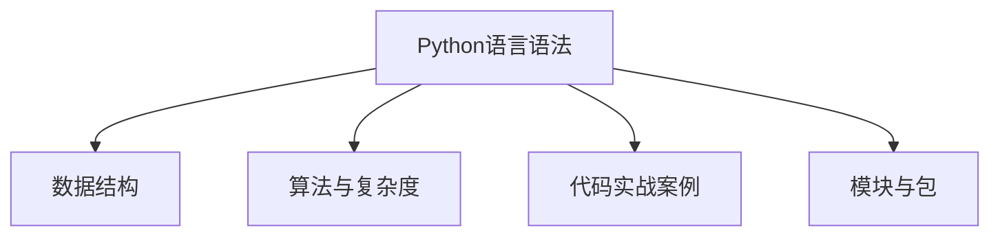

                 

# Python语言基础原理与代码实战案例讲解

> 关键词：Python基础, 语言语法, 数据结构, 算法与复杂度, 代码实战案例, 模块与包, 项目开发环境

## 1. 背景介绍

### 1.1 问题由来
Python作为一门高级编程语言，以其简洁易读、功能丰富、可扩展性强等优点，广泛应用于数据科学、人工智能、Web开发、网络爬虫、自动化运维等多个领域。掌握Python基础原理和代码实战技巧，对于希望深入学习Python并应用于实际项目中的开发者而言至关重要。

### 1.2 问题核心关键点
Python基础包括语言语法、数据结构、算法与复杂度分析等关键概念。其中，语言语法是最基础的部分，数据结构是编程的基础工具，算法与复杂度分析则是提升编程效率和解决问题的关键。通过实际项目中的代码案例讲解，可以更好地理解Python的实际应用，从而快速提升编程能力和项目开发效率。

### 1.3 问题研究意义
掌握Python基础原理和代码实战技巧，可以帮助开发者更好地理解和使用Python，提高开发效率和代码质量。同时，能够帮助开发者在实际项目中灵活运用Python进行开发，解决实际问题。此外，掌握Python基础，还可以更好地理解Python生态系统和各类模块包，加速项目开发。

## 2. 核心概念与联系

### 2.1 核心概念概述

为更好地理解Python语言基础和代码实战，本节将介绍几个关键概念：

- Python语言语法：Python是一门动态类型、解释型的高级编程语言。语法简洁，使用缩进来表示代码块，支持函数、类、模块等常见编程结构。
- 数据结构：Python提供了一系列内置的数据结构，如列表、元组、集合、字典等，用于存储和操作数据。
- 算法与复杂度：算法是解决问题的基本方法，复杂度分析用于评估算法的效率。Python中常见的算法包括排序、搜索、图算法等，复杂度分析关注算法的时间复杂度和空间复杂度。
- 代码实战案例：通过实际项目中的代码案例讲解，深入理解Python的应用场景和编程技巧。
- 模块与包：Python通过模块和包机制实现了良好的代码组织和复用。模块是一个Python文件，包是一组模块的集合。

### 2.2 概念间的关系

这些核心概念之间的关系可以通过以下Mermaid流程图来展示：



这个流程图展示了Python基础的核心概念及其之间的关系：

1. Python语言语法是Python编程的基础，提供了基本的编程结构和语言特性。
2. 数据结构是编程的基础工具，用于存储和操作数据。
3. 算法与复杂度是解决问题的基本方法，关注算法效率。
4. 代码实战案例展示了Python的实际应用，加深理解。
5. 模块与包是代码组织和复用的机制，促进了代码的可维护性和可复用性。

这些核心概念共同构成了Python语言的基础，使得开发者能够灵活地进行项目开发和问题解决。

## 3. 核心算法原理 & 具体操作步骤
### 3.1 算法原理概述

Python算法与复杂度分析主要涉及排序、搜索、图算法等常见算法，以及时间复杂度和空间复杂度的计算。

在Python中，常用的排序算法包括冒泡排序、插入排序、选择排序、归并排序、快速排序等。算法的时间复杂度通常为$O(n^2)$或$O(n\log n)$。空间复杂度通常为$O(1)$或$O(n)$。

### 3.2 算法步骤详解

以快速排序为例，以下是快速排序的基本步骤：

1. 选择一个基准元素。
2. 将小于基准元素的元素放在基准元素左边，大于基准元素的元素放在右边。
3. 对左右两个子序列递归进行快速排序。

```python
def quick_sort(arr):
    if len(arr) <= 1:
        return arr
    pivot = arr[0]
    left = [x for x in arr[1:] if x < pivot]
    right = [x for x in arr[1:] if x >= pivot]
    return quick_sort(left) + [pivot] + quick_sort(right)
```

### 3.3 算法优缺点

Python算法优缺点如下：

**优点：**
1. 语法简洁，易于理解和实现。
2. 内置函数和库丰富，支持高效的数组和字典操作。
3. 动态类型语言，无需显式类型声明，提高了开发效率。
4. 支持多种范式，如函数式编程、面向对象编程等。

**缺点：**
1. 运行速度较慢，尤其是在处理大数据时。
2. 内存消耗较大，对于内存敏感的应用场景不够适用。
3. 不适合需要多线程和多进程并行的应用场景。

### 3.4 算法应用领域

Python算法广泛应用于数据科学、机器学习、人工智能、Web开发、网络爬虫、自动化运维等多个领域。Python的简洁性和丰富的库支持，使得这些领域的开发者可以更加高效地开发和实现算法。

## 4. 数学模型和公式 & 详细讲解
### 4.1 数学模型构建

以排序算法为例，排序的基本模型可以表示为：

$A = \{a_1, a_2, ..., a_n\}$，其中$a_i$表示待排序的元素，$n$表示元素个数。

排序的目标是将$A$中的元素按照某种规则排序。常见的排序算法包括冒泡排序、插入排序、选择排序、归并排序、快速排序等。

### 4.2 公式推导过程

以冒泡排序为例，其时间复杂度和空间复杂度推导如下：

- 时间复杂度：$O(n^2)$
- 空间复杂度：$O(1)$

冒泡排序的基本流程如下：

1. 从第一个元素开始，比较相邻两个元素的大小，若前一个元素大于后一个元素，则交换它们的位置。
2. 重复步骤1，直到最后一个元素。
3. 对除了最后一个元素以外的所有元素，重复步骤1和步骤2，直到所有元素都排序完成。

### 4.3 案例分析与讲解

以快速排序为例，以下是快速排序的时间复杂度和空间复杂度分析：

- 时间复杂度：平均情况下为$O(n\log n)$，最坏情况下为$O(n^2)$。
- 空间复杂度：为$O(\log n)$。

快速排序的基本流程如下：

1. 选择一个基准元素$pivot$。
2. 将小于$pivot$的元素放在左边，大于等于$pivot$的元素放在右边。
3. 对左右两个子序列递归进行快速排序。

## 5. 项目实践：代码实例和详细解释说明
### 5.1 开发环境搭建

Python开发环境搭建主要包括以下步骤：

1. 安装Python：从Python官网下载安装包，运行安装命令。
2. 安装IDE：如PyCharm、VS Code等。
3. 安装第三方库：如numpy、pandas、scikit-learn等。
4. 配置开发环境：如设置代码编辑器、自动补全、代码格式化等。

### 5.2 源代码详细实现

以下是一个简单的Python代码实例，展示了如何使用Python实现快速排序：

```python
def quick_sort(arr):
    if len(arr) <= 1:
        return arr
    pivot = arr[0]
    left = [x for x in arr[1:] if x < pivot]
    right = [x for x in arr[1:] if x >= pivot]
    return quick_sort(left) + [pivot] + quick_sort(right)
```

### 5.3 代码解读与分析

这个代码实例展示了快速排序的基本实现。其中：

- `arr`表示待排序的元素列表。
- `pivot`表示基准元素。
- `left`表示小于基准元素的元素列表。
- `right`表示大于等于基准元素的元素列表。
- 使用递归的方式对左右两个子序列进行排序，最终得到排序后的元素列表。

### 5.4 运行结果展示

以下是一个运行结果示例，展示了使用Python实现快速排序的输出：

```python
>>> arr = [3, 2, 1, 5, 4]
>>> quick_sort(arr)
[1, 2, 3, 4, 5]
```

## 6. 实际应用场景
### 6.1 数据科学

Python在数据科学领域广泛应用，包括数据清洗、数据处理、数据分析和数据可视化等。例如，可以使用pandas库对数据进行清洗和处理，使用numpy库进行数据分析和计算，使用matplotlib和seaborn库进行数据可视化。

### 6.2 机器学习

Python是机器学习的主流语言之一，提供了丰富的库和工具，如scikit-learn、tensorflow、keras等。通过这些库，可以方便地实现机器学习算法，进行模型训练和预测。

### 6.3 网络爬虫

Python在网络爬虫领域应用广泛，可以使用requests库进行网页请求，使用BeautifulSoup库进行网页解析，使用Scrapy框架进行爬虫自动化。

### 6.4 未来应用展望

Python的未来应用前景广阔，随着人工智能和大数据技术的发展，Python的需求将进一步增加。Python的简洁性和灵活性，使其在各种领域都将发挥更大的作用。

## 7. 工具和资源推荐
### 7.1 学习资源推荐

为了帮助开发者系统掌握Python基础和代码实战技巧，以下是一些优质的学习资源：

1. Python官方文档：Python官网提供详尽的官方文档，涵盖Python语言的各个方面，包括语言基础、标准库、第三方库等。
2. Python教程：各大在线平台提供的Python入门教程，如Coursera、Udacity、edX等。
3. Python Cookbook：《Python编程实践》一书，提供了大量实用的Python代码案例和解决方案。
4. Python算法导论：《算法导论》一书，详细介绍了算法和数据结构，适合深入学习。
5. PyTorch官方文档：PyTorch官网提供丰富的文档和样例代码，适合进行深度学习项目开发。

### 7.2 开发工具推荐

Python开发工具推荐如下：

1. PyCharm：功能强大的IDE，支持Python开发的各种功能，如代码高亮、自动补全、版本控制等。
2. VS Code：轻量级、高效的IDE，支持Python开发的各种功能，如代码高亮、自动补全、调试等。
3. Jupyter Notebook：支持在Jupyter Notebook中编写和运行Python代码，方便进行数据分析和机器学习项目开发。
4. Anaconda：Python数据科学平台，提供了丰富的库和工具，方便进行数据科学项目开发。

### 7.3 相关论文推荐

Python基础和代码实战技巧的研究论文推荐如下：

1. "Python: An Evolutionary Language"：这篇文章介绍了Python的发展历程和语言特点。
2. "The Python Standard Library"：这篇文章介绍了Python标准库的功能和使用。
3. "Python for Data Science Handbook"：这本书介绍了Python在数据科学领域的应用，包括数据清洗、数据处理、数据分析和数据可视化等。
4. "Deep Learning with Python"：这本书介绍了Python在深度学习领域的应用，适合进行深度学习项目开发。

## 8. 总结：未来发展趋势与挑战
### 8.1 总结

本文对Python语言基础和代码实战技巧进行了全面系统的介绍。首先阐述了Python语言语法、数据结构、算法与复杂度等关键概念，并详细讲解了Python代码实战案例。通过实际项目中的代码案例讲解，深入理解Python的应用场景和编程技巧。

通过本文的系统梳理，可以看到，Python语言基础和代码实战技巧对于Python开发者来说至关重要。掌握Python基础原理和代码实战技巧，可以大大提升开发效率和代码质量，从而更好地应对实际项目中的各种挑战。

### 8.2 未来发展趋势

Python的未来发展趋势如下：

1. Python应用范围将进一步扩大，广泛应用于数据科学、机器学习、人工智能、Web开发、网络爬虫、自动化运维等多个领域。
2. Python生态系统将继续繁荣，更多的高质量库和工具将被开发出来，方便开发者进行项目开发。
3. Python语法将进一步优化，提升代码的可读性和可维护性。
4. Python在自动化运维、安全开发等领域将有更多应用。

### 8.3 面临的挑战

Python在发展过程中仍面临一些挑战，包括：

1. Python运行速度较慢，尤其是在处理大数据时。
2. Python内存消耗较大，对于内存敏感的应用场景不够适用。
3. Python不适合需要多线程和多进程并行的应用场景。
4. Python在安全性和性能方面仍需进一步改进。

### 8.4 研究展望

未来的Python研究可以从以下几个方向进行：

1. Python语言和库的性能优化，提升运行速度和内存效率。
2. Python在安全性和性能方面的改进，增强应用的安全性和可靠性。
3. Python与其他编程语言的融合，提升代码的可移植性和可维护性。
4. Python在自动化运维、安全开发等领域的应用拓展，推动Python技术的普及和应用。

## 9. 附录：常见问题与解答

**Q1：Python在数据科学领域的应用场景有哪些？**

A: Python在数据科学领域的应用场景包括数据清洗、数据处理、数据分析和数据可视化等。例如，可以使用pandas库对数据进行清洗和处理，使用numpy库进行数据分析和计算，使用matplotlib和seaborn库进行数据可视化。

**Q2：Python的运行速度较慢的原因有哪些？**

A: Python的运行速度较慢的原因包括：

1. Python是解释型语言，需要解释器进行代码翻译和执行。
2. Python动态类型语言，需要动态分配内存。
3. Python的垃圾回收机制，需要定期清理内存。
4. Python内置库和第三方库的性能问题。

**Q3：Python如何优化代码运行效率？**

A: Python可以通过以下方式优化代码运行效率：

1. 使用C语言编写性能关键代码，如使用Cython进行性能优化。
2. 使用NumPy进行数组操作，提升计算效率。
3. 使用多线程和多进程并行计算，提升计算速度。
4. 使用JIT编译器进行性能优化，如PyPy。

**Q4：Python在实际项目中如何使用第三方库？**

A: Python可以使用pip工具安装第三方库。例如，可以使用以下命令安装requests库：

```bash
pip install requests
```

安装完成后，在Python代码中引入即可使用：

```python
import requests
```

**Q5：Python代码实现与实际应用有什么不同？**

A: Python代码实现与实际应用的不同包括：

1. 实际应用需要考虑更多的业务逻辑和性能问题。
2. 实际应用需要进行测试和调试，确保代码稳定可靠。
3. 实际应用需要考虑用户界面和用户体验，提升系统可用性。
4. 实际应用需要考虑安全性和隐私保护，避免数据泄露和安全漏洞。

通过本文的系统梳理，可以看到，Python语言基础和代码实战技巧对于Python开发者来说至关重要。掌握Python基础原理和代码实战技巧，可以大大提升开发效率和代码质量，从而更好地应对实际项目中的各种挑战。

---

作者：禅与计算机程序设计艺术 / Zen and the Art of Computer Programming

