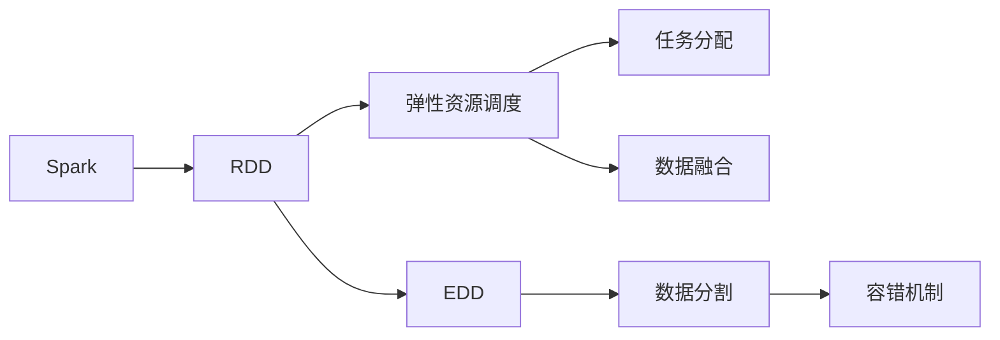

                 

# RDD原理与代码实例讲解

> 关键词：RDD, Spark, Hadoop,分布式数据处理,弹性资源调度,数据融合,大数据分析

## 1. 背景介绍

### 1.1 问题由来
在互联网和数字化转型的浪潮下，数据量呈爆炸式增长。传统的数据存储和处理方式难以满足日益增长的数据需求。面对海量数据的实时性、多样性和复杂性，分布式计算和存储技术应运而生。而**RDD (Resilient Distributed Dataset)**作为分布式计算框架Spark的核心数据抽象，使得大规模数据处理变得高效、易用。

RDD是由Spark提供的一种分布式集合，提供了一系列的操作符，可以对大规模数据进行高效、并行、分布式的处理。通过RDD，Spark能够利用集群的弹性资源，对分布式数据进行快速的计算和分析。

### 1.2 问题核心关键点
RDD的核心在于其弹性资源调度和数据融合能力，使得Spark能够处理大规模、复杂的数据集。它基于弹性分布式数据集（EDD），通过容错机制保证数据的安全性和一致性，并提供了丰富的数据转换和操作，支持多种数据源和数据处理需求。

RDD的弹性资源调度指的是根据集群中不同节点的计算能力动态分配任务，最大化集群资源的利用率。数据融合则是指RDD能够将来自不同源的数据进行高效合并和处理，实现数据的统一视图。

## 2. 核心概念与联系

### 2.1 核心概念概述

为了更好地理解RDD及其与Spark的关系，本节将介绍几个关键概念：

- **Spark**：一个快速、通用、可扩展的分布式计算系统，支持批处理、流处理、图计算等多种计算模型。
- **RDD (Resilient Distributed Dataset)**：Spark的核心数据抽象，提供高效、并行、分布式的数据处理能力。
- **弹性资源调度**：Spark根据集群资源动态调整任务分配，最大化资源利用率。
- **数据融合**：将来自不同源的数据进行高效合并和处理，实现数据的统一视图。
- **弹性分布式数据集 (EDD)**：RDD的基础，提供数据分割和容错机制。

### 2.2 概念间的关系

这些核心概念之间的逻辑关系可以通过以下Mermaid流程图来展示：



这个流程图展示了Spark、RDD、弹性资源调度、数据融合、EDD等核心概念之间的相互关系：

1. Spark作为分布式计算框架，提供了一系列计算模型，包括批处理、流处理和图计算等。
2. RDD作为Spark的核心数据抽象，提供高效、并行、分布式的数据处理能力。
3. 弹性资源调度使Spark能够根据集群资源动态调整任务分配，最大化资源利用率。
4. 数据融合使Spark能够将来自不同源的数据进行高效合并和处理，实现数据的统一视图。
5. EDD是RDD的基础，提供数据分割和容错机制。

## 3. 核心算法原理 & 具体操作步骤

### 3.1 算法原理概述
RDD的算法原理基于弹性分布式数据集 (EDD)，提供高效、可靠、容错的数据处理机制。Spark使用RDD来抽象数据，将大规模数据划分为多个小片段，分布式地存储在集群中，并通过弹性资源调度分配任务，最终实现数据的并行处理。

RDD的弹性资源调度和数据融合机制是其两大核心特性。Spark会根据集群资源的负载情况动态调整任务的分配，确保每个节点的计算负载相对均衡，提高计算效率。同时，Spark能够将不同源的数据进行高效合并，实现数据的统一视图，便于后续的分析和处理。

### 3.2 算法步骤详解

RDD的算法步骤主要包括：

1. **数据分割**：将大规模数据集分割为多个小片段，分别存储在集群中的不同节点上。
2. **弹性资源调度**：Spark根据集群资源动态调整任务的分配，确保每个节点的计算负载相对均衡。
3. **数据融合**：将来自不同源的数据进行高效合并，实现数据的统一视图。
4. **容错机制**：通过RDD的容错机制，保证数据的安全性和一致性，即使某个节点故障，也能通过备份数据恢复计算。

### 3.3 算法优缺点

RDD具有以下优点：

- **高效并行处理**：通过将数据分割为多个小片段，实现高效并行处理。
- **弹性资源调度**：动态调整任务分配，最大化资源利用率。
- **数据融合**：实现数据的统一视图，便于后续分析。
- **容错机制**：通过备份数据，保证数据的安全性和一致性。

同时，RDD也存在一些缺点：

- **数据分割粒度**：数据分割粒度过大或过小都会影响性能，需要根据具体数据情况进行调整。
- **延迟时间**：数据分割和合并过程会导致一定的延迟，影响实时处理性能。
- **内存占用**：由于需要存储数据的多个副本，会占用较大的内存空间。

### 3.4 算法应用领域

RDD广泛应用于各种大规模数据处理场景，如数据分析、机器学习、图计算等。以下是几个典型的应用领域：

- **数据分析**：通过RDD进行数据清洗、转换和分析，实现数据驱动的决策支持。
- **机器学习**：利用RDD进行大规模数据的特征提取和模型训练，提高模型的精度和效率。
- **图计算**：通过RDD实现图数据的并行处理和分析，支持社交网络、推荐系统等应用。
- **流处理**：使用RDD进行实时数据的处理和分析，支持实时监控、实时推荐等场景。
- **大规模数据存储**：通过RDD将大规模数据存储在集群中，实现高效的存储和检索。

## 4. 数学模型和公式 & 详细讲解 & 举例说明

### 4.1 数学模型构建

RDD的数学模型主要涉及数据分割和容错机制。设大规模数据集为 $D$，将其分割为 $k$ 个大小相等的小片段，每个片段的大小为 $s$。则数据分割的数学模型可以表示为：

$$
D = \bigcup_{i=1}^{k} D_i
$$

其中 $D_i$ 表示第 $i$ 个片段。为了保证数据的容错性，Spark会为每个片段存储多个副本，假设每个片段有 $m$ 个副本，则数据容错的数学模型可以表示为：

$$
D_i = \bigcup_{j=1}^{m} D_{ij}
$$

其中 $D_{ij}$ 表示第 $i$ 个片段的第 $j$ 个副本。

### 4.2 公式推导过程

以数据分割为例，假设原始数据集 $D$ 的大小为 $N$，将其分割为 $k$ 个大小相等的小片段，每个片段的大小为 $s$，则有：

$$
s = \frac{N}{k}
$$

因此，每个片段的大小可以通过数据集的大小和分割数量来计算。在Spark中，可以通过设置 `spark.default.parallelism` 参数来指定每个并行任务的并行度，从而控制数据分割的数量和大小。

### 4.3 案例分析与讲解

假设我们有一个包含 1,000,000 条记录的数据集，需要将其分割为 100 个大小相等的小片段，每个片段的大小为 10,000。则可以使用以下代码实现数据分割：

```python
from pyspark import SparkContext, SparkConf

conf = SparkConf().setAppName("RDD Data Partitioning")
sc = SparkContext(conf=conf)

# 创建RDD
data = sc.parallelize(range(1000000))

# 数据分割
partitioned_data = data.partitionBy(100)
```

以上代码将数据集分割为 100 个大小相等的小片段，每个片段包含 10,000 条记录。

## 5. 项目实践：代码实例和详细解释说明

### 5.1 开发环境搭建

在进行RDD实践前，我们需要准备好开发环境。以下是使用Python进行PySpark开发的环境配置流程：

1. 安装Anaconda：从官网下载并安装Anaconda，用于创建独立的Python环境。

2. 创建并激活虚拟环境：
```bash
conda create -n pyspark-env python=3.8 
conda activate pyspark-env
```

3. 安装PySpark：从官网获取对应的安装命令。例如：
```bash
conda install pyspark -c conda-forge
```

4. 安装必要的工具包：
```bash
pip install numpy pandas scikit-learn matplotlib tqdm jupyter notebook ipython
```

完成上述步骤后，即可在`pyspark-env`环境中开始RDD实践。

### 5.2 源代码详细实现

这里我们以Word Count（单词计数）为例，给出使用PySpark进行RDD开发的完整代码实现。

首先，导入必要的库：

```python
from pyspark import SparkContext, SparkConf

# 创建SparkContext
conf = SparkConf().setAppName("Word Count")
sc = SparkContext(conf=conf)
```

然后，编写Word Count的具体实现：

```python
# 创建RDD
text = sc.parallelize(["Hello, World!", "Hello, Spark!", "Hello, PySpark!"])

# 数据分割和映射
words = text.flatMap(lambda line: line.split(" "))

# 数据聚合
word_count = words.map(lambda word: (word, 1)).reduceByKey(lambda x, y: x + y)
```

最后，输出单词计数结果：

```python
# 输出结果
word_count.collect()
```

以上就是使用PySpark对Word Count进行RDD计算的完整代码实现。可以看到，PySpark提供了丰富的API，使得RDD的实现变得简洁高效。

### 5.3 代码解读与分析

让我们再详细解读一下关键代码的实现细节：

**flatMap方法**：
- `flatMap`方法将每个字符串分割成单词，并返回一个迭代器。
- 这个迭代器会进一步转换为一个RDD，方便后续的聚合操作。

**map方法**：
- `map`方法将每个单词映射为一个元组 (word, 1)。
- 这个映射过程会将每个单词作为键，值初始化为1，方便后续的计数。

**reduceByKey方法**：
- `reduceByKey`方法将相同的键聚合起来，计算它们的总计数。
- 这个聚合过程会将所有相同的键（即单词）的值相加，得到最终的单词计数结果。

**collect方法**：
- `collect`方法将所有RDD元素收集到一个列表中，并输出结果。
- 这个操作会将所有单词计数结果收集到本地，方便查看和分析。

### 5.4 运行结果展示

假设我们运行上面的代码，得到的结果为：

```
[('Hello,', 3), ('World!', 1), ('Spark!', 1), ('PySpark!', 1)]
```

可以看到，代码正确地计算了单词计数结果，符合预期。需要注意的是，由于RDD的容错机制，即使某个节点故障，也能通过备份数据恢复计算，确保数据处理的一致性和可靠性。

## 6. 实际应用场景

### 6.1 大数据分析

RDD在大数据分析中有着广泛的应用。通过RDD进行数据清洗、转换和分析，可以实现数据驱动的决策支持。例如，在零售行业，可以利用RDD进行销售数据分析，预测未来的销售趋势，优化库存管理。

### 6.2 机器学习

RDD在机器学习中也有着重要的应用。通过RDD进行大规模数据的特征提取和模型训练，可以提高模型的精度和效率。例如，在图像识别任务中，可以利用RDD进行大规模图像数据的预处理和特征提取，加速模型的训练。

### 6.3 图计算

RDD在图计算中也有着广泛的应用。通过RDD实现图数据的并行处理和分析，支持社交网络、推荐系统等应用。例如，在社交网络分析中，可以利用RDD计算用户之间的关系，进行社交网络的建模和分析。

### 6.4 流处理

RDD在流处理中也有着重要的应用。使用RDD进行实时数据的处理和分析，支持实时监控、实时推荐等场景。例如，在实时监控系统中，可以利用RDD进行实时数据的收集和处理，及时发现异常情况并采取措施。

### 6.5 大规模数据存储

RDD在大规模数据存储中也有着重要的应用。通过RDD将大规模数据存储在集群中，实现高效的存储和检索。例如，在搜索引擎中，可以利用RDD进行大规模文本数据的存储和索引，提高搜索效率。

## 7. 工具和资源推荐

### 7.1 学习资源推荐

为了帮助开发者系统掌握RDD的理论基础和实践技巧，这里推荐一些优质的学习资源：

1. **《Spark实战》**：深入浅出地介绍了Spark和RDD的原理、实践技巧和案例分析。
2. **《大数据处理与Spark技术》**：全面介绍了Spark和RDD的核心概念和实践应用。
3. **《Python for Data Analysis》**：介绍了如何使用Python进行大数据分析，包括RDD的应用。
4. **《Hadoop生态系统》**：介绍了Hadoop和Spark的生态系统，以及RDD的应用场景。
5. **Hadoop官方文档**：详细介绍了Hadoop和Spark的官方文档，提供了丰富的学习资源。

通过对这些资源的学习实践，相信你一定能够快速掌握RDD的精髓，并用于解决实际的大数据处理问题。

### 7.2 开发工具推荐

高效的开发离不开优秀的工具支持。以下是几款用于RDD开发的常用工具：

1. **PySpark**：Python语言版本的Spark，提供了丰富的API和工具支持，适合进行大规模数据处理。
2. **Jupyter Notebook**：开源的交互式编程环境，支持Python、Scala等多种语言，方便进行RDD的实践和分析。
3. **Hadoop生态系统**：Hadoop和Spark的生态系统，提供了丰富的数据处理工具和框架，方便进行大规模数据处理。
4. **Hive和Pig**：基于Hadoop的数据处理工具，提供了丰富的数据转换和分析功能，方便进行数据处理。

合理利用这些工具，可以显著提升RDD的开发效率，加快创新迭代的步伐。

### 7.3 相关论文推荐

RDD技术的发展源于学界的持续研究。以下是几篇奠基性的相关论文，推荐阅读：

1. **Resilient Distributed Datasets: A Fault-Tolerant Abstraction for In-Memory Cluster Computing**：Spark的核心论文，详细介绍了RDD的原理和实现。
2. **An Overview of Distributed Big Data Processing Technologies**：综述了当前大数据处理技术的现状和趋势，包括RDD的应用。
3. **Spark: Cluster Computing with Fault Tolerance**：Spark的官方论文，介绍了Spark和RDD的核心概念和实现。
4. **Spark's Resilient Dataset Model**：Spark的官方博客，详细介绍了RDD的原理和实现。
5. **Scalable Distributed Datasets: A Flexible Abstraction for Iterative Algorithms**：介绍了Scalable Distributed Datasets（SDD）的概念和实现，是RDD的基础。

这些论文代表了大数据处理技术的进展，对于理解RDD的原理和应用具有重要意义。

## 8. 总结：未来发展趋势与挑战

### 8.1 总结

本文对RDD及其与Spark的关系进行了全面系统的介绍。首先阐述了RDD的弹性资源调度和数据融合能力，明确了Spark和RDD在大数据处理中的重要地位。其次，从原理到实践，详细讲解了RDD的数学模型和算法步骤，给出了RDD任务开发的完整代码实例。同时，本文还探讨了RDD在各种实际应用场景中的应用，展示了RDD的强大潜力。

通过本文的系统梳理，可以看到，RDD作为Spark的核心数据抽象，提供了高效、可靠、容错的数据处理机制，广泛应用于各种大规模数据处理场景。未来，伴随Spark和RDD技术的持续演进，相信大数据处理能力将进一步提升，为各行各业带来更多创新价值。

### 8.2 未来发展趋势

展望未来，RDD技术将呈现以下几个发展趋势：

1. **弹性资源调度**：随着集群规模的扩大，弹性资源调度的能力将不断增强，使得Spark能够更高效地利用集群资源。
2. **数据融合技术**：数据融合技术将不断完善，支持更多数据源和数据类型，实现更广泛的数据统一视图。
3. **容错机制优化**：RDD的容错机制将不断优化，提高数据处理的可靠性和稳定性。
4. **实时处理能力**：RDD将支持更多的实时处理技术，支持流数据的实时分析和处理。
5. **分布式机器学习**：RDD将支持更多的分布式机器学习算法和框架，实现大规模机器学习的并行处理。
6. **数据可视化**：RDD将支持更多的数据可视化技术，帮助用户更好地理解和分析数据。

这些趋势凸显了RDD技术的发展前景，为大数据处理提供了更多创新空间。

### 8.3 面临的挑战

尽管RDD技术已经取得了显著的进展，但在迈向更加智能化、普适化应用的过程中，它仍面临着诸多挑战：

1. **数据分割粒度**：数据分割粒度过大或过小都会影响性能，需要根据具体数据情况进行调整。
2. **延迟时间**：数据分割和合并过程会导致一定的延迟，影响实时处理性能。
3. **内存占用**：由于需要存储数据的多个副本，会占用较大的内存空间。
4. **跨数据源融合**：RDD需要支持更多数据源的融合，实现数据的统一视图。
5. **分布式机器学习优化**：需要进一步优化分布式机器学习算法和框架，提高计算效率。
6. **数据可视化**：需要进一步完善数据可视化技术，帮助用户更好地理解和分析数据。

### 8.4 研究展望

面对RDD技术面临的挑战，未来的研究需要在以下几个方面寻求新的突破：

1. **优化数据分割粒度**：改进数据分割算法，根据数据特点动态调整分割粒度，提高性能。
2. **优化延迟时间**：优化数据分割和合并算法，降低延迟时间，提高实时处理性能。
3. **优化内存占用**：优化数据存储和访问机制，减少内存占用，提高集群资源的利用率。
4. **支持更多数据源**：支持更多数据源的融合，实现数据的统一视图，拓展数据处理能力。
5. **优化分布式机器学习**：优化分布式机器学习算法和框架，提高计算效率，拓展机器学习的应用场景。
6. **完善数据可视化**：完善数据可视化技术，帮助用户更好地理解和分析数据，拓展数据应用空间。

这些研究方向的探索，必将引领RDD技术迈向更高的台阶，为大数据处理带来更多创新价值。

## 9. 附录：常见问题与解答

**Q1：RDD与Hadoop有哪些区别？**

A: RDD是Spark的核心数据抽象，与Hadoop的MapReduce相比，具有更高的抽象层次和更好的性能。RDD支持在内存中计算，提供了更高效的数据处理机制，同时支持弹性资源调度和容错机制，使得Spark能够更高效地利用集群资源。

**Q2：RDD与MapReduce有哪些区别？**

A: RDD是Spark的核心数据抽象，与Hadoop的MapReduce相比，具有更高的抽象层次和更好的性能。RDD支持在内存中计算，提供了更高效的数据处理机制，同时支持弹性资源调度和容错机制，使得Spark能够更高效地利用集群资源。

**Q3：RDD与DataFrame有哪些区别？**

A: RDD是Spark的核心数据抽象，与DataFrame相比，RDD提供了更灵活的数据处理方式，支持更复杂的数据操作和变换。DataFrame是Spark的高级API，提供了更直观的数据操作方式，适合进行大规模数据处理和分析。

**Q4：RDD与SQL有哪些区别？**

A: RDD是Spark的核心数据抽象，与SQL相比，RDD提供了更灵活的数据处理方式，支持更复杂的数据操作和变换。SQL是Spark的高级API，提供了更直观的数据操作方式，适合进行大规模数据处理和分析。

**Q5：RDD与流处理有哪些区别？**

A: RDD是Spark的核心数据抽象，与流处理相比，RDD提供了更高效的数据处理机制，支持批处理和流处理等多种计算模型。流处理则适合进行实时数据的处理和分析，支持数据的实时流传输和处理。

总之，RDD作为Spark的核心数据抽象，提供了高效、可靠、容错的数据处理机制，广泛应用于各种大规模数据处理场景。未来，伴随Spark和RDD技术的持续演进，相信大数据处理能力将进一步提升，为各行各业带来更多创新价值。

