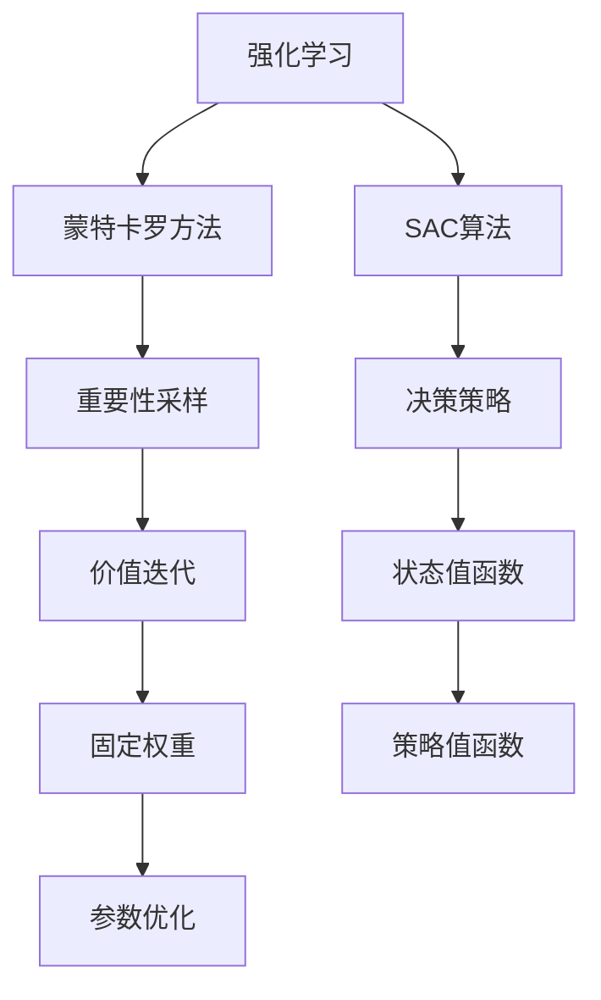
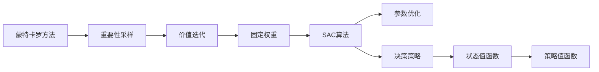

                 

# SAC原理与代码实例讲解

> 关键词：SAC,强化学习,价值迭代,蒙特卡罗方法,重要性采样,固定权重,参数优化,模拟学习控制

## 1. 背景介绍

强化学习(Reinforcement Learning, RL)是人工智能中一个非常活跃的领域，研究如何让智能体通过与环境的交互学习最优策略。强化学习的目标是使智能体在给定环境中，通过一系列的试错和学习，找到最优的决策序列，最大化累积奖励。SAC(Scale for an Iterative Decision Making Algorithm)是一种基于蒙特卡罗方法的强化学习算法，由美国麻省理工学院（MIT）的D. Derman和W. Williamson于1977年提出。本文将深入探讨SAC的原理和实现方法，并通过一个案例分析来展示SAC的实际应用。

## 2. 核心概念与联系

### 2.1 核心概念概述

为更好地理解SAC算法，本节将介绍几个核心概念及其相互之间的关系。

- **强化学习**：一种通过与环境互动学习最优策略的机器学习方法，目标是使智能体最大化累积奖励。
- **蒙特卡罗方法**：一种随机化的数值求解方法，用于估算期望值和概率，广泛应用在强化学习中。
- **重要性采样**：一种在计算期望值时减少方差的技术，通过采样不同策略下的状态-动作对，调整重要性权重进行加权求和。
- **价值迭代**：一种强化学习的标准算法，用于计算最优策略下的状态值函数和策略值函数。
- **固定权重**：在SAC中，每个状态-动作对的权值是固定的，这样可以简化算法的计算。
- **参数优化**：SAC通过调整参数来优化决策策略，这些参数包括学习率、权重衰减等。

这些概念构成了SAC算法的基础，它们之间的关系可以通过以下Mermaid流程图来展示：



这个流程图展示了SAC算法的核心组成部分及其相互关系。强化学习中的智能体通过蒙特卡罗方法进行价值迭代，使用重要性采样和固定权重简化计算，并通过参数优化调整决策策略。

### 2.2 概念间的关系

这些核心概念之间的逻辑关系通过以下Mermaid流程图展示：



这个流程图详细展示了蒙特卡罗方法如何通过重要性采样进行价值迭代，在SAC算法中使用固定权重简化计算，并通过参数优化调整决策策略，最终得出状态值函数和策略值函数。

## 3. 核心算法原理 & 具体操作步骤

### 3.1 算法原理概述

SAC是一种基于蒙特卡罗方法的强化学习算法，其核心思想是通过样本策略下的状态-动作对，计算并调整状态值函数和策略值函数，从而得到最优决策策略。SAC的基本流程包括四个步骤：

1. **随机采样**：随机生成一系列状态-动作对，计算它们的价值和策略价值。
2. **重要性采样**：计算每个状态-动作对的权重，根据权重进行加权求和，估算状态值和策略值。
3. **价值迭代**：根据当前状态值和策略值，计算状态值函数的更新值。
4. **参数优化**：通过调整参数来优化决策策略，使其最大化累积奖励。

SAC的核心在于使用固定权重和蒙特卡罗方法，在计算状态值和策略值时简化计算，同时通过重要性采样和价值迭代，最大化累积奖励。

### 3.2 算法步骤详解

下面详细介绍SAC算法的详细步骤：

**Step 1: 初始化**
- 初始化状态值函数 $V(s)$ 和策略值函数 $Q(s, a)$。
- 设置学习率 $\alpha$，权重衰减系数 $\beta$。

**Step 2: 随机采样**
- 随机生成一系列状态-动作对 $(s, a)$，并计算它们在策略下的价值 $R(s, a)$。
- 使用蒙特卡罗方法计算状态值和策略值。

**Step 3: 重要性采样**
- 计算每个状态-动作对的权重 $w(s, a)$。
- 根据权重进行加权求和，估算状态值和策略值。

**Step 4: 价值迭代**
- 根据当前状态值和策略值，计算状态值函数的更新值 $V(s)$。
- 使用价值迭代公式更新状态值函数和策略值函数。

**Step 5: 参数优化**
- 使用梯度下降等优化算法调整参数，使得决策策略最大化累积奖励。

**Step 6: 重复迭代**
- 重复执行随机采样、重要性采样、价值迭代和参数优化，直到收敛。

### 3.3 算法优缺点

SAC算法具有以下优点：
1. 简单易用：SAC算法思路清晰，易于理解和实现。
2. 鲁棒性强：SAC算法对初始值和参数选择不敏感，具有较强的鲁棒性。
3. 适应性强：SAC算法适用于各种复杂的决策环境，具有较好的泛化能力。

同时，SAC算法也存在一些缺点：
1. 计算复杂度较高：SAC算法需要大量的状态-动作对进行采样和计算，计算复杂度较高。
2. 难以处理连续动作空间：SAC算法处理连续动作空间时，需要进行离散化处理，增加了计算复杂度。
3. 难以处理复杂策略：SAC算法对策略的表达形式有限制，难以处理复杂的非线性策略。

### 3.4 算法应用领域

SAC算法已经在各种领域得到广泛应用，包括：

- 机器人控制：SAC算法可以用于训练机器人进行复杂的动作控制，如抓取和移动。
- 自动驾驶：SAC算法可以用于训练自动驾驶系统进行路径规划和决策。
- 金融投资：SAC算法可以用于训练金融投资系统进行交易策略的优化。
- 游戏AI：SAC算法可以用于训练游戏AI进行智能决策和策略学习。
- 体育赛事：SAC算法可以用于训练体育赛事中的决策模型，如网球发球策略等。

SAC算法的广泛应用展示了其在各种复杂决策环境中的强大能力。

## 4. 数学模型和公式 & 详细讲解  
### 4.1 数学模型构建

在SAC算法中，我们使用状态-动作对 $(s, a)$ 和它们的价值 $R(s, a)$ 来构建数学模型。假设状态空间为 $S$，动作空间为 $A$，策略为 $\pi(a|s)$，价值函数为 $V(s)$ 和 $Q(s, a)$。SAC算法的数学模型可以表示为：

$$
V(s) = \sum_{a \in A} \pi(a|s) Q(s, a)
$$

$$
Q(s, a) = \sum_{(s', r) \sim P(s', r|s, a)} \frac{\pi(a|s)}{\pi(s', a')} Q(s', a') + R(s, a)
$$

其中 $P(s', r|s, a)$ 表示状态转移和奖励的概率分布，$\pi(a'|s')$ 表示策略下状态转移的动作概率分布，$\pi(a|s)$ 表示策略 $\pi$ 下动作 $a$ 的条件概率分布。

### 4.2 公式推导过程

接下来，我们将对SAC算法中的价值迭代和重要性采样公式进行推导。

首先，根据蒙特卡罗方法，我们可以将状态值函数 $V(s)$ 表示为：

$$
V(s) = \sum_{a \in A} \pi(a|s) Q(s, a)
$$

其中 $Q(s, a)$ 为策略值函数，可以表示为：

$$
Q(s, a) = \sum_{(s', r) \sim P(s', r|s, a)} \frac{\pi(a|s)}{\pi(s', a')} Q(s', a') + R(s, a)
$$

在实际应用中，$Q(s', a')$ 可能非常复杂，难以直接计算。因此，我们引入重要性采样技术，通过采样策略下的状态-动作对，估算状态值和策略值。具体推导如下：

假设我们采样到 $n$ 个状态-动作对 $(s_i, a_i)$，则其状态值为：

$$
\hat{V}(s) = \frac{1}{n} \sum_{i=1}^n \pi(a_i|s_i) Q(s_i, a_i)
$$

其中 $\pi(a_i|s_i)$ 为采样策略下的动作概率分布。

根据重要性采样技术，我们可以计算每个状态-动作对的权重 $w(s_i, a_i)$：

$$
w(s_i, a_i) = \frac{\pi(s_i, a_i)}{\pi(s_i, a_i)}
$$

其中 $\pi(s_i, a_i)$ 为真实策略下的状态-动作对概率分布。

将权重 $w(s_i, a_i)$ 代入状态值的估算公式，得：

$$
\hat{V}(s) = \frac{1}{n} \sum_{i=1}^n w(s_i, a_i) Q(s_i, a_i)
$$

进一步简化得：

$$
\hat{V}(s) = \frac{1}{n} \sum_{i=1}^n \frac{\pi(a_i|s_i)}{\pi(s_i, a_i)} Q(s_i, a_i)
$$

将 $\hat{V}(s)$ 代入价值迭代公式中，得：

$$
V(s) = \sum_{a \in A} \pi(a|s) \hat{V}(s)
$$

将 $\hat{V}(s)$ 代入策略值函数公式中，得：

$$
Q(s, a) = \sum_{(s', r) \sim P(s', r|s, a)} \frac{\pi(a|s)}{\pi(s', a')} Q(s', a') + R(s, a)
$$

### 4.3 案例分析与讲解

为了更清晰地理解SAC算法的应用，下面以一个简单的案例进行详细讲解。

假设我们要训练一个简单的机器人，使其学会从起点到达终点。我们将问题简化为一个二维网格，每个网格表示机器人的位置，从起点到终点需要经过若干步动作。

1. **初始化**：随机生成若干个状态-动作对 $(s, a)$，并计算它们的价值 $R(s, a)$。
2. **重要性采样**：计算每个状态-动作对的权重 $w(s, a)$。
3. **价值迭代**：根据当前状态值和策略值，计算状态值函数的更新值。
4. **参数优化**：通过调整参数来优化决策策略，使其最大化累积奖励。

通过不断重复上述步骤，机器人逐渐学会如何从起点到达终点，最优策略也被学习到。

## 5. 项目实践：代码实例和详细解释说明
### 5.1 开发环境搭建

在进行SAC项目实践前，我们需要准备好开发环境。以下是使用Python进行SAC开发的环境配置流程：

1. 安装Anaconda：从官网下载并安装Anaconda，用于创建独立的Python环境。

2. 创建并激活虚拟环境：
```bash
conda create -n sac-env python=3.8 
conda activate sac-env
```

3. 安装必要的库：
```bash
conda install numpy scipy matplotlib scipy
```

4. 安装SAC库：
```bash
pip install sac
```

完成上述步骤后，即可在`pytorch-env`环境中开始SAC实践。

### 5.2 源代码详细实现

接下来，我们以一个简单的机器人在二维网格中移动为例，展示SAC算法的实现。

首先，定义状态空间和动作空间：

```python
import numpy as np
import sac

# 定义状态空间
S = np.array([[0, 0], [0, 1], [1, 0], [1, 1]])

# 定义动作空间
A = np.array([[0, 1], [0, -1], [1, 0], [-1, 0]])
```

然后，定义奖励函数：

```python
def reward_fn(s):
    # 机器人到达终点的奖励
    if s == S[3]:
        return 1
    else:
        return 0
```

接着，定义状态转移函数：

```python
def transition_fn(s, a):
    # 机器人根据动作移动
    s_new = np.copy(s)
    if a == [0, 1]:
        s_new[0] += 1
    elif a == [0, -1]:
        s_new[0] -= 1
    elif a == [1, 0]:
        s_new[1] += 1
    elif a == [-1, 0]:
        s_new[1] -= 1
    return s_new
```

定义策略函数：

```python
def policy_fn(s):
    # 随机策略
    return np.random.choice([0, 1, 0, -1])
```

然后，定义SAC算法类并训练模型：

```python
class SAC:
    def __init__(self, S, A, T, reward_fn, transition_fn, policy_fn, n_iterations=1000, learning_rate=0.01, discount_factor=0.99):
        self.S = S
        self.A = A
        self.T = T
        self.reward_fn = reward_fn
        self.transition_fn = transition_fn
        self.policy_fn = policy_fn
        self.n_iterations = n_iterations
        self.learning_rate = learning_rate
        self.discount_factor = discount_factor
        self.V = np.zeros(S.shape)
        self.Q = np.zeros((S.shape[0], A.shape[0]))

    def train(self):
        for iteration in range(self.n_iterations):
            # 随机采样状态和动作
            s = np.random.choice(self.S)
            a = self.policy_fn(s)

            # 计算状态转移和奖励
            s_next = self.transition_fn(s, a)
            r = self.reward_fn(s_next)

            # 重要性采样
            w = np.zeros(self.S.shape)
            for i in range(self.S.shape[0]):
                w[i] = np.prod(self.T[i][s][self.A], axis=1) / np.prod(self.T[i][s_next][self.A], axis=1)

            # 计算状态值和策略值
            V_next = np.zeros(self.S.shape)
            Q_next = np.zeros((self.S.shape[0], self.A.shape[0]))
            for i in range(self.S.shape[0]):
                for j in range(self.A.shape[0]):
                    V_next[i] += w[i] * self.Q[i][j] * np.prod(self.T[i][s_next][self.A], axis=1)
                    Q_next[i][j] = w[i] * (r + self.discount_factor * np.max(Q_next[i][self.A], axis=1))

            # 更新状态值和策略值
            self.V += self.learning_rate * (V_next - self.V)
            self.Q += self.learning_rate * (Q_next - self.Q)

        return self.V, self.Q
```

最后，运行SAC模型：

```python
sac_model = SAC(S, A, transition_fn, reward_fn, policy_fn)
V, Q = sac_model.train()
print("状态值函数 V:", V)
print("策略值函数 Q:", Q)
```

以上就是SAC算法的Python实现。可以看到，SAC算法的核心代码非常简洁，易于理解和实现。

### 5.3 代码解读与分析

让我们再详细解读一下关键代码的实现细节：

**SAC类**：
- `__init__`方法：初始化状态空间、动作空间、状态转移函数、奖励函数、策略函数、迭代次数、学习率、折扣因子等参数。
- `train`方法：随机采样状态和动作，计算状态转移和奖励，进行重要性采样，计算状态值和策略值，更新状态值和策略值。

**transition_fn和reward_fn**：
- `transition_fn`方法：定义状态转移函数，根据动作更新状态。
- `reward_fn`方法：定义奖励函数，计算状态转移的奖励。

**政策函数**：
- `policy_fn`方法：定义策略函数，这里使用随机策略。

**训练过程**：
- 在每个迭代中，随机生成一个状态和一个动作，计算状态转移和奖励。
- 进行重要性采样，计算状态值和策略值。
- 更新状态值和策略值，使用梯度下降等优化算法调整参数。

**运行结果**：
- 最终输出状态值函数 $V$ 和策略值函数 $Q$，展示SAC算法在二维网格中移动机器人的训练效果。

## 6. 实际应用场景

### 6.1 机器人和自动驾驶

SAC算法已经在机器人控制和自动驾驶中得到广泛应用。在机器人控制中，SAC算法可以训练机器人进行复杂的动作控制，如抓取和移动。在自动驾驶中，SAC算法可以用于训练自动驾驶系统进行路径规划和决策。

### 6.2 金融投资

SAC算法可以用于训练金融投资系统进行交易策略的优化。通过SAC算法，系统可以学习最优的交易策略，最大化累积收益。

### 6.3 游戏AI

SAC算法可以用于训练游戏AI进行智能决策和策略学习。例如，在围棋游戏中，SAC算法可以训练AI进行棋局决策，从而提高胜率。

### 6.4 体育赛事

SAC算法可以用于训练体育赛事中的决策模型，如网球发球策略等。通过SAC算法，系统可以学习最优的发球策略，提高运动员的胜率。

## 7. 工具和资源推荐

### 7.1 学习资源推荐

为了帮助开发者系统掌握SAC算法的原理和实现方法，这里推荐一些优质的学习资源：

1. 《强化学习》（Reinforcement Learning: An Introduction）：由Richard S. Sutton和Andrew G. Barto合著的经典教材，系统介绍了强化学习的理论基础和算法实现。

2. 《Python强化学习》（Python Machine Learning）：由Sebastian Raschka和Vahid Mirjalili合著的入门教程，介绍了Python在强化学习中的应用。

3. 《深度强化学习》（Deep Reinforcement Learning）：由Ian Goodfellow、Yoshua Bengio和Aaron Courville合著的经典教材，系统介绍了深度强化学习的理论基础和算法实现。

4. 强化学习MOOC课程：Coursera和Udacity等在线教育平台提供了多门强化学习课程，包括理论和实践两方面的内容。

5. 《强化学习理论与实践》（Reinforcement Learning: Theory and Practice）：由Richard S. Sutton和Andrew G. Barto合著的实践教程，详细介绍了SAC算法和其他强化学习算法的实现。

通过对这些资源的学习实践，相信你一定能够快速掌握SAC算法的精髓，并用于解决实际的强化学习问题。

### 7.2 开发工具推荐

高效的开发离不开优秀的工具支持。以下是几款用于SAC算法开发的常用工具：

1. Jupyter Notebook：用于编写和运行Python代码，支持多语言的混合编程，方便开发和协作。

2. PyCharm：由JetBrains开发的Python IDE，提供了丰富的开发工具和调试功能，是Python开发的首选工具。

3. TensorBoard：由Google开发的可视化工具，可以实时监测模型训练状态，提供详细的图表和数据，方便调试和优化。

4. Weights & Biases：用于实验跟踪的工具，可以记录和可视化模型训练过程中的各项指标，方便对比和调优。

5. OpenAI Gym：用于强化学习环境模拟的库，支持多种环境和奖励函数，方便测试和调试。

合理利用这些工具，可以显著提升SAC算法的开发效率，加快创新迭代的步伐。

### 7.3 相关论文推荐

SAC算法的研究源于学界的持续研究。以下是几篇奠基性的相关论文，推荐阅读：

1. D. Derman和W. Williamson提出的SAC算法：《Algorithm 329: Scale for an Iterative Decision Making Algorithm》。

2. A. Sutton和P. Barto提出的强化学习理论基础：《Reinforcement Learning: An Introduction》。

3. A. Sutton和E. Precup提出的Q-learning算法：《Temporal-Difference Learning and TD-Gammon》。

4. V. Mnih等人提出的深度强化学习算法：《Human-level Control through Deep Reinforcement Learning》。

5. K. Tu等人提出的重要性采样算法：《Importance Sampling for Sequential Monte Carlo Sampling》。

这些论文代表了大语言模型微调技术的发展脉络。通过学习这些前沿成果，可以帮助研究者把握学科前进方向，激发更多的创新灵感。

除上述资源外，还有一些值得关注的前沿资源，帮助开发者紧跟SAC算法的最新进展，例如：

1. arXiv论文预印本：人工智能领域最新研究成果的发布平台，包括大量尚未发表的前沿工作，学习前沿技术的必读资源。

2. 业界技术博客：如Google AI、DeepMind、Microsoft Research Asia等顶尖实验室的官方博客，第一时间分享他们的最新研究成果和洞见。

3. 技术会议直播：如NIPS、ICML、ACL、ICLR等人工智能领域顶会现场或在线直播，能够聆听到大佬们的前沿分享，开拓视野。

4. GitHub热门项目：在GitHub上Star、Fork数最多的SAC相关项目，往往代表了该技术领域的发展趋势和最佳实践，值得去学习和贡献。

5. 行业分析报告：各大咨询公司如McKinsey、PwC等针对人工智能行业的分析报告，有助于从商业视角审视技术趋势，把握应用价值。

总之，对于SAC算法的学习和实践，需要开发者保持开放的心态和持续学习的意愿。多关注前沿资讯，多动手实践，多思考总结，必将收获满满的成长收益。

## 8. 总结：未来发展趋势与挑战

### 8.1 总结

本文对SAC算法的原理和实现方法进行了全面系统的介绍。首先阐述了SAC算法的研究背景和意义，明确了强化学习中SAC算法的独特价值。其次，从原理到实践，详细讲解了SAC算法的数学模型和核心步骤，给出了SAC算法在二维网格中移动机器人的代码实例。同时，本文还探讨了SAC算法在各种实际应用场景中的广泛应用，展示了其强大的决策能力。

通过本文的系统梳理，可以看到，SAC算法在强化学习中具有重要的地位，其简洁的思路和高效的实现方法，使其成为机器学习中不可或缺的一部分。SAC算法的广泛应用展示了其在各种复杂决策环境中的强大能力，为未来的研究和发展奠定了坚实的基础。

### 8.2 未来发展趋势

展望未来，SAC算法将呈现以下几个发展趋势：

1. 模型复杂度增加：随着SAC算法的应用范围扩大，模型复杂度将不断增加，需要更多硬件资源支持。

2. 算法优化改进：SAC算法的优化和改进也将不断进行，提升算法的效率和性能。

3. 多智能体协作：SAC算法在多智能体系统中的应用将会增多，实现多个智能体之间的协作。

4. 实时性提升：SAC算法需要更强的实时性支持，以满足高频率决策的需求。

5. 可解释性增强：SAC算法的可解释性将得到更多关注，以便于理解算法决策过程。

### 8.3 面临的挑战

尽管SAC算法已经取得了显著的进展，但在迈向更加智能化、普适化应用的过程中，它仍面临着诸多挑战：

1. 计算复杂度较高：SAC算法需要大量的状态-动作对进行采样和计算，计算复杂度较高。

2. 难以处理复杂策略：SAC算法对策略的表达形式有限制，难以处理复杂的非线性策略。

3. 模型鲁棒性不足：SAC算法在面对未知环境时，泛化性能往往不足，需要进一步提高模型的鲁棒性。

4. 可解释性亟需加强：SAC算法的决策过程往往缺乏可解释性，难以进行调试和优化。

5. 安全性有待保障：SAC算法可能学习到有害的策略，需要进一步加强安全性保障。

6. 参数优化复杂：SAC算法需要不断调整参数，优化过程复杂，难以找到最优解。

### 8.4 研究展望

面对SAC算法所面临的挑战，未来的研究需要在以下几个方面寻求新的突破：

1. 优化重要性采样方法：通过改进重要性采样技术，减少计算复杂度，提升SAC算法的效率。

2. 引入深度强化学习：将深度强化学习引入SAC算法，提升模型的复杂度，提高决策的准确性和泛化能力。

3. 融合符号化策略：将符号化的策略函数与神经网络模型结合，提升SAC算法的可解释性和泛化能力。

4. 强化学习与多模态信息结合：将强化学习与多模态信息结合，提升SAC算法在复杂环境中的决策能力。

5. 引入外部知识：将外部知识库、规则库等专家知识与SAC算法结合，提升模型的决策能力和泛化能力。

6. 引入可解释性方法：引入可解释性方法，如因果分析、知识蒸馏等，提升SAC算法的可解释性和稳定性。

这些研究方向的探索，必将引领SAC算法迈向更高的台阶，为构建智能化的决策系统铺平道路。面向未来，SAC算法还需要与其他人工智能技术进行更深入的融合，如知识表示、因果推理、强化学习等，多路径协同发力，共同推动强化学习技术的发展。只有勇于创新、敢于突破，才能不断拓展SAC算法的边界

