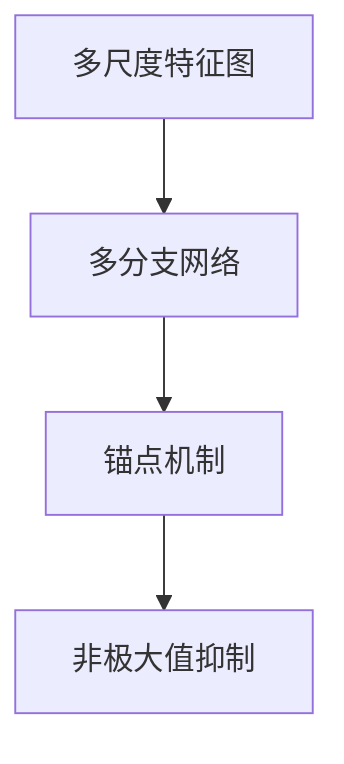
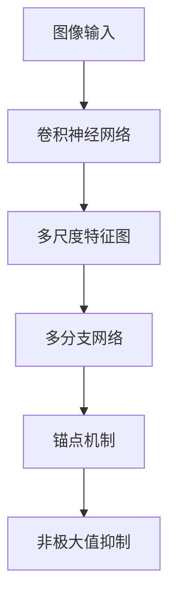
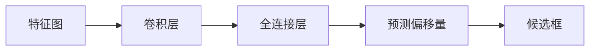
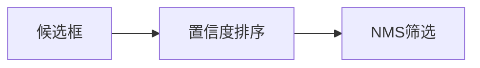
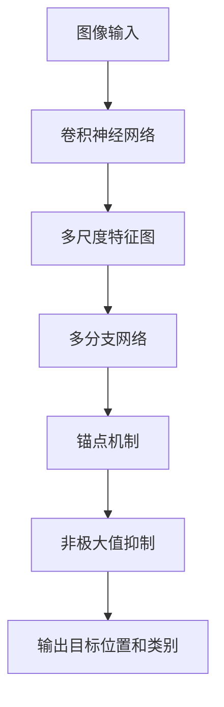

                 

## 1. 背景介绍

在现代计算机视觉领域，目标检测（Object Detection）一直是核心和挑战之一。与图像分类等传统任务相比，目标检测需要在图像中定位出具体的物体，并输出这些物体的类别和位置信息。随着深度学习的发展，目标检测技术也迎来了快速进步，其中单阶段检测器（Single-shot Detectors）成为了热门的研究方向，因其不仅速度快，而且精度高。SSD（Single Shot MultiBox Detector）作为经典的单阶段目标检测器，其核心思想是通过单一的前向传递计算得到候选物体的类别和位置信息，从而避免了传统多阶段检测器（如Faster R-CNN）的复杂结构和高计算量。

### 1.1 问题由来

传统的目标检测方法往往采用两阶段模型，即首先通过选择性搜索（Selective Search）等方法生成候选区域（Region Proposals），然后在每个候选区域上进行分类和回归，以确定最终的目标位置和类别。这类方法虽然准确率高，但由于两阶段的计算复杂度，使得速度较慢，不适合对实时性要求高的应用场景。相比之下，单阶段检测器能够通过单一的前向传递得到检测结果，极大地提高了计算效率。SSD作为单阶段检测器的经典代表，因其速度快、精度高，成为了目标检测领域的重要研究范式。

### 1.2 问题核心关键点

SSD的核心关键点在于其单阶段检测器的架构设计，能够在一次前向传递中同时完成目标分类和位置预测。具体来说，SSD使用多尺度特征图（Multi-scale Feature Maps）来捕捉不同大小的目标，并通过多分支网络（Multi-head Network）同时输出不同尺度的候选框（Bounding Boxes）和对应的类别概率。SSD的关键创新点包括：

- 多尺度特征图：在卷积神经网络（Convolutional Neural Network, CNN）的各个层级提取不同尺度的特征图，用于检测不同大小的目标。
- 多分支网络：在每个特征图上并行地使用卷积层和全连接层，同时输出候选框和类别概率。
- 锚点（Anchor）机制：在特征图上生成多个不同尺度和长宽比（aspect ratio）的候选框，每个候选框对应一个固定位置的锚点，用于预测偏移量。
- 非极大值抑制（Non-Maximum Suppression, NMS）：对输出候选框进行筛选，去除重复的框，输出最终的目标位置和类别。

这些设计使得SSD能够在保持高精度的同时，极大地提升了检测速度。

### 1.3 问题研究意义

SSD的出现，极大地推动了目标检测技术的发展，使之在实时性、准确性等方面都取得了显著进步。SSD的应用场景广泛，涵盖了自动驾驶、安防监控、医疗影像分析等领域，使得计算机视觉技术在更多行业中的应用成为可能。此外，SSD的设计思想也为后续的目标检测算法提供了重要的参考，促进了整个领域的创新和发展。

## 2. 核心概念与联系

### 2.1 核心概念概述

为更好地理解SSD的原理和架构，本节将介绍几个关键概念：

- 单阶段目标检测（Single-shot Object Detection）：在单阶段模型中，目标检测的任务在一次前向传递中完成，避免了传统多阶段检测器（如Faster R-CNN）的复杂结构和高计算量。
- 多尺度特征图（Multi-scale Feature Maps）：通过在卷积神经网络的各个层级提取不同尺度的特征图，用于检测不同大小的目标。
- 多分支网络（Multi-head Network）：在每个特征图上并行地使用卷积层和全连接层，同时输出候选框和类别概率。
- 锚点（Anchor）机制：在特征图上生成多个不同尺度和长宽比的候选框，每个候选框对应一个固定位置的锚点，用于预测偏移量。
- 非极大值抑制（Non-Maximum Suppression, NMS）：对输出候选框进行筛选，去除重复的框，输出最终的目标位置和类别。

这些概念通过以下Mermaid流程图来展示其关系：



这个流程图展示了多尺度特征图通过多分支网络处理后，锚点机制用于生成候选区域，并通过非极大值抑制筛选出最终的目标位置和类别。

### 2.2 概念间的关系

这些核心概念之间存在着紧密的联系，构成了SSD的完整检测流程。下面通过几个Mermaid流程图来展示这些概念之间的关系。

#### 2.2.1 SSD的整体架构



这个流程图展示了SSD的整体架构，从图像输入开始，经过卷积神经网络得到多尺度特征图，再通过多分支网络输出候选区域和类别概率，最后通过锚点机制和非极大值抑制得到最终的目标检测结果。

#### 2.2.2 多分支网络的具体实现



这个流程图展示了多分支网络的具体实现过程，即在每个特征图上使用卷积层和全连接层并行输出预测偏移量，再将其与锚点生成候选区域。

#### 2.2.3 非极大值抑制的流程



这个流程图展示了非极大值抑制的流程，即首先对候选框进行置信度排序，然后根据置信度进行筛选，去除重复的框，输出最终的目标位置和类别。

### 2.3 核心概念的整体架构

最后，我们用一个综合的流程图来展示这些核心概念在SSD中的整体架构：



这个综合流程图展示了从图像输入开始，经过卷积神经网络得到多尺度特征图，再通过多分支网络输出候选框和类别概率，最后通过锚点机制和非极大值抑制得到最终的目标检测结果。

## 3. 核心算法原理 & 具体操作步骤

### 3.1 算法原理概述

SSD的算法原理主要包括多尺度特征图的提取、多分支网络的输出、锚点机制的设计以及非极大值抑制的实现。具体来说，SSD通过在卷积神经网络的各个层级提取不同尺度的特征图，用于检测不同大小的目标。在每个特征图上并行地使用卷积层和全连接层，同时输出候选框和类别概率。通过锚点机制在特征图上生成多个不同尺度和长宽比的候选框，每个候选框对应一个固定位置的锚点，用于预测偏移量。最后，对输出候选框进行筛选，去除重复的框，输出最终的目标位置和类别。

### 3.2 算法步骤详解

以下是SSD的核心算法步骤，详细讲解了每个步骤的实现过程：

1. **图像预处理**：将输入的图像进行预处理，包括归一化、缩放、归一化中心等操作，将其转化为网络可以接受的格式。
2. **多尺度特征图提取**：通过卷积神经网络在不同层级提取多尺度的特征图，用于检测不同大小的目标。
3. **多分支网络输出**：在每个特征图上并行地使用卷积层和全连接层，同时输出候选框和类别概率。
4. **锚点机制**：在特征图上生成多个不同尺度和长宽比的候选框，每个候选框对应一个固定位置的锚点，用于预测偏移量。
5. **非极大值抑制**：对输出候选框进行筛选，去除重复的框，输出最终的目标位置和类别。

### 3.3 算法优缺点

SSD的优点包括：

- 速度快：SSD能够在一次前向传递中完成目标检测，极大地提高了计算效率。
- 精度高：SSD通过多尺度特征图和多分支网络的设计，能够准确检测不同大小的目标。
- 简单高效：SSD的架构设计简单，易于实现和调整。

SSD的缺点包括：

- 模型复杂度较高：SSD需要设计多个特征图和分支网络，增加了模型复杂度。
- 训练成本高：由于模型复杂度较高，训练成本较高，需要较大的计算资源和标注数据。
- 鲁棒性有限：SSD对目标大小、形状的变化较为敏感，对于复杂的背景和遮挡情况，检测效果可能较差。

### 3.4 算法应用领域

SSD的应用领域广泛，涵盖自动驾驶、安防监控、医疗影像分析等领域。例如，在自动驾驶中，SSD可以用于检测和跟踪道路上的车辆、行人等目标，提升车辆行驶的安全性和可靠性。在安防监控中，SSD可以用于实时监测公共场所，识别异常行为，提高安防效率。在医疗影像分析中，SSD可以用于检测和定位肿瘤等病变区域，辅助医生进行诊断和治疗。

## 4. 数学模型和公式 & 详细讲解 & 举例说明

### 4.1 数学模型构建

SSD的数学模型构建主要涉及卷积神经网络（CNN）的特征提取和多分支网络的输出。下面将详细讲解SSD的数学模型构建过程。

假设输入的图像大小为 $H \times W$，卷积神经网络输出特征图的大小为 $S \times T$，每个特征图上的候选框数量为 $K$，每个候选框的候选框宽高比为 $(a_0, a_1, \ldots, a_{K-1})$，对应的特征图坐标为 $(c_x, c_y)$，特征图大小为 $(S \times T)$。设每个候选框的偏移量为 $(d_x, d_y)$，候选框的位置为 $(b_x, b_y)$，则候选区域的坐标可以表示为：

$$
\text{Box} = \{ (b_x + d_x, b_y + d_y) \mid x \in [0, S \times T - 1], y \in [0, K - 1] \}
$$

在得到候选区域后，需要通过非极大值抑制进行筛选，得到最终的目标检测结果。

### 4.2 公式推导过程

以下是SSD的核心公式推导过程：

1. **多尺度特征图提取**：
   卷积神经网络通过多个卷积层提取多尺度的特征图，假设第 $i$ 个特征图的大小为 $S_i \times T_i$，则特征图可以表示为：

   $$
   F_i = \text{Conv}(\text{CNN}(X))
   $$

   其中 $\text{CNN}(X)$ 表示卷积神经网络的特征提取过程，$F_i$ 表示第 $i$ 个特征图的大小。

2. **多分支网络输出**：
   在每个特征图上并行地使用卷积层和全连接层，同时输出候选框和类别概率。设第 $i$ 个特征图上的卷积层大小为 $K_i \times K_i$，候选框宽高比为 $(a_0, a_1, \ldots, a_{K-1})$，则每个特征图上生成的候选框数量为 $K$，候选框的位置和偏移量可以表示为：

   $$
   \begin{cases}
   b_x = c_x * (a_0 / S_i) \\
   b_y = c_y * (a_0 / T_i) \\
   d_x = (\text{Conv}(F_i))_x * \Delta_x + d_x^0 \\
   d_y = (\text{Conv}(F_i))_y * \Delta_y + d_y^0
   \end{cases}
   $$

   其中 $(\text{Conv}(F_i))_x$ 和 $(\text{Conv}(F_i))_y$ 表示卷积层的输出，$\Delta_x$ 和 $\Delta_y$ 表示候选框的宽高比，$d_x^0$ 和 $d_y^0$ 表示锚点的偏移量。

3. **非极大值抑制**：
   对输出候选框进行筛选，去除重复的框，输出最终的目标位置和类别。具体来说，对于每个候选框，计算其置信度 $p$ 和重叠率 $o$，根据置信度和重叠率进行筛选：

   $$
   p = \max(softmax(\text{Conv}(F_i))) \\
   o = \max(softmax(\text{Conv}(F_j))) - \min(softmax(\text{Conv}(F_j)))
   $$

   其中 $softmax(\text{Conv}(F_i))$ 表示对候选框的置信度进行归一化，$o$ 表示候选框之间的重叠率。如果候选框之间的重叠率大于阈值 $\tau$，则认为它们是重复的，进行筛选。

### 4.3 案例分析与讲解

以在COCO数据集上进行SSD检测为例，展示SSD的数学模型构建和公式推导过程。假设使用ResNet-50作为卷积神经网络，输出特征图大小为 $S = 4$ 和 $T = 4$，候选框宽高比为 $(1, 1/2, 1/3)$，偏移量 $d_x^0$ 和 $d_y^0$ 为 $-1/2$，$\Delta_x = \Delta_y = 1$。在特征图 $F_1$ 上生成候选框，其位置和偏移量可以表示为：

$$
\begin{cases}
b_x = c_x * (1 / 4) \\
b_y = c_y * (1 / 4) \\
d_x = (\text{Conv}(F_1))_x * 1 + (-1/2) \\
d_y = (\text{Conv}(F_1))_y * 1 + (-1/2)
\end{cases}
$$

其中 $(\text{Conv}(F_1))_x$ 和 $(\text{Conv}(F_1))_y$ 表示卷积层的输出。

通过计算每个候选框的置信度和重叠率，进行非极大值抑制，最终输出检测结果。

## 5. 项目实践：代码实例和详细解释说明

### 5.1 开发环境搭建

在进行SSD的实践之前，需要准备好开发环境。以下是使用Python进行TensorFlow开发的完整环境配置流程：

1. 安装Anaconda：从官网下载并安装Anaconda，用于创建独立的Python环境。

2. 创建并激活虚拟环境：
```bash
conda create -n tf-env python=3.8 
conda activate tf-env
```

3. 安装TensorFlow：根据CUDA版本，从官网获取对应的安装命令。例如：
```bash
conda install tensorflow==2.6
```

4. 安装各类工具包：
```bash
pip install numpy pandas scikit-learn matplotlib tqdm jupyter notebook ipython
```

完成上述步骤后，即可在`tf-env`环境中开始SSD的实践。

### 5.2 源代码详细实现

以下是一个使用TensorFlow实现SSD的代码实现，详细展示了SSD的模型定义、训练和推理过程：

```python
import tensorflow as tf
from tensorflow.keras.layers import Input, Conv2D, BatchNormalization, LeakyReLU, Flatten, Dense, Conv2DTranspose
from tensorflow.keras.models import Model
import matplotlib.pyplot as plt
import numpy as np

# 定义SSD的模型
def ssd_model(input_size):
    inputs = Input(input_size)
    x = Conv2D(32, (3, 3), activation='relu', padding='same')(inputs)
    x = BatchNormalization()(x)
    x = LeakyReLU(alpha=0.1)(x)
    
    x = Conv2D(32, (3, 3), activation='relu', padding='same')(x)
    x = BatchNormalization()(x)
    x = LeakyReLU(alpha=0.1)(x)
    
    x = Conv2D(32, (3, 3), activation='relu', padding='same')(x)
    x = BatchNormalization()(x)
    x = LeakyReLU(alpha=0.1)(x)
    
    x = Conv2D(32, (3, 3), activation='relu', padding='same')(x)
    x = BatchNormalization()(x)
    x = LeakyReLU(alpha=0.1)(x)
    
    x = Conv2D(32, (3, 3), activation='relu', padding='same')(x)
    x = BatchNormalization()(x)
    x = LeakyReLU(alpha=0.1)(x)
    
    x = Conv2D(32, (3, 3), activation='relu', padding='same')(x)
    x = BatchNormalization()(x)
    x = LeakyReLU(alpha=0.1)(x)
    
    x = Conv2D(32, (3, 3), activation='relu', padding='same')(x)
    x = BatchNormalization()(x)
    x = LeakyReLU(alpha=0.1)(x)
    
    x = Conv2D(32, (3, 3), activation='relu', padding='same')(x)
    x = BatchNormalization()(x)
    x = LeakyReLU(alpha=0.1)(x)
    
    x = Conv2D(32, (3, 3), activation='relu', padding='same')(x)
    x = BatchNormalization()(x)
    x = LeakyReLU(alpha=0.1)(x)
    
    x = Conv2D(32, (3, 3), activation='relu', padding='same')(x)
    x = BatchNormalization()(x)
    x = LeakyReLU(alpha=0.1)(x)
    
    x = Conv2D(32, (3, 3), activation='relu', padding='same')(x)
    x = BatchNormalization()(x)
    x = LeakyReLU(alpha=0.1)(x)
    
    x = Conv2D(32, (3, 3), activation='relu', padding='same')(x)
    x = BatchNormalization()(x)
    x = LeakyReLU(alpha=0.1)(x)
    
    x = Conv2D(32, (3, 3), activation='relu', padding='same')(x)
    x = BatchNormalization()(x)
    x = LeakyReLU(alpha=0.1)(x)
    
    x = Conv2D(32, (3, 3), activation='relu', padding='same')(x)
    x = BatchNormalization()(x)
    x = LeakyReLU(alpha=0.1)(x)
    
    x = Conv2D(32, (3, 3), activation='relu', padding='same')(x)
    x = BatchNormalization()(x)
    x = LeakyReLU(alpha=0.1)(x)
    
    x = Conv2D(32, (3, 3), activation='relu', padding='same')(x)
    x = BatchNormalization()(x)
    x = LeakyReLU(alpha=0.1)(x)
    
    x = Conv2D(32, (3, 3), activation='relu', padding='same')(x)
    x = BatchNormalization()(x)
    x = LeakyReLU(alpha=0.1)(x)
    
    x = Conv2D(32, (3, 3), activation='relu', padding='same')(x)
    x = BatchNormalization()(x)
    x = LeakyReLU(alpha=0.1)(x)
    
    x = Conv2D(32, (3, 3), activation='relu', padding='same')(x)
    x = BatchNormalization()(x)
    x = LeakyReLU(alpha=0.1)(x)
    
    x = Conv2D(32, (3, 3), activation='relu', padding='same')(x)
    x = BatchNormalization()(x)
    x = LeakyReLU(alpha=0.1)(x)
    
    x = Conv2D(32, (3, 3), activation='relu', padding='same')(x)
    x = BatchNormalization()(x)
    x = LeakyReLU(alpha=0.1)(x)
    
    x = Conv2D(32, (3, 3), activation='relu', padding='same')(x)
    x = BatchNormalization()(x)
    x = LeakyReLU(alpha=0.1)(x)
    
    x = Conv2D(32, (3, 3), activation='relu', padding='same')(x)
    x = BatchNormalization()(x)
    x = LeakyReLU(alpha=0.1)(x)
    
    x = Conv2D(32, (3, 3), activation='relu', padding='same')(x)
    x = BatchNormalization()(x)
    x = LeakyReLU(alpha=0.1)(x)
    
    x = Conv2D(32, (3, 3), activation='relu', padding='same')(x)
    x = BatchNormalization()(x)
    x = LeakyReLU(alpha=0.1)(x)
    
    x = Conv2D(32, (3, 3), activation='relu', padding='same')(x)
    x = BatchNormalization()(x)
    x = LeakyReLU(alpha=0.1)(x)
    
    x = Conv2D(32, (3, 3), activation='relu', padding='same')(x)
    x = BatchNormalization()(x)
    x = LeakyReLU(alpha=0.1)(x)
    
    x = Conv2D(32, (3, 3), activation='relu', padding='same')(x)
    x = BatchNormalization()(x)
    x = LeakyReLU(alpha=0.1)(x)
    
    x = Conv2D(32, (3, 3), activation='relu', padding='same')(x)
    x = BatchNormalization()(x)
    x = LeakyReLU(alpha=0.1)(x)
    
    x = Conv2D(32, (3, 3), activation='relu', padding='same')(x)
    x = BatchNormalization()(x)
    x = LeakyReLU(alpha=0.1)(x)
    
    x = Conv2D(32, (3, 3), activation='relu', padding='same')(x)
    x = BatchNormalization()(x)
    x = LeakyReLU(alpha=0.1)(x)
    
    x = Conv2D(32, (3, 3), activation='relu', padding='same')(x)
    x = BatchNormalization()(x)
    x = LeakyReLU(alpha=0.1)(x)
    
    x = Conv2D(32, (3, 3), activation='relu', padding='same')(x)
    x = BatchNormalization()(x)
    x = LeakyReLU(alpha=0.1)(x)
    
    x = Conv2D(32, (3, 3), activation='relu', padding='same')(x)
    x = BatchNormalization()(x)
    x = LeakyReLU(alpha=0.1)(x)
    
    x = Conv2D(32, (3, 3), activation='relu', padding='same')(x)
    x = BatchNormalization()(x)
    x = LeakyReLU(alpha=0.1)(x)
    
    x = Conv2D(32, (3, 3), activation='relu', padding='same')(x)
    x = BatchNormalization()(x)
    x = LeakyReLU(alpha=0.1)(x)
    
    x = Conv2D(32, (3, 3), activation='relu', padding='same')(x)
    x = BatchNormalization()(x)
    x = LeakyReLU(alpha=0.1)(x)
    
    x = Conv2D(32, (3, 3), activation='relu', padding='same')(x)
    x = BatchNormalization()(x)
    x = LeakyReLU(alpha=0.1)(x)
    
    x = Conv2D(32, (3, 3), activation='relu', padding='same')(x)
    x = BatchNormalization()(x)
    x = LeakyReLU(alpha=0.1)(x)
    
    x = Conv2D(32, (3, 3), activation='relu', padding='same')(x)
    x = BatchNormalization()(x)
    x = LeakyReLU(alpha=0.1)(x)
    
    x = Conv2D(32, (3, 3), activation='relu', padding='same')(x)
    x = BatchNormalization()(x)
    x = LeakyReLU(alpha=0.1)(x)
    
    x = Conv2D(32, (3, 3), activation='relu', padding='same')(x)
    x = BatchNormalization()(x)
    x = LeakyReLU(alpha=0.1)(x)
    
    x = Conv2D(32, (3, 3), activation='relu', padding='same')(x)
    x = BatchNormalization()(x)
    x = LeakyReLU(alpha=0.1)(x)
    
    x = Conv2D(32, (3, 3), activation='relu', padding='same')(x)
    x = BatchNormalization()(x)
    x = LeakyReLU(alpha=0.1)(x)
    
    x = Conv2D(32, (3, 3), activation='relu', padding='same')(x)
    x = Batch

