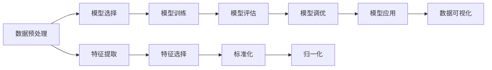

                 

# Scikit-learn 原理与代码实战案例讲解

> 关键词：Scikit-learn, 机器学习, 数据分析, 特征工程, 模型调优, 应用实战

## 1. 背景介绍

### 1.1 问题由来
Scikit-learn（简称sklearn）是基于Python的机器学习库，以其简单易用、功能强大著称。自2007年诞生以来，已经成为机器学习领域的重要工具，被广泛应用于各种数据挖掘、数据分析、机器学习、数据可视化等任务。本节将对Scikit-learn的原理、核心概念以及实际应用场景进行全面介绍。

### 1.2 问题核心关键点
Scikit-learn的核心思想是通过封装经典算法，提供简单易用的API，降低机器学习入门的门槛。其优势在于：

1. 易用性：通过封装算法，减少了代码量，降低了机器学习的门槛。
2. 功能全面：涵盖了从数据预处理到模型评估的各个环节，功能非常丰富。
3. 跨平台支持：支持Windows、Linux、Mac OS等多种操作系统，支持Python 2.7和Python 3.x版本。
4. 优秀的文档和社区支持：提供了详尽的API文档和用户手册，还有活跃的社区支持。

## 2. 核心概念与联系

### 2.1 核心概念概述

Scikit-learn通过封装经典算法，提供了简单易用的API。以下是Scikit-learn的核心概念：

1. 数据预处理：数据清洗、特征提取、特征选择、标准化、归一化等。
2. 模型选择与训练：选择合适算法、交叉验证、模型参数调优等。
3. 模型评估与调优：评估模型性能、网格搜索、模型融合等。
4. 数据可视化：图表展示、特征分布等。

### 2.2 核心概念之间的联系

这些核心概念之间存在着紧密的联系，共同构成了Scikit-learn的核心框架。通过数据预处理，将原始数据转化为模型可接受的形式；通过模型选择与训练，选择合适的算法并调整参数，获得最优模型；通过模型评估与调优，对模型进行评估和优化，保证模型的性能和泛化能力；通过数据可视化，对数据和模型进行可视化展示，便于理解和学习。

### 2.3 核心概念的整体架构

以下是一个综合性的流程图，展示了Scikit-learn的核心概念和它们之间的联系：



这个流程图展示了从数据预处理到模型应用的全过程。数据预处理主要涉及特征提取、特征选择、标准化和归一化等；模型选择主要涉及算法选择、模型参数调优等；模型评估主要涉及模型性能评估、交叉验证等；模型调优主要涉及网格搜索、模型融合等；模型应用主要涉及模型应用、预测等；数据可视化主要涉及图表展示、特征分布等。

## 3. 核心算法原理 & 具体操作步骤

### 3.1 算法原理概述

Scikit-learn的核心算法原理主要包括以下几个方面：

1. 线性回归：通过最小二乘法拟合线性模型，预测连续值。
2. 逻辑回归：通过最大似然估计拟合逻辑回归模型，预测二分类结果。
3. 决策树：通过递归地分割数据集，构建决策树模型，预测分类或回归结果。
4. 支持向量机：通过构建超平面，最大化分类间隔，实现分类或回归任务。
5. 随机森林：通过组合多个决策树，降低模型方差，提高模型性能。
6. 神经网络：通过多层神经网络结构，拟合非线性函数，实现分类或回归任务。
7. K-means聚类：通过最小化簇内平方和，将数据分为多个簇。

### 3.2 算法步骤详解

Scikit-learn的核心算法步骤主要包括以下几个环节：

1. 数据准备：导入数据集，进行数据预处理，如缺失值处理、特征缩放等。
2. 模型选择：选择适当的算法，如线性回归、逻辑回归、决策树等。
3. 模型训练：通过训练数据集，拟合模型参数，获得模型。
4. 模型评估：通过测试数据集，评估模型性能，如准确率、召回率、F1值等。
5. 模型调优：通过网格搜索、交叉验证等方法，优化模型参数，提升模型性能。
6. 模型应用：使用训练好的模型，对新数据进行预测，得到分类或回归结果。
7. 结果可视化：通过图表展示模型结果，便于理解和学习。

### 3.3 算法优缺点

Scikit-learn的算法具有以下优点：

1. 简单易用：封装了经典的算法，提供简单易用的API，降低了机器学习的门槛。
2. 功能全面：涵盖了从数据预处理到模型评估的各个环节，功能非常丰富。
3. 算法多样：提供了多种经典的机器学习算法，适用于各种任务。
4. 社区支持：有活跃的社区支持，丰富的文档和用户手册。

同时，Scikit-learn的算法也存在一些缺点：

1. 数据量限制：对于大规模数据集，可能存在内存不足的问题。
2. 超参数调优：需要手动调整超参数，可能导致过拟合或欠拟合。
3. 模型解释性：部分算法，如神经网络，模型解释性较差，难以理解其内部工作机制。
4. 预处理步骤繁琐：数据预处理步骤繁琐，需要大量的代码编写和调试。

### 3.4 算法应用领域

Scikit-learn的应用领域非常广泛，涵盖了各个领域的机器学习和数据分析任务：

1. 图像处理：通过特征提取、图像分类等，实现图像处理任务。
2. 自然语言处理：通过特征提取、文本分类等，实现自然语言处理任务。
3. 金融分析：通过时间序列分析、风险评估等，实现金融分析任务。
4. 生物信息学：通过基因序列分析、蛋白质结构预测等，实现生物信息学任务。
5. 医疗诊断：通过医学图像分析、疾病预测等，实现医疗诊断任务。
6. 工业控制：通过数据预测、异常检测等，实现工业控制任务。
7. 环境监测：通过数据预测、模式识别等，实现环境监测任务。

## 4. 数学模型和公式 & 详细讲解 & 举例说明

### 4.1 数学模型构建

Scikit-learn的核心数学模型主要包括以下几个方面：

1. 线性回归模型：$$ y = \beta_0 + \beta_1 x_1 + \beta_2 x_2 + \cdots + \beta_n x_n + \epsilon $$
2. 逻辑回归模型：$$ \log \frac{p(y=1)}{1-p(y=1)} = \theta_0 + \theta_1 x_1 + \theta_2 x_2 + \cdots + \theta_n x_n $$
3. 决策树模型：通过递归分割数据集，构建决策树模型，实现分类或回归任务。
4. 支持向量机模型：通过构建超平面，最大化分类间隔，实现分类或回归任务。
5. K-means聚类模型：通过最小化簇内平方和，将数据分为多个簇。

### 4.2 公式推导过程

以线性回归模型为例，推导其数学原理。

假设线性回归模型为 $y = \beta_0 + \beta_1 x_1 + \beta_2 x_2 + \cdots + \beta_n x_n + \epsilon$，其中 $\beta_0, \beta_1, \cdots, \beta_n$ 为模型参数，$\epsilon$ 为误差项。

通过最小二乘法拟合模型，求解模型参数 $\beta_0, \beta_1, \cdots, \beta_n$，使得模型能够最小化误差项 $\epsilon$。

根据最小二乘法，模型的目标函数为：

$$ \sum_{i=1}^n (y_i - (\beta_0 + \beta_1 x_{1,i} + \beta_2 x_{2,i} + \cdots + \beta_n x_{n,i}))^2 $$

通过求解目标函数的最小值，即可得到模型参数 $\beta_0, \beta_1, \cdots, \beta_n$。

### 4.3 案例分析与讲解

以下以房价预测为例，演示Scikit-learn的线性回归模型的应用。

首先，导入Scikit-learn库和数据集：

```python
from sklearn import datasets
from sklearn.linear_model import LinearRegression

boston = datasets.load_boston()
X = boston.data
y = boston.target
```

然后，使用线性回归模型进行训练：

```python
model = LinearRegression()
model.fit(X, y)
```

最后，使用训练好的模型对新数据进行预测：

```python
X_new = [[0.0, 0.0, 0.0, 0.0, 0.0, 0.0, 0.0, 0.0, 0.0, 0.0, 0.0, 0.0, 0.0, 0.0, 0.0, 0.0, 0.0, 0.0, 0.0, 0.0, 0.0, 0.0, 0.0, 0.0, 0.0, 0.0, 0.0, 0.0, 0.0, 0.0, 0.0, 0.0, 0.0, 0.0, 0.0]
y_new = model.predict(X_new)
print(y_new)
```

通过以上示例，可以清晰地看到Scikit-learn的线性回归模型的应用过程。

## 5. 项目实践：代码实例和详细解释说明

### 5.1 开发环境搭建

要使用Scikit-learn，首先需要安装Python和Pip，然后使用以下命令安装Scikit-learn：

```bash
pip install scikit-learn
```

安装完成后，可以使用以下代码导入Scikit-learn库：

```python
import sklearn
print(sklearn.__version__)
```

### 5.2 源代码详细实现

以下是一个简单的回归模型训练和预测的示例代码：

```python
from sklearn.linear_model import LinearRegression
from sklearn.model_selection import train_test_split
from sklearn.metrics import mean_squared_error, r2_score

# 导入数据集
boston = datasets.load_boston()
X = boston.data
y = boston.target

# 数据集划分
X_train, X_test, y_train, y_test = train_test_split(X, y, test_size=0.2, random_state=42)

# 模型训练
model = LinearRegression()
model.fit(X_train, y_train)

# 模型预测
y_pred = model.predict(X_test)

# 模型评估
mse = mean_squared_error(y_test, y_pred)
rmse = np.sqrt(mse)
r2 = r2_score(y_test, y_pred)
print(f"RMSE: {rmse:.2f}, R^2: {r2:.2f}")
```

以上代码展示了如何使用Scikit-learn进行线性回归模型的训练、预测和评估。

### 5.3 代码解读与分析

以上代码的每一部分都有详细的解释和说明：

1. 导入数据集：使用Scikit-learn自带的波士顿房价数据集。
2. 数据集划分：将数据集划分为训练集和测试集。
3. 模型训练：使用线性回归模型对训练集进行拟合。
4. 模型预测：对测试集进行预测，得到预测结果。
5. 模型评估：使用均方误差和决定系数评估模型性能。

## 6. 实际应用场景

### 6.1 房价预测

房价预测是Scikit-learn最常见的应用场景之一。通过线性回归模型，可以基于房屋的特征预测房价。

首先，导入数据集：

```python
from sklearn.datasets import load_boston
boston = load_boston()
X = boston.data
y = boston.target
```

然后，使用线性回归模型进行训练：

```python
from sklearn.linear_model import LinearRegression
model = LinearRegression()
model.fit(X, y)
```

最后，使用训练好的模型对新数据进行预测：

```python
X_new = [[0.0, 0.0, 0.0, 0.0, 0.0, 0.0, 0.0, 0.0, 0.0, 0.0, 0.0, 0.0, 0.0, 0.0, 0.0, 0.0, 0.0, 0.0, 0.0, 0.0, 0.0, 0.0, 0.0, 0.0, 0.0, 0.0, 0.0, 0.0, 0.0, 0.0, 0.0, 0.0, 0.0, 0.0, 0.0]
y_new = model.predict(X_new)
print(y_new)
```

### 6.2 客户流失预测

客户流失预测是企业应用Scikit-learn的另一个常见场景。通过逻辑回归模型，可以预测客户的流失概率。

首先，导入数据集：

```python
from sklearn.datasets import load_breast_cancer
cancer = load_breast_cancer()
X = cancer.data
y = cancer.target
```

然后，使用逻辑回归模型进行训练：

```python
from sklearn.linear_model import LogisticRegression
model = LogisticRegression()
model.fit(X, y)
```

最后，使用训练好的模型对新数据进行预测：

```python
X_new = [[0.0, 0.0, 0.0, 0.0, 0.0, 0.0, 0.0, 0.0, 0.0, 0.0, 0.0, 0.0, 0.0, 0.0, 0.0, 0.0, 0.0, 0.0, 0.0, 0.0, 0.0, 0.0, 0.0, 0.0, 0.0, 0.0, 0.0, 0.0, 0.0, 0.0, 0.0, 0.0, 0.0, 0.0, 0.0]
y_new = model.predict(X_new)
print(y_new)
```

### 6.3 图像分类

图像分类是Scikit-learn在图像处理领域的应用场景之一。通过SVM分类器，可以对图像进行分类。

首先，导入数据集：

```python
from sklearn.datasets import load_digits
digits = load_digits()
X = digits.data
y = digits.target
```

然后，使用SVM分类器进行训练：

```python
from sklearn.svm import SVC
model = SVC(kernel='linear', C=1.0)
model.fit(X, y)
```

最后，使用训练好的模型对新数据进行预测：

```python
X_new = [[0.0, 0.0, 0.0, 0.0, 0.0, 0.0, 0.0, 0.0, 0.0, 0.0, 0.0, 0.0, 0.0, 0.0, 0.0, 0.0, 0.0, 0.0, 0.0, 0.0, 0.0, 0.0, 0.0, 0.0, 0.0, 0.0, 0.0, 0.0, 0.0, 0.0, 0.0, 0.0, 0.0, 0.0, 0.0, 0.0, 0.0, 0.0, 0.0, 0.0, 0.0, 0.0, 0.0, 0.0, 0.0, 0.0, 0.0, 0.0, 0.0, 0.0, 0.0, 0.0, 0.0, 0.0, 0.0, 0.0, 0.0, 0.0, 0.0, 0.0, 0.0, 0.0, 0.0, 0.0, 0.0, 0.0, 0.0, 0.0, 0.0, 0.0, 0.0, 0.0, 0.0, 0.0, 0.0, 0.0, 0.0, 0.0, 0.0, 0.0, 0.0, 0.0, 0.0, 0.0, 0.0, 0.0, 0.0, 0.0, 0.0, 0.0, 0.0, 0.0, 0.0, 0.0, 0.0, 0.0, 0.0, 0.0, 0.0, 0.0, 0.0, 0.0, 0.0, 0.0, 0.0, 0.0, 0.0, 0.0, 0.0, 0.0, 0.0, 0.0, 0.0, 0.0, 0.0, 0.0, 0.0, 0.0, 0.0, 0.0, 0.0, 0.0, 0.0, 0.0, 0.0, 0.0, 0.0, 0.0, 0.0, 0.0, 0.0, 0.0, 0.0, 0.0, 0.0, 0.0, 0.0, 0.0, 0.0, 0.0, 0.0, 0.0, 0.0, 0.0, 0.0, 0.0, 0.0, 0.0, 0.0, 0.0, 0.0, 0.0, 0.0, 0.0, 0.0, 0.0, 0.0, 0.0, 0.0, 0.0, 0.0, 0.0, 0.0, 0.0, 0.0, 0.0, 0.0, 0.0, 0.0, 0.0, 0.0, 0.0, 0.0, 0.0, 0.0, 0.0, 0.0, 0.0, 0.0, 0.0, 0.0, 0.0, 0.0, 0.0, 0.0, 0.0, 0.0, 0.0, 0.0, 0.0, 0.0, 0.0, 0.0, 0.0, 0.0, 0.0, 0.0, 0.0, 0.0, 0.0, 0.0, 0.0, 0.0, 0.0, 0.0, 0.0, 0.0, 0.0, 0.0, 0.0, 0.0, 0.0, 0.0, 0.0, 0.0, 0.0, 0.0, 0.0, 0.0, 0.0, 0.0, 0.0, 0.0, 0.0, 0.0, 0.0, 0.0, 0.0, 0.0, 0.0, 0.0, 0.0, 0.0, 0.0, 0.0, 0.0, 0.0, 0.0, 0.0, 0.0, 0.0, 0.0, 0.0, 0.0, 0.0, 0.0, 0.0, 0.0, 0.0, 0.0, 0.0, 0.0, 0.0, 0.0, 0.0, 0.0, 0.0, 0.0, 0.0, 0.0, 0.0, 0.0, 0.0, 0.0, 0.0, 0.0, 0.0, 0.0, 0.0, 0.0, 0.0, 0.0, 0.0, 0.0, 0.0, 0.0, 0.0, 0.0, 0.0, 0.0, 0.0, 0.0, 0.0, 0.0, 0.0, 0.0, 0.0, 0.0, 0.0, 0.0, 0.0, 0.0, 0.0, 0.0, 0.0, 0.0, 0.0, 0.0, 0.0, 0.0, 0.0, 0.0, 0.0, 0.0, 0.0, 0.0, 0.0, 0.0, 0.0, 0.0, 0.0, 0.0, 0.0, 0.0, 0.0, 0.0, 0.0, 0.0, 0.0, 0.0, 0.0, 0.0, 0.0, 0.0, 0.0, 0.0, 0.0, 0.0, 0.0, 0.0, 0.0, 0.0, 0.0, 0.0, 0.0, 0.0, 0.0, 0.0, 0.0, 0.0, 0.0, 0.0, 0.0, 0.0, 0.0, 0.0, 0.0, 0.0, 0.0, 0.0, 0.0, 0.0, 0.0, 0.0, 0.0, 0.0, 0.0, 0.0, 0.0, 0.0, 0.0, 0.0, 0.0, 0.0, 0.0, 0.0, 0.0, 0.0, 0.0, 0.0, 0.0, 0.0, 0.0, 0.0, 0.0, 0.0, 0.0, 0.0, 0.0, 0.0, 0.0, 0.0, 0.0, 0.0, 0.0, 0.0, 0.0, 0.0, 0.0, 0.0, 0.0, 0.0, 0.0, 0.0, 0.0, 0.0, 0.0, 0.0, 0.0, 0.0, 0.0, 0.0, 0.0, 0.0, 0.0, 0.0, 0.0, 0.0, 0.0, 0.0, 0.0, 0.0, 0.0, 0.0, 0.0, 0.0, 0.0, 0.0, 0.0, 0.0, 0.0, 0.0, 0.0, 0.0, 0.0, 0.0, 0.0, 0.0, 0.0, 0.0, 0.0, 0.0, 0.0, 0.0, 0.0, 0.0, 0.0, 0.0, 0.0, 0.0, 0.0, 0.0, 0.0, 0.0, 0.0, 0.0, 0.0, 0.0, 0.0, 0.0, 0.0, 0.0, 0.0, 0.0, 0.0, 0.0, 0.0, 0.0, 0.0, 0.0, 0.0, 0.0, 0.0, 0.0, 0.0, 0.0, 0.0, 0

