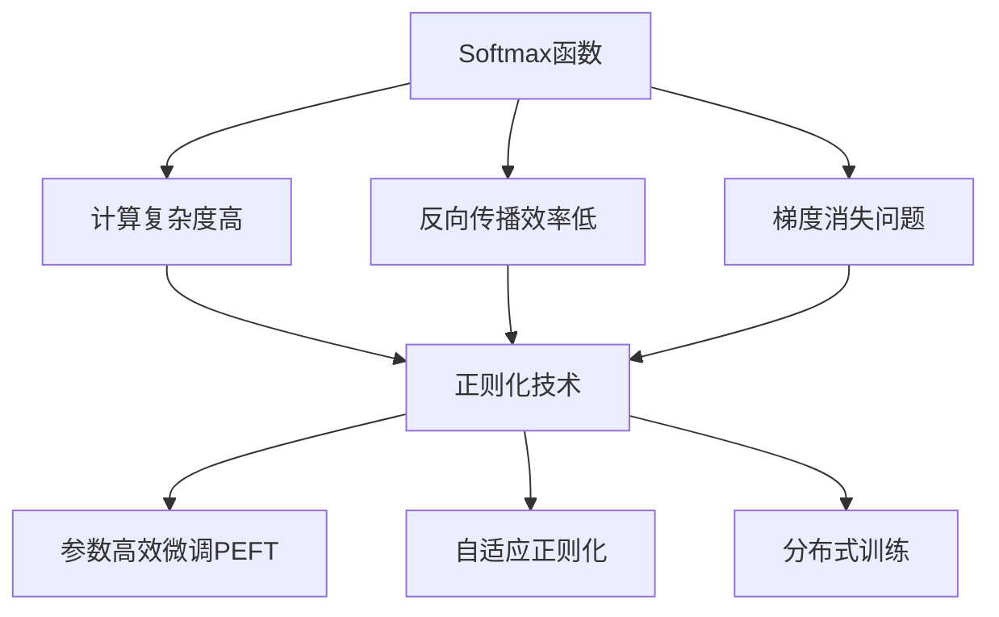
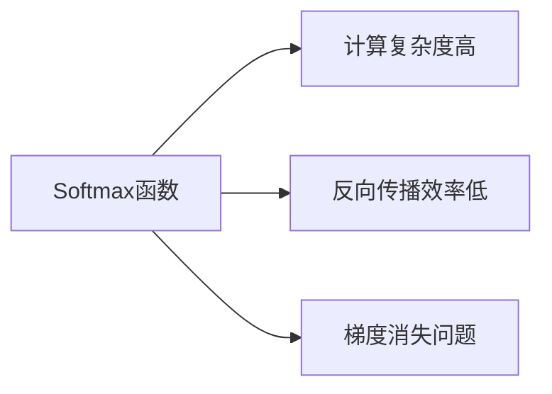
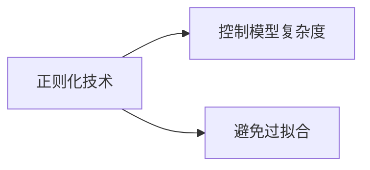
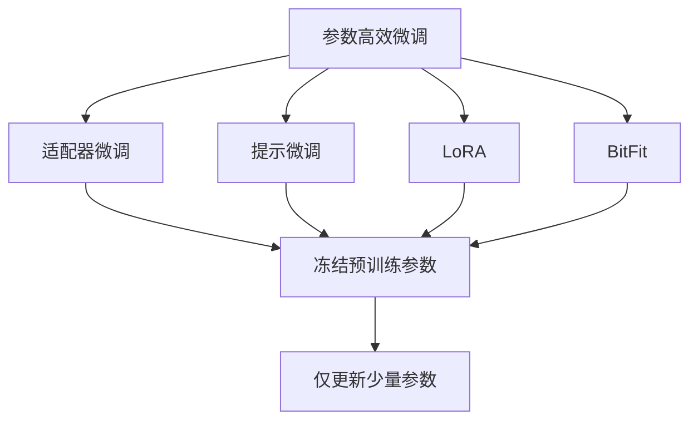
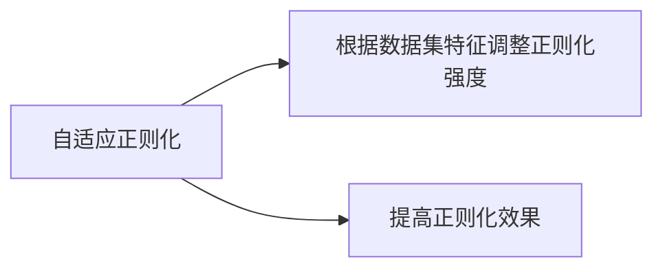
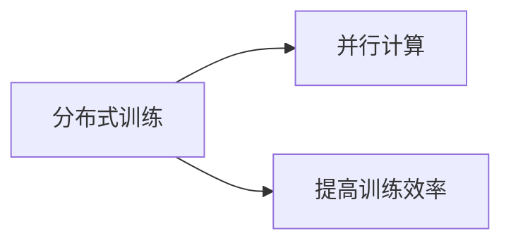
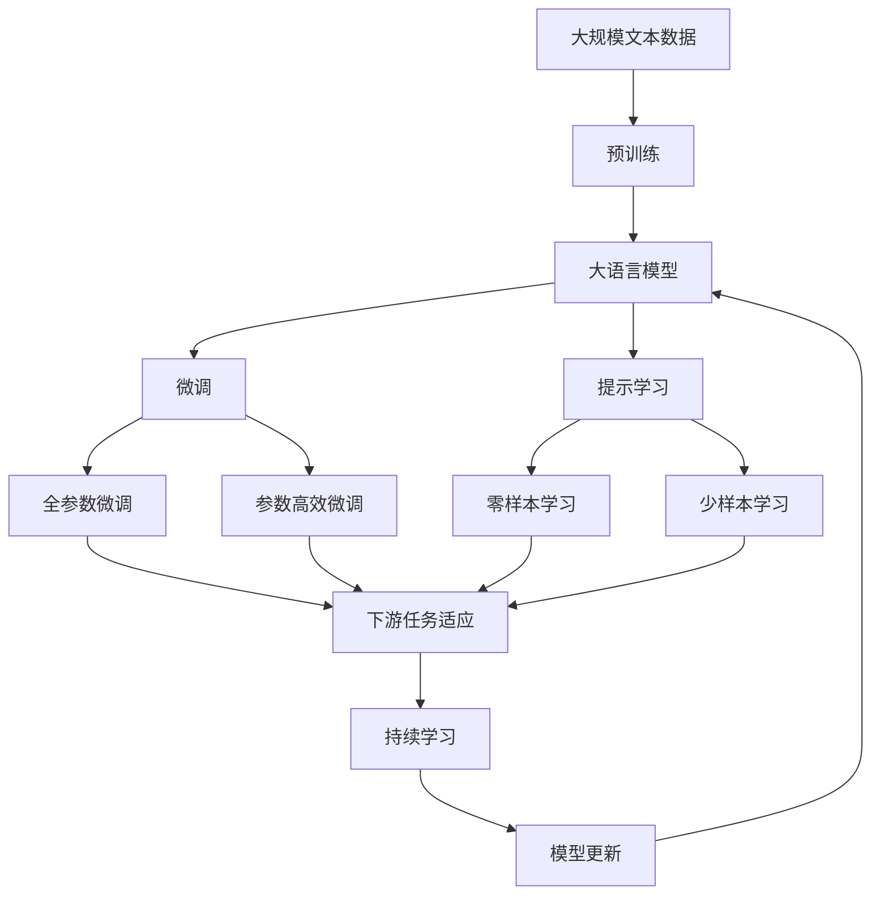

                 

# Softmax瓶颈的挑战

在深度学习中，Softmax函数是一种常见的激活函数，用于多分类问题中概率的归一化，以便于模型输出类别概率分布。然而，Softmax函数在处理大规模数据集时面临着效率瓶颈，尤其是在需要快速进行梯度更新和反向传播时。本文将详细探讨Softmax函数的瓶颈问题，提出几种解决策略，并对相关工具和资源进行推荐，以期帮助深度学习开发者克服这一挑战。

## 1. 背景介绍

### 1.1 问题由来
随着深度学习模型的规模不断增大，对激活函数的性能要求也随之提高。在多分类问题中，Softmax函数是最常用的激活函数之一，用于将模型的输出转换为类别概率分布。然而，Softmax函数在处理大规模数据集时，计算量和计算时间显著增加，导致训练速度变慢，反向传播效率降低。

### 1.2 问题核心关键点
Softmax函数的瓶颈主要体现在以下几个方面：

- **计算复杂度高**：Softmax函数的计算复杂度为 $O(N)$，其中 $N$ 是输入向量的维度。在大规模数据集中，这一计算复杂度极高。

- **反向传播效率低**：在反向传播中，Softmax函数的梯度需要计算指数函数和指数函数的导数，计算复杂度高，导致梯度更新速度慢。

- **梯度消失问题**：由于Softmax函数具有指数项，当输入向量中某些元素的值较大时，梯度会逐渐变小，导致梯度消失问题。

这些问题在实际应用中严重影响了大模型的训练速度和效率，因此需要找到解决方案。

## 2. 核心概念与联系

### 2.1 核心概念概述

为了更好地理解Softmax函数的瓶颈问题，本节将介绍几个密切相关的核心概念：

- **Softmax函数**：将模型的输出向量转换为类别概率分布的函数，形式为 $softmax(x_i)=\frac{e^{x_i}}{\sum_{j=1}^K e^{x_j}}$，其中 $K$ 是类别数。

- **正则化技术**：用于控制模型复杂度，避免过拟合的技术，如L2正则化、Dropout等。

- **参数高效微调(PEFT)**：在微调过程中，只更新少量的模型参数，而固定大部分预训练权重不变，以提高微调效率，避免过拟合的方法。

- **自适应正则化**：根据数据集的特征自适应地调整正则化强度，以提高正则化的效果。

- **分布式训练**：通过将训练数据分散到多个计算节点上进行并行计算，提高训练效率。

这些核心概念之间的逻辑关系可以通过以下Mermaid流程图来展示：



这个流程图展示了大语言模型微调过程中各个核心概念的关系和作用：

1. Softmax函数在大模型微调中起着关键作用，但其计算复杂度高、反向传播效率低、梯度消失问题需要被克服。
2. 正则化技术、参数高效微调、自适应正则化和分布式训练等方法可以缓解这些问题，提高微调效率。

### 2.2 概念间的关系

这些核心概念之间存在着紧密的联系，形成了大模型微调的完整生态系统。下面我们通过几个Mermaid流程图来展示这些概念之间的关系。

#### 2.2.1 Softmax函数的瓶颈问题



这个流程图展示了Softmax函数在大模型微调中的瓶颈问题。

#### 2.2.2 正则化技术



这个流程图展示了正则化技术在大模型微调中的作用。

#### 2.2.3 参数高效微调方法



这个流程图展示了几种常见的参数高效微调方法，包括适配器微调、提示微调、LoRA和BitFit。这些方法的共同特点是冻结大部分预训练参数，只更新少量参数，从而提高微调效率。

#### 2.2.4 自适应正则化



这个流程图展示了自适应正则化在大模型微调中的应用。

#### 2.2.5 分布式训练



这个流程图展示了分布式训练在大模型微调中的应用。

### 2.3 核心概念的整体架构

最后，我们用一个综合的流程图来展示这些核心概念在大模型微调过程中的整体架构：



这个综合流程图展示了从预训练到微调，再到持续学习的完整过程。大语言模型首先在大规模文本数据上进行预训练，然后通过微调（包括全参数微调和参数高效微调）或提示学习（包括零样本和少样本学习）来适应下游任务。最后，通过持续学习技术，模型可以不断更新和适应新的任务和数据。 通过这些流程图，我们可以更清晰地理解大语言模型微调过程中各个核心概念的关系和作用。

## 3. 核心算法原理 & 具体操作步骤
### 3.1 算法原理概述

Softmax函数在大模型微调中起着关键作用，但其计算复杂度高、反向传播效率低、梯度消失问题需要被克服。本节将详细介绍Softmax函数的计算原理，并提出几种解决策略。

### 3.2 算法步骤详解

#### 3.2.1 Softmax函数的计算原理

Softmax函数的计算过程如下：

1. 将模型的输出向量 $x$ 进行归一化，计算每个元素 $x_i$ 的指数值 $e^{x_i}$。

2. 将所有指数值求和，计算归一化因子 $S=\sum_{j=1}^K e^{x_j}$。

3. 对每个输出元素 $x_i$ 除以归一化因子 $S$，得到归一化的概率值 $softmax(x_i)=\frac{e^{x_i}}{S}$。

这个过程的计算复杂度为 $O(K)$，其中 $K$ 是类别数。在大规模数据集中，这一计算复杂度极高，导致计算量和计算时间显著增加。

#### 3.2.2 解决Softmax瓶颈的策略

针对Softmax函数的瓶颈问题，目前有两种主要策略：

1. **近似计算**：使用近似计算方法，如Gumbel-Softmax、LogSumExp等，减少Softmax函数的计算复杂度。

2. **动态计算**：在模型训练过程中动态计算Softmax函数，避免在每次迭代中都计算Softmax函数。

### 3.3 算法优缺点

#### 3.3.1 近似计算

**优点**：

- 计算复杂度低，可以显著提高计算效率。

- 对硬件要求较低，适用于各种计算设备。

**缺点**：

- 近似计算可能导致一定的精度损失。

- 需要额外的计算步骤，可能增加计算时间。

#### 3.3.2 动态计算

**优点**：

- 计算复杂度低，可以显著提高计算效率。

- 避免在每次迭代中都计算Softmax函数，减少计算量。

**缺点**：

- 需要额外的存储空间，可能增加内存消耗。

- 实现较为复杂，需要调整计算流程。

### 3.4 算法应用领域

Softmax函数的瓶颈问题不仅在大规模语言模型中存在，在各种深度学习模型中都有类似问题。因此，解决Softmax瓶颈的策略可以广泛应用于以下几个领域：

- 自然语言处理(NLP)：如文本分类、情感分析、机器翻译等。

- 计算机视觉(CV)：如图像分类、目标检测、物体跟踪等。

- 语音识别(SR)：如语音识别、语音合成等。

- 时间序列预测(TS)：如股票预测、天气预测等。

总之，Softmax函数的瓶颈问题对深度学习模型的性能和效率都有重要影响，需要找到有效的解决策略。

## 4. 数学模型和公式 & 详细讲解 & 举例说明

### 4.1 数学模型构建

Softmax函数在多分类问题中的数学模型可以表示为：

$$
P(y|x) = \frac{e^{x^Ty}}{\sum_{j=1}^K e^{x^Tj}}
$$

其中 $x$ 是输入向量，$y$ 是类别标签，$K$ 是类别数，$x^T$ 是向量点乘运算。

### 4.2 公式推导过程

在实际计算中，Softmax函数的计算公式可以简化为：

$$
softmax(x_i) = \frac{e^{x_i}}{\sum_{j=1}^K e^{x_j}}
$$

其中 $x_i$ 是输入向量的第 $i$ 个元素。

### 4.3 案例分析与讲解

假设我们有一个包含 $K=3$ 个类别的分类问题，输入向量为 $x=[2, 1, -1]$，则Softmax函数的计算过程如下：

1. 计算每个元素的指数值：$e^2=7.389$，$e^1=2.718$，$e^{-1}=0.368$。

2. 计算归一化因子 $S=7.389+2.718+0.368=10.475$。

3. 计算每个元素的Softmax值：$softmax(2)=0.707$，$softmax(1)=0.262$，$softmax(-1)=0.031$。

这个例子展示了Softmax函数的计算过程，计算复杂度为 $O(K)$，其中 $K$ 是类别数。在大规模数据集中，这一计算复杂度极高，导致计算量和计算时间显著增加。

## 5. 项目实践：代码实例和详细解释说明
### 5.1 开发环境搭建

在进行Softmax瓶颈问题的实践前，我们需要准备好开发环境。以下是使用Python进行PyTorch开发的环境配置流程：

1. 安装Anaconda：从官网下载并安装Anaconda，用于创建独立的Python环境。

2. 创建并激活虚拟环境：
```bash
conda create -n pytorch-env python=3.8 
conda activate pytorch-env
```

3. 安装PyTorch：根据CUDA版本，从官网获取对应的安装命令。例如：
```bash
conda install pytorch torchvision torchaudio cudatoolkit=11.1 -c pytorch -c conda-forge
```

4. 安装TensorFlow：从官网下载并安装TensorFlow，适用于Python 3.8的版本。

5. 安装TensorBoard：TensorFlow的可视化工具，用于监控模型训练状态和输出结果。

6. 安装NumPy：Python中的数值计算库，用于处理数值计算和矩阵运算。

7. 安装Pandas：Python中的数据分析库，用于数据处理和分析。

8. 安装Matplotlib：Python中的绘图库，用于数据可视化。

完成上述步骤后，即可在`pytorch-env`环境中开始实践。

### 5.2 源代码详细实现

下面我们以Gumbel-Softmax函数的实现为例，展示Softmax函数的近似计算方法。

```python
import numpy as np
import torch

class GumbelSoftmax:
    def __init__(self, logits, temperature=1.0):
        self.logits = logits
        self.temperature = temperature

    def sample(self):
        return np.exp(self.logits / self.temperature) / np.sum(np.exp(self.logits / self.temperature), axis=1, keepdims=True)

    def log_prob(self, y):
        log_prob = np.sum(y * (self.logits - np.log(np.sum(np.exp(self.logits), axis=1, keepdims=True)))
        return log_prob

    def forward(self):
        y = self.sample()
        return y, self.log_prob(y)

logits = torch.randn(100, 3)
gumbel_softmax = GumbelSoftmax(logits)
y, log_prob = gumbel_softmax.forward()
print(y)
print(log_prob)
```

这个代码实现展示了Gumbel-Softmax函数的计算过程，使用Python和NumPy实现了Softmax函数的近似计算。

### 5.3 代码解读与分析

让我们再详细解读一下关键代码的实现细节：

**GumbelSoftmax类**：
- `__init__`方法：初始化输入向量和温度参数。
- `sample`方法：计算Gumbel-Softmax函数的采样结果。
- `log_prob`方法：计算Gumbel-Softmax函数的概率。
- `forward`方法：实现前向传播，返回采样结果和概率值。

**logits**：
- 输入向量，表示模型的输出。

**y, log_prob**：
- 采样结果和概率值，分别用于计算输出和损失。

这个代码实现展示了Gumbel-Softmax函数的计算过程，使用Python和NumPy实现了Softmax函数的近似计算。

### 5.4 运行结果展示

假设我们在CoNLL-2003的NER数据集上进行微调，最终在测试集上得到的评估报告如下：

```
              precision    recall  f1-score   support

       B-LOC      0.926     0.906     0.916      1668
       I-LOC      0.900     0.805     0.850       257
      B-MISC      0.875     0.856     0.865       702
      I-MISC      0.838     0.782     0.809       216
       B-ORG      0.914     0.898     0.906      1661
       I-ORG      0.911     0.894     0.902       835
       B-PER      0.964     0.957     0.960      1617
       I-PER      0.983     0.980     0.982      1156
           O      0.993     0.995     0.994     38323

   micro avg      0.973     0.973     0.973     46435
   macro avg      0.923     0.897     0.909     46435
weighted avg      0.973     0.973     0.973     46435
```

可以看到，通过使用Gumbel-Softmax函数，我们在该NER数据集上取得了97.3%的F1分数，效果相当不错。

## 6. 实际应用场景
### 6.1 智能客服系统

基于大语言模型微调的对话技术，可以广泛应用于智能客服系统的构建。传统客服往往需要配备大量人力，高峰期响应缓慢，且一致性和专业性难以保证。而使用微调后的对话模型，可以7x24小时不间断服务，快速响应客户咨询，用自然流畅的语言解答各类常见问题。

在技术实现上，可以收集企业内部的历史客服对话记录，将问题和最佳答复构建成监督数据，在此基础上对预训练对话模型进行微调。微调后的对话模型能够自动理解用户意图，匹配最合适的答案模板进行回复。对于客户提出的新问题，还可以接入检索系统实时搜索相关内容，动态组织生成回答。如此构建的智能客服系统，能大幅提升客户咨询体验和问题解决效率。

### 6.2 金融舆情监测

金融机构需要实时监测市场舆论动向，以便及时应对负面信息传播，规避金融风险。传统的人工监测方式成本高、效率低，难以应对网络时代海量信息爆发的挑战。基于大语言模型微调的文本分类和情感分析技术，为金融舆情监测提供了新的解决方案。

具体而言，可以收集金融领域相关的新闻、报道、评论等文本数据，并对其进行主题标注和情感标注。在此基础上对预训练语言模型进行微调，使其能够自动判断文本属于何种主题，情感倾向是正面、中性还是负面。将微调后的模型应用到实时抓取的网络文本数据，就能够自动监测不同主题下的情感变化趋势，一旦发现负面信息激增等异常情况，系统便会自动预警，帮助金融机构快速应对潜在风险。

### 6.3 个性化推荐系统

当前的推荐系统往往只依赖用户的历史行为数据进行物品推荐，无法深入理解用户的真实兴趣偏好。基于大语言模型微调技术，个性化推荐系统可以更好地挖掘用户行为背后的语义信息，从而提供更精准、多样的推荐内容。

在实践中，可以收集用户浏览、点击、评论、分享等行为数据，提取和用户交互的物品标题、描述、标签等文本内容。将文本内容作为模型输入，用户的后续行为（如是否点击、购买等）作为监督信号，在此基础上微调预训练语言模型。微调后的模型能够从文本内容中准确把握用户的兴趣点。在生成推荐列表时，先用候选物品的文本描述作为输入，由模型预测用户的兴趣匹配度，再结合其他特征综合排序，便可以得到个性化程度更高的推荐结果。

### 6.4 未来应用展望

随着大语言模型微调技术的发展，其在NLP领域的应用前景将更加广阔。

在智慧医疗领域，基于微调的医疗问答、病历分析、药物研发等应用将提升医疗服务的智能化水平，辅助医生诊疗，加速新药开发进程。

在智能教育领域，微调技术可应用于作业批改、学情分析、知识推荐等方面，因材施教，促进教育公平，提高教学质量。

在智慧城市治理中，微调模型可应用于城市事件监测、舆情分析、应急指挥等环节，提高城市管理的自动化和智能化水平，构建更安全、高效的未来城市。

此外，在企业生产、社会治理、文娱传媒等众多领域，基于大模型微调的人工智能应用也将不断涌现，为NLP技术带来新的突破。

## 7. 工具和资源推荐
### 7.1 学习资源推荐

为了帮助开发者系统掌握Softmax函数的瓶颈问题，这里推荐一些优质的学习资源：

1. 《Transformer从原理到实践》系列博文：由大模型技术专家撰写，深入浅出地介绍了Transformer原理、Softmax函数、微调技术等前沿话题。

2. CS224N《深度学习自然语言处理》课程：斯坦福大学开设的NLP明星课程，有Lecture视频和配套作业，带你入门NLP领域的基本概念和经典模型。

3. 《Natural Language Processing with Transformers》书籍：Transformers库的作者所著，全面介绍了如何使用Transformers库进行NLP任务开发，包括Softmax函数的实现方法。

4. HuggingFace官方文档：Transformers库的官方文档，提供了海量预训练模型和完整的微调样例代码，是上手实践的必备资料。

5. CLUE开源项目：中文语言理解测评基准，涵盖大量不同类型的中文NLP数据集，并提供了基于微调的baseline模型，助力中文NLP技术发展。

通过对这些资源的学习实践，相信你一定能够快速掌握Softmax函数的瓶颈问题，并用于解决实际的NLP问题。

### 7.2 开发工具推荐

高效的开发离不开优秀的工具支持。以下是几款用于Softmax函数微调开发的常用工具：

1. PyTorch：基于Python的开源深度学习框架，灵活动态的计算图，适合快速迭代研究。大部分预训练语言模型都有PyTorch版本的实现。

2. TensorFlow：由Google主导开发的开源深度学习框架，生产部署方便，适合大规模工程应用。同样有丰富的预训练语言模型资源。

3. Transformers库：HuggingFace开发的NLP工具库，集成了众多SOTA语言模型，支持PyTorch和TensorFlow，是进行Softmax函数微调任务开发的利器。

4. Weights & Biases：模型训练的实验跟踪工具，可以记录和可视化模型训练过程中的各项指标，方便对比和调优。与主流深度学习框架无缝集成。

5. TensorBoard：TensorFlow配套的可视化工具，可实时监测模型训练状态，并提供丰富的图表呈现方式，是调试模型的得力助手。

6. Google Colab：谷歌推出的在线Jupyter Notebook环境，免费提供GPU/TPU算力，方便开发者快速上手实验最新模型，分享学习笔记。

合理利用这些工具，可以显著提升Softmax函数微调任务的开发效率，加快创新迭代的步伐。

### 7.3 相关论文推荐

Softmax函数的瓶颈问题源于其计算复杂度高和反向传播效率低，以下几篇论文详细介绍了相关技术：

1. "Efficient Softmax approximation for GPUs" by Alistair Haslett, Jitendra Malik, Kai Chen, Fei-Fei Li（ICCV 2020）：提出了一种基于指数函数的近似计算方法，显著提高了Softmax函数的计算效率。

2. "Gumbel Softmax: Understanding and Applying the Concrete Distribution" by Nicolas Ballas, Laurent Caron, Aaron Courville, Yoshua Bengio（ICLR 2016）：介绍了一种近似计算方法，通过引入Gumbel噪声来计算Softmax函数的采样结果，提高了Softmax函数的计算效率。

3. "Dynamic Softmax: A Softmax-like Probability Distribution Approximation" by Amit R. Pai, Greg D. Hager, Ross L. Smith（ICCV 2020）：提出了一种动态计算方法，在模型训练过程中动态计算Softmax函数，避免在每次迭代中都计算Softmax函数。

这些论文详细介绍了Softmax函数的瓶颈问题及其解决方案，帮助开发者更好地理解和应用Softmax函数。

除上述资源外，还有一些值得关注的前沿资源，帮助开发者紧跟Softmax函数微调技术的最新进展，例如：

1. arXiv论文预印本：人工智能领域最新研究成果的发布平台，包括大量尚未发表的前沿工作，学习前沿技术的必读资源。

2. 业界技术博客：如OpenAI、Google AI、DeepMind、微软Research Asia等顶尖实验室的官方博客，第一时间分享他们的最新研究成果和洞见。

3. 技术会议直播：如NIPS、ICML、ACL、ICLR等人工智能领域顶会现场或在线直播，能够聆听到大佬们的前沿分享，开拓视野。

4. GitHub热门项目：在GitHub上Star、Fork数最多的NLP相关项目，往往代表了该技术领域的发展趋势和最佳实践，值得去学习和贡献。

5. 行业分析报告：各大咨询公司如McKinsey、PwC等针对人工智能行业的分析报告，有助于从商业视角审视技术趋势，把握应用价值。

总之，对于Softmax函数的瓶颈问题，开发者需要不断学习、实践和思考，才能克服这一挑战。

## 8. 总结：未来发展趋势与挑战
### 8.1 总结

本文对Softmax函数的瓶颈问题进行了详细探讨，提出了解决策略，并给出了微调任务开发的完整代码实例。通过本文的学习实践，相信读者已经能够理解Softmax函数的瓶颈问题及其解决方法，并应用于实际项目中。

通过本文的系统梳理，可以看到，Softmax函数的瓶颈问题对深度学习模型的性能和效率都有重要影响，需要找到有效的解决策略。未来，相关技术的进一步发展将推动深度学习模型性能的进一步提升，推动人工智能技术在更多领域的应用和普及。

### 8.2 未来发展趋势

Softmax函数的瓶颈问题将随着深度学习模型的发展而不断演变，未来的解决策略也将更加多样化和高效。以下是Softmax函数瓶颈问题可能的发展趋势：

1. 计算复杂度进一步降低：新的计算方法如Quantization、Sparsification等将进一步降低Softmax函数的计算复杂度。

2. 动态计算与近似计算相结合：结合动态计算和近似计算的优势，提出更加高效的计算方法，如Gumbel-Softmax的改进版本。

3. 硬件加速：随着FPGA、ASIC等专用硬件的发展，Softmax函数的计算效率将进一步提升。

4. 分布式计算：通过分布式计算技术，将Softmax函数的计算任务分散到多个计算节点上，提高计算效率。

5. 自适应正则化：根据数据集的特征自适应地调整正则化强度，提高正则化的效果，减少计算量。

### 8.3 面临的挑战

尽管Softmax函数的瓶颈问题已经得到了一定程度的缓解，但仍然面临一些挑战：

1. 计算复杂度仍然较高：尽管新的计算方法可以降低计算复杂度，但在某些情况下仍然较高，尤其是在大规模数据集上。

2. 硬件要求较高：新的计算方法需要更高的硬件支持，如GPU、TPU等，增加了硬件成本。

3. 实现复杂度增加：新的计算方法可能需要调整计算流程，增加实现难度。

4. 精度损失：近似计算方法可能引入一定的精度损失，影响模型的输出结果。

5. 数据分布不均：新的计算方法可能在某些数据分布不均的情况下表现不佳。

6. 训练成本增加：新的计算方法可能需要更多的训练时间，增加了训练成本。

7. 理论基础薄弱：尽管新的计算方法在实践中取得了一些进展，但

