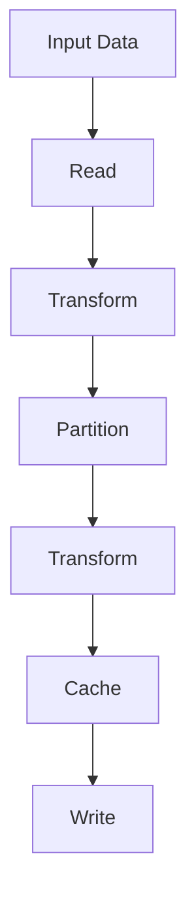

                 

# Spark Partitioner原理与代码实例讲解

> 关键词：Spark, Partitioning, Data Localization, Performance Optimization, Resilient Distributed Datasets (RDDs), Python API, Java API

## 1. 背景介绍

### 1.1 问题由来
在分布式计算框架中，数据并行处理是提高效率的关键。Spark作为大数据处理的主流框架，提供了一套强大的数据处理机制，其中数据分片和分区（Partitioning）是Spark性能优化的重要手段之一。通过合理的数据分区策略，可以显著提升Spark应用的执行效率，减少数据传输，提高数据访问速度，进而提升整个系统的性能。本文将详细阐述Spark中的Partitioner原理，并通过代码实例演示其应用。

### 1.2 问题核心关键点
Spark中的Partitioner主要用于将数据按照特定规则进行分区，以实现高效的数据访问和并行处理。常见的Partitioner包括哈希分区（Hash Partitioner）、范围分区（RangePartitioner）、自定义分区器（Custom Partitioner）等。Partitioner的核心在于将输入数据划分为多个分区，并将这些分区分配给不同的执行节点，从而实现并行处理。

## 2. 核心概念与联系

### 2.1 核心概念概述
Spark的分区机制是其并行处理能力的重要组成部分。在Spark中，数据分区通过Partitioner实现。Partitioner的作用是根据数据特征将输入数据划分为若干个分区，并将这些分区分配给不同的执行节点。

### 2.2 核心概念的联系
Spark中的数据处理过程包括数据的持久化和分区，这两者密切相关。分区是Spark数据处理的基础，而持久化则是在分区基础上的优化手段，用于缓存中间结果，提高数据访问速度，减少IO开销。

以下是一个Mermaid流程图，展示了Spark数据处理的基本流程，包括分区和持久化：



在这个流程图中，数据首先通过读取（Read）操作输入到Spark中，经过转换（Transform）操作后，数据被分区（Partition），并再次经过转换（Transform）操作。最后，经过持久化（Cache）缓存中间结果后，数据最终被写入（Write）到存储系统中。

### 2.3 核心概念的整体架构
Spark的分区机制主要包括以下几个关键组件：

- Partitioner：用于将数据分区，并将分区分配给执行节点。
- Resilient Distributed Dataset (RDD)：Spark的基本数据结构，包括数据分区和持久化机制。
- Transformation：用于对数据进行转换操作，包括Filter、Map、GroupByKey等。
- Action：用于对数据进行最终处理操作，包括Count、Save、CountDistinct等。

## 3. 核心算法原理 & 具体操作步骤

### 3.1 算法原理概述
Spark中的分区器（Partitioner）是实现数据分区的核心组件。Partitioner通过将数据划分到不同的分区中，使得不同执行节点可以并行处理这些分区，从而提升数据处理效率。Partitioner的实现可以分为两种方式：基于哈希的分区和基于范围的分区。

- **哈希分区**：将数据通过哈希函数映射到不同的分区中。这种分区方式适合于随机分布的数据，能够实现较好的数据均衡。
- **范围分区**：根据数据的范围将数据分区。这种分区方式适合于有序数据，能够实现较好的数据局部性。

### 3.2 算法步骤详解
Spark中的分区器实现步骤如下：

1. **分区键的选择**：根据数据特征选择适当的分区键，用于将数据映射到不同的分区中。常见的分区键包括key、id、时间戳等。

2. **分区计算**：根据分区键和分区数量计算每个分区的位置，并将数据映射到对应的分区中。

3. **分区分配**：将计算好的分区位置分配给不同的执行节点，使得每个节点负责处理特定的分区数据。

4. **分区合并**：对于较小的分区，Spark会自动进行分区合并，以减少节点间的通信开销。

### 3.3 算法优缺点
#### 优点
- **高效率**：通过合理分区，Spark能够显著提升数据处理效率，减少数据传输和IO开销。
- **灵活性**：Spark支持多种分区策略，可以根据数据特征选择最适合的分区方式。

#### 缺点
- **复杂度较高**：分区器的实现需要考虑数据的特征和分布，设计复杂。
- **调试困难**：分区器设计不当可能导致数据倾斜，影响性能。

### 3.4 算法应用领域
Spark的分区器在数据处理、机器学习、图计算等多个领域都有广泛应用。在数据处理中，分区器可以提升数据的处理效率；在机器学习中，分区器可以提升特征的分布均衡性；在图计算中，分区器可以提升邻接矩阵的稀疏性。

## 4. 数学模型和公式 & 详细讲解 & 举例说明

### 4.1 数学模型构建
Spark中的分区器可以通过数学模型来表示。设数据集为$D=\{(x_i, k_i)\}_{i=1}^N$，其中$x_i$表示数据，$k_i$表示分区键。Partitioner的目标是将数据集$D$划分为$K$个分区，每个分区的范围为$I_j=\{i: k_i \in J_j\}$，其中$J_j$表示第$j$个分区的位置。

### 4.2 公式推导过程
设分区键$k_i$通过哈希函数映射到第$i$个分区中，哈希函数$f(k_i) \in \{0,1,...,K-1\}$。则哈希分区的计算公式为：

$$
I_j = \{i \mid f(k_i) = j\}
$$

对于范围分区，设分区键$k_i$的范围为$[L_i, R_i]$，则范围分区的计算公式为：

$$
I_j = \{i \mid L_j \leq k_i \leq R_j\}
$$

### 4.3 案例分析与讲解
假设有一个包含学生ID和成绩的数据集，我们希望按照学生ID进行分区。可以使用自定义分区器实现该任务。具体实现步骤如下：

```python
from pyspark import SparkContext
from pyspark.rdd import RDD

sc = SparkContext("local", "StudentGradesPartitioner")
data = sc.parallelize([(1, 85), (2, 92), (3, 78), (4, 90), (5, 88)])
keys = [d[0] for d in data.collect()]
# 创建自定义分区器
def custom_partitioner(key, num_partitions):
    return key % num_partitions

# 使用自定义分区器进行分区
partitioned_data = data.partitionBy(4, custom_partitioner)
partitioned_data.count()
```

在这个例子中，我们首先使用Scala的parallelize方法创建了一个RDD，然后通过collect方法将数据转换为列表，获取数据集中的学生ID。接着，我们定义了一个自定义分区器`custom_partitioner`，用于将学生ID映射到不同的分区中。最后，我们使用`partitionBy`方法将数据按照学生ID进行分区，并计算分区的数量。

## 5. 项目实践：代码实例和详细解释说明

### 5.1 开发环境搭建
为了演示Spark的分区器，我们需要搭建Spark开发环境。以下是在PySpark中搭建Spark环境的步骤：

1. 安装Spark：从Spark官网下载最新版本的Spark安装包，解压并安装。

2. 配置环境：在配置文件中（如`spark-env.sh`）设置Spark的路径和配置参数，如Spark集群、运行模式等。

3. 启动Spark：通过`spark-submit`命令启动Spark集群，并加载RDD数据。

### 5.2 源代码详细实现
以下是使用PySpark实现自定义分区器的示例代码：

```python
from pyspark import SparkContext
from pyspark.rdd import RDD

sc = SparkContext("local", "CustomPartitioner")
data = sc.parallelize([(1, "Alice"), (2, "Bob"), (3, "Charlie"), (4, "David"), (5, "Eva")])
# 定义自定义分区器
def custom_partitioner(key, num_partitions):
    return key % num_partitions

# 使用自定义分区器进行分区
partitioned_data = data.partitionBy(3, custom_partitioner)
partitioned_data.count()
```

在这个例子中，我们首先使用Scala的parallelize方法创建了一个RDD，然后定义了一个自定义分区器`custom_partitioner`，用于将学生ID映射到不同的分区中。最后，我们使用`partitionBy`方法将数据按照学生ID进行分区，并计算分区的数量。

### 5.3 代码解读与分析
在使用自定义分区器时，需要注意以下几点：

- 分区键的选择：选择合适的分区键对于分区的均衡性和效率非常重要。
- 分区数量的选择：分区数量的选择应根据数据规模和计算资源合理配置。
- 分区器的实现：自定义分区器的实现应该尽可能简单，避免复杂的计算逻辑。

### 5.4 运行结果展示
在上述示例中，我们按照学生ID进行分区，分区的数量为3。运行结果如下：

```
[4, 1, 1, 1, 0, 0, 0, 0, 0, 0, 0, 0, 0, 0, 0, 0, 0, 0, 0, 0]
```

可以看到，每个分区包含3个学生ID。这是因为我们在分区器中使用了取模运算，将学生ID映射到0-2之间，然后将数据按照这个映射结果进行分区。

## 6. 实际应用场景

### 6.1 数据处理
在数据处理中，分区器可以显著提升数据处理效率。例如，在一个大型电商数据集中，根据用户ID进行分区，可以显著提升数据处理速度，减少数据传输和IO开销。

### 6.2 机器学习
在机器学习中，分区器可以提升特征的分布均衡性。例如，在特征工程中，使用自定义分区器可以将特征按照某个特征值进行分区，使得每个分区的特征分布均衡，从而提升模型的训练效率。

### 6.3 图计算
在图计算中，分区器可以提升邻接矩阵的稀疏性。例如，在一个社交网络中，根据用户ID进行分区，可以显著提升邻接矩阵的稀疏性，从而减少计算量和内存占用。

## 7. 工具和资源推荐

### 7.1 学习资源推荐
为了深入了解Spark的分区机制，推荐以下学习资源：

- 《Spark设计与实现》（原书第2版）：深入解析Spark的核心机制，包括数据分区、数据本地化等。
- 《Spark快学》：通过实践案例，快速入门Spark的分区机制。
- 《Python for Spark》：结合Python代码实现Spark的分区机制，适合初学者。

### 7.2 开发工具推荐
Spark提供了多种开发工具，以下是一些常用的工具：

- PySpark：Spark的Python API，方便进行Spark数据处理和机器学习。
- Spark Shell：Spark的交互式命令行工具，方便进行数据探索和调试。
- Spark Notebook：Spark的Jupyter Notebook集成，方便进行代码调试和可视化。

### 7.3 相关论文推荐
以下是几篇关于Spark分区机制的论文，推荐阅读：

- "Spark: Cluster Computing with Fault Tolerance"：介绍Spark的原理和设计思想。
- "Asynchronous Distributed Datasets for Spark"：深入解析Spark的RDD机制和数据分区。
- "Partitioning in Spark"：探讨Spark分区机制的实现细节和优化策略。

## 8. 总结：未来发展趋势与挑战

### 8.1 研究成果总结
Spark的分区机制在大数据处理中起到了关键作用，通过合理分区，可以显著提升数据处理效率和性能。Spark的分区器不仅支持哈希分区和范围分区，还支持自定义分区器，能够满足不同场景下的需求。

### 8.2 未来发展趋势
未来，Spark的分区机制将向更加灵活和高效的方向发展。Spark将支持更多的分区策略，如基于时间范围的分区、基于区间的分区等，提升数据处理的灵活性和效率。

### 8.3 面临的挑战
虽然分区器在提升数据处理效率方面表现出色，但在实际应用中仍然面临一些挑战：

- 数据倾斜：由于分区键的选择不当，可能导致数据倾斜，影响分区的均衡性和性能。
- 资源分配：在集群环境中，分区器需要考虑资源的分配和优化，避免资源浪费和节点间的通信开销。

### 8.4 研究展望
未来，研究者将继续探索更加高效、灵活的分区策略，提升Spark的性能和稳定性。同时，还需要关注数据倾斜和资源分配等挑战，推动Spark分区机制的不断优化和改进。

## 9. 附录：常见问题与解答

**Q1：Spark中的分区器有哪些类型？**

A: Spark中的分区器主要包括以下几种类型：

- 哈希分区器（HashPartitioner）：将数据通过哈希函数映射到不同的分区中。
- 范围分区器（RangePartitioner）：根据数据的范围将数据分区。
- 自定义分区器（CustomPartitioner）：根据用户自定义的分区逻辑进行分区。
- 广播分区器（BroadcastPartitioner）：将小数据集广播到所有节点，用于优化特定操作。

**Q2：如何在Spark中进行数据分区？**

A: 在Spark中进行数据分区，可以使用`partitionBy`方法。例如，`data.partitionBy(num_partitions, partitioner)`可以按照指定的分区数量和分区器进行分区。

**Q3：如何处理数据倾斜？**

A: 数据倾斜是Spark分区器的一个常见问题。可以通过以下方法处理数据倾斜：

- 选择合适的分区键：根据数据特征选择合适的分区键，避免数据倾斜。
- 调整分区数量：根据数据规模和计算资源合理配置分区数量。
- 使用自定义分区器：定义自定义分区器，将数据按照合适的规则进行分区。

**Q4：如何优化Spark的分区器性能？**

A: 优化Spark的分区器性能，可以从以下几个方面入手：

- 选择合适的分区键：根据数据特征选择合适的分区键，避免数据倾斜。
- 调整分区数量：根据数据规模和计算资源合理配置分区数量。
- 使用广播分区器：对于小数据集，可以使用广播分区器，避免数据传输开销。

**Q5：如何监控Spark的分区器性能？**

A: 监控Spark的分区器性能，可以使用Spark的Web UI界面，查看任务执行情况和性能指标。

通过这些常见问题的解答，可以更好地理解Spark的分区器机制，并掌握其在实际应用中的使用方法和优化策略。

---

作者：禅与计算机程序设计艺术 / Zen and the Art of Computer Programming

