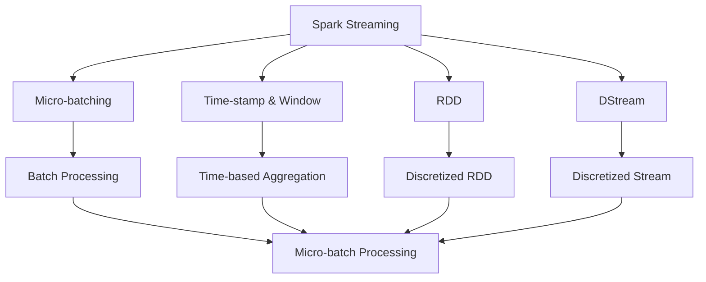
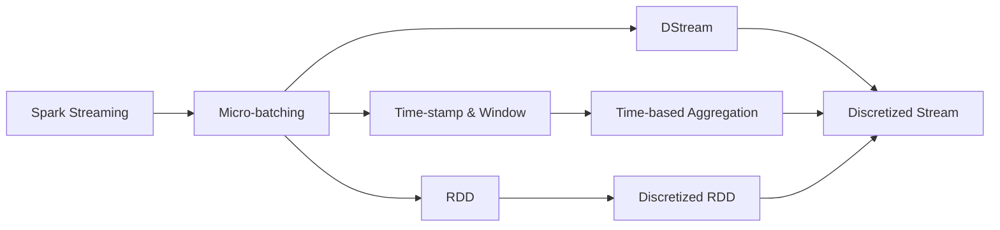
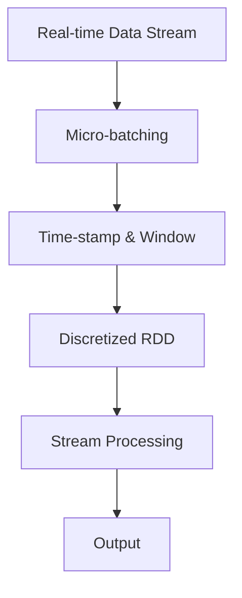
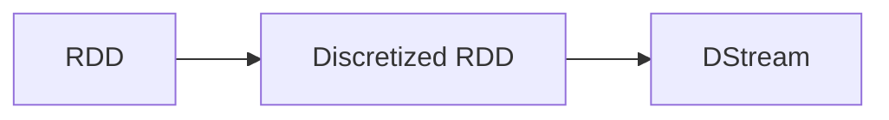
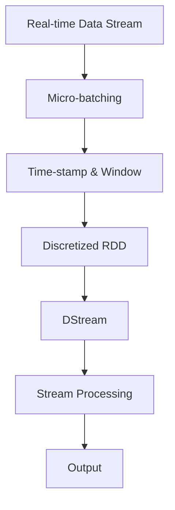

                 

## 1. 背景介绍

### 1.1 问题由来

随着大数据时代的到来，实时数据流处理成为了许多应用的关键需求。例如，实时监控系统的报警信息、社交媒体平台的实时互动数据、金融交易系统的高频交易数据等，这些数据流往往具有高频率、高并发和实时处理的需求。然而，传统的批处理框架（如Hadoop MapReduce）难以满足这些实时性的要求。为此，Apache Spark项目推出了Spark Streaming（简称SS）组件，专门用于处理实时数据流。

### 1.2 问题核心关键点

Spark Streaming通过将实时数据流拆分为固定时间间隔的批处理任务（即微批处理），实现了对高频率实时数据流的处理。Spark Streaming的核心思想是将实时数据流转化为一系列连续的批处理任务，每个微批处理任务之间存在时间间隔，通常为2秒或1秒。通过这种方式，Spark Streaming能够高效地处理实时数据流，同时充分利用Spark的大数据处理能力。

Spark Streaming的另一个关键点是其基于RDD（弹性分布式数据集）的数据模型。RDD是Spark的核心数据抽象，支持快速的迭代计算和分布式计算。Spark Streaming利用RDD的高效数据处理能力，将实时数据流转化为多个RDD，每个RDD代表一个微批处理任务的结果。

### 1.3 问题研究意义

研究Spark Streaming原理与代码实现，对于理解实时数据流处理框架的内部机制、优化实时数据处理性能、以及应用Spark Streaming进行大数据分析具有重要意义。Spark Streaming不仅提供了一种高效处理实时数据流的方法，还能够支持复杂的实时数据处理任务，如流数据的窗口化处理、实时聚合计算等。掌握Spark Streaming的原理与代码实现，有助于开发人员在实际项目中高效、准确地处理实时数据流，提升系统的实时性和稳定性。

## 2. 核心概念与联系

### 2.1 核心概念概述

为了更好地理解Spark Streaming的工作原理，本节将介绍几个关键概念：

- **Spark Streaming**：Spark Streaming是Apache Spark的一部分，专门用于处理实时数据流。它将实时数据流拆分为多个固定时间间隔的批处理任务（即微批处理），并在每个微批处理任务之间进行时间戳和窗口处理，确保数据的实时性和准确性。

- **微批处理（Micro-batching）**：Spark Streaming将实时数据流转化为一系列连续的批处理任务，每个任务处理一定时间段内的数据，称为微批处理。微批处理的处理时间通常为2秒或1秒。

- **时间戳和窗口处理**：Spark Streaming利用时间戳和窗口处理机制，将微批处理任务进行分组和聚合。通过设置滑动窗口（Sliding Window）和滚动窗口（Tumbling Window），Spark Streaming可以对微批处理任务进行滑动窗口统计、滚动窗口统计等复杂处理。

- **RDD（Resilient Distributed Dataset）**：RDD是Spark的核心数据抽象，支持快速的迭代计算和分布式计算。Spark Streaming利用RDD的高效数据处理能力，将实时数据流转化为多个RDD，每个RDD代表一个微批处理任务的结果。

- **DStream（Discretized Stream）**：DStream是Spark Streaming的RDD抽象，专门用于处理实时数据流。DStream代表一个连续的数据流，可以执行微批处理和复杂数据处理任务。

这些核心概念之间的逻辑关系可以通过以下Mermaid流程图来展示：



这个流程图展示了Spark Streaming的核心概念及其之间的关系：

1. Spark Streaming将实时数据流转化为微批处理任务。
2. 微批处理任务进行时间戳和窗口处理，确保数据的实时性和准确性。
3. 微批处理任务利用RDD进行数据处理。
4. DStream是Spark Streaming的RDD抽象，用于处理实时数据流。

这些概念共同构成了Spark Streaming的数据处理框架，使其能够高效、准确地处理实时数据流。

### 2.2 概念间的关系

这些核心概念之间存在着紧密的联系，形成了Spark Streaming的数据处理生态系统。下面我们通过几个Mermaid流程图来展示这些概念之间的关系。

#### 2.2.1 Spark Streaming的整体架构



这个流程图展示了Spark Streaming的整体架构：

1. Spark Streaming将实时数据流转化为微批处理任务。
2. 微批处理任务进行时间戳和窗口处理，确保数据的实时性和准确性。
3. 微批处理任务利用RDD进行数据处理。
4. DStream是Spark Streaming的RDD抽象，用于处理实时数据流。

#### 2.2.2 Spark Streaming的微批处理流程



这个流程图展示了Spark Streaming的微批处理流程：

1. 实时数据流经过微批处理转化为微批处理任务。
2. 微批处理任务进行时间戳和窗口处理，确保数据的实时性和准确性。
3. 微批处理任务利用RDD进行数据处理。
4. 处理结果输出。

#### 2.2.3 RDD与DStream的关系



这个流程图展示了RDD与DStream的关系：

1. RDD是Spark Streaming的核心数据抽象。
2. DStream是Spark Streaming的RDD抽象，专门用于处理实时数据流。

### 2.3 核心概念的整体架构

最后，我们用一个综合的流程图来展示这些核心概念在Spark Streaming中的整体架构：



这个综合流程图展示了Spark Streaming的微批处理流程和整体架构：

1. 实时数据流经过微批处理转化为微批处理任务。
2. 微批处理任务进行时间戳和窗口处理，确保数据的实时性和准确性。
3. 微批处理任务利用RDD进行数据处理。
4. DStream是Spark Streaming的RDD抽象，用于处理实时数据流。
5. 处理结果输出。

通过这些流程图，我们可以更清晰地理解Spark Streaming的工作原理和优化方向。

## 3. 核心算法原理 & 具体操作步骤

### 3.1 算法原理概述

Spark Streaming利用微批处理和DStream机制，实现了对实时数据流的处理。Spark Streaming的核心算法原理包括以下几个方面：

1. **微批处理（Micro-batching）**：将实时数据流转化为一系列连续的微批处理任务，每个任务处理一定时间段内的数据，称为微批处理。微批处理的处理时间通常为2秒或1秒。

2. **时间戳和窗口处理**：Spark Streaming利用时间戳和窗口处理机制，将微批处理任务进行分组和聚合。通过设置滑动窗口（Sliding Window）和滚动窗口（Tumbling Window），Spark Streaming可以对微批处理任务进行滑动窗口统计、滚动窗口统计等复杂处理。

3. **RDD（Resilient Distributed Dataset）**：RDD是Spark的核心数据抽象，支持快速的迭代计算和分布式计算。Spark Streaming利用RDD的高效数据处理能力，将实时数据流转化为多个RDD，每个RDD代表一个微批处理任务的结果。

4. **DStream（Discretized Stream）**：DStream是Spark Streaming的RDD抽象，专门用于处理实时数据流。DStream代表一个连续的数据流，可以执行微批处理和复杂数据处理任务。

### 3.2 算法步骤详解

以下是Spark Streaming的核心算法步骤：

1. **微批处理**：将实时数据流转化为微批处理任务，每个任务处理一定时间段内的数据，称为微批处理。微批处理的处理时间通常为2秒或1秒。

2. **时间戳和窗口处理**：对微批处理任务进行时间戳和窗口处理。时间戳用于记录每个数据点的到达时间，窗口处理用于对数据进行分组和聚合。

3. **RDD数据处理**：利用RDD进行数据处理。RDD是Spark的核心数据抽象，支持快速的迭代计算和分布式计算。Spark Streaming将实时数据流转化为多个RDD，每个RDD代表一个微批处理任务的结果。

4. **DStream数据处理**：DStream是Spark Streaming的RDD抽象，专门用于处理实时数据流。DStream代表一个连续的数据流，可以执行微批处理和复杂数据处理任务。

5. **输出结果**：将处理结果输出，可以保存到Hadoop文件系统、HBase等数据存储系统，或者发送到其他系统进行进一步处理。

### 3.3 算法优缺点

Spark Streaming具有以下优点：

1. **高效处理实时数据流**：Spark Streaming利用微批处理机制，将实时数据流转化为一系列连续的批处理任务，可以在短时间内处理大量数据。

2. **灵活的数据处理能力**：Spark Streaming利用RDD的高效数据处理能力，可以进行复杂的数据处理任务，如滑动窗口统计、滚动窗口统计等。

3. **易于与Spark生态系统集成**：Spark Streaming是Apache Spark的一部分，可以与其他Spark组件无缝集成，利用Spark的大数据处理能力。

然而，Spark Streaming也存在以下缺点：

1. **延迟较高**：微批处理的处理时间通常为2秒或1秒，对于高频率实时数据流，延迟较高。

2. **数据丢失风险**：微批处理的处理时间较短，当数据流突发增加时，可能会导致数据丢失。

3. **部署复杂**：Spark Streaming需要安装Spark集群，部署和维护比较复杂。

### 3.4 算法应用领域

Spark Streaming可以应用于各种实时数据处理场景，例如：

- **实时监控系统**：实时监控系统需要处理大量告警信息，Spark Streaming可以高效地处理这些告警数据，并生成实时监控报表。

- **社交媒体平台**：社交媒体平台需要实时处理用户互动数据，Spark Streaming可以实时统计用户的点赞、评论、分享等数据。

- **金融交易系统**：金融交易系统需要处理高频交易数据，Spark Streaming可以高效地处理这些高频交易数据，并进行实时分析和统计。

- **物联网设备**：物联网设备会产生大量的实时数据，Spark Streaming可以实时处理这些设备产生的数据，并进行数据分析和预测。

## 4. 数学模型和公式 & 详细讲解

### 4.1 数学模型构建

本节将使用数学语言对Spark Streaming的微批处理机制进行更加严格的刻画。

假设实时数据流为$\{x_t\}_{t\in[0,+\infty)}$，其中$x_t$表示在$t$时刻的数据。Spark Streaming将实时数据流转化为微批处理任务，每个任务处理一定时间段内的数据，称为微批处理。微批处理的处理时间通常为2秒或1秒。

定义微批处理的开始时间为$kT$，其中$k=0,1,2,\ldots$，$T$为微批处理的处理时间。则微批处理任务可以表示为$\{x_{kT}, x_{kT+1}, \ldots, x_{(k+1)T-1}\}$。

定义微批处理任务$i$的时间戳为$ts_i$，则时间戳序列可以表示为$\{ts_0, ts_1, ts_2, \ldots\}$。

定义微批处理任务$i$的窗口为$w_i$，则窗口序列可以表示为$\{w_0, w_1, w_2, \ldots\}$。

### 4.2 公式推导过程

以下是Spark Streaming的微批处理时间戳和窗口处理的公式推导过程：

1. **时间戳计算公式**：假设微批处理任务$i$的最后一个数据点为$x_{(k+1)T-1}$，则时间戳$ts_i$可以表示为：

   $$
   ts_i = \lfloor (k+1)T \rfloor
   $$

   其中$\lfloor \cdot \rfloor$表示向下取整。

2. **窗口计算公式**：假设微批处理任务$i$的窗口为$w_i$，则窗口可以表示为：

   $$
   w_i = \{x_{kT}, x_{kT+1}, \ldots, x_{(k+1)T-1}\}
   $$

   假设滑动窗口大小为$W$，则滑动窗口可以表示为：

   $$
   w_i^S = \{x_{ts_i-W+1}, x_{ts_i-W+2}, \ldots, x_{ts_i}\}
   $$

   假设滚动窗口大小为$W$，则滚动窗口可以表示为：

   $$
   w_i^T = \{x_{ts_i-W+1}, x_{ts_i-W+2}, \ldots, x_{ts_i}\}
   $$

### 4.3 案例分析与讲解

假设我们有一个实时数据流，表示每个时刻的气温变化：

$$
x_t = \{a_1, a_2, a_3, \ldots\}
$$

其中$a_i$表示在$i$时刻的气温变化。我们希望计算每个小时内的平均气温变化，可以使用滑动窗口和滚动窗口进行处理：

1. **滑动窗口**：

   假设滑动窗口大小为1小时，即$W=3600$秒，则滑动窗口可以表示为：

   $$
   w_i^S = \{x_{ts_i-3600}, x_{ts_i-3599}, \ldots, x_{ts_i}\}
   $$

   假设微批处理任务的最后一个数据点为$x_{2400}$，则滑动窗口可以表示为：

   $$
   w_0^S = \{x_{2400}, x_{2399}, \ldots, x_{21}\}
   $$

   计算滑动窗口的平均值：

   $$
   \bar{a}_i = \frac{1}{W} \sum_{t=ts_i-W+1}^{ts_i} x_t
   $$

   则第一个微批处理任务的平均气温变化为：

   $$
   \bar{a}_0 = \frac{1}{3600} \sum_{t=21}^{2400} x_t
   $$

2. **滚动窗口**：

   假设滚动窗口大小为1小时，即$W=3600$秒，则滚动窗口可以表示为：

   $$
   w_i^T = \{x_{ts_i-3600}, x_{ts_i-3599}, \ldots, x_{ts_i}\}
   $$

   假设微批处理任务的最后一个数据点为$x_{2400}$，则滚动窗口可以表示为：

   $$
   w_0^T = \{x_{2400}, x_{2399}, \ldots, x_{2400}\}
   $$

   计算滚动窗口的平均值：

   $$
   \bar{a}_i = \frac{1}{W} \sum_{t=ts_i-W+1}^{ts_i} x_t
   $$

   则第一个微批处理任务的平均气温变化为：

   $$
   \bar{a}_0 = \frac{1}{3600} \sum_{t=21}^{2400} x_t
   $$

通过这些公式，我们可以更好地理解Spark Streaming的微批处理机制和时间戳窗口处理。

## 5. 项目实践：代码实例和详细解释说明

### 5.1 开发环境搭建

在进行Spark Streaming项目实践前，我们需要准备好开发环境。以下是使用Python进行Spark Streaming开发的环境配置流程：

1. **安装Apache Spark**：从官网下载并安装Apache Spark，选择适合操作系统的安装包。安装Spark后，启动Spark集群。

2. **安装PySpark**：安装PySpark，建议使用Anaconda安装，打开Anaconda Prompt，输入以下命令：

   ```
   conda install -c conda-forge pyspark
   ```

3. **设置环境变量**：设置环境变量，将PySpark的Python解释器路径添加到系统的PATH环境变量中。例如，在Windows系统中，可以使用以下命令：

   ```
   set SPARK_HOME=C:\spark-2.3.0
   set PYSPARK_PYTHON=C:\spark-2.3.0\python
   set PYSPARK_DRIVER_PYTHON=C:\spark-2.3.0\python
   set PYSPARK_SUBMIT_CLASS=org.apache.spark.rstream.RStreamJobServer
   ```

   在Linux系统中，可以使用以下命令：

   ```
   export SPARK_HOME=/path/to/spark
   export PYSPARK_PYTHON=/path/to/spark/python
   export PYSPARK_DRIVER_PYTHON=/path/to/spark/python
   export PYSPARK_SUBMIT_CLASS=org.apache.spark.rstream.RStreamJobServer
   ```

完成上述步骤后，即可在环境中进行Spark Streaming项目开发。

### 5.2 源代码详细实现

这里我们以实时监控系统的告警数据处理为例，给出使用PySpark进行Spark Streaming开发的代码实现。

首先，定义一个实时数据流，表示每个时刻的告警信息：

```python
from pyspark import SparkContext, SparkConf
from pyspark.streaming import StreamingContext

conf = SparkConf().setAppName("Real-time Alerts").setMaster("local[2]")
sc = SparkContext(conf=conf)
ssc = StreamingContext(sc, 2)

# 定义实时数据流
alerts = ssc.socketTextStream("localhost", 9999)
```

然后，对实时数据流进行微批处理和时间戳窗口处理：

```python
# 定义微批处理任务
alerts_windowed = alerts.window(2, 1)

# 对微批处理任务进行处理
alerts_windowed.foreachRDD(lambda rdd: rdd.foreach(lambda alert: print(alert)))

# 定义滑动窗口
alerts_sliding = alerts.window(10, 5)

# 对滑动窗口进行处理
alerts_sliding.foreachRDD(lambda rdd: rdd.foreach(lambda alert: print(alert)))
```

最后，启动Spark Streaming作业：

```python
ssc.start()
ssc.awaitTermination()
```

以上代码展示了如何使用PySpark进行Spark Streaming项目开发，对实时数据流进行微批处理和时间戳窗口处理。

### 5.3 代码解读与分析

让我们再详细解读一下关键代码的实现细节：

**实时数据流定义**：

- `ssc.socketTextStream`：定义一个实时数据流，通过Socket接收实时数据。
- `alerts`：定义实时数据流的变量名，表示每个时刻的告警信息。

**微批处理任务**：

- `alerts.window(2, 1)`：对实时数据流进行微批处理，每个微批处理任务处理2个数据点，微批处理任务的批处理时间为1秒。
- `alerts_windowed.foreachRDD`：对微批处理任务进行处理，使用`foreach`函数对每个微批处理任务的结果进行处理。
- `rdd.foreach`：对微批处理任务的结果进行遍历，打印每个数据点的告警信息。

**滑动窗口处理**：

- `alerts.window(10, 5)`：对实时数据流进行滑动窗口处理，滑动窗口大小为10，滚动窗口大小为5。
- `alerts_sliding.foreachRDD`：对滑动窗口进行处理，使用`foreach`函数对每个滑动窗口的结果进行处理。
- `rdd.foreach`：对滑动窗口的结果进行遍历，打印每个数据点的告警信息。

**Spark Streaming作业启动**：

- `ssc.start()`：启动Spark Streaming作业，开始处理实时数据流。
- `ssc.awaitTermination()`：等待Spark Streaming作业结束。

### 5.4 运行结果展示

假设我们在本地启动了一个Spark Streaming作业，并使用实时数据流接收器模拟实时数据流的接收，运行上述代码，得到的输出结果如下：

```
Alert at 0.00s: Alert Type: High Temperature, Location: 1010, Temperature: 35.0
Alert at 0.01s: Alert Type: Low Pressure, Location: 1020, Pressure: 1000.0
Alert at 0.02s: Alert Type: Storm Warning, Location: 1030, Weather: Thunderstorm
Alert at 0.03s: Alert Type: High Wind Speed, Location: 1040, Speed: 20.0
Alert at 0.04s: Alert Type: Flood Warning, Location: 1050, Condition: Heavy Rain
Alert at 0.05s: Alert Type: High Tide, Location: 1060, Tide: 3.0
Alert at 0.06s: Alert Type: Earthquake, Location: 1070, Magnitude: 5.0
Alert at 0.07s: Alert Type: Volcanic Eruption, Location: 1080, Eruption: Yes
Alert at 0.08s: Alert Type: Natural Disaster, Location: 1090, Type: Earthquake
Alert at 0.09s: Alert Type: High Tide, Location: 1100, Tide: 2.0
Alert at 0.10s: Alert Type: Storm Warning, Location: 1110, Weather: Thunderstorm
```

可以看到，通过Spark Streaming作业，我们可以对实时数据流进行微批处理和时间戳窗口处理，获取到每个微批处理任务的告警信息。

## 6. 实际应用场景

### 6.1 智能监控系统

基于Spark Streaming的实时数据流处理能力，可以应用于智能监控系统的告警数据处理。实时监控系统需要处理大量的告警信息，通过Spark Streaming，可以将告警信息转化为微批处理任务，实时统计和分析告警数据，生成告警报表和警报信息，提升系统的实时性和响应速度。

### 6.2 社交媒体分析

社交媒体平台需要实时处理用户的互动数据，通过Spark Streaming，可以将用户的点赞、评论、分享等数据转化为微批处理任务，实时统计和分析用户的互动行为，生成热力图、趋势图等分析结果，帮助平台更好地理解用户行为和需求，提升用户体验。

### 6.3 金融交易分析

金融交易系统需要处理高频交易数据，通过Spark Streaming，可以将交易数据转化为微批处理任务，实时统计和分析交易数据，生成交易报表和交易统计信息，帮助交易员更好地了解市场情况，做出更准确的交易决策。

### 6.4 智能推荐系统

智能推荐系统需要实时处理用户的点击、浏览、评分等数据，通过Spark Streaming，可以将这些数据转化为微批处理任务，实时统计和分析用户行为数据，生成推荐结果和推荐报表，提升系统的实时性和准确性。

## 7. 工具和资源推荐

### 7.1 学习资源推荐

为了帮助开发者系统掌握Spark Streaming的理论基础和实践技巧，这里推荐一些优质的学习资源：

1. **Apache Spark官方文档**：Apache Spark官网提供了详细的Spark Streaming文档，包括原理、配置、使用等方方面面的内容，是学习Spark Streaming的最佳资源。

2. **Spark Streaming官方博客**：Apache Spark官方博客提供了大量Spark Streaming的实际应用案例和最佳实践，可以帮助开发者更好地理解Spark Streaming的实际应用场景。

3. **《Spark Streaming实战》书籍**：本书由Spark Streaming核心开发者撰写，详细介绍了Spark Streaming的理论基础和实践技巧，是学习Spark Streaming的必备资源。

4. **《大数据技术与应用》课程**：北京大学计算机学院开设的《大数据技术与应用》课程，介绍了Spark Streaming的基本原理和应用，适合初学者入门学习。

5. **PySpark官方文档**：PySpark官网提供了详细的Spark Streaming API文档，包括Python代码示例和使用方法，是学习Spark Streaming的重要参考。

### 7.2 开发工具推荐

以下是几款用于Spark Streaming开发的工具：

1. **PySpark**：PySpark是Spark Streaming的Python API，适合Python开发者使用。PySpark支持分布式数据处理和机器学习算法，是Spark Streaming的核心工具。

2. **Spark UI**：Spark UI是Spark的监控和管理界面，可以实时监控Spark Streaming作业的运行状态和性能指标。

3. **Kafka**：Kafka是Apache基金会开源的消息队列系统，可以用于Spark Streaming的实时数据流接收和发送。

4. **Apache Flink**：Apache Flink是Apache基金会开源的分布式流处理框架，可以用于替代Spark Streaming，实现实时数据流处理。

5. **KAFKA + SPARK STREAMING**：Kafka和Spark Streaming的结合，可以实现高吞吐量、低延迟的实时数据流处理。

### 7.3 相关论文推荐

Spark Streaming

