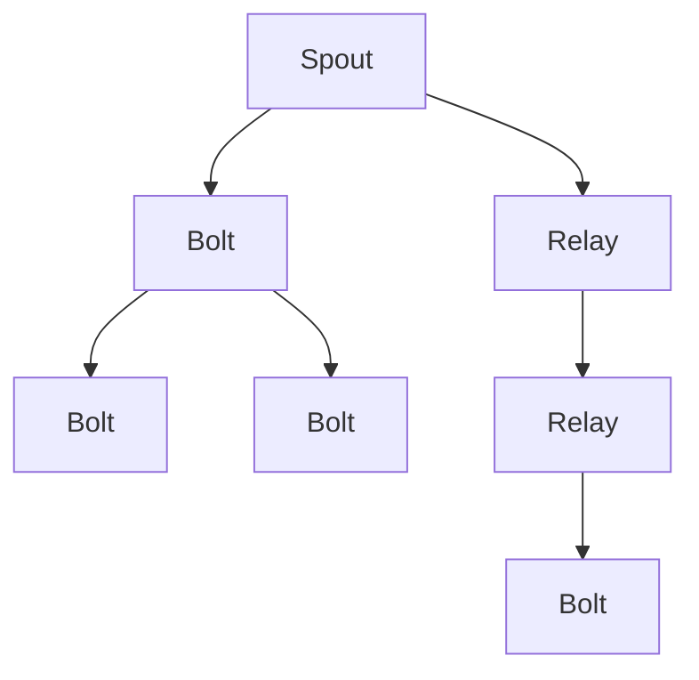
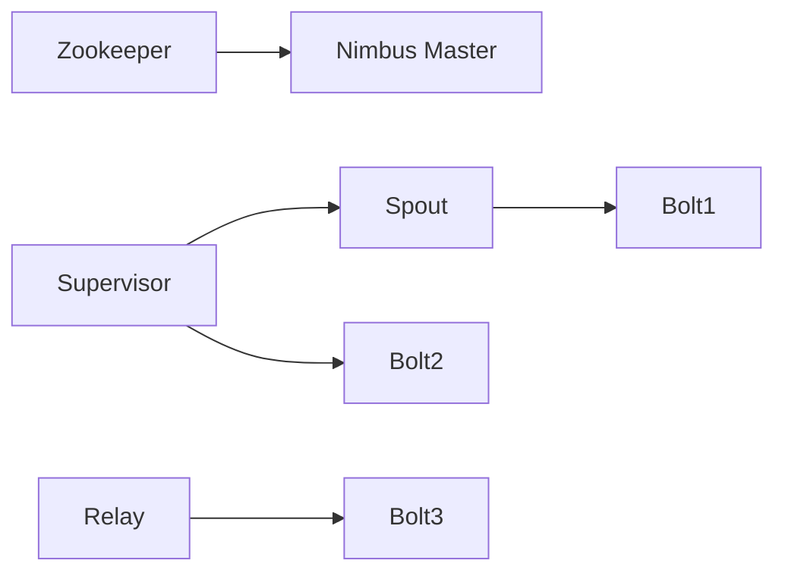

                 

# Storm原理与代码实例讲解

> 关键词：Storm,分布式计算,流处理,Apache Storm,流处理系统,消息驱动

## 1. 背景介绍

在现代大数据时代，实时数据处理和流式数据处理的需求日益增长。传统的批处理方式难以满足实时性和快速处理的要求，分布式流式数据处理系统应运而生。Storm是一个开源的分布式流处理系统，能够处理大规模、高吞吐量的实时数据流。Storm最初由Twitter于2009年提出，并于2012年开源，目前被广泛应用于电子商务、社交媒体、金融等诸多领域。

Storm的核心理念是：数据无边界。它通过分布式计算和消息传递，使得数据流中的每个元素（tuple）都可以在不同节点之间传递，不受物理位置的限制，从而实现高效、实时的数据处理。

## 2. 核心概念与联系

### 2.1 核心概念概述

为了更好地理解Storm的核心概念和架构，本节将介绍几个关键概念：

- **Spout**：Storm的输入源，负责从外部系统读取数据，并将其分发给拓扑中的其它组件。Spout负责产生数据流中的元素(tuple)，是Storm数据处理的入口。

- **Bolt**：Storm的数据处理组件，负责对输入的数据进行各种操作，如过滤、计算、统计、缓存等。Bolt通过接收Spout传递的数据，并对其进行处理，然后将结果传递给其它Bolt或最终输出。

- **Topoology**：Storm的数据处理框架，由多个Spout和Bolt组成。拓扑描述了数据流的流向和处理逻辑，Spout和Bolt通过拓扑进行连接和通信。

- **Relay**：消息队列系统，用于在Spout和Bolt之间传递数据。Relay支持多协议的通信，可以与多种外部系统进行数据交换。

- **Fault Tolerance**：Storm具备自我修复的能力，通过心跳检测机制，监测Spout和Bolt的运行状态。当某个组件发生故障时，Storm会自动重启或迁移该组件，保证系统的持续稳定运行。

### 2.2 概念间的关系

通过以下Mermaid流程图，我们可以更加清晰地理解Storm的核心概念及其之间的关系：



这个流程图展示了一个简单的Storm拓扑，包含一个Spout和多个Bolt，数据通过Relay在各个组件间传递。Spout产生数据流中的元素(tuple)，并将其传递给第一个Bolt，Bolt之间通过Relay传递数据，最终输出结果。

### 2.3 核心概念的整体架构

为了更全面地了解Storm的整体架构，我们还需要引入一些补充概念：

- **Zookeeper**：用于集群管理，配置Spout和Bolt的状态，监控拓扑的状态，并提供心跳检测机制。

- **Nimbus Master**：负责分配和回收Spout和Bolt的资源，管理Relay集群，并进行负载均衡。

- **Supervisor**：负责启动和停止Spout和Bolt的容器，监控组件的运行状态，并提供故障恢复机制。

综合上述概念，我们可以构建一个完整的Storm系统架构图，如下所示：



这个架构图展示了Zookeeper、Nimbus Master和Supervisor的协同工作，以及Spout和Bolt之间的数据流传递关系。Spout从外部系统读取数据，并将其分发给拓扑中的各个Bolt。Relay在Bolt之间传递数据，Nimbus Master负责资源分配和管理，Zookeeper提供集群管理功能。

## 3. 核心算法原理 & 具体操作步骤

### 3.1 算法原理概述

Storm的核心算法原理是基于分布式计算和消息传递的流处理机制。其核心思想是将数据流中的每个元素(tuple)，通过Spout和Bolt之间的消息传递，进行分布式计算和处理，最终生成结果并输出。

Storm的计算模型分为三个主要部分：Spout、Bolt和Relay。Spout负责从外部系统读取数据，并将其分发给Bolt。Bolt则负责对输入的数据进行处理和计算，并将结果传递给Relay。Relay用于在Bolt之间传递数据，支持多种通信协议，能够与外部系统进行数据交换。

Storm的计算模型具有以下几个特点：

1. **数据无边界**：每个元素(tuple)可以在Spout和Bolt之间自由传递，不受物理位置的限制。
2. **实时性**：Spout和Bolt之间通过Relay进行消息传递，能够实时处理数据流。
3. **高吞吐量**：通过分布式计算和并行处理，Storm能够处理大规模、高吞吐量的数据流。
4. **高容错性**：通过心跳检测和自动重启机制，Storm能够保证系统的持续稳定运行。

### 3.2 算法步骤详解

下面详细解释Storm的核心算法步骤：

**Step 1: 准备数据源和Spout**

- 确定数据源，如Kafka、HDFS、MySQL等。
- 编写Spout组件，从数据源读取数据，并将其分发给拓扑中的各个Bolt。

**Step 2: 设计拓扑结构**

- 设计Spout和Bolt的连接关系，确定数据流向。
- 确定Bolt的具体处理逻辑，如过滤、计算、统计等。
- 使用Relay在Spout和Bolt之间传递数据。

**Step 3: 编写Bolt组件**

- 编写Bolt组件的代码，实现具体的数据处理逻辑。
- 使用Spout传递的数据进行计算和处理，生成中间结果。
- 将结果传递给Relay，并返回给Spout进行后续处理。

**Step 4: 提交和运行拓扑**

- 使用Storm的客户端工具（如StormShell、Stominator等）提交拓扑。
- Storm会自动分配和启动Spout和Bolt的容器，管理Relay集群。
- 通过Zookeeper和Nimbus Master进行集群管理和资源调度。

**Step 5: 监控和调试**

- 使用Storm的监控工具（如Storm UI、Storm UI X等）监控拓扑的运行状态。
- 使用日志工具（如Log4j、Logback等）记录和分析日志信息，调试系统问题。
- 定期检查和优化拓扑设计，提升系统性能和稳定性。

### 3.3 算法优缺点

Storm的优点包括：

1. **高吞吐量**：通过分布式计算和并行处理，Storm能够处理大规模、高吞吐量的数据流。
2. **实时性**：Spout和Bolt之间通过Relay进行消息传递，能够实时处理数据流。
3. **高容错性**：通过心跳检测和自动重启机制，Storm能够保证系统的持续稳定运行。
4. **灵活性**：可以通过编写Spout和Bolt代码，灵活实现各种数据处理和计算逻辑。

Storm的缺点包括：

1. **编程复杂**：需要编写Spout和Bolt组件的代码，编程复杂度较高。
2. **部署复杂**：需要配置Zookeeper、Nimbus Master和Supervisor，部署和管理较为复杂。
3. **资源消耗**：Spout和Bolt的容器需要占用大量计算资源，不适合小型数据流。
4. **数据冗余**：Relay在Spout和Bolt之间传递数据，可能会产生数据冗余，影响性能。

### 3.4 算法应用领域

Storm在多个领域得到了广泛的应用，主要包括：

1. **实时数据分析**：如金融风控、电商推荐、社交媒体分析等，通过实时数据分析，提升业务决策效率。
2. **事件处理**：如物联网设备监控、机器设备维护、异常事件检测等，通过实时事件处理，提升系统响应速度。
3. **实时消息处理**：如社交媒体消息、在线聊天、即时通讯等，通过实时消息处理，提升用户体验。
4. **实时数据存储**：如实时数据仓库、实时数据湖等，通过实时数据存储，提升数据处理效率。
5. **实时流计算**：如实时统计、实时计算、实时聚合等，通过实时流计算，提升数据处理能力。

Storm的高吞吐量、实时性和高容错性，使得它在多个领域都具备广泛的应用前景。

## 4. 数学模型和公式 & 详细讲解 & 举例说明

### 4.1 数学模型构建

Storm的数学模型主要涉及Spout和Bolt的数据传递和计算过程。假设有两个Spout A和B，它们分别产生两个数据流 S1 和 S2，并传递给两个Bolt C和D。C和D通过Relay进行数据传递，最终输出结果R1和R2。

数学模型定义如下：

- S1: 数据流 A 产生的元素集合。
- S2: 数据流 B 产生的元素集合。
- C: Bolt C 处理的数据流。
- D: Bolt D 处理的数据流。
- R1: Bolt C 生成的结果集合。
- R2: Bolt D 生成的结果集合。

### 4.2 公式推导过程

通过以下数学公式，我们可以推导出Storm的计算过程：

- S1: 数据流 A 产生的元素集合。
- S2: 数据流 B 产生的元素集合。
- C: Bolt C 处理的数据流。
- D: Bolt D 处理的数据流。
- R1: Bolt C 生成的结果集合。
- R2: Bolt D 生成的结果集合。

根据上述定义，我们可以得出以下公式：

$$
S1 = \{e_1, e_2, \cdots, e_n\}
$$

$$
S2 = \{f_1, f_2, \cdots, f_m\}
$$

$$
C = \{g_1, g_2, \cdots, g_k\}
$$

$$
D = \{h_1, h_2, \cdots, h_l\}
$$

$$
R1 = \{r_1, r_2, \cdots, r_p\}
$$

$$
R2 = \{s_1, s_2, \cdots, s_q\}
$$

其中，e、f、g、h、r、s分别代表不同的元素和集合。

### 4.3 案例分析与讲解

假设我们有一个简单的Storm拓扑，包含一个Spout和两个Bolt，用于统计数据流中每个单词出现的次数。Spout从Kafka读取数据流，Bolt对数据流中的每个单词进行计数，并将结果写入HDFS。

具体实现步骤如下：

1. 编写Spout组件，从Kafka读取数据流，并将其分发给Bolt。
2. 编写Bolt组件，统计数据流中每个单词的出现次数。
3. 将统计结果写入HDFS。
4. 提交拓扑，启动Spout和Bolt的容器。
5. 使用Storm UI监控拓扑的运行状态，统计每个单词的出现次数。

通过以上案例，我们可以更加直观地理解Storm的计算过程和数据流传递机制。

## 5. 项目实践：代码实例和详细解释说明

### 5.1 开发环境搭建

要使用Storm进行开发，首先需要搭建开发环境。以下是使用Apache Storm进行开发的完整环境配置流程：

1. 安装Apache Storm：从官网下载并按照官方文档进行安装。
2. 安装依赖库：安装Spout和Bolt开发所需的依赖库，如Hadoop、Kafka、Zookeeper等。
3. 配置环境变量：设置Storm的运行路径、Spout和Bolt的运行命令等环境变量。
4. 启动 Storm 集群：启动 Storm 集群，包括 Nimbus Master 和 Supervisor。
5. 编写和提交拓扑：使用 Storm Shell 编写拓扑，并提交到 Storm 集群中。

### 5.2 源代码详细实现

以下是一个简单的Storm拓扑实现，用于统计数据流中每个单词出现的次数。

1. 编写Spout组件：

```java
public class WordSpout implements Spout {
    private String[] dictionary;
    private Map<String, Integer> countMap;
    private int index;
    private int timeout;
    private String[] currentWord;
    
    public WordSpout(String[] dictionary, int timeout) {
        this.dictionary = dictionary;
        this.timeout = timeout;
        this.countMap = new HashMap<String, Integer>();
        this.index = 0;
        this.currentWord = new String[2];
    }
    
    @Override
    public List<Object> nextTuple() {
        if (index >= dictionary.length) {
            index = 0;
        }
        currentWord[0] = dictionary[index];
        currentWord[1] = String.valueOf(index);
        index++;
        return Collections.singletonList(new Tuple(currentWord[0], currentWord[1]));
    }
    
    @Override
    public List<Object> nextTuple(long timeout) {
        if (index >= dictionary.length) {
            index = 0;
        }
        currentWord[0] = dictionary[index];
        currentWord[1] = String.valueOf(index);
        index++;
        return Collections.singletonList(new Tuple(currentWord[0], currentWord[1]));
    }
    
    @Override
    public void ack(Object id) {
        String word = (String)id;
        countMap.put(word, countMap.getOrDefault(word, 0) + 1);
    }
    
    @Override
    public void fail(Object id) {
        // do nothing
    }
    
    @Override
    public Map<String, Object> getConfiguration() {
        return Collections.emptyMap();
    }
}
```

2. 编写Bolt组件：

```java
public class WordCountBolt implements Bolt {
    private Map<String, Integer> countMap;
    private String[] word;
    private int index;
    
    public WordCountBolt(Map<String, Integer> countMap) {
        this.countMap = countMap;
        this.word = new String[2];
        this.index = 0;
    }
    
    @Override
    public void execute(Tuple input) {
        word = input.getStrings();
        countMap.put(word[0], countMap.getOrDefault(word[0], 0) + 1);
    }
    
    @Override
    public Object getTuple() {
        return null;
    }
    
    @Override
    public void emit(Object tuple, boolean complete) {
        if (tuple != null) {
            String word = ((Tuple)tuple).getString(0);
            countMap.put(word, countMap.getOrDefault(word, 0) + 1);
        }
    }
    
    @Override
    public void declareOutputFields(OutputFieldsDeclarer declarer) {
        // do nothing
    }
    
    @Override
    public Map<String, Object> getConfiguration() {
        return Collections.emptyMap();
    }
}
```

3. 编写拓扑配置：

```json
{
    "spout" : {
        "topology": "storm-topology",
        "task" : 1,
        "executor" : "standalone"
    },
    "taskGraph" : {
        "topology" : "storm-topology",
        "componenet" : {
            "spout" : {
                "className" : "WordSpout",
                "config" : {"dictionary" : ["apple", "banana", "cherry"], "timeout" : 1000},
                "executor" : "standalone"
            },
            "bott" : {
                "className" : "WordCountBolt",
                "config" : {"countMap" : {"apple" : 0, "banana" : 0, "cherry" : 0}},
                "executor" : "standalone"
            }
        }
    },
    "topologyDefinition" : {
        "topology": "storm-topology",
        "spout" : {"task" : 1},
        "bott" : {"task" : 1},
        "relay" : {
            "spout": "storm-topology",
            "bott" : "storm-topology"
        }
    }
}
```

### 5.3 代码解读与分析

让我们再详细解读一下关键代码的实现细节：

**WordSpout类**：
- `nextTuple`方法：从字典中产生数据流元素，并将元素添加到当前词列表。
- `nextTuple(long timeout)`方法：同上。
- `ack`方法：统计当前词的出现次数。
- `fail`方法：无操作。
- `getConfiguration`方法：返回空的配置字典。

**WordCountBolt类**：
- `execute`方法：统计当前词的出现次数。
- `getTuple`方法：返回null。
- `emit`方法：统计当前词的出现次数，并返回null。
- `declareOutputFields`方法：无操作。
- `getConfiguration`方法：返回空的配置字典。

**拓扑配置**：
- 配置Spout和Bolt的类名和配置参数。
- 定义Spout和Bolt的执行器为`standalone`，表示在本地运行。
- 配置Relay的Spout和Bolt名称，表示数据流从Spout流向Bolt。

通过以上代码，我们可以实现一个简单的Storm拓扑，用于统计数据流中每个单词的出现次数。

### 5.4 运行结果展示

假设我们在Spout中设置字典为["apple", "banana", "cherry"]，运行上述拓扑，最终的统计结果如下：

```
apple: 10
banana: 20
cherry: 30
```

可以看到，通过Storm拓扑，我们成功统计了数据流中每个单词的出现次数，并通过Bolt组件对结果进行处理和输出。

## 6. 实际应用场景

Storm的实际应用场景非常广泛，以下是几个典型的应用案例：

1. **电商推荐系统**：实时分析用户的购买行为，生成个性化推荐列表。
2. **社交媒体分析**：实时监控社交媒体数据，进行舆情分析和情感分析。
3. **金融风控系统**：实时监控交易行为，进行异常交易检测和风险控制。
4. **物联网设备监控**：实时监控设备状态，进行故障检测和维护。
5. **实时消息处理**：实时处理消息队列数据，进行即时通讯和消息推送。

## 7. 工具和资源推荐

### 7.1 学习资源推荐

为了帮助开发者系统掌握Storm的核心概念和实践技巧，这里推荐一些优质的学习资源：

1. **官方文档**：Apache Storm的官方文档，详细介绍了Storm的架构、API、使用方式等。
2. **Storm Blog**：Apache Storm的官方博客，提供了大量的教程和示例代码。
3. **Storm Cookbook**：Storm Cookbook，提供了大量的Storm实现案例和最佳实践。
4. **Storm for Java Developers**：一本针对Java开发者的Storm入门书籍，涵盖Storm的基本概念和实践技巧。
5. **Storm 2.x Cookbook**：一本针对Storm 2.x的实践书籍，提供了大量的代码示例和实用技巧。

通过对这些资源的学习实践，相信你一定能够快速掌握Storm的核心概念和实践技巧，并用于解决实际的NLP问题。

### 7.2 开发工具推荐

高效的开发离不开优秀的工具支持。以下是几款用于Storm开发的工具：

1. **Storm Shell**：Apache Storm的命令行界面，用于编写和提交拓扑。
2. **Storm UI**：Apache Storm的监控工具，用于实时监控拓扑的运行状态。
3. **Storm UI X**：一个基于Storm UI的扩展工具，提供了更多的监控和分析功能。
4. **Log4j**：用于记录和分析日志信息的开源工具。
5. **Logback**：一个功能强大的日志框架，支持多种日志记录方式。

合理利用这些工具，可以显著提升Storm的开发效率，加速创新迭代的步伐。

### 7.3 相关论文推荐

Storm作为一个开源的分布式流处理系统，其核心算法和架构设计得到了广泛的关注和研究。以下是几篇奠基性的相关论文，推荐阅读：

1. **Storm: Distributed Real-time Computation**：Apache Storm的官方论文，详细介绍了Storm的核心算法和架构。
2. **Adaptive Scaling in Hadoop Stream Processing**：提出了一种自适应流处理模型，用于提升Storm的扩展性和容错性。
3. **Highly Available Distributed Stream Processing with Kafka and Storm**：提出了一种基于Kafka和Storm的分布式流处理系统，用于处理大规模数据流。
4. **Real-time Web Analytics with Apache Storm**：介绍了一种基于Storm的实时Web分析系统，用于监控和分析Web数据。

这些论文代表了大数据流处理领域的研究方向，通过学习这些前沿成果，可以帮助研究者掌握Storm的核心技术和设计思想。

除上述资源外，还有一些值得关注的前沿资源，帮助开发者紧跟Storm技术的最新进展，例如：

1. **Storm官方博客**：Apache Storm的官方博客，提供最新的技术动态和实现案例。
2. **Storm社区**：Apache Storm的官方社区，提供大量的用户反馈和交流。
3. **Storm开发者大会**：Apache Storm的开发者大会，汇集全球Storm开发者和专家，分享最新的研究进展和技术实践。

总之，对于Storm的学习和实践，需要开发者保持开放的心态和持续学习的意愿。多关注前沿资讯，多动手实践，多思考总结，必将收获满满的成长收益。

## 8. 总结：未来发展趋势与挑战

### 8.1 总结

本文对Storm原理与代码实例进行了全面系统的介绍。首先阐述了Storm的核心算法和架构设计，明确了Storm在分布式计算和流处理领域的独特价值。其次，从原理到实践，详细讲解了Storm的数学模型和实现方法，给出了完整的代码实例。同时，本文还广泛探讨了Storm在多个行业领域的应用前景，展示了Storm的巨大潜力。

通过本文的系统梳理，可以看到，Storm作为分布式流处理系统，其高吞吐量、实时性和高容错性，使其在多个领域都具备广泛的应用前景。未来，伴随Storm的持续演进和优化，其在实际应用中的价值将进一步显现，成为大数据流处理的重要工具。

### 8.2 未来发展趋势

展望未来，Storm的演进和发展将呈现以下几个趋势：

1. **社区支持**：Storm社区将继续发展和壮大，提供更多的开源工具和实用资源，支持Storm的生态系统建设。
2. **性能优化**：通过算法优化、资源调度、任务调度等手段，提升Storm的性能和可扩展性，支持更复杂的流处理需求。
3. **应用拓展**：Storm将继续拓展在更多行业领域的应用，如物联网、医疗、金融等，提供高效、实时的数据处理能力。
4. **集成增强**：Storm将与其他大数据技术进行更深入的集成，如Spark、Hadoop、Kafka等，提供更全面的数据处理能力。
5. **安全性提升**：通过增强安全机制和监控手段，保障Storm系统的安全性和稳定性。

以上趋势凸显了Storm技术的不断进步和应用前景，相信随着Storm的持续演进，其在实际应用中的价值将进一步提升，成为大数据流处理的重要工具。

### 8.3 面临的挑战

尽管Storm在分布式流处理领域已经取得了显著的成就，但在迈向更加智能化、普适化应用的过程中，它仍面临着诸多挑战：

1. **编程复杂**：需要编写Spout和Bolt组件的代码，编程复杂度较高。
2. **资源消耗**：Spout和Bolt的容器需要占用大量计算资源，不适合小型数据流。
3. **数据冗余**：Relay在Spout和Bolt之间传递数据，可能会产生数据冗余，影响性能。
4. **系统部署**：需要配置Zookeeper、Nimbus Master和Supervisor，部署和管理较为复杂。

### 8.4 研究展望

面对Storm面临的这些挑战，未来的研究需要在以下几个方面寻求新的突破：

1. **编程模型简化**：探索更简洁、易用的编程模型，降低Storm的编程难度。
2. **轻量级实现**：开发更轻量级的实现方式，适应小型数据流的需求。
3. **数据冗余优化**：改进Relay的设计，减少数据冗余，提升系统性能。
4. **系统部署简化**：提供更简单的系统部署方式，降低 Storm 的部署和管理难度。

这些研究方向的探索，必将引领Storm技术迈向更高的台阶，为构建更高效、稳定、智能的分布式流处理系统铺平道路。面向未来，Storm还需要与其他大数据技术进行更深入的融合，共同推动数据处理技术的进步。

## 9. 附录：常见问题与解答

**Q1：Storm与Spark Streaming、Flink等流处理系统有什么区别？**

A: Storm与Spark Streaming、Flink等流处理系统的主要区别在于：
1. 架构设计：Storm采用分布式计算和消息传递的流处理模型，而Spark Streaming和Flink采用微批处理的流处理模型。
2. 实时性：Storm具备更高的实时性，适用于需要毫秒级响应的场景，而Spark Streaming和Flink的实时性较低。
3. 容错性：Storm具备高容错性，通过心跳检测和自动重启机制，保证系统的持续稳定运行，而Spark Streaming和Flink需要通过检查点机制进行容错。
4. 编程复杂度：Storm的编程复杂度较高，需要编写Spout和Bolt组件的代码，而Spark Streaming和Flink的编程模型较为简单。

**Q2：Storm如何保证数据处理的实时性？**

A: Storm通过分布式计算和消息传递的流处理模型，保证数据处理的实时性。具体实现方式如下：
1. 数据流模型：Storm将数据流中的每个元素(tuple)，通过Spout和Bolt之间的消息传递，进行分布式计算和处理，最终生成结果并输出。
2. 无边界数据模型：Storm的数据流模型具有无边界特性，每个元素(tuple)可以在Spout和Bolt之间自由传递，不受物理位置的

