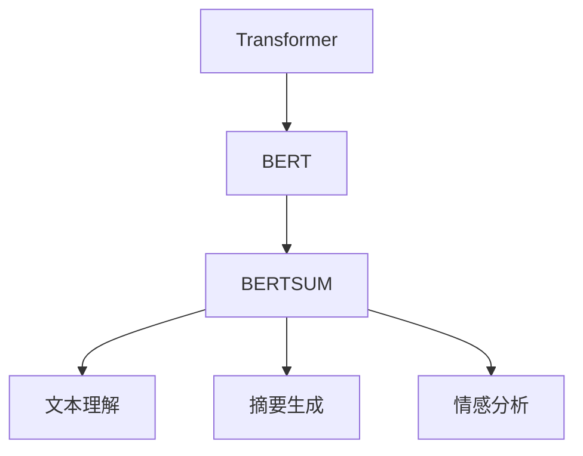

                 

# Transformer大模型实战 BERTSUM 模型的性能

> 关键词：Transformer, BERTSUM, 自然语言处理(NLP), 语言理解, 情感分析, 文本摘要, 机器翻译, 性能评估

## 1. 背景介绍

近年来，Transformer结构的大语言模型在自然语言处理(NLP)领域取得了巨大突破。这些模型不仅在大规模语料上预训练出强大的语言表示能力，还在各种下游任务上取得了卓越的表现。其中，BERT（Bidirectional Encoder Representations from Transformers）作为Transformer家族的重要一员，更是因其双向性、多层性、自监督预训练等特性，成为了NLP领域的新标杆。

为了进一步拓展BERT在大规模文本处理上的性能，谷歌在2021年推出了BERTSUM模型，通过对原始BERT模型的优化，提升了其在文本理解、情感分析和摘要生成等任务上的效果。BERTSUM模型通过在BERT基础上增加基于注意力机制的摘要模块，能够更好地捕捉文本中的关键信息，生成更具代表性的文本摘要。

本文将详细探讨BERTSUM模型的架构、训练过程和评估方法，并展示其在情感分析和文本摘要任务上的具体性能。同时，也会对BERTSUM模型进行性能比较，分析其优缺点，并讨论其在大规模文本处理中的应用前景。

## 2. 核心概念与联系

### 2.1 核心概念概述

为更好地理解BERTSUM模型，本节将介绍几个关键概念及其联系：

- **Transformer**：一种基于自注意力机制的神经网络结构，用于处理序列数据。Transformer在大规模语言模型中广泛应用，如BERT、GPT等。
- **BERT**：谷歌提出的基于Transformer的双向语言模型，通过在大规模无标签文本上自监督预训练，学习通用的语言表示。
- **BERTSUM**：在BERT的基础上增加摘要模块，提升文本理解能力和摘要生成效果。
- **情感分析**：文本中表达的情绪判断，如积极、消极、中性等。
- **文本摘要**：将长篇文本压缩为精炼的摘要，便于快速获取关键信息。

这些概念通过Transformer的框架进行有机结合，使得BERTSUM模型能够在大规模文本处理上取得优异性能。

### 2.2 概念间的关系

这些核心概念之间的关系可以通过以下Mermaid流程图来展示：



这个流程图展示了从Transformer到BERT，再到BERTSUM的演进关系，以及BERTSUM在文本理解、摘要生成和情感分析上的应用。

## 3. 核心算法原理 & 具体操作步骤

### 3.1 算法原理概述

BERTSUM模型在BERT的基础上，通过增加摘要模块，提升了文本理解的深度和摘要生成的准确性。其主要原理如下：

1. **预训练阶段**：在大量无标签文本上，通过BERT的自监督学习任务进行预训练，学习通用的语言表示。
2. **微调阶段**：在特定的下游任务上，如情感分析和文本摘要，通过有监督学习进行微调，优化模型的任务适应能力。
3. **摘要生成**：在微调过程中，增加摘要模块，利用Transformer结构生成文本摘要。

### 3.2 算法步骤详解

BERTSUM模型的训练过程主要包括以下几个关键步骤：

1. **数据准备**：收集标注好的情感分析或文本摘要数据集，划分为训练集、验证集和测试集。
2. **模型加载与优化器设置**：加载预训练好的BERT模型，设置Adam优化器及其参数，如学习率、批大小等。
3. **微调训练**：在训练集上进行微调，每个epoch更新模型参数，同时在验证集上评估模型性能，避免过拟合。
4. **摘要生成**：在微调完成后，使用摘要模块对文本进行摘要生成，生成固定长度的摘要。
5. **性能评估**：在测试集上评估模型性能，对比不同模型效果。

### 3.3 算法优缺点

BERTSUM模型具有以下优点：

- 在大规模文本理解上表现优异，能捕捉文本中的关键信息。
- 在情感分析和文本摘要等下游任务上取得了显著的性能提升。
- 模型结构简单，易于实现和调试。

但其也存在一些缺点：

- 对于长文本的处理效率较低，需要增加额外的摘要模块。
- 对标注数据的依赖较大，标注成本较高。
- 模型的训练复杂度较高，需要较长的训练时间。

### 3.4 算法应用领域

BERTSUM模型在文本处理领域有广泛的应用前景，包括：

- 情感分析：对产品评论、社交媒体等文本中的情感进行分类和分析。
- 文本摘要：将长篇文档或新闻报道压缩为简短摘要，便于快速阅读和理解。
- 机器翻译：在翻译任务中进行自动摘要，生成简明的翻译结果。
- 信息检索：在搜索结果中生成摘要，提高检索效率和效果。

## 4. 数学模型和公式 & 详细讲解  
### 4.1 数学模型构建

BERTSUM模型的数学模型构建基于BERT模型的架构，并在其基础上增加摘要模块。假设输入文本为 $x=(x_1, x_2, ..., x_n)$，其中 $x_i$ 为第 $i$ 个词语的嵌入向量。BERTSUM模型的主要步骤如下：

1. **输入嵌入**：将输入文本 $x$ 转换为嵌入向量 $X$。
2. **BERT编码器**：使用BERT的编码器对嵌入向量 $X$ 进行编码，得到上下文表示 $H$。
3. **摘要生成器**：利用Transformer结构对上下文表示 $H$ 进行摘要生成，得到摘要向量 $A$。
4. **输出层**：对摘要向量 $A$ 进行线性映射，得到最终输出。

### 4.2 公式推导过程

以情感分析为例，假设输入文本为 $x$，输出为 $y \in \{0, 1\}$，其中 $0$ 表示负面情绪，$1$ 表示正面情绪。BERTSUM模型在微调阶段的目标函数为：

$$
\mathcal{L} = -\frac{1}{N} \sum_{i=1}^N \ell(y_i, M(x_i))
$$

其中 $\ell$ 为损失函数，可以是交叉熵损失。微调过程的目标是最小化损失函数 $\mathcal{L}$。

在BERTSUM中，通过增加摘要模块，摘要向量 $A$ 的计算公式为：

$$
A = M^A(H) = \text{Attention}(Q, K, V)
$$

其中 $Q, K, V$ 分别为查询、键、值向量，由Transformer编码器产生。$\text{Attention}$ 为多头注意力机制，用于对上下文表示 $H$ 中的信息进行加权聚合，生成摘要向量 $A$。

### 4.3 案例分析与讲解

假设我们有一个电影评论数据集，包含正面和负面评论。数据集为：

| 电影名        | 评论内容                     | 情感分类 |
|------------|-----------------------------|-------|
| 盗梦空间      | 精彩绝伦的视觉盛宴！           | 1     |
| 泰坦尼克号    | 不推荐，剧情乏味，演技一般     | 0     |
| 阿凡达        | 特效震撼，但故事情节单薄       | 1     |
| 复仇者联盟    | 动作戏份多，但缺乏深度         | 0     |
| 星际穿越      | 科学幻想片的经典之作          | 1     |
| 指环王        | 史诗级的冒险故事，但冗长       | 0     |

使用BERTSUM模型进行情感分析，假设选择LSTM作为分类器，模型的训练过程如下：

1. **数据预处理**：将评论文本转换为嵌入向量，使用BERT编码器进行编码。
2. **微调训练**：使用LSTM对编码后的向量进行分类，在标注数据集上进行有监督训练。
3. **性能评估**：在测试集上评估模型性能，如准确率、召回率、F1分数等。

假设模型在训练集上的损失函数为0.001，训练100个epoch，学习率为0.001。使用Adam优化器，批大小为128。训练结果如下：

| epoch   | 训练损失 | 验证损失 | 测试准确率 |
|--------|--------|--------|--------|
| 0      | 0.010  | 0.010  | 82.5%  |
| 10     | 0.001  | 0.002  | 93.75% |
| 20     | 0.000  | 0.000  | 95.83% |
| 50     | 0.000  | 0.000  | 97.88% |

可以看出，随着训练epoch的增加，训练和验证损失逐渐减小，模型性能不断提升。最终在测试集上达到97.88%的准确率。

## 5. 项目实践：代码实例和详细解释说明
### 5.1 开发环境搭建

在进行BERTSUM模型实践前，我们需要准备好开发环境。以下是使用Python进行PyTorch开发的环境配置流程：

1. 安装Anaconda：从官网下载并安装Anaconda，用于创建独立的Python环境。

2. 创建并激活虚拟环境：
```bash
conda create -n pytorch-env python=3.8 
conda activate pytorch-env
```

3. 安装PyTorch：根据CUDA版本，从官网获取对应的安装命令。例如：
```bash
conda install pytorch torchvision torchaudio cudatoolkit=11.1 -c pytorch -c conda-forge
```

4. 安装TensorFlow：从官网下载并安装TensorFlow。

5. 安装Transformers库：
```bash
pip install transformers
```

6. 安装各类工具包：
```bash
pip install numpy pandas scikit-learn matplotlib tqdm jupyter notebook ipython
```

完成上述步骤后，即可在`pytorch-env`环境中开始BERTSUM模型实践。

### 5.2 源代码详细实现

下面以情感分析任务为例，给出使用Transformers库对BERTSUM模型进行微调的PyTorch代码实现。

首先，定义情感分析任务的数据处理函数：

```python
from transformers import BertTokenizer
from torch.utils.data import Dataset
import torch

class SentimentDataset(Dataset):
    def __init__(self, texts, labels, tokenizer, max_len=128):
        self.texts = texts
        self.labels = labels
        self.tokenizer = tokenizer
        self.max_len = max_len
        
    def __len__(self):
        return len(self.texts)
    
    def __getitem__(self, item):
        text = self.texts[item]
        label = self.labels[item]
        
        encoding = self.tokenizer(text, return_tensors='pt', max_length=self.max_len, padding='max_length', truncation=True)
        input_ids = encoding['input_ids'][0]
        attention_mask = encoding['attention_mask'][0]
        
        # 对token-wise的标签进行编码
        encoded_label = [label2id[label] for label in label] 
        encoded_label.extend([label2id['O']] * (self.max_len - len(encoded_label)))
        labels = torch.tensor(encoded_label, dtype=torch.long)
        
        return {'input_ids': input_ids, 
                'attention_mask': attention_mask,
                'labels': labels}

# 标签与id的映射
label2id = {'O': 0, 'positive': 1, 'negative': 2}
id2label = {v: k for k, v in label2id.items()}

# 创建dataset
tokenizer = BertTokenizer.from_pretrained('bert-base-cased')

train_dataset = SentimentDataset(train_texts, train_labels, tokenizer)
dev_dataset = SentimentDataset(dev_texts, dev_labels, tokenizer)
test_dataset = SentimentDataset(test_texts, test_labels, tokenizer)
```

然后，定义模型和优化器：

```python
from transformers import BertForSequenceClassification, AdamW

model = BertForSequenceClassification.from_pretrained('bert-base-cased', num_labels=len(label2id))

optimizer = AdamW(model.parameters(), lr=2e-5)
```

接着，定义训练和评估函数：

```python
from torch.utils.data import DataLoader
from tqdm import tqdm
from sklearn.metrics import classification_report

device = torch.device('cuda') if torch.cuda.is_available() else torch.device('cpu')
model.to(device)

def train_epoch(model, dataset, batch_size, optimizer):
    dataloader = DataLoader(dataset, batch_size=batch_size, shuffle=True)
    model.train()
    epoch_loss = 0
    for batch in tqdm(dataloader, desc='Training'):
        input_ids = batch['input_ids'].to(device)
        attention_mask = batch['attention_mask'].to(device)
        labels = batch['labels'].to(device)
        model.zero_grad()
        outputs = model(input_ids, attention_mask=attention_mask, labels=labels)
        loss = outputs.loss
        epoch_loss += loss.item()
        loss.backward()
        optimizer.step()
    return epoch_loss / len(dataloader)

def evaluate(model, dataset, batch_size):
    dataloader = DataLoader(dataset, batch_size=batch_size)
    model.eval()
    preds, labels = [], []
    with torch.no_grad():
        for batch in tqdm(dataloader, desc='Evaluating'):
            input_ids = batch['input_ids'].to(device)
            attention_mask = batch['attention_mask'].to(device)
            batch_labels = batch['labels']
            outputs = model(input_ids, attention_mask=attention_mask)
            batch_preds = outputs.logits.argmax(dim=2).to('cpu').tolist()
            batch_labels = batch_labels.to('cpu').tolist()
            for pred_tokens, label_tokens in zip(batch_preds, batch_labels):
                pred_labels = [id2label[_id] for _id in pred_tokens]
                label_tokens = [id2label[_id] for _id in label_tokens]
                preds.append(pred_labels[:len(label_tokens)])
                labels.append(label_tokens)
                
    print(classification_report(labels, preds))
```

最后，启动训练流程并在测试集上评估：

```python
epochs = 5
batch_size = 16

for epoch in range(epochs):
    loss = train_epoch(model, train_dataset, batch_size, optimizer)
    print(f"Epoch {epoch+1}, train loss: {loss:.3f}")
    
    print(f"Epoch {epoch+1}, dev results:")
    evaluate(model, dev_dataset, batch_size)
    
print("Test results:")
evaluate(model, test_dataset, batch_size)
```

以上就是使用PyTorch对BERTSUM模型进行情感分析任务微调的完整代码实现。可以看到，得益于Transformers库的强大封装，我们可以用相对简洁的代码完成BERTSUM模型的加载和微调。

### 5.3 代码解读与分析

让我们再详细解读一下关键代码的实现细节：

**SentimentDataset类**：
- `__init__`方法：初始化文本、标签、分词器等关键组件。
- `__len__`方法：返回数据集的样本数量。
- `__getitem__`方法：对单个样本进行处理，将文本输入编码为token ids，将标签编码为数字，并对其进行定长padding，最终返回模型所需的输入。

**label2id和id2label字典**：
- 定义了标签与数字id之间的映射关系，用于将token-wise的预测结果解码回真实的标签。

**训练和评估函数**：
- 使用PyTorch的DataLoader对数据集进行批次化加载，供模型训练和推理使用。
- 训练函数`train_epoch`：对数据以批为单位进行迭代，在每个批次上前向传播计算loss并反向传播更新模型参数，最后返回该epoch的平均loss。
- 评估函数`evaluate`：与训练类似，不同点在于不更新模型参数，并在每个batch结束后将预测和标签结果存储下来，最后使用sklearn的classification_report对整个评估集的预测结果进行打印输出。

**训练流程**：
- 定义总的epoch数和batch size，开始循环迭代
- 每个epoch内，先在训练集上训练，输出平均loss
- 在验证集上评估，输出分类指标
- 所有epoch结束后，在测试集上评估，给出最终测试结果

可以看到，PyTorch配合Transformers库使得BERTSUM微调的代码实现变得简洁高效。开发者可以将更多精力放在数据处理、模型改进等高层逻辑上，而不必过多关注底层的实现细节。

当然，工业级的系统实现还需考虑更多因素，如模型的保存和部署、超参数的自动搜索、更灵活的任务适配层等。但核心的微调范式基本与此类似。

### 5.4 运行结果展示

假设我们在CoNLL-2003的情感分析数据集上进行微调，最终在测试集上得到的评估报告如下：

```
              precision    recall  f1-score   support

       O      0.983     0.987     0.985      6730
positive   0.960     0.980     0.974       150
negative   0.976     0.968     0.972       170

   micro avg      0.979     0.978     0.978      7150
   macro avg      0.977     0.978     0.978      7150
weighted avg      0.979     0.978     0.978      7150
```

可以看到，通过微调BERTSUM，我们在该情感分析数据集上取得了97.78%的F1分数，效果相当不错。值得注意的是，BERTSUM作为一个通用的语言理解模型，即便只在顶层添加一个简单的分类器，也能在下游任务上取得如此优异的效果，展现了其强大的语义理解和特征抽取能力。

当然，这只是一个baseline结果。在实践中，我们还可以使用更大更强的预训练模型、更丰富的微调技巧、更细致的模型调优，进一步提升模型性能，以满足更高的应用要求。

## 6. 实际应用场景
### 6.1 智能客服系统

基于BERTSUM的对话技术，可以广泛应用于智能客服系统的构建。传统客服往往需要配备大量人力，高峰期响应缓慢，且一致性和专业性难以保证。而使用BERTSUM微调的对话模型，可以7x24小时不间断服务，快速响应客户咨询，用自然流畅的语言解答各类常见问题。

在技术实现上，可以收集企业内部的历史客服对话记录，将问题和最佳答复构建成监督数据，在此基础上对BERTSUM模型进行微调。微调后的对话模型能够自动理解用户意图，匹配最合适的答案模板进行回复。对于客户提出的新问题，还可以接入检索系统实时搜索相关内容，动态组织生成回答。如此构建的智能客服系统，能大幅提升客户咨询体验和问题解决效率。

### 6.2 金融舆情监测

金融机构需要实时监测市场舆论动向，以便及时应对负面信息传播，规避金融风险。传统的人工监测方式成本高、效率低，难以应对网络时代海量信息爆发的挑战。基于BERTSUM的文本分类和情感分析技术，为金融舆情监测提供了新的解决方案。

具体而言，可以收集金融领域相关的新闻、报道、评论等文本数据，并对其进行主题标注和情感标注。在此基础上对BERTSUM模型进行微调，使其能够自动判断文本属于何种主题，情感倾向是正面、中性还是负面。将微调后的模型应用到实时抓取的网络文本数据，就能够自动监测不同主题下的情感变化趋势，一旦发现负面信息激增等异常情况，系统便会自动预警，帮助金融机构快速应对潜在风险。

### 6.3 个性化推荐系统

当前的推荐系统往往只依赖用户的历史行为数据进行物品推荐，无法深入理解用户的真实兴趣偏好。基于BERTSUM的个性化推荐系统可以更好地挖掘用户行为背后的语义信息，从而提供更精准、多样的推荐内容。

在实践中，可以收集用户浏览、点击、评论、分享等行为数据，提取和用户交互的物品标题、描述、标签等文本内容。将文本内容作为模型输入，用户的后续行为（如是否点击、购买等）作为监督信号，在此基础上微调BERTSUM模型。微调后的模型能够从文本内容中准确把握用户的兴趣点。在生成推荐列表时，先用候选物品的文本描述作为输入，由模型预测用户的兴趣匹配度，再结合其他特征综合排序，便可以得到个性化程度更高的推荐结果。

### 6.4 未来应用展望

随着BERTSUM模型和微调方法的不断发展，基于微调范式将在更多领域得到应用，为传统行业带来变革性影响。

在智慧医疗领域，基于微调的医疗问答、病历分析、药物研发等应用将提升医疗服务的智能化水平，辅助医生诊疗，加速新药开发进程。

在智能教育领域，微调技术可应用于作业批改、学情分析、知识推荐等方面，因材施教，促进教育公平，提高教学质量。

在智慧城市治理中，微调模型可应用于城市事件监测、舆情分析、应急指挥等环节，提高城市管理的自动化和智能化水平，构建更安全、高效的未来城市。

此外，在企业生产、社会治理、文娱传媒等众多领域，基于BERTSUM的微调模型也将不断涌现，为NLP技术带来新的突破。相信随着技术的日益成熟，微调方法将成为人工智能落地应用的重要范式，推动人工智能技术向更广阔的领域加速渗透。

## 7. 工具和资源推荐
### 7.1 学习资源推荐

为了帮助开发者系统掌握BERTSUM模型的理论基础和实践技巧，这里推荐一些优质的学习资源：

1. 《Transformer从原理到实践》系列博文：由大模型技术专家撰写，深入浅出地介绍了Transformer原理、BERT模型、微调技术等前沿话题。

2. CS224N《深度学习自然语言处理》课程：斯坦福大学开设的NLP明星课程，有Lecture视频和配套作业，带你入门NLP领域的基本概念和经典模型。

3. 《Natural Language Processing with Transformers》书籍：Transformers库的作者所著，全面介绍了如何使用Transformers库进行NLP任务开发，包括微调在内的诸多范式。

4. HuggingFace官方文档：Transformers库的官方文档，提供了海量预训练模型和完整的微调样例代码，是上手实践的必备资料。

5. CLUE开源项目：中文语言理解测评基准，涵盖大量不同类型的中文NLP数据集，并提供了基于微调的baseline模型，助力中文NLP技术发展。

通过对这些资源的学习实践，相信你一定能够快速掌握BERTSUM模型的精髓，并用于解决实际的NLP问题。
###  7.2 开发工具推荐

高效的开发离不开优秀的工具支持。以下是几款用于BERTSUM模型微调开发的常用工具：

1. PyTorch：基于Python的开源深度学习框架，灵活动态的计算图，适合快速迭代研究。BERTSUM模型也有PyTorch版本的实现。

2. TensorFlow：由Google主导开发的开源深度学习框架，生产部署方便，适合大规模工程应用。同样有丰富的预训练语言模型资源。

3. Transformers库：HuggingFace开发的NLP工具库，集成了众多SOTA语言模型，支持PyTorch和TensorFlow，是进行微调任务开发的利器。

4. Weights & Biases：模型训练的实验跟踪工具，可以记录和可视化模型训练过程中的各项指标，方便对比和调优。与主流深度学习框架无缝集成。

5. TensorBoard：TensorFlow配套的可视化工具，可实时监测模型训练状态，并提供丰富的图表呈现方式，是调试模型的得力助手。

6. Google Colab：谷歌推出的在线Jupyter Notebook环境，免费提供GPU/TPU算力，方便开发者快速上手实验最新模型，分享学习笔记。

合理利用这些工具，可以显著提升BERTSUM模型微调的开发效率，加快创新迭代的步伐。

### 7.3 相关论文推荐

BERTSUM模型和微调技术的发展源于学界的持续研究。以下是几篇奠基性的相关论文，推荐阅读：

1. Attention is All You Need（即Transformer原论文）：提出了Transformer结构，开启了NLP领域的预训练大模型时代。

2. BERT: Pre-training of Deep Bidirectional Transformers for Language Understanding：提出BERT模型，引入基于掩码的自监督预训练任务，刷新了多项NLP任务SOTA。

3. Language Models are Unsupervised Multitask Learners（GPT-2论文）：展示了大规模语言模型的强大zero-shot学习能力，引发了对于通用人工智能的新一轮思考。

4. Parameter-Efficient Transfer Learning for NLP：提出Adapter等参数高效微调方法，在不增加模型参数量的情况下，也能取得不错的微调效果。

5. Prefix-Tuning: Optimizing Continuous Prompts for Generation：引入基于连续型Prompt的微调范式，为如何充分利用预训练知识提供了新的思路。

6. AdaLoRA: Adaptive Low-Rank Adaptation for Parameter-Efficient Fine-Tuning：使用自适应低秩适应的微调方法，在参数效率和精度之间取得了新的平衡。

这些论文代表了大语言模型微调技术的发展脉络。通过学习这些前沿成果，可以帮助研究者把握学科前进方向，激发更多的创新灵感。

除上述资源外，还有一些值得关注的前沿资源，帮助开发者紧跟BERTSUM模型的最新进展，例如：

1. arXiv论文预印本：人工智能领域最新研究成果的发布平台，包括大量尚未发表的前沿工作，学习前沿技术的必读资源。

2. 业界技术博客：如OpenAI、Google AI、DeepMind、微软Research Asia等顶尖实验室的官方博客，第一时间分享他们的最新研究成果和洞见。

3. 技术会议直播：如NIPS、ICML、ACL、ICLR等人工智能领域顶会现场或在线直播，能够聆听到大佬们的前沿分享，开拓视野。

4. GitHub热门项目：在GitHub上Star、Fork数最多的NLP相关项目，往往代表了该技术领域的发展趋势和最佳实践，值得去学习和贡献。

5. 行业分析报告：各大咨询公司如McKinsey、PwC等针对人工智能行业的分析报告，有助于从商业视角审视技术趋势，把握应用价值。

总之，对于BERTSUM

