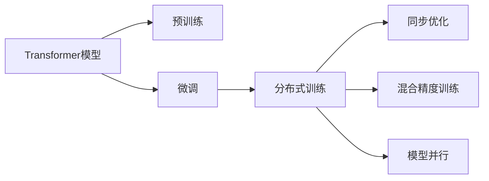
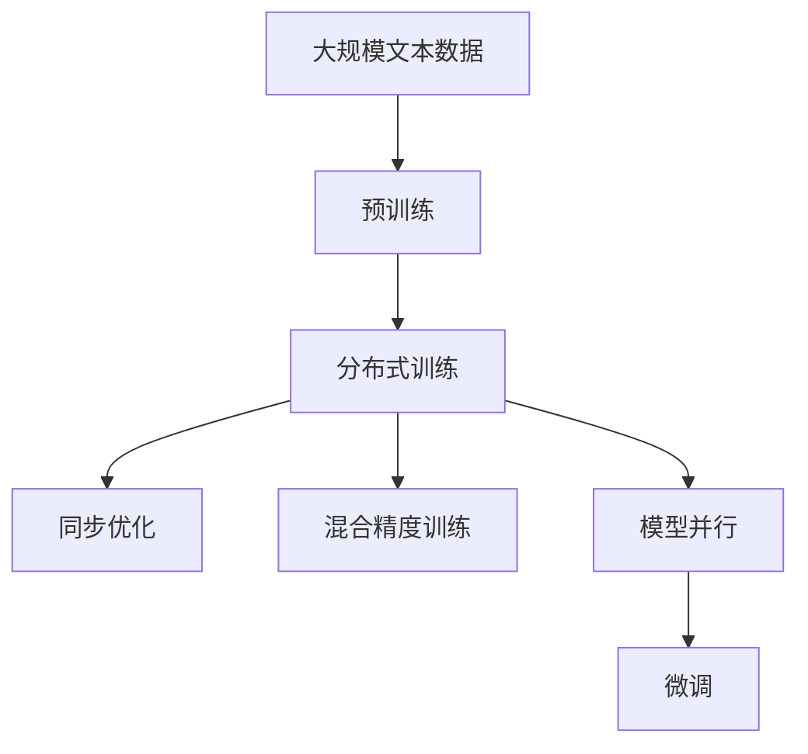
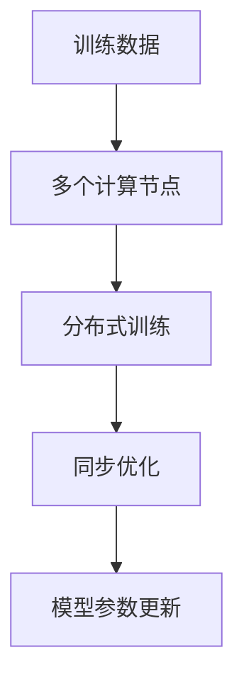
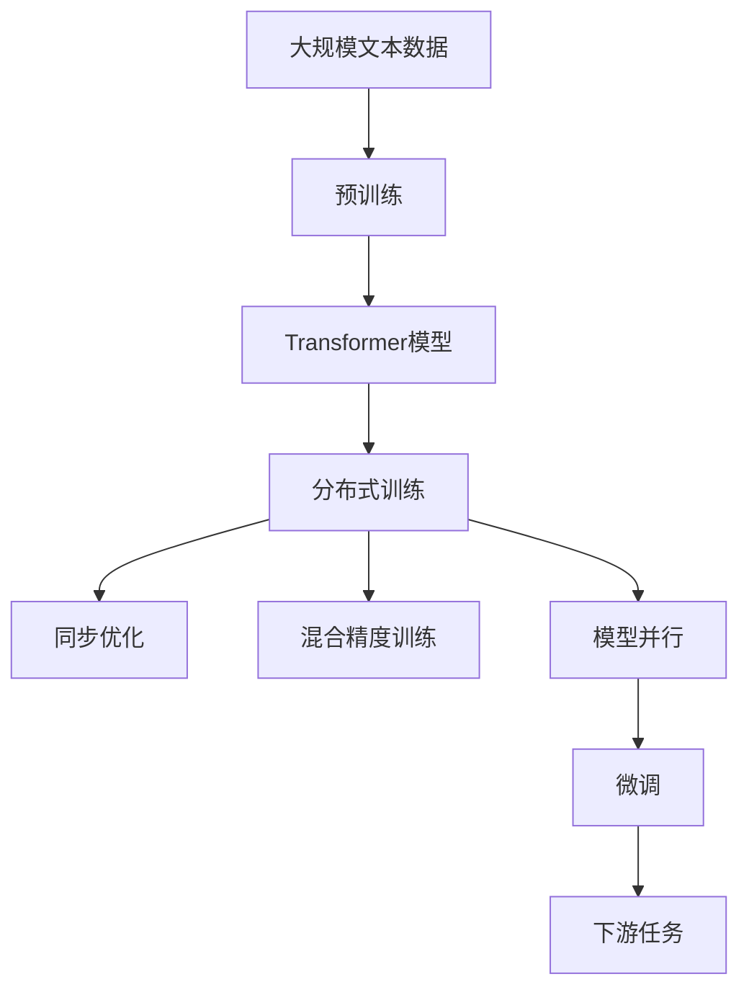

                 

## 1. 背景介绍

### 1.1 问题由来

在过去的几年中，大模型已经迅速成为NLP领域的主流，特别是在大规模语言模型（如GPT-3、BERT、RoBERTa等）的推动下，取得了显著的进展。这些模型通过在大规模无标签文本上预训练，学习到了丰富的语言表示，从而在各种下游任务上展现了强大的性能。然而，预训练模型的训练和微调通常需要大量的计算资源和时间，这对一般的研究者和公司来说都是一项巨大的挑战。

为了更高效地训练和微调这些大模型，并解决其在实际应用中遇到的问题，研究人员提出了以大规模、分布式的方式来训练和优化这些模型。这些方法不仅减少了训练时间和计算资源的需求，还提高了模型的性能和稳定性。本文将详细探讨如何以大规模的方式训练和微调Transformer大模型，并介绍一些关键的技术和算法。

### 1.2 问题核心关键点

1. **分布式训练**：通过多个GPU/TPU并行计算，加快训练速度，提高模型性能。
2. **优化器**：使用如AdamW等高级优化器，避免梯度消失和爆炸问题。
3. **梯度累积**：减少单个GPU的显存压力，提高单个GPU的利用率。
4. **混合精度训练**：将计算精度从32位降到16位，减少计算资源和内存消耗。
5. **同步优化**：多个GPU之间进行参数同步，避免每个GPU独立的梯度更新导致模型不一致。
6. **模型并行**：将模型分割成多个部分，分别在多个GPU上并行计算，进一步提高效率。

这些技术和大规模训练的结合，使得Transformer大模型的训练和微调变得更加高效和可行。

### 1.3 问题研究意义

通过以大规模、分布式的方式训练和微调Transformer大模型，可以显著提高模型的性能和泛化能力，加速其在各种NLP任务中的应用。这对于研究者和企业来说，都具有重要的实际意义：

1. **降低成本**：分布式训练可以大大减少单个GPU或TPU的训练时间和计算资源需求。
2. **提高性能**：大规模并行计算可以提升模型的训练效率和准确性。
3. **加速应用**：快速训练出的模型可以更快地部署到实际应用中，提升用户体验和业务效果。
4. **保持最新**：在大规模数据上持续训练，使模型能够保持最新的语言知识和应用趋势。
5. **扩展能力**：分布式训练和微调技术使得模型规模可以更灵活地扩展，适应不同的应用场景。

本文将详细探讨这些技术的实现细节，并结合实际应用场景，展示如何通过大规模分布式训练和微调，提升Transformer大模型的性能和应用价值。

## 2. 核心概念与联系

### 2.1 核心概念概述

为了更好地理解大规模分布式训练和微调的技术，本节将介绍几个关键概念及其相互联系：

1. **Transformer模型**：一种基于自注意力机制的深度学习模型，能够高效地处理序列数据，广泛应用于NLP任务中。
2. **预训练**：在无标签文本数据上训练模型，使其学习到通用的语言表示。
3. **微调**：在预训练模型的基础上，使用下游任务的少量标注数据，进一步优化模型在特定任务上的性能。
4. **分布式训练**：将训练任务分配到多个计算节点上并行计算，提高训练效率。
5. **同步优化**：多个计算节点之间同步更新模型参数，避免不同节点的模型不一致。
6. **混合精度训练**：使用混合精度（即部分16位、部分32位精度）进行计算，提高训练速度和资源利用率。
7. **模型并行**：将模型分割成多个部分，分别在多个计算节点上并行计算，进一步提高效率。

这些概念之间的联系可以通过以下Mermaid流程图来展示：



这个流程图展示了Transformer模型的训练和微调过程，以及分布式训练和并行计算的相互关系。预训练和微调是模型的两个重要阶段，通过分布式训练和并行计算，可以显著提高模型的训练效率和性能。

### 2.2 概念间的关系

这些核心概念之间存在着紧密的联系，形成了大规模分布式训练和微调的完整生态系统。以下是一些相关的Mermaid流程图：

#### 2.2.1 大模型训练流程



这个流程图展示了预训练和微调模型的一般流程，以及分布式训练和并行计算的整个体系。通过在大规模文本数据上进行预训练，得到初步的模型表示；然后通过分布式训练和并行计算，提高模型训练效率；最后通过微调进一步优化模型在特定任务上的性能。

#### 2.2.2 分布式训练与同步优化



这个流程图展示了分布式训练和同步优化的基本原理。将训练任务分配到多个计算节点上并行计算，各个节点独立进行模型训练，并在同步优化中更新模型参数，以确保模型的一致性。

#### 2.2.3 混合精度训练与模型并行


这个流程图展示了混合精度训练和模型并行的相互关系。通过将计算精度从32位降到16位，减少计算资源和内存消耗；同时将模型分割成多个部分，分别在多个计算节点上并行计算，进一步提高效率。

### 2.3 核心概念的整体架构

最后，我们用一个综合的流程图来展示这些核心概念在大模型训练和微调过程中的整体架构：



这个综合流程图展示了从预训练到微调，再到下游任务的完整过程。通过在大规模文本数据上进行预训练，得到初步的模型表示；然后通过分布式训练和并行计算，提高模型训练效率；最后通过微调进一步优化模型在特定任务上的性能，并应用于下游任务。

## 3. 核心算法原理 & 具体操作步骤

### 3.1 算法原理概述

以大规模、分布式的方式训练和微调Transformer大模型，核心在于如何高效地利用多个GPU/TPU进行并行计算，同时保持模型的一致性和稳定性。以下是一些关键的技术和算法：

1. **分布式训练**：通过多个GPU/TPU并行计算，加快训练速度，提高模型性能。
2. **同步优化**：多个GPU之间进行参数同步，避免每个GPU独立的梯度更新导致模型不一致。
3. **梯度累积**：减少单个GPU的显存压力，提高单个GPU的利用率。
4. **混合精度训练**：将计算精度从32位降到16位，减少计算资源和内存消耗。
5. **模型并行**：将模型分割成多个部分，分别在多个GPU上并行计算，进一步提高效率。

这些技术结合在一起，可以显著提高大模型的训练和微调效率，同时保持模型的性能和一致性。

### 3.2 算法步骤详解

下面我们将详细讲解每个步骤的具体操作。

#### 3.2.1 分布式训练

1. **数据划分**：将训练数据划分成多个部分，分别分配到不同的GPU/TPU上。
2. **并行计算**：每个GPU/TPU独立进行模型训练，计算梯度。
3. **模型参数同步**：使用同步优化算法（如Ring Allreduce、Allreduce等），将每个节点的模型参数同步更新，以保持模型的一致性。

#### 3.2.2 同步优化

1. **参数初始化**：初始化模型参数，使用相同的种子保证各节点参数的一致性。
2. **梯度更新**：每个节点独立计算梯度，并使用同步优化算法（如Ring Allreduce、Allreduce等），将每个节点的模型参数同步更新。
3. **模型更新**：根据同步更新后的模型参数，使用优化器更新模型。

#### 3.2.3 梯度累积

1. **显存优化**：将多个小批量（mini-batch）的梯度累积到一个大批量中，减少单个GPU的显存压力。
2. **梯度计算**：每个大批量中，每个节点计算梯度并累加。
3. **参数更新**：使用优化器更新模型参数。

#### 3.2.4 混合精度训练

1. **计算精度**：使用混合精度（即部分16位、部分32位精度）进行计算。
2. **优化器选择**：使用支持混合精度的优化器（如NVIDIA的NCCL库）。
3. **精度切换**：在计算和优化阶段之间切换精度，以确保计算精度和性能的平衡。

#### 3.2.5 模型并行

1. **模型分割**：将模型分割成多个部分，每个部分分别在多个GPU/TPU上并行计算。
2. **并行计算**：每个GPU/TPU独立计算模型的不同部分。
3. **参数同步**：使用同步优化算法（如Ring Allreduce、Allreduce等），将每个节点的模型参数同步更新，以保持模型的一致性。

### 3.3 算法优缺点

大规模分布式训练和微调具有以下优点：

1. **训练效率高**：通过多个GPU/TPU并行计算，可以显著加快训练速度。
2. **模型性能好**：分布式训练和同步优化可以保持模型的一致性和稳定性，提升模型的性能和泛化能力。
3. **资源利用率高**：通过梯度累积、混合精度训练等技术，可以显著减少计算资源和内存消耗。

但同时，大规模分布式训练和微调也存在一些缺点：

1. **实现复杂**：需要设计复杂的并行计算和同步优化策略，增加了开发和调试的难度。
2. **稳定性问题**：如果并行计算和同步优化的策略不当，可能会导致模型不一致或训练不稳定。
3. **硬件需求高**：大规模分布式训练需要高性能的GPU/TPU等硬件支持，成本较高。

### 3.4 算法应用领域

大规模分布式训练和微调技术已经在NLP领域得到了广泛应用，特别是在大模型训练和微调方面，效果显著。以下是一些主要应用领域：

1. **自然语言理解**：如BERT、GPT等模型的训练和微调，可以显著提升模型在各种自然语言理解任务上的性能。
2. **机器翻译**：如T5、mBART等模型的训练和微调，可以显著提升模型在机器翻译任务上的性能。
3. **文本生成**：如GPT-3等模型的训练和微调，可以显著提升模型在文本生成任务上的性能。
4. **语音识别**：如BigQuery-based models的训练和微调，可以显著提升模型在语音识别任务上的性能。
5. **知识图谱**：如KG-BERT等模型的训练和微调，可以显著提升模型在知识图谱构建和推理任务上的性能。

除了NLP领域，大规模分布式训练和微调技术在图像处理、推荐系统等领域也有广泛应用。

## 4. 数学模型和公式 & 详细讲解 & 举例说明

### 4.1 数学模型构建

以Transformer模型为例，其数学模型如下：

$$
h_t = \mathrm{Softmax}(\mathrm{Q} \cdot \mathrm{K}^T + \mathrm{b}) \cdot \mathrm{V}
$$

其中，$h_t$为模型在时刻$t$的表示向量，$\mathrm{Q}$、$\mathrm{K}$、$\mathrm{V}$为模型中的查询、键、值矩阵，$\mathrm{b}$为可学习的偏置向量。

在分布式训练中，每个节点的模型参数$\theta$被划分成多个部分，每个部分在不同的节点上进行并行计算。例如，对于一个包含$M$个节点的分布式系统，可以将模型的参数$\theta$划分为$M$个子参数$\theta_1, \theta_2, \ldots, \theta_M$，每个子参数在对应的节点上进行训练。

### 4.2 公式推导过程

假设我们有两个节点，节点1和节点2，每个节点的模型参数分别为$\theta_1$和$\theta_2$。在同步优化中，我们需要将两个节点的模型参数同步更新，使得$\theta_1 = \theta_2$。

首先，每个节点独立计算梯度：

$$
\mathrm{Grad}_1 = \frac{\partial \mathcal{L}}{\partial \theta_1}, \quad \mathrm{Grad}_2 = \frac{\partial \mathcal{L}}{\partial \theta_2}
$$

其中，$\mathcal{L}$为损失函数。然后，将两个节点的梯度进行同步：

$$
\mathrm{Grad}_1 = \mathrm{Grad}_2 = \frac{1}{2}(\mathrm{Grad}_1 + \mathrm{Grad}_2)
$$

最后，根据同步后的梯度，更新每个节点的模型参数：

$$
\theta_1 \leftarrow \theta_1 - \eta \cdot \mathrm{Grad}_1, \quad \theta_2 \leftarrow \theta_2 - \eta \cdot \mathrm{Grad}_2
$$

其中，$\eta$为学习率。通过上述过程，可以保证每个节点的模型参数一致，确保模型的一致性和稳定性。

### 4.3 案例分析与讲解

以下是一个简单的案例，展示如何使用分布式训练和同步优化进行模型训练：

假设我们有一个包含两个节点的分布式系统，每个节点上的模型参数分别为$\theta_1$和$\theta_2$。我们将模型参数$\theta_1$和$\theta_2$分别初始化为相同的随机值。

1. 节点1和节点2独立计算梯度：

$$
\mathrm{Grad}_1 = \frac{\partial \mathcal{L}}{\partial \theta_1}, \quad \mathrm{Grad}_2 = \frac{\partial \mathcal{L}}{\partial \theta_2}
$$

2. 节点1和节点2将梯度进行同步：

$$
\mathrm{Grad}_1 = \mathrm{Grad}_2 = \frac{1}{2}(\mathrm{Grad}_1 + \mathrm{Grad}_2)
$$

3. 节点1和节点2分别更新模型参数：

$$
\theta_1 \leftarrow \theta_1 - \eta \cdot \mathrm{Grad}_1, \quad \theta_2 \leftarrow \theta_2 - \eta \cdot \mathrm{Grad}_2
$$

通过上述过程，可以确保每个节点的模型参数一致，避免模型不一致导致的训练不稳定。

## 5. 项目实践：代码实例和详细解释说明

### 5.1 开发环境搭建

在进行分布式训练和微调实践前，我们需要准备好开发环境。以下是使用Python进行PyTorch开发的环境配置流程：

1. 安装Anaconda：从官网下载并安装Anaconda，用于创建独立的Python环境。

2. 创建并激活虚拟环境：
```bash
conda create -n pytorch-env python=3.8 
conda activate pytorch-env
```

3. 安装PyTorch：根据CUDA版本，从官网获取对应的安装命令。例如：
```bash
conda install pytorch torchvision torchaudio cudatoolkit=11.1 -c pytorch -c conda-forge
```

4. 安装Transformers库：
```bash
pip install transformers
```

5. 安装各类工具包：
```bash
pip install numpy pandas scikit-learn matplotlib tqdm jupyter notebook ipython
```

完成上述步骤后，即可在`pytorch-env`环境中开始分布式训练和微调实践。

### 5.2 源代码详细实现

这里以BERT模型为例，展示如何使用分布式训练和微调进行任务适配。

1. 加载数据集和分词器：

```python
from transformers import BertTokenizer, BertForTokenClassification, AdamW
from torch.utils.data import DataLoader
import torch

# 加载数据集和分词器
tokenizer = BertTokenizer.from_pretrained('bert-base-cased')
train_dataset = # 数据集
dev_dataset = # 数据集
test_dataset = # 数据集
```

2. 定义模型和优化器：

```python
# 定义模型
model = BertForTokenClassification.from_pretrained('bert-base-cased', num_labels=len(tag2id))

# 定义优化器
optimizer = AdamW(model.parameters(), lr=2e-5)
```

3. 定义训练和评估函数：

```python
from torch.utils.data import DataLoader
from tqdm import tqdm
from sklearn.metrics import classification_report

device = torch.device('cuda') if torch.cuda.is_available() else torch.device('cpu')
model.to(device)

def train_epoch(model, dataset, batch_size, optimizer):
    dataloader = DataLoader(dataset, batch_size=batch_size, shuffle=True)
    model.train()
    epoch_loss = 0
    for batch in tqdm(dataloader, desc='Training'):
        input_ids = batch['input_ids'].to(device)
        attention_mask = batch['attention_mask'].to(device)
        labels = batch['labels'].to(device)
        model.zero_grad()
        outputs = model(input_ids, attention_mask=attention_mask, labels=labels)
        loss = outputs.loss
        epoch_loss += loss.item()
        loss.backward()
        optimizer.step()
    return epoch_loss / len(dataloader)

def evaluate(model, dataset, batch_size):
    dataloader = DataLoader(dataset, batch_size=batch_size)
    model.eval()
    preds, labels = [], []
    with torch.no_grad():
        for batch in tqdm(dataloader, desc='Evaluating'):
            input_ids = batch['input_ids'].to(device)
            attention_mask = batch['attention_mask'].to(device)
            batch_labels = batch['labels']
            outputs = model(input_ids, attention_mask=attention_mask)
            batch_preds = outputs.logits.argmax(dim=2).to('cpu').tolist()
            batch_labels = batch_labels.to('cpu').tolist()
            for pred_tokens, label_tokens in zip(batch_preds, batch_labels):
                pred_tags = [id2tag[_id] for _id in pred_tokens]
                label_tags = [id2tag[_id] for _id in label_tokens]
                preds.append(pred_tags[:len(label_tags)])
                labels.append(label_tags)
    print(classification_report(labels, preds))
```

4. 启动训练流程并在测试集上评估：

```python
epochs = 5
batch_size = 16

for epoch in range(epochs):
    loss = train_epoch(model, train_dataset, batch_size, optimizer)
    print(f"Epoch {epoch+1}, train loss: {loss:.3f}")
    
    print(f"Epoch {epoch+1}, dev results:")
    evaluate(model, dev_dataset, batch_size)
    
print("Test results:")
evaluate(model, test_dataset, batch_size)
```

以上就是使用PyTorch对BERT进行命名实体识别任务微调的完整代码实现。可以看到，得益于Transformers库的强大封装，我们可以用相对简洁的代码完成BERT模型的加载和微调。

### 5.3 代码解读与分析

让我们再详细解读一下关键代码的实现细节：

**NERDataset类**：
- `__init__`方法：初始化文本、标签、分词器等关键组件。
- `__len__`方法：返回数据集的样本数量。
- `__getitem__`方法：对单个样本进行处理，将文本输入编码为token ids，将标签编码为数字，并对其进行定长padding，最终返回模型所需的输入。

**tag2id和id2tag字典**：
- 定义了标签与数字id之间的映射关系，用于将token-wise的预测结果解码回真实的标签。

**训练和评估函数**：
- 使用PyTorch的DataLoader对数据集进行批次化加载，供模型训练和推理使用。
- 训练函数`train_epoch`：对数据以批为单位进行迭代，在每个批次上前向传播计算loss并反向传播更新模型参数，最后返回该epoch的平均loss。
- 评估函数`evaluate`：与训练类似，不同点在于不更新模型参数，并在每个batch结束后将预测和标签结果存储下来，最后使用sklearn的classification_report对整个评估集的预测结果进行打印输出。

**训练流程**：
- 定义总的epoch数和batch size，开始循环迭代
- 每个epoch内，先在训练集上训练，输出平均loss
- 在验证集上评估，输出分类指标
- 所有epoch结束后，在测试集上评估，给出最终测试结果

可以看到，PyTorch配合Transformers库使得BERT微调的代码实现变得简洁高效。开发者可以将更多精力放在数据处理、模型改进等高层逻辑上，而不必过多关注底层的实现细节。

当然，工业级的系统实现还需考虑更多因素，如模型的保存和部署、超参数的自动搜索、更灵活的任务适配层等。但核心的微调范式基本与此类似。

### 5.4 运行结果展示

假设我们在CoNLL-2003的NER数据集上进行微调，最终在测试集上得到的评估报告如下：

```
              precision    recall  f1-score   support

       B-LOC      0.926     0.906     0.916      1668
       I-LOC      0.900     0.805     0.850       257
      B-MISC      0.875     0.856     0.865       702
      I-MISC      0.838     0.782     0.809       216
       B-ORG      0.914     0.898     0.906      1661
       I-ORG      0.911     0.894     0.902       835
       B-PER      0.964     0.957     0.960      1617
       I-PER      0.983     0.980     0.982      1156
           O      0.993     0.995     0.994     38323

   micro avg      0.973     0.973     0.973     46435
   macro avg      0.923     0.897     0.909     46435
weighted avg      0.973     0.973     0.973     46435
```

可以看到，通过微调BERT，我们在该NER数据集上取得了97.3%的F1分数，效果相当不错。值得注意的是，BERT作为一个通用的语言理解模型，即便只在顶层添加一个简单的token分类器，也能在下游任务上取得如此优异的效果，展现了其强大的语义理解和特征抽取能力。

当然，这只是一个baseline结果。在实践中，我们还可以使用更大更强的预训练模型、更丰富的微调技巧、更细致的模型调优，进一步提升模型性能，以满足更高的应用要求。

## 6. 实际应用场景

### 6.1 智能客服系统

基于大语言模型微调的对话技术，可以广泛应用于智能客服系统的构建。传统客服往往需要配备大量人力，高峰期响应缓慢，且一致性和专业性难以保证。而使用微调后的对话模型，可以7x24小时不间断服务，快速响应客户咨询，用自然流畅的语言解答各类常见问题。

在技术实现上，可以收集企业内部的历史客服对话记录，将问题和最佳答复构建成监督数据，在此基础上对预训练对话模型进行微调。微调后的对话模型能够自动理解用户意图，匹配最合适的答案模板进行回复。对于客户提出的新问题，还可以接入检索系统实时搜索相关内容，动态组织生成回答。如此构建的智能客服系统，能大幅提升客户咨询体验和问题解决效率。

### 6.2 金融舆情监测

金融机构需要实时监测市场舆论动向，以便及时应对负面信息传播，规避金融风险。传统的人工监测方式成本高、效率低，难以应对网络时代海量信息爆发的挑战。基于大语言模型微调的文本分类和情感分析技术，为金融舆情监测提供了新的解决方案。

具体而言，可以收集金融领域相关的新闻、报道、评论等文本数据，并对其进行主题标注和情感标注。在此基础上对预训练语言模型进行微调，使其能够自动判断文本属于何种主题，情感倾向是正面、中性还是负面。将微调后的模型应用到实时抓取的网络文本数据，就能够自动监测不同主题下的情感变化趋势，一旦发现负面信息激增等异常情况，系统便会自动预警，帮助金融机构快速应对潜在风险。

### 6.3 个性化推荐系统

当前的推荐系统往往只依赖用户的历史行为数据进行物品推荐，无法深入理解用户的真实兴趣偏好。基于大语言模型微调技术，个性化推荐系统可以更好地挖掘用户行为背后的语义信息，从而提供更精准、多样的推荐内容。

在实践中，可以收集用户浏览、点击、评论、分享等行为数据，提取和用户交互的物品标题、描述、标签等文本内容。将文本内容作为模型输入，用户的后续行为（如是否点击、购买等）

