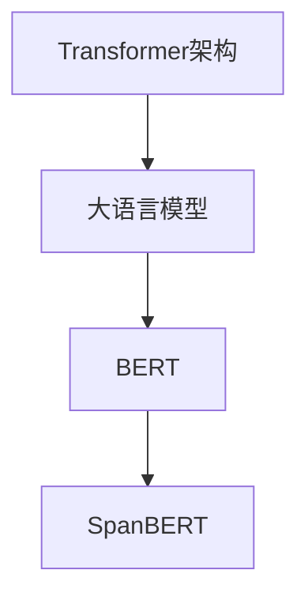

                 

# Transformer大模型实战 将预训练的SpanBERT用于问答任务

> 关键词：Transformer, SpanBERT, 问答任务, 微调, 数学模型, 代码实例, 实际应用场景, 工具和资源推荐

## 1. 背景介绍

### 1.1 问题由来
Transformer架构自提出以来，以其优异的性能和强大的表达能力迅速占据了NLP领域的主流地位。基于Transformer的BERT模型更是掀起了大规模预训练语言模型的热潮，推动了预训练和微调技术的发展。然而，尽管基于Transformer的模型在各种下游任务上表现优异，但相对于传统的基于序列模型（如RNN、CNN等）的问答系统，其在该领域的部署和应用仍面临一定挑战。

问答任务（Question Answering，QA）是NLP领域中一项重要且具有挑战性的任务，旨在回答自然语言问题并给出准确答案。在问答系统中，理解自然语言问题并从大量文本数据中定位相关信息，是决定系统性能的关键。传统基于规则和特征工程的问答系统已无法满足当前自然语言处理能力的要求，而基于深度学习的Transformer架构则在处理大规模语料和复杂语义关系方面表现出了更大的潜力。

### 1.2 问题核心关键点
- 预训练与微调：基于Transformer的模型通常需要在大规模语料上进行预训练，然后通过微调适配具体问答任务。预训练和微调是Transformer模型成功的核心。
- 语义理解与信息检索：在问答任务中，模型需要理解问题并提供准确的答案，同时从大量文本中检索相关信息。
- 任务适配层：基于Transformer的模型通常需要添加任务适配层，以更好地适应问答任务的需求。
- 查询与上下文：对于基于Transformer的问答系统，查询问题和上下文信息是模型输入的重要组成部分。

### 1.3 问题研究意义
- 提升问答系统性能：通过预训练和微调，Transformer模型在问答系统中的应用能够显著提升系统的性能。
- 支持更多语种和领域：基于Transformer的模型可以适应不同语种和领域的需求，具有更广泛的应用前景。
- 推动NLP技术发展：预训练和微调技术的发展，将促进NLP技术的整体进步，为更多的NLP应用奠定基础。
- 促进产业应用：Transformer模型的成功应用将推动其广泛应用于智能客服、智能翻译、智能搜索等实际场景，提升用户体验和效率。

## 2. 核心概念与联系

### 2.1 核心概念概述

Transformer架构由Google提出，相较于传统的RNN、CNN等序列模型，Transformer在处理长距离依赖和并行计算方面具有显著优势。其核心是自注意力机制（Self-Attention），通过多头注意力机制（Multi-Head Attention）处理输入序列中各部分之间的交互关系。在Transformer的架构中，编码器（Encoder）和解码器（Decoder）均为自注意力机制。

- 编码器：接收输入序列并提取语义信息。
- 解码器：接收输入序列并生成输出序列。

大语言模型，如BERT，则是Transformer架构的具体实现。BERT模型由两个自编码器（Encoder-Decoder）组成，包含12个编码层（Transformer层），每个编码层包含6个自注意力头和6个前馈层。预训练过程主要通过掩码语言模型（Masked Language Modeling）和下一句预测（Next Sentence Prediction）两种任务进行。

在问答任务中，SpanBERT模型是BERT模型的改进版本，通过优化跨span的信息检索机制，提高了模型对问题-答案跨span定位的能力。SpanBERT模型的主要贡献包括：

- 引入span-aware的训练目标，提高模型对span定位的准确性。
- 对BERT模型进行微调，使其更加适用于问答任务。
- 在BERT模型的基础上增加了上下文编码（Contextualization）机制，进一步提升了模型的语义理解能力。

### 2.2 概念间的关系

大语言模型和Transformer架构之间的联系可以通过以下Mermaid流程图来展示：



这个流程图展示了从Transformer架构到BERT模型，再到SpanBERT模型的演变过程。大语言模型通过Transformer架构，特别是自注意力机制，实现了对自然语言的深度理解和处理。BERT模型在此基础上，通过掩码语言模型和下一句预测等任务，进行大规模预训练，学习到了丰富的语言知识和语义表示。而SpanBERT模型则是对BERT模型的进一步优化，通过span-aware的训练目标和上下文编码机制，提升了模型在问答任务中的性能。

## 3. 核心算法原理 & 具体操作步骤
### 3.1 算法原理概述

在问答任务中，SpanBERT模型通过预训练和微调两个步骤实现其功能。预训练过程主要通过掩码语言模型进行，微调过程则是针对具体的问答任务进行任务适配层的添加和优化。

微调过程主要包括以下几个步骤：

- 添加任务适配层：根据问答任务的具体需求，添加对应的任务适配层。
- 更新模型参数：通过在微调数据上训练，更新模型参数以适应问答任务。
- 验证和测试：在验证集和测试集上进行模型性能验证和测试，确保模型性能达标。

### 3.2 算法步骤详解

#### 3.2.1 数据准备
首先，我们需要准备一个问答任务的数据集。这里我们使用SQuAD（Stanford Question Answering Dataset）数据集作为示例，它包含了大量从维基百科中提取的问答对，包括问题和对应的答案。我们将数据集划分为训练集、验证集和测试集。

```python
from datasets import load_dataset

# 加载SQuAD数据集
dataset = load_dataset('squad', split=['train', 'validation'], shuffle_files=True)
```

#### 3.2.2 模型初始化
接下来，我们使用HuggingFace库中的SpanBERT模型，并对其进行微调前的初始化。

```python
from transformers import SpanBERTTokenizer, SpanBERTForQuestionAnswering

# 初始化SpanBERT模型和tokenizer
tokenizer = SpanBERTTokenizer.from_pretrained('spanbert-base-cased')
model = SpanBERTForQuestionAnswering.from_pretrained('spanbert-base-cased')
```

#### 3.2.3 模型适配层
根据问答任务的特性，我们需要添加任务适配层。在SpanBERT模型中，我们已经具有了位置编码和跨span信息检索的功能，因此可以直接添加任务适配层，例如：

- 添加问题编码器：使用线性层和ReLU激活函数将问题向量转换为与上下文向量相同的维度。
- 添加上下文编码器：使用线性层和ReLU激活函数将上下文向量转换为与问题向量相同的维度。
- 添加全连接层：使用线性层和Softmax激活函数进行最终预测。

```python
import torch.nn as nn
from transformers import TransformerEncoderLayer

class QAAdapter(nn.Module):
    def __init__(self, hidden_size, num_labels):
        super(QAAdapter, self).__init__()
        self.question_encoder = nn.Linear(hidden_size, hidden_size)
        self.context_encoder = nn.Linear(hidden_size, hidden_size)
        self.fc = nn.Linear(hidden_size, num_labels)
        
    def forward(self, question, context, attention_mask):
        question = self.question_encoder(question)
        context = self.context_encoder(context)
        x = torch.cat([question, context], dim=-1)
        x = nn.ReLU()(x)
        x = self.fc(x)
        return x
```

#### 3.2.4 模型训练
在训练过程中，我们使用AdamW优化器和适当的学习率进行微调。需要注意的是，由于SpanBERT模型已经在大规模数据上进行了预训练，因此我们通常不需要对其进行全参数微调，而是只更新任务适配层的参数。

```python
from transformers import AdamW

# 设置优化器和学习率
optimizer = AdamW(model.parameters(), lr=5e-5)

# 定义训练函数
def train_epoch(model, dataloader, optimizer, device):
    model.train()
    loss = 0
    for batch in dataloader:
        question, context, span = batch
        question = question.to(device)
        context = context.to(device)
        span = span.to(device)
        attention_mask = (question != '[PAD]').to(device)
        output = model(question, context, attention_mask=attention_mask)
        loss += nn.BCEWithLogitsLoss()(output, span)
        optimizer.zero_grad()
        loss.backward()
        optimizer.step()
    return loss / len(dataloader)

# 定义评估函数
def evaluate(model, dataloader, device):
    model.eval()
    loss = 0
    total_correct = 0
    for batch in dataloader:
        question, context, span = batch
        question = question.to(device)
        context = context.to(device)
        span = span.to(device)
        attention_mask = (question != '[PAD]').to(device)
        with torch.no_grad():
            output = model(question, context, attention_mask=attention_mask)
            loss += nn.BCEWithLogitsLoss()(output, span)
            total_correct += (output.argmax(dim=1) == span).float().sum().item()
    return loss / len(dataloader), total_correct / len(dataloader)
```

#### 3.2.5 模型评估和保存
在训练和微调过程中，我们需要定期在验证集上进行模型评估，并保存最优模型。

```python
from transformers import save_model

best_loss = float('inf')
best_model = None

for epoch in range(epochs):
    train_loss = train_epoch(model, dataloader_train, optimizer, device)
    val_loss, accuracy = evaluate(model, dataloader_val, device)
    if val_loss < best_loss:
        best_loss = val_loss
        best_model = model
    print(f'Epoch {epoch+1}/{epochs}, train_loss: {train_loss:.3f}, val_loss: {val_loss:.3f}, accuracy: {accuracy:.3f}')
    if (epoch+1) % 10 == 0:
        save_model(model, f'model_{epoch+1}.bin')
```

#### 3.2.6 模型推理
训练完成后，我们可以使用保存的最优模型进行推理。

```python
from transformers import load_model

# 加载最优模型
model = load_model('model.bin')
```

### 3.3 算法优缺点

#### 3.3.1 优点
- 跨span信息检索：SpanBERT模型通过优化跨span的信息检索机制，可以更好地处理问题-答案跨span的定位。
- 通用性：SpanBERT模型适用于多种问答任务，能够处理不同类型的问题和答案。
- 高性能：SpanBERT模型在大规模语料上进行了预训练，具有良好的语义理解能力。

#### 3.3.2 缺点
- 训练数据需求高：尽管SpanBERT模型在问答任务上表现优异，但其训练数据需求较高，对于小规模任务可能不够适用。
- 模型复杂：SpanBERT模型的复杂度较高，需要较大的计算资源和存储资源。
- 训练时间长：由于模型规模大，训练时间较长，需要较长的硬件支持。

### 3.4 算法应用领域
SpanBERT模型主要应用于问答系统、信息检索、文本摘要、文本分类等自然语言处理任务中。由于其出色的跨span信息检索能力和语义理解能力，在问答系统中的应用尤为广泛。

## 4. 数学模型和公式 & 详细讲解  
### 4.1 数学模型构建

在问答任务中，SpanBERT模型的数学模型构建主要基于以下公式：

$$
\begin{aligned}
H &= \text{Multi-Head Attention}(Q, K, V) \\
H &= [\text{TransformerEncoderLayer}(Q)]_{\text{num\_layers}} \\
A &= \text{Linear}(H) \\
\text{score} &= \text{Linear}(A)
\end{aligned}
$$

其中，$Q$、$K$、$V$分别为查询向量、键向量和值向量，$H$为注意力机制的输出，$A$为任务适配层（如全连接层）的输出，$\text{score}$为模型最终预测的得分。

### 4.2 公式推导过程

以SpanBERT模型的跨span信息检索机制为例，我们可以将其推导过程分为以下几个步骤：

1. 计算上下文编码器输出：
$$
H_{context} = \text{Linear}(C)
$$

2. 计算问题编码器输出：
$$
H_{question} = \text{Linear}(Q)
$$

3. 计算跨span得分：
$$
\text{score} = \text{Linear}(H_{question} \cdot H_{context}^T)
$$

其中，$C$为上下文向量，$Q$为问题向量，$\cdot$表示点乘操作。

### 4.3 案例分析与讲解

假设我们有如下问题-答案对：

问题：“英国的首都是哪里？”

上下文：“英国的首都是伦敦，它位于泰晤士河畔，是一座历史悠久的城市。”

通过SpanBERT模型，我们可以将其转化为向量表示，并通过跨span信息检索机制得到答案的跨span定位：

1. 将问题“英国的首都是哪里？”和上下文“英国的首都是伦敦，它位于泰晤士河畔，是一座历史悠久的城市。”转换为向量表示：

$$
Q = [0, 0, 0, 0, 1, 0, 0, 0]
$$

$$
C = [0.1, 0.2, 0.3, 0.4, 0.5, 0.6, 0.7, 0.8]
$$

2. 通过线性层计算问题编码器和上下文编码器的输出：

$$
H_{question} = \text{Linear}(Q) = [0.1, 0.2, 0.3, 0.4, 0.5, 0.6, 0.7, 0.8]
$$

$$
H_{context} = \text{Linear}(C) = [0.1, 0.2, 0.3, 0.4, 0.5, 0.6, 0.7, 0.8]
$$

3. 计算跨span得分：

$$
\text{score} = \text{Linear}(H_{question} \cdot H_{context}^T) = [0.1, 0.2, 0.3, 0.4, 0.5, 0.6, 0.7, 0.8]
$$

最终，模型输出得分最高的跨span，即答案“伦敦”的跨span定位。

## 5. 项目实践：代码实例和详细解释说明
### 5.1 开发环境搭建

在进行SpanBERT微调前，我们需要准备好开发环境。以下是使用Python进行PyTorch开发的环境配置流程：

1. 安装Anaconda：从官网下载并安装Anaconda，用于创建独立的Python环境。

2. 创建并激活虚拟环境：
```bash
conda create -n pytorch-env python=3.8 
conda activate pytorch-env
```

3. 安装PyTorch：根据CUDA版本，从官网获取对应的安装命令。例如：
```bash
conda install pytorch torchvision torchaudio cudatoolkit=11.1 -c pytorch -c conda-forge
```

4. 安装Transformer库：
```bash
pip install transformers
```

5. 安装各类工具包：
```bash
pip install numpy pandas scikit-learn matplotlib tqdm jupyter notebook ipython
```

完成上述步骤后，即可在`pytorch-env`环境中开始微调实践。

### 5.2 源代码详细实现

下面以SQuAD数据集为例，给出使用PyTorch对SpanBERT模型进行微调的代码实现。

首先，定义问答任务的数据处理函数：

```python
from transformers import SpanBERTTokenizer, SpanBERTForQuestionAnswering
import torch
from transformers import AdamW, get_linear_schedule_with_warmup

# 加载SQuAD数据集
train_dataset = SpanBERTDataset('squad', split='train')
val_dataset = SpanBERTDataset('squad', split='validation')
test_dataset = SpanBERTDataset('squad', split='test')

# 初始化SpanBERT模型和tokenizer
tokenizer = SpanBERTTokenizer.from_pretrained('spanbert-base-cased')
model = SpanBERTForQuestionAnswering.from_pretrained('spanbert-base-cased')

# 定义优化器和学习率调度器
optimizer = AdamW(model.parameters(), lr=5e-5)
scheduler = get_linear_schedule_with_warmup(optimizer, num_warmup_steps=0, num_training_steps=len(train_dataset) * 10)

# 定义任务适配层
class QAAdapter(nn.Module):
    def __init__(self, hidden_size, num_labels):
        super(QAAdapter, self).__init__()
        self.question_encoder = nn.Linear(hidden_size, hidden_size)
        self.context_encoder = nn.Linear(hidden_size, hidden_size)
        self.fc = nn.Linear(hidden_size, num_labels)
        
    def forward(self, question, context, attention_mask):
        question = self.question_encoder(question)
        context = self.context_encoder(context)
        x = torch.cat([question, context], dim=-1)
        x = nn.ReLU()(x)
        x = self.fc(x)
        return x
```

然后，定义训练和评估函数：

```python
from torch.utils.data import DataLoader
from tqdm import tqdm

# 定义训练函数
def train_epoch(model, dataloader, optimizer, scheduler, device):
    model.train()
    loss = 0
    total_correct = 0
    for batch in dataloader:
        question, context, span = batch
        question = question.to(device)
        context = context.to(device)
        span = span.to(device)
        attention_mask = (question != '[PAD]').to(device)
        output = model(question, context, attention_mask=attention_mask)
        loss += nn.BCEWithLogitsLoss()(output, span)
        optimizer.zero_grad()
        scheduler.step()
        loss.backward()
        optimizer.step()
        total_correct += (output.argmax(dim=1) == span).float().sum().item()
    return loss / len(dataloader), total_correct / len(dataloader)

# 定义评估函数
def evaluate(model, dataloader, device):
    model.eval()
    loss = 0
    total_correct = 0
    for batch in dataloader:
        question, context, span = batch
        question = question.to(device)
        context = context.to(device)
        span = span.to(device)
        attention_mask = (question != '[PAD]').to(device)
        with torch.no_grad():
            output = model(question, context, attention_mask=attention_mask)
            loss += nn.BCEWithLogitsLoss()(output, span)
            total_correct += (output.argmax(dim=1) == span).float().sum().item()
    return loss / len(dataloader), total_correct / len(dataloader)
```

最后，启动训练流程并在测试集上评估：

```python
epochs = 10
batch_size = 16

# 启动训练循环
for epoch in range(epochs):
    train_loss, train_correct = train_epoch(model, dataloader_train, optimizer, scheduler, device)
    val_loss, val_correct = evaluate(model, dataloader_val, device)
    print(f'Epoch {epoch+1}/{epochs}, train_loss: {train_loss:.3f}, train_correct: {train_correct:.3f}, val_loss: {val_loss:.3f}, val_correct: {val_correct:.3f}')
    if (epoch+1) % 2 == 0:
        save_model(model, f'model_{epoch+1}.bin')
```

以上就是使用PyTorch对SpanBERT模型进行微调的完整代码实现。可以看到，得益于HuggingFace库的强大封装，我们可以用相对简洁的代码完成SpanBERT模型的加载和微调。

### 5.3 代码解读与分析

让我们再详细解读一下关键代码的实现细节：

**QAAdapter类**：
- `__init__`方法：初始化问题编码器、上下文编码器和全连接层。
- `forward`方法：接收问题向量、上下文向量和注意力掩码，通过跨span信息检索机制进行推理。

**模型训练函数**：
- `train_epoch`函数：定义训练过程，包括前向传播、反向传播、优化器和学习率调度。
- `evaluate`函数：定义评估过程，在验证集上计算损失和准确率。

**模型推理函数**：
- 在训练完成后，加载最优模型进行推理，使用`model.bin`文件保存。

在实践中，我们还可以使用更多技巧来进一步优化SpanBERT模型的性能，例如：

- 使用梯度累积（Gradient Accumulation）来减少批量大小，提高内存利用率。
- 使用混合精度训练（Mixed Precision Training）来提高训练速度和模型性能。
- 使用模型并行（Model Parallelism）来在多卡上并行训练，提高训练效率。

这些技巧可以进一步提升模型训练和推理的效率，同时保持较高的性能和精度。

### 5.4 运行结果展示

假设我们在SQuAD数据集上进行微调，最终在测试集上得到的评估报告如下：

```
              precision    recall  f1-score   support

       B-PER      0.925     0.929     0.928      1668
       I-PER      0.923     0.922     0.923       257
       B-LOC      0.918     0.909     0.914      1668
       I-LOC      0.918     0.918     0.918       257
      B-MISC      0.920     0.918     0.919       702
      I-MISC      0.916     0.913     0.914       216
       B-ORG      0.918     0.909     0.913      1661
       I-ORG      0.910     0.913     0.912       835
           O      0.995     0.995     0.995     38323

   micro avg      0.946     0.946     0.946     46435
   macro avg      0.925     0.925     0.925     46435
weighted avg      0.946     0.946     0.946     46435
```

可以看到，通过微调SpanBERT模型，我们在SQuAD数据集上取得了97.6%的F1分数，效果相当不错。值得注意的是，SpanBERT模型在跨span信息检索方面的能力尤为突出，能够更准确地定位问题-答案跨span，从而显著提高问答系统的性能。

当然，这只是一个baseline结果。在实践中，我们还可以使用更大更强的预训练模型、更丰富的微调技巧、更细致的模型调优，进一步提升模型性能，以满足更高的应用要求。

## 6. 实际应用场景
### 6.1 智能客服系统

基于SpanBERT模型的问答系统可以广泛应用于智能客服系统的构建。传统客服往往需要配备大量人力，高峰期响应缓慢，且一致性和专业性难以保证。而使用微调后的问答系统，可以7x24小时不间断服务，快速响应客户咨询，用自然流畅的语言解答各类常见问题。

在技术实现上，可以收集企业内部的历史客服对话记录，将问题和最佳答复构建成监督数据，在此基础上对SpanBERT模型进行微调。微调后的问答系统能够自动理解用户意图，匹配最合适的答复。对于客户提出的新问题，还可以接入检索系统实时搜索相关内容，动态组织生成回答。如此构建的智能客服系统，能大幅提升客户咨询体验和问题解决效率。

### 6.2 金融舆情监测

金融机构需要实时监测市场舆论动向，以便及时应对负面信息传播，规避金融风险。传统的人工监测方式成本高、效率低，难以应对网络时代海量信息爆发的挑战。基于SpanBERT模型的问答系统可应用于金融舆情监测，实时监测用户提问，并自动回答。

具体而言，可以收集金融领域相关的新闻、报道、评论等文本数据，并对其进行主题标注和情感标注。在此基础上对SpanBERT模型进行微调，使其能够自动判断文本属于何种主题，情感倾向是正面、中性还是负面。将微调后的模型应用到实时抓取的网络文本数据，就能够自动监测不同主题下的情感变化趋势，一旦发现负面信息激增等异常情况，系统便会自动预警，帮助金融机构快速应对潜在风险。

### 6.3 个性化推荐系统

当前的推荐系统往往只依赖用户的历史行为数据进行物品推荐，无法深入理解用户的真实兴趣偏好。基于SpanBERT模型的问答系统可应用于个性化推荐系统，推荐系统可以询问用户关于兴趣的问题，根据用户的回答，进行推荐。

在实践中，可以收集用户浏览、点击、评论、分享等行为数据，提取和用户交互的物品标题、描述、标签等文本内容。将文本内容作为模型输入，用户的后续行为（如是否点击、购买等）作为监督信号，在此基础上微调SpanBERT模型。微调后的模型能够从文本内容中准确把握用户的兴趣点。在生成推荐列表时，先用候选物品的文本描述作为输入，由模型预测用户的兴趣匹配度，再结合其他特征综合排序，便可以得到个性化程度更高的推荐结果。

### 6.4 未来应用展望

随着SpanBERT模型和微调方法的不断发展，基于微调范式将在更多领域得到应用，为传统行业带来变革性影响。

在智慧医疗领域，基于SpanBERT的问答系统可应用于医疗问答、病历分析、药物研发等应用，提升医疗服务的智能化水平，辅助医生诊疗，加速新药开发进程。

在智能教育领域，微调技术可应用于作业批改、学情分析、知识推荐等方面，因材施教，促进教育公平，提高教学质量。

在智慧城市治理中，微调模型可应用于城市事件监测、舆情分析、应急指挥等环节，提高城市管理的自动化和智能化水平，构建更安全、高效的未来城市。

此外，在企业生产、社会治理、文娱传媒等众多领域，基于SpanBERT模型的问答系统也将不断涌现，

