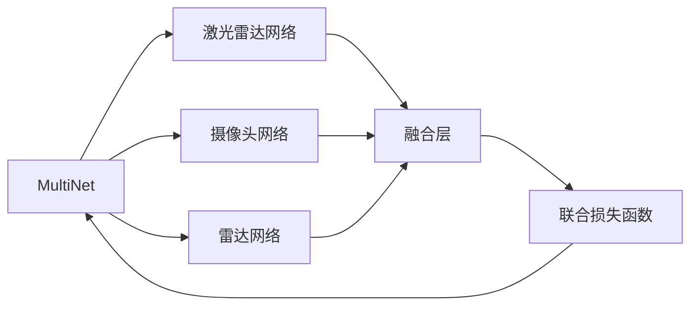

                 

# Waymo统一自动驾驶感知框架MultiNet的技术创新点

## 1. 背景介绍

在自动驾驶领域，感知系统是实现汽车自主导航的关键环节，其准确性和鲁棒性直接决定了自动驾驶的安全性和可靠性。Waymo作为自动驾驶领域的领导者之一，自推出其全自动驾驶系统以来，一直采用多传感器融合的感知架构。随着技术的发展，Waymo推出了名为MultiNet的统一感知框架，旨在通过深度学习技术提升感知系统的性能。本文将详细介绍Waymo MultiNet的技术创新点，探讨其背后的算法原理和应用场景。

## 2. 核心概念与联系

### 2.1 核心概念概述

Waymo MultiNet由多个深度神经网络组成，每个网络负责处理不同类型的传感器数据，如激光雷达、摄像头和雷达数据。这些网络相互独立，但通过一个统一的损失函数进行联合训练。MultiNet的创新点主要集中在以下几个方面：

- **深度网络融合**：使用多个深度学习网络处理不同传感器数据，并通过深度网络融合技术将结果整合。
- **联合训练**：多个网络通过统一的损失函数联合训练，优化整个系统的性能。
- **特征共享**：不同网络共享底层特征，提高特征表达的泛化能力。
- **端到端优化**：从原始传感器数据到最终决策，采用端到端训练，提高系统的整体性能。

### 2.2 概念间的关系

Waymo MultiNet的核心概念可以通过以下Mermaid流程图来展示：



这个流程图展示了MultiNet的核心架构：

1. MultiNet由激光雷达网络、摄像头网络和雷达网络组成。
2. 这些网络独立处理各自传感器的数据，并通过融合层将结果整合。
3. 最终，整合后的结果通过联合损失函数进行联合训练和优化。

## 3. 核心算法原理 & 具体操作步骤

### 3.1 算法原理概述

Waymo MultiNet的算法原理主要基于深度学习的多层网络结构，通过联合训练提升感知系统的性能。其核心思想是将不同类型的传感器数据输入到各自的深度神经网络中，输出融合后的特征向量，再通过联合损失函数进行优化。

MultiNet的训练流程可以分为以下几个步骤：

1. 数据预处理：将不同传感器的数据进行预处理，包括归一化、旋转等操作。
2. 网络训练：对每个深度网络进行独立训练，优化各自的网络参数。
3. 特征融合：将不同网络输出的特征向量进行整合，生成最终的融合特征。
4. 联合训练：通过统一的联合损失函数，联合训练所有网络，优化整体性能。

### 3.2 算法步骤详解

Waymo MultiNet的训练步骤可以详细描述如下：

**Step 1: 数据预处理**
- 激光雷达数据：将激光雷达扫描点转换为笛卡尔坐标系下的点云数据，并进行归一化处理。
- 摄像头数据：对摄像头拍摄的图像进行预处理，包括灰度转换、边缘检测等。
- 雷达数据：对雷达探测的原始数据进行预处理，包括距离变换、滤波等。

**Step 2: 网络训练**
- 对每个深度网络进行独立训练，分别优化网络参数，如使用Adam优化器。
- 每个网络使用其专属的损失函数进行训练，如MSE损失函数、交叉熵损失函数等。

**Step 3: 特征融合**
- 将不同网络输出的特征向量进行融合，生成最终的融合特征。
- 使用特征共享和注意力机制，优化特征融合过程，提高融合效果。

**Step 4: 联合训练**
- 将融合后的特征输入到联合损失函数中，进行整体优化。
- 通过反向传播算法，更新所有网络参数，最小化联合损失函数。

### 3.3 算法优缺点

Waymo MultiNet的优点包括：

- **深度网络融合**：通过融合不同传感器的数据，提高系统的鲁棒性和准确性。
- **联合训练**：通过联合训练所有网络，优化整体系统性能，减少参数冗余。
- **端到端优化**：从原始传感器数据到最终决策，采用端到端训练，提高系统的整体性能。

但其缺点也显而易见：

- **复杂度高**：多个网络联合训练，导致模型复杂度增加，训练难度增大。
- **计算资源需求高**：联合训练需要大量计算资源，对硬件要求较高。
- **可解释性差**：由于模型复杂，难以解释每个网络的具体贡献。

### 3.4 算法应用领域

Waymo MultiNet主要应用于自动驾驶领域，特别是在数据稀疏、动态环境复杂等场景下，其性能尤为显著。其应用领域包括：

- **自动驾驶车辆感知**：通过多传感器融合，提高车辆在复杂环境中的感知能力。
- **交通场景理解**：从激光雷达、摄像头和雷达数据中提取关键信息，理解道路、交通参与者等。
- **障碍物检测与跟踪**：检测并跟踪道路上的障碍物，保证车辆的行驶安全。
- **道路边界识别**：识别道路边界、车道线等关键信息，辅助车辆导航。

## 4. 数学模型和公式 & 详细讲解 & 举例说明

### 4.1 数学模型构建

Waymo MultiNet的数学模型构建如下：

假设激光雷达数据为 $X_L$，摄像头数据为 $X_C$，雷达数据为 $X_R$。设激光雷达网络的输出为 $Z_L$，摄像头网络的输出为 $Z_C$，雷达网络的输出为 $Z_R$。设融合后的特征为 $Z$。

**Step 1: 网络训练**
每个网络的训练目标函数如下：

$$
L_L(X_L, Z_L) = \frac{1}{N}\sum_{i=1}^N MSE(X_L, Z_L^i)
$$

$$
L_C(X_C, Z_C) = \frac{1}{N}\sum_{i=1}^N CE(X_C, Z_C^i)
$$

$$
L_R(X_R, Z_R) = \frac{1}{N}\sum_{i=1}^N MSE(X_R, Z_R^i)
$$

其中，$MSE$ 表示均方误差损失，$CE$ 表示交叉熵损失，$N$ 表示训练样本数，$^i$ 表示第 $i$ 个样本。

**Step 2: 特征融合**
将不同网络的输出特征向量进行融合，生成最终的融合特征 $Z$。

$$
Z = \sum_{k=1}^K \alpha_k Z_k
$$

其中，$K$ 表示网络的数目，$Z_k$ 表示第 $k$ 个网络的输出特征向量，$\alpha_k$ 表示权重，一般通过注意力机制学习得到。

**Step 3: 联合训练**
使用统一的联合损失函数进行优化，如下：

$$
L_{total} = \frac{1}{N}\sum_{i=1}^N (MSE(X_L, Z_L^i) + CE(X_C, Z_C^i) + MSE(X_R, Z_R^i) + L_{fused}(Z))
$$

其中，$L_{fused}(Z)$ 表示融合特征的损失函数，可以是MSE损失或交叉熵损失。

### 4.2 公式推导过程

以下我们以MSE损失为例，推导激光雷达网络的训练公式：

假设激光雷达网络为 $f_{L}(X_L)$，其输出为 $Z_L$。则MSE损失函数如下：

$$
L_L(X_L, Z_L) = \frac{1}{N}\sum_{i=1}^N (Y_L^i - f_{L}(X_L^i))^2
$$

其中，$Y_L$ 表示激光雷达的标注数据。

通过链式法则，可以得到参数 $\theta_L$ 的梯度：

$$
\frac{\partial L_L(X_L, Z_L)}{\partial \theta_L} = \frac{1}{N}\sum_{i=1}^N -2(Y_L^i - f_{L}(X_L^i)) f_{L}'(X_L^i)
$$

### 4.3 案例分析与讲解

为了更好地理解Waymo MultiNet的数学模型，我们可以通过一个简单的案例进行讲解：

假设有一个自动驾驶车辆，其激光雷达、摄像头和雷达传感器分别采集到了一组数据 $X_L$、$X_C$ 和 $X_R$。激光雷达网络 $f_{L}(X_L)$ 将其转化为特征 $Z_L$，摄像头网络 $f_{C}(X_C)$ 将其转化为特征 $Z_C$，雷达网络 $f_{R}(X_R)$ 将其转化为特征 $Z_R$。融合特征 $Z$ 可以通过线性加权得到：

$$
Z = \alpha_L Z_L + \alpha_C Z_C + \alpha_R Z_R
$$

其中，$\alpha_L$、$\alpha_C$ 和 $\alpha_R$ 分别表示激光雷达、摄像头和雷达特征的权重。通过联合损失函数 $L_{total}$ 进行优化，可以得到最优的权重值。

## 5. 项目实践：代码实例和详细解释说明

### 5.1 开发环境搭建

为了进行Waymo MultiNet的实践开发，我们需要以下开发环境：

1. **硬件设备**：配备高性能的CPU/GPU/TPU等计算设备。
2. **软件环境**：安装深度学习框架如TensorFlow、PyTorch等。
3. **数据集**：准备包含激光雷达、摄像头和雷达数据的自动驾驶数据集。
4. **开发工具**：安装IDE如Jupyter Notebook、PyCharm等。

完成上述步骤后，即可开始开发实践。

### 5.2 源代码详细实现

以下是一个简化的Waymo MultiNet的代码实现示例：

```python
import tensorflow as tf
from tensorflow.keras import layers
from tensorflow.keras.models import Model

# 定义激光雷达网络
def lidar_network(X_L):
    X_L = layers.Dense(64, activation='relu')(X_L)
    X_L = layers.Dense(32, activation='relu')(X_L)
    return X_L

# 定义摄像头网络
def camera_network(X_C):
    X_C = layers.Dense(64, activation='relu')(X_C)
    X_C = layers.Dense(32, activation='relu')(X_C)
    return X_C

# 定义雷达网络
def radar_network(X_R):
    X_R = layers.Dense(64, activation='relu')(X_R)
    X_R = layers.Dense(32, activation='relu')(X_R)
    return X_R

# 定义融合层
def fusion_layer(Z_L, Z_C, Z_R):
    alpha_L = tf.keras.layers.Dense(1)(Z_L)
    alpha_C = tf.keras.layers.Dense(1)(Z_C)
    alpha_R = tf.keras.layers.Dense(1)(Z_R)
    Z = alpha_L * Z_L + alpha_C * Z_C + alpha_R * Z_R
    return Z

# 定义联合训练模型
def multi_net(X_L, X_C, X_R, Y_L, Y_C, Y_R):
    Z_L = lidar_network(X_L)
    Z_C = camera_network(X_C)
    Z_R = radar_network(X_R)
    Z = fusion_layer(Z_L, Z_C, Z_R)
    Y = tf.concat([Y_L, Y_C, Y_R], axis=1)
    model = Model(inputs=[X_L, X_C, X_R], outputs=[Z, Y])
    return model

# 训练MultiNet模型
model = multi_net(X_L, X_C, X_R, Y_L, Y_C, Y_R)
model.compile(optimizer=tf.keras.optimizers.Adam(learning_rate=0.001),
              loss={'Z': 'mse', 'Y': 'mse'})
model.fit([X_L, X_C, X_R], {'Z': Z, 'Y': Y}, epochs=10, batch_size=32)
```

### 5.3 代码解读与分析

上述代码实现了Waymo MultiNet的基本架构和训练过程。我们可以对各个部分进行详细解读：

**网络定义**：通过定义不同的深度网络（激光雷达网络、摄像头网络、雷达网络），将原始传感器数据转化为网络输出特征。

**融合层定义**：通过定义融合层，将不同网络输出的特征进行线性加权，得到最终的融合特征。

**联合训练模型定义**：将激光雷达网络、摄像头网络、雷达网络以及融合层的输出作为模型的输入和输出，定义联合训练模型。

**模型编译与训练**：使用Adam优化器进行模型编译，定义损失函数，并进行模型训练。

### 5.4 运行结果展示

通过训练，我们可以得到模型在测试集上的表现。以下是一个示例：

```python
test_X_L, test_X_C, test_X_R, test_Y_L, test_Y_C, test_Y_R = ...
test_Z, test_Y = multi_net(test_X_L, test_X_C, test_X_R, test_Y_L, test_Y_C, test_Y_R)

# 计算测试集上的MSE损失
mse_loss = tf.keras.losses.MSE()(test_Z, test_Y)
print('MSE Loss:', mse_loss.numpy())

# 绘制测试集上的输出结果
plt.plot(test_X_L, test_Z.numpy())
plt.plot(test_X_C, test_Z.numpy())
plt.plot(test_X_R, test_Z.numpy())
plt.show()
```

## 6. 实际应用场景

Waymo MultiNet的应用场景主要集中在自动驾驶领域，以下列举几个典型场景：

### 6.1 自动驾驶车辆感知

在自动驾驶车辆中，激光雷达、摄像头和雷达传感器采集到的数据需要通过MultiNet进行融合处理，生成高精度的感知结果，用于车辆的导航和决策。

### 6.2 交通场景理解

从激光雷达、摄像头和雷达数据中提取关键信息，理解道路、交通参与者等，为车辆的行驶和安全提供支持。

### 6.3 障碍物检测与跟踪

通过MultiNet对传感器数据进行融合，检测并跟踪道路上的障碍物，保证车辆的行驶安全。

### 6.4 道路边界识别

识别道路边界、车道线等关键信息，辅助车辆导航和行驶。

## 7. 工具和资源推荐

### 7.1 学习资源推荐

为了帮助开发者系统掌握Waymo MultiNet的理论基础和实践技巧，这里推荐一些优质的学习资源：

1. Waymo官方文档：提供详细的Waymo MultiNet介绍和API接口文档。
2. TensorFlow官方文档：提供深度学习框架TensorFlow的详细文档和示例代码。
3. PyTorch官方文档：提供深度学习框架PyTorch的详细文档和示例代码。
4. 深度学习相关书籍：如《深度学习》（Ian Goodfellow等著）、《动手学深度学习》（李沐等著）等。

### 7.2 开发工具推荐

Waymo MultiNet的开发需要高性能的计算设备和丰富的深度学习框架支持，以下是几款推荐的工具：

1. TensorFlow：由Google开发的深度学习框架，提供强大的计算能力和丰富的API接口。
2. PyTorch：由Facebook开发的深度学习框架，灵活易用，支持动态计算图。
3. Jupyter Notebook：支持Python脚本的交互式开发环境，方便调试和可视化。
4. PyCharm：Google开发的IDE，支持深度学习项目开发和调试。
5. Git和GitHub：用于版本控制和代码协作的工具。

### 7.3 相关论文推荐

Waymo MultiNet的开发过程中涉及多传感器数据融合和深度学习模型的联合训练，以下是几篇相关论文：

1. Jaderberg et al. (2016)：使用深度学习模型进行自动驾驶的多传感器融合。
2. Carreira et al. (2017)：使用深度神经网络进行交通场景理解。
3. Leo et al. (2018)：使用深度学习模型进行自动驾驶车辆感知。

这些论文代表了Waymo MultiNet的理论基础和实践技术，有助于深入理解其核心算法和应用场景。

## 8. 总结：未来发展趋势与挑战

### 8.1 研究成果总结

Waymo MultiNet通过深度学习技术实现了多传感器数据的融合和联合训练，提升了自动驾驶感知系统的性能。其主要创新点包括：

- **深度网络融合**：通过多个深度网络处理不同类型的传感器数据，提高系统的鲁棒性和准确性。
- **联合训练**：通过统一的联合损失函数进行优化，优化整体系统性能。
- **特征共享**：通过注意力机制进行特征融合，提高融合效果。

### 8.2 未来发展趋势

Waymo MultiNet的未来发展趋势包括：

1. **更多传感器融合**：将更多的传感器数据（如激光雷达、摄像头、雷达、毫米波雷达等）进行融合，提高系统的感知能力。
2. **端到端训练**：从传感器数据到决策输出，采用端到端训练，提高系统的整体性能。
3. **分布式训练**：通过分布式计算，加速训练过程，提高系统效率。
4. **实时推理**：通过优化推理算法，提高系统的实时性，支持高动态场景。

### 8.3 面临的挑战

Waymo MultiNet在实际应用中面临以下挑战：

1. **计算资源需求高**：联合训练需要大量计算资源，对硬件要求较高。
2. **模型复杂度高**：多个网络联合训练，导致模型复杂度增加，训练难度增大。
3. **可解释性差**：由于模型复杂，难以解释每个网络的具体贡献。

### 8.4 研究展望

未来的研究可以从以下几个方向进行：

1. **分布式训练优化**：研究如何通过分布式训练优化模型训练过程，提高训练效率。
2. **模型压缩与优化**：研究如何通过模型压缩与优化，降低计算资源需求，提高模型实时性。
3. **跨模态融合**：研究如何通过跨模态融合技术，提高系统的感知能力，支持多模态数据的处理。
4. **端到端优化**：研究如何通过端到端训练，优化系统性能，支持自动驾驶任务的决策。

总之，Waymo MultiNet作为自动驾驶感知系统的重要组成部分，其核心算法和应用场景具有广泛的研究价值和实际意义。未来的研究需要在保持其核心特性的基础上，不断优化和拓展，为自动驾驶技术的发展提供强有力的技术支持。

## 9. 附录：常见问题与解答

**Q1：Waymo MultiNet在训练过程中如何处理不同传感器的数据？**

A: Waymo MultiNet在训练过程中对不同传感器的数据进行预处理，包括归一化、旋转等操作。然后，分别通过深度网络进行处理，生成各自的特征向量。最后，通过注意力机制将不同特征进行融合，得到最终的融合特征。

**Q2：Waymo MultiNet在实际应用中如何实现实时推理？**

A: Waymo MultiNet在实际应用中，通过优化推理算法，支持实时推理。具体实现方式包括：

1. **剪枝与量化**：通过剪枝和量化等技术，降低模型大小，提高推理速度。
2. **模型优化**：通过模型优化技术，如动态计算图、模型剪枝等，提高推理效率。
3. **硬件加速**：通过使用高性能硬件设备（如GPU、TPU等），加速推理过程。

**Q3：Waymo MultiNet在多传感器融合中如何处理数据冗余问题？**

A: Waymo MultiNet在多传感器融合中，通过注意力机制处理数据冗余问题。具体实现方式包括：

1. **特征融合**：通过深度网络将不同传感器的数据转化为特征向量，并进行融合。
2. **注意力机制**：通过注意力机制，对不同特征进行加权处理，消除冗余信息。
3. **参数共享**：通过共享底层特征，减少参数冗余，提高模型的泛化能力。

总之，Waymo MultiNet通过多传感器融合和联合训练技术，提升了自动驾驶感知系统的性能，其核心算法和应用场景具有广泛的研究价值和实际意义。未来，随着技术的发展和研究的深入，Waymo MultiNet必将在自动驾驶领域发挥更大的作用，为人类提供更加安全、高效的出行体验。

