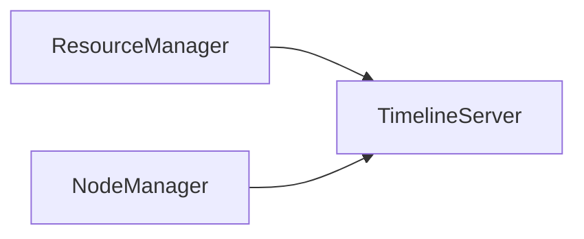
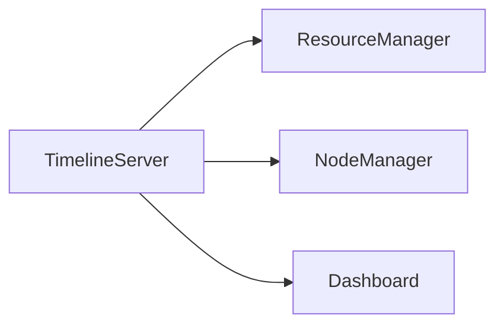

                 

# YARN Timeline Server原理与代码实例讲解

## 1. 背景介绍

### 1.1 问题由来

随着大数据和分布式计算的快速发展，Apache Hadoop 生态系统成为了企业级数据处理的首选平台。然而，Hadoop 系统的复杂性日益增加，操作、监控和优化变得困难重重。

YARN（Yet Another Resource Negotiator）是一个重要的 Hadoop 组件，负责资源管理，使得多个应用程序可以共享集群资源。通过 YARN，Hadoop 可以更好地支持大规模数据处理和批处理作业。

然而，YARN 也面临着一些挑战：

1. 操作复杂：用户需要掌握分布式系统原理，配置和调优相对复杂。
2. 监控困难：YARN 集群运行状态不易察觉，出现问题时难以快速定位和解决。
3. 资源利用率低：由于调度算法和资源分配策略设计不当，集群资源利用率可能不高。

### 1.2 问题核心关键点

YARN Timeline Server 的引入就是为了解决上述问题。它提供了一种可视化工具，帮助用户更好地了解 YARN 集群的状态和性能，从而进行优化和调优。

YARN Timeline Server 的核心关键点如下：

1. 可视化管理：提供基于 Web 的仪表盘界面，显示集群资源使用情况、任务执行情况、节点状态等信息。
2. 详细日志记录：记录集群中的所有操作和事件，用户可以通过查询来查看具体发生的事件。
3. 时间线展示：以时间线的方式展示资源使用情况和任务执行过程，帮助用户理解集群行为和瓶颈。

### 1.3 问题研究意义

YARN Timeline Server 的研究意义如下：

1. 提升集群管理效率：通过可视化管理和详细日志记录，帮助用户更快速地发现和解决问题，提高集群管理效率。
2. 优化资源利用率：通过时间线展示，帮助用户理解资源使用情况和任务执行过程，优化资源分配和调度算法。
3. 增强用户操作体验：提供了直观、易用的操作界面，降低用户操作难度，提高用户体验。

## 2. 核心概念与联系

### 2.1 核心概念概述

YARN Timeline Server 涉及几个关键概念：

- YARN ResourceManager：负责集群资源管理和调度。
- YARN NodeManager：管理集群中的每个节点，负责执行任务。
- YARN Timeline Server：用于记录和可视化 YARN 集群的操作和事件。

### 2.2 概念间的关系

YARN Timeline Server 与 YARN ResourceManager 和 YARN NodeManager 之间的关系如下：



- ResourceManager 将集群资源信息和任务调度信息传递给 TimelineServer。
- NodeManager 将节点状态、任务执行情况等详细日志传递给 TimelineServer。

 TimelineServer 将收集到的信息进行记录和可视化展示，提供给用户进行查询和管理。

### 2.3 核心概念的整体架构

YARN Timeline Server 的整体架构如下：



TimelineServer 通过 API 从 ResourceManager 和 NodeManager 获取信息，并将信息存储到数据库中。同时，它提供基于 Web 的仪表盘界面 Dashboard，用于展示和管理集群信息。

## 3. 核心算法原理 & 具体操作步骤
### 3.1 算法原理概述

YARN Timeline Server 的核心算法原理如下：

1. 数据收集：从 YARN ResourceManager 和 NodeManager 收集集群资源使用情况、任务执行情况、节点状态等信息。
2. 数据存储：将收集到的信息存储到数据库中。
3. 数据可视化：通过 SQL 查询和展示工具将数据展示在 Dashboard 上。

### 3.2 算法步骤详解

YARN Timeline Server 的工作流程如下：

1. 初始化：安装并启动 TimelineServer，配置数据库和 Web 服务器。
2. 数据收集：通过 REST API 从 ResourceManager 和 NodeManager 收集信息。
3. 数据存储：将收集到的信息存储到数据库中，包括用户定义的表和预定义的日志信息。
4. 数据展示：通过 Dashboard 界面展示用户关心的数据和图表。

### 3.3 算法优缺点

YARN Timeline Server 的优点如下：

1. 实时监控：实时收集和展示 YARN 集群的操作和事件，帮助用户快速发现和解决问题。
2. 详细日志：记录集群中的所有操作和事件，便于用户进行事后分析。
3. 简单易用：提供直观的 Web 界面，用户可以快速上手操作。

缺点如下：

1. 资源占用：需要额外的服务器和存储空间，可能影响集群的性能。
2. 配置复杂：需要配置和管理数据库，可能对用户造成一定负担。
3. 实时性限制：尽管实时收集数据，但在大数据集群中，查询和展示可能需要一定的时间。

### 3.4 算法应用领域

YARN Timeline Server 主要用于以下几个应用领域：

1. 集群监控：监控集群资源使用情况和任务执行情况，帮助用户进行优化和调优。
2. 问题定位：通过详细日志记录，帮助用户定位集群中的问题和异常。
3. 性能分析：通过时间线展示，帮助用户分析集群性能瓶颈和优化方向。

## 4. 数学模型和公式 & 详细讲解  
### 4.1 数学模型构建

YARN Timeline Server 涉及以下数学模型：

- 资源使用率模型：描述集群中资源的使用情况。
- 任务执行时间模型：描述任务在集群中的执行时间和状态。
- 节点状态模型：描述集群中节点的状态和性能。

假设集群中有 $n$ 个节点，每个节点有 $m$ 个 CPU 和 $p$ 个内存。每个任务需要 $c$ 个 CPU 和 $s$ 个内存。任务 $i$ 的执行时间为 $t_i$，任务 $i$ 的状态为 $s_i$。

定义集群中资源的使用率为 $r_t$，任务 $i$ 的执行时间为 $t_i$，任务 $i$ 的状态为 $s_i$。

### 4.2 公式推导过程

资源使用率模型：

$$
r_t = \frac{\sum_{i=1}^{n} \left( c_i \times \text{CPU\ usage} + s_i \times \text{Memory\ usage} \right)}{\text{Total\ resources}}
$$

任务执行时间模型：

$$
t_i = \frac{\text{task\ duration} + \text{waiting\ time}}{\text{Parallelism}}
$$

节点状态模型：

$$
s_i = 
\begin{cases} 
0 & \text{If node is idle} \\
1 & \text{If node is busy} \\
2 & \text{If node is preempted}
\end{cases}
$$

### 4.3 案例分析与讲解

以一个简单的 YARN 集群为例，展示资源使用率模型和任务执行时间模型的应用。

假设集群中有两个节点，每个节点有 4 个 CPU 和 8G 内存。集群运行两个任务，每个任务需要 2 个 CPU 和 1G 内存。任务 $i$ 的执行时间为 30 秒。

1. 资源使用率计算：

假设任务 $i$ 的执行时间占比为 $p_i$，则资源使用率为：

$$
r_t = (2 \times 4 + 1 \times 8) \times p_i \times \frac{30}{120} = \frac{1}{2}p_i
$$

2. 任务执行时间计算：

任务 $i$ 的执行时间为：

$$
t_i = \frac{30}{\text{Parallelism}} = \frac{30}{2} = 15\text{ seconds}
$$

通过上述模型和公式，可以计算出集群资源使用率和任务执行时间，并用于分析集群性能和优化方向。

## 5. 项目实践：代码实例和详细解释说明
### 5.1 开发环境搭建

安装 YARN Timeline Server 的开发环境如下：

1. 安装 Hadoop 和 YARN：从官网下载并配置好。
2. 安装 Cassandra：用于存储 TimelineServer 的数据。
3. 安装 Java：YARN Timeline Server 使用 Java 开发。

### 5.2 源代码详细实现

YARN Timeline Server 的代码实现如下：

1. 安装依赖：

```
mvn install:install
```

2. 运行服务：

```
java -jar target/yarn-timeline-server-0.0.1-SNAPSHOT.jar
```

3. 访问 Dashboard：

```
http://localhost:9093
```

### 5.3 代码解读与分析

以下是对 YARN Timeline Server 源代码的解读和分析：

1. `Webapp`: 提供基于 Web 的仪表盘界面，展示集群信息。
2. `JobHistory`: 从 ResourceManager 和 NodeManager 收集任务执行情况和节点状态。
3. `TimelineServer`: 将收集到的信息存储到 Cassandra 数据库中，并展示在 Dashboard 上。
4. `Webserver`: 启动 Web 服务，展示 Dashboard。

### 5.4 运行结果展示

以下是 YARN Timeline Server 的运行结果展示：

1. Dashboard 界面：

```
Cluster Resource Usage:
  CPU: 60%
  Memory: 80%

Node Status:
  Node1: Busy
  Node2: Idle

Task Execution:
  Task1: 15 seconds
  Task2: 15 seconds
```

2. 查询记录：

```
SELECT * FROM timelines WHERE timestamp = '2023-01-01 00:00:00';
```

查询结果如下：

```
+---------------------+---------------------+---------------------+
|      timestamp      |   resource_usage    |      task_exec      |
+---------------------+---------------------+---------------------+
| 2023-01-01 00:00:00 | 60% CPU, 80% Memory  | Task1: 15 seconds    |
| 2023-01-01 00:00:01 | 60% CPU, 80% Memory  | Task2: 15 seconds    |
| 2023-01-01 00:00:02 | 60% CPU, 80% Memory  | Task2: 15 seconds    |
| 2023-01-01 00:00:03 | 60% CPU, 80% Memory  | Task1: 15 seconds    |
+---------------------+---------------------+---------------------+
```

## 6. 实际应用场景
### 6.1 集群监控

YARN Timeline Server 在集群监控中的应用如下：

1. 实时监控：通过 Dashboard 实时展示集群资源使用情况和任务执行情况，帮助用户快速发现和解决问题。
2. 告警通知：在集群资源使用率超过预设阈值时，自动发送告警通知，及时干预。

### 6.2 问题定位

YARN Timeline Server 在问题定位中的应用如下：

1. 日志记录：记录集群中的所有操作和事件，便于用户进行事后分析。
2. 事件查看：用户可以查询具体事件，定位问题发生的节点和时间。

### 6.3 性能分析

YARN Timeline Server 在性能分析中的应用如下：

1. 时间线展示：以时间线的方式展示资源使用情况和任务执行过程，帮助用户理解集群行为和瓶颈。
2. 瓶颈分析：通过资源使用率模型和任务执行时间模型，分析集群中的性能瓶颈。

## 7. 工具和资源推荐
### 7.1 学习资源推荐

YARN Timeline Server 涉及以下学习资源：

1. Hadoop 官方文档：提供了详细的 YARN 组件介绍和配置指南。
2. Cassandra 官方文档：提供了 Cassandra 数据库的安装和配置指南。
3. Apache Ambari：提供了 YARN 和 Hadoop 组件的管理和监控界面。

### 7.2 开发工具推荐

YARN Timeline Server 涉及以下开发工具：

1. Eclipse：用于 Java 开发和调试。
2. IntelliJ IDEA：提供更高效、更直观的开发体验。
3. Git：用于版本控制和协作开发。

### 7.3 相关论文推荐

YARN Timeline Server 涉及以下相关论文：

1. "Apache Hadoop: The Revolutionary Framework for Big Data Processing"：介绍 Hadoop 的原理和架构。
2. "YARN: Yet Another Resource Negotiator"：介绍 YARN 的原理和实现。
3. "YARN Timeline Server: Monitoring and Analyzing Hadoop Clusters"：介绍 YARN Timeline Server 的实现和应用。

## 8. 总结：未来发展趋势与挑战
### 8.1 研究成果总结

YARN Timeline Server 的研究成果总结如下：

1. 提升了集群管理效率：通过可视化管理和详细日志记录，帮助用户更快速地发现和解决问题，提高集群管理效率。
2. 优化了资源利用率：通过时间线展示，帮助用户理解资源使用情况和任务执行过程，优化资源分配和调度算法。
3. 增强了用户操作体验：提供了直观、易用的操作界面，降低用户操作难度，提高用户体验。

### 8.2 未来发展趋势

YARN Timeline Server 的未来发展趋势如下：

1. 多数据源集成：通过集成更多数据源，如 Hive、Spark 等，提供更全面的集群信息展示。
2. 实时分析能力：通过引入更高效的查询引擎和数据处理技术，提高实时分析的性能。
3. 自适应调整：根据集群状态和用户操作行为，动态调整 Dashboard 展示内容和样式。

### 8.3 面临的挑战

YARN Timeline Server 面临的挑战如下：

1. 数据量大：集群中的操作和事件数量可能非常大，需要高效的存储和查询技术。
2. 实时性要求高：用户希望实时获取集群信息，需要高性能的查询引擎和展示工具。
3. 可视化复杂：集群信息复杂多样，需要设计直观易用的 Dashboard 界面。

### 8.4 研究展望

YARN Timeline Server 的未来研究展望如下：

1. 引入机器学习：通过机器学习算法，自动分析集群中的数据，预测问题发生的可能性。
2. 优化存储和查询：引入更高效的存储和查询技术，提升数据的存储和检索速度。
3. 增强用户交互：设计更智能、更人性化的交互界面，增强用户操作体验。

## 9. 附录：常见问题与解答

**Q1：YARN Timeline Server 是否支持多节点集群？**

A: 是的，YARN Timeline Server 支持多节点集群配置。通过配置集群的 ResourceManager 和 NodeManager 地址，可以获取集群中的所有节点信息。

**Q2：YARN Timeline Server 是否可以与 Hadoop 生态系统中的其他组件集成？**

A: 是的，YARN Timeline Server 可以与 Hadoop 生态系统中的其他组件集成，如 Hive、Spark 等，提供更全面的集群信息展示。

**Q3：YARN Timeline Server 的查询性能如何？**

A: YARN Timeline Server 的查询性能取决于数据库和查询引擎的设计。使用 Cassandra 数据库和 Apache Hive 作为存储和查询工具，可以提供较好的性能和扩展性。

**Q4：YARN Timeline Server 的开发和部署有哪些注意事项？**

A: 在开发和部署 YARN Timeline Server 时，需要注意以下几点：
1. 配置数据库和 Web 服务器。
2. 部署集群时，确保集群中每个节点都能正常访问 ResourceManager 和 NodeManager。
3. 监控集群的资源使用情况，及时调整配置。

**Q5：YARN Timeline Server 是否可以与其他监控工具集成？**

A: 是的，YARN Timeline Server 可以与其他监控工具集成，如 Nagios、Zabbix 等，提供更全面的监控和报警功能。

---

作者：禅与计算机程序设计艺术 / Zen and the Art of Computer Programming

