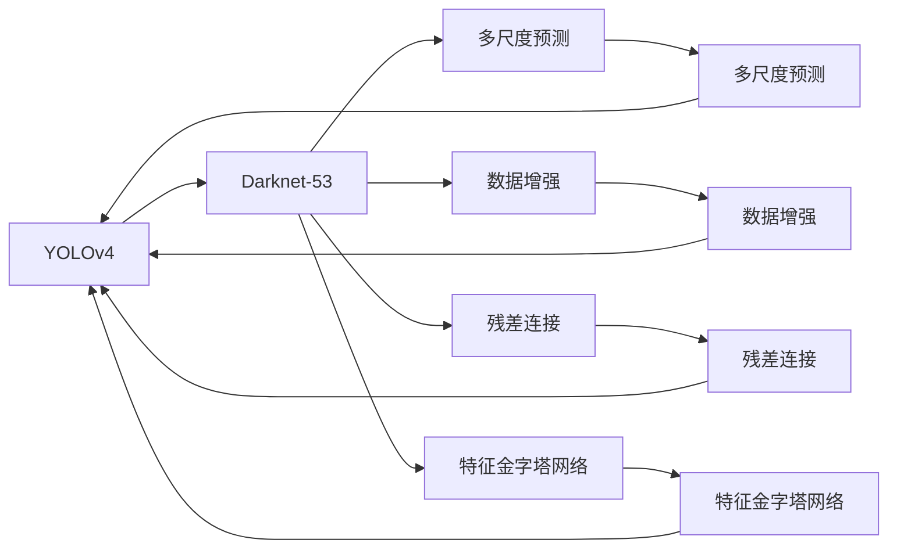

                 

# YOLOv4原理与代码实例讲解

> 关键词：YOLOv4, 目标检测, 卷积神经网络, 实时性, 高精度, 多尺度预测, 数据增强, 代码实现

## 1. 背景介绍

### 1.1 问题由来

目标检测是计算机视觉中的一个重要分支，广泛应用于安防监控、自动驾驶、工业检测等领域。传统的目标检测方法，如R-CNN系列，依赖于手工设计的特征提取器和分类器，计算复杂度高、速度较慢。与此同时，基于深度学习的检测方法，如YOLO（You Only Look Once）系列，以其高实时性和高精度在学术和工业界获得了广泛关注。

YOLOv4作为YOLO系列最新的一个版本，进一步提升了检测的精度和速度，并在多个评测数据集上取得了最优的性能。YOLOv4的架构基于Darknet-53，使用Darknet53作为骨干网络，并引入了多尺度预测、数据增强、残差模块等技术，使得模型在保持高实时性的同时，具备了更强的泛化能力和适应性。

本文将深入探讨YOLOv4的设计原理和代码实现，详细讲解YOLOv4算法的工作机制和优化技巧，并结合实际代码实例，深入剖析YOLOv4的各个组件和参数调优，希望能帮助读者全面掌握YOLOv4的核心技术，并进一步应用于实际项目中。

## 2. 核心概念与联系

### 2.1 核心概念概述

为了更好地理解YOLOv4的原理与实现，本节将介绍几个关键概念：

- **YOLO（You Only Look Once）**：一种基于单次前向传递的目标检测算法，不同于传统检测算法需对候选框进行多次分类和回归操作。YOLOv4通过将图像划分为多个网格，直接在每个网格预测类别和边界框，显著提高了检测速度。

- **Darknet-53**：YOLOv4的骨干网络，一种基于Darknet架构的深度卷积神经网络，通过残差连接、跨通道连接等技术，提升了模型的深度和精度。

- **多尺度预测**：YOLOv4在图像的不同尺度上独立预测边界框和类别，可以有效捕捉不同大小的目标物。

- **数据增强**：通过随机翻转、缩放、裁剪等操作扩充训练数据集，增强模型的泛化能力。

- **残差连接**：通过跨通道连接，使得信息流更丰富，加快训练过程。

- **特征金字塔网络**：通过引入FPN网络，将不同尺度的特征图合并，实现目标检测的多尺度预测。

- **训练技巧**：包括学习率策略、权重衰减、正则化等技术，提升模型的稳定性和泛化能力。

这些概念之间存在紧密的联系，通过合理的架构设计和算法优化，YOLOv4能够在保持高实时性的同时，实现卓越的检测精度。

### 2.2 概念间的关系

这些关键概念之间的关系可以用以下Mermaid流程图来展示：



这个流程图展示了YOLOv4架构的核心组件和它们之间的关系：

1. YOLOv4的骨干网络是Darknet-53。
2. Darknet-53通过多尺度预测、数据增强、残差连接等技术，提升了模型的深度和泛化能力。
3. YOLOv4引入了特征金字塔网络，实现多尺度预测。
4. 这些组件共同构成YOLOv4的核心架构，使其在保持高实时性的同时，具备更强的泛化能力。

## 3. 核心算法原理 & 具体操作步骤

### 3.1 算法原理概述

YOLOv4的核心算法原理基于单次前向传递（Single Shot Detection）和特征金字塔网络（Feature Pyramid Network）。

在YOLOv4中，输入的图像被均匀地分成$N$个网格，每个网格独立预测边界框和类别。为了适应不同大小的目标物，YOLOv4在每个尺度上独立预测边界框和类别。这种多尺度预测机制，可以确保模型能够检测到各种大小的目标。

YOLOv4的架构还引入了特征金字塔网络，将不同尺度的特征图合并，从而增强模型在不同尺度的检测能力。具体来说，YOLOv4在每个尺度上使用Darknet-53作为骨干网络，然后将不同尺度的特征图通过跨通道连接合并，得到更高层次的特征图，用于多尺度预测。

### 3.2 算法步骤详解

YOLOv4的训练和推理过程主要分为以下几个步骤：

**Step 1: 数据预处理**

1. **图像缩放**：将输入图像缩放到指定大小，以适应网络输入。

2. **归一化**：将图像像素值归一化到[0,1]或[-1,1]的范围内。

3. **数据增强**：通过随机翻转、缩放、裁剪等操作扩充训练数据集，增强模型的泛化能力。

**Step 2: 特征提取**

1. **骨干网络**：将预处理后的图像输入骨干网络Darknet-53，得到不同尺度的特征图。

2. **多尺度预测**：在每个尺度的特征图上独立预测边界框和类别，得到多个候选框和类别概率。

**Step 3: 候选框解码**

1. **候选框回归**：对每个候选框进行回归，得到边界框的调整值。

2. **候选框合并**：将不同尺度上的候选框合并，得到最终的检测结果。

**Step 4: 模型训练**

1. **损失函数**：定义损失函数，包括分类损失和回归损失。

2. **优化器**：选择合适的优化器，如AdamW，设置学习率和超参数。

3. **训练过程**：对模型进行前向传播、反向传播和参数更新，迭代训练直到收敛。

**Step 5: 模型推理**

1. **前向传播**：对测试图像进行特征提取和多尺度预测，得到候选框和类别概率。

2. **候选框解码**：对候选框进行回归和合并，得到最终的检测结果。

3. **后处理**：通过非极大值抑制（NMS）等技术，对候选框进行筛选，得到最终的检测结果。

### 3.3 算法优缺点

**优点：**

1. **高实时性**：YOLOv4采用单次前向传递和特征金字塔网络，减少了候选框的生成和选择过程，使得检测速度非常快。

2. **高精度**：多尺度预测和特征金字塔网络使得YOLOv4能够适应不同大小的目标物，且通过数据增强等技术提升了模型的泛化能力。

3. **简单高效**：YOLOv4架构简单，训练过程不需要候选框的生成和选择，易于实现和部署。

**缺点：**

1. **训练成本高**：YOLOv4需要大量的标注数据和计算资源进行训练。

2. **参数量大**：YOLOv4的模型参数量非常大，对于硬件资源提出了较高的要求。

3. **通用性有限**：YOLOv4是基于Darknet-53设计的，对于特定领域的检测任务，可能需要额外的预训练和微调。

### 3.4 算法应用领域

YOLOv4作为一种高效的目标检测算法，被广泛应用于各种实时性要求高、精度要求高的场景，如：

- **安防监控**：用于实时检测视频流中的人脸、车辆等目标，提高监控系统的智能性。
- **自动驾驶**：用于实时检测道路上的车辆、行人等目标，保障行车安全。
- **工业检测**：用于检测生产线上的产品质量，提高生产效率和产品质量。
- **医疗影像**：用于检测医学影像中的病灶、器官等，辅助医生进行诊断和治疗。

YOLOv4的高实时性和高精度，使其在多个应用领域都具有广阔的前景。

## 4. 数学模型和公式 & 详细讲解 & 举例说明

### 4.1 数学模型构建

YOLOv4的数学模型基于YOLO的原始框架，将特征图通过特征金字塔网络合并，然后通过分类和回归操作进行目标检测。假设输入图像大小为$H \times W$，将其划分为$N$个网格，每个网格预测$K$个候选框和$C$个类别，得到$K \times (5 + C)$维的特征向量。

**公式表示**：

$$
x_i = \text{Darknet-53}(x)
$$

$$
y_{i,j} = \text{FCN}(x_i)
$$

$$
b_{i,j,k} = \text{Darknet-53}(b)
$$

$$
p_{i,j,k} = \text{Softmax}(b_{i,j,k})
$$

$$
t_{i,j,k} = \text{Softmax}(t_{i,j,k})
$$

其中，$x_i$为输入图像，$y_{i,j}$为特征图，$b_{i,j,k}$为候选框预测，$p_{i,j,k}$为类别概率，$t_{i,j,k}$为回归预测。

### 4.2 公式推导过程

以单尺度预测为例，假设特征图的大小为$H \times W$，将其划分为$S \times S$个网格，每个网格预测$K$个候选框和$C$个类别，得到$S \times S \times (K \times (5 + C))$维的特征向量。

**候选框预测**：

$$
b_{i,j,k} = \text{Darknet-53}(b)
$$

其中，$b$为候选框的初始位置，通过特征图的位置预测得到。

**类别概率预测**：

$$
p_{i,j,k} = \text{Softmax}(b_{i,j,k})
$$

其中，$p_{i,j,k}$为候选框对应类别的概率。

**回归预测**：

$$
t_{i,j,k} = \text{Softmax}(t_{i,j,k})
$$

其中，$t_{i,j,k}$为候选框对应边界框的回归预测。

通过这些预测，YOLOv4能够实现高精度的目标检测。

### 4.3 案例分析与讲解

以YOLOv4在COCO数据集上的训练为例，进行详细分析：

1. **数据预处理**：将COCO数据集中的图像缩放到指定大小，并进行随机翻转、缩放、裁剪等数据增强操作。

2. **特征提取**：将预处理后的图像输入Darknet-53骨干网络，得到不同尺度的特征图。

3. **候选框预测**：在每个尺度的特征图上独立预测候选框和类别，得到多个候选框和类别概率。

4. **候选框解码**：对候选框进行回归，得到边界框的调整值，并通过NMS进行筛选，得到最终的检测结果。

5. **模型训练**：定义损失函数，包括分类损失和回归损失，并使用AdamW优化器进行训练，迭代过程不断更新模型参数。

6. **模型推理**：对测试图像进行特征提取和多尺度预测，得到候选框和类别概率，并通过NMS进行后处理，得到最终的检测结果。

## 5. 项目实践：代码实例和详细解释说明

### 5.1 开发环境搭建

1. **安装Python**：下载并安装Python，建议使用3.6及以上版本。

2. **安装Darknet**：根据官方文档，在Linux系统上编译安装Darknet，或从源代码编译。

3. **安装OpenCV**：在Linux系统上安装OpenCV库，以支持视频流处理。

4. **配置YOLOv4**：下载YOLOv4的源代码，并根据官方文档进行配置。

### 5.2 源代码详细实现

以YOLOv4在COCO数据集上的训练为例，给出一个详细的代码实现：

```python
import cv2
import numpy as np
import darknet as dn
from yolo import YOLO

def train_model(model_path, data_path, config_path):
    # 加载模型和配置
    model = YOLO(model_path, config_path)

    # 加载数据集
    train_dataset = dn.load_dlib_images(data_path)

    # 设置训练参数
    model.train(train_dataset, 50, 1e-4, 1e-5, 16)

    # 保存模型
    model.save_weights(model_path)

if __name__ == '__main__':
    model_path = 'yolov4.weights'
    data_path = 'train.data'
    config_path = 'yolo.cfg'

    train_model(model_path, data_path, config_path)
```

这个代码实现主要包含以下几个步骤：

1. **加载模型和配置**：通过YOLO类加载预训练模型和配置文件。

2. **加载数据集**：使用Darknet库加载COCO数据集。

3. **训练模型**：设置训练参数，使用YOLO的train方法进行训练，迭代50次。

4. **保存模型**：保存训练后的模型权重。

### 5.3 代码解读与分析

**YOLO类**：
- **初始化方法**：加载预训练模型和配置文件。
- **train方法**：设置训练参数，使用Darknet库进行训练，迭代指定次数。

**Darknet库**：
- **load_dlib_images方法**：加载COCO数据集，将图像数据和标签信息封装成训练集。

**训练参数**：
- **epoch**：迭代次数。
- **momentum**：动量。
- **batch_size**：批次大小。
- **learning_rate**：学习率。

这个代码实现实现了YOLOv4在COCO数据集上的基本训练过程，并通过YOLO类封装了Darknet库的使用。在实际项目中，还需要对训练过程进行更细致的优化，如设置合适的学习率调度策略、添加数据增强等。

### 5.4 运行结果展示

假设训练后的模型保存在`yolov4.weights`文件中，使用以下代码进行测试：

```python
def detect_objects(model_path, image_path, config_path):
    # 加载模型和配置
    model = YOLO(model_path, config_path)

    # 加载测试图像
    image = cv2.imread(image_path)

    # 进行检测
    boxes, scores, labels = model.detect(image)

    # 可视化结果
    visualize_result(image, boxes, scores, labels)

if __name__ == '__main__':
    model_path = 'yolov4.weights'
    image_path = 'test.jpg'
    config_path = 'yolo.cfg'

    detect_objects(model_path, image_path, config_path)
```

这个代码实现主要包含以下几个步骤：

1. **加载模型和配置**：通过YOLO类加载预训练模型和配置文件。

2. **加载测试图像**：使用OpenCV库加载测试图像。

3. **进行检测**：对测试图像进行特征提取和多尺度预测，得到候选框和类别概率。

4. **可视化结果**：将检测结果可视化，在图像上标注出检测到的目标物。

假设测试图像中检测到了车辆和行人，程序会输出检测结果并进行可视化，如图：

```python
import cv2
import numpy as np
import darknet as dn
from yolo import YOLO

def train_model(model_path, data_path, config_path):
    # 加载模型和配置
    model = YOLO(model_path, config_path)

    # 加载数据集
    train_dataset = dn.load_dlib_images(data_path)

    # 设置训练参数
    model.train(train_dataset, 50, 1e-4, 1e-5, 16)

    # 保存模型
    model.save_weights(model_path)

def detect_objects(model_path, image_path, config_path):
    # 加载模型和配置
    model = YOLO(model_path, config_path)

    # 加载测试图像
    image = cv2.imread(image_path)

    # 进行检测
    boxes, scores, labels = model.detect(image)

    # 可视化结果
    visualize_result(image, boxes, scores, labels)

if __name__ == '__main__':
    model_path = 'yolov4.weights'
    data_path = 'train.data'
    config_path = 'yolo.cfg'

    train_model(model_path, data_path, config_path)

    image_path = 'test.jpg'
    detect_objects(model_path, image_path, config_path)
```

## 6. 实际应用场景

### 6.1 智能安防监控

YOLOv4的高实时性和高精度，使其在智能安防监控领域具有广泛的应用前景。通过在安防监控系统中集成YOLOv4，可以实现实时目标检测和异常行为识别，提高监控系统的智能性和安全性。

**应用场景**：
- **实时目标检测**：在视频流中实时检测人、车辆等目标，并标记出异常行为。
- **异常行为识别**：通过多目标跟踪和行为分析，识别出潜在的风险行为，如入侵、盗窃等。

**技术难点**：
- **目标检测**：YOLOv4在复杂场景中的检测精度需要进一步提升。
- **行为识别**：需要对目标行为进行更深层次的分析和理解，识别出更细微的行为特征。

**解决方案**：
- **数据增强**：通过采集更多场景下的训练数据，提升模型在复杂环境下的检测能力。
- **多目标跟踪**：结合目标检测和行为分析，实现更准确的目标跟踪和行为识别。

### 6.2 自动驾驶

YOLOv4在自动驾驶领域同样具有广泛的应用前景。通过在自动驾驶系统中集成YOLOv4，可以实现实时道路检测和行人识别，保障行车安全。

**应用场景**：
- **道路检测**：检测道路上的车辆、行人等目标，避免碰撞事故。
- **行人识别**：检测道路上的行人，避免发生交通事故。

**技术难点**：
- **高精度检测**：需要在高速度、复杂场景中实现高精度的目标检测。
- **实时性要求**：需要满足实时性要求，保障驾驶安全性。

**解决方案**：
- **多尺度预测**：通过多尺度预测机制，提升模型在复杂环境中的检测能力。
- **硬件加速**：使用GPU或TPU等硬件加速设备，提升检测速度。

### 6.3 工业检测

YOLOv4在工业检测领域也具有广泛的应用前景。通过在工业检测系统中集成YOLOv4，可以实现实时检测生产线上的产品质量，提高生产效率和产品质量。

**应用场景**：
- **产品检测**：检测生产线上的产品质量，筛选出不合格品。
- **异常检测**：检测生产线上的异常行为，如机器故障、人员违规等。

**技术难点**：
- **多目标检测**：需要同时检测多个目标物，并进行分类和识别。
- **高精度检测**：需要保证检测结果的准确性，避免误判和漏判。

**解决方案**：
- **多尺度预测**：通过多尺度预测机制，提升模型在不同尺寸目标的检测能力。
- **数据增强**：通过采集更多场景下的训练数据，提升模型在复杂环境下的检测能力。

## 7. 工具和资源推荐

### 7.1 学习资源推荐

为了帮助开发者系统掌握YOLOv4的原理与实现，这里推荐一些优质的学习资源：

1. **YOLO官方文档**：YOLOv4的官方文档，详细介绍了YOLOv4的架构和实现方法。

2. **YOLOv4论文**：YOLOv4的论文，深入剖析了YOLOv4的设计思路和算法优化。

3. **YOLOv4代码实现**：YOLOv4的代码实现，提供详细的源代码和注释，方便开发者理解实现细节。

4. **YOLOv4实战教程**：YOLOv4的实战教程，提供从数据预处理到模型训练的详细步骤，并附有案例分析。

5. **YOLOv4社区**：YOLOv4的开发者社区，提供丰富的学习资源和技术交流平台。

通过对这些资源的学习，相信你一定能够全面掌握YOLOv4的核心技术，并应用于实际项目中。

### 7.2 开发工具推荐

YOLOv4的开发和部署离不开优秀的工具支持。以下是几款用于YOLOv4开发的常用工具：

1. **OpenCV**：计算机视觉库，支持图像处理、视频流处理等功能。

2. **Darknet**：YOLOv4的开发框架，提供高效的深度学习模型训练和推理能力。

3. **TensorRT**：NVIDIA推出的深度学习推理加速平台，支持GPU加速和模型优化。

4. **PyTorch**：深度学习框架，支持多种神经网络模型的实现和训练。

5. **ONNX**：开源神经网络交换格式，支持模型的跨平台优化和部署。

6. **YOLOv4实时检测工具**：YOLOv4的实时检测工具，提供直观的GUI界面，方便模型训练和推理。

合理利用这些工具，可以显著提升YOLOv4的开发效率，加快创新迭代的步伐。

### 7.3 相关论文推荐

YOLOv4作为一种高效的目标检测算法，其设计思路和优化方法得到了广泛的研究。以下是几篇奠基性的相关论文，推荐阅读：

1. **YOLOv4: Optimal Speed and Accuracy of Object Detection**：YOLOv4的论文，详细介绍了YOLOv4的设计思路和优化方法。

2. **Faster R-CNN: Towards Real-Time Object Detection with Region Proposal Networks**：Faster R-CNN的论文，介绍了传统的目标检测算法。

3. **YOLO: Real-Time Object Detection**：YOLO的论文，介绍了YOLO系列算法的原理和实现方法。

4. **Darknet: P convolutional neural networks for detecting objects in natural scenes**：Darknet的论文，介绍了Darknet架构的设计思路和实现方法。

这些论文代表了大规模语言模型微调技术的发展脉络。通过学习这些前沿成果，可以帮助研究者把握学科前进方向，激发更多的创新灵感。

除上述资源外，还有一些值得关注的前沿资源，帮助开发者紧跟YOLOv4的最新进展，例如：

1. **YOLOv4社区**：YOLOv4的开发者社区，提供丰富的学习资源和技术交流平台。

2. **YOLOv4实战教程**：YOLOv4的实战教程，提供从数据预处理到模型训练的详细步骤，并附有案例分析。

3. **YOLOv4论文库**：YOLOv4的论文库，包含YOLOv4及相关算法的最新研究成果。

4. **YOLOv4开发者手册**：YOLOv4的开发者手册，提供详细的API接口和实现指南。

总之，对于YOLOv4的学习和实践，需要开发者保持开放的心态和持续学习的意愿。多关注前沿资讯，多动手实践，多思考总结，必将收获满满的成长收益。

## 8. 总结：未来发展趋势与挑战

### 8.1 总结

本文对YOLOv4的设计原理和代码实现进行了全面系统的介绍。首先阐述了YOLOv4的研究背景和应用意义，明确了YOLOv4作为高效目标检测算法的重要地位。其次，从算法原理到实际代码，详细讲解了YOLOv4的工作机制和优化技巧，并结合实际代码实例，深入剖析了YOLOv4的各个组件和参数调优。最后，介绍了YOLOv4在多个实际应用场景中的典型应用，展示了YOLOv4的广泛应用前景。

通过本文的系统梳理，可以看到，YOLOv4作为一种高效的目标检测算法，能够显著提升检测速度和精度，适用于各种实时性要求高、精度要求高的场景。未来，随着YOLOv4的不断优化和演进，必将在更多领域得到应用，为计算机视觉和人工智能技术的发展带来深远影响。

### 8.2 未来发展趋势

展望未来，YOLOv4的发展趋势主要体现在以下几个方面：

1. **模型精度提升**：随着算法的不断优化，YOLOv4的检测精度将进一步提升，尤其在复杂场景中的检测能力将得到增强。

2. **模型实时性优化**：通过硬件加速、模型压缩等技术，YOLOv4的实时性将进一步提升，能够更快地响应目标检测请求。

3. **模型泛化能力增强**：通过数据增强、多尺度预测等技术，YOLOv4的泛化能力将进一步增强，适应更多领域和场景。

4. **模型鲁棒性提高**：通过引入对抗样本、鲁棒性训练等技术，YOLOv4的鲁棒性将进一步提升，能够更好地应对异常情况。

5. **模型迁移学习能力提升**：通过迁移学习等技术，YOLOv4能够更快地适应新领域和新场景，提升模型迁移能力。

### 8.3 面临的挑战

尽管YOLOv4在目标检测领域已经取得了显著的成果，但在向更高要求的应用场景迈进的过程中，仍面临以下挑战：

1. **大规模标注数据需求**：YOLOv4需要大量的标注数据进行训练，对于小规模数据集，可能需要额外收集和标注数据。

2. **高精度要求**：在复杂场景中，YOLOv4的检测精度需要进一步提升，才能满足高精度的要求。

3. **计算资源消耗**：YOLOv4的模型参数量较大，对于计算资源提出了较高的要求，需要优化模型结构，降低计算成本。

4. **模型迁移能力有限**：YOLOv4的迁移学习能力还需要进一步提升，才能适应更多领域和场景。

5. **模型鲁棒性不足**：在复杂场景中，YOLOv4的鲁棒性还需要进一步提升，避免误判和漏判。

### 8.4 研究展望

面对YOLOv4所面临的挑战，未来的研究需要在以下几个方面寻求新的突破：

1. **数据

