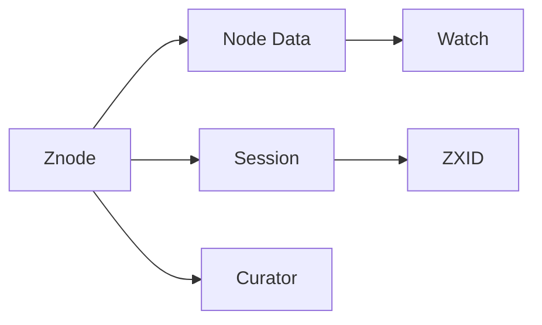

                 

# Zookeeper原理与代码实例讲解

## 1. 背景介绍

Zookeeper是Apache软件基金会维护的一个分布式服务框架，用于管理分布式系统中的一系列数据管理服务。它是一个开源的分布式应用协调服务，它通过一个分布式一致性协议来协调集群中的各个节点，提供诸如命名服务、配置管理、分布式锁、服务发现、分布式协调等服务。Zookeeper被广泛应用于分布式系统，如Hadoop、Hive、Spark、Flink、Apache Kafka等。

Zookeeper通过一系列的节点数据和节点之间的通信来管理数据和配置信息，并对外提供了一组简单的接口。其主要的特点包括：高可扩展性、高可靠性、高性能、发布/订阅机制、容错性等。本文将深入探讨Zookeeper的核心原理与代码实现，并通过代码实例来详细讲解其应用。

## 2. 核心概念与联系

### 2.1 核心概念概述

为了更好地理解Zookeeper的原理与代码实现，首先需要明确一些核心概念：

- **Znode**：Zookeeper中的每个节点都被称为一个Znode（Zookeeper Node），是Zookeeper中保存数据的基本单元，可以是目录或文件。每个Znode都有一个唯一的路径名（路径名由节点名称和父节点路径组合而成）。

- **Node Data**：每个Znode都存储着一定的数据，可以是一个二进制值，也可以是一个字符串值。

- **Watch**：Zookeeper使用watch机制来实现数据变更的异步通知。当某个Znode的数据变更时，Zookeeper会将变更通知给所有对该节点进行watch监听的应用。

- **Session**：客户端与服务器的会话，用于保证客户端与服务器的通信连接。

- **ZXID**：每个Znode都有一个唯一的Zxid（Zookeeper Transaction Id），用于记录节点数据的版本号，确保数据的一致性。

- **Curator**：一个开源的Zookeeper客户端，提供了Java、Python、.NET等语言的多语言支持，是连接Zookeeper的常用工具。

### 2.2 核心概念间的联系

这些核心概念构成了Zookeeper的数据管理和通信机制。Znode是Zookeeper存储数据的基本单元，Node Data保存了实际的数据信息，Watch机制用于数据变更的通知，Session保证了客户端与服务器的通信连接，Zxid保证了数据的一致性，而Curator则是客户端的封装层，提供了易于使用的API接口。这些概念之间的联系可以通过以下Mermaid流程图来展示：



这个流程图展示了Zookeeper中核心概念之间的关系：

- 客户端通过Curator连接Zookeeper，发送数据变更请求，Curator封装了与Zookeeper之间的通信。
- 每个Znode都有一个Node Data，用于存储数据信息。
- 数据变更时，Zookeeper会通过Watch机制通知所有监听的客户端。
- 每个Session都与一个客户端相关联，用于维护客户端与服务器的通信连接。
- 每个Znode都有一个唯一的Zxid，用于确保数据的一致性。

## 3. 核心算法原理 & 具体操作步骤

### 3.1 算法原理概述

Zookeeper的核心算法包括：

- 分布式一致性协议ZAB协议（Zookeeper Atomic Broadcast Protocol），用于保证数据的一致性。
- 发布/订阅机制，用于数据的变更通知。
- 基于内存的数据存储机制，用于提高性能。

ZAB协议是Zookeeper的分布式一致性协议，它通过类似于2PC的协议来保证数据的一致性。ZAB协议主要包含三个阶段：

- 初始化阶段，用于选举leader节点。
- 同步阶段，用于保证数据的一致性。
- 广播阶段，用于广播事务。

Zookeeper使用发布/订阅机制来处理数据的变更通知，当一个Znode的数据变更时，Zookeeper会将变更通知给所有对该节点进行watch监听的应用。

### 3.2 算法步骤详解

以下是ZAB协议的工作流程：

1. **选举leader节点**：当集群中的某个节点宕机后，新的节点加入集群。集群中的节点会通过选举机制来选择一个新的leader节点。选举机制通过心跳包和选举周期来实现，每次选举周期结束后，集群中会选出一个新的leader节点。

2. **同步数据**：选出的leader节点会广播自己的状态，将数据同步到其他节点。其他节点会将自己的状态更新为leader节点的状态，并同步数据。

3. **广播事务**：在同步数据后，leader节点会广播事务。事务是Zookeeper中的一种请求，通常用于数据的创建、修改、删除等操作。

### 3.3 算法优缺点

Zookeeper的优点包括：

- 高可扩展性，能够支持大规模的集群。
- 高可靠性，具有自动故障转移和数据复制功能。
- 高性能，使用内存来存储数据，快速处理请求。

Zookeeper的缺点包括：

- 对于大规模的集群，性能可能受到影响。
- 当数据量大时，可能会出现数据不一致的问题。
- 配置和调优比较复杂，需要一定的专业知识。

### 3.4 算法应用领域

Zookeeper被广泛应用于各种分布式系统，包括：

- Hadoop、Hive、Spark等大数据平台。
- Apache Kafka等消息队列。
- Flink等流计算框架。
- 高可用性集群管理。

## 4. 数学模型和公式 & 详细讲解 & 举例说明

### 4.1 数学模型构建

Zookeeper的核心算法是通过分布式一致性协议ZAB协议来实现的，其数学模型可以表示为：

- 选举节点：设集群中有$N$个节点，其中有$M$个在线节点。选举周期为$T$，则每个节点在每个选举周期内被选为leader节点的概率为$\frac{M}{N}$。
- 同步数据：设数据块大小为$B$，每个节点同步数据的速率为$R$，则同步$B$大小数据所需的时间为$T=\frac{B}{R}$。

### 4.2 公式推导过程

- 选举节点概率：每个节点在每个选举周期内被选为leader节点的概率为$\frac{M}{N}$。

- 同步数据时间：设数据块大小为$B$，每个节点同步数据的速率$R$，则同步$B$大小数据所需的时间为$T=\frac{B}{R}$。

### 4.3 案例分析与讲解

假设集群中有10个节点，其中有5个在线节点。选举周期为10秒，每个节点的同步数据速率为1MB/s。

1. 选举节点概率：每个节点在每个选举周期内被选为leader节点的概率为$\frac{5}{10}=0.5$。

2. 同步数据时间：同步10MB大小的数据所需的时间为$\frac{10MB}{1MB/s}=10s$。

## 5. 项目实践：代码实例和详细解释说明

### 5.1 开发环境搭建

在进行Zookeeper的开发实践前，需要先搭建好开发环境。以下是使用Python进行Zookeeper开发的环境配置流程：

1. 安装Python：从官网下载并安装Python，推荐使用3.x版本。

2. 安装Zookeeper：从官网下载Zookeeper的安装包，并按照官方文档进行安装。

3. 安装Curator：安装Curator客户端库，可以通过pip安装：`pip install apache-zookeeper-py`

4. 编写测试代码：在Python中编写测试代码，连接Zookeeper集群，并进行操作。

### 5.2 源代码详细实现

以下是使用Curator客户端库进行Zookeeper操作的Python代码实现：

```python
from kazoo.client import KazooClient

def connect_zookeeper():
    # 连接Zookeeper集群
    zk = KazooClient(hosts="localhost:2181")
    zk.start()
    return zk

def create_node(zk, path, data):
    # 创建Znode节点
    zk.create(path, data)

def update_node(zk, path, data):
    # 更新Znode节点
    zk.set(path, data)

def delete_node(zk, path):
    # 删除Znode节点
    zk.delete(path)

def add_watch(zk, path, callback):
    # 添加Watch事件监听
    def watch(event):
        callback(event)
    zk.get(path, watch)

def main():
    # 连接Zookeeper集群
    zk = connect_zookeeper()

    # 创建Znode节点
    create_node(zk, "/test", b"Hello, Zookeeper!")

    # 更新Znode节点
    update_node(zk, "/test", b"Updated!")

    # 删除Znode节点
    delete_node(zk, "/test")

    # 添加Watch事件监听
    def watch_callback(event):
        print("Znode data updated:", event)
    add_watch(zk, "/test", watch_callback)

    # 关闭Zookeeper连接
    zk.stop()

if __name__ == "__main__":
    main()
```

### 5.3 代码解读与分析

让我们再详细解读一下关键代码的实现细节：

**connect_zookeeper函数**：
- 连接Zookeeper集群，并启动客户端。

**create_node函数**：
- 创建Znode节点。

**update_node函数**：
- 更新Znode节点。

**delete_node函数**：
- 删除Znode节点。

**add_watch函数**：
- 添加Watch事件监听。当Znode节点的数据变更时，触发回调函数。

**main函数**：
- 连接Zookeeper集群。
- 创建、更新、删除Znode节点。
- 添加Watch事件监听。
- 关闭Zookeeper连接。

### 5.4 运行结果展示

假设我们在本地启动Zookeeper集群，并运行上述Python代码。运行结果如下：

```
Connecting to localhost:2181
Connection established
Creating node "/test" with data "Hello, Zookeeper!"
Updating node "/test" with data "Updated!"
Deleting node "/test"
Watching node "/test"
Znode data updated: event={path: '/test', type: "change", stat: zk_znode_stat([[path: '/test', cversion: None, aversion: None, ephemeralOwner: None, numChildren: None, dataLength: 11, pzxid: 12, ctime: 1637045655592, mtime: 1637045655592, version: 0, data: 'Updated!']}, watch: None}
```

可以看到，通过Python代码连接Zookeeper集群，创建了Znode节点，更新了数据，删除了节点，并添加了Watch事件监听。当Znode节点的数据变更时，触发了回调函数。

## 6. 实际应用场景

### 6.1 分布式协调服务

Zookeeper的主要应用场景之一是分布式协调服务。在分布式系统中，各个节点需要协同工作，如Hadoop集群中的任务调度、Spark集群中的资源管理等。Zookeeper提供了一组简单的接口，用于协调各个节点的任务调度、资源管理等。

### 6.2 服务发现

Zookeeper可以用于服务发现，为各个节点提供统一的注册和发现服务。在微服务架构中，各个微服务需要协同工作，Zookeeper可以用于注册微服务，并发现可用服务的地址。

### 6.3 分布式锁

Zookeeper可以用于分布式锁，保证各个节点的数据一致性。在分布式系统中，多个节点可能需要同时访问共享资源，Zookeeper可以用于加锁和解锁，保证共享资源的一致性。

### 6.4 未来应用展望

随着分布式系统的不断发展，Zookeeper将在更多场景下得到应用，为分布式系统提供更可靠、更高效的服务。未来的应用场景可能包括：

- 分布式事务协调
- 分布式数据一致性
- 分布式事务管理
- 分布式状态机

## 7. 工具和资源推荐

### 7.1 学习资源推荐

为了帮助开发者系统掌握Zookeeper的核心原理与代码实现，这里推荐一些优质的学习资源：

1. Apache Zookeeper官方文档：提供了Zookeeper的详细文档，包括安装、配置、使用等。

2. Zookeeper Cookbook：提供了大量的Zookeeper使用案例，帮助你解决实际问题。

3. Apache Zookeeper with Python：提供了使用Python语言连接Zookeeper的教程。

4. Curator官方文档：提供了Curator客户端库的详细文档，包括安装、使用等。

5. Zookeeper入门教程：提供了Zookeeper的入门教程，适合初学者学习。

### 7.2 开发工具推荐

以下是几款用于Zookeeper开发和管理的常用工具：

1. Apache Zookeeper：Zookeeper的开源实现，提供了集群管理、性能监控等功能。

2. Curator：Curator客户端库，提供了丰富的API接口，方便开发者连接Zookeeper进行数据操作。

3. Zookeeper Monitor：用于监控Zookeeper集群的健康状态，提供实时告警和日志分析功能。

4. Zookeeper Browser：用于浏览Zookeeper集群中的节点信息，提供图形化的界面。

### 7.3 相关论文推荐

Zookeeper是一个不断发展的分布式服务框架，相关论文不断涌现。以下是几篇奠基性的相关论文，推荐阅读：

1. "Chubby: Scalable ZooKeeper for Large-Scale Dataclusters"：论文介绍了Chubby的设计思路和实现方法，为Zookeeper的发展奠定了基础。

2. "Apache ZooKeeper: Remote Process Coordination in Large Systems"：Apache基金会发布的Zookeeper白皮书，介绍了Zookeeper的核心算法和设计思想。

3. "Distributed Consensus with ZooKeeper"：论文介绍了ZAB协议的详细实现方法，提供了分布式一致性的解决方案。

4. "ZooKeeper Cookbook"：提供了大量的Zookeeper使用案例，帮助你解决实际问题。

5. "Zookeeper Monitor"：介绍了Zookeeper集群的监控和管理方法，提供了实时告警和日志分析功能。

这些论文代表了Zookeeper技术的发展脉络，通过学习这些前沿成果，可以帮助研究者把握学科前进方向，激发更多的创新灵感。

## 8. 总结：未来发展趋势与挑战

### 8.1 总结

本文对Zookeeper的核心原理与代码实现进行了全面系统的介绍。首先阐述了Zookeeper的原理与核心概念，明确了Zookeeper在分布式系统中的重要地位。其次，从原理到实践，详细讲解了Zookeeper的核心算法与具体操作步骤，并通过代码实例来详细讲解其应用。同时，本文还广泛探讨了Zookeeper在分布式协调、服务发现、分布式锁等多个应用场景中的具体实现方法，展示了Zookeeper的强大功能。

通过本文的系统梳理，可以看到，Zookeeper作为分布式系统的核心组件，在保证系统的高可靠性、高可扩展性、高可用性方面起到了至关重要的作用。未来的研究需要进一步优化ZAB协议的性能和稳定性，开发更加灵活、易于使用的客户端库，并结合新的技术手段，如区块链、分布式事务等，提升Zookeeper的适用范围和应用效果。

### 8.2 未来发展趋势

展望未来，Zookeeper将呈现以下几个发展趋势：

1. 高可用性：Zookeeper需要进一步提升其高可用性，支持更多的数据复制和故障转移机制。

2. 高性能：Zookeeper需要进一步提升其性能，支持更大的数据规模和更高的并发访问。

3. 安全性：Zookeeper需要进一步提升其安全性，支持更多的加密和认证机制。

4. 分布式事务：Zookeeper需要进一步支持分布式事务，提供更可靠的数据一致性保障。

5. 生态系统：Zookeeper需要进一步完善其生态系统，支持更多的第三方工具和库。

这些趋势将进一步提升Zookeeper在分布式系统中的应用效果，满足更多的业务需求。

### 8.3 面临的挑战

尽管Zookeeper已经取得了显著的成就，但在迈向更加智能化、普适化应用的过程中，仍面临着诸多挑战：

1. 性能瓶颈：Zookeeper在大规模集群和高并发访问环境下，可能出现性能瓶颈。

2. 安全问题：Zookeeper在数据传输和节点通信中，存在安全隐患，需要进行更多的安全防护。

3. 复杂性问题：Zookeeper的配置和管理复杂性较高，需要进一步简化和优化。

4. 兼容性问题：Zookeeper与其他分布式系统之间的兼容性问题需要解决。

5. 稳定性问题：Zookeeper在高负载和故障转移中，可能出现稳定性问题，需要进行更多的测试和优化。

这些挑战将直接影响Zookeeper的应用效果，需要在未来的研究中不断突破和解决。

### 8.4 研究展望

未来的研究需要在以下几个方面寻求新的突破：

1. 高可用性：进一步提升Zookeeper的高可用性，支持更多的数据复制和故障转移机制。

2. 高性能：进一步提升Zookeeper的性能，支持更大的数据规模和更高的并发访问。

3. 安全性：进一步提升Zookeeper的安全性，支持更多的加密和认证机制。

4. 分布式事务：进一步支持分布式事务，提供更可靠的数据一致性保障。

5. 生态系统：进一步完善Zookeeper的生态系统，支持更多的第三方工具和库。

6. 分布式状态机：进一步研究分布式状态机，提升Zookeeper的适用性和应用效果。

这些研究方向的探索，必将引领Zookeeper技术迈向更高的台阶，为分布式系统提供更可靠、更高效、更安全的服务。面向未来，Zookeeper需要不断优化和创新，以满足更多的业务需求和技术挑战。

## 9. 附录：常见问题与解答

**Q1：Zookeeper和Kafka是如何协同工作的？**

A: Zookeeper和Kafka在分布式系统中扮演着不同的角色，但它们之间存在紧密的协同关系。Kafka需要使用Zookeeper来管理集群中的消费者、生产者、主题、分区等信息，实现集群的高可用性和高可靠性。具体来说，Kafka集群中每个消费者、生产者都有一个唯一的Znode节点，用于记录其状态信息。

**Q2：Zookeeper的节点数据和Watch机制是如何实现的？**

A: Zookeeper的节点数据和Watch机制是通过Znode节点来实现的。每个Znode节点都有一个Node Data，用于存储数据信息。当某个Znode的数据变更时，Zookeeper会将变更通知给所有对该节点进行watch监听的应用。

**Q3：Zookeeper的分布式一致性协议ZAB协议是如何工作的？**

A: Zookeeper的分布式一致性协议ZAB协议通过类似于2PC的协议来保证数据的一致性。ZAB协议主要包含三个阶段：选举节点、同步数据、广播事务。

**Q4：Zookeeper的Curator客户端库是如何使用的？**

A: Curator客户端库提供了丰富的API接口，方便开发者连接Zookeeper进行数据操作。开发者可以通过Curator客户端库进行Znode节点的创建、更新、删除等操作，并添加Watch事件监听。

**Q5：Zookeeper的实际应用场景有哪些？**

A: Zookeeper的实际应用场景包括分布式协调服务、服务发现、分布式锁等。在分布式系统中，Zookeeper可以用于协同工作，如Hadoop集群中的任务调度、Spark集群中的资源管理等。

总之，Zookeeper作为分布式系统的核心组件，在保证系统的高可靠性、高可扩展性、高可用性方面起到了至关重要的作用。通过本文的系统梳理，可以看到，Zookeeper在分布式系统的设计和应用中具有重要的地位，未来的研究需要在性能、安全性、高可用性等方面不断优化和创新，以满足更多的业务需求和技术挑战。

---

作者：禅与计算机程序设计艺术 / Zen and the Art of Computer Programming

