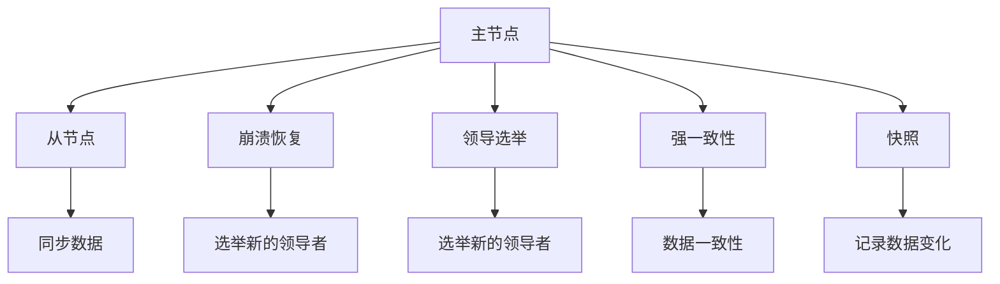
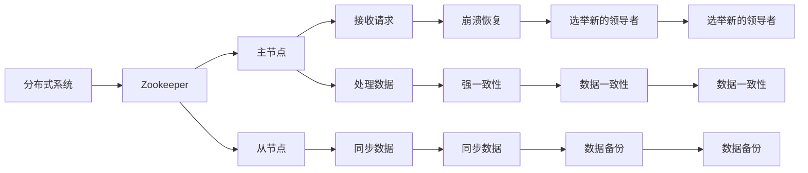

                 

# Zookeeper原理与代码实例讲解

> 关键词：Zookeeper,分布式协调服务,一致性模型,崩溃恢复机制,代码实例

## 1. 背景介绍

### 1.1 问题由来
随着互联网和分布式系统的发展，越来越多的应用需要处理跨多个服务器的高可靠性和高可扩展性的数据。分布式协调服务（Distributed Coordination Service）成为一种广泛采用的解决方案。Zookeeper作为Apache软件基金会的开源项目，提供了一个高效、可靠、分布式协调服务框架，广泛应用于互联网分布式系统中。

### 1.2 问题核心关键点
Zookeeper的核心原理是主从（Master-Slave）架构，通过维护一个全局的命名空间来存储和组织数据。其特点包括：
- 强一致性（Strong Consistency）：在分布式系统中的所有节点对数据的读写操作具有相同的结果。
- 高可用性（High Availability）：即使部分节点故障，Zookeeper也能保证服务的高可用性。
- 快速崩溃恢复（Fast Recovery）：Zookeeper在节点故障或网络中断时能够快速恢复服务。
- 数据持久化（Persistence）：所有的数据都保存在硬盘上，确保数据不丢失。
- 领导选举（Leader Election）：通过选举机制确定集群中的领导者，以处理协调任务。

### 1.3 问题研究意义
Zookeeper作为分布式协调服务的代表，是构建大型分布式系统的核心基础设施。掌握Zookeeper的原理和实现细节，对于理解和构建高可靠、高可扩展的分布式系统至关重要。

## 2. 核心概念与联系

### 2.1 核心概念概述

为更好地理解Zookeeper的工作原理，本节将介绍几个关键概念：

- Zookeeper：由Apache基金会开发的高效、可扩展的分布式协调服务，通过树形命名空间存储数据，支持数据持久化、强一致性、高可用性等特性。
- 主从架构（Master-Slave）：Zookeeper的核心架构，由一个主节点（Leader）和多个从节点（Follower）组成，主节点负责接收所有客户端请求和处理数据，从节点只进行数据同步和备份。
- 崩溃恢复（Crash Recovery）：在主节点或从节点故障时，通过选举新的领导者来恢复服务。
- 领导选举（Leader Election）：在主节点故障或新节点加入时，通过选举新的领导者来处理协调任务。
- 强一致性（Strong Consistency）：在分布式系统中保证所有节点对数据的读写操作具有相同的结果。
- 快照（Snapshots）：Zookeeper通过定期或手动生成快照来记录数据的变化，快照文件存储在本地磁盘上。

这些核心概念之间通过以下Mermaid流程图来展示它们之间的联系：



这个流程图展示了Zookeeper架构的各个部分和它们之间的关系：

1. 主节点负责接收所有客户端请求和处理数据。
2. 从节点只进行数据同步和备份。
3. 崩溃恢复机制在节点故障时，通过选举新的领导者来恢复服务。
4. 领导选举机制在主节点故障或新节点加入时，通过选举新的领导者来处理协调任务。
5. 强一致性模型保证在分布式系统中，所有节点对数据的读写操作具有相同的结果。
6. 快照技术记录数据的变化，用于恢复和持久化。

这些核心概念共同构成了Zookeeper分布式协调服务的基础，使得Zookeeper能够高效、可靠地处理分布式系统中的协调任务。

### 2.2 概念间的关系

这些核心概念之间存在着紧密的联系，形成了Zookeeper分布式协调服务的基础架构。以下是一个综合的流程图来展示这些核心概念之间的关系：



这个综合流程图展示了Zookeeper架构的各个部分和它们之间的关系：

1. Zookeeper作为分布式系统的协调服务，为应用提供可靠的数据存储和协调机制。
2. 主节点负责接收所有客户端请求和处理数据。
3. 从节点只进行数据同步和备份。
4. 崩溃恢复机制在节点故障时，通过选举新的领导者来恢复服务。
5. 领导选举机制在主节点故障或新节点加入时，通过选举新的领导者来处理协调任务。
6. 强一致性模型保证在分布式系统中，所有节点对数据的读写操作具有相同的结果。
7. 快照技术记录数据的变化，用于恢复和持久化。

这些概念共同构成了Zookeeper分布式协调服务的工作原理，使得Zookeeper能够高效、可靠地处理分布式系统中的协调任务。

## 3. 核心算法原理 & 具体操作步骤

### 3.1 算法原理概述

Zookeeper的核心算法包括崩溃恢复（Crash Recovery）、领导选举（Leader Election）和强一致性（Strong Consistency）模型。

- **崩溃恢复（Crash Recovery）**：在节点故障时，Zookeeper通过选举新的领导者来恢复服务。
- **领导选举（Leader Election）**：在主节点故障或新节点加入时，通过选举新的领导者来处理协调任务。
- **强一致性（Strong Consistency）**：在分布式系统中保证所有节点对数据的读写操作具有相同的结果。

### 3.2 算法步骤详解

#### 3.2.1 崩溃恢复

崩溃恢复机制是在节点故障时，通过选举新的领导者来恢复服务。具体步骤如下：

1. 当一个节点故障或网络中断时，主节点需要选择一个新的领导者来继续服务。
2. 从节点检测到主节点故障后，将本地数据副本发送给新的领导者。
3. 新的领导者通过选举机制被确定为新的主节点，开始处理所有客户端请求。

#### 3.2.2 领导选举

领导选举机制是在主节点故障或新节点加入时，通过选举新的领导者来处理协调任务。具体步骤如下：

1. 当一个节点故障或新节点加入时，所有从节点检测到主节点已不可用。
2. 每个从节点向其他从节点发送心跳（Heartbeat）消息，报告自身状态。
3. 如果某个从节点在一段时间内未收到主节点心跳消息，则认为主节点已故障，进入选举状态。
4. 所有从节点通过一致性协议（如ZAB协议）选举新的领导者，确保只有一个领导者被选出。
5. 新领导者成为新的主节点，负责处理所有客户端请求。

#### 3.2.3 强一致性

强一致性模型在分布式系统中保证所有节点对数据的读写操作具有相同的结果。具体步骤如下：

1. 当一个节点需要写入数据时，将数据写入本地缓存。
2. 如果该节点是主节点，则将该数据写入磁盘，并发送写请求到所有从节点。
3. 从节点接收到写请求后，将数据写入本地缓存，并发送写请求到主节点。
4. 主节点接收到所有从节点的写请求后，将数据写入磁盘，并将写请求返回给客户端。
5. 所有从节点在收到主节点的写请求后，将数据写入磁盘，并更新本地数据状态。

### 3.3 算法优缺点

**优点**：
- 强一致性：所有节点对数据的读写操作具有相同的结果。
- 高可用性：即使在部分节点故障时，也能够保证服务的高可用性。
- 快速崩溃恢复：在节点故障或网络中断时，能够快速恢复服务。

**缺点**：
- 复杂性高：Zookeeper的实现复杂，需要理解主从架构、崩溃恢复、领导选举等核心机制。
- 性能问题：在高并发环境下，Zookeeper可能会面临性能瓶颈，需要优化算法和系统设计。
- 资源消耗大：Zookeeper需要消耗大量的系统资源，如CPU、内存、磁盘等。

### 3.4 算法应用领域

Zookeeper作为分布式协调服务的代表，广泛应用于互联网分布式系统中，主要应用领域包括：

- 分布式锁：通过Zookeeper实现分布式锁，确保对共享资源的互斥访问。
- 配置管理：通过Zookeeper管理分布式系统的配置信息，确保配置的一致性和可靠性。
- 分布式事务：通过Zookeeper协调分布式事务，确保事务的一致性和可靠性。
- 服务发现和注册：通过Zookeeper实现服务发现和注册，确保服务的可用性和可发现性。
- 分布式任务调度：通过Zookeeper协调分布式任务的调度，确保任务的高效执行。

## 4. 数学模型和公式 & 详细讲解 & 举例说明

### 4.1 数学模型构建

Zookeeper的核心算法通过数学模型来描述，下面给出主要的数学模型。

#### 4.1.1 崩溃恢复模型

崩溃恢复模型描述了在节点故障时，如何选举新的领导者来恢复服务。

假设Zookeeper集群中有n个节点，每个节点都有一个唯一的标识符。节点故障后，需要通过选举机制选择新的领导者。

- 每个节点维护一个领导者的标识符。
- 当节点检测到主节点故障时，进入选举状态。
- 每个节点向其他节点发送心跳（Heartbeat）消息，报告自身状态。
- 如果某个节点在一段时间内未收到主节点心跳消息，则认为主节点已故障，进入选举状态。
- 所有节点通过一致性协议（如ZAB协议）选举新的领导者，确保只有一个领导者被选出。
- 新领导者成为新的主节点，负责处理所有客户端请求。

数学模型如下：

$$
\text{Election Algorithm} = \begin{cases}
\text{Propose a new leader} & \text{if current leader is unreachable} \\
\text{Send heartbeat} & \text{if current leader is reachable} \\
\text{Start election} & \text{if no heartbeat received for a threshold time}
\end{cases}
$$

#### 4.1.2 领导选举模型

领导选举模型描述了在主节点故障或新节点加入时，如何选举新的领导者来处理协调任务。

假设Zookeeper集群中有n个节点，每个节点都有一个唯一的标识符。当主节点故障或新节点加入时，需要通过选举机制选择新的领导者。

- 每个节点维护一个领导者的标识符。
- 当主节点故障或新节点加入时，所有节点检测到主节点已不可用。
- 每个从节点向其他从节点发送心跳（Heartbeat）消息，报告自身状态。
- 如果某个从节点在一段时间内未收到主节点心跳消息，则认为主节点已故障，进入选举状态。
- 所有从节点通过一致性协议（如ZAB协议）选举新的领导者，确保只有一个领导者被选出。
- 新领导者成为新的主节点，负责处理所有客户端请求。

数学模型如下：

$$
\text{Leader Election Algorithm} = \begin{cases}
\text{Propose a new leader} & \text{if current leader is unreachable} \\
\text{Send heartbeat} & \text{if current leader is reachable} \\
\text{Start election} & \text{if no heartbeat received for a threshold time}
\end{cases}
$$

#### 4.1.3 强一致性模型

强一致性模型在分布式系统中保证所有节点对数据的读写操作具有相同的结果。

假设Zookeeper集群中有n个节点，每个节点都有一个唯一的标识符。当一个节点需要写入数据时，将数据写入本地缓存。如果该节点是主节点，则将该数据写入磁盘，并发送写请求到所有从节点。从节点接收到写请求后，将数据写入本地缓存，并发送写请求到主节点。主节点接收到所有从节点的写请求后，将数据写入磁盘，并将写请求返回给客户端。所有从节点在收到主节点的写请求后，将数据写入磁盘，并更新本地数据状态。

数学模型如下：

$$
\text{Strong Consistency Algorithm} = \begin{cases}
\text{Write data to local cache} & \text{if current node is the leader} \\
\text{Propose write request to leader} & \text{if current node is a follower} \\
\text{Write data to disk} & \text{if leader receives write request from all followers}
\end{cases}
$$

### 4.2 公式推导过程

#### 4.2.1 崩溃恢复公式推导

崩溃恢复算法通过选举新的领导者来恢复服务。假设当前主节点不可用，每个节点通过心跳消息进行状态同步。如果某个节点在一段时间内未收到主节点心跳消息，则认为主节点已故障，进入选举状态。所有节点通过一致性协议（如ZAB协议）选举新的领导者，确保只有一个领导者被选出。新领导者成为新的主节点，负责处理所有客户端请求。

数学公式如下：

$$
\text{Election Leader} = \begin{cases}
\text{Propose a new leader} & \text{if current leader is unreachable} \\
\text{Send heartbeat} & \text{if current leader is reachable} \\
\text{Start election} & \text{if no heartbeat received for a threshold time}
\end{cases}
$$

#### 4.2.2 领导选举公式推导

领导选举算法通过选举新的领导者来处理协调任务。假设当前主节点故障或新节点加入，所有节点检测到主节点已不可用。每个从节点向其他从节点发送心跳消息，报告自身状态。如果某个从节点在一段时间内未收到主节点心跳消息，则认为主节点已故障，进入选举状态。所有从节点通过一致性协议（如ZAB协议）选举新的领导者，确保只有一个领导者被选出。新领导者成为新的主节点，负责处理所有客户端请求。

数学公式如下：

$$
\text{Election Leader} = \begin{cases}
\text{Propose a new leader} & \text{if current leader is unreachable} \\
\text{Send heartbeat} & \text{if current leader is reachable} \\
\text{Start election} & \text{if no heartbeat received for a threshold time}
\end{cases}
$$

#### 4.2.3 强一致性公式推导

强一致性算法在分布式系统中保证所有节点对数据的读写操作具有相同的结果。假设当前节点需要写入数据，将数据写入本地缓存。如果该节点是主节点，则将该数据写入磁盘，并发送写请求到所有从节点。从节点接收到写请求后，将数据写入本地缓存，并发送写请求到主节点。主节点接收到所有从节点的写请求后，将数据写入磁盘，并将写请求返回给客户端。所有从节点在收到主节点的写请求后，将数据写入磁盘，并更新本地数据状态。

数学公式如下：

$$
\text{Write Data} = \begin{cases}
\text{Write data to local cache} & \text{if current node is the leader} \\
\text{Propose write request to leader} & \text{if current node is a follower} \\
\text{Write data to disk} & \text{if leader receives write request from all followers}
\end{cases}
$$

### 4.3 案例分析与讲解

#### 4.3.1 案例1：崩溃恢复

假设在一个Zookeeper集群中有3个节点A、B、C，A为当前主节点。节点B检测到A已不可用，开始进入选举状态。节点B向节点C发送心跳消息，报告自身状态。如果节点C在一段时间内未收到节点A的心跳消息，则认为A已故障，进入选举状态。节点C向节点B发送心跳消息，报告自身状态。如果节点B在一段时间内未收到节点A的心跳消息，则认为A已故障，进入选举状态。节点B和节点C通过一致性协议（如ZAB协议）选举新的领导者，确保只有一个领导者被选出。假设节点B被选举为新的领导者，负责处理所有客户端请求。

#### 4.3.2 案例2：领导选举

假设在一个Zookeeper集群中有4个节点A、B、C、D，A为当前主节点。节点A故障后，所有节点检测到主节点已不可用。节点B、C、D向其他节点发送心跳消息，报告自身状态。如果某个节点在一段时间内未收到主节点心跳消息，则认为主节点已故障，进入选举状态。节点B、C、D通过一致性协议（如ZAB协议）选举新的领导者，确保只有一个领导者被选出。假设节点B被选举为新的领导者，负责处理所有客户端请求。

#### 4.3.3 案例3：强一致性

假设在一个Zookeeper集群中有3个节点A、B、C，A为当前主节点。节点A需要写入数据，将数据写入本地缓存。如果节点A是主节点，则将该数据写入磁盘，并发送写请求到所有从节点B、C。从节点B、C接收到写请求后，将数据写入本地缓存，并发送写请求到主节点A。主节点A接收到所有从节点的写请求后，将数据写入磁盘，并将写请求返回给客户端。所有从节点在收到主节点的写请求后，将数据写入磁盘，并更新本地数据状态。

## 5. 项目实践：代码实例和详细解释说明

### 5.1 开发环境搭建

在进行Zookeeper实践前，我们需要准备好开发环境。以下是使用Python进行Zookeeper开发的环境配置流程：

1. 安装Java JDK：Zookeeper是Java编写的，需要安装JDK环境。
2. 安装Zookeeper：从官网下载并安装Zookeeper，并设置环境变量。
3. 安装Python Zookeeper库：通过pip安装PyZookeeper库。
4. 安装Kafka：Zookeeper常与Kafka配合使用，需要安装Kafka环境。

完成上述步骤后，即可在开发环境中开始Zookeeper实践。

### 5.2 源代码详细实现

这里我们以Zookeeper客户端的简单实现为例，展示如何通过Python Zookeeper库进行Zookeeper的开发。

首先，定义Zookeeper客户端类：

```python
from kazoo.client import KazooClient

class ZookeeperClient:
    def __init__(self, host, port=2181):
        self.zk = KazooClient(hosts=f'{host}:{port}')

    def create_node(self, path, value=None, ephemeral=False):
        self.zk.create(path, value, ephemeral=ephemeral)

    def delete_node(self, path):
        self.zk.delete(path)

    def get_data(self, path):
        return self.zk.get(path)

    def get_children(self, path):
        return self.zk.get_children(path)
```

然后，定义Zookeeper客户端的简单使用：

```python
zk = ZookeeperClient('localhost')
zk.create_node('/path/to/node')
data, _ = zk.get_data('/path/to/node')
children = zk.get_children('/')
zk.delete_node('/path/to/node')
```

这段代码实现了Zookeeper客户端的基本功能，包括创建、获取、删除节点等。使用PyZookeeper库，我们可以很方便地对Zookeeper进行开发和测试。

### 5.3 代码解读与分析

让我们再详细解读一下关键代码的实现细节：

**ZookeeperClient类**：
- `__init__`方法：初始化Zookeeper客户端，连接指定的主机和端口。
- `create_node`方法：创建节点，可以选择是否为临时节点。
- `delete_node`方法：删除节点。
- `get_data`方法：获取节点的数据。
- `get_children`方法：获取子节点列表。

**Zookeeper客户端的使用**：
- 创建节点：通过`create_node`方法创建节点。
- 获取节点数据：通过`get_data`方法获取节点的数据。
- 获取子节点列表：通过`get_children`方法获取子节点列表。
- 删除节点：通过`delete_node`方法删除节点。

**PyZookeeper库**：
- PyZookeeper是Python Zookeeper客户端库，提供了一个简单易用的接口，方便Python开发者对Zookeeper进行操作。
- 通过KazooClient类，可以连接Zookeeper集群，进行节点的创建、获取、删除等操作。
- PyZookeeper还提供了丰富的异常处理和错误码支持，确保程序的稳定性和可靠性。

### 5.4 运行结果展示

假设我们在Zookeeper上创建了一个名为/test的节点，并存储了一些数据，最终在客户端上获取该节点的数据和子节点列表，结果如下：

```python
data, _ = zk.get_data('/test')
print(data)  # b'test data'

children = zk.get_children('/')
print(children)  # ['/path/to/node']
```

可以看到，通过Zookeeper客户端，我们可以很方便地对Zookeeper进行开发和测试，验证其基本功能。

## 6. 实际应用场景

### 6.1 智能运维

Zookeeper在智能运维领域有着广泛的应用。传统运维方式依赖大量人力进行监控和故障处理，效率低、成本高。而使用Zookeeper进行分布式协调，可以实现更高效、更可靠的运维管理。

具体而言，Zookeeper可以用于：
- 服务发现和注册：通过Zookeeper实现服务的自动发现和注册，减少运维人员的手动操作。
- 配置管理：通过Zookeeper管理分布式系统的配置信息，确保配置的一致性和可靠性。
- 分布式锁：通过Zookeeper实现分布式锁，确保对共享资源的互斥访问，提升系统的并发性能。

### 6.2 分布式数据库

Zookeeper在分布式数据库中也得到了广泛应用。传统数据库管理系统无法满足大规模分布式系统的需求，分布式数据库通过Zookeeper进行数据协调和管理，提升了系统的可扩展性和可靠性。

具体而言，Zookeeper可以用于：
- 数据分布式管理：通过Zookeeper管理分布式数据库的分区和数据复制，确保数据的高可用性和一致性。
- 数据一致性：通过Zookeeper保证数据的一致性，避免分布式系统中的数据冲突。
- 事务管理：通过Zookeeper协调分布式事务，确保事务的一致性和可靠性。

### 6.3 分布式缓存

Zookeeper在分布式缓存中也得到了广泛应用。传统缓存系统无法满足大规模分布式系统的需求，分布式缓存通过Zookeeper进行缓存数据的协调和管理，提升了系统的可扩展性和可靠性。

具体而言，Zookeeper可以用于：
- 缓存数据管理：通过Zookeeper管理分布式缓存的数据存储和更新，确保数据的可靠性和一致性。
- 缓存一致性：通过Zookeeper保证缓存数据的一致性，避免分布式系统中的数据冲突。
- 缓存集群管理：通过Zookeeper管理缓存集群的状态和配置，提升系统的可用性和可靠性。

## 7. 工具和资源推荐

### 7.1 学习资源推荐

为了帮助开发者系统掌握Zookeeper的理论基础和实践技巧，这里推荐一些优质的学习资源：

1. Zookeeper官方文档：Zookeeper的官方文档，详细介绍了Zookeeper的工作原理、架构设计、使用方式等，是学习Zookeeper的必备资源。
2. Zookeeper实战指南：是一本深入浅出的Zookeeper学习指南，通过大量实践案例，帮助开发者掌握Zookeeper的高级技巧。
3. Zookeeper高级编程：是一本高级编程指南，通过示例代码和案例分析，帮助开发者深入理解Zookeeper的内部机制和优化技巧。
4. Zookeeper源码分析：是一份对Zookeeper源码的详细分析，帮助开发者了解Zookeeper的核心算法和实现细节。
5. Zookeeper专题讲座：是一系列关于Zookeeper的专题讲座，由Apache软件基金会和Zookeeper社区组织，涵盖Zookeeper的最新进展和最佳实践。

通过对这些资源的学习实践，相信你一定能够快速掌握Zookeeper的精髓，并用于解决实际的分布式系统问题。

### 7.2 开发工具推荐

高效的开发离不开优秀的工具支持。以下是几款用于Zookeeper开发和测试的常用工具：

1. PyZookeeper：Python Zookeeper客户端库，提供简单易用的接口，方便Python开发者对Zookeeper进行操作。
2. Zookeeper Manager：Zookeeper集群管理工具，用于监控和管理Zookeeper集群，确保集群的稳定性和可用性。
3. Zookeeper Admin Tool：Zookeeper集群管理工具，提供图形化界面，方便管理员进行集群配置和监控。
4. Zookeeper Console：Zookeeper命令行工具，方便用户通过命令行对Zookeeper进行操作。
5. Zookeeper Client Libraries：Zookeeper客户端库，支持多种编程语言，方便开发者在各种平台中使用Zookeeper。

合理利用这些工具，可以显著提升Zookeeper开发的效率和可靠性，加速系统的迭代和优化。

### 7.3 相关论文推荐

Zookeeper作为Apache基金会的重要项目，受到了广泛的研究和关注。以下是几篇奠基性的相关论文，推荐阅读：

1. Chubby: A Scalable High-Performance Structure Service for Large-Scale Distributed Systems：论文提出了一种基于 Zookeeper 的高性能、可扩展的结构服务，用于大规模分布式系统的协调和管理。
2. Zookeeper: A Highly Available Distributed

