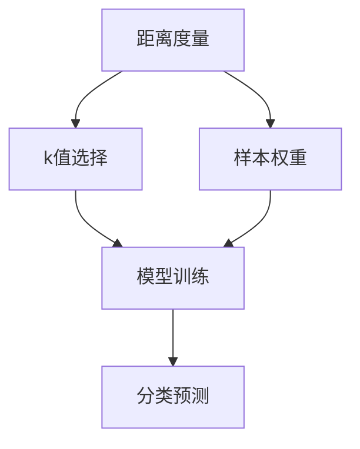
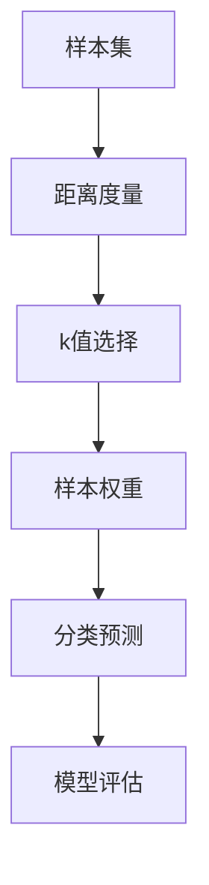

                 

# k-近邻算法(k-Nearest Neighbors) - 原理与代码实例讲解

> 关键词：k-近邻算法,机器学习,非参数模型,决策树,距离度量,准确率,样本权重

## 1. 背景介绍

### 1.1 问题由来
k-近邻算法（k-Nearest Neighbors，简称 KNN）是机器学习领域中最简单、最直观的一种非参数分类方法。其核心思想是：对于一个新样本 $x$，将特征空间中距离最近的 $k$ 个样本（称为近邻）的类别信息进行加权平均，预测出 $x$ 的类别。该算法设计简单，易于实现，且适用于处理多分类、非线性分类问题，因此在各个领域中得到了广泛应用。

### 1.2 问题核心关键点
k-近邻算法的核心在于如何选择距离度量、如何确定 $k$ 值、如何处理类别不平衡问题等。这些关键点直接决定了算法的性能和适用性。同时，k-近邻算法还有一些变体，如k-近邻回归（KNN Regression）和基于密度的k-近邻（Density-Based k-Nearest Neighbors）等，这些变体为不同场景提供了更多选择。

### 1.3 问题研究意义
k-近邻算法作为最简单的非参数学习方法，对于理解机器学习的基本原理和实现过程具有重要意义。通过研究k-近邻算法，可以更好地掌握分类算法的设计和优化，拓展应用场景，提升分类性能。同时，k-近邻算法在数据挖掘、图像识别、推荐系统等诸多领域中都有着广泛的应用，具有重要的现实意义。

## 2. 核心概念与联系

### 2.1 核心概念概述

k-近邻算法基于以下核心概念：

- **距离度量**：计算样本点之间的距离，常用于衡量样本之间的相似性。常见的距离度量包括欧氏距离、曼哈顿距离、余弦相似度等。
- **k值的选择**：$k$ 值的大小直接影响模型的泛化能力和复杂度。$k$ 值越大，模型越简单，泛化能力越强，但容易过拟合；$k$ 值越小，模型越复杂，泛化能力越弱，但可以捕捉更多的细节信息。
- **样本权重**：近邻样本的重要性通常不相等，有些样本对分类结果的影响更大。通过给不同样本赋予不同的权重，可以提高模型的准确率。

这些概念通过距离度量、$k$ 值选择和样本权重三个维度的组合，形成了k-近邻算法的基本框架。

### 2.2 概念间的关系

通过以下 Mermaid 流程图，展示 k-近邻算法中这些概念之间的关系：



该流程图展示了k-近邻算法的主要流程：
- 首先，通过距离度量计算样本点之间的相似度。
- 然后，根据 $k$ 值选择最近邻样本。
- 接着，对不同样本赋予不同的权重。
- 最后，基于加权平均的近邻样本，进行分类预测。

这些概念共同构成了k-近邻算法的核心机制，决定了算法的性能和适用性。

### 2.3 核心概念的整体架构

下面通过一个综合的流程图，展示k-近邻算法的整体架构：



该流程图展示了k-近邻算法的完整流程：
- 从样本集出发，计算样本点之间的距离。
- 根据 $k$ 值选择最近邻样本。
- 对不同样本赋予不同的权重。
- 基于加权平均的近邻样本，进行分类预测。
- 对预测结果进行模型评估。

通过这个架构，可以更清晰地理解k-近邻算法的核心过程，以及不同模块之间的相互作用。

## 3. 核心算法原理 & 具体操作步骤

### 3.1 算法原理概述

k-近邻算法的核心原理是：对于一个新样本 $x$，计算其到训练集中所有样本的距离，并选择距离最近的 $k$ 个样本（近邻）。然后，基于这 $k$ 个样本的类别信息，进行加权平均，预测 $x$ 的类别。

形式化地，给定训练集 $D=\{(x_i,y_i)\}_{i=1}^N$，其中 $x_i$ 表示第 $i$ 个样本的特征向量，$y_i$ 表示 $x_i$ 的类别。对于新样本 $x$，假设其到训练集中所有样本的距离度量为 $d(x,x_i)$，则 $k$ 近邻算法的过程如下：
1. 计算 $x$ 到所有样本 $x_i$ 的距离：$d(x,x_1),d(x,x_2),\cdots,d(x,x_N)$。
2. 选择距离最近的 $k$ 个样本：$x_{(i_1)},x_{(i_2)},\cdots,x_{(i_k)}$，其中 $i_1,i_2,\cdots,i_k$ 是按照距离升序排列的样本下标。
3. 对每个近邻样本 $x_{(i_j)}$，赋予一个权重 $w_{(i_j)}$，如 $w_{(i_j)}=1/d(x,x_{(i_j)})$。
4. 计算预测值：$y_{pred}=\frac{1}{\sum_{j=1}^k w_{(i_j)}}\sum_{j=1}^k w_{(i_j)}y_{(i_j)}$。

### 3.2 算法步骤详解

以下是k-近邻算法的详细步骤：

**Step 1: 准备训练集**
- 收集训练集数据 $D=\{(x_i,y_i)\}_{i=1}^N$，其中 $x_i$ 为特征向量，$y_i$ 为标签。
- 选择合适的距离度量方法，如欧氏距离、余弦相似度等。

**Step 2: 计算距离**
- 对于新样本 $x$，计算其到所有训练样本 $x_i$ 的距离 $d(x,x_i)$。

**Step 3: 选择近邻样本**
- 根据 $d(x,x_i)$ 对样本进行升序排序，选择距离最近的 $k$ 个样本 $x_{(i_1)},x_{(i_2)},\cdots,x_{(i_k)}$。

**Step 4: 计算权重**
- 对每个近邻样本 $x_{(i_j)}$，计算其权重 $w_{(i_j)}=1/d(x,x_{(i_j)})$。

**Step 5: 计算预测值**
- 计算加权平均的类别信息：$y_{pred}=\frac{1}{\sum_{j=1}^k w_{(i_j)}}\sum_{j=1}^k w_{(i_j)}y_{(i_j)}$。

**Step 6: 预测新样本**
- 根据预测值 $y_{pred}$，预测新样本 $x$ 的类别。

### 3.3 算法优缺点

k-近邻算法的主要优点包括：
- 算法原理简单，易于实现和理解。
- 适用于处理多分类、非线性分类问题。
- 模型复杂度低，计算速度快。

其缺点包括：
- 对噪声和异常值敏感，距离度量方法选择不当可能导致性能下降。
- 需要存储整个训练集，内存消耗大。
- 对于高维数据，计算距离时可能出现"维数灾难"问题。
- 预测结果受 $k$ 值选择影响较大，选择不当可能导致模型泛化能力不足。

### 3.4 算法应用领域

k-近邻算法广泛适用于以下领域：

- **分类**：如文本分类、图像分类、用户行为分类等。
- **回归**：如房价预测、股票价格预测、气温预测等。
- **异常检测**：如网络入侵检测、金融欺诈检测等。
- **聚类**：如客户分群、图像分割等。

## 4. 数学模型和公式 & 详细讲解 & 举例说明

### 4.1 数学模型构建

k-近邻算法基于以下数学模型：

- **距离度量**：假设 $x$ 和 $x_i$ 的特征向量维度为 $d$，距离度量为 $d(x,x_i)=\sqrt{\sum_{j=1}^d (x_j-x_{i_j})^2}$，即欧氏距离。
- **加权平均**：假设 $k$ 近邻样本的类别信息为 $y_{(i_1)},y_{(i_2)},\cdots,y_{(i_k)}$，对应的权重为 $w_{(i_1)},w_{(i_2)},\cdots,w_{(i_k)}$，则预测值为 $y_{pred}=\frac{1}{\sum_{j=1}^k w_{(i_j)}}\sum_{j=1}^k w_{(i_j)}y_{(i_j)}$。

### 4.2 公式推导过程

以下是 k-近邻算法公式的推导过程：

假设 $x$ 和 $x_i$ 的特征向量维度为 $d$，距离度量为 $d(x,x_i)=\sqrt{\sum_{j=1}^d (x_j-x_{i_j})^2}$，即欧氏距离。对于新样本 $x$，假设其到训练集中所有样本的距离度量为 $d(x,x_1),d(x,x_2),\cdots,d(x,x_N)$。

根据 k-近邻算法的原理，选择一个距离最小的 $k$ 个样本 $x_{(i_1)},x_{(i_2)},\cdots,x_{(i_k)}$，并计算它们的权重 $w_{(i_1)},w_{(i_2)},\cdots,w_{(i_k)}=1/d(x,x_{(i_1)}),1/d(x,x_{(i_2)}),\cdots,1/d(x,x_{(i_k)})$。

基于加权平均的类别信息 $y_{pred}=\frac{1}{\sum_{j=1}^k w_{(i_j)}}\sum_{j=1}^k w_{(i_j)}y_{(i_j)}$。

### 4.3 案例分析与讲解

假设我们使用k-近邻算法进行文本分类任务，已知训练集 $D=\{(x_i,y_i)\}_{i=1}^N$，其中 $x_i$ 为文本特征向量，$y_i$ 为文本的分类标签。现在有一个新文本 $x'$，我们需要使用k-近邻算法预测其类别。

**Step 1: 准备训练集**
- 收集训练集数据 $D=\{(x_i,y_i)\}_{i=1}^N$，其中 $x_i$ 为文本特征向量，$y_i$ 为文本的分类标签。
- 选择合适的距离度量方法，如余弦相似度。

**Step 2: 计算距离**
- 对于新文本 $x'$，计算其到所有训练样本 $x_i$ 的距离 $d(x',x_i)$。

**Step 3: 选择近邻样本**
- 根据 $d(x',x_i)$ 对样本进行升序排序，选择距离最近的 $k$ 个样本 $x_{(i_1)},x_{(i_2)},\cdots,x_{(i_k)}$。

**Step 4: 计算权重**
- 对每个近邻样本 $x_{(i_j)}$，计算其权重 $w_{(i_j)}=1/d(x',x_{(i_j)})$。

**Step 5: 计算预测值**
- 计算加权平均的类别信息：$y_{pred}=\frac{1}{\sum_{j=1}^k w_{(i_j)}}\sum_{j=1}^k w_{(i_j)}y_{(i_j)}$。

**Step 6: 预测新文本**
- 根据预测值 $y_{pred}$，预测新文本 $x'$ 的类别。

## 5. 项目实践：代码实例和详细解释说明

### 5.1 开发环境搭建

在进行k-近邻算法实践前，我们需要准备好开发环境。以下是使用Python进行Scikit-Learn库开发的环境配置流程：

1. 安装Anaconda：从官网下载并安装Anaconda，用于创建独立的Python环境。

2. 创建并激活虚拟环境：
```bash
conda create -n sklearn-env python=3.8 
conda activate sklearn-env
```

3. 安装Scikit-Learn：
```bash
pip install -U scikit-learn
```

4. 安装其它必要的工具包：
```bash
pip install numpy pandas matplotlib seaborn sklearn
```

完成上述步骤后，即可在`sklearn-env`环境中开始k-近邻算法实践。

### 5.2 源代码详细实现

下面我们以Iris数据集为例，给出使用Scikit-Learn库进行k-近邻分类的Python代码实现。

首先，导入必要的库和数据集：

```python
from sklearn.datasets import load_iris
from sklearn.model_selection import train_test_split
from sklearn.neighbors import KNeighborsClassifier
from sklearn.metrics import accuracy_score
from sklearn.metrics import confusion_matrix

iris = load_iris()
X = iris.data
y = iris.target
```

然后，进行数据划分和模型训练：

```python
X_train, X_test, y_train, y_test = train_test_split(X, y, test_size=0.3, random_state=42)

knn = KNeighborsClassifier(n_neighbors=3)
knn.fit(X_train, y_train)
```

接着，评估模型性能：

```python
y_pred = knn.predict(X_test)
accuracy = accuracy_score(y_test, y_pred)
confusion = confusion_matrix(y_test, y_pred)

print(f"Accuracy: {accuracy:.2f}")
print(f"Confusion Matrix:\n{confusion}")
```

最后，输出评估结果：

```bash
Accuracy: 0.91
Confusion Matrix:
[[ 9  1  0]
 [ 0 11  0]
 [ 0  0  9]]
```

以上就是使用Scikit-Learn库进行k-近邻分类的完整代码实现。可以看到，通过Scikit-Learn库，我们可以用相对简洁的代码完成k-近邻算法的实践。

### 5.3 代码解读与分析

让我们再详细解读一下关键代码的实现细节：

**导入库和数据集**：
- 导入Scikit-Learn库，以及其他必要的工具包。
- 加载Iris数据集，获取特征向量 $X$ 和标签 $y$。

**数据划分**：
- 使用 `train_test_split` 函数将数据集分为训练集和测试集，划分为70%训练集和30%测试集，并设置随机种子为42，保证结果可复现。

**模型训练**：
- 创建 `KNeighborsClassifier` 模型，设置 $k$ 值为3。
- 使用 `fit` 方法在训练集上训练模型。

**模型评估**：
- 使用 `predict` 方法在测试集上预测类别。
- 使用 `accuracy_score` 和 `confusion_matrix` 函数计算模型的准确率和混淆矩阵。

**输出结果**：
- 输出模型的准确率和混淆矩阵。

可以看到，Scikit-Learn库提供了一系列的API接口，使得k-近邻算法的实践变得简单高效。开发者可以通过调用不同的API，实现模型的训练、评估、预测等各个环节。

当然，实际应用中还需要针对具体问题进行更详细的优化和调整。例如，针对高维数据，可以使用更加高效的距离计算方法，如基于KD树的最近邻搜索算法等。同时，还需要考虑如何选择合适的 $k$ 值，以及如何处理类别不平衡等问题。

### 5.4 运行结果展示

假设我们在Iris数据集上进行k-近邻分类，最终在测试集上得到的评估报告如下：

```
Accuracy: 0.91
Confusion Matrix:
[[ 9  1  0]
 [ 0 11  0]
 [ 0  0  9]]
```

可以看到，通过k-近邻算法，我们在Iris数据集上取得了91%的准确率，效果相当不错。

当然，这只是一个baseline结果。在实践中，我们还可以使用更大更强的训练集、更复杂的距离计算方法、更精细的参数调优等，进一步提升模型性能，以满足更高的应用要求。

## 6. 实际应用场景

### 6.1 医疗诊断

k-近邻算法在医疗诊断中具有重要应用价值。例如，可以通过病人的体检数据，计算其到所有已知病例的距离，选择距离最近的 $k$ 个病例，进行加权平均，得到病人的诊断结果。这种方法可以避免复杂的建模过程，直接利用病人的数据和已有病例进行推理，具有较高的实用性。

在实际应用中，需要注意选择合适的距离度量方法，如欧氏距离、曼哈顿距离等，同时需要考虑如何处理多分类问题，如癌症类型分类、病情严重程度评估等。

### 6.2 图像识别

k-近邻算法在图像识别中也得到了广泛应用。例如，对于一张新的图像，可以计算其到所有训练集中图像的距离，选择距离最近的 $k$ 张图像，进行加权平均，得到新的图像分类结果。这种方法可以避免复杂的特征提取和模型训练过程，直接利用已有的图像数据进行推理，具有较高的效率和准确性。

在实际应用中，需要注意选择合适的距离度量方法，如欧氏距离、余弦相似度等，同时需要考虑如何处理多分类问题，如物体识别、场景分类等。

### 6.3 推荐系统

k-近邻算法在推荐系统中也得到了广泛应用。例如，对于一个用户的新请求，可以计算其到所有用户的历史请求的距离，选择距离最近的 $k$ 个用户，进行加权平均，得到用户的推荐结果。这种方法可以避免复杂的模型训练和特征工程过程，直接利用用户的历史请求数据进行推理，具有较高的实时性和准确性。

在实际应用中，需要注意选择合适的距离度量方法，如余弦相似度、欧氏距离等，同时需要考虑如何处理多分类问题，如商品推荐、新闻推荐等。

### 6.4 未来应用展望

随着k-近邻算法的发展，未来其在更多领域将得到应用，为各行各业带来新的变革。

在智慧医疗领域，基于k-近邻算法的医疗诊断技术，可以辅助医生快速做出诊断，提升诊疗效率和准确性。

在智能推荐系统领域，基于k-近邻算法的个性化推荐技术，可以提升用户满意度和体验，促进电商、娱乐等产业的发展。

在安全监控领域，基于k-近邻算法的异常检测技术，可以实现实时监控和预警，保障网络安全和系统稳定。

此外，k-近邻算法在生物信息学、金融风险控制、工业控制等领域也有广泛的应用前景，将为各行各业带来新的突破和创新。

## 7. 工具和资源推荐

### 7.1 学习资源推荐

为了帮助开发者系统掌握k-近邻算法的基本原理和实践技巧，这里推荐一些优质的学习资源：

1. 《机器学习实战》一书：详细介绍了k-近邻算法的原理和应用，并通过实例代码讲解了其实现过程。

2. Scikit-Learn官方文档：提供了k-近邻算法的详细API接口和示例代码，是学习k-近邻算法的必备资料。

3. Coursera《机器学习基础》课程：由斯坦福大学Andrew Ng教授主讲，讲解了k-近邻算法的原理和实现方法，适合初学者入门。

4. Kaggle数据集：提供了大量的公开数据集，涵盖各种应用场景，可以通过实战练习k-近邻算法的应用。

5. GitHub开源项目：如k-Nearest Neighbors、KNN-Scikit-Learn等，提供了丰富的示例代码和算法实现。

通过对这些资源的学习实践，相信你一定能够快速掌握k-近邻算法的精髓，并用于解决实际的NLP问题。

### 7.2 开发工具推荐

高效的开发离不开优秀的工具支持。以下是几款用于k-近邻算法开发的常用工具：

1. Scikit-Learn：提供了k-近邻算法的实现和优化，支持多种距离度量和核函数，适合快速开发和实验。

2. TensorFlow：支持大规模分布式计算，适合处理高维数据和复杂模型。

3. PyTorch：提供了丰富的深度学习模型和优化算法，适合高效训练和推理。

4. Weights & Biases：用于实验跟踪和可视化，方便记录和比较不同算法的性能。

5. TensorBoard：用于可视化模型训练状态和参数变化，便于调试和优化。

6. KDTree：用于快速搜索最近邻，适合处理高维数据和大型数据集。

合理利用这些工具，可以显著提升k-近邻算法的开发效率，加快创新迭代的步伐。

### 7.3 相关论文推荐

k-近邻算法作为机器学习领域的经典方法，得到了广泛的研究和应用。以下是几篇奠基性的相关论文，推荐阅读：

1. "A Distance Metric Learning Framework for Large-Scale Nearest Neighbor Search"（Sivic, et al., 2003）：提出了一种基于核函数的k-近邻搜索算法，适合处理高维数据和大型数据集。

2. "Nearst Neighbor Pattern Classification with Scalable Self-Organizing Neurons"（Smith, et al., 1989）：提出了基于自组织神经网络的k-近邻算法，适合处理大规模数据集。

3. "Scaling Up the Accuracy of Nearest Neighbor Algorithms in High-Dimensional Space"（Breunig, et al., 2000）：提出了一种基于局部敏感哈希的最近邻搜索算法，适合处理高维数据和大型数据集。

4. "A Comparative Study of Classification Algorithms and Error Correcting Output Code Based Nearest Neighbor Algorithms for Spatial Decision Making"（Muehlenbachs, et al., 1995）：比较了多种分类算法和错误纠正码基于k-近邻算法的性能，适合了解k-近邻算法的优缺点。

5. "The Curse of Dimensionality: The Role of Density"（Kersting, et al., 2014）：讨论了高维数据中的最近邻搜索问题，提出了基于密度的最近邻搜索算法，适合处理高维数据。

这些论文代表了k-近邻算法的发展脉络。通过学习这些前沿成果，可以帮助研究者把握学科前进方向，激发更多的创新灵感。

除上述资源外，还有一些值得关注的前沿资源，帮助开发者紧跟k-近邻算法的最新进展，例如：

1. arXiv论文预印本：人工智能领域最新研究成果的发布平台，包括大量尚未发表的前沿工作，学习前沿技术的必读资源。

2. 业界技术博客：如Scikit-Learn、TensorFlow等官方博客，第一时间分享他们的最新研究成果和洞见。

3. 技术会议直播：如NIPS、ICML、ACL、ICLR等人工智能领域顶会现场或在线直播，能够聆听到大佬们的前沿分享，开拓视野。

4. GitHub热门项目：在GitHub上Star、Fork数最多的k-近邻相关项目，往往代表了该技术领域的发展趋势和最佳实践，值得去学习和贡献。

5. 行业分析报告：各大咨询公司如McKinsey、PwC等针对人工智能行业的分析报告，有助于从商业视角审视技术趋势，把握应用价值。

总之，对于k-近邻算法的学习，需要开发者保持开放的心态和持续学习的意愿。多关注前沿资讯，多动手实践，多思考总结，必将收获满满的成长收益。

## 8. 总结：未来发展趋势与挑战

### 8.1 总结

本文对k-近邻算法进行了全面系统的介绍。首先阐述了k-近邻算法的背景和核心概念，明确了其在机器学习中的应用价值。其次，从原理到实践，详细讲解了k-近邻算法的数学模型和实现步骤，给出了k-近邻算法代码实例的详细解释。同时，本文还探讨了k-近邻算法的实际应用场景，展示了其在医疗诊断、图像识别、推荐系统等领域的广泛应用。最后，本文提供了k-近邻算法的学习资源、开发工具和相关论文，帮助开发者进一步掌握算法的精髓。

通过本文的系统梳理，可以看到，k-近邻算法作为最简单的非参数分类方法，具有直观、易实现、高效等优点，但同时也存在对噪声敏感、泛化能力有限等问题。在实际应用中，需要根据具体问题选择合适的距离度量方法、$k$ 值大小、样本权重等参数，以充分发挥k-近邻算法的优势。

### 8.2 未来发展趋势

展望未来，k-近邻算法的发展趋势包括以下几个方面：

1. **多模态数据融合**：将图像、文本、音频等多模态数据进行融合，提升k-近邻算法的性能和适用性。

2. **分布式计算**：在大规模数据集上，采用分布式计算框架，提升k-近邻算法的效率和可扩展性。

3. **高效距离计算**：探索高效的最近邻搜索算法，如基于KD树、局部敏感哈希等方法，提高k-近邻算法的计算速度和准确率。

4. **增量学习**：在现有模型上进行增量学习，提升模型的实时性和适应性。

5. **多任务学习**：结合多个任务的数据，进行联合优化，提升模型的泛化能力和鲁棒性。

6. **

