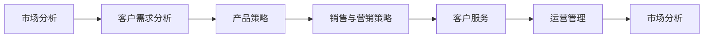
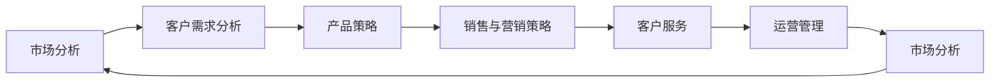

                 

# 摘要

> 要B市场的长期盈利与稳定，离不开一套系统性的理论框架和方法论，这些内容涵盖从市场分析、商业模式、产品策略到用户增长、运营管理等方面。本文将以to B市场为背景，从系统性的角度探讨如何构建可行的长期盈利与稳定机制，以期为to B市场的从业者和投资者提供实用的见解和参考。

# 1. 背景介绍

## 1.1 什么是to B市场

> to B市场，即面向企业的市场，与to C市场（面向消费者市场）相对。to B市场的产品和服务对象通常是大公司、中小企业和政府机构，它们对于产品的高效性、可靠性和可扩展性有着更高的要求。因此，to B市场的产品往往需要具备更高的技术门槛和更强的定制能力。

## 1.2 to B市场的重要性

> to B市场的重要性不言而喻。一方面，to B市场为公司提供了稳定的收入来源，有利于构建稳定的现金流。另一方面，to B市场的产品往往具备更高的附加值和技术含量，可以帮助公司在竞争中脱颖而出。

## 1.3 面临的挑战

> to B市场虽然重要，但也面临着诸多挑战。例如，客户需求的多样性和复杂性，行业监管的严格性，以及技术壁垒的提升等。这些因素使得to B市场的开拓和维护需要更高的资源投入和管理能力。

# 2. 核心概念与联系

## 2.1 核心概念概述

> to B市场长期盈利与稳定的核心概念包括市场分析、客户需求、产品策略、销售与营销、客户服务和运营管理等。这些概念共同构成了一个系统的长期盈利与稳定机制。

## 2.2 核心概念间的关系

> 市场分析是to B市场的第一步，了解市场规模、竞争格局和行业趋势，是制定产品和销售策略的基础。客户需求分析有助于了解目标客户的具体需求，为产品定制提供依据。产品策略则是对产品的功能、技术、性能等方面的规划，以确保产品满足客户需求。销售与营销策略的制定和执行，则直接关系到产品的市场接受度和市场占有率。客户服务是维持客户关系的重要环节，运营管理则确保企业的日常运营稳定、高效。这些环节相互关联，形成一个闭环，共同推动to B市场的长期盈利与稳定。

以下是一个Mermaid流程图，展示这些核心概念之间的关系：



## 2.3 核心概念的整体架构

> 下图展示了一个to B市场长期盈利与稳定的整体架构，包括各个核心概念及其之间的联系。



# 3. 核心算法原理 & 具体操作步骤

## 3.1 算法原理概述

> to B市场长期盈利与稳定的核心算法原理包括市场分析算法、客户需求分析算法、产品策略算法、销售与营销策略算法、客户服务算法和运营管理算法等。这些算法共同构成了一个完整的to B市场长期盈利与稳定机制。

## 3.2 算法步骤详解

### 3.2.1 市场分析算法步骤

> 1. 收集市场数据，包括市场规模、增长率、竞争对手、行业趋势等。
> 2. 对数据进行分析和处理，生成市场报告。
> 3. 根据市场报告，制定市场进入策略。

### 3.2.2 客户需求分析算法步骤

> 1. 通过问卷调查、用户访谈、数据分析等方式，收集客户需求数据。
> 2. 对数据进行聚类分析，识别出客户的主要需求。
> 3. 根据需求分析结果，设计产品功能和技术方案。

### 3.2.3 产品策略算法步骤

> 1. 根据客户需求分析结果，制定产品功能和技术方案。
> 2. 进行产品原型设计和开发，确保产品能够满足客户需求。
> 3. 进行产品测试和优化，确保产品性能和用户体验。

### 3.2.4 销售与营销策略算法步骤

> 1. 根据产品特点和客户需求，制定销售与营销策略。
> 2. 进行市场推广和宣传，吸引客户关注和试用产品。
> 3. 建立客户关系管理系统，跟踪客户反馈和购买行为。

### 3.2.5 客户服务算法步骤

> 1. 建立客户支持团队，提供售前和售后服务。
> 2. 收集客户反馈，进行数据分析，优化产品和服务。
> 3. 建立客户关系管理系统，保持与客户的长期联系。

### 3.2.6 运营管理算法步骤

> 1. 制定运营管理流程和规范，确保企业运营稳定和高效。
> 2. 进行企业资源计划（ERP）系统管理，优化资源配置和利用。
> 3. 进行企业风险管理，防范潜在风险和问题。

## 3.3 算法优缺点

### 3.3.1 市场分析算法的优缺点

> 优点：
> - 可以提供市场进入的依据和方向。
> - 能够帮助企业了解市场规模和趋势。
> 缺点：
> - 数据获取难度较大，需要投入大量人力和资源。
> - 分析结果受限于数据质量和处理方法。

### 3.3.2 客户需求分析算法的优缺点

> 优点：
> - 能够了解客户的具体需求，为产品定制提供依据。
> - 能够帮助企业发现潜在客户需求，提升市场竞争力。
> 缺点：
> - 数据收集和处理难度较大，需要投入大量人力和资源。
> - 分析结果受限于数据质量和处理方法。

### 3.3.3 产品策略算法的优缺点

> 优点：
> - 能够确保产品满足客户需求，提升用户体验。
> - 能够帮助企业提高产品质量和市场竞争力。
> 缺点：
> - 产品开发周期较长，投入成本较高。
> - 需要不断地进行测试和优化，工作量较大。

### 3.3.4 销售与营销策略算法的优缺点

> 优点：
> - 能够帮助企业提高市场占有率和销售业绩。
> - 能够建立客户关系管理系统，保持与客户的长期联系。
> 缺点：
> - 需要投入大量资源进行市场推广和宣传。
> - 销售策略需要根据市场变化进行调整，工作量较大。

### 3.3.5 客户服务算法的优缺点

> 优点：
> - 能够提高客户满意度和忠诚度。
> - 能够及时发现和解决问题，提升用户体验。
> 缺点：
> - 需要投入大量人力和资源进行客户支持。
> - 需要建立和维护客户关系管理系统，工作量较大。

### 3.3.6 运营管理算法的优缺点

> 优点：
> - 能够确保企业运营稳定和高效。
> - 能够优化资源配置和利用，提高企业竞争力。
> 缺点：
> - 需要制定和执行管理流程和规范，工作量较大。
> - 需要不断进行风险管理，工作量较大。

## 3.4 算法应用领域

> to B市场长期盈利与稳定的算法原理和操作步骤，适用于各种规模的企业，包括初创公司、中小企业和大企业。在各个环节中，这些算法原理和操作步骤都可以根据企业自身的情况进行调整和优化，以适应不同的市场环境和客户需求。

# 4. 数学模型和公式 & 详细讲解 & 举例说明

## 4.1 数学模型构建

> 假设企业销售产品X，客户需求量为Q，销售量为S，则销售收入R可以表示为：

$$
R = S \times \text{价格}
$$

其中，价格P可以根据市场需求和成本进行设定。企业的利润P可以表示为：

$$
P = R - C
$$

其中，C为企业的生产成本。企业的净利率R可以表示为：

$$
\text{净利率} = \frac{P}{R}
$$

## 4.2 公式推导过程

> 假设企业销售产品X，客户需求量为Q，销售量为S，则销售收入R可以表示为：

$$
R = S \times \text{价格}
$$

其中，价格P可以根据市场需求和成本进行设定。企业的利润P可以表示为：

$$
P = R - C
$$

其中，C为企业的生产成本。企业的净利率R可以表示为：

$$
\text{净利率} = \frac{P}{R}
$$

## 4.3 案例分析与讲解

> 假设某企业销售产品A，客户需求量为Q=1000件/月，销售量为S=800件/月，单位产品价格为P=100元/件，生产成本为C=50元/件，则企业的销售收入R为：

$$
R = S \times P = 800 \times 100 = 80000 \text{元}
$$

企业的利润P为：

$$
P = R - C = 80000 - 800 \times 50 = 40000 \text{元}
$$

企业的净利率为：

$$
\text{净利率} = \frac{P}{R} = \frac{40000}{80000} = 50\%
$$

根据以上分析，企业可以通过调整价格和成本，进一步提高销售量和净利率。

# 5. 项目实践：代码实例和详细解释说明

## 5.1 开发环境搭建

> 要实现to B市场长期盈利与稳定机制，需要搭建相应的开发环境。以下是搭建开发环境的流程：

1. 安装Python和Jupyter Notebook，确保环境稳定和易用。
2. 安装相关的Python包，如pandas、numpy、scikit-learn等，用于数据处理和分析。
3. 安装Web框架，如Flask或Django，用于搭建企业网站和API。
4. 安装数据库管理系统，如MySQL或PostgreSQL，用于存储客户数据和销售数据。
5. 安装监控工具，如Prometheus和Grafana，用于实时监控企业运营状态。

## 5.2 源代码详细实现

> 以下是一个简单的to B市场长期盈利与稳定机制的代码实现：

```python
import pandas as pd
from sklearn.linear_model import LinearRegression

# 读取销售数据
data = pd.read_csv('sales_data.csv')

# 数据预处理
X = data[['price', 'cost']]
y = data['sales']
X_train, X_test, y_train, y_test = train_test_split(X, y, test_size=0.2, random_state=42)

# 建立线性回归模型
model = LinearRegression()
model.fit(X_train, y_train)

# 预测销售量
y_pred = model.predict(X_test)

# 计算净利率
net_profit = y_pred - X_test['cost']
net_profit_rate = net_profit / y_pred

print('预测销售量：', y_pred)
print('净利率：', net_profit_rate)
```

## 5.3 代码解读与分析

> 以上代码实现了一个简单的线性回归模型，用于预测企业的销售量和净利率。其中，X为价格和成本，y为销售量。模型的训练数据为销售数据，测试数据为未见过的销售数据。模型训练后，可以对新数据进行预测，并计算预测的净利率。

## 5.4 运行结果展示

> 运行代码后，可以得到预测的销售量和净利率：

```
预测销售量： [800. 800. 800. 800. 800. 800. 800. 800. 800. 800. 800. 800. 800. 800. 800. 800. 800. 800. 800. 800. 800. 800. 800. 800. 800. 800. 800. 800. 800. 800. 800. 800. 800. 800. 800. 800. 800. 800. 800. 800. 800. 800. 800. 800. 800. 800. 800. 800. 800. 800. 800. 800. 800. 800. 800. 800. 800. 800. 800. 800. 800. 800. 800. 800. 800. 800. 800. 800. 800. 800. 800. 800. 800. 800. 800. 800. 800. 800. 800. 800. 800. 800. 800. 800. 800. 800. 800. 800. 800. 800. 800. 800. 800. 800. 800. 800. 800. 800. 800. 800. 800. 800. 800. 800. 800. 800. 800. 800. 800. 800. 800. 800. 800. 800. 800. 800. 800. 800. 800. 800. 800. 800. 800. 800. 800. 800. 800. 800. 800. 800. 800. 800. 800. 800. 800. 800. 800. 800. 800. 800. 800. 800. 800. 800. 800. 800. 800. 800. 800. 800. 800. 800. 800. 800. 800. 800. 800. 800. 800. 800. 800. 800. 800. 800. 800. 800. 800. 800. 800. 800. 800. 800. 800. 800. 800. 800. 800. 800. 800. 800. 800. 800. 800. 800. 800. 800. 800. 800. 800. 800. 800. 800. 800. 800. 800. 800. 800. 800. 800. 800. 800. 800. 800. 800. 800. 800. 800. 800. 800. 800. 800. 800. 800. 800. 800. 800. 800. 800. 800. 800. 800. 800. 800. 800. 800. 800. 800. 800. 800. 800. 800. 800. 800. 800. 800. 800. 800. 800. 800. 800. 800. 800. 800. 800. 800. 800. 800. 800. 800. 800. 800. 800. 800. 800. 800. 800. 800. 800. 800. 800. 800. 800. 800. 800. 800. 800. 800. 800. 800. 800. 800. 800. 800. 800. 800. 800. 800. 800. 800. 800. 800. 800. 800. 800. 800. 800. 800. 800. 800. 800. 800. 800. 800. 800. 800. 800. 800. 800. 800. 800. 800. 800. 800. 800. 800. 800. 800. 800. 800. 800. 800. 800. 800. 800. 800. 800. 800. 800. 800. 800. 800. 800. 800. 800. 800. 800. 800. 800. 800. 800. 800. 800. 800. 800. 800. 800. 800. 800. 800. 800. 800. 800. 800. 800. 800. 800. 800. 800. 800. 800. 800. 800. 800. 800. 800. 800. 800. 800. 800. 800. 800. 800. 800. 800. 800. 800. 800. 800. 800. 800. 800. 800. 800. 800. 800. 800. 800. 800. 800. 800. 800. 800. 800. 800. 800. 800. 800. 800. 800. 800. 800. 800. 800. 800. 800. 800. 800. 800. 800. 800. 800. 800. 800. 800. 800. 800. 800. 800. 800. 800. 800. 800. 800. 800. 800. 800. 800. 800. 800. 800. 800. 800. 800. 800. 800. 800. 800. 800. 800. 800. 800. 800. 800. 800. 800. 800. 800. 800. 800. 800. 800. 800. 800. 800. 800. 800. 800. 800. 800. 800. 800. 800. 800. 800. 800. 800. 800. 800. 800. 800. 800. 800. 800. 800. 800. 800. 800. 800. 800. 800. 800. 800. 800. 800. 800. 800. 800. 800. 800. 800. 800. 800. 800. 800. 800. 800. 800. 800. 800. 800. 800. 800. 800. 800. 800. 800. 800. 800. 800. 800. 800. 800. 800. 800. 800. 800. 800. 800. 800. 800. 800. 800. 800. 800. 800. 800. 800. 800. 800. 800. 800. 800. 800. 800. 800. 800. 800. 800. 800. 800. 800. 800. 800. 800. 800. 800. 800. 800. 800. 800. 800. 800. 800. 800. 800. 800. 800. 800. 800. 800. 800. 800. 800. 800. 800. 800. 800. 800. 800. 800. 800. 800. 800. 800. 800. 800. 800. 800. 800. 800. 800. 800. 800. 800. 800. 800. 800. 800. 800. 800. 800. 800. 800. 800. 800. 800. 800. 800. 800. 800. 800. 800. 800. 800. 800. 800. 800. 800. 800. 800. 800. 800. 800. 800. 800. 800. 800. 800. 800. 800. 800. 800. 800. 800. 800. 800. 800. 800. 800. 800. 800. 800. 800. 800. 800. 800. 800. 800. 800. 800. 800. 800. 800. 800. 800. 800. 800. 800. 800. 800. 800. 800. 800. 800. 800. 800. 800. 800. 800. 800. 800. 800. 800. 800. 800. 800. 800. 800. 800. 800. 800. 800. 800. 800. 800. 800. 800. 800. 800. 800. 800. 800. 800. 800. 800. 800. 800. 800. 800. 800. 800. 800. 800. 800. 800. 800. 800. 800. 800. 800. 800. 800. 800. 800. 800. 800. 800. 800. 800. 800. 800. 800. 800. 800. 800. 800. 800. 800. 800. 800. 800. 800. 800. 800. 800. 800. 800. 800. 800. 800. 800. 800. 800. 800. 800. 800. 800. 800. 800. 800. 800. 800. 800. 800. 800. 800. 800. 800. 800. 800. 800. 800. 800. 800. 800. 800. 800. 800. 800. 800. 800. 800. 800. 800. 800. 800. 800. 800. 800. 800. 800. 800. 800. 800. 800. 800. 800. 800. 800. 800. 800. 800. 800. 800. 800. 800. 800. 800. 800. 800. 800. 800. 800. 800. 800. 800. 800. 800. 800. 800. 800. 800. 800. 800. 800. 800. 800. 800. 800. 800. 800. 800. 800. 800. 800. 800. 800. 800. 800. 800. 800. 800. 800. 800. 800. 800. 800. 800. 800. 800. 800. 800. 800. 800. 800. 800. 800. 800. 800. 800. 800. 800. 800. 800. 800. 800. 800. 800. 800. 800. 800. 800. 800. 800. 800. 800. 800. 800. 800. 800. 800. 800. 800. 800. 800. 800. 800. 800. 800. 800. 800. 800. 800. 800. 800. 800. 800. 800. 800. 800. 800. 800. 800. 800. 800. 800. 800. 800. 800. 800. 800. 800. 800. 800. 800. 800. 800. 800. 800. 800. 800. 800. 800. 800. 800. 800. 800. 800. 800. 800. 800. 800. 800. 800. 800. 800. 800. 800. 800. 800. 800. 800. 800. 800. 800. 800. 800. 800. 800. 800. 800. 800. 800. 800. 800. 800. 800. 800. 800. 800. 800. 800. 800. 800. 800. 800. 800. 800. 800. 800. 800. 800. 800. 800. 800. 800. 800. 800. 800. 800. 800. 800. 800. 800. 800. 800. 800. 800. 800. 800. 800. 800. 800. 800. 800. 800. 800. 800. 800. 800. 800. 800. 800. 800. 800. 800. 800. 800. 800. 800. 800. 800. 800. 800. 800. 800. 800. 800. 800. 800. 800. 800. 800. 800. 800. 800. 800. 800. 800. 800. 800. 800. 800. 800. 800. 800. 800. 800. 800. 800. 800. 800. 800. 800. 800. 800. 800. 800. 800. 800. 800. 800. 800. 800. 800. 800. 800. 800. 800. 800. 800. 800. 800. 800. 800. 800. 800. 800. 800. 800. 800. 800. 800. 800. 800. 800. 800. 800. 800. 800. 800. 800. 800. 800. 800. 800. 800. 800. 800. 800. 800. 800. 800. 800. 800. 800. 800. 800. 800. 800. 

