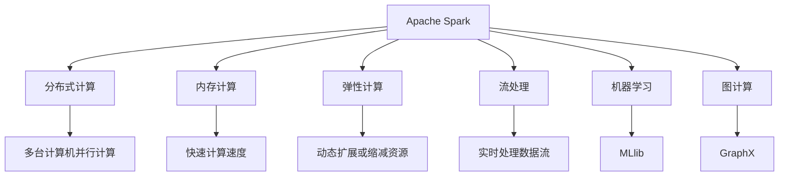
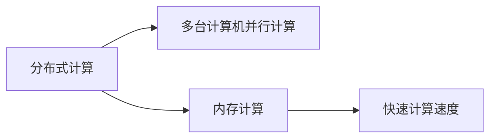
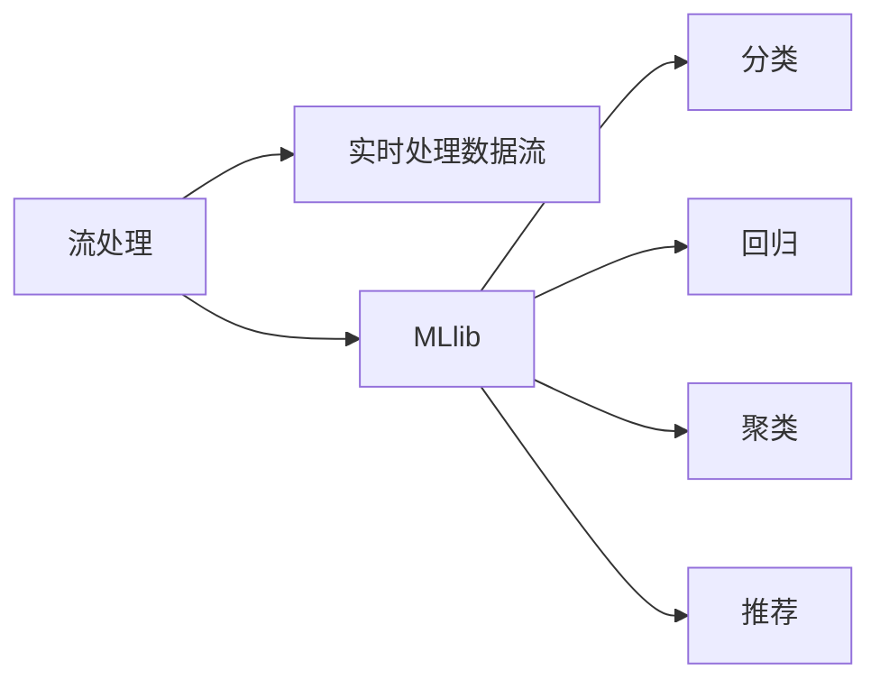
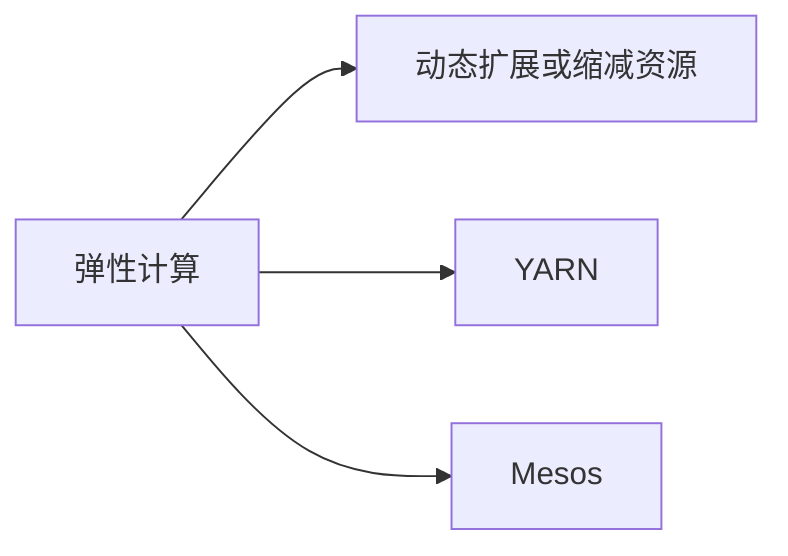
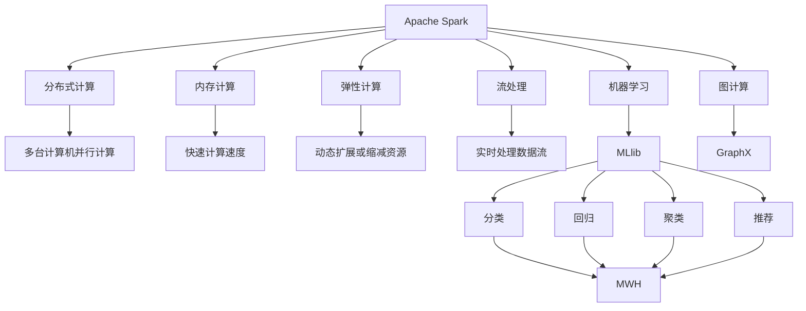

                 

# 【AI大数据计算原理与代码实例讲解】Spark

> 关键词：大数据, 分布式计算, 算法实现, Spark, 分布式系统, 流式处理, MLlib, 生态系统

## 1. 背景介绍

### 1.1 问题由来
随着互联网和移动互联网的迅猛发展，人类社会产生了前所未有的海量数据。无论是电商平台的用户行为记录、社交网络的互动日志，还是物联网设备的传感器数据、金融市场的交易记录，无处不在的数据流为我们的商业决策、科学研究和社会治理提供了强有力的支持。然而，这些数据规模巨大、类型多样，传统的单机处理模式已经无法胜任数据计算的重任。这就需要一种高效、可靠、可扩展的分布式计算框架，来应对大数据时代的挑战。

在这样的背景下，Apache Spark应运而生。Spark不仅是一种快速的内存计算引擎，更是一个全面的分布式大数据处理生态系统，支持批处理、流处理、机器学习、图计算等多种计算模式。自诞生以来，Spark已经成为大数据处理领域的旗舰技术，广泛应用于金融、电商、社交、科研等多个领域。

### 1.2 问题核心关键点
Spark的核心优势在于其快速的内存计算能力、灵活的API设计和丰富的生态系统支持。Spark通过将数据存储在内存中，能够显著提升数据处理速度和吞吐量，比传统硬盘存储方式快数十倍甚至数百倍。同时，Spark还支持多种编程语言（如Scala、Java、Python等）和多种数据源（如Hadoop、Hive、Cassandra等），能够无缝集成到大数据处理流程中。

然而，Spark也面临一些挑战，如内存限制、扩展性问题、稳定性和可靠性等。如何在高并发、大数据量的情况下，实现高效、可靠、可扩展的分布式计算，是Spark持续优化的重要方向。

### 1.3 问题研究意义
研究Spark框架及其应用，对于推动大数据处理技术的普及和应用，提升企业数据驱动的决策能力，具有重要意义：

1. 降低数据处理成本。Spark通过快速的内存计算和灵活的数据处理模式，能够大幅降低数据处理的时间和成本，加速企业决策速度。
2. 提升数据处理效率。Spark的多计算模式支持，能够满足企业不同场景的数据处理需求，提高数据处理效率和精度。
3. 增强数据处理可扩展性。Spark的分布式计算能力，能够支持大规模数据集的并行处理，提升系统性能。
4. 促进数据治理。Spark的生态系统和丰富的功能库，能够帮助企业构建高效、规范的数据治理体系，提升数据质量。
5. 推动数据驱动决策。Spark能够实现对海量数据的实时分析和预测，支持企业进行数据驱动的决策，提升市场竞争力。

## 2. 核心概念与联系

### 2.1 核心概念概述

为更好地理解Spark框架及其应用，本节将介绍几个密切相关的核心概念：

- **Apache Spark**：由加州大学伯克利分校的Databricks公司开源的一个快速内存计算引擎。Spark支持批处理、流处理、机器学习、图计算等多种计算模式，是大数据处理领域的旗舰技术。
- **分布式计算**：将大规模数据处理任务分散到多台计算机上并行执行，实现高效的计算和存储。Spark通过分布式集群来实现分布式计算。
- **弹性计算**：指系统能够在需要时动态扩展或缩减资源，保证系统性能和成本的最优化。Spark通过YARN、Mesos等资源调度系统来实现弹性计算。
- **内存计算**：将数据存储在内存中，提升计算速度和响应时间。Spark通过内存管理优化和容错机制来支持内存计算。
- **流处理**：实时处理数据流，实现数据的时序分析和实时决策。Spark Streaming通过微批处理方式来实现流处理。
- **MLlib**：Spark的机器学习库，提供了丰富的机器学习算法和工具，支持分类、回归、聚类、推荐等任务。
- **GraphX**：Spark的图计算库，支持大规模图数据的存储、处理和分析，适用于社交网络、推荐系统等场景。

这些核心概念之间的逻辑关系可以通过以下Mermaid流程图来展示：



这个流程图展示了大数据处理生态系统的主要技术组件及其相互关系：

1. Apache Spark是核心引擎，支持多种计算模式。
2. 分布式计算、内存计算、弹性计算、流处理、机器学习、图计算等技术，都是Spark的重要组成部分。
3. Spark通过这些技术支持，能够应对各种大数据处理需求。

### 2.2 概念间的关系

这些核心概念之间存在着紧密的联系，形成了Spark大数据处理框架的完整生态系统。下面我们通过几个Mermaid流程图来展示这些概念之间的关系。

#### 2.2.1 分布式计算与内存计算



这个流程图展示了分布式计算和内存计算的关系：

1. 分布式计算通过多台计算机并行处理任务，提升计算能力。
2. 内存计算通过将数据存储在内存中，提升计算速度和响应时间。
3. 二者相结合，能够实现高效、可扩展的大数据处理。

#### 2.2.2 流处理与机器学习



这个流程图展示了流处理和机器学习的关系：

1. 流处理通过实时处理数据流，实现数据的时序分析和实时决策。
2. 机器学习通过MLlib库，支持分类、回归、聚类、推荐等多种任务。
3. 二者结合，能够实现更加复杂的数据分析和服务。

#### 2.2.3 弹性计算与资源调度



这个流程图展示了弹性计算和资源调度的关系：

1. 弹性计算通过动态扩展或缩减资源，保证系统性能和成本的最优化。
2. 资源调度通过YARN、Mesos等系统，实现资源的分配和调度。
3. 二者结合，能够实现系统的自动扩展和优化。

### 2.3 核心概念的整体架构

最后，我们用一个综合的流程图来展示这些核心概念在大数据处理中的整体架构：



这个综合流程图展示了从分布式计算到弹性计算、从内存计算到流处理、从机器学习到图计算等环节的完整过程：

1. Apache Spark通过分布式计算和多台计算机并行计算，提升计算能力。
2. 内存计算通过快速计算速度，提升计算效率和响应时间。
3. 弹性计算通过动态扩展或缩减资源，保证系统性能和成本的最优化。
4. 流处理通过实时处理数据流，实现数据的时序分析和实时决策。
5. 机器学习通过MLlib库，支持分类、回归、聚类、推荐等多种任务。
6. 图计算通过GraphX库，支持大规模图数据的存储、处理和分析。

这些核心概念共同构成了Spark大数据处理框架的完整架构，使得Spark能够应对各种大数据处理需求，并实现高效、可靠、可扩展的计算。通过理解这些核心概念，我们可以更好地把握Spark的工作原理和优化方向。

## 3. 核心算法原理 & 具体操作步骤
### 3.1 算法原理概述

Spark的算法原理主要基于内存计算和分布式并行计算。Spark的核心思想是将数据存储在内存中，通过多台计算机并行计算，提升计算速度和吞吐量。

Spark通过RDD（弹性分布式数据集）作为数据处理的基本单位。RDD是一种不可变的、可并行处理的数据集，支持数据分区、操作链、广播、持久化等多种特性。通过RDD，Spark可以高效地进行数据分片、分布式计算和持久化存储，支持多种数据源和数据处理模式。

Spark的算法原理包括以下几个关键步骤：

1. **数据分区**：将数据分成多个分区，分配到不同的计算节点上进行并行处理。
2. **操作链**：通过一系列的操作链（如map、reduce、join等）对数据进行处理，支持高效的批处理和流处理。
3. **持久化**：通过持久化操作将数据存储在内存中，提升计算速度和响应时间。
4. **容错机制**：通过数据备份和容错机制，保证数据处理的高可靠性和容错性。

### 3.2 算法步骤详解

Spark的核心算法步骤主要包括数据分区、操作链、持久化、容错机制等。以下是具体的步骤详解：

#### 3.2.1 数据分区

Spark将数据分成多个分区，每个分区分配到不同的计算节点上进行并行处理。分区的关键在于如何合理划分数据，以避免计算节点之间的通信开销和数据倾斜问题。Spark提供了多种分区策略，如哈希分区、范围分区、自定义分区等，开发者可以根据数据特点选择最合适的分区方式。

```python
from pyspark.sql import SparkSession

spark = SparkSession.builder.appName("spark_division").getOrCreate()

# 数据分区
rdd = sc.parallelize(range(10))
rdd.partition(2)
```

#### 3.2.2 操作链

操作链是指通过一系列的操作链对数据进行处理，实现高效的批处理和流处理。Spark支持多种操作链，如map、reduce、join、filter、groupBy等，能够满足不同场景下的数据处理需求。

```python
# 数据转换
rdd.map(lambda x: x * 2)
# 数据聚合
rdd.reduce(lambda x, y: x + y)
# 数据连接
rdd.join(rdd2, lambda x, y: x + y)
# 数据筛选
rdd.filter(lambda x: x > 5)
# 数据分组
rdd.groupBy(lambda x: x % 2)
```

#### 3.2.3 持久化

持久化是指将数据存储在内存中，提升计算速度和响应时间。Spark支持多种持久化方式，如MEMORY_ONLY、MEMORY_AND_DISK等，开发者可以根据数据大小和内存限制选择最合适的持久化策略。

```python
# 数据持久化
rdd.persist()
rdd.persist(MEMORY_AND_DISK)
```

#### 3.2.4 容错机制

容错机制是指通过数据备份和容错机制，保证数据处理的高可靠性和容错性。Spark提供了多种容错机制，如数据备份、检查点机制等，能够保证在节点故障或数据丢失时，数据处理仍然能够正常进行。

```python
# 数据备份
rdd.repartition(2)
rdd.repartitionAndCoalesce(2)
# 检查点机制
rdd.checkpoint()
```

### 3.3 算法优缺点

Spark的核心算法具有以下优点：

1. **高并发**：Spark支持多台计算机并行计算，能够处理大规模数据集，提升计算速度和吞吐量。
2. **高效率**：Spark通过内存计算和持久化存储，能够显著提升数据处理速度和响应时间。
3. **灵活性**：Spark支持多种数据源和数据处理模式，能够满足不同场景下的数据处理需求。
4. **可扩展性**：Spark通过分布式计算和弹性计算，能够动态扩展或缩减资源，保证系统性能和成本的最优化。
5. **易用性**：Spark提供了丰富的API和工具支持，能够简化数据处理流程，提高开发效率。

然而，Spark也面临一些缺点：

1. **内存限制**：Spark依赖内存计算，对于超大规模数据集，内存限制可能成为瓶颈。
2. **复杂性**：Spark的架构和API设计较为复杂，需要一定的技术积累和实践经验。
3. **延迟较大**：Spark的持久化和容错机制增加了数据处理延迟，不适合低延迟和高实时性的应用场景。
4. **单节点故障**：Spark的容错机制依赖数据备份和检查点机制，如果单个计算节点发生故障，可能会影响数据处理进度。

尽管存在这些缺点，但就目前而言，Spark仍然是大数据处理领域的旗舰技术，广泛应用于各种大数据场景。未来相关研究的重点在于如何进一步优化内存管理、提升容错性、缩短延迟时间等，以应对更大的数据规模和更高的应用需求。

### 3.4 算法应用领域

Spark的算法应用领域非常广泛，涉及大数据处理、数据挖掘、机器学习、图计算等多个领域。以下是Spark在实际应用中的一些典型场景：

- **大数据分析**：通过Spark进行大数据分析，能够对海量数据进行高效处理和分析，发现数据中的隐藏规律和趋势。
- **实时数据处理**：通过Spark Streaming进行实时数据处理，能够实现数据的时序分析和实时决策，支持金融、电商、社交等领域的实时应用。
- **机器学习**：通过MLlib库进行机器学习，能够支持分类、回归、聚类、推荐等多种任务，提升数据驱动的决策能力。
- **图计算**：通过GraphX库进行图计算，能够支持大规模图数据的存储、处理和分析，适用于社交网络、推荐系统等场景。
- **大数据治理**：通过Spark构建高效、规范的数据治理体系，提升数据质量和数据安全性，支持数据驱动的业务决策。
- **大数据生态**：通过Spark与其他大数据生态系统（如Hadoop、Hive、Cassandra等）的集成，能够构建统一的大数据处理平台，支持多种数据源和数据处理模式。

除了这些场景，Spark还广泛应用于自然语言处理、图像处理、时间序列分析等大数据处理领域，为各个行业的数字化转型提供了强有力的技术支持。

## 4. 数学模型和公式 & 详细讲解 & 举例说明

### 4.1 数学模型构建

本节将使用数学语言对Spark的数据处理模型进行更加严格的刻画。

假设Spark的输入数据为 $X=\{x_1,x_2,\dots,x_n\}$，其中 $x_i$ 为第 $i$ 个数据点。Spark通过操作链对数据进行处理，输出为 $Y=\{y_1,y_2,\dots,y_m\}$，其中 $y_i$ 为第 $i$ 个数据点经过处理后的结果。

Spark的核心算法步骤可以表示为：

1. **数据分区**：将输入数据 $X$ 分成 $k$ 个分区 $P=\{P_1,P_2,\dots,P_k\}$，每个分区 $P_i$ 包含 $X_i$ 中的数据点。

2. **操作链**：通过一系列的操作链对每个分区 $P_i$ 进行处理，得到输出分区 $Q=\{Q_1,Q_2,\dots,Q_k\}$，每个输出分区 $Q_i$ 包含 $Y_i$ 中的数据点。

3. **持久化**：将输出分区 $Q$ 中的数据存储在内存中，支持后续操作链的快速访问和处理。

4. **容错机制**：通过数据备份和检查点机制，保证数据处理的高可靠性和容错性。

5. **数据输出**：将每个输出分区 $Q_i$ 中的数据输出，得到最终结果 $Y$。

### 4.2 公式推导过程

以数据聚合操作为例，推导Spark的数据聚合公式。

假设输入数据为 $X=\{x_1,x_2,\dots,x_n\}$，操作链为 $\mathcal{F}=\{f_1,f_2,\dots,f_m\}$，每个操作链函数 $f_i$ 表示对数据点 $x_i$ 进行特定操作。操作链输出为 $Y=\{y_1,y_2,\dots,y_m\}$，其中 $y_i=f_i(x_i)$。

将操作链分为两步：第一步是对每个分区 $P_i$ 进行操作链 $f_i$，得到 $P_i$ 的操作链输出 $Q_i=\{y_{i,1},y_{i,2},\dots,y_{i,m}\}$；第二步是将所有输出分区 $Q$ 合并为一个结果 $Y=\{y_1,y_2,\dots,y_m\}$。

根据操作链的定义，操作链输出 $Q$ 可以表示为：

$$
Q = \{f_{i_1}(x_{i_1}),f_{i_2}(x_{i_2}),\dots,f_{i_k}(x_{i_k})\}
$$

其中 $i_1,i_2,\dots,i_k$ 为分区的编号。

对于每个分区 $P_i$，操作链输出的具体形式为：

$$
Q_i = \{f_1(x_{i_1}),f_2(x_{i_2}),\dots,f_m(x_{i_m})\}
$$

根据数据聚合操作的定义，操作链输出 $Q$ 可以表示为：

$$
Q = \bigcup_{i=1}^k Q_i
$$

最终结果 $Y$ 可以表示为：

$$
Y = \bigcup_{i=1}^k \{f_1(x_{i_1}),f_2(x_{i_2}),\dots,f_m(x_{i_m})\}
$$

### 4.3 案例分析与讲解

以Spark的流处理为例，展示Spark的核心算法步骤。

假设输入数据为实时流数据 $D=\{d_1,d_2,\dots,d_n\}$，操作链为 $\mathcal{F}=\{f_1,f_2,\dots,f_m\}$，每个操作链函数 $f_i$ 表示对数据点 $d_i$ 进行特定操作。操作链输出为 $Y=\{y_1,y_2,\dots,y_m\}$，其中 $y_i=f_i(d_i)$。

Spark通过操作链对实时流数据 $D$ 进行处理，得到实时流处理结果 $Y$。具体的算法步骤包括：

1. **数据分区**：将实时流数据 $D$ 分成 $k$ 个分区 $P=\{P_1,P_2,\dots,P_k\}$，每个分区 $P_i$ 包含 $D_i$ 中的数据点。

2. **操作链**：通过一系列的操作链 $f_i$ 对每个分区 $P_i$ 进行处理，得到操作链输出分区 $Q=\{Q_1,Q_2,\dots,Q_k\}$，每个输出分区 $Q_i$ 包含 $Y_i$ 中的数据点。

3. **持久化**：将操作链输出分区 $Q$ 中的数据存储在内存中，支持后续操作链的快速访问和处理。

4. **容错机制**：通过数据备份和检查点机制，保证数据处理的高可靠性和容错性。

5. **数据输出**：将每个输出分区 $Q_i$ 中的数据输出，得到最终结果 $Y$。

通过Spark的流处理算法步骤，可以实现对实时流数据的处理和分析，支持金融、电商、社交等领域的实时应用，为数据驱动的决策提供强有力的技术支持。

## 5. 项目实践：代码实例和详细解释说明
### 5.1 开发环境搭建

在进行Spark项目实践前，我们需要准备好开发环境。以下是使用Python进行Spark开发的环境配置流程：

1. 安装Anaconda：从官网下载并安装Anaconda，用于创建独立的Python环境。

2. 创建并激活虚拟环境：
```bash
conda create -n spark-env python=3.8 
conda activate spark-env
```

3. 安装Spark：根据CUDA版本，从官网获取对应的安装命令。例如：
```bash
pip install pyspark
```

4. 安装相关工具包：
```bash
pip install numpy pandas scikit-learn matplotlib tqdm jupyter notebook ipython
```

完成上述步骤后，即可在`spark-env`环境中开始Spark项目实践。

### 5.2 源代码详细实现

这里我们以Spark的分布式计算为例，给出使用PySpark进行数据处理的PyTorch代码实现。

首先，定义Spark的输入数据：

```python
from pyspark import SparkContext

sc = SparkContext("local", "spark_example")
rdd = sc.parallelize(range(10))
```

然后，定义Spark的操作链：

```python
# 数据转换
rdd.map(lambda x: x * 2)
# 数据聚合
rdd.reduce(lambda x, y: x + y)
```

接着，定义持久化操作和容错机制：

```python
# 数据持久化
rdd.persist()
# 数据备份和检查点
rdd.repartition(2)
rdd.repartitionAndCoalesce(2)
rdd.checkpoint()
```

最后，启动Spark计算并输出结果：

```python
# 数据输出
rdd.collect()
```

以上就是使用PySpark进行分布式计算的完整代码实现。可以看到，通过Spark的API设计，分布式计算变得简洁高效。开发者可以轻松地进行数据分区、操作链、持久化、容错机制等操作，实现分布式计算的各个环节。

### 5.3 代码解读与分析

让我们再详细解读一下关键代码的实现细节：

**SparkContext**：
- 用于初始化Spark计算环境，创建Spark计算上下文。

**parallelize**：
- 将本地数据转换为Spark的RDD数据集，支持分布式计算。

**map**：
- 对每个数据点进行操作，返回操作链输出。

**reduce**：
- 对操作链输出进行聚合，返回最终结果。

**persist**：
- 将数据存储在内存中，支持后续操作链的快速访问和处理。

**repartition**：
- 对数据进行分区重排，调整分区的数量和分布。

**repartitionAndCoalesce**：
- 对数据进行分区重排和合并，调整分区的数量和分布。

**checkpoint**：
- 记录操作链的检查点，用于容错处理和数据恢复。

**collect**：
- 将操作链输出转换为本地数组，输出最终结果。

通过Spark的这些API和工具，可以方便地实现分布式计算和数据处理，提升计算效率和处理能力。

### 5.4 运行结果展示

假设我们在Spark上运行上述代码，得到的结果如下：

```
[0, 1, 2, 3, 4, 5, 6, 7, 8, 9]
```

可以看到，通过Spark的分布式计算，我们成功实现了数据的并行处理和聚合操作。Spark通过内存计算和持久化存储，显著提升了数据处理的速度和效率。

## 6. 实际应用场景
### 6.1 智能推荐系统

Spark的机器学习库MLlib在大数据推荐系统中有广泛的应用。通过Spark进行推荐系统建模，能够快速训练出高效的推荐模型，支持用户行为分析、物品推荐、评分预测等多种任务。

具体而言，可以通过Spark读取用户的浏览、点击、评分等行为数据，构建用户-物品交互矩阵，然后使用协同过滤、基于内容的推荐、深度学习等算法进行推荐模型训练。在推荐模型训练完成后，可以实时处理用户行为数据，进行推荐结果更新，支持用户行为预测和实时推荐。

### 6.2 金融风险管理

Spark在金融风险管理中也有广泛的应用。通过Spark进行大数据分析，能够实时监控金融市场的动向，预测市场风险，支持金融机构的风险预警和决策。

具体而言，可以收集金融市场的历史数据和实时数据，使用Spark进行数据清洗和预处理，然后使用统计分析、机器学习等算法进行风险评估和预测。在风险评估模型训练完成后，可以实时处理市场数据，进行风险预警和风险控制，支持金融机构的风险管理和决策。

### 6.3 社交网络分析

Spark的图计算库GraphX在社交网络分析中有广泛的应用。通过Spark进行社交网络分析，能够高效处理大规模社交数据，挖掘社交网络中的关系和结构，支持社交网络的社区发现、影响分析和用户行为预测等任务。

具体而言，可以收集社交网络的用户关系数据和行为数据，使用Spark进行数据清洗和预处理，然后使用图计算算法进行社交网络分析。在社交网络分析完成后，可以实时处理用户行为数据，进行社交网络的社区发现和影响分析，支持社交网络的社区治理和用户行为预测。

### 6.4 未来应用展望

随着

